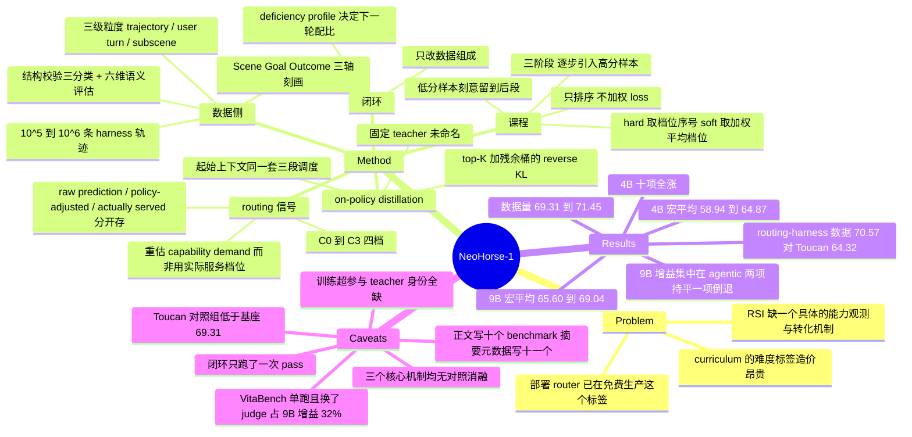

## Summary

NeoHorse-1 的主张是：一个已经在线上跑的 routing harness 自带 recursive self-improvement 需要的那个反馈机制——router 为每个 user turn 记下"预测的能力档位、实际服务的档位、随后发生的交互"，这份记录既是训练语料，也是一份不用额外标注的难度标签，于是同一个 routing score 被拿去给 SFT 排三阶段课程、给 on-policy distillation 调度起始上下文、并按能力短板决定下一轮数据配比。十个 benchmark 的宏平均在 4B 上从 58.94（Qwen3.5-4B 基座）升到 64.87，在 9B 上从 65.60 升到 69.04。但论文自陈只跑完一轮 evaluation–selection–update，递归从未真正发生；课程排序、on-policy distillation、能力导向配比这三个核心机制无一有对照消融，Section 5.2 仅有的两组受控实验只比了数据来源与数据量。

## Problem & Motivation

RSI 的讨论通常停在"系统参与改进自己"这个抽象层，缺一个具体机制回答两件事：系统从哪里看见自己的能力边界，又怎么把这份证据转成下一轮训练。作者的观察是，一个正在服务用户的 routing harness 同时产出三类可复用信号：真实执行轨迹（可直接作监督）、routing 记录（对本轮能力需求的预测）、执行结果（哪里没做成）。第二类是别处要花钱造的——curriculum learning 通常依赖显式难度标签或数据集专属启发式，而 routing 系统按 request 与上下文条件给出的预测本身就是"这一轮需要多强的能力"的估计。

论文对这个信号加了一条自己的限制：实际被服务的档位不能当难度标签，因为它掺了用户覆写、服务可用性与部署策略。所以课程用的是重新估计的 capability demand，而不是"最后哪个模型接了这一单"。这个区分是全文少数几处显式的机制自觉。

## Method

### 数据侧：把 harness 流量变成训练样本

语料按三级粒度组织。trajectory 是 harness 执行的完整交互；user turn 从一次用户请求起到下一次用户请求或任务终止为止，是序列化后的基本训练单元（tool result 与 harness 注入的消息不开启新 turn）；subscene 把共享同一局部目标的相邻 user turn 归为一组，是语义刻画的单位。序列化用 Qwen3.5 chat template，当前 turn 的 reasoning 保留、历史 turn 的 reasoning 丢弃，loss 只落在当前 turn 的 assistant target span 上（Eq. 1 按被监督 token 数归一，而非按序列长度或轮数）。

准入走三道闸。第一道是精确与近似去重，同一套匹配基建同时把与评测项重叠的训练候选剔除。第二道是规则式结构校验，重建请求、响应、tool call、tool observation 与终止事件，检查因果顺序与 tool-call/result 配对闭合，输出三种处置：internally complete 直接进入语义评估，partially recoverable 只贡献因果闭合的子轨迹，quarantined 丢弃。第三道是六维语义评估——goal attainment、instruction adherence、tool use、evidence consistency、error recovery、termination，每维判 PASS / WARN / FAIL / NOT_EVALUATED，评估覆盖率单独存储；高确定性失败用确定性规则检出，需要任务级解读的交给一个只能引用轨迹内显式证据的 semantic judge。证据缺失或 judge 调用中断一律不折算成 PASS，这条写得很明确。

subscene 层再按三轴刻画：Scene 描述用户在做什么、在什么语境下，Goal 把目标拆成验收标准并标记跨轮关系（新建、延续、修改、恢复、歧义），Outcome 记录相对目标可验证的结果，用来把"任务真的被满足"和"流程跑完了"分开。语料规模只给了数量级：10^5 到 10^6 条 harness 轨迹，外加公开数据补覆盖面。

### routing 信号与三阶段课程

router 在 user turn 级估计能力需求，分到四档：C0 处理有界低风险请求，C1 是通用默认档，C2 支持多步推理与执行，C3 给最高能力或可靠性（C3 路径可能由多个 proposer 加一个 aggregator 组成）。语料对每轮同时保留 router 原始预测、策略调整后的决策、以及实际服务的档位三个字段，让预测、约束、执行三者可以分开分析。

课程分数按 Eq. 2 定义两种口径：hard ordering 取分配到的档位序号，soft ordering 取按各档归一化分数加权的平均档位序号，后者能区分同档但支持分布不同的样本。训练分三阶段、每段约三分之一样本，逐步引入高分样本，但刻意把一部分低分样本留到后段，避免训练末期全是高需求交互。阶段之间不重置 optimizer、不重启学习率调度，每个样本每轮用一次。关键取舍是：分数只决定样本"什么时候出现"，不参与 loss 加权。

### routing-guided on-policy distillation

SFT 学的是录下来的 assistant 响应，部署时模型面对的是自己生成的前缀，两者分布不一致。OPD 把起始上下文取自记录中每个 assistant 响应之前的位置，用同一个 Eq. 2 打分，套同样的三段调度。student 从上下文生成一条响应，一个固定 teacher 在 student 的每个前缀位置给出 next-token 分布；为压缩监督，双方分布都被折叠到 rollout student 的 top-K 候选加一个残余概率桶，目标是 response-normalized reverse KL（Eq. 3），只更新 student。rollout checkpoint 会随训练推进刷新，但刷新后的参数在优化期间冻结。teacher 具体是哪个模型、K 取多少，全文都没写。

### 闭环那一步

每轮用当前 checkpoint 在一个与训练去污染过的分层评测集上跑，结果按属性、质量维度、outcome 状态与 routing 档位聚合成 model-deficiency profile，据此把下一轮训练配比往表现弱的区域挪，同时保住覆盖面。已验证成功的轨迹提供正向监督，有信息量的失败标出需要补充或重新配比的区域；这一步只改数据组成，不引入额外的 failure-specific 目标。"RSI"这个词在论文里的全部落点就是这一步。

## Key Results

评测设置：同一 benchmark 内所有由作者评测的模型共用 benchmark 专属 harness、tool interface、context limit 与 interaction budget；NeoHorse-1 与 Qwen3.5 基座按 Qwen3.5 官方推荐参数（temperature 1.0、top-p 0.95、top-k 20、presence penalty 1.5）在 thinking mode 下评测，SGLang v0.5.17 部署。QwenClawBench、WorkBuddy Bench、τ²-Bench 各跑三次取算术平均，PinchBench 与 VitaBench 各只跑一次，全表无标准差或误差棒。QwenClawBench 与 PinchBench 用 OpenSquilla 作 agent harness，WorkBuddy Bench 用其官方原生 harness，VitaBench 用其官方框架但把 user simulator 与 judge 都换成 DeepSeek-V4-Flash（原推荐模型已不可用）。

**4B（Table 1，Avg. 为十项无权平均）**

| Model | BFCL v4 | Vita | τ² | Pinch | WorkBuddy | QwenClaw | HumanEval | LCB v6 | IFBench | IFEval | **Avg.** |
|:--|--:|--:|--:|--:|--:|--:|--:|--:|--:|--:|--:|
| Qwen3.5-4B（基座） | 61.02 | 21.50 | 84.29 | 71.19 | 24.62 | 38.47 | 87.20 | 53.71 | 60.33 | 87.06 | 58.94 |
| NeoHorse-1-4B | 61.79 | 32.00 | 88.46 | 77.33 | 34.41 | 44.68 | 96.95 | 59.43 | 65.33 | 88.35 | **64.87** |
| Δ | +0.77 | +10.50 | +4.17 | +6.14 | +9.79 | +6.21 | +9.75 | +5.72 | +5.00 | +1.29 | +5.93 |

**9B（Table 2）**

| Model | BFCL v4 | Vita | τ² | Pinch | WorkBuddy | QwenClaw | HumanEval | LCB v6 | IFBench | IFEval | **Avg.** |
|:--|--:|--:|--:|--:|--:|--:|--:|--:|--:|--:|--:|
| Qwen3.5-9B（基座） | 64.88 | 31.25 | 88.04 | 74.55 | 39.60 | 44.04 | 92.68 | 65.14 | 66.33 | 89.46 | 65.60 |
| NeoHorse-1-9B | 67.43 | 42.25 | 90.82 | 82.25 | 40.15 | 48.73 | 98.17 | 65.14 | 66.33 | 89.09 | **69.04** |
| Δ | +2.55 | +11.00 | +2.78 | +7.70 | +0.55 | +4.69 | +5.49 | 0.00 | 0.00 | −0.37 | +3.44 |

两个尺度的增益形状完全不同。4B 是全面提升，十项全涨，agentic 六项平均 +6.26、非 agentic 四项平均 +5.44。9B 的提升几乎全部集中在 agentic 一侧：agentic 六项平均 +4.88，非 agentic 四项平均只有 +1.28，其中 LiveCodeBench v6 与 IFBench 与基座分毫不差（65.14 / 66.33 两处精确相等），IFEval 还退了 0.37。论文把这描述为"instruction following 大体持平，一项轻微下降"，这个说法准确，但它同时意味着在更强的基座上，这套 post-training 已经只对交互式执行有效。

VitaBench 的权重值得单独拎出来。它在两个尺度上都是单项增幅最大的（+10.50 / +11.00），而它恰恰是只跑一次、且把 user simulator 与 judge 都换成了非原推荐模型的那一个。按十项无权平均计，VitaBench 单项就占了 9B 全部增益的 32.0%（11.00 / 34.39）、4B 增益的 17.7%（10.50 / 59.34）。HumanEval 是第二个需要打折的项：Table 2 里 Gemma-4-12B-it 已经拿到 100.00，Nanbeige-4.2-3B 是 98.78，这个 benchmark 在该能力段基本饱和，而它在 4B 上贡献了 +9.75。

跨尺度对比上，NeoHorse-1-4B 的 64.87 仍低于 Qwen3.5-9B 的 65.60，但差距从 6.66 收窄到 0.73；逐项看是五项追平或超过 Qwen3.5-9B（VitaBench、τ²、PinchBench、QwenClawBench、HumanEval），五项落后（BFCL、WorkBuddy、LiveCodeBench、IFBench、IFEval）。另需注意 Table 1 的加粗"最优"混合了自跑结果与官方报告结果——Nanbeige-4.2-3B 的 LiveCodeBench 72.50 带星号，来自其官方博客或技术报告。

**Section 5.2 的两组受控实验**（均为 4B、从 Qwen3.5-4B 初始化、五项开发集）

| 训练数据 | LCB | HumanEval | IFBench | BFCL | τ² | Avg. |
|:--|--:|--:|--:|--:|--:|--:|
| Qwen3.5-4B 基座（Fig. 7 文本给出 69.31） | 53.71 | 87.20 | 60.33 | 61.02 | 84.29 | 69.31 |
| Toucan 公开合成工具数据 | 49.14 | 87.80 | 56.33 | 54.77 | 73.54 | 64.32 |
| routing-harness 数据 | 53.14 | 96.34 | 61.33 | 57.20 | 84.85 | 70.57 |

论文报告的是最后两行之差 +6.26，并据此主张 routing 中介的交互比公开合成轨迹提供更强、更可迁移的监督。把基座行补回去，这个对比的形状就变了：Toucan 那一轮训练把模型从 69.31 打到 64.32，五项里四项掉（τ² −10.75、BFCL −6.25、LCB −4.57、IFBench −4.00）；routing-harness 那一轮相对基座只有 +1.26，其中 HumanEval 单项贡献 +1.83，其余四项净 −0.57（BFCL 反而掉了 3.82）。也就是说，+6.26 的分母是一个显著低于基座的对照组，而论文全文没有任何一处指出 Toucan 轮低于基座。

数据量实验用严格嵌套的子集，固定初始化、优化、packing 与每个子集的 pass 数，五项开发集均值从 69.31 稳步升到 71.45（+2.14，横轴为对数尺度的 unique supervised token 数）。作为参照，最终发布的 NeoHorse-1-4B 在同样五项上是 74.39，两组受控实验都远低于它，说明这些消融跑在与发布模型不同的规模或配置上，不能用来解释主表的增益来自哪里。

轨迹层面给了三个案例（QwenClawBench 调度、WorkBuddy 代码修复、PinchBench 数据分析）加附录三个完整对照。PinchBench 那例里 9B 相对 4B 把模型请求数、执行时间、token 用量分别降低约 70.8%、76.7%、83.6%，但这是单条代表性轨迹而非聚合统计。

## Evidence Ledger

| Claim ID | Claim | Type | Source locator | Evidence excerpt | Status |
|:--|:--|:--|:--|:--|:--|
| C1 | Table 1 中 Qwen3.5-4B Avg. 58.94、NeoHorse-1-4B Avg. 64.87，Avg. 为同行十个 benchmark 列的无权平均 | number | Table 1, Avg. 列 | "Qwen3.5-4B ... 58.94"; "NeoHorse-1-4B ... 64.87" | source-verified（重算 589.39/10、648.73/10 与表内一致） |
| C2 | Table 2 中 Qwen3.5-9B Avg. 65.60、NeoHorse-1-9B Avg. 69.04，同为十列无权平均 | number | Table 2, Avg. 列 | "64.88,31.25,88.04,74.55,39.60,44.04,92.68,65.14,66.33,89.46,65.60" | source-verified（重算 655.97/10、690.36/10 一致） |
| C3 | 宏平均覆盖的正是十个 benchmark；三域的 τ²-Bench 只占一列 | benchmark-setting | Table 1/2 列头 + Sec 5 "Benchmarks." | "τ²-Bench ... in the Airline, Retail, and Telecom domains" | source-verified |
| C4 | 论文正文（自身 abstract 与 Sec 6）写 "ten benchmarks"，arXiv 摘要页元数据写 "eleven benchmarks"，且只有 v1、无 v2 | number | 正文 Abstract / Sec 6 vs arXiv abs 页 + Submission history | 正文 "Across ten benchmarks spanning"；abs 页 "Across eleven benchmarks covering" | source-verified（确为论文自身元数据与正文不一致） |
| C5 | 58.94→64.87 是 NeoHorse-1-4B 对其自身基座 Qwen3.5-4B，双方同 harness、同 tool interface、同预算、同 Qwen3.5 推荐推理参数、均开 thinking mode | benchmark-setting | Sec 5, "Evaluation Configurations" | "Both NeoHorse-1 and these Qwen3.5 baselines are evaluated in thinking mode" | source-verified |
| C6 | NeoHorse-1-4B 在 Table 1 十列上全部高于 Qwen3.5-4B | comparison | Table 1 + Sec 5 "Broad gains at both model scales" | "NeoHorse-1-4B outperforms Qwen3.5-4B on every benchmark for which both models have available results" | source-verified（逐列核对） |
| C7 | Table 2 中 NeoHorse-1-9B 与基座在 LiveCodeBench v6（65.14）与 IFBench（66.33）精确相等，IFEval 低 0.37（89.09 vs 89.46） | number | Table 2 | LCB "65.14" 两行相同；IFEval "89.09" vs "89.46" | source-verified |
| C8 | VitaBench 是两个尺度上单项增幅最大者：4B 21.50→32.00（+10.50），9B 31.25→42.25（+11.00） | number | Table 1 & 2, VitaBench 列 | "21.50" → "32.00"；"31.25" → "42.25" | source-verified |
| C9 | VitaBench 与 PinchBench 各只跑一次，QwenClawBench / WorkBuddy / τ² 跑三次取均值；全表无标准差或误差棒 | benchmark-setting | Sec 5, "Repeated Runs and Aggregation" | "PinchBench and VitaBench are each evaluated with a single run" | source-verified（全文检索无 "±" 与 standard deviation） |
| C10 | VitaBench 的 user simulator 与 judge 均换成 DeepSeek-V4-Flash，因原推荐模型已不可用 | benchmark-setting | Sec 5, "Harness-based Agents" | "we use DeepSeek-V4-Flash as both the user-simulator model and the judge model because the originally recommended models are no longer available" | source-verified |
| C11 | 全文（含附录）没有任何对照消融隔离课程排序、on-policy distillation 与能力导向配比；Sec 5.2 的两组受控实验只变数据来源与数据量 | causal-mechanism | Sec 5.2 全节 + 全文扫描 | "we compare our routing-harness data with Toucan"；"how performance changes as the amount of routing-harness supervision increases" | source-verified（检索 ablat / random order / SFT-only 等均无命中） |
| C12 | 论文自陈结果只反映 evaluation–selection–update 闭环的一次 pass，未跨模型代际迭代 | causal-mechanism | Sec 6, Conclusion and Discussion | "The results also reflect a single pass of the evaluation–selection–update loop" | source-verified |
| C13 | Table 3 在同配置、同基座、同课程调度、同 optimizer / seed / packing / 评测协议、训练预算接近的条件下，五项均值 70.57（routing-harness）vs 64.32（Toucan），差 +6.26 | number | Table 3, Avg. 列 | "Public agent data (Toucan) ... 64.32"; "Routing-harness data ... 70.57"; "Difference ... +6.26" | source-verified（重算 321.58/5、352.86/5 一致） |
| C14 | Table 3 与 Fig. 7 的五项是 LiveCodeBench、HumanEval、IFBench、BFCL V4、τ²-Bench，即 Table 3 的 "IF" 列是 IFBench 而非 IFEval | benchmark-setting | Table 3 列头 + Sec 5.2 "Scaling routing-harness supervision" | "LiveCodeBench, HumanEval, IFBench, BFCL V4, and τ²-Bench" | source-verified |
| C15 | Qwen3.5-4B 基座在这五项上的无权均值为 69.31（论文在 Fig. 7 讨论中即以 69.31 为基座值）；因此 Toucan 轮的 64.32 低于基座，routing-harness 轮的 70.57 只高出基座 1.26 | number | Sec 5.2 "Scaling routing-harness supervision" + Table 1 逐格重算 | "The development-suite average increases steadily from 69.31 for the base model to 71.45" | source-verified（重算 (53.71+87.20+60.33+61.02+84.29)/5 = 69.31 精确一致；论文全文未提及 Toucan 轮低于基座） |
| C16 | 数据量实验用严格嵌套子集，固定初始化、优化、packing 与 pass 数，五项均值从 69.31 升至 71.45 | number | Sec 5.2 + Figure 7 | "Model initialization, optimization, packing, and the number of passes over each subset are held fixed" | source-verified |
| C17 | 主语料为 10^5–10^6 量级的 harness 轨迹，另加公开数据；论文未宣布释出该语料 | license-code | Sec 3.1 Data Composition | "The primary corpus consists of on the order of 10^5–10^6 harness-generated trajectories" | source-verified（正文无 release / open-source 命中；GitHub 与 HF 仅有权重） |
| C18 | NeoHorse-1-4B 的 64.87 仍低于 Qwen3.5-9B 的 65.60；逐项为五项追平或超过、五项落后 | comparison | Table 1 + Table 2 逐格重算 | 32.00>31.25、88.46>88.04、77.33>74.55、44.68>44.04、96.95>92.68 | source-verified（独立重算计数一致） |
| C19 | QwenClawBench 与 PinchBench 用 OpenSquilla 作 agent harness，而 OpenSquilla 同时是作者自家部署模型池中的 harness 之一，其引用 [61] 作者为 TokenRhythm Technologies，即核心作者的第一单位 | benchmark-setting | Sec 5 "Harness-based Agents" + Sec 1 + Ref [61] + Appendix A | "QwenClawBench and PinchBench are evaluated using OpenSquilla [61]"; "[61] TokenRhythm Technologies (2026) OpenSquilla" | source-verified |
| C20 | router 分四档 C0–C3；课程分数（hard = 档位序号，soft = 加权平均档位）只用于跨三个约等分阶段排序，不参与 SFT loss 加权；部分低分样本刻意留到后段 | causal-mechanism | Sec 3.4 + Sec 4.2 | "We use si to construct the curriculum described next, not to reweight the SFT loss" | source-verified |
| C21 | OPD 目标为 response-normalized reverse KL，在 rollout student 的 top-K 候选加一个残余桶上计算，teacher 固定、只更新 student | causal-mechanism | Sec 4.3 "Distillation objective" / Eq. 3 | "we minimize the response-normalized reverse KL"; "Only the student is updated" | source-verified（论文全文未指明 teacher 是哪个模型，也未给出 K 的数值） |
| C22 | 主模型训练的学习率、batch size、GPU 数、训练 token 量与 wall-clock 成本全文（含附录）均未报告 | number | 全文 + Appendix 扫描 | 仅有定性表述 "without resetting the optimizer or restarting the learning-rate schedule between stages" | source-verified（检索 learning rate / batch size / GPU / H100 / A100 均无数值命中） |
| C23 | PinchBench 案例中 9B 相对 4B 把模型请求数、执行时间、token 用量分别降低约 70.8% / 76.7% / 83.6%，为单条代表性轨迹而非聚合统计 | number | Sec 5.1, PinchBench trajectory | "reduces the number of model requests, execution time, and token usage by approximately 70.8%, 76.7%, and 83.6%" | source-verified |
| C24 | 单位含 TokenRhythm Technologies、Infinigence AI、清华、北大、港中文、Visionplus Capital、WX Capital、阿里巴巴；通讯作者为 Yu Wang 与 Yunhe Wang | license-code | Appendix A, Contributions | "1TokenRhythm Technologies 2Infinigence AI 3Tsinghua University ... 8Alibaba Group"; "Yu Wang3,*, Yunhe Wang1,*" | source-verified |
| C25 | GitHub 仓库以 Apache-2.0 释出 4B 与 9B 权重（上游为 Qwen3.5-4B / 9B），只提供推理示例而非训练管线，未释出任何训练数据集 | license-code | GitHub README（License / Model Downloads / 文件树）+ HF collection | "NeoHorse-1 is released under the Apache License 2.0. The upstream models are Qwen3.5-4B and Qwen3.5-9B" | source-verified |
| C26 | 增益形状：4B 上 agentic 六项平均 +6.26、非 agentic 四项平均 +5.44；9B 上分别为 +4.88 与 +1.28 | number | Table 1 / Table 2 逐格重算 | 由 C1、C2 已核实单元格直接计算 | source-verified（组成数值） |
| C27 | routing-harness 轮相对基座仅 +1.26，其中 HumanEval 单项贡献 +1.83（53.71→53.14 −0.57、87.20→96.34 +9.14、60.33→61.33 +1.00、61.02→57.20 −3.82、84.29→84.85 +0.56），其余四项净 −0.57 | number | Table 3 + Table 1 逐格重算 | 由 C13、C15 已核实单元格直接计算 | source-verified（组成数值） |

> 25 条送独立 verifier 的 claim 全部 source-verified，无降级、无争议。C26 / C27 是对 C1 / C2 / C13 / C15 中已核实单元格的算术重排，推导本身由笔记作者计算，可由表格直接复核。source-verified 只表示 primary source 确实这么写，不表示结果已被独立复现。C4 的状态指"两处文本确实不一致"这一事实已核实，而非某个数字被证伪。

## Strengths & Weaknesses

**最值得拿走的是那个信号，而不是那个模型。** curriculum learning 长期卡在难度标签的成本上，常见做法要么人工标、要么用数据集专属启发式、要么拿模型自己的 loss 反推。NeoHorse 指出线上 router 每天都在为计费和延迟做这件事：它必须预测"这一轮需要多强的能力"才能决定派哪个模型，这个预测是免费的副产品。更要紧的是作者拒绝用"实际服务的档位"当标签，理由是它掺了用户覆写、服务可用性与部署策略，改用请求与历史重新估计。这个区分很干净，也是全文最 simple 且最可迁移的一条：任何跑着分层服务的系统都能照做，代价接近零。

**但论文没有证明这个信号有用。** 三个核心机制里，课程排序没有对照随机顺序或无课程，OPD 没有对照纯 SFT，能力导向配比没有任何形式的对照（C11）。Section 5.2 唯一的两组受控实验回答的是"数据从哪来"和"数据有多少"，这两个问题即使全部成立，也支撑不了标题里的 routing 与 curriculum。换句话说，主表的 +5.93 / +3.44 完全可以是"用高质量真实 agent 轨迹做 SFT + 蒸馏"的普通收益，routing 那一层是否贡献了任何东西，本文没有提供可判定的证据。

**数据来源实验的分母有问题。** Table 3 报的 +6.26 是相对 Toucan，而 Toucan 那一轮把模型从基座的 69.31 打到 64.32，五项里四项掉、τ² 掉了 10.75。真正的对照应该是基座，而相对基座 routing-harness 只有 +1.26，且其中 HumanEval 一项就贡献 +1.83，其余四项净负、BFCL 还掉了 3.82（C27）。论文全文没有一处提到 Toucan 轮低于基座（C15）。这不是数字错误——所有单元格都对——而是参照系的选择让一个"我们的数据在这套配方下几乎没提升，公开数据则明显有害"的结果，读起来像"我们的数据明显更好"。

**RSI 只是一个命名。** 论文自己承认只跑了闭环的一次 pass（C12），这点很诚实，写在 Conclusion 里。问题是标题、摘要、Figure 2 与全篇叙事都建立在"递归"上，而递归恰恰是唯一没被执行的部分。第二次迭代才是所有难题出现的地方：更新后的 checkpoint 回到 harness 会改变 routing 分布本身，从而改变下一轮的课程标签与配比依据，这个自指循环是否收敛、会不会把语料推向模型已经擅长的区域，本文一个字都没有测。目前的证据强度支持的说法是"用部署流量做 agentic post-training 有效"，不是"harness 中介的递归自我改进可行"。

**9B 的结果削弱了论文自己的主张。** 4B 十项全涨，9B 则是 agentic 六项平均 +4.88、非 agentic 四项平均 +1.28，其中两项与基座精确相等、IFEval 退了 0.37（C7、C26）。论文把这解释为"边际收益更集中在交互式执行"，这个解释成立，但同一批证据也支持另一种读法：这套配方的增益随基座变强而快速衰减，而 RSI 的整个卖点恰恰是增益要能跨代累积。跑第二轮之前，无法区分这两种读法。

**VitaBench 承担的权重与它的证据强度不匹配。** 它是单项增幅最大的 benchmark，却是只跑一次、且把 user simulator 和 judge 都换成了非原推荐模型的那一个（C8、C9、C10）。它单项占 9B 全部增益的 32%。把它连同已经饱和的 HumanEval 一起打折，9B 的故事就只剩 PinchBench +7.70 与 QwenClawBench +4.69，而这两个恰好是用作者自家 OpenSquilla harness 跑的（C19）——训练轨迹也来自包含 OpenSquilla 的部署池。论文按评测项做了去污染，但没有、也无法排除"训练语料与评测在 harness 格式上同源"这一层优势。4B 的数据不支持这个猜想（WorkBuddy 用原生 harness 却涨了 9.79），9B 的数据则与之相容，所以这只能作为一个未被检验的混淆因素记下来，不能当结论。

**可复现性基本为零。** 学习率、batch size、GPU 数、训练 token 量、wall-clock 成本全文与附录都没有（C22）；OPD 的 teacher 是哪个模型、K 取多少也没写（C21）；全文检索确认过，论文也从未说明发布的 NeoHorse-1-4B / 9B 到底是"仅 SFT 课程"还是"SFT 加 OPD"的产物。语料不释出是商业报告的常态（C17），但连训练配置的定性描述都缺失，意味着外部只能验证权重的表现，无法验证方法与表现之间的因果链。加上支撑整套系统的 OpenSquilla 只有一篇 aiXiv 上"under review"的自家预印本作为文档，这篇报告在证据链上是自洽但闭合的。

**它仍然值得读。** vault 里绝大多数 self-improvement 工作的经验来源是合成任务、self-play 或 benchmark 环境，NeoHorse 是少见的以真实付费流量为语料、并且把服务侧的调度决策回收成训练侧信号的公开描述。即使方法论证据薄，这个数据通路本身是新的信息。

## Connections

**最近的邻居是 Table 1 里的一个 baseline。** [[Papers/2606-AgentsA1]]（Agents-A1-4B，61.46）与本文是同一族方法的两种成本结构：两者都做 routing，都做 on-policy distillation，但 Agents-A1 的 routing 发生在训练侧（六个 domain teacher，按 domain 路由蒸馏），routing 信号是它自己花钱造的——先建 Knowledge-Action Graph，再用 proposer–solver–verifier self-play 产出 10 万条平均 45K token 的已验证轨迹。NeoHorse 的 routing 发生在服务侧，信号是它本来就要产生的副产品。这个对照很值钱：它把"agentic 训练数据的边际成本"这件事摆到了台面上，而两者最终落到的都是"多来源经验合入单一可部署模型"。差别在于 Agents-A1 报了 domain-teacher 与蒸馏阶段的分解，NeoHorse 没有。

**蒸馏一侧的对照组是 [[Papers/2607-SEED]] 与 [[Papers/2609-FlowBalance]]。** SEED 的 teacher 是 policy 自己的快照加 hindsight skill，随 policy 演化而更新，并且给了消融；NeoHorse 的 teacher 是一个固定的、全文未命名的外部模型，没有消融。FlowBalance 则把自我改进的方向交给 verifier 的 group advantage 符号来定。三者放在一起，"监督信号从哪里来"这一轴上，NeoHorse 是唯一把它放在系统运行日志里的，也是唯一没有验证这个来源本身起作用的。

**harness 一侧存在一个直接的分叉。** [[Papers/2609-HarnessDev]] 走的是"固定权重、让模型改 harness"，结论偏负面：Evolution 的增益大多落在同一 commit 重跑 ±4.75 分的噪声带内，可见反馈与 held-out 分数同向率只有 53.1%。NeoHorse 走的是同一分叉的另一支，固定 harness、改权重，而且更进一步，把 harness 当成训练信号的产地。两篇合起来定义了 harness-mediated improvement 的两个端点，而两篇各自的第二轮迭代都还没做。[[Papers/2606-RecursiveAgentHarness]] 在证据形态上与本文同构：都主张增益可归因于 harness 层，都没有 ablation 也没有预算对齐。[[Papers/2608-LongHorizonHarness]] 是第三个同形案例，核心机制主张明确但缺 role-level ablation。

**survey 归属。** 本文属于 [[Topics/SelfEvolvingAgents-Survey]] 第 7 节 "Architecture / Workflow Evolution and Recursive Self-Improvement" 里 §7.4「天花板：scaffold vs weights」的 weights 一侧，且提供了该 survey 目前缺的一类证据：以真实部署流量而非合成任务为演化数据源。同时它给 §4.1「自生成数据与课程」补了一个课程难度信号的新来源。[[Topics/AgentHarness-Design]] 的 scope 限定在 web-agent，本文不在其收录范围内，但它指出了该 topic 三条设计轴（动作接口、执行循环、上下文预算）之外的第四种 harness 用法：harness 作为训练信号的产地。若日后放宽 scope，这条值得单列。

**vault 缺口。** NeoHorse 的 routing 记录语义、C0–C3 档位定义、prediction–action–outcome 分离全部引自 "Agentic Routing: The Harness-Native Data Flywheel"（arXiv 2607.11399），而 vault 里没有这篇的笔记。不读它就无法判断 NeoHorse 的哪些设计是新的、哪些是继承的。

## Mind Map

## Notes

- **最想做的一个实验**：把课程排序换成随机顺序，其余全部不变，跑同一批 routing-harness 数据。这是判定本文标题是否成立的最小检验，成本也最低（一次 SFT）。论文没跑，而它的两组受控实验已经证明作者有跑受控对比的基建。同理，SFT-only 与 SFT+OPD 的对照也只差一次运行。在这两个数字出来之前，"routing 信号提供了有用的课程"只是一个设计动机，不是结论。
- **第二轮才是真问题**：更新后的 checkpoint 回到 harness，会改变 router 的预测分布本身，从而改变下一轮的课程标签与配比依据。这个自指是 RSI 的核心风险面——语料可能被推向模型已经擅长的区域（router 把更多轮判给低档，低档样本变多，课程后段的高需求样本反而变稀）。论文把这列为 future work，但连一个关于分布漂移方向的预测都没给。这是本文与 [[Topics/SelfEvolvingAgents-Survey]] §7.5 open problem 的直接接口。
- **一个可复用的方法论观察**：Table 3 的形状值得记住——当一篇论文只报"我们 vs 某个 baseline 训练数据"的差值时，一定要把未训练的基座那一行补回去。这里补回去之后，+6.26 变成 +1.26，结论的性质就从"我们的数据更好"变成"公开数据在这套配方下有害"。同样的检查对任何"数据来源对比"实验都适用。
- **需要核实的外部依赖**：OpenSquilla（本文的 harness，也是两个 agentic benchmark 的评测载体）只有一篇 TokenRhythm 自家的 aiXiv 预印本作为文档，标注为 "Version 1.0, under review"。这意味着"同一个 harness 既产训练数据又跑评测"这件事的细节，目前无法从任何独立来源核对。
- **先读的前置文献**：Agentic Routing（arXiv 2607.11399，vault 中无笔记）。NeoHorse 的 routing 记录语义、四档定义与 prediction–action–outcome 分离都来自它，不读会高估本文的方法新颖度。
- **正文与元数据不一致**：arXiv 摘要页写 "eleven benchmarks"，论文正文与 Section 6 都写 "ten benchmarks"，Table 1 / 2 各有十列，且只有 v1、无后续版本（C4）。引用其 benchmark 数量时以正文的十为准。
- 相关笔记：[[Papers/2606-AgentsA1]]（本文 Table 1 的 baseline，训练侧 routing + 多 teacher 蒸馏）、[[Papers/2607-SEED]]（自演化 teacher 的 OPD，有消融）、[[Papers/2609-FlowBalance]]（verifier 定向的自我改进）、[[Papers/2609-HarnessDev]]（同一分叉的另一支，harness 演化的负面证据）、[[Papers/2606-RecursiveAgentHarness]] 与 [[Papers/2608-LongHorizonHarness]]（同形的"缺 ablation 的 harness 归因"）、[[Topics/SelfEvolvingAgents-Survey]]、[[Topics/AgentHarness-Design]]。
