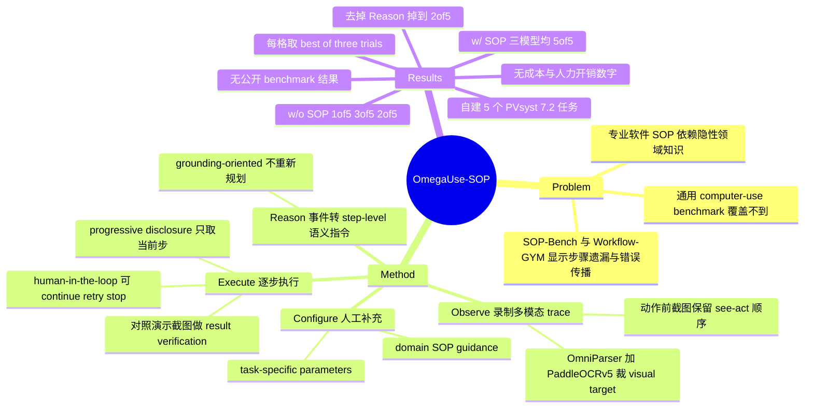

## Summary

OmegaUse-SOP 把一次专家 GUI 演示录成多模态 trace，用 VLM 把每个低层事件改写成 step-level 语义指令，再由人补上 domain 规则与可变参数，最后让 agent 逐步取用这份 SOP 并对照演示截图做逐步核验。在自建的 5 个 PVsyst 7.2 光伏仿真任务上，无 SOP 时 Qwen3-VL-235B-A22B-Instruct / GPT-5.5 / Opus-4.7 分别通过 1/5、3/5、2/5，接入 SOP 后三者都是 5/5。但每格取的是 three trials 的 best outcome、由领域专家人工判定，且其中的 domain guidance 按论文自述可以来自对同一批任务失败案例的事后分析，所以这组数字是部署演示而非可比的 benchmark 结果。

## Problem & Motivation

通用 computer-use benchmark 衡量的是开放式桌面任务，专业软件里的工作流是另一回事：它依赖领域约定（哪个字段要先清空再填）、软件特有的控件习惯（spinner 该点上箭头还是下箭头），以及步骤级的校验要求。作者引 SOP-Bench 与 Workflow-GYM 说明 LLM agent 在工业与专业 workflow 上会出现分支逻辑处理不当、步骤遗漏、错误传播与目标漂移。

他们由此把问题重新 frame：与其继续堆感知和动作模型，不如给出一个把专业过程性知识捕获下来并复用的机制。这个 framing 本身不新，RPA 领域做了很多年；论文的赌注在于用 VLM 把 record-and-replay 的复用单位从像素坐标抬到语义描述加参数槽。

## Method

四个模块串成一条流水线，作者把它类比 prompt engineering，称为 SOP Engineering：迭代地精修演示、执行规则、领域知识与任务参数，直到 agent 能稳定复现该流程。

**Observe** 在专家演示期间持续监听鼠标键盘事件并截屏。事件触发时它保存的是动作发生**之前**的截图，以保留人做出该决定时看到的界面状态。坐标类动作（左键、双击、右键）用 OmniParser 与 PaddleOCRv5 检测 UI 元素，把与点击坐标匹配的 bounding box 裁出来当作 visual target；非坐标类动作里连续字符输入聚合成一次 text input，Enter、Tab、Escape 这类特殊键单独记录。输出是含 pre-action 截图、visual target、鼠标键盘动作、时间戳与事件序的多模态 trace。

**Reason** 把 trace 改写成可复用表示，也是 ablation 里掉分最多的模块。它给 VLM 三样东西——pre-action 截图、点击区域裁图、可得时的 post-action 截图——让模型生成一句描述"点了哪个元素、它在什么相对位置、意图是什么"的指令。作者强调这里做的是 grounding-oriented reasoning 而非重新规划：动作类型和坐标都已知，模型只负责把坐标翻译成能在未来界面上重新定位的语义描述。对 Type 与 Hotkey，模型解释这个键盘动作用在哪里、为什么用，例如把一次文本输入描述成"把项目名填进 project-name 字段"而不是"输入录制到的文本"。

**Configure** 把语义 SOP 变成可编辑对象，加两类人写的上下文。一类是 domain SOP guidance，即"改 System-Number of Modules in Series 时点下箭头减小、上箭头增大"这样的软件约定；论文明说这类规则可以来自专家既有知识，**也可以来自对前几轮 agent 失败的事后分析**，并把这条描述成迭代提升成功率的机制。另一类是 task-specific parameters，指定录制时的哪些值应被当成变量而非字面量，使同一流程能绑定到新的任务实例。

**Execute** 在真实桌面上执行。因为专业 SOP 可能有上百步，把四类信息（原始 trace、语义理解、领域知识、任务参数）一次性塞进上下文会带来可观的上下文开销并损害执行准确率，所以它做 progressive disclosure，每步只取当前步相关的那部分；作者把这个设计归因于 Claude Code 一类 coding agent 的 skill invocation 机制。每步执行完做一次 result verification：把执行后的屏幕与演示里的 expected post-action 截图比对，verification prompt 被设计成容忍光标位置、时间戳、动态内容这类无害差异而只抓有意义的偏离。检测到偏离时交给 human-in-the-loop，用户可选 continue、retry 或 stop。完整的 human-in-the-loop 实现部署在客户环境里，论文另给了一个开源实现链接。

## Key Results

评测是一次 case study。任务集自建，是 5 个 PVsyst 7.2 流程（气象数据导入、方位角设置、并网系统设置、详细损耗设置、仿真执行），来自合作的电力设计院客户的真实工作流。baseline 定义为"同一个 GUI agent 只根据 user instruction 直接做任务"，即无演示、无 SOP 的自身对照；全文没有与任何已发表方法或系统比较，也没有在它引用的 OSWorld、SOP-Bench、Workflow-GYM 上报任何结果。

| 设置 | Qwen3-VL-235B-A22B-Instruct | GPT-5.5 | Opus-4.7 |
|:--|:--|:--|:--|
| w/o SOP | 1/5 | 3/5 | 2/5 |
| w/ SOP | 5/5 | 5/5 | 5/5 |

Reason 模块的 ablation 在 Qwen3-VL 上做：直接用低层 trace 时 2/5，加回语义指令后 5/5。无 Reason 时保住的两个任务是方位角设置与仿真执行，这也正是 baseline 表里三个模型通过率最高的两项（仿真执行 3/3、方位角设置 2/3），失掉的气象数据导入与详细损耗设置在 baseline 里则是 0/3——按这个读法，Reason 的增量集中在原本最难的任务上，但 5 个任务的样本量不足以把这条读成结论。

两张表的脚注都写明每格是 three trials 的 best outcome，成功与否由领域专家人工判定。论文没有报方差、失败率、平均步数、latency、token 消耗，也没有报执行过程中实际触发了多少次人工干预。

## Evidence Ledger

| Claim ID | Claim | Type | Source locator | Evidence excerpt | Status |
|:--|:--|:--|:--|:--|:--|
| C1 | 系统由 Observe / Reason / Configure / Execute 四个模块构成 | causal-mechanism | Abstract; §1; §2 | "OmegaUse-SOP consists of four modules: Observe, Reason, Configure, and Execute." | source-verified |
| C2 | w/o SOP 通过率 Qwen3-VL 1/5、GPT-5.5 3/5、Opus-4.7 2/5；w/ SOP 三者均 5/5 | number | Table 2 (p.5); §3 | "Pass Rate 1/5 3/5 2/5 5/5 5/5 5/5" | source-verified |
| C3 | 表中每格是 three trials 的 best outcome，成功由领域专家人工判定 | benchmark-setting | Table 2 caption; Table 3 caption | "Each entry reports the best outcome over three trials, with task success manually assessed by domain experts." | source-verified |
| C4 | 去掉 Reason 模块后 Qwen3-VL 从 5/5 掉到 2/5 | number | Table 3; §3 | "removing the Reason module reduces the pass rate from 5/5 to 2/5" | source-verified |
| C5 | domain SOP guidance 可来自对前几轮 agent 失败的事后分析；Appendix B 两例即专家看到模型出错后补写 | benchmark-setting | §2.3; Appendix B | "may originate from ... post-hoc analysis of GUI-agent failures in previous trials"; "added by a domain expert after observing model errors during trials" | source-verified |
| C6 | 全文未量化单条 SOP 的人力成本：无演示或配置耗时、无演示条数、无每任务步数 | benchmark-setting | 全文含 §2.1-§2.4、§3、App. A/B | 最接近的只有 §2.4 泛述 "professional SOPs may contain hundreds of steps"，非对本文任务的测量 | source-verified |
| C7 | Observe 用 OmniParser 与 PaddleOCRv5 检测 UI 元素，裁出与坐标事件匹配的 bounding box 作 visual target | causal-mechanism | §2.1 | "uses OmniParser ... and PaddleOCRv5 ... crops the bounding box of the element that matches the coordinate event" | source-verified |
| C8 | Execute 每步只披露当前步相关的 SOP 信息，作者归因于 Claude Code 一类 coding agent 的 skill invocation | causal-mechanism | §2.4 | "Inspired by the skill invocation mechanism of coding agents such as Claude Code, the Execute module progressively discloses step-related SOP information" | source-verified |
| C9 | 每步用演示的 expected post-action 截图比对当前屏幕做校验，并支持 continue / retry / stop 的人工干预 | causal-mechanism | §2.4 | "compares the current screen after execution with the expected post-action screen from the original demonstration" | source-verified |
| C10 | 开源的是 executable demonstration package；完整 HITL 实现部署在客户环境，另给一个开源实现链接 | license-code | Abstract; §2.4 footnote 1 | "The complete implementation of the human-in-the-loop mechanism is deployed in our client's environment." | source-verified |
| C11 | 评测集为自建的 5 个 PVsyst 任务，未在任何公开 benchmark 上报结果 | benchmark-setting | §1; §3; Table 2; 参考文献 | "five representative tasks ... derived from real-world workflows used by our client"；OSWorld / SOP-Bench / Workflow-GYM 仅 "Cited by: §1" | source-verified |
| C12 | 作者来自 Baidu, Inc. 与 Ningxia Electric Power Engineering Co., Ltd. | benchmark-setting | 标题页作者块 | "Baidu, Inc., Beijing, China; Ningxia Electric Power Engineering Co., Ltd., China" | source-verified |
| C13 | baseline 是同一 agent 仅凭 user instruction 直接执行，非与其他已发表方法比较 | comparison | §3 | "a baseline setting, where the GUI agent directly performs each task based only on the user instruction" | source-verified |
| C14 | 未报告任何执行成本指标（步数、latency、token、人工干预次数） | benchmark-setting | 全文含 §3、Tables 2-3、App. A/B | 二值 per-task success 是唯一报告的指标 | source-verified |

> Evidence boundary：C6 与 C14 是否定性 claim，核查覆盖全文正文、表格与图注。论文 Figure 1-4 为图像（w/o-SOP 对比图、框架图、两张标注过的 PVsyst 截图），其中的像素内文本未被逐字读取；从图题判断不太可能藏有成本表，但这是本次核查唯一的非文本缺口。C7 的原文写作 "PaddleOCRv5" 而引用的是 Cui et al. 2026 的 "PP-OCRv5"，此处沿用论文自身措辞。

## Strengths & Weaknesses

值得记下来的设计有两个。一是把 record-and-replay 的复用单位从像素坐标换成语义目标加参数槽——坐标重放在界面状态变化后就失效，而"点击 Meteo 面板左上角标着 Import 的按钮"这样的描述可以在新界面上重新定位；Reason ablation 里 2/5 到 5/5 的差距支持这一层翻译确实吃紧，不过 5 个任务的样本量只够把它当作方向性提示。二是用演示里的 post-action 截图当每一步的 expected state 做校验。这比让模型自问"我做对了吗"多了一个外部锚点，而这个锚点在录制时是免费得到的，不需要额外标注或写 checker，对不开放程序化接口的专业软件尤其实用。

主要问题是证据和结论之间的距离。domain SOP guidance 按论文自己的说法可以来自对前几轮失败的事后分析，Appendix B 的两个例子确实是专家看到模型出错后补写的，而评测就在这同一批 5 个任务上做。这意味着 5/5 里有多少来自 SOP 表示本身、多少来自针对这 5 个任务手写的规则，实验设计上无法区分。best-of-3 取最好一次进一步放大了这个问题：对一个主打 reliability 的系统，只报 best-of-3 恰好把 reliability 这个量隐藏掉了——一个三次里成功一次的流程和三次全对的流程在表里长得一样。

第二个缺口是成本侧完全空白。整套流程需要专家演示一遍、审阅语义指令、写 domain guidance、标注哪些值是参数，执行中还要随时准备接管，但论文没给任何一项的时间或次数。缺这些数字就无法回答这类系统真正的问题：把一个流程 SOP 化的一次性成本，相对于人直接做 N 次，在 N 等于多少时开始划算。这个问题恰恰是 RPA 三十年来的核心经济账。

第三，5 个任务、单一软件、单一领域，没有任何跨软件或跨领域的迁移证据。论文引了 SOP-Bench 与 Workflow-GYM 两个现成的公开专业 workflow 评测却都没用，因此无法判断 SOP 表示的适用边界。作者自己没有写 limitation 一节。

对领域的价值更多在工程参考而非结论：它给出了一条"演示 → 语义 SOP → 参数化 → 逐步校验执行"的完整落地路径，代码和 demo video 公开，可以直接拆开看设计选择；但它没有提供能改变判断的证据。

## Mind Map

## Notes

- 与 [[2608-UIMate]] 是同一问题的两条路。UI-Mate 把 demonstration 当 in-context 输入喂给训练过的开权重模型，并在 OSWorkerBench 上配了 self-demo 与 variant-demo 的成对对照；OmegaUse-SOP 不训练模型，而是把 demonstration 编译成显式可编辑的 artifact 再交给通用 VLM。前者的证据强度高出一个量级，后者的产物可被人检查和修改。这两点其实不冲突，值得看的是"可编辑的 SOP artifact"能否在 UI-Mate 那种成对对照下站住。
- [[2606-ProceduralMemoryAFTER]] 提的正是本文没答的问题：从单一 context 演化出的 procedure，有多少只是记住了 source context 的偶然细节。OmegaUse-SOP 的 SOP skill 全部在同一软件、同一批任务内验证，transfer 属性完全未测。
- 同组的 [[2601-OmegaUse]] 是模型侧工作（30B-A3B MoE、SFT 加 GRPO），本文是系统侧，但两者在实验里没有接起来——Table 2 用的是 Qwen3-VL、GPT-5.5、Opus-4.7，没有用自家 OmegaUse 模型。一个 GUI 专用模型在 SOP-guided 设置下是否还有增益，是这两篇之间自然会问但没有回答的问题。
- 可做的最小检验：把 Appendix B 那两条 domain guidance 移除后重跑同一批任务，并改报 3/3 成功率而非 best-of-3。如果 5/5 掉下来，说明当前结果里相当部分来自任务特定的手工规则而非 SOP 表示；如果 pass@1 远低于 best-of-3，那"提升 reliability"这个主张就需要重述。
- 更值得追的一层：progressive disclosure 与 per-step screenshot verification 这两个机制可以从 SOP 场景里剥出来单独用在通用 GUI agent 上。前者是上下文预算问题，后者是免标注的 step-level verifier——后者尤其有意思，因为它把"哪里算做对了"的定义从人写 checker 转移到了录制行为本身。
