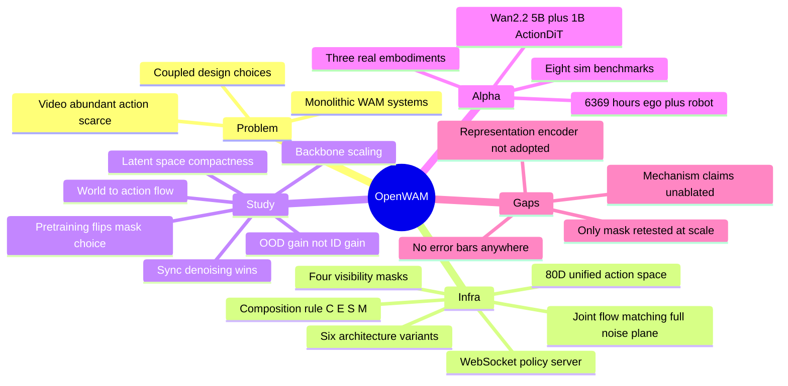

## Summary

OpenWAM 把 World-Action Model 的设计空间拆成三类可替换模块——frozen visual encoder E、stream backbones S（world / action / 可选 VLM）、visibility attention mask M——由一条不含任何参数的 composition rule `C(E,S,M)` 组装成六个架构变体，再配统一 trainer、统一 policy server、统一 WebSocket 评测协议。这让 backbone 规模、latent 空间、架构族、信息流方向、去噪时序、数据配方可以逐个当受控变量来测，而不是像既有 WAM 那样改一处要连带改一串。在这套 Infra 上得到三条 finding，据此拼出 OpenWAM-α：Wan2.2-TI2V-5B + 1B ActionDiT，dual-system joint self-attention + mutual mask，518.5M 帧 / 6,369 小时 ego+robot 单阶段 co-train，80-D 统一 action space。

值得记住的不是 α 的榜单，而是 Study 里三处与流行叙事相反的结果。其一，训练期 mask 的最优选择在预训练前后反转：from-scratch 时 action-sees-video 略优（−0.24 pp），预训练后 mutual 在 RoboTwin-Full / C2R-ID / C2R-OOD 三个 split 上一致占优（+0.16 / +0.70 / +0.72 pp）——受控实验的结论会随规模改号，这件事本身比结论更重要。其二，推理期 16 种异步去噪配置（video-lead / action-lead × variance-shift α∈{4,8,16,32} 与 linear-offset o∈{0.2,0.4,0.6,0.8}）全部打不过同步对角线（异步最好 92.3 vs sync 93.0），"先想象未来再反解动作"的 test-time planning 叙事在这里不成立。其三，embodied pretraining 对 in-domain 几乎不涨（+0.68 pp），增益几乎全在 OOD（+12.12 pp）。

代价同样清楚。全文没有一个误差棒、标准差或多 seed 重复，而 mask 反转的全部证据是 ≤0.72 pp 的单次运行差；六个受控变量里只有 mask 一个在预训练后被重测，其余都是在 from-scratch、600 小时预算、单一 benchmark（RoboTwin2.0）下选定后直接外推到 6,369 小时。α 本身也不是 Study 的"最优解"而是"效率解"：Tri 92.60 > Dual 92.36、14B 93.79 > 5B 92.39、Study 亲自验证的 DINOv3+S-VAE 路线被搁置，三处都选了便宜的一边。论文自己在 §5.3.1 诚实地把 LIBERO-Plus 的塌陷（69.2，13 行对照里第 11）归因于 pixel-latent 对 camera/noise 扰动的脆弱——这恰好指向 §4.1.2 已经准备好的干预手段，但那个实验没有做。

## Problem & Motivation

具身学习有一处数据不对称：记录世界如何变化的视频极其丰富，带可执行 action label 的机器人轨迹相对稀缺。VLA 的应对是从 VLM 继承语义与语言先验；WAM 走的是另一条路，从 video generation 继承视觉动态先验，再用具身经验把它转成可执行控制信号。WAM 的核心假设不是"用视频模型初始化策略"这么弱，而是 world prediction 与 action generation 能够**协同**：世界建模提供状态、动力学与可能未来的结构化知识去指导动作，动作学习反过来把模型的注意力压到对控制真正重要的变化上。

问题在于既有系统是单体的。generative backbone、visual representation、模型架构、信息流、推理过程、训练数据组成往往彼此耦合，于是"哪个组件在传递世界知识、哪种交互产生了协同、哪些收益能跨域存活"这三件事无法分离验证。论文因此把贡献定位在基础设施而非某个更好的 WAM：先让设计空间变成可受控实验的对象，再在这个基底上回答三个问题——Q1 该继承什么世界知识（generative prior 还是 representation prior），Q2 继承来的世界知识如何与动作学习交互，Q3 这种协同如何跨域扩展。

这条方法论的参照系是 Cambrian-1、Physics of Language Models 一类"把模型设计当经验科学"的工作，以及机器人侧的 Large Behavior Models、StarVLA-α；OpenWAM 是把同一套做法搬到 WAM 上的第一次系统尝试。

## Method

### OpenWAM-Infra：把 WAM 写成 C(E,S,M)

组合规则 C 自己不带参数，所有可学习容量都在 stream backbone 里。C 只做一件事：按 `prepare → per-layer block → finalize` 的执行契约排列参与的 backbone，需要跨流交互时把 block step 劈成 pre-attention（吐 QKV）与 post-attention（吃 attention 输出）两半，在中间替换掉 attention 计算本身，**从不修改 backbone 内部**。这是整套模块化能成立的技术关键。

| 模块 | 可选项 | 备注 |
|:--|:--|:--|
| Visual Encoder E（始终冻结） | Wan2.2-VAE、FLUX.2-VAE（reconstructive）；DINOv3、V-JEPA 2.1（representation，可选接 S-VAE 降维） | 换 E 就换了 world stream 要预测的 latent；可同时把 base DiT 重新随机初始化以剥离预训练权重的影响 |
| Stream Backbones S | video backbone 五个（Wan2.1-VACE-1.3B / Cosmos-Predict2.5-2B / Cosmos3-Edge-4B / Wan2.2-TI2V-5B / Wan2.1-I2V-14B）；VLM backbone（Qwen3-VL）；action backbone（独立 ActionDiT 或并入 video 序列） | backbone roster 可注册扩展 |
| Visibility Mask M | isolated / action-sees-video / video-sees-action / mutual | 帧内固定：video 用 first-frame-causal，action 用 bidirectional |
| 架构族（六变体） | Single（Vanilla、MoE）；Dual（joint self-attn、joint cross-attn、IDM）；Tri（joint self-attn） | Table 1 把 joint cross-attn 拆成 end-to-end 与 detached 两跑，共七个 baseline |

Mask 的形式化是 `M = [[M_V←V, M_V←A], [M_A←V, M_A←A]]`（Eq. 1），只有两个 cross-modality block 是自由变量。

### 训练：一个 objective 覆盖整个噪声平面

样本是 `(ℓ, o_1:T, a_1:H, q, m)`。两条流各自取自己的 timestep：`z_tv = t_v·z + (1−t_v)·ε_v`、`a_ta = t_a·a + (1−t_a)·ε_a`，一次联合前向同时预测两个 velocity，loss 是加权的 joint flow matching（Eq. 2），validity mask m 把 action 项限制在该本体真正占用的坐标上。**t_v 与 t_a 独立采样**是整套设计的枢纽：训练覆盖整个 (t_v, t_a) 平面，于是任何推理调度——同步对角线也好、某一流领跑的异步路径也好——都只是这个平面里的一条轨迹，永远 in-distribution。这也让 §4.2.3 的调度消融成为"纯推理期"的比较，不需要为每种调度重训。

### 部署：推理模式与去噪调度正交

推理模式（synchronous 阻塞 / asynchronous 后台预取，带 delayed–executed–discarded 三段切分）与去噪调度（Eq. 3 的 variance shift `f_α(s)=αs/(1+(α−1)s)` 与 linear offset `h_o(s)=max{(s−o)/(1−o),0}`）是两个独立开关，`(α,o)=(1,0)` 精确退化为同步对角线，所以每个异步跑都自带对齐的 baseline。加速侧四件：prompt-embedding cache、video-decode skip（控制只要动作不要像素，VAE 解码整个跳过）、fixed-shape `torch.compile` + CUDA graph、DiT velocity cache。

### 评测协议与 80-D 统一动作空间

benchmark 一律作为 WebSocket 瘦客户端接入 policy server，不 import 模型或训练栈的任何东西；观测裁剪/缩放/拼图、缺失相机补黑帧、proprio 归一化与映射、动作反归一化全在 server 端由 self-contained checkpoint 驱动，所以归一化后的值永远到不了机器人。跨本体训练用 `u ∈ R^80`（Eq. 4）：两个镜像的 34-D 手臂块（EEF 位置 3 + 6D 旋转 6 + gripper 1 + 灵巧手 24）+ 12 个预留槽；各数据集声明 index map，`u = Scatter_π(Norm(a))`，未映射坐标不收梯度、推理时留在解析噪声路径上。

### OpenWAM-α

E = frozen Wan2.2-VAE；S = 预训练 Wan2.2-TI2V-5B DiT（world）+ 1B ActionDiT（action）；M = mutual + first-frame-causal。30 对层全部是 bridge layer，两流各自的投影把不同残差宽度（3072 / 1024）映到共享的 24 头 × 128 维注意力空间。AdaLN 分别注入两流自己的 timestep，第一帧 token 钉在 t_v = 1。训练 λ_v = λ_a = 1，timestep 用 ρ=5 的 warp 偏向高噪；推理走同步对角线、N=10 步，RTX 5090 上约 170 ms 一个 chunk。预训练：128 张 H200、约 7 天、global batch 3,072、155,862 步（1 epoch）、DeepSpeed ZeRO-2、bf16、33 帧输入 clip、384×320。

数据从 1.33B 帧（≈14,300 小时）原始池清洗+抽样到 518.5M 帧（6,369 小时）：自采 egocentric 30.1%、InternData-A1 合成 30.0%、三个真机源（AgiBotWorld-Beta / RoboCOIN / DROID）合计 39.9%。ego 数据无 action label，只监督 world stream。清洗分视觉层（不可解码/冻结帧/纯色/曝光异常/模糊/跳变；ego 另删手离开视野的片段）与信号层（state-action 幅值比 ≥3× 且逐轴相关 <0.5 直接丢弃 episode；state-first 静止检测只裁首尾不裁中间停顿；state 动而所有相机静 → 传感器抖动裁掉，手臂动而相机冻 → 采集缺陷删 episode；丢帧 >70% 或视频冻结 ≥90% 整条删）。

## Key Results

### Study：六个受控变量与实际落子

| 变量 | 对照 | 最优 | α 的选择 | 让出的差距 |
|:--|:--|:--|:--|:--|
| Video backbone | 1.3B 90.14 / 2B 91.64 / 5B 92.39 / 14B 93.79 | Wan2.1-I2V-14B | Wan2.2-TI2V-5B | −1.40 pp（参数少 2.8×） |
| Visual encoder | DINOv3 76.42 / V-JEPA2.1 80.91 / FLUX.2-VAE 84.26 / V-JEPA2.1+S-VAE 88.46 / DINOv3+S-VAE 90.18 / Wan2.2-VAE 90.30 | Wan2.2-VAE | Wan2.2-VAE | 0（但 DINOv3+S-VAE 仅差 0.12） |
| 架构族 | Vanilla 85.50 / MoE 84.63 / Dual-JSA 92.36 / Dual-JCA 88.25 / Dual-JCA-detach 91.85 / IDM 87.95 / Tri-JSA 92.60 | Tri-JSA | Dual-JSA | −0.24 pp |
| 训练期 mask（from scratch） | isolated 87.41 / video-sees-action 87.63 / action-sees-video 92.39 / mutual 92.15 | action-sees-video | —（见下行） | — |
| 训练期 mask（预训练后） | mutual − ASV = +0.16 / +0.70 / +0.72 pp（三 split） | mutual | mutual | 0 |
| 推理去噪调度 | sync 93.0；16 个异步配置全在 88.5–92.3 | sync | sync | 0 |

encoder 一行的绝对值不可与其他行横向比较：§4.1.2 为隔离表示先验，把 Wan2.2-TI2V-5B 的架构留下但权重随机初始化，所以 90.30 的天花板低于带预训练权重的 92.36。

跨域巩固（RoboTwin2.0-Clean2Random，600 小时预算）：

| 预训练策略 | ID（Clean） | OOD（Randomized） |
|:--|:--|:--|
| From scratch | 87.00 | 14.50 |
| Robot only（600h） | 88.50（+1.50） | 23.80（+9.30） |
| Ego → Robot 两阶段（350+250h） | 87.10（+0.10） | 26.50（+12.00） |
| Ego + Robot co-train（350+250h） | 87.68（+0.68） | 26.62（+12.12） |

robot-only 拿到最好的 ID，两个混合策略拿到更好的 OOD，两阶段与 co-train 几乎打平（OOD 差 0.12 pp）——"两种数据都用"比"用的顺序"重要得多。

### OpenWAM-α：八个仿真 benchmark 的实际位次

| Benchmark | 本体 | OpenWAM-α | 表内最佳 | 差距 | 位次 |
|:--|:--|:--|:--|:--|:--|
| LIBERO | 单臂 | 99.3 | ABot-M0.5 99.4（WAM） | −0.1 | 2 / 18 |
| LIBERO-Plus | 单臂 | 69.2 | Qwen-RobotManip 89.0（VLA） | −19.8 | **11 / 13** |
| VLABench | 单臂 | 58.9 SR | Xiaomi-Robotics-1 59.1（VLA） | −0.2 | 2 / 8 |
| RoboTwin2.0-Full | 双臂 | 93.60 | ABot-M0.5 94.10（WAM） | −0.50 | 并列 3 / 14 |
| RoboTwin2.0-C2R | 双臂 | 69.0 | Qwen-RobotManip 77.1（VLA） | −8.1 | 2 / 13（WAM 第一） |
| RoboDojo | 双臂 | 11.92 SR | DM0.5 19.34（VLA） | −7.42 | 4 / 13（WAM 第一） |
| RoboCasa365 | 移动单臂 | 38.2 | Xiaomi-Robotics-1 57.4（VLA） | −19.2 | **3 / 10**（低于 WAM ABot-M0.5 40.4） |
| EBench | 移动双臂 | 49.4 SR / 64.7 Score | —（SOTA） | +3.8 / +4.7 | **1 / 9** |
| RoboCasa-GR1 | 灵巧手 | 60.5 | PhysBrain 1.0 64.5（VLA） | −4.0 | 2 / 15（WAM 第一） |

真机：Franka FR3 六任务 99/120（82.5%），高于 LingBot-VA 93/120 与 π0.5 66/120，但 Stack Ring 12/20 输给 LingBot-VA 15/20。RoboDojo-Real 三本体 18 任务 Score/SR 37.6/24.4 登顶（次席 π0.5 22.9/12.8），按 Score 在 13/18 个格子最优。Wuji 灵巧手 + Tianji 臂（本体与 action space 均不在预训练混合里）四任务 ID/OOD 共 16 组 Score/SR 全面超过 π0.5。

### 两条 takeaway 的实际支撑

§5.3.1 对 LIBERO-Plus 塌陷的诊断是全文最好的一段：损失集中在 camera 与 noise 两种扰动（33.8 / 39.8，其余五项 76.1–97.0），Fast-WAM（16.4 / 37.7）与 ABot-M0.5（70.5 / 75.5）呈现同一签名，而三者共享"用 reconstructive Wan2.2-VAE 预测未来 pixel latent"这一目标；ImageWAM 只预测单帧未来（更像 edit 而非 rollout）、Being-H0.7 用 V-JEPA 2.1 的语义级 latent，两者都明显更稳。数据侧则指出 α 的单臂来源只有 DROID（固定平台固定视角）与 InternData-A1 的单臂部分，远小于 ABot-M0.5 的 8000+ 小时与 Being-H0.7 的 5700+ 小时。

§5.3.2 的 VLA-vs-WAM 结论（ID 侧 WAM 更贴合、OOD 侧 VLA 更泛化）在数字上成立，但两条机制解释都没有受控实验：ID 侧归因于 video-latent 监督注入额外优化信息，而全文 λ_v 恒为 1.0，不存在任何 λ_v=0 或"去掉 video loss"的跑；OOD 侧归因于长时域预测的误差累积，而 T、未来 latent 帧数、H 从未被扫过，被引为旁证的 ImageWAM 单帧对比是第三方已发表的 baseline 数字而非本文重跑。

## Evidence Ledger

| Claim ID | Claim | Type | Source locator | Evidence excerpt | Status |
|:--|:--|:--|:--|:--|:--|
| C1 | Backbone 越大越好：1.3B 90.14 / 2B 91.64 / 5B 92.39 / 14B 93.79；5B 落后 14B 1.40 pp 而参数少约 3× | number | §4.1.1 + Fig. 6, p.11 | "Wan2.2-TI2V-5B trails it by only 1.40 points, even though the former has nearly 3x the parameter count" | source-verified（独立重算 93.79−92.39=1.40；14/5=2.8×） |
| C2 | Encoder 六档 76.42 / 80.91 / 84.26 / 88.46 / 90.18 / 90.30；该组实验把 Wan2.2-TI2V-5B 权重随机初始化，非原生 4× 时间压缩的 encoder 用四帧平均强加 | benchmark-setting | §4.1.2 + Fig. 7, p.12 | "we inherit the model architecture of Wan2.2-TI2V-5B, but randomly initialize its model weights" | source-verified |
| C3 | Table 1 七行架构消融数值与全部 Average 列 | number | Table 1, p.13 | "Dual-System Joint Self-Attention 92.34 92.38 92.36" | source-verified（七个 Average 逐个按 Clean/Randomized 均值重算，全部吻合） |
| C4 | 论文称"随架构容量增加，single→dual→tri 性能持续提升" | comparison | §4.2.1 Results, p.13 vs Table 1 | "with increasing architecture capacity, performance from single- to dual- and tri-system continuously improves" | **contradicted**（同表 MoE 84.63 低于 Vanilla 85.50 达 0.87 pp，而 MoE 正是给 action token 加专属容量的那一档；Dual 族内 JCA 88.25 / IDM 87.95 也比 Dual-JSA 低 4.1–4.4 pp；Tri 仅超最佳 Dual 0.24 pp。跨族最佳值单调，但"容量→性能"不成立） |
| C5 | 四种 mask：isolated 87.41 / video-sees-action 87.63 / action-sees-video 92.39 / mutual 92.15；前两者"落后约五点" | number | Table 2 + §4.2.2, pp.13–14 | "Isolated and video-sees-action masks underperform by roughly five points" | source-verified（八格全对，实际缺口 4.98 与 4.76 pp） |
| C6 | Table 1 的 Dual-JSA 均值 92.36 与 Table 2 的两个 mask 变体（92.39 / 92.15）对不上，两表都标称 RoboTwin2.0-Full | number | Table 1 p.13 vs Table 2 p.14 | Table 2 caption: "Success rates (%) on RoboTwin2.0-Full" | **contradicted**（逐 split 亦不匹配：92.34/92.38 vs 92.98/91.80 与 92.50/91.80；全文无任何文字调和三者。HF 上架构消融与 mask 消融的 checkpoint 分列，提示这是两次独立 run——若如此，0.03 pp 即该配置可观测的 run 间波动量级） |
| C7 | 同步去噪最好：sync 93.0；16 个异步配置（variance-shift α∈{4,8,16,32} × 两方向、linear-offset o∈{0.2,0.4,0.6,0.8} × 两方向）落在 88.5–92.3 | number | Fig. 9, p.14（12× 放大读标签） | "Sync / 93.0"（两个 panel 各一次） | source-verified（16 个标签逐个读出；异步最大值 92.3） |
| C8 | Fig. 9 的评测 benchmark / split | benchmark-setting | §4.2.3 + Fig. 9 caption, p.14 | mutual visibility 有明说；benchmark 与 split 全段未写 | **unsupported**（§4 总评测协议是 RoboTwin2.0 两设定，但 §4.2.3 与图注都没点名用哪一个。93.0 与 Table 2 的 mutual 92.15 之间的 0.85 pp 差实在，但把 Fig. 9 归到 RoboTwin2.0-Full 是推断而非原文陈述——引用时不得当成定论） |
| C9 | 预训练策略对比（C2R）：ID 87.00 → 88.50 / 87.10 / 87.68；OOD 14.50 → 23.80 / 26.50 / 26.62 | number | Fig. 10, p.15（视觉读取） | caption: "Embodied Pretraining Primarily Improves OOD Generalization. Success rates on RoboTwin2.0-Clean2Random" | source-verified（八个柱标与六个 delta 全部独立重算吻合；co-train 比两阶段 OOD 仅高 0.12 pp） |
| C10 | Fig. 10 与 Fig. 11 对同一个 co-train OOD 配置给出两个数 | number | Fig. 11 p.16 vs Fig. 10 p.15 | Fig. 11: 25.70 + 0.72（Mutual − Action-Sees-Video） | **contradicted**（25.70+0.72=26.42 ≠ Fig. 10 的 26.62，差 0.20 pp；而同一对图的 ID 侧 86.98+0.70=87.68 精确吻合，使"四舍五入"的解释站不住） |
| C11 | 全文无误差棒、标准差、置信区间、多 seed 重复或显著性检验 | benchmark-setting | 全文（正文、Table 1–20、Fig. 4–21、附录 A–D） | 唯一 "seed" 出现在数据抽样："subsampled from the curated pool under a fixed seed"（p.19） | source-verified（穷举检索 "error bar / confidence / std / deviation / ± / seed / repeat / significan"，结果语境零命中；每个报告值都是单点估计） |
| C12 | α 配置：frozen Wan2.2-VAE + 预训练 Wan2.2-TI2V-5B + 1B ActionDiT，30 对 bridge layer，mutual + first-frame-causal，ρ=5、N=10 步同步去噪，RTX 5090 约 170 ms/chunk | number | §5.1.1–5.1.3, pp.18–19 | "ti = 1 − f_rho(1 − i/N) with rho = 5 and N = 10 steps"；"roughly 170 ms per chunk on an RTX 5090" | source-verified |
| C13 | 数据混合五源；ego 无 action label 只监督 world stream；总计 1,333.9M→518.5M 帧、14,348→6,369 小时 | number | Table 4 + §5.2.1, p.19 | "its action and proprioception channels remain fully masked and it supervises only the world stream" | source-verified（四个列和全部重算吻合；frames÷FPS→hours 五行逐条核对；share 列和 100.0。两处取整偏差：30.03% 印作 30.1、18.69% 印作 18.6） |
| C14 | 预训练：16 节点 × 8 H200 = 128 卡、约 7 天、batch 3,072（24/卡）、LR 1e-4、155,862 步（1 epoch）、ZeRO-2、bf16、33 帧 clip、384×320 | number | Table 9 + §B.1, pp.33–34 | "Pretraining uses 16 nodes with eight NVIDIA H200 GPUs per node (128 GPUs in total) and takes approximately seven days" | source-verified |
| C15 | 八个 benchmark 上 α 与各表最佳的十六个数（见 Key Results 表） | number | Table 5 p.22、Table 13–20 pp.39–43 | Table 18: "OpenWAM-alpha 30.0 44.2 67.5 72.0 44.3 72.6 49.4 64.7" | source-verified |
| C16 | 论文称 α 在 RoboCasa365 上"稳居第一梯队，与最佳模型仅有边际差距" | comparison | §5.3.1 bullet 1, p.21 vs Table 19, p.42 | "OpenWAM-alpha sits firmly in the top tier, within a marginal gap of the best model" | **contradicted**（57.4−38.2 = 19.2 pp；且低于同为 WAM 的 ABot-M0.5 40.4，实际是该榜第 3。同句中的 LIBERO −0.1 / VLABench −0.2 / RoboTwin-Full −0.5 / RoboCasa-GR1 −4.0 均成立，唯 RoboCasa365 不成立） |
| C17 | LIBERO-Plus：α 69.2，七项扰动 33.8 / 76.1 / 88.0 / 97.0 / 87.1 / 39.8 / 77.5 | number | Table 5, p.22 | "OpenWAM-alpha 33.8 76.1 88.0 97.0 87.1 39.8 77.5 69.2" | source-verified（13 行中第 11；六行 WAM 中第 5，仅高于 Fast-WAM 51.5；七行 VLA 中仅高于 π0 53.6） |
| C18 | LIBERO-Plus 与 RoboCasa365 的 Avg 列不是各子列的非加权均值，而是按试次/任务数加权；论文从未说明 | benchmark-setting | Table 5 p.22、Table 19 p.42 | 表头 "Camera Robot Language Light Background Noise Layout Avg"，无任何加权说明 | source-verified（α LIBERO-Plus 七列非加权均值 71.33 vs 印 69.2；RoboCasa365 三列 36.90 vs 印 38.2；π0 与 Xiaomi 行同向偏差。对照：VLABench 与 RoboTwin 两表的 Avg 确为非加权均值，故加权口径在表间不一致） |
| C19 | pixel-latent 脆弱性诊断：Fast-WAM / ABot-M0.5 / α 三者 camera 与 noise 两格均为各自行内最低；ImageWAM 单帧预测与 Being-H0.7 的 V-JEPA 语义 latent 作为反例 | causal-mechanism | §5.3.1 "The Architecture Perspective", pp.22–23 | "Pixel-level information is evidently acutely sensitive to camera and noise perturbations" | source-verified（Table 5 数据签名成立：16.4/37.7、70.5/75.5、33.8/39.8。注意这是跨已发表模型的观察性论证，非受控干预，见 C33/C34） |
| C20 | Fig. 16a：Fast-WAM vs StarVLA 十个数（LIBERO 97.6/96.6；C2R-Clean 77.8/46.5；RT-Full 91.85/88.25；LIBERO-Plus 51.5/74.1；C2R-Rand 1.9/3.2） | number | Fig. 16a, p.24（视觉读取） | "The cleanest comparison is between StarVLA and Fast-WAM, two models without embodied pretraining" | source-verified（十个柱标与 Table 5/13/15/16 逐一吻合） |
| C21 | 真机单臂：α 99/120（82.5%）、LingBot-VA 93/120（77.5%）、π0.5 66/120（55.0%）；每任务 100 条演示微调、20 次独立试验 | number | Table 6 p.25 + §C.1 p.36 | "each task is evaluated over 20 independent real-world trials" | source-verified（三行加总独立重算；Stack Ring 12/20 输给 15/20、Hang on M 13/20 打平均确认） |
| C22 | RoboDojo-Real：α 三本体 39.0/23.3、46.7/36.7、27.2/13.3，总均 37.6/24.4；次席 π0.5 22.9/12.8 | number | Table 7, p.26（视觉读取） | "OpenWAM-alpha … 37.6 / 24.4" | source-verified（三本体 × 两指标 + 总均共八个值逐个重算；18 个 SR 格全为 10 的倍数，两格 100.0/100.0） |
| C23 | 灵巧手（Wuji + Tianji，本体与 action space 均不在预训练混合中）：α 在四任务 × ID/OOD × Score/SR 共 16 组上全面超过 π0.5 | number | Table 8 p.26 + §5.4 pp.25–26 | "Neither the platform nor its action space — a 9-D end-effector pose combined with 21 dexterous-hand degrees of freedom — ever appears in the … pretraining mixture" | source-verified（16 组分数与分式全部核对；π0.5 是该表唯一对照） |
| C24 | Collect Shuttlecocks 的 OOD 分母两法不同：π0.5 17/54，α 30/57，而两者 SR 分母同为 15 次试验 | benchmark-setting | Table 8 p.26 + §C.2 progress-score 定义 p.38 | 附录定义分母为逐试次 m_i 之和、"the total number of elements present in that trial"，每次 "two to four shuttlecocks" | source-verified（试验次数相同而元素总数 54≠57，说明两法面对的试次配置并不一致；这是 Table 8 中唯一分母不一致的格对） |
| C25 | 代码 / 模型 / 数据全栈开源承诺 | license-code | p.1 页脚 + Abstract + Conclusions p.27 | "Code: https://github.com/OpenWAM-Official/OpenWAM"；"We release the full stack, including infrastructure, evaluation protocols, pretrained models, and data recipes" | source-verified（注意口径是 "data recipes"，不是 data；见 C36） |
| C26 | Ego 数据为作者自采：71.6K 段第一人称长视频、每段 0.25–6 分钟、覆盖 3,006 项日常操作任务 | number | §5.2.1 Data Composition, p.19 | "71.6K long-form first-person recordings of 0.25–6 minutes each, covering 3,006 everyday manipulation tasks" | source-verified（Table 4 行标 "Egocentric data (ours)" 佐证，无引用。附注：6,897 h ÷ 71.6K ≈ 5.78 min/段，几乎贴住声称区间的上界，意味着时长分布高度集中在 6 分钟——论文未给分布） |
| C27 | Baseline 数字的来源（自行复跑还是引用已发表结果） | benchmark-setting | Table 5、Table 13–20；全文检索 | §D 仅说 "The tables below report the full per-benchmark scores summarized in Figure 13" | **unsupported**（全文无任何一句交代 baseline 分数如何取得，既未说复跑也未说引用；此项无法从原文确认或否认） |
| C28 | 作者自述四项局限：只覆盖预训练阶段；模态融合只探了 cross-attention 与 hard-routed MoE；未纳入 UMI 式数据；Wan2.2-VAE 是权衡而非最优 | causal-mechanism | 附录 A 第 1–4 条, p.33 | "pixel-reconstruction encoders such as Wan2.2-VAE are not sufficiently robust to viewpoint, noise, and scene variations" | source-verified |
| C29 | LIBERO-Plus 直接用 LIBERO 的 checkpoint 评测，不再微调 | benchmark-setting | §B.2, p.34 | "LIBERO-Plus is evaluated with the LIBERO checkpoint without further fine-tuning." | source-verified |
| C30 | Infra 声称支持五个 video backbone，但 §4.1.1 与 Fig. 6 只跑了四个，Cosmos3-Edge-4B 的分数不在论文任何位置 | benchmark-setting | §3.1 p.6 vs §4.1.1 p.11 | §4.1.1: "we compare four video generation backbones with variable parameter counts" | source-verified（论文未给省略理由；而 HF 上存在 `robotwin_dual_system_joint_self_attention_cosmos3` checkpoint，见 C36） |
| C31 | 24 位作者、7 家机构（NUS / THU / PKU / HKU / ZJU / CUHK / SJTU），Wang 与 Huang 并列 project lead，Shao 与 Zhao 并列通讯 | number | p.1 作者块 + arXiv 戳 | "arXiv:2609.07398v1 [cs.RO] 7 Sep 2026" | source-verified（作者数逐行清点 6+7+7+4=24） |
| C32 | Table 4 的 Task Coverage 打勾：ego 四列全空（代以 "in-the-wild human manipulation"）；AgiBot 与 RoboCOIN 为 Bimanual+Mobile+Dexterous（Single 未勾）；DROID 仅 Single；InternData-A1 为 Single+Bimanual | benchmark-setting | Table 4, p.19（8× 放大读取） | 列头 "Single Bimanual Mobile Dexterous" | source-verified（只有两源覆盖 Single，与 §5.3.1 自述的单臂数据不足互证；无任何一源同时覆盖 Dexterous 与 Single） |
| C33 | 论文对"ID 侧 WAM 更贴合训练分布"的机制解释——video-latent 监督为参数优化注入额外信息 | causal-mechanism | §5.3.2 "In Distribution, WAMs Fit Better", p.23 | "the video-latent term injects an additional source of information into parameter optimization, allowing a WAM to fit the training data more closely" | **unsupported**（λ_v 在全文只出现四处——Eq. 2、其定义句、§5.1.2、Table 9——且恒为 1.0；不存在 λ_v=0、λ_v 扫描或"去掉 video loss"的任何一跑。论文自称的五处 "ablation"（Fig. 4 编译/缓存、Table 1 架构、Table 2 mask、Fig. 9 调度、Fig. 11 预训练后 mask）都不动 loss。该机制仅由 StarVLA vs Fast-WAM 这一对分别训练、架构/目标/参数量三项同时不同的模型的分数差推出） |
| C34 | 论文对"OOD 侧 VLA 更泛化"的机制解释——长时域未来预测带来更重的误差累积 | causal-mechanism | §5.3.2 "Out of Distribution, VLAs Generalize Better", p.23 | "under distribution shift the same long horizon means heavier error accumulation — a burden the action-only VLA never carries" | **unsupported**（不存在任何 horizon 扫描：Table 9 把输入 clip 固定在 33 帧，§B.2 明说 SFT 只改 batch/步数/增强三项；T、预测未来 latent 帧数与 H 从未被变动。被引为旁证的 ImageWAM 单帧对比是第三方已发表 baseline（Zhang et al., 2026c，仅以 83.1/98.4/93.38 三行出现），不是 OpenWAM-Infra 的六个架构变体之一，论文也未称重跑） |
| C35 | Fig. 13 的九个 panel 共用一份固定的 8-baseline 名单，导致其中五个 panel（LIBERO / RoboCasa365 / RoboDojo / RoboCasa-GR1 / VLABench）里"附录表中的最高分 baseline"既缺席、又高于 α，panel 读起来像附录并不支持的胜势 | benchmark-setting | Fig. 13, p.21（7× 放大逐 panel 读取）vs Table 5、13–20 | caption: "Score comparison of OpenWAM-alpha against representative VLA and WAM baselines across the simulation benchmarks" | source-verified（ABot-M0.5、Xiaomi-Robotics-1、PhysBrain 1.0、DM0.5 在 Fig. 13 的九个 panel 中出现次数为零。**但须并列说明**：同一页的 Fig. 14 明确是"per-family best three"，四个缺席者全部在内，正文也把 Fig. 14 介绍为对 Fig. 13 的补充——这是图表设计问题（固定名单未披露、造成误导性 panel 排序），不是数字隐瞒） |
| C36 | 实际释出物：GitHub 仓库 Apache-2.0（516 stars），HF `OpenWAM` 组下 46 个模型 + 6 个数据集；46 个模型覆盖 Study 的**每一个**消融臂（7 架构 / 4 mask / 5 backbone 含 cosmos3 / 6 encoder / 4 预训练策略 / 预训练后 mask 的 SFT 臂）；但自采 ego 语料（占预训练 30.1%）不在释出的数据集中 | license-code | `api.github.com/repos/OpenWAM-Official/OpenWAM` 与 `huggingface.co/api/models?author=OpenWAM`，2026-09-11 抓取 | 数据集仅 6 个：assets、LIBERO、RoboCasa365、RoboCasa_GR1、VLABench、wuji_teleop_data_subset | source-verified（论文外核查，由笔记作者执行而非独立 verifier；locator 可原样复跑。与 C25 相符：论文承诺的是 "data recipes" 而非数据本身） |

> 36 条 claim：28 条 source-verified，4 条降级为 unsupported（C8 图注未点名 benchmark；C27 baseline 来源全文未交代；C33/C34 两条 causal-mechanism 无任何受控实验），4 条判为 contradicted（C4 自述与自表相悖；C6 两表同配置数字不调和；C10 两图同配置差 0.20 pp；C16 RoboCasa365 "边际差距"实为 19.2 pp）。C1–C35 由独立 verifier 在原始 PDF 上重核（图表类 claim 均以高倍渲染视觉读取，所有均值与分式独立重算），C36 为笔记作者的论文外核查。source-verified 只表示原文确实如此写、数字自洽，不表示结果已被独立复现。

## Strengths & Weaknesses

**最有价值的贡献不是 α，而是"受控实验的结论会随规模改号"这件事被正面测出来了。** §4.3.3 拿同一组对照在预训练前后各跑一次，发现 from-scratch 下略优的 action-sees-video 在预训练后被 mutual 反超，三个 split 方向一致。这是对整个"小规模消融选超参、大规模照搬"范式的直接质询，也是本文方法论上最硬的一击——更重要的是它给出了机制假设：数据稀缺时两条流建立不起可靠的 video↔action 对应，只有单向的 world→action 通路能被学出来；数据充足后双向交换才兑现。可惜六个受控变量里只有 mask 这一个被重测，backbone、encoder、架构族、去噪调度四项都是在 from-scratch、600 小时预算、单一 benchmark 下定下来就直接外推到 6,369 小时的。论文自己证明了这种外推有风险，却没有给自己的其余五个选择做同样的检查。

**开源的彻底程度超出"发权重"的通常含义，并且恰好补上了论文最大的方法论漏洞。** HF 上 46 个 checkpoint 覆盖 Study 的每一个消融臂（C36），这意味着"全文没有误差棒"（C11）这件事是**可被社区修复的**——任何人都能重评这些 checkpoint 拿到 run 间方差。这一点应该被明确记功：在一个 ≤0.72 pp 的差被用来支撑主要 finding 的论文里，把每个对照臂的权重都放出来，比补一张带误差棒的表更有价值。同时它也暴露了一个小尴尬：`robotwin_dual_system_joint_self_attention_cosmos3` 存在于 HF，而 Cosmos3-Edge-4B 的分数不在论文任何位置（C30），Fig. 6 只画了四个点。

**Finding 3 的证据强度与它被写下的确定性不匹配。** "At pretrained scale, mutual world–action visibility is consistently preferred" 建立在 +0.16 / +0.70 / +0.72 pp 三个单次运行差之上，全文没有任何 dispersion 估计（C11）。而论文自己的数据给了一个尴尬的参照：Table 1 的 Dual-JSA（92.36）与 Table 2/Fig. 6/Fig. 11 三处一致的 92.39 对不上（C6），Fig. 10 与 Fig. 11 对同一个 co-train OOD 配置给出 26.62 与 26.42（C10）。这些 0.03–0.20 pp 的不调和恰好落在 Finding 3 的效应量区间里。"consistently" 的正确读法是"三个 split 同号"，不是"效应稳健"。

**OpenWAM-α 是效率解而非 Study 的最优解，这点论文说了但读者容易滑过去。** 三处让步：架构族取 Dual-JSA 92.36 而非 Tri-JSA 92.60；backbone 取 5B 92.39 而非 14B 93.79；encoder 取 Wan2.2-VAE 90.30 而非仅差 0.12 pp 的 DINOv3+S-VAE。前两处的理由（复杂度、部署成本）站得住，第三处则直接导致了 §5.3.1 那个诚实的自我诊断——LIBERO-Plus 的塌陷被归因于 pixel latent 对 camera/noise 的脆弱，而 §4.1.2 已经把 representation encoder + S-VAE 这条替代路线验证到了几乎持平。**Study 找到了药，α 没有吃。** 这是全文最大的一处未完成实验，也是最值得后续追的一个口子。

**VLA-vs-WAM 这一节的结论正确、机制解释无支撑。** ID 侧优势归因于 video-latent 监督注入额外优化信息（C33），OOD 侧劣势归因于长时域误差累积（C34），两条都没有对应的受控干预：λ_v 恒为 1.0 从未被扫过，horizon 从未被变动过，被引为旁证的 ImageWAM 单帧对比是第三方 baseline 而非本文重跑。更根本的是 OpenWAM-Infra 里根本没有 VLA-only 家族——三个架构族都含 video backbone——所以 Takeaway 3 全部建立在外部榜单数字上，而"最强 VLA"逐 benchmark 变换（Qwen-RobotManip / Xiaomi-Robotics-1 / …），这不是范式对比，是"α vs 各榜当期第一"。有趣的是本文最有资格做这件事：Single-System Vanilla 把 action token 并进 video 序列，只要加一条"去掉 video 流"的变体就能得到同 Infra 下的 action-only 对照。

**Fig. 13 的呈现问题应当按图表设计缺陷记，不按隐瞒记。** 九个 panel 共用一份未披露的固定 8-baseline 名单，结果 LIBERO / RoboCasa365 / RoboDojo / RoboCasa-GR1 / VLABench 五个 panel 里，附录表的最高分 baseline 既缺席又高于 α，panel 读起来像胜势（C35）。但同一页的 Fig. 14 是 per-family best-three，四个缺席者全在里面，正文也明说 Fig. 14 补充 Fig. 13。真正越界的只有一句话：§5.3.1 把 RoboCasa365 写成"与最佳模型仅有边际差距"，而实际差 19.2 pp 且低于同为 WAM 的 ABot-M0.5（C16）。

**几处口径需要在引用时保留。** LIBERO-Plus 与 RoboCasa365 的 Avg 是加权的，VLABench 与 RoboTwin 的 Avg 是非加权的，论文从不说明哪个是哪个（C18），拿这些表做二次计算会算错。灵巧手 Collect Shuttlecocks 的 OOD 分母两法不同（17/54 vs 30/57，试验次数却同为 15），说明两法面对的试次配置不一致（C24）。全文未交代 baseline 数字是复跑还是引用（C27）。

## Connections

- [[2607-STWAM]] —— 最直接的对照。ST-WAM 把 VAE latent 空间下的"Training-Distribution Hallucination"指认为视觉分布偏移下的根因，用冻结 DINOv3 双空间 future experts 应对，零样本 LIBERO-Plus 拿到 72.8%（Fast-WAM 51.5%）。OpenWAM-α 在同一榜只有 69.2，而它的预训练规模高出一个量级。两篇的诊断完全一致（pixel latent 脆弱），干预与否是唯一差别——这让 §4.1.2 未被采用这件事更刺眼。
- [[2608-JEPAWAM]] —— 同一诊断的另一条出路：建在冻结 V-JEPA 2.1 表示空间里，仅 0.5B backbone、无 robot-policy 预训练就在 LIBERO-Plus 达 79.2%。OpenWAM 表 5 里的 Being-H0.7（同样用 V-JEPA 2.1）82.1，与 JEPA-WAM 互为佐证。三篇合起来构成一条颇强的证据链：**LIBERO-Plus 上的表现主要由 latent 空间的性质决定，而非预训练规模**——这与 OpenWAM 自己的 Takeaway 1（"数据覆盖决定泛化"）存在张力，值得作为矛盾记下来。
- [[2608-SimWAM]] —— 最有价值的一处反例。SimWAM 的 mask ablation 给出 isolated 90.3 ≈ bidirectional 90.2 ≈ action→video 90.1，即"让 action 看未来帧并不涨点"，训练后整条 video 分支可丢弃；OpenWAM Table 2 却是 isolated 87.41 vs action-sees-video 92.39，差近 5 pp。两者领域不同（NAVSIM 自动驾驶轨迹规划 vs RoboTwin 双臂操作），所以可检验的边界假设是：**当动作必须条件于预测出的接触与物体动力学时，world→action 通路才是必需的；当共享观测表征已经够用时它就是冗余的。** 这条假设可以在 OpenWAM-Infra 上直接测——把同一 mask 消融跑到接触密集与非接触任务两组上。
- [[2602-DreamZero]] 与 [[2512-Motus]] —— 被 OpenWAM 分别列为 Single-System 与 Tri-System 的代表。有意思的是 Table 1 把 Single 判为最弱家族（85.50 / 84.63），而 DreamZero 正是 14B 单体 + 共享 timestep 联合去噪；Motus 所属的 Tri 家族则是 Table 1 的冠军（92.60），但 Motus 本人在 Table 16 只有 87.84，低于 Fast-WAM 91.85。架构族的排序与该族代表作的实际战绩并不同向，说明 Table 1 度量的是"同等训练预算下的架构上限"，不是"该路线的实际天花板"。
- [[2607-ABotM05]] —— OpenWAM 表里最强的 WAM 对照（LIBERO 99.4 / RoboTwin-Full 94.10 / LIBERO-Plus 83.4 / RoboCasa365 40.4），也是 §5.3.1 数据视角论证里的正面案例（8000+ 小时单臂数据）。它在 Fig. 13 的三个相关 panel 中全部缺席（C35）。
- [[2607-XiaomiRobotics1]] —— OpenWAM 表里最强的 VLA 对照（RoboCasa365 57.4 / VLABench 59.1 / RoboDojo 13.93），C16 那处 overclaim 的参照对象。
- [[2607-DSWAM]] 与 [[2607-FlowWAM]] —— 同为 RoboTwin 2.0 上 92–93 区间的 dual-system WAM（DSWAM 92.38/91.90，FlowWAM 用同款 Wan2.2-TI2V-5B 底座拿到 92.94/92.14）。三者数字高度聚集，进一步说明该 benchmark 在 92–94 区间已经接近饱和，0.2–0.5 pp 的差不宜承载结论。
- [[2504-Pi05]] / [[2410-Pi0]] / [[2510-XVLA]] / [[2608-GalaxeaG05]] —— 反复出现的 VLA 对照组。
- [[Topics/WorldModel-Survey]] —— 本文应作为 WAM 设计空间的"参照坐标系"并入：composition rule `C(E,S,M)` 是目前最清晰的一套 WAM 分类轴（encoder / backbone / mask / 架构族 / 调度），比按"单体 vs 双系统"之类的粗标签更可操作。C33/C34 两条无支撑的机制主张则应记入 survey 的 open problem 栏。
- [[Topics/VLA-Survey]] —— Takeaway 3（ID 侧 WAM 更贴合、OOD 侧 VLA 更泛化，且两个缺口都可被数据补上）是当前对两条范式关系最完整的一次经验陈述，但其证据基础是外部榜单拼接而非受控对照，并入时须带上这一限定。
- [[Topics/EmbodiedAI-Survey]] —— 开源栈层面，OpenWAM-Infra 与 StarVLA / XPolicyLab 构成"WAM 侧终于有了对应物"的一条线索。

## Mind Map

## Notes

- **最想追的一条**：Study 找到了药（DINOv3 + S-VAE 在随机初始化条件下只比 Wan2.2-VAE 差 0.12 pp），α 没有吃，而 α 恰恰在 LIBERO-Plus 的 camera/noise 两项上塌陷。这个实验现在是可跑的——`robotwin_dual_system_joint_self_attention_dinov3_svae` 就在 HF 上（C36）。问题是那是随机初始化的对照；真正要回答的是"表示型 encoder 能不能同时保住 generative backbone 的预训练权重收益"，因为换掉 E 就意味着 world stream 的预测目标变了、Wan2.2-TI2V-5B 的权重不再原生匹配。论文把这当成 future work（附录 A 第 4 条），但它其实是 Finding 1 与 Takeaway 2 之间那条没接上的线。
- **需要验证的怀疑**：Finding 3 的三个 delta（+0.16 / +0.70 / +0.72 pp）与本文可观测的数值不调和量级（0.03–0.20 pp，见 C6/C10）差得不够远。HF 上 `pretrain_ego_robot_cotrain_mutual` 与 `pretrain_ego_robot_cotrain_action_sees_video` 以及对应四个 SFT checkpoint 都已释出，这件事**可以被独立证伪**：同一批 checkpoint 多次评测就能拿到 run 间方差。这是挂一轮 `repo-digest` 最直接的收益，也应该是引用 Finding 3 时的标准免责条款。
- **跨论文矛盾（已记）**：OpenWAM Table 2（isolated 落后近 5 pp）vs [[2608-SimWAM]] Table 3（isolated 与 bidirectional 打平）。两篇都是 Wan2.2-5B 系底座、都做 joint flow matching co-train、都做 mask 消融，结论方向相反。领域差异（操作 vs 驾驶）是最可能的解释变量，但没人测过。这是一个干净的、可在 OpenWAM-Infra 上直接执行的实验设计。
- **另一处张力**：OpenWAM 的 Takeaway 1 说泛化由"预训练混合里有没有接近测试条件的数据"决定；[[2607-STWAM]] 与 [[2608-JEPAWAM]] 则在小得多的预训练规模下用 latent 空间的选择拿到更高的 LIBERO-Plus。两种解释不互斥（数据覆盖与表示鲁棒性各管一部分），但 OpenWAM 只给了数据侧的论证，而它自己的 §4.1.2 明明有表示侧的对照。谁的贡献更大是可测的。
- **引用口径提醒**：LIBERO-Plus 与 RoboCasa365 的 Avg 加权、VLABench 与 RoboTwin 的 Avg 非加权（C18）；Fig. 9 的 benchmark 全段未点名（C8），不要把 93.0 当成 RoboTwin2.0-Full 的数；Fig. 13 不能单独用作位次依据，必须配 Fig. 14 或附录表（C35）。
- **repo 值得跑**：这是典型的系统/基建类论文且代码可跑（Apache-2.0、Python、46 个 checkpoint、6 个数据集）。`repo-digest` 想确认的三件事：composition rule 的执行契约（pre/post-attention 劈半）是否真如论文所说不碰 backbone 内部；80-D scatter/gather 与 validity mask 的实现；以及 Cosmos3-Edge-4B 那个"有 checkpoint 无分数"的缺口（C30）。
- 相关笔记：[[2607-STWAM]]、[[2608-JEPAWAM]]（latent 空间路线）、[[2608-SimWAM]]（mask 结论的反例）、[[2602-DreamZero]]、[[2512-Motus]]（Single / Tri 家族代表）、[[2607-ABotM05]]、[[2607-XiaomiRobotics1]]（最强 WAM / VLA 对照）、[[2607-DSWAM]]、[[2607-FlowWAM]]（同区间 dual-system WAM）、[[Topics/WorldModel-Survey]]、[[Topics/VLA-Survey]]。
