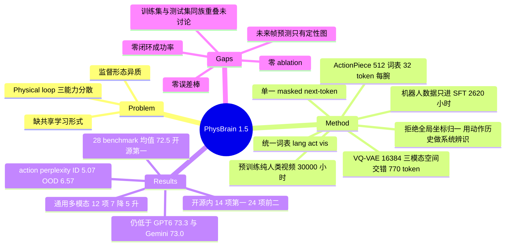

## Summary

PhysBrain 1.5 把 embodied understanding、end-effector 动作、future visual state 三类输出统一成离散 token，挂在 Qwen3-VL-Instruct 8B 的同一套 embedding 与 LM head 上，用同一个 masked next-token prediction 目标联合训练，其中 embodied 预训练监督全部来自人类交互视频（约 30,000 小时 curated 语料、97.2M 样本），机器人与仿真数据只在 SFT 阶段进入。作者自建统一评测口径重跑 28 个 embodied understanding benchmark，8B 模型 overall average 72.5，是表中开源第一（次优 Hy-Embodied-VLM-1.0 66.0），略低于按最低 thinking 档评测的 GPT-6-Astra 73.3 与 Gemini 3.6 Flash 73.0。但全文没有一处 ablation、一个闭环成功率、一条误差棒，action 与 future-state 这两根"统一"支柱只有定性可视化和 perplexity 曲线，因此这篇实际验证的是一套 understanding 数据配方，而不是 unification 假设本身。

## Problem & Motivation

论文的组织概念是 physical loop：agent 观察环境、理解空间关系与任务目标、预判动作后果、作用于环境，改变后的世界再回流成新的观察。作者主张一个 physical foundation model 应当在这个回路里同时提供理解、行动、预测三种可复用能力，而现状是这三件事分散在不同系统里——通用 VLM 管语义与指令跟随，专用模型管空间推理、grounding/affordance、planning、执行评估，VLA（π 系列、GR00T、Qwen-VLA）管机器人行为，DreamZero 与 Qwen-RobotWorld 管预测性世界建模，SayCan / Code as Policies / VoxPoser 在系统层把语言推理接到机器人能力上。

真正被点名的技术障碍是监督形态的异质性：理解任务产出语言、空间坐标与交互目标，动作生成要的是时序结构化的运动表示，future-state 预测要的是稠密视觉输出；训练数据又在 embodiment、标注规范、时间粒度上各不相同。论文要找的是一个能容纳这些差异、同时支持物理生成与广域 embodied 理解的共享学习形式。

需要讲清楚的是这个 motivation 与本文实际交付之间的落差。"三类目标互相增益"是全文的立论前提（§2.5 明说 perception 监督为预测交互提供上下文、action 与 state-transition 监督反过来注入物理先验以支持 spatial grounding 与 trajectory reasoning），但这句话在实验部分没有任何对照支撑——没有 understanding-only 与 joint 的对比，没有去掉 visual-foundation 分支的对比（C13）。论文交付的是一个在 understanding 榜单上很强的模型，加上两组说明"这套接口确实能吐出动作 token 与未来帧"的定性证据。

## Method

### 统一词表与单一目标

词表扩成三段：`V = V_lang ∪ V_act ∪ V_vis`，共享 embedding table 与 LM output head，训练目标是带 loss mask 的 next-token prediction，task format 与 modality delimiter 决定这一步该出语言、动作还是视觉状态，目标函数本身不变。没有 modality-specific prediction head，也没有 pixel-space 重建损失（C16）。

### Action：ActionPiece + 不做全局坐标对齐

人类动作经 Human-as-Humanoid 重定向，只保留双腕位置与朝向、丢弃手指。动作目标是相对当前腕部位姿的 chunk：`a = [相对平移 3, 6D 相对旋转 6, 绝对夹爪开合 1] ∈ R^10`，chunk 长度 H=16，全部锚在同一个 `(p_t, R_t)` 上不做逐步累积。ActionPiece tokenizer（DeepCybo 自研，非第三方）在 28.7M 个 16 步轨迹段、459.2M 个 action timestep 上训练，给出 512 词表，一条腕部轨迹编成 32 个 token，左右腕共用同一码本（C16、C20）。

这里有一个值得单独记住的设计取舍：**论文明确拒绝把所有 embodiment 归一到单一全局坐标系**，理由是各数据源的机器人/相机/控制约定差异大、部分源缺标定元数据，强行转换需要引入不可靠假设（C21）。代价是同一个名义动作维度在不同源里可能对应不同的局部轴、尺度、控制频率。补偿手段是把"当前观测之前的那一段动作"作为局部运动上下文喂进去，当作隐式 system identification 信号，于是动作预测从"孤立 chunk 回归"变成"条件化轨迹续写"：`p(z+ | I, u, e, f, z-)`，其中 e 是 embodiment、f 是动作频率、`z-` 可选。

这个设计是自洽的，但它把评测也一起绑死了——§5.3 的所有动作证据都是在给定 ground-truth 前序 chunk 的条件下产生的（C10），而前序 chunk 恰好泄露了该源的局部坐标约定。所谓 OOD 泛化因此是被强脚手架支撑的。

### Visual-Foundation Generation：三模态空间交错

未来物理状态定义为同一时间戳、同一图像坐标系下的三元组 `(RGB, depth, robot mask)`。三者用共享 VQ-VAE 在 128×128 下 tokenize，codebook K=16,384，下采样 8 倍得每模态 16×16=256 个码，加两个边界 token 后视觉词表 16,386。序列化方式是**按空间位置交错**：`[start, q1_rgb, q1_depth, q1_mask, …, qN_rgb, qN_depth, qN_mask, end]`，共 770 token，意图是让同一空间位置的跨模态 token 在自回归时互为近邻上下文（C16）。推理时反交错回三张 16×16 网格，各自用冻结 VQ decoder 重建。

### 数据：预训练纯人类视频，机器人数据只进 SFT

| 阶段 | 监督类型 | 来源域 | 样本数 |
|:--|:--|:--|:--|
| Pre-training | Perception（caption / VQA / 空间标注） | Human videos | 24.3M |
| Pre-training | Human action（EEF 轨迹） | Human videos | 31.2M |
| Pre-training | Future state（RGB + depth + 人体 mask） | Human videos | 26.8M |
| Pre-training | General instruction | Multimodal data | 14.9M |
| Embodied SFT | Understanding（语言与空间响应） | Multimodal data | 6.61M |
| Embodied SFT | Action（EEF 轨迹） | Human / robot / simulation | 5.4M |
| Embodied SFT | Future state（RGB + depth + robot mask） | Robot / simulation | 1.2M |
| Embodied SFT | General instruction | Multimodal data | 1M |

预训练语料聚合 Xperience-10M、Egocentric-10K、Ego4D、EgoVerse、EgoDex、EgoLife、Ego-Exo4D 加两个自有语料（PhysBrain-Human 的 ego 与同步 ego-exo 录制、PhysBrain-Ego360 的全景视频 + 全身姿态 + 任务语音），按任务与动作边界切成 task-coherent episode，过滤后约 30,000 小时（C11）。SFT 动作语料来自 17 个 real-robot 与 simulation 源：双臂 987 h、单臂 1,339 h、仿真 294 h，合计 2,620 h，另加 500 h 高质量人类运动（C12）。future-state 的 depth 用 MoGe-2、robot mask 用 RoboEngine 生成。

### 训练

ms-swift + Megatron-Core，base 为 Qwen3-VL-Instruct 8B，两阶段各训 1 epoch，第二阶段从第一阶段 checkpoint 初始化，数据按样本数比例混合。distributed Adam、3% warmup 到 peak LR 2e-5 后 cosine decay、max seq len 32,768、开 sequence packing、packing 后 global batch 约 2K 样本、grad clip 1.0、bf16（C17）。全文未报告 GPU 数、训练时长与总 token 量。

## Key Results

### 28 个 embodied benchmark（Table 4）

分数由作者统一重跑得到，不是引用各论文自报值。闭源模型按各自最低 thinking 档评测（Gemini minimal / GPT low / Claude adaptive-low），Hy-Embodied-VLM-1.0 与 MiMo Embodied 按官方建议开 thinking，其余（含 PhysBrain 1.5）不开（C4、C7）。

| 能力组（组内等权均值，本笔记按 Table 4 重算） | Gemini 3.6 Flash | GPT 6 Astra | Claude Opus 5 | Hy-Emb.-VLM-1.0 30A3B | Embodied-R1.5 8B | RynnBrain1.1 9B | Cosmos3 Nano 8B+8B | Qwen3-VL-Inst. 8B | **PhysBrain 1.5 8B** | 开源内位次 |
|:--|--:|--:|--:|--:|--:|--:|--:|--:|--:|:--|
| Foundational Visual-Spatial（2） | 89.6 | 82.8 | 86.7 | 87.7 | 82.8 | 86.4 | 84.4 | 83.8 | **89.0** | 1 |
| Spatial & Multi-view（9） | 70.8 | 70.2 | 62.4 | 64.9 | 54.0 | 67.3 | 55.3 | 54.1 | **70.1** | 1 |
| Embodied Cognition/Reasoning/Planning（6） | 64.9 | 68.4 | 60.9 | 57.1 | 57.6 | 55.8 | 56.8 | 53.5 | **68.5** | 1 |
| Grounding / Pointing / Affordance（9） | 74.4 | 74.6 | 70.1 | 63.8 | 71.5 | 54.3 | 63.2 | 58.7 | **70.8** | 2 |
| Visual Trace & Trajectory（2） | 83.5 | 87.3 | 85.4 | 86.0 | 88.2 | 82.9 | 84.6 | 81.3 | **87.3** | 2 |
| **Overall Average（28，论文口径）** | **73.0** | **73.3** | **67.9** | **66.0** | **64.9** | **63.1** | **62.3** | **59.5** | **72.5** | **1** |

- 开源内 14 项第一、10 项第二，合计 24 项进前二；余下 4 项为 EmbSpatial-Bench 第 3、PixMo-Points 第 3、Where2Place 第 4、**RefSpatial-Bench 第 6**（50.9，落后 RynnBrain1.1 的 63.2 达 12.3 分）——而 RefSpatial-Train 就在它的 SFT 混合里（C5、C14）。
- 相对 base model Qwen3-VL-Instruct 8B，28 项全涨，无一例外（C6）。涨幅最大的五项：MindCube +52.3、VLABench +31.6、EgoPlan-Bench2 +30.0、Part-Affordance +27.6、Q-Spatial +26.7。
- 对 GPT-6-Astra 与 Gemini 3.6 Flash 仍是落后 0.8 / 0.5 分，不是持平更不是超越；abstract 的 "on par with" 对应的是这个差值，且闭源侧是最低 thinking 档（C3、C4）。

**6.5 分领先的来源分解（本笔记按 Table 4 重算，非论文陈述）**：相对 Hy-Embodied-VLM-1.0 的 6.55 分总差中，56% 来自 5 个 benchmark——VLABench（+25.5）、Part-Affordance（+21.2）、MindCube（+20.8）、RoboVQA（+20.3）、EgoPlan-Bench2（+14.6）。其中 VLABench、RoboVQA-Train、MindCube-Train、EgoPlan-IT 都在 SFT understanding 混合里（Table 2）。另有两项是负的：ERQA −3.5、SAT −2.0。

### 通用多模态（Table 5 / 6）

对照组只有 base model 自己，无第三方 baseline。12 项里 7 降 5 升（C15）：

| 下降 | MME 2392.70→2330.07 | MVBench 68.53→66.07 | DocVQA 95.66→94.43 | AI2D 83.74→82.16 | VideoMME 69.07→68.22 | TextVQA 81.94→81.58 | ScreenSpot 91.59→90.17 |
|:--|:--|:--|:--|:--|:--|:--|:--|
| **上升** | V\* 83.77→87.96 | ChartQA 84.96→86.24 | POPE 88.40→89.49 | RealWorldQA 68.37→69.41 | MMStar 64.99→65.60 | | |

abstract 的 "retaining general multimodal capabilities" 成立在"没有塌陷"的意义上，但 MVBench −2.46 与 MME −62.6 不是零代价。

### 动作与未来状态：只有定性证据

- **无任何闭环执行结果**。全文没有 real-robot 成功率，也没有 simulator 任务成功率。论文自己在 Fig. 4 图注与 §5.3.1 末尾两次写明证据边界："These visualizations compare predicted trajectories with ground truth rather than report executed robot rollouts"、"rather than closed-loop execution or full-task success"（C8）。这份自我披露的诚实度应当记功，但也确认了 claim 的天花板。
- **Action-token perplexity**（Appendix B.3 / Fig. 7）：从首个到末个预训练 checkpoint，ID 从 17.12 → 5.07，held-out RoboDojo 从 12.39 → 6.57（C9）。注意起点：OOD 起始 perplexity（12.39）本就低于 ID（17.12），两条曲线跨源不可比，"OOD 也在降"只能读作"该源的 action token 分布被逐渐拟合"，不能读作跨 embodiment 泛化强度。
- **轨迹可视化**：Fig. 4 图像平面、Fig. 5 三维（含 RoboDojo OOD 两例），论文自评 OOD 上"positional deviations remain visible"。所有预测都以 ground-truth 前序 16 步 chunk 为条件（C10）。
- **Future visual prediction**（Fig. 6）：1 秒预测窗，RGB + depth + robot mask 三路空间一致，纯定性，无 FVD / PSNR / LPIPS 一类指标，也无与任何 video prediction baseline 的对比。

## Evidence Ledger

| Claim ID | Claim | Type | Source locator | Evidence excerpt | Status |
|:--|:--|:--|:--|:--|:--|
| C1 | 28 个 embodied benchmark 上 8B 模型 overall average 72.5，为表中开源最高 | number / sota-novelty | Abstract；Table 4 "Overall Average" 行 | "our 8B model achieves an average score of 72.5, setting a new open-source state of the art" | source-verified（verifier 独立重算：72.5 为 9 个开源值最大，次优 66.0） |
| C2 | 领先最强开源 baseline Hy-Embodied-VLM-1.0（66.0）6.5 分；该 baseline 为 30A3B 且开 thinking，PhysBrain 无 thinking 模式 | comparison / benchmark-setting | §5.1.3；Table 4 表头；§5.1.2 | "surpassing the strongest open-source baseline, Hy-Embodied-VLM-1.0, by 6.5 points" | source-verified（表头 "Hy-Emb.-VLM-1.0 30A3B think."；§5.1.2 其余模型 "without a thinking mode"） |
| C3 | GPT-6-Astra 73.3 与 Gemini 3.6 Flash 73.0 均高于 72.5；PhysBrain 高于 Claude Opus 5（67.9）4.6 分 | comparison | §5.1.3；Table 4 | "Gemini 3.6 Flash (73.0) and GPT-6-Astra (73.3) in overall score, while outperforming Claude Opus 5 (67.9) by 4.6 points" | source-verified |
| C4 | 闭源模型按各自最低官方 thinking 档评测 | benchmark-setting | §5.1.2 | "lowest available official thinking setting: minimal thinking for Gemini, low thinking for GPT, and adaptive thinking with low effort for Claude" | source-verified |
| C5 | 开源内 14 项第一、24 项进前二；余 4 项为 EmbSpatial 3 / PixMo-Points 3 / Where2Place 4 / RefSpatial 6 | number | §5.1.3；Table 4 | "It ranks first on 14 benchmarks and among the top two on 24." | source-verified（verifier 写 nesting-aware parser 从 `ltx_font_bold` 与原始值双路重算，与散文一致；非前二的 4 项为独立发现） |
| C6 | 28 个 benchmark 全部优于 base model Qwen3-VL-Instruct 8B | number | §5.1.3；Table 4 两列 | "It also outperforms our base model, Qwen3-VL-Instruct (8B), on all 28 benchmarks." | source-verified（逐列比对，0 行例外） |
| C7 | 所有对照模型由作者重跑；10 个 point-localization benchmark 改用自研 micro-averaged F1 取代原实现的 precision-only / recall-only；分数可能与原论文不符 | benchmark-setting | §5.1.2；Appendix B.1.2 | "we evaluate all point-localization tasks using a micro-averaged F1 score that jointly measures localization correctness and target coverage" | source-verified（B.1.2 点名恰好十个 benchmark；§5.1.2 "some scores in our table may differ from those reported in the original papers"） |
| C8 | 全文无任何 real-robot 或 simulator 闭环成功率；动作侧证据只有离线轨迹可视化与 action-token perplexity | benchmark-setting | §5.3.1、§5.3.2、Fig. 4 图注、Appendix B.3；全文检索 | "The evidence concerns offline trajectory prediction conditioned on observed action history, rather than closed-loop execution or full-task success." | source-verified（verifier 全文 sweep："success" 仅 2 处命中，另一处为 Q-Spatial-Bench 的距离比 success-rate 指标，属理解类 benchmark；全文仅 6 表 14 图，无 rollout 表） |
| C9 | action-token perplexity：ID 17.12→5.07，held-out RoboDojo 12.39→6.57（首个到末个 checkpoint） | number | Appendix B.3；Fig. 7 | "perplexity decreases from 17.12 to 5.07 on ID data and from 12.39 to 6.57 on RoboDojo" | source-verified |
| C10 | 动作预测在推理时以 ground-truth 前序 16 步 chunk 为条件；RoboDojo OOD 样本全部带 ground-truth action history | benchmark-setting | §5.3.1；Appendix B.3 | "the preceding 16-step ground-truth action chunk" / "All RoboDojo test examples include ground-truth action history" | source-verified |
| C11 | embodied 预训练监督全部来自人类交互视频；curated 源语料约 30,000 小时；四类样本 24.3M / 31.2M / 26.8M / 14.9M | number | Abstract；§3.1；Table 1 | "The curated source corpus contains approximately 30,000 hours of video." | source-verified（Table 1 四行逐一核对；general instruction 行的 domain 是 "Multimodal data" 而非人类视频，"entirely from human interaction videos" 只覆盖 embodied 三类） |
| C12 | SFT 动作语料约 2,620 h real-robot + simulation 加 500 h 人类运动；SFT 四类样本 6.61M / 5.4M / 1.2M / 1M | number | §3.2.2；Table 1；Table 3 | "approximately 2,620 hours of real-robot and simulation trajectories and 500 hours of high-quality human motion data" | source-verified（Table 3 分项 987+1,339+294=2,620 h 重算吻合） |
| C13 | 全文无 ablation：没有任何实验分离 action / future-state 联合训练对 understanding 的贡献 | causal-mechanism | 全文正文 + Appendix A–B（字符串穷举） | （缺席：全文 "ablat" 命中 0 次） | source-verified（除 3 张数据表与 Table 4–6 外无其他表；无 understanding-only vs joint 对照） |
| C14 | SFT understanding 混合含多个被评测 benchmark 的同族训练数据 | benchmark-setting | Table 2（§3.2.1）vs Table 4 / §5.1.1 | "RoboRefIt-Train, … PixMo-Points, … RefSpatial-Train, RoboPoint, RoboSpatial-Train, RoboAfford-Train" | source-verified（12 组对应全部确认。**两处口径须保留**：VLABench / ShareRobot / PixMo-Points 在 Table 2 中未带 "-Train" 后缀，"官方训练集"只对其余九组明确；EgoPlan-IT 是 EgoPlan-1 的指令集而受测的是 EgoPlan-Bench2） |
| C15 | 12 项通用多模态中 7 降 5 升 | number | Table 5、Table 6；§5.2.1 | "Qwen3-VL-Inst. 8B 2392.70 64.99 68.37 69.07 68.53 88.40 / PhysBrain 1.5 8B 2330.07 65.60 69.41 68.22 66.07 89.49" | source-verified（12 组逐对吻合） |
| C16 | 架构数字：base Qwen3-VL-Instruct 8B；ActionPiece 512 词表、每腕 32 token、H=16、10 维 EEF；视觉词表 16,386（K=16,384 + 2）、128×128、三模态交错共 770 token | number | §2.1、§2.3、§2.4；§4 | "The tokenizer provides a 512-token action vocabulary" / "therefore contains K+2=16,386 tokens" | source-verified |
| C17 | 训练：每阶段 1 epoch、distributed Adam、3% warmup 至 peak LR 2e-5 后 cosine、max seq len 32,768、packing 后 global batch 约 2K、bf16、ms-swift + Megatron-Core | number | §4 Training | "learning rate warms up over the first 3% of training steps to a peak of 2×10^-5, followed by cosine decay" | source-verified |
| C18 | 通用多模态图像评测用随机解码（temperature 0.7 / top-p 0.8 / top-k 20 / seed 3407）；全文无方差、标准差、误差棒、置信区间或多 seed 结果 | benchmark-setting | Appendix B.2.1；全文检索 | "temperature 0.7, top-p 0.8, top-k=20, repetition penalty 1.0, presence penalty 1.5, and seed 3407" | source-verified（**口径收窄**：该组参数写在 B.2.1 "Qwen-aligned image profile" 下，B.2.2 视频侧未重述，embodied 表的解码设置全文未给。方差部分完全成立：variance / standard deviation / error bar / confidence interval / significan* 全文 0 命中） |
| C19 | 给出 project page、HuggingFace collection 与 Evaluation Kit 链接；正文未声明模型权重 license | license-code | 首页脚注（\projectpage、\checkdata）；全文 license 检索 | "[Huggingface] https://huggingface.co/collections/DeepCybo/physbrain-15 [Evaluation Kit] https://github.com/DeepCybo-PhysAI/PhysBrainEvalKit" | source-verified（全文唯一 "License" 字符串是 arXiv 自身的 "arXiv.org perpetual non-exclusive license" 投稿许可，不是权重许可） |
| C20 | ActionPiece 在 28.7M 个 16 步 EEF 轨迹段（459.2M action timestep）上训练 | number | §2.3 | "trained on 28.7 million 16-step end-effector trajectory segments corresponding to 459.2 million action timesteps" | source-verified |
| C21 | 明确不做跨 embodiment 的全局坐标归一，保留各源原生坐标轴，改用近期动作历史作隐式 system identification | causal-mechanism | §2.3 "Homogeneous action continuation"；§3.2.2 | "we do not impose a single globally canonicalized coordinate frame or motion convention across all embodiments" | source-verified |
| C22 | 署名 "DeepCybo Team" + 53 位按姓氏字母序排列的 contributor；2026-09-14 投 arXiv，cs.CV（primary）/ cs.RO；technical report | number | 作者块；Appendix A；arXiv abs 页元数据 | "The contributors are listed alphabetically by family name" | source-verified（verifier 计数恰 53 人、程序验证姓氏序无违例。**全文未出现任何机构 affiliation**：`ltx_authors` 块只有 "DeepCybo Team"，无 `ltx_role_affiliation`，University / Institute / Academy / Laboratory / corresponding-author 全文 0 命中。frontmatter 的 `institute: ["DeepCybo"]` 是从团队名与 project/GitHub/HF 组织名推得，非论文明文） |

## Strengths & Weaknesses

**论文对自身证据边界的披露是超出同类技术报告水准的，应当先记功。** §5.3.1 末尾与 Fig. 4 图注两次主动写明"这是与 ground truth 的对比，不是执行 rollout""这是离线轨迹预测，不是闭环执行或整任务成功"（C8）；Fig. 5 图注点明各例保留各自源的坐标约定、不做跨源对齐；Appendix B.3 点明 ID 测试集与训练集共享数据源但 episode 不相交、RoboDojo 全部带 ground-truth action history（C10）。在一个把"unified physical foundation model"写进标题的报告里，把动作与预测这两条支柱明确降级为定性说明，而不是拼一张 LIBERO 表充数，这是罕见的自律。B.1.2 把十个 point benchmark 原实现的 precision-only / recall-only 异质口径统一成 micro-F1、并把 RoboRefit 的 bbox 标注换成修正后的 instance mask（C7），同样是在给自己加难度而不是减难度。

**但"统一"这个核心主张在本文中是零实证的。** 全文没有一处 ablation（C13）。§2.5 明确把"三类监督互为补充、注入共享物理表示"当作统一目标的动机，而验证这句话只需要一次对照——只用 understanding 数据 SFT 的同规模模型 vs 完整三路联合。这个实验没有做。于是 72.5 这个数所能支持的结论只有"这套数据配方 + 这个 base model 很强"，无法区分收益来自 6.61M understanding SFT、24.3M perception 预训练，还是来自动作与未来帧监督。这不是苛求：同为 2026 年 9 月的 [[2609-OpenWAM]] 用六个受控变量把 world-action 的设计空间逐项测了一遍，证明这类实验在同等规模下是做得起的。

**"open-source SOTA" 的含金量被 train/test 同族重叠严重稀释，而论文对此只字未提。** SFT understanding 混合里至少九个数据集是被测 benchmark 的官方训练集（RoboRefIt-Train、RefSpatial-Train、RoboSpatial-Train、RoboAfford-Train、SAT-Train、MindCube-Train、VSI-590K/VSI-Train-10K、RoboVQA-Train、EgoPlan-IT），另有 VLABench、ShareRobot、PixMo-Points 以无后缀形式列入（C14）。本笔记按 Table 4 重算的领先来源分解显示，相对 Hy-Embodied 的 6.55 分总差里 56% 来自 VLABench / Part-Affordance / MindCube / RoboVQA / EgoPlan-Bench2 五项，其中四项的训练数据就在混合里。相对 base model 涨幅最大的五项（MindCube +52.3、VLABench +31.6、EgoPlan-Bench2 +30.0、Part-Affordance +27.6、Q-Spatial +26.7）呈现同一模式。这在 embodied brain 这一赛道是行业惯例——[[2604-HYEmbodied]]、[[2602-RynnBrain]]、[[2603-ACEBrain0]] 大概率也各自 SFT 过一批同族训练集——但正因为如此，这张表度量的是"各家 SFT 混合与这 28 个测试集的重合度"，不是 embodied 理解能力的高下。全文 "contamination" / "overlap"（指 benchmark 层面）0 命中。

**一个自证的反例值得单独标出：RefSpatial-Bench 上训了训练集仍排开源第 6（50.9 vs RynnBrain1.1 的 63.2）。** 同样训过的 SAT 上比 Hy-Embodied 低 2.0，ERQA 上低 3.5。这说明同族训练并不自动兑现榜单位次，也说明该模型在 referring-spatial 类任务上有真实的能力缺口——这恰恰是最需要一次 ablation 去解释的地方。

**对照的公平性是两头不靠。** 往有利于本文的一侧：Hy-Embodied-VLM-1.0 是 30B total / 3B active 的 MoE 且开 thinking，MiMo Embodied 开 thinking，Cosmos3 Nano 是 8B+8B，而 PhysBrain 1.5 是 8B dense 无 thinking（C2、C4）——在 active 参数与推理预算上本文是吃亏的一方。往不利的一侧：闭源模型一律按**最低** thinking 档评测，于是 abstract 的 "on par with GPT-6-Astra and Gemini 3.6 Flash" 实际读法是"与低思考预算下的它们相差 0.8 / 0.5 分"（C3）。更根本的是没有任何 baseline 在相同数据、相同算力下重训过——这是技术报告的通例，但它使得"SOTA"归因于 unification 假设这件事完全无从判断。

**0.5–0.8 分的差被用来支撑"on par"，而全文没有一条误差棒。** 通用多模态的图像评测用 temperature 0.7 / top-p 0.8 的随机解码、单一 seed 3407、单次运行（C18），embodied 表的解码设置则全文未交代。variance / standard deviation / error bar / confidence interval 在全文 0 命中。在这个预算下，72.5 与 73.0 之间的 0.5 分不具备可判别性。

**"Overall Average" 是 28 个异质 benchmark 的非加权宏平均，这个口径本身在做工作。** 五个能力组的 benchmark 数是 2 / 9 / 6 / 9 / 2，于是 spatial 与 grounding 两组占了 18/28 的权重，而 Visual Trace 组全员挤在 80 分区间、MindCube 全员跨度 30–94。高方差 benchmark 因此对总分有超额影响。论文自己也提供了组内等权的说法（"ranks among the top two open-source models in all five categories"），本笔记按该口径重算确认成立（Grounding 与 Traj 两组第 2），但这两种口径给出的领先幅度差别很大，引用时应说明用的是哪一种。

**真实增量需要与两条已有路线对齐才看得清。** 把"语言 + 动作码放进同一词表、单一 next-token cross-entropy、单个 decoder"当作方法贡献是站不住的——[[2608-GalaxeaG05|G0.5]] 已经这么做了，而且是在同数据、同算力、同观测与控制栈的真机对照里做的（76.7% vs π0.5 的 53.3%）。把人类 egocentric 视频显式重建成统一 state-action 用于预训练也不是新的——[[2607-EgoSteer]] 的 EgoSmith 管线用 9.6K 小时做到了，并交付了 40 个真机任务 75% 成功率。PhysBrain 1.5 在这两条线上的真实增量是：(a) 把**未来视觉状态**（RGB / depth / robot mask 按空间位置交错的 VQ token）也折进同一个 LM head，据本笔记所见这是第一次；(b) 人类视频侧的规模推到约 30,000 小时 curated，且 embodied 预训练**完全不含机器人数据**。但两条增量都没有对应的量化证据——(a) 只有定性帧，(b) 没有"预训练加不加机器人数据"的对照。

**"未来帧预测"这条支柱的评测缺位最明显。** 128×128 的 VQ 重建、1 秒预测窗、三模态空间一致性，全部只有 Fig. 6 的几行定性图，没有 FVD / PSNR / LPIPS，没有与任何 video prediction 或 world model baseline 的比较，也没有"预测的未来帧能否用于下游"的任何证据。相比之下 [[2609-OpenWAM]] 与 [[2608-JEPAWAM]] 这一支至少把 world prediction 接到了策略成功率上。

**一处质量瑕疵**：§5.2.2 的交叉引用写成 "As shown in Table 6 and Table 6"（应为 Table 5 和 Table 6），HTML 与 PDF 皆然。

## Connections

- [[2607-EgoSteer]] —— **最贴切的前作对照**。EgoSmith 同样把 in-the-wild egocentric 视频显式重建成统一 state-action（R^48 相机系，9.6K 小时 / 2.09M episodes），同样主张用表示一致性绕开 latent action 的不可解释性，而且交付了 187h 真机数据 + DAgger + 40 任务 75% 成功率。PhysBrain 1.5 在数据规模上高出约 3 倍（30,000 h curated），在动作表示上更轻（双腕 10 维 EEF vs R^48 含灵巧手），但**在策略证据上是净倒退**：EgoSteer 有真机成功率，PhysBrain 1.5 一个都没有。这是判断本文贡献时最该摆在旁边的一篇。
- [[2608-GalaxeaG05]] —— 统一离散词表这条路线的承重前作。G0.5 用单个 decoder、共享 vocabulary、单一 next-token cross-entropy 同时产出 CoT 与 RVQ 动作码，并在同数据同算力的真机微调对照里超过 π0.5 23.4 分。PhysBrain 1.5 的 `V_lang ∪ V_act ∪ V_vis` 是同一范式的扩展，新增的是 `V_vis`。因此本文在"纯离散 AR 能不能承担 foundation 规模"这个争论上**不构成新证据**——它没有策略数字可以进入那场对话。
- [[2604-HYEmbodied]] —— Table 4 的最强开源对照 Hy-Embodied-VLM-1.0（30A3B, thinking）是 vault 里 HY-Embodied-0.5 的后继。0.5 版走 MoT + 迭代 RL/RFT + on-policy distillation 且有真机 VLA 下游，1.0 版在本表被 PhysBrain 以 66.0 vs 72.5 压过 6.5 分——但那 6.5 分的 56% 集中在四个训过同族数据的 benchmark 上。
- [[2602-RynnBrain]] / [[2601-RoboBrain25]] / [[2603-ACEBrain0]] / [[2511-MiMoEmbodied]] / [[2508-EmbodiedR1]] / [[2503-CosmosReason1]] —— 表中其余开源对照的前代，vault 全部有笔记。逐项看的话这张表并非一边倒：ACE-Brain-0.5 在 MindCube 上 94.2 反超 PhysBrain 的 86.2；RynnBrain1.1 在 VSI-Bench（65.9）、MMSI（46.0）、RefSpatial（63.2）三项领先；RoboBrain2.5 拿下 ShareRobot-Traj（85.2）；**Embodied-R1.5 在 Part-Affordance（83.4）、VABench-Point（75.7）、Where2Place（75.0）、VABench-Visual-Trace（92.3）四项第一**——[[2508-EmbodiedR1]] 那条 "pointing 作为 embodiment-agnostic 中间表示 + RFT" 的路线在 grounding/pointing 子域至今没被这类 generalist 配方压倒，值得作为一条持续观察的对照线。
- [[2609-OpenWAM]] —— 同月、同样处理"理解/世界预测/动作"三者关系，但方法论恰成反面：OpenWAM 把设计空间拆成可受控变量逐项消融，并接了八个仿真 benchmark 与三个真机本体。它的附录把 **PhysBrain 1.0** 作为 VLA baseline 列在 RoboCasa-GR1 上（64.5，反超 OpenWAM-α 4.0 分）——即前代是有策略数字的，1.5 反而退了回去。两篇合看，"unified 模型该用什么证据来证明自己"这个问题上，PhysBrain 1.5 站在弱的一侧。
- [[2507-VLATokenizationSurvey]] / [[Topics/VLA-Survey]] —— ActionPiece（DeepCybo 自研，非第三方）应并入 action tokenization 谱系（uniform binning → VQ-VAE → FAST DCT → FACT → RVQ ActionCodec → ActionPiece）。VLA-Survey 第 1 条路线"AR discrete token"与第 8 条横切议题"接口的位置与形状"都应记入本文的一条**负面数据点**：一个完整的离散统一接口被实现并训练到 8B 规模，但作者没有给出任何执行侧证据，因此它不能被引为该路线可行性的支持。
- [[Topics/EmbodiedAI-Survey]] —— 28-benchmark 的统一重评口径（EmbodiedEvalKit + 自定义 micro-F1 + RoboRefit mask 修正）本身有 survey 价值：它是目前公开的 embodied understanding 评测口径中较系统的一套，但也意味着 2026 年 9 月之后的 embodied brain 榜单出现了第二套互不兼容的口径，跨论文引用数字须注明来源口径。
- [[Topics/WorldModel-Survey]] —— 可选 cross-link。future-state 的 RGB+depth+mask 三模态空间交错 token 是一个新颖的 world-model 输出形式，但证据纯定性，建议以 open-problem 而非 finding 的身份并入。

## Mind Map

## Notes

- **最想看到的一个实验，代价极低**：只用 understanding 数据做同规模 SFT，与三路联合训练比 28-benchmark 均值。这一个对照就能把全文最核心的那句话（动作与未来帧监督注入物理先验、反过来改善 spatial grounding 与 trajectory reasoning）从动机变成结论。现在它是零证据的。次优替代：把 future-state 这一路砍掉，看 Visual Trace 与 Grounding 两组是否回落——那是理论上最该受益的两组，而恰好也是 PhysBrain 仅排开源第 2 的两组。
- **一条可检验的怀疑**：论文用"保留各源原生坐标轴 + 动作历史作隐式 system identification"替代全局坐标归一（C21），这是本文最有 taste 的一处设计——但它的验证方式（给 ground-truth 前序 chunk 再预测后续）把待证命题当成了输入条件。干净的检验是消掉 `z-`（论文明说它是 optional）再看 perplexity 与轨迹形状：如果不给动作历史模型就无法推断局部约定，那"隐式系统辨识"只是"抄前一段的坐标系"的另一种说法。这个实验 Appendix B.3 的框架里就能跑，作者没做。
- **跨论文张力（值得记入 VLA-Survey）**：[[2607-EgoSteer]] 与本文都主张"人类视频不必经 latent action 也能用"，但 EgoSteer 交付 40 任务真机 75%，本文交付零策略数字；同时 [[2608-GalaxeaG05]] 证明纯离散统一词表能在真机对照上赢连续头。三篇拼起来的推论是：**人类视频显式重建 + 离散统一接口这条组合路线的可行性已有证据，而 PhysBrain 1.5 把规模推到 30,000 小时后没有回答"规模换来了什么"**。这是一条明确的空白。
- **引用口径提醒**：(1) Table 4 的分数全部是作者重跑、且十个 point benchmark 用的是自研 micro-F1（C7），不可与各原论文自报值混用；(2) "on par with GPT-6-Astra / Gemini 3.6 Flash" 的前提是闭源侧最低 thinking 档（C4），单独引用会误导；(3) "Overall Average" 是 28 项非加权宏平均，与论文另一处"五个能力组组内等权"的口径不同，领先幅度会变；(4) RoboDojo 的 perplexity 起点低于 ID，跨源 perplexity 不可直接比较，不要当作跨 embodiment 泛化强度的度量；(5) frontmatter 的 `institute` 是从团队与组织名推得，论文全文无任何机构署名（C22）。
- **未消化的血统**：PhysBrain 1.0（arXiv:2605.15298）、ActionPiece（DeepCybo, 2026）、Human-as-Humanoid、PhysBrain-Ego360 四篇 vault 全无笔记，而它们是本文动作表示与数据管线的全部地基。其中 **ActionPiece 最值得单独 digest**——本文的动作侧一切（512 词表、每腕 32 token、跨源共享码本）都建在它上面，而本文对它的描述只有一段。PhysBrain 1.0 次之（它有策略数字，可以用来回答"1.5 相对 1.0 在执行侧是进是退"）。
- **repo 值得跑，但要跑对的那个**：`PhysBrainEvalKit` 是评测工具而非模型训练代码，所以 repo-digest 的收益不在"实现细节"而在**核对 B.1.2 那套自研指标**——micro-averaged F1 的 Hungarian 匹配实现、RoboRefit 的 instance mask 修正、PointBench 的 exact-count 约束、RoboSpatial-Home 的 point/binary 加权融合。这四处直接决定了十个 grounding benchmark 上所有模型的分数，也是这张表与既有文献不可比的根源。同时可查 HF collection 是否真的放出了权重与其 license（C19 确认论文正文未声明）。
- 相关笔记：[[2607-EgoSteer]]、[[2608-GalaxeaG05]]（真实增量的两个参照系）、[[2609-OpenWAM]]（同期方法论反面 + PhysBrain 1.0 的策略数字来源）、[[2604-HYEmbodied]]、[[2602-RynnBrain]]、[[2601-RoboBrain25]]、[[2603-ACEBrain0]]、[[2511-MiMoEmbodied]]、[[2508-EmbodiedR1]]、[[2503-CosmosReason1]]（Table 4 对照模型的前代）、[[2507-VLATokenizationSurvey]]、[[Topics/VLA-Survey]]、[[Topics/EmbodiedAI-Survey]]。
