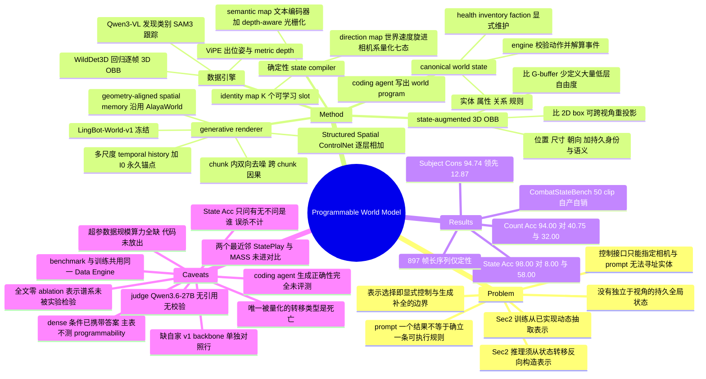

## Summary

PWM 把 video world model 劈成两半——一个轻量 engine 按 coding agent 写出的可执行程序维护 canonical world state（实体 / 属性 / 关系 / 规则），pretrained video model 退居为 renderer——中间用 state-augmented 3D OBB 相连：OBB 在目标相机下被确定性编译成 identity / semantic / direction 三张 pixel-aligned control map，驱动挂在冻结 LingBot-World-v1 上的 Structured Spatial ControlNet。自建的 CombatStateBench（50 clip）上 Count Accuracy 94.00 / State Accuracy 98.00，对照 LingBot-World-V2 的 40.75 / 8.00 与 YUME 的 32.00 / 58.00。但主表几乎不构成对"programmable engine"的证据——两个 baseline 只能靠 prompt switching 接收状态转移，而 PWM 把"哪个实体该画在哪、死没死"当作 dense pixel-aligned 条件直接送进网络，表里量的更接近"ControlNet 是否跟随自己的条件"；全文零 ablation，真正值钱的是 Sec 2 那条 training–inference asymmetry 论证，而它没有被任何实验检验。

## Problem & Motivation

作者对现有 interactive video world model 提了三条缺口，三条都指向同一件事：这些模型能生成合理的观测，但没有一个可被程序读写的世界。第一，控制接口只能指定相机、动作或高层 prompt，无法直接寻址和操纵某一个实体；第二，没有独立于当前视角存在的显式全局状态，因而 off-screen 实体、inventory、任务进度、交互历史这些不在画面里的世界事实无处安放；第三，用户无法编写支配世界演化的规则——论文那句 "Prompting a desired outcome does not establish an executable rule that consistently governs subsequent interactions" 是全文最锋利的一句话。

值得记一笔的是这句话首先打的是自家前作：[[Papers/2607-AlayaWorld]]（同一 lab）的开放动作机制正是 chunk 级 prompt switching。PWM 的 problem statement 因此是一次明确的自我否定，这在同实验室的连续工作里不常见。

真正有分量的思考在 Sec 2 的表示权衡，它把"用什么中间表示"从审美问题变成了一个有结构的判断。作者指出训练与推理对同一表示的获取方向是相反的：训练时动态已经发生，表示是从已实现的动态里**抽取**出来的（Eq. 1，realized dynamics → structural representation）；推理时系统先拿到一个高层状态转移，必须**主动构造**出对应的时变结构表示，再交给生成模型实现（Eq. 2，state transition → structural representation → generated dynamics）。于是"训练时拿得到"不等于"推理时写得出"——说一个角色摔倒很容易，生成它的身体姿态与肢体轨迹很难。表示越细，系统就越是从"指定世界里什么变了"滑向"指定这个变化在几何与动力学上如何展开"，最终退化成传统动画、motion generation 或物理仿真要解的高维动态实现问题。表示选择因此是**显式结构控制与生成式动态补全之间的边界线**：太弱，本该被约束的实体位置与世界空间结构被甩给生成模型；太强，训练监督更贵且推理时要自己确定海量低层细节。3D OBB 被选为这条线上的折中点。

## Method

### Canonical world state 与程序化

世界状态写作 $s_t=(\mathcal{E}_t,\mathcal{A}_t,\mathcal{Q}_t;\mathcal{R}_t)$：$\mathcal{E}_t$ 是持久实体与其 3D 位姿，$\mathcal{A}_t$ 是语义与功能属性，$\mathcal{Q}_t$ 是实体间关系，$\mathcal{R}_t$ 是可执行世界规则。初始化时一个 off-the-shelf 3D detector 从首帧 $I_0$ 恢复可见实体与几何布局，给出初始 OBB 与持久标识符（该 detector 在正文中未命名）。随后 agent orchestrator 把恢复出的 3D 布局与用户的自然语言描述 $q$ 合成一份 engine-readable world program：实体初始状态与属性、关系、支持的动作、动作与事件如何更新世界的规则，还可包含全局约束、事件触发器与任务目标，全部通过持久标识符 grounding 到检测出的实体上。

引擎转移 $s_{t+1}=F(s_t,a_t)$ 每步对照当前属性、关系与规则校验动作合法性，施加效果，解算被触发的事件。关键是 health、inventory、faction 这类**在观测里没有直接视觉表现**的变量也由引擎显式维护，并继续影响后续转移与渲染结果。

### 确定性 state compiler

$M^{\mathrm{ctrl}}_{t+1}=P(s_{t+1},C_{t+1})$ 不改动世界状态，只抽取渲染相关变量、在目标相机下投影 OBB，光栅化出三张 channel 拼接的控制图：

| 控制图 | 构造 | 作用 |
|:--|:--|:--|
| identity $M^{\mathrm{id}}$ | 一组 $K$ 个可学习 identity embedding，每个持久实体占一个固定 slot，embedding 光栅化到 OBB 可见投影上 | 跨遮挡、跨出入画维持实例对应；训练时 slot 在样本间随机、序列内固定，防止某个 embedding 与特定类别 / 外观 / 视角虚假绑定 |
| semantic $M^{\mathrm{sem}}$ | 预训练 text encoder 编码语义标签 $y_i$，depth-aware 光栅化解遮挡，背景置零 | 给没有外观参考的新进实体提供类别先验；同类共享语义表示、靠 identity slot 区分 |
| direction $M^{\mathrm{dir}}$ | 取引擎维护的 world-space velocity，旋到目标相机坐标系，量化成 forward / backward / left / right / static / up / down 七态，各配一个可学习 embedding | 与 camera-conditioning 通路解耦：方向从 world-space 速度而非 image-space 位移算，相机运动不会把静止实体标成运动 |

### Generative renderer

底座是 LingBot-World-v1，连同其自带的 camera-conditioning 通路整个冻结；新挂一个可训练 Structured Spatial ControlNet，把控制序列编码到 video latent 的空间分辨率，逐层产出 $r^{(\ell)}$ 加进主干对应 block。长时程走 chunk-autoregressive：chunk 内双向去噪，跨 chunk 边界因果传播。每个非首 chunk 额外吃两路记忆——temporal history 按 recent / mid-range / long-range 分档，近处 latent 投成细粒度 token、远处逐级粗化，并把 $I_0$ 的 latent 作为永久锚点保留，训练时对历史做噪声扰动、特征损坏与部分丢弃以容忍不完美的自回归上下文；geometry-aligned spatial memory 则**直接沿用 AlayaWorld**，把已完成 RGB 帧用估计深度与相机参数 lift 进 world-space，生成新 chunk 前检索并重投影到目标视角。

### 自动数据引擎

ViPE 估相机内参、位姿与 metric depth → Qwen3-VL agent 产出全局 caption 并挑出离散可数的物体类别集 → SAM3 按该类别集做 video instance segmentation 与 tracking（可见面积过小的 mask 丢弃）→ WildDet3D 接 2D box + RGB + depth + 内参回归逐帧 3D OBB $b_i^t=(\mathbf{p},\mathbf{d},\mathbf{R},\ell,k)$ → 统一到世界坐标系按 track 聚合成轨迹，相邻中心位移量化成同一套七态（小位移阈值判 static）→ z-buffer 光栅化成三张 conditioning map。

## Key Results

**设置**：训练数据是 Cyberpunk 2077（第一人称）、Forza Horizon 6 与 GTA V（第三人称）的 HUD-free gameplay 录像。数据规模、分辨率、训练算力、chunk 长度 $L$、窗口帧数 $T$、identity bank 大小 $K$、优化器与训练步数**全部未报告**——全文没有 implementation details 节，没有 limitations 节，没有附录（C8、C25）。

**CombatStateBench**：50 个 clip。每个场景由 Sec 4.5 的同一套 Data Engine 从首帧重建初始 3D 布局，再由一个 AI agent 依初始布局与抽取出的游戏规则自主演化出一段 combat 剧本，产出完整的 box-based 世界状态序列；一个自动 verifier 检查首帧重投影、metric depth 一致性、box 几何、地面接触、时间连续性、规定的相机与实体运动、状态转移的持久性，只保留全部通过的序列（候选池规模与拒绝率未报告）。

| Method | Imaging | Subject Cons. | Background Cons. | Temporal Stability | Count Acc. | State Acc. |
|:--|--:|--:|--:|--:|--:|--:|
| LingBot-World-V2 | 67.46 | 81.87 | 91.89 | 96.85 | 40.75 | 8.00 |
| YUME | 64.10 | 92.35 | 93.63 | 98.76 | 32.00 | 58.00 |
| **Ours** | **67.62** | **94.74** | **96.98** | **99.00** | **94.00** | **98.00** |

**分母必须先看**。Count Accuracy 摊在 400 帧上（每 clip 抽 8 帧），所以 94.00 = 376/400、40.75 = 163/400、32.00 = 128/400；State Accuracy 摊在 50 个死亡事件上（每事件抽 3 帧转移后画面，问 VLM 是否至少一帧画出了死亡角色），所以 98.00 = 49/50、8.00 = 4/50、58.00 = 29/50。六个值都恰好可实现，但 State Accuracy 的最小刻度是 2 pp——"98 vs 58" 实为 49 vs 29 个事件。50 clip 对 50 死亡事件意味着每 clip 恰好一次死亡，论文未言明；每 clip 的实体数也未报告，因此 Count Accuracy 的随机基线未知，40.75 与 32.00 无法与乱猜对照（C24）。

**VBench 四项里有两项其实是平的**：Imaging 相对 LingBot-World-V2 只有 +0.16，Temporal Stability 相对 YUME 只有 +0.24。论文写"Ours achieves the best performance across all four metrics"，并对 Subject Consistency（+12.87 / +2.39）与 Background Consistency（+5.09 / +3.35）逐一给出 "by X percentage points"，唯独在 Imaging Quality 这项上改口不报差值（C16）。真正有量级的只有前景实例一致性那一项。

**baseline 怎么被喂状态**：两个 baseline 都不暴露实例级状态接口，于是状态转移只能通过 prompt switching 传达，文本条件按 `{environment description}. {action description}.` 更新，其余原生条件通路保留（C4）。

**一个论文自己没点破的反转**：LingBot-World-V2 的 Count Accuracy 高于 YUME（40.75 vs 32.00），State Accuracy 却低到近地板（8.00 vs 58.00）。正文只做 Ours-对-各 baseline 的两两对比，从不把两个 baseline 互比，也没解释 8.00 这个数（C20）。这个反转说明 prompt-switching 协议对两个模型的作用方式根本不同——一个照着 prompt 演出死亡却把存活计数搞乱，另一个保住了计数却几乎不执行事件。把两者一并算作"implicit state 的失败"抹掉了这个结构差异。

**定性**：Fig. 5 展示 minotaur 新场景、大角度相机旋转揭出初始视野后方的三个角色、赛车场景、人车异类联合渲染，以及一段 897 帧自回归序列里 NPC 逐渐入场。其中 (b)(e) 的首帧取自训练未见的 GTA V 数据，(a)(c)(d) 的首帧由 GPT Image 2 生成（C23）。897 帧那段只有"maintains reasonable visual and temporal stability"的定性描述，无任何漂移或一致性数字；项目页把它升级成 "no drift across 897 frames"，比论文本身的措辞更强（C14）。

## Evidence Ledger

| Claim ID | Claim | Type | Source locator | Evidence excerpt | Status |
|:--|:--|:--|:--|:--|:--|
| C1 | Table 1 六列全数：LingBot-World-V2 = 67.46 / 81.87 / 91.89 / 96.85 / 40.75 / 8.00；YUME = 64.10 / 92.35 / 93.63 / 98.76 / 32.00 / 58.00；Ours = 67.62 / 94.74 / 96.98 / 99.00 / 94.00 / 98.00 | number | Table 1, Sec 5.2 | "Ours 67.62 94.74 96.98 99.00 94.00 98.00" | source-verified |
| C2 | 正文声明的八个差值全部算得通：Count +53.25 / +62.00，State +90.00 / +40.00，Subject +12.87 / +2.39，Background +5.09 / +3.35 | number | Sec 5.2 "Quantitative Results" 与 "Video Quality" | "exceeding LingBot-World-V2 by 53.25 percentage points and YUME by 62.00 percentage points" | source-verified（八项独立重算，零算术错误） |
| C3 | 分母：Count Acc 摊 400 帧（8/clip），State Acc 摊 50 个死亡事件（每事件 3 帧）；六个报告值均整数可实现（376/163/128 of 400；49/4/29 of 50），State Acc 最小刻度 2 pp | benchmark-setting | Table 1 caption + Sec 5.1 "Benchmark" | "Count Accuracy is evaluated over 400 sampled frames (eight per clip), and State Accuracy over 50 death events" | source-verified（分母独立重算） |
| C4 | 两个 baseline 只能通过 prompt switching 接收状态转移，文本条件更新为 `{environment description}. {action description}.`，其余原生条件通路保留 | benchmark-setting | Sec 5.2 "Baselines" + Eq. 16 | "Since neither method exposes an external instance-level state interface ... we communicate state transitions through prompt switching" | source-verified |
| C5 | 本文 renderer 建在冻结的 LingBot-World-v1 上，只训 Structured Spatial ControlNet；baseline LingBot-World-V2 是同系列更晚的模型；Table 1 只有三行，本文自己的 backbone 从未被单独评测 | benchmark-setting | Sec 4.4.1 + Table 1 | "We build the renderer on top of LingBot-World-v1 ... the pretrained main branch ... is frozen, while the newly introduced spatial-control branch is optimized" | source-verified |
| C6 | 全文零 ablation：Sec 2 列出的 text / 2D box / mask / G-buffer / 完整 3D 表示谱系纯属分析论证，无任何实验；identity / semantic / direction 三张图、temporal history、spatial memory 均无 leave-one-out | benchmark-setting | 全文检索 | 检索 "ablat" / "w/o" / "leave-one-out" / "without" 无任何消融内容 | source-verified（absence，已全文检索） |
| C7 | 评判者为 Qwen3.6-27B，只看 RGB 帧，不给 ground-truth box、身份、预期计数或死亡位置；无任何 judge 校验、人机一致性或 user study | benchmark-setting | Sec 5.2 "VLM-based Evaluation" | "We use Qwen3.6-27B as the VLM judge. The judge observes only RGB frames" | source-verified |
| C8 | 训练数据恰为三款游戏录像（Cyberpunk 2077 / Forza Horizon 6 / GTA V）；无数据规模、无 GPU / 训练时长 / batch size / learning rate / 训练步数 | benchmark-setting | Sec 5.1 "Training Data" + 全文检索 | "We collect HUD-free gameplay videos from Cyberpunk 2077, Forza Horizon 6, and Grand Theft Auto V." | source-verified |
| C9 | direction map 由引擎 world-space velocity 旋到目标相机系后量化成七态；identity map 用 $K$ 个可学习 embedding，slot 训练时样本间随机、序列内固定 | causal-mechanism | Sec 4.3 "direction map" / "identity map" | "takes its world-space velocity ... rotates it into the coordinate system of the target camera, and quantizes ... into one of seven states" | source-verified |
| C10 | geometry-aligned spatial memory 明确沿用 AlayaWorld，非本文贡献（Sec 1 贡献清单亦未列入） | causal-mechanism | Sec 4.4.2 | "we adopt the geometry-aligned spatial memory mechanism of AlayaWorld (Team et al., 2026a)" | source-verified |
| C11 | CombatStateBench 的 ground truth 由与训练数据同一套 Data Engine 产生，剧本由 AI agent 自主演化，自动 verifier 只保留全部通过一致性检查的序列 | benchmark-setting | Sec 5.1 "Benchmark" | "Only sequences that satisfy all consistency checks are retained for evaluation." | source-verified |
| C12 | 定量测的世界状态属性只有两条：可见存活角色数、死亡事件是否被视觉实现。program 生成正确性、off-screen 持久性、health / inventory / faction、以及死亡以外的任何规则均无定量评测 | benchmark-setting | Sec 1 contributions + Sec 5.2 | "focusing on visible alive-character counts and the visual realization of death states" | source-verified（absence） |
| C13 | github.com/AlayaLab/pwm 公开但只含 README 与 assets 目录；roadmap 中 Inference code 与 Pretrained weights 均未勾选；arXiv v1 2026-09-09，主类 cs.CV，CC BY 4.0 | license-code | GitHub API contents + README；arXiv abs 页 | "- [x] Project page ... - [ ] Inference code - [ ] Pretrained weights"；README "Citation: Coming soon." | source-verified |
| C14 | 897 帧自回归序列仅为定性结果，正文只写 "maintains reasonable visual and temporal stability"，无任何漂移 / 一致性数字；项目页的 "no drift across 897 frames" 强于论文措辞 | number | Fig. 5(e) caption + Sec 5.3 + 项目页 | "Selected frames from an 897-frame autoregressive sequence in which many NPCs progressively enter the scene" | source-verified |
| C15 | 论文声称可"create playable games"，但全文无 latency / FPS / 吞吐 / 推理成本任何数字；四处 "real-time" 全部描述他人系统 | benchmark-setting | Abstract、Fig. 1 caption vs 全文检索 | "This design allows users to create playable games with predefined mechanics" | source-verified（absence） |
| C16 | Imaging Quality 差距仅 +0.16（67.62 vs 67.46），正文仍称 "best performance across all four metrics"，且唯独该项不给 "by X percentage points" 措辞 | comparison | Sec 5.2 "Video Quality" | "Ours achieves the best performance across all four metrics. For Imaging Quality, Ours achieves 67.62, compared with 67.46" | source-verified |
| C17 | 11 位作者；隶属 Alaya Lab / National Taiwan University / National Yang Ming Chiao Tung University；Zhixiang Wang 为 Project Lead，Kaipeng Zhang 为通讯之一；有 equal-contribution 标记 | number | arXiv abs 页 + 项目页 + 论文题名页 | "Zhixiang Wang (Project Lead), Kaipeng Zhang"；"⋆ denotes equal contributions" | source-verified（隶属仅项目页可验，arXiv HTML 已剥离 affiliation 块） |
| C18 | 数据管线：ViPE 出内参 / 位姿 / metric depth，Qwen3-VL agent 发现语义类别，SAM3 做实例分割与跟踪，WildDet3D 回归逐帧 3D OBB | causal-mechanism | Sec 4.5 | "we use ViPE ... to estimate the camera intrinsics, camera poses, and metric depth map" | source-verified |
| C19 | StatePlay 与 MASS 在 Sec 3.2 被列为最接近的 explicit-state 工作，但两者均未进入 Sec 5 的任何实验对比，论文未给出省略理由 | benchmark-setting | Sec 3.2 vs Sec 5.2 "Baselines" | "MASS (Cai et al., 2026) further introduces an authoritative typed state for multiplayer world modeling" | source-verified |
| C20 | LingBot-World-V2 的 Count Acc 高于 YUME（40.75 vs 32.00）却 State Acc 远低（8.00 vs 58.00）；正文从不把两个 baseline 互比，也未解释近地板的 8.00 | comparison | Table 1 + Sec 5.2 正文 | "For State Accuracy, Ours reaches 98.00, outperforming LingBot-World-V2 by 90.00 percentage points and YUME by 40.00" | source-verified |
| C21 | Sec 5.2 用的四项（Imaging Quality / Subject Consistency / Background Consistency / temporal flickering）是 VBench 1.0 维度，但唯一引用是 VBench-2.0（arXiv:2503.21755），后者已替换这些维度 | benchmark-setting | Sec 5.2 "Video Quality" + 参考文献 [24] | "We evaluate perceptual and temporal quality using four VBench Zheng et al. (2025) metrics." | source-verified |
| C22 | 判分模型 "Qwen3.6-27B" 无参考条目、无链接、无 checkpoint 版本、无 prompt，却是两个头条数字的唯一裁判 | benchmark-setting | Sec 5.2 "VLM-based Evaluation" + 参考文献 | 参考文献列表中无 Qwen3.6 相关条目 | source-verified |
| C23 | State Accuracy 的判据是"转移后 3 帧中至少一帧出现死亡角色"，不要求指明是谁、死了几个；论文公开承认这点但未报告互补的误杀率 | benchmark-setting | Sec 5.2 Eq. 18 及其后段 | "This metric does not require the VLM to identify which character died or where the event occurred" | source-verified |
| C24 | 50 clip 对 50 死亡事件隐含每 clip 恰好一次死亡（未言明）；每 clip 实体数未报告，Count Accuracy 的随机基线因而未知 | benchmark-setting | Table 1 caption + Sec 5.1 | "State Accuracy over 50 death events, with three post-transition frames sampled per event" | source-verified |
| C25 | $K$（identity bank 大小）、$T$（窗口帧数）、$L$（chunk 长度）、输出分辨率、ControlNet 规模、优化器、训练步数全部只有符号无数值；Fig. 5 中 (a)(c)(d) 的首帧由 GPT Image 2 生成，仅 (b)(e) 用训练未见的真实 GTA V 帧 | benchmark-setting | 全文 Sec 4.3–4.4 + Sec 5.3 | "we sample first frames from GTA V data that are unseen during training, whereas the first frames in (a), (c), and (d) are generated using GPT Image 2" | source-verified |

> 25 条高风险 claim 全部 source-verified，其中 C20–C25 由独立 verifier 在核查中额外发现。Table 1 的 18 个数值、正文声明的 8 个差值、以及六个百分数在各自分母下的整数可实现性均经独立重算，无算术错误。source-verified 仅表示 primary source 确实这么写，不表示结果已被独立复现。

## Strengths & Weaknesses

**最有价值的是 Sec 2，而它一个实验都没有。** training–inference asymmetry 是一条真正干净的分析：训练时结构表示是从已实现的动态里抽取的，推理时却要从一个高层状态转移**反向构造**出来，因此"训练数据里拿得到某种表示"完全不蕴含"推理时写得出它"。这条论证把中间表示的选择从审美问题变成了一条可判断的边界——表示越细，系统就越是在替生成模型回答"这个变化在几何上如何展开"，最终退化成动画与物理仿真要解的问题。这个判断对 vault 里所有"给生成模型加结构条件"的工作都直接可用，是本文唯一我会长期引用的东西。但论文既没有把 OBB 与 2D box、mask、G-buffer 中的任何一个放到同一张表上比，也没有测量 OBB 自身的残余 mismatch，Sec 2 因此始终停在 framing（C6）。

**更刺眼的是：这条 asymmetry 在论文内部就有一个现成的实例，作者没量。** 训练时 direction 态是从 WildDet3D **估计**出的 world-space box 中心位移量化来的（还带一个小位移阈值判 static），推理时却来自引擎的解析 velocity；训练时的"摔倒"是检测器套在关节体上的抖动 box 序列，推理时的"摔倒"是一次刚性 box 旋转。这正是 Sec 2 花整节论证的那个 mismatch 下沉一层后的样子，而全文对它只字未提。

**主表衡量的不是 programmability。** Count Accuracy 问的是"画面里存活角色数是否等于引擎记录数"，State Accuracy 问的是"死亡事件是否被画出来"——而 PWM 恰恰把每个存活实体该占哪块像素、语义标签变成什么，以 dense pixel-aligned control map 的形式直接送进了 ControlNet。答案就在输入里。这张表测的接近"ControlNet 是否跟随自己的条件"，而不是"显式引擎是否比隐式状态更好"。论文的辩护是这两个指标"permissive、global，并不直接奖励我们的实例级对应"，但这是另一回事：宽松与否不改变信号本身携带答案这一点。一个**没有任何引擎、由人手写同一批 OBB 序列**的系统会拿到相同分数——所以 53.25 / 90.00 这两个 pp 差不能归给 programmable engine，只能归给 conditioning interface。而 conditioning interface 打赢 prompt switching，几乎是先验成立的（C4）。

**缺的那一行对照非常具体。** 论文建在 LingBot-World-v1 上，却拿同系列更晚的 LingBot-World-V2 当 baseline，而 v1 从未被单独评测（C5）。于是两件事被搅在一起：ControlNet 的贡献，与 v1→v2 的代际差。Imaging Quality 上"更旧的底座 + ControlNet"只比 V2 高 0.16 这个反常结果，正是这个混淆的副产品，论文没有解释。真正该有的是第四行：同一个 v1 backbone，不给结构控制、只给 prompt switching。那一行才是本文全部主张的承重墙。

**"programmable"那一半完全没被评测。** coding agent 把自然语言写成世界程序，是标题里的词、Figure 1 的左半边、也是三条贡献的第一条；但全文没有一个数字衡量它——程序生成的正确率、规则的覆盖与冲突、用户改一句话后世界行为是否如预期改变，全部缺席（C12）。被量化的唯一状态转移类型是"死亡"，而它恰好是最容易被 OBB 姿态 + 语义标签表达的那一种。inventory、task progress、faction 这些论文用来论证"必须有显式状态"的例子，一个都没进评测。

**benchmark 自产自销，判分者无校验。** CombatStateBench 的初始布局、剧本演化与一致性筛选全部由训练数据同一套 Data Engine 完成（C11），因此 benchmark 与训练集共享同一批标注失效模式；候选池大小与拒绝率未报告。判分者 Qwen3.6-27B 没有参考文献、没有 checkpoint、没有 prompt，也没有任何人机一致性检验（C7、C22）——它是两个头条数字的唯一裁判。State Accuracy 的判据还留了个口子：只要转移后三帧里有一帧出现死亡角色即算通过，不问是谁、不问死了几个，一个乱杀实体的渲染器会拿满分；论文坦承了这个宽松性，但没报互补的误杀率（C23）。

**统计强度撑不住"best across all four metrics"。** 50 个 clip、单次运行、无 error bar、无种子重复。State Accuracy 的最小刻度是 2 pp，Imaging 的 +0.16 与 Temporal Stability 相对 YUME 的 +0.24 完全落在噪声里（C3、C16）。可信的只有 Subject Consistency +12.87 和两个世界状态指标的量级差，而后者的解读问题见上。

**一份不可复现的技术报告。** 没有 implementation details 节、没有 limitations 节、没有附录；$K$、$T$、$L$、分辨率、ControlNet 规模、优化器、训练步数全是符号（C25）；数据规模与训练算力未报（C8）；代码与权重的 roadmap 两项都还没勾（C13）。加上 VBench 引的是 2.0 却用 1.0 的维度（C21），整体校对深度与 [[Papers/2607-AlayaWorld]] 那篇"零定量评估"的前作相比是进了一步，但仍停在 preview 的成色。

**它躲开了最该打的两个对手。** StatePlay（联合预测观测与游戏状态变量）与 MASS（multiplayer 的 authoritative typed state + learned Logic Engine）在 Sec 3.2 被点名为最近邻，论文还准确指出了它们的弱点——状态由模型预测因而会累积误差、转移由学习得到的 Logic Engine 推进。这个批评是对的，也正因为对，它们才是唯一能检验"规则必须可执行而非被学习"这一主张的对照。两者都没进 Sec 5，也没给省略理由（C19）。现有的两个 baseline 连显式状态接口都没有，赢它们证明不了这条主张。

## Connections

- **[[Papers/2607-AlayaWorld]]（同 lab 前作，既是被否定的对象又是被复用的部件）** — AlayaWorld 的开放动作机制是 chunk 级 prompt switching，而 PWM 的 problem statement 恰好是"prompt 一个期望结果并不能确立一条持续生效的可执行规则"。有意思的是 PWM 在评测里把 prompt switching 作为 baseline 协议施加给别人（C4），却在架构里原样继承了 AlayaWorld 的 geometry-aligned spatial memory（C10）——被否定的是动作接口，被保留的是记忆机制。另一处连线更实际：vault 对 AlayaWorld 记的最大短板是"零定量评估、所有优越性 claim 都基于自选 demo"。PWM 补上了一张表，但 50 clip、2 个 baseline、0 个 ablation、judge 无校验，离"量化评估到位"仍有距离；这是同一 lab 连续两篇的证据强度曲线，值得继续跟。

- **[[Papers/2604-GenerativeWorldRenderer]]（同一作者线，谱系上更显式的那一端）** — 一作 Zheng-Hui Huang 同时是该文一作，PWM 的 Figure 2 表示谱系把它归到"G-buffer / 更显式"的一端，并以"训练监督更贵、推理时要自己确定更多低层细节"为由不予采用。两篇还共享 Cyberpunk 2077 录像作为数据源。把两篇并读能得到一条清晰的自我修正轨迹：从"给生成渲染器喂 5 通道 dense G-buffer"退到"只喂 OBB 投影 + 三张稀疏语义图"，退让的理由写成了 Sec 2 的整节论证。缺的正是把这两个点放同一张表上的实验——同一个作者、同一批游戏数据，这个对照本该是最容易做的。

- **[[Papers/2607-ObjectCentricEnv]]（文本 agent 侧的同构方案，且已经解决了 PWM 没解决的那一半）** — OCM 把 LLM agent 的经验记忆改写成可执行的 object / procedure 代码，并强制每条 procedure 对更新后的 object model 可执行才准提交。两者押的是同一个注：世界事实应当可执行、可审计、可修改，而不是藏在权重或上下文里。差别在验收——OCM 有 re-execution gate 守着代码与世界的一致性，PWM 的 world program 由 coding agent 一次写出后没有任何正确性检验（C12）。[[DomainMaps/WorldModel]] 已记下 executable structure 这条 grounding 路线的共同边界：**可执行不等于语义正确**。PWM 是这条边界的又一个实例，而且是更弱的那一版。

- **[[Papers/2608-CodeAsWorld]]（同一个方法论失误的第二次出现）** — Code-as-World 花大篇幅论证应把物理世界写成可执行代码，vault 对它的评语是"全文没有任何实验比较 code / pixel / 3D / language 哪种表示更好"。PWM 犯的是同一个错，甚至更整齐：整个 Sec 2 就是一篇表示选择论，而 Sec 5 一次表示对比都没做。两篇合起来构成一个值得警惕的 pattern——"表示选择"类论文倾向于用分析论证替代对照实验，因为对照实验要求把竞争表示各训一遍，成本高且结果未必有利。判断这类工作时应当先问"哪张表比较了表示"，而不是"论证是否漂亮"。

- **[[Papers/2608-WorldExam]]（PWM 该进而未进的外部评测）** — WorldExam 把可控视频生成拆成 Visual Quality / Control Adherence / Spatial Consistency / World Reactivity 四层，1,474 个 case、20 个模型，并且已经把 LingBot-World 收进 dynamic-interaction track。它的 World Reactivity 维度（只给出发控制、刻意不写明预期反应）恰好测的是 PWM 自建 benchmark 完全没覆盖的东西：世界在没有被显式编程时应当如何回应。PWM 用 50 个自产 clip 加 2 个 baseline 立论，而一个现成的、含同系列 backbone 的外部评测已经存在——这是本文可信度上最容易补的一个缺口。

- **[[Papers/2604-AgenticWorldModel]] / [[Topics/WorldModel-Survey]]（定位）** — 按 survey 采用的 Levels × Laws 刻度，PWM 是 Digital 约束域上一个结构特殊的 L2 Simulator：状态转移由**手写规则**而非学习模型承担，生成模型被彻底降级为 renderer。这与 survey 记录的主流趋势（把越来越多的世界逻辑吸进生成模型）方向相反，值得在 survey 里单列为"state–rendering 解耦"一支，并与 StatePlay（状态由模型预测）、MASS（状态由 learned Logic Engine 推进）构成一条从"全学习"到"全规则"的连续谱——PWM 是这条谱的规则端点，而它恰好没和另外两个点做过对比（C19）。

## Mind Map

## Notes

- **最该补的那一行实验，成本很低**：同一个 LingBot-World-v1 backbone，不挂 ControlNet、只用 prompt switching 跑同样 50 个 clip。这一行能同时解决两个问题——把 v1→v2 的代际差从 ControlNet 的贡献里剥出来，以及给"显式引擎 vs 隐式状态"一个不被 backbone 差异污染的读数。现有三行里没有任何一行做得到这件事（C5）。

- **想验证的怀疑：主表的差距有多少来自"条件里带着答案"**。做法是给两个 baseline 也喂投影后的 OBB 轮廓（哪怕只是一张灰度 mask），再看 Count Accuracy 还剩多少差距。如果差距塌掉大半，那么本文证明的是"dense 空间条件强于文本条件"，与 programmable engine 无关；如果仍保持量级，才说明持久 canonical state 本身在起作用。这是判断本文主张成立与否的关键实验，而它比补 ablation 更容易设计。

- **Sec 2 的 asymmetry 应该被做成一个可测量的量，而不是停在论证**。给定一族表示（text / 2D box / OBB / G-buffer），可以定义"抽取–构造 gap"：对同一段真实动态，分别测量（a）从视频抽取该表示的误差，（b）从高层状态转移程序化构造该表示与真实抽取值的距离。论文断言这个 gap 随表示细化而增长，但没给任何度量。PWM 自己的 direction map 就是现成的测试台——训练态来自 WildDet3D 估计位移，推理态来自引擎 velocity，两者的分布差异可以直接算（C9、C25）。这是我从这篇里能提出的最具体的后续。

- **"规则由谁执行"这条轴目前只有三个点，且互不相比**：StatePlay 让模型预测状态、MASS 用 learned Logic Engine 推进状态、PWM 用手写规则执行状态。三者对"转移误差如何被吸收"给出了完全不同的答案，而 PWM 在 Sec 3.2 准确指出了另外两个的弱点却没做任何实验对比（C19）。这条轴值得在 [[Topics/WorldModel-Survey]] 里单独立一节，PWM 是它的规则端点。

- **一个没解的观察**：LingBot-World-V2 的 Count Accuracy 高于 YUME 却 State Accuracy 只有 8.00（4/50），而 YUME 反过来（C20）。两个 baseline 在 prompt-switching 协议下的失效模式是**正交**的，论文把它们并列成"implicit state 的失败"抹平了这个信息。如果 LingBot-V2 几乎从不执行死亡事件，那它的 State Accuracy 更像是在测"该模型是否响应 prompt 中途切换"，而不是"隐式状态能否维持世界事实"——这会削弱把它当作 implicit-state 代表的资格。此处未采信任何进一步推论，需要看两个 baseline 的实际生成结果才能判断。

- **项目页比论文更敢说**：论文对 897 帧只写"maintains reasonable visual and temporal stability"，项目页写成 "no drift across 897 frames"（C14）。引用时以论文措辞为准。
