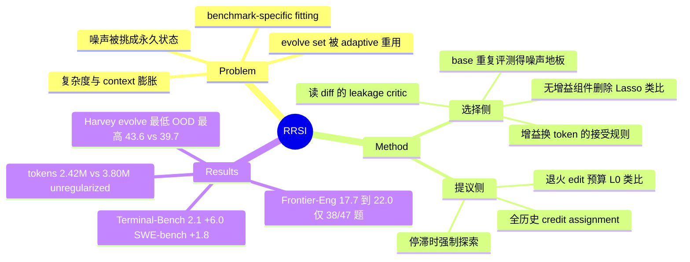

## Summary

RRSI 把 harness 自演化当作在有限 evolve set 上反复做的 adaptive empirical optimization：它不限制哪些 harness 组件可以改，只约束搜索怎么走——提议侧有退火的每轮 edit 数上限、全历史的 credit 记录和停滞时的强制探索，选择侧有读 diff 的 leakage critic、按 base harness 重复评测量出的噪声地板，以及「多花 token 必须用更大增益来换」的接受规则，外加对长期无增益组件的删除。在 agentic workspace 实例上（Claude Opus 4.8 冻结，Harvey LAB 上演化），RRSI 的 evolve 分数是所有演化方法里最低的（90.5，Meta-Harness 93.0），但三个 OOD benchmark 的均值是唯一明显超过 base 的（43.6 vs 39.7），每 trial 的 policy token 为 2.42M，不加正则的演化是 3.80M。与其他演化方法的逐项对比只在 agentic workspace 上做过，该实例的 OOD 分数全部来自 LLM judge，而 policy、proposer、analyst、critic 都是 Claude Opus 4.8，JobBench 的 judge 之一也是 Opus 4.8。

## Problem & Motivation

Harness 演化方法（Meta-Harness、AHE、TTHE、HarnessX 等）反复用同一个有限 evolve set 的分数提议、挑选 harness 改动，等于对同一批任务做 adaptive 的多次查看，evolve 分数涨了，held-out 上可能不涨甚至掉。作者把过拟合拆成三种耦合行为：把 benchmark 专属内容写进 harness、把评测噪声挑成永久状态、不断堆复杂度（尤其是上下文）换 evolve 分数。目标是让演化出的 harness 迁移到任务描述、工具接口或 verifier 都不同的未见 benchmark。

## Method

框架只改搜索动力学，edit space 保持开放（prompt、control flow、config、context management、tools、skills、memory、subagents 都可增删）。作者用经典正则做类比，但明确说这些只是功能类比，不是在优化带范数惩罚的目标。

**提议侧**
- **Annealed update sparsity（类比 L0 基数约束）**：第 k 轮一个 candidate 最多打包 B_k 个可独立归因的 atomic edit，B 从 B_max（3 或 4）线性降到 B_min=1。早期允许组合改动，后期每轮只改一处，便于归因。
- **Evidence-aware credit assignment**：每个被评测的 edit 记录 component、hypothesis、diff、score/cost 变化、是否被接受；proposer 后续以此为条件，已证伪的假设作为负证据保留。
- **Structured exploration**：最近 W 轮进步不超过噪声带即判停滞，此时预留一个 candidate 槽给从未动过的组件（类比熵正则）。

**选择侧**
- **Leakage screening**：评测前由 critic 读 diff（不读 proposal 说明），拒绝写入任务名、实体名、任务特定值、答案或惰性机械的改动。附录案例：critic 允许 rationale 里提到任务名，但代码里不能有。
- **Stability-aware acceptance**：演化前重复评测 base harness 得到经验噪声带 ε；candidate 分数必须不低于「历史最佳 − ε」，防止一连串小退步被当噪声放过。
- **Complexity-aware acceptance（类比 Ridge）**：增益超过 ε 时，相对 token 增长必须 ≤ λ0 + λ1·ΔS；增益在噪声带内时改用一个打分规则，只认 token 节省和「此前从未进入接受路径的结构组件」的 novelty（coding 实例里带内分数增益权重为 0）。
- **Structural pruning（类比 Lasso）**：在 pruning window 内被动过却没有严格正增益的组件，交给 proposer 作为删除目标。

所有超参数在运行前固定，论文称没有 sweep、没看 held-out/OOD；但 token 预算系数 β 是对照 evolve set 开局几轮的候选校准的，并非完全先验。噪声带 ε 是测出来的（coding 0.017、agentic workspace 0.004、engineering 0.020）。

**设定**：三个 domain 各在一个 suite 上演化——Terminal-Bench 2.1（89 题）、Harvey LAB（120 evolve / 40 ID held-out）、EngDesign（61 题，无 held-out）；OOD 为 SWE-bench Verified、JobBench、GDPval、APEX-Agents、Frontier-Eng。frozen policy、proposer、failure analyst、leakage critic 均为 Claude Opus 4.8；轮数 20/20/40，每题 2/2/4 trials。四个 baseline 与 RRSI 共用 base harness、policy、evolve set 和 candidate budget。

## Key Results

- **Agentic workspace（Table 1）**：base 89.4 / 86.9 / 36.0 / 48.8 / 34.2（Harvey evolve / Harvey ID held-out / JobBench / GDPval / APEX-Agents）；RRSI 90.5 / 89.2 / 40.7 / 52.3 / 37.9，OOD 均值 39.7 → 43.6。Meta-Harness evolve 最高（93.0）但 OOD 均值只多 0.9；HarnessX 持平 base；AHE、TTHE 低于 base，TTHE 低 1.7。ID held-out 上五个方法几乎无差别（88.5–89.2），分化只出现在 OOD。
- **Ablation（Table 2）**：不加任何正则 → evolve 92.8（所有臂中最高）、OOD 40.3、3.80M tokens/trial；去掉提议侧 → 90.7 / 41.9 / 2.69；去掉接受侧 → 91.5 / 41.0 / 3.59；完整 RRSI → 90.5 / 43.6 / 2.42。两组正则单独去掉都让 OOD 掉 1.7–2.6 点。
- **Coding**：Opus 4.8 下 Terminal-Bench 2.1 74.2 → 80.2（+6.0），SWE-bench Verified 82.0 → 83.8；Gemini 3.5 Flash 下 64.6 → 78.7（+14.1），SWE-bench Verified 76.8 → 79.0。Gemini 3.5 Flash 演化出的 harness 原样给 Gemini 3.1 Flash Lite 用，Terminal-Bench 2.1 11.2 → 14.6。
- **Engineering**：EngDesign 50.0 → 54.9；Frontier-Eng Medal 17.7 → 22.0（+4.3），但只有 47 题中的 38 题能计分，且排除了与 evolve set 重叠的 EngDesign domain。
- **成本**：AHE 3.82M tokens/trial，比 RRSI 多 58%；RRSI 平均 26.3 步，prior 方法 27.3–34.6 步；base 只有 1.56M、21.2 步，演化的增益有一部分是用 test-time compute 换的。
- **可靠性**：task-level paired bootstrap（10,000 次重采样）下，9 个 split 相对 base 的增益 95% CI 都排除 0，但下界普遍很低（如 SWE-bench Verified +1.8 [+1.1, +4.0]，Harvey LAB evolve +1.1 [+0.8, +2.1]，Frontier-Eng +4.3 [+1.1, +12.1]）；这些 CI 是 RRSI vs base，不是 RRSI vs 其他演化方法。每个演化 run 都重跑了一次，agentic workspace OOD 均值 43.6 vs 43.7，两次 run 最大差 1.8 点（Terminal-Bench 2.1）。
- **定性**：Harvey LAB 上 RRSI 在 20 轮、32 个被评测 candidate 里只接受 4 个 edit，全部挂在 base harness 已有的 pre-finalize 检查点上（回读交付文件、指出缺失项的 probe）；Meta-Harness 积累的是一段 730 词、复述 evolve suite 评分规则的系统消息，TTHE 积累了约 8,500 词的协议块，其中约 1,000 词只对 redline/tracked-changes 类交付物生效。

## Evidence Ledger

| Claim ID | Claim | Type | Source locator | Evidence excerpt | Status |
|:--|:--|:--|:--|:--|:--|
| C1 | 主实验（Opus 4.8）中最大 evolve 增益为 Terminal-Bench 2.1 +6.0（74.2→80.2）；摘要的「up to 6.0」未涵盖 Table 3 的 Gemini 3.5 Flash +14.1 | number | Sec 4.2; Table 3; Table 6 | "The evolve-set gains are 6.0 points on Terminal-Bench 2.1, 4.9 on EngDesign and 1.1 on Harvey LAB." | source-verified（已限定为主实验范围；原表述 contradicted） |
| C2 | 正文 JobBench OOD +4.7（36.0→40.7），大于摘要「up to 4.3」，摘要与正文不一致 | number | Abstract; Sec 4.2; Table 1; Table 6 | "the three out-of-distribution agentic benchmarks gain between 3.5 and 4.7 points, 7.2% to 13.1%" | source-verified |
| C3 | RRSI 2.42M vs 不加正则 3.80M tokens/trial，约少 36%（摘要写 30%） | number | Table 2; Abstract | "RRSI 90.5 89.2 43.6 2.42" / "Unregularized evolution 92.8 88.9 40.3 3.80" | source-verified |
| C4 | Table 1：RRSI 90.5/89.2/40.7/52.3/37.9，base 89.4/86.9/36.0/48.8/34.2；OOD 均值 43.6 vs 39.7 | number | Table 1; Sec 4.2 | "RRSI (ours) 90.5 89.2 40.7 52.3 37.9" | source-verified |
| C5 | Meta-Harness evolve 最高（93.0）OOD 只 +0.9；AHE、TTHE OOD 低于 base（TTHE −1.7）；RRSI evolve 增益最小 | comparison | Sec 4.2; Table 1 | "AHE and TTHE finish below the harness they started from, TTHE by 1.7 points" | source-verified |
| C6 | Ablation：无正则 92.8/40.3/3.80；去提议侧 90.7/41.9/2.69；去接受侧 91.5/41.0/3.59 | number | Table 2 | "w/o proposal regularizers 90.7 88.8 41.9 2.69; w/o acceptance regularizers 91.5 88.7 41.0 3.59" | source-verified |
| C7 | Gemini 3.5 Flash：Terminal-Bench 2.1 64.6→78.7，SWE-bench Verified 76.8→79.0 | number | Table 3; Sec 4.3 | "RRSI improves Terminal-Bench 2.1 from 64.6 to 78.7 and transfers a 2.2-point gain" | source-verified |
| C8 | Gemini 3.5 Flash 演化的 harness 给 Gemini 3.1 Flash Lite：11.2→14.6 | number | Table 4; Sec 4.3 | "Terminal-Bench 2.1 accuracy rises from 11.2 to 14.6, a 30.4% relative gain" | source-verified |
| C9 | Frontier-Eng 17.7→22.0；47 题中仅 38 题计分，EngDesign domain 被排除 | benchmark-setting | Sec 4.2; Table 7; App B.8 | "Its EngDesign domain reuses tasks from our evolve set and is excluded…so 38 of the 47 tasks contribute credit" | source-verified |
| C10 | policy、proposer、analyst、leakage critic 均为 Claude Opus 4.8；JobBench judge 为 Gemini-3.5-Flash 与 Opus 4.8 平均 | benchmark-setting | Sec 4.1; App B.4 | "The proposer, the analyst that writes the cross-round failure feedback and the leakage critic are all Claude Opus 4.8." | source-verified |
| C11 | 超参数运行前固定、无 sweep、不看 held-out/OOD | benchmark-setting | App E.1; Table 5 | "we run no sweep and never consult held-out or out-of-distribution benchmarks" | source-verified（β 在 evolve set 开局轮次上校准） |
| C12 | 独立重复 run：OOD 均值 43.7 vs 43.6，两 run 最大差 1.8（Terminal-Bench 2.1） | number | App E.2; Table 7 | "The two runs disagree by at most 1.8 points anywhere, on Terminal-Bench 2.1" | source-verified |
| C13 | Harvey LAB 上 20 轮、32 个被评测 candidate 中接受 4 个 edit | number | App F; Table 9 | "Four edits accepted out of 32 evaluated candidates over 20 rounds" | source-verified |
| C14 | 轮数 20/20/40，trials 2/2/4，噪声容差 0.017/0.004/0.020 | benchmark-setting | Table 5 | "evolution rounds 20 20 40 … empirical noise tolerance 0.017 0.004 0.020" | source-verified |
| C15 | EngDesign 50.0→54.9，无 ID held-out（61 题全部用于演化） | benchmark-setting | Table 7; App B.7 | "Evolution runs on all 61 tasks with no in-distribution held-out split" | source-verified |
| C16 | 代码声明发布于 github.com/google-research/rrsi（未核实仓库实际存在） | license-code | Abstract / title page | "github.com/google-research/rrsi regularized-rsi.com" | source-verified |
| C17 | 去掉任一组正则都使 evolve 分数升高、OOD 下降 | causal-mechanism | Sec 4.3; Table 2 | "removing either group raises the evolve-set score and lowers transfer" | source-verified |
| C18 | 9 个 split 的 paired task-level bootstrap 95% CI 均排除 0 | number | App E.2; Table 6 | "Paired task-level bootstrap on the gain of RRSI over H0, 10,000 resamples, percentile method" | source-verified |
| C19 | 「held-out 环境上比 prior baseline 平均高 up to 12.5%」 | comparison | Sec 1 | "outperforming the average prior baseline by up to 12.5%" | unsupported（Figure 1 推算为 +1.8%/+10.7%/+22.9%，无一为 12.5%；正文不采用） |
| C20 | 四个 baseline 与 RRSI 共享 base harness、frozen policy、evolve set、candidate budget | benchmark-setting | Sec 4.1; App F | "All the baselines start from the same H0 and share the frozen policy, the evolve set and the candidate budget." | source-verified |

## Strengths & Weaknesses

**亮点**
- 问题提得对：harness 演化本质是对同一有限 evolve set 的 adaptive 重用，演化方法之间的排序在 evolve set 和 OOD 上会翻转。Table 1 把这个现象在同一 base、同一 budget、同一 policy 下摆出来，比单报 evolve 增益有信息量得多。
- 正则设计在边界上相对克制：不缩 edit space，只改接受规则和每轮改动量。噪声带用 base harness 重复评测直接测出，不是调出来的超参数，这是整套方法最站得住的一环。
- Table 9 的定性对照很有说服力：baseline 不硬编码任务名、能通过关键词检查，却把 evolve suite 的评分规则和交付物体裁写进了 harness——leakage 比「写死答案」更隐蔽，这一点对所有 harness 演化工作都适用。
- 报了 cost 维度、每个 run 的重复和 task-level paired bootstrap，在这类论文里少见。

**局限与疑点**
- **摘要/引言与正文数字不一致**：摘要说 OOD「up to 4.3 points」、evolve「up to 6.0」、token「30% fewer」；但正文 JobBench 是 +4.7，Table 3 的 Gemini 3.5 Flash evolve 增益是 +14.1，2.42M vs 3.80M 算下来约少 36%。引言称「比 prior baseline 平均高 up to 12.5%」，按 Figure 1 推算是 +1.8% / +10.7% / +22.9%，没有一个是 12.5%。Sec 4.3 还把 Ridge 式接受规则误称为 L1，把「去掉提议侧后 evolve 升 0.2」写成「costs 0.2」。方向都不影响结论，但说明 v3 文字没有和表格对齐。
- **评测自循环**：policy、proposer、analyst、critic 都是 Claude Opus 4.8（三个 domain 都如此，只有 Table 3/4 的 Gemini 对照例外），JobBench 的 judge 有一半是 Opus 4.8，Harvey LAB/APEX-Agents 用 Gemini-3.5-Flash 判。作者用 EngDesign/Frontier-Eng 的确定性评分反驳 judge hacking，这对 engineering 实例成立，但 agentic workspace 的 OOD 结论仍全部来自 LLM judge。
- **归因粒度粗**：ablation 只去掉整组（提议侧 / 接受侧），七个组件没有逐个消融，因此不知道是噪声地板、leakage critic 还是 token 预算在起主要作用。L0/Lasso/Ridge 类比作者自己承认只是功能类比，理论上没有提供任何泛化保证（只借了 Dwork et al. 的 adaptive data analysis 做动机）。
- **baseline 都是在作者的框架里重跑的**：四个 baseline 共享 base harness 和 candidate budget，公平但也意味着它们并非在原始设定下运行；baseline 只在 agentic workspace 上比较，coding 和 engineering 只有 RRSI vs base，没有和其他演化方法对照。
- **Frontier-Eng 只计 38/47 题**；EngDesign 无 held-out，evolve 增益不能单独说明泛化。
- 只有两次 run，不足以估计搜索方差的分布；跨 policy 只试了 Gemini 一家的两个模型。

**对领域的意义**：把「harness 演化需要像训练一样做正则」这件事说清楚并给出可用的接受规则；其中噪声带 + token 预算这两条门槛几乎可以直接移植到任何 harness 演化循环。

## Mind Map

## Notes

- **与 vault 中 harness 自演化工作的本质区别**：
  - [[2607-HarnessBank]]（即 RRSI Related Work 中的 Luo et al. 2026，arXiv 2607.13683）：用 MAP-Elites 式 gene bank 保多样性 + validity/activation/significance 三道确定性 gate。两者都有「显著性门」，但 HarnessBank 的改进方向是搜索的多样性和重组，RRSI 是约束每步改动量、成本和 leakage；HarnessBank 的 gate ablation 显示 2σ gate 对 test Pass@1 是 ±0.0，而 RRSI 的整组 ablation 声称接受侧正则对 OOD 有 2.6 点作用——两者对「显著性门是否提升上限」给出的证据方向不同，值得对照（注意 RRSI 没有单独消融噪声地板）。
  - [[2609-SoLPi]]：同样把 RSI 放在 harness 层，但 SoL-Pi 的目标是效率（降 token），门槛是「能力指标在容差内 + 效率改善」，由研究 agent 在 535 个环境上找机制；RRSI 的目标是泛化，token 只作为接受约束。两者都用「先测容差再定门槛」的思路，SoL-Pi 接受了能力掉 2.5–2.8 点，RRSI 接受了 evolve 分数比 baseline 低。
  - [[2609-NeoHorse1]]：RRSI 引用它作为 RSI 的例子，但 NeoHorse-1 改的是权重（routing harness 产生的数据用于 post-training），RRSI 明确限定 backbone 冻结、只改 harness。
  - [[2609-HarnessDev]] 发现 evolution 增益大多落在同一 commit 重跑的 ±4.75 噪声带内、可见反馈与 held-out 同向率只有 53.1%——这正是 RRSI 噪声地板和 OOD 评测要处理的现象，可以作为 RRSI 的外部动机证据。
  - [[2608-DarwinX]]（RRSI 引为 Zhang et al. 2026e）走的是相反方向：archive 保留更弱变体、跨 lineage 重组、追求 evolve 上限；RRSI 认为这种开放积累正是 OOD 掉分的来源。两者没有同台比较。
- **待查**：RRSI 的定性结论「OOD 收益来自回读交付物的 probe」是否只在 agentic workspace 成立；coding/engineering 上与 baseline 的分 benchmark 对比只以 Figure 1 的平均值出现，未单独列表。
- **可借鉴**：Table 9 揭示的「rubric/体裁 leakage」意味着关键词式 leakage 检查不够，critic 需要判断改动是否在复述评分规则——这对 GUI agent 在单一 benchmark 上演化 harness/skill 同样适用。
