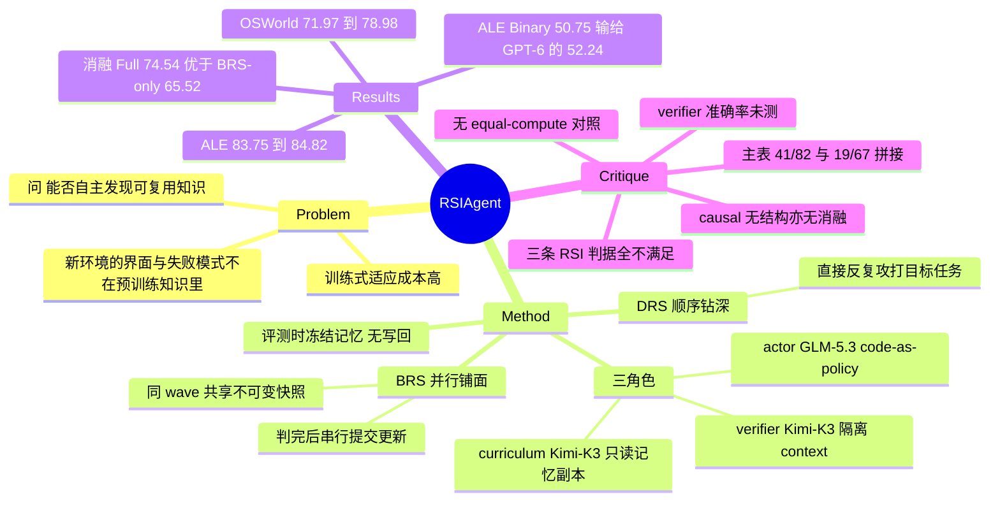

## Summary

RSIAgent 用 curriculum / actor / verifier 三个 agent 组成 training-free 循环，围绕一个目标任务自主探索环境、把验证过的经验写进一组 markdown 记忆文件，再冻结记忆去执行该任务；OSWorld 2.0（0808 offline，82 任务）partial 从 71.97 提到 78.98，ALE Near-term（67 任务）从 83.75 提到 84.82。但标题里的 recursive self-improvement 名不副实——权重、agent 架构与 prompt 全程不变，记忆按目标任务从空建起、评测前冻结，不存在 generation ≥2。且 ALE 上不含 RSI 的 harness（83.75）本身就已超过 GPT-6 Astra（82.26），"开源模型反超闭源"这个卖点主要由 harness 交付，不是由 RSI 交付。

## Problem & Motivation

digital agent 进到一个新环境时，界面、工具、约定与失败模式往往不在预训练知识里。常规做法是收数据再训一轮，成本高且在私有或持续变化的环境里难落地；training-free 的替代路线是把知识组织进 context。作者由此提出的问题是：agent 能否自己从新环境里发现可复用知识、写进记忆来改进自己。

动机本身是合理的，但作者把它和 causal discovery 绑在一起（keyword 写的是 "Agentic Causal Discovery"），这一层绑定在方法与实验里都没有兑现，详见下文。

## Method

**三个角色。** actor（默认 GLM-5.3）以 code-as-policy 执行动作——每个 action 是一段 Python/Bash 程序，runtime 返回输出、退出码与执行元数据；另有 `look` 取视觉证据、`ask` 问缺失信息、`done` 提交。verifier 与 curriculum 都由 Kimi-K3 承担，但跑在彼此隔离的 context 里。verifier 只看任务要求与候选环境，看不到 actor 的私有推理、记忆与执行日志，返回 PASS / FAIL / UNVERIFIED；它的探针跑在 checkpoint 保护的副本上，查完即还原。curriculum 看目标 query、已完成的探索结果、actor 写的 learning diagnosis 和一份**一次性的记忆副本**（它的本地修改不会同步回去），产出练习任务与继续/停止决策，但拿不到任何评分，也无权改记忆。

**记忆归属。** 只有产生经验的那个 actor 有权决定从中保留什么。拿到 verifier 报告后它走两步：distillation 抽出可复用流程、约束与失败教训；reconciliation 把新内容与旧条目对账，改掉矛盾、给证据不足的结论加限定。记忆是一组 actor 自己写的文件，**没有规定 schema、文件数或长度**。

**两个阶段。** BRS（Broad）并行铺面：curriculum 一次提一批相互独立的 project，同一 wave 内所有 project 从同一份不可变记忆快照出发、彼此看不到对方，全部判完后再按 curriculum 指定的顺序逐个串行提交记忆更新——这是为了让并行探索不产生写冲突。名义预算 8 个 project、最多 4 个并发，预算只在整 wave 结束后检查，所以实际 project 数可以超 8。DRS（Deep）顺序钻深：**先直接尝试目标任务本身**，按结果决定要不要插一个练习 project，练完回来再打一次目标，直到 curriculum 判定没有更多有用练习。

**评测。** 探索结束后记录记忆文件树的 hash，把记忆复制进评测环境，关掉 curriculum 与写回，重置环境后由 actor–verifier harness 执行同一个目标任务，官方 evaluator 在所有 agent context 之外打分，且不向 agent 回传分数或隐藏检查项。

需要点破的是这个 pipeline 的实际形状：**探索是被目标 query 条件化的**（Table A3 明写 curriculum 的 context 带 "the target query as reference"，两个阶段都是），DRS 在"探索"期间就在反复攻打那道最终要被打分的题，而记忆在记录的案例里是**按目标任务从空建起**的（T044/T049/T065 各自起于 empty memory，各自积累独立语料）。所以它更接近**按题定制的 test-time search + 笔记**，而不是"适应一个新环境、之后所有任务共享"。摊销结构完全不同：成本是按题付的，不是按环境付一次。

## Key Results

**主表（Table 1）。** OSWorld 2.0（0808 offline，82 任务）与 ALE Near-term（67 任务），Partial = 平均任务分，Binary = 拿满分的任务比例：

| 模型 / 方法 | OSWorld Partial | OSWorld Binary | ALE Partial | ALE Binary |
|:--|--:|--:|--:|--:|
| Kimi-K3 | 58.30 | — | 71.60 | 40.30 |
| Claude Opus 5 | 70.19 | 34.72 | 79.54 | 46.27 |
| GPT-6 Astra | 72.60 | — | 82.26 | 52.24 |
| RSIAgent (w/o RSI) | 71.97 | 37.80 | 83.75 | 49.25 |
| RSIAgent | **78.98** | **42.68** | **84.82** | 50.75 |

**增益该记在谁头上。** 把 harness 的贡献和 RSI 的贡献拆开看，故事和 abstract 不一样：

- ALE 上 w/o RSI 的 83.75 **已经越过** GPT-6 Astra 的 82.26，RSI 只再加 +1.07。也就是说在这个 benchmark 上，"开源反超闭源"在 RSI 介入之前就完成了。
- ALE Binary 上 RSIAgent 的 50.75 **低于** GPT-6 Astra 的 52.24。作者自己在附录里写明 partial-credit 上的优势并未延伸到每个指标。
- OSWorld 上 RSI 确实是必需的：w/o RSI 的 71.97 低于 GPT-6 Astra 的 72.60，靠 +7.01 才推到 78.98。
- 游戏实验（Table 2，GameCraft-Bench 40 任务）给出唯一一组**同起点同 backbone 的受控对照**，模式非常一致：四个 generator 上 harness 贡献 +5.07 / +11.33 / +14.18 / +12.52，RSI 再贡献 +3.44 / +3.76 / +3.99 / +3.64。RSI 的边际贡献稳定在 +3.7 附近，只有 harness 的三分之一到四分之一。同时 RSIAgent (w/o RSI) 在每个 generator 组里都已经赢过 Play2Code 基线，而 Play2Code 在最强的 Codex+GPT-5.5 组里把游戏改坏了（52.77 → 51.05）。

**消融（§4.4，四个 OSWorld 任务）。** Full RSI 平均 partial 74.54%，BRS-only 65.52%，DRS-only 56.50%；DRS-only 在 T085、T089 上低于基线，BRS-only 在四个任务上都高于基线。结论是要先铺面再钻深。但这四个任务取自一个"按相对已记录基线有改进"挑出来的 exploratory cohort，且 Full RSI 是两次历史评测的均值而单阶段条件用单次记录分，条件并不对齐。

**RSI 轮数（§4.3）。** T044 / T049 / T065 在第 8 步分别到 100% / 80% / 100%。作者自己指出曲线呈离散跳变——瓶颈被解开的那一刻分数才动，前面是记忆的缓慢累积。

**记忆体量（Table A5）。** T044 跑完 10 个 BRS project 得到 12 个文件 109,647 bytes，冻结时涨到 316,541 bytes；T049 是 8 个 project → 89,086 → 141,312；T065 是 11 个 → 159,065 → 281,085。记忆也会缩：T065 第三次 BRS 合并把记忆从 13,243 压到 11,510 bytes，说明 reconciliation 确实在重组而非单纯拼接。

**失败模式（§4.6）。** 作者归纳出三条相互咬合的失效链：探索打不到点上（curriculum 生成的练习没有挑战真正出问题的决策）→ 验证不完整（verifier 在字段值无依据、产物与官方 rubric 不符时仍返回 PASS）→ 记忆固化错误（actor 把"缺失数据标记"当成有效答案的规则写进记忆，后续 run 继续复用）。这一节写得很实，是全文信息量最高的部分之一。

## Evidence Ledger

| Claim ID | Claim | Type | Source locator | Evidence excerpt | Status |
|:--|:--|:--|:--|:--|:--|
| C1 | OSWorld 2.0 offline 上 RSIAgent 78.98/42.68 vs w/o RSI 71.97/37.80 | number | Table 1 / §4.2 | "OSWorld partial score increases from 71.97 to 78.98, while binary accuracy increases from 37.80 to 42.68" | source-verified |
| C2 | ALE Near-term 上 RSIAgent 84.82/50.75 vs w/o RSI 83.75/49.25 | number | Table 1 / §4.2 | "On ALE, Partial increases from 83.75 to 84.82, and binary accuracy increases from 49.25 to 50.75" | source-verified |
| C3 | ALE Partial 上 w/o RSI 的 83.75 已超过 GPT-6 Astra 的 82.26 | comparison | Table 1 | GPT-6 Astra ALE Partial 82.26；RSIAgent (w/o RSI) 83.75 | source-verified |
| C4 | ALE Binary 上 RSIAgent 50.75 低于 GPT-6 Astra 52.24 | comparison | Appendix 10.4 | "RSIAgent scores 50.75, compared with 52.24 for GPT-6 Astra; the partial-credit advantage does not extend to every reported metric" | source-verified |
| C5 | 主表 RSIAgent 行是拼接结果：OSWorld 41 条 RSI 分 + 其余保留基线；ALE 19 条 RSI 分 + 48 条基线 | benchmark-setting | Appendix 10.4 | "The RSI row replaces baseline scores with 41 reported non-diagnostic RSI results"；"combines 19 reported RSI-column scores and 48 baseline scores" | source-verified |
| C6 | 只有基线未满分的任务才被分配探索，基线满分任务不探索但仍留在分母 | benchmark-setting | Appendix 10.3 | "tasks were selected when their recorded baseline score was below full credit"；"Baseline full-score tasks were not assigned additional exploration" | source-verified |
| C7 | 与闭源系统的对比不是 matched protocol | benchmark-setting | Appendix 10.4 | "the cross-system comparison does not use a matched evaluation protocol"；"Selected-run budgets and evaluation scopes are not fully matched" | source-verified |
| C8 | 探索被目标 query 条件化，DRS 直接反复攻打最终被评测的那道目标任务 | benchmark-setting | Appendix 8 / 8.3 / 10.2 | "The target query guides the curriculum agent in both stages"；"In these runs, DRS includes practice on the target itself" | source-verified |
| C9 | 记录的案例中记忆按目标任务从空建起，非跨任务共享 | mechanism | Appendix 12.1 | "All three trajectories begin with empty memory" | source-verified |
| C10 | 权重全程不变、记忆评测时冻结、agent 架构本身不被修改 | mechanism | Table A3 / Appendix 8.3 | "Model parameters: Fixed throughout exploration and evaluation"；"All attempts retain the same agent framework" | source-verified |
| C11 | 记忆是无 schema 的 actor 自撰文件；全文无隔离 causal 结构贡献的消融 | causal-mechanism | Appendix 8.2 / §7 | "The memory remains a collection of actor-authored files, with no required schema, file count, or length" | source-verified |
| C12 | 四任务消融 Full RSI 74.54% vs BRS-only 65.52% vs DRS-only 56.50% | number | §4.4 | "Full RSI reaches a mean score of 74.54%, compared with 65.52% for broad-only exploration and 56.50% for deep-only" | source-verified |
| C13 | 消融四任务选自"按已记录基线有改进"的 cohort，且 Full RSI 取两次历史评测均值 | benchmark-setting | Appendix 10.5 / Fig.4 | "four tasks from an exploratory cohort selected for improvements over recorded baselines"；"Full RSI bars average two historical evaluations" | source-verified |
| C14 | 第 8 步 T044/T049/T065 分别达 100%/80%/100% | number | §4.3 | "By step 8, T044, T049, and T065 reach scores of 100%, 80%, and 100%, respectively" | source-verified |
| C15 | GameCraft-Bench 上 w/o RSI 已在每组胜过 Play2Code；Play2Code 使最强基础游戏退化 52.77→51.05 | number | Table 2 / §4.5 | "it can even degrade already high-quality games" | source-verified |
| C16 | verifier 为模型自判且全文无 verifier 准确率量化；失败分析记录其误判 PASS | mechanism | §4.6 / §7 | "the verifier agent returned PASS despite unsupported field values or artifact discrepancies under the official rubric" | source-verified |
| C17 | actor 为 GLM-5.3，verifier/curriculum 为 Kimi-K3 分离 context；BRS 名义 8 project、并发 4 | benchmark-setting | Appendix 10.2 Table A3 | "GLM-5.3 is the default actor agent, and Kimi-K3 supplies the verifier agent, curriculum agent" | source-verified |
| C18 | 无 compute/token 对齐的对照臂；基线直接关掉探索与持久记忆 | benchmark-setting | §7 / Appendix 10.2 / 12.7 | "the baseline disables exploration and persistent memory"；附录自称 "not a matched-budget estimate" | source-verified |
| C19 | arXiv:2609.15364v1，2026-09-14，49 页；Aether AI / UCSD / UIC；代码 github.com/AetherLabsAI/RSIAgent | metadata | front matter | 见 arXiv 页与 HTML 版 metadata 块 | source-verified |
| C20 | T044 10 个 BRS project、12 文件 109,647 bytes，冻结时 316,541 bytes | number | Appendix 12.1 Table A5 | "T044 completes ten BRS projects and accumulates 109,647 bytes in 12 files" | source-verified |
| C21 | OSWorld 用 0808 release 的 82 任务 offline 子集而非完整 108 任务；T082 setup 失败按 0 计入 | benchmark-setting | Appendix 10.1 | "report the 82-task offline subset rather than the full 108-task inventory"；"T082 has no valid official score after a setup failure" | source-verified |
| C22 | 本地验证与官方 evaluator 分离，官方分数不回传给学习 agent；model-based 打分用 GPT-5.4 | mechanism | Appendix 10.2 | "The official evaluator is invoked after the actor–verifier loop and does not supply scores or hidden checks to the learning agents" | source-verified |

## Strengths & Weaknesses

**亮点。**

信息边界设计得很干净，且这些约束是真在实现里的，不是纸面声明：verifier 看不到 actor 的私有推理与记忆（切断相关误差）、探针跑在 checkpoint 副本上（防止验证动作污染被提交的产物）、curriculum 只能看记忆的一次性副本且无权改写（防止出题者把答案塞进记忆）、官方 evaluator 在所有 agent context 之外（防止评分泄漏）。BRS 里"同 wave 共享不可变快照、判完后串行提交更新"的设计也把并行探索的写冲突处理得很规矩。这套边界值得被后续 memory 类工作直接抄走。

附录的坦诚程度远超均值。主表由多少条真 RSI 分与多少条保留基线拼成、任务怎么选、跨系统对比不 matched、ALE Binary 上其实输给 GPT-6——这些足以削弱自家卖点的信息，作者都写进了附录 10.3/10.4。§4.6 的三段失效链（探索不到点 → 验证不完整 → 错误记忆固化）也是实打实的 case audit，不是套话。

**弱点。**

*第一，"recursive" 与实物不符。* 按 [[Topics/SelfEvolvingAgents-Survey]] §7.5 的三条判据逐条对照：(1) 是否存在 generation ≥2 —— 否，只有单条记忆累积谱系，全程"All attempts retain the same agent framework"；(2) 演化系统本身是否也在被演化 —— 否，curriculum/actor/verifier 的架构与 prompt 固定不变，作者自己在 Related Work 里把这条性质归给 Hyperagents 而非自己；(3) 权重更新是否发生在部署后 —— 否，明确 training-free、"Model parameters: Fixed"。三条全不满足。这里的 "recursive" 实际指 curriculum→act→verify 这个循环把自己的输出喂回自己，是个 loop，不是 RSI 意义上的递归。**这已经是该谱系的第三个同形样本**（前两个是 [[Papers/2607-FrontisMA1]] 与 [[Papers/2608-MacaronV1]]），且和它们一样，正文/附录划了边界而标题与 abstract 没划。

*第二，增益归因缺对照臂。* 没有任何 equal-compute / equal-token 的对照：基线就是"关掉探索和持久记忆"，而 RSI 条件额外烧掉 8+ 个 BRS project 加若干 DRS 轮，每个 practice 配置 2,000 iteration / 86,400 秒上限。全文只给了单次运行的上限（65,536 token 响应上限、500/2,000 iteration、36,000/86,400 秒看门狗），没有任何探索阶段的 token 总量、费用或 wall-clock 汇总。作者在案例附录里自己承认这些对比"not a matched-seed memory ablation"、"not a matched-budget estimate"。于是"记忆结构有用"与"多花了一两个数量级的推理算力有用"在数据里无法分离。[[Papers/2607-RethinkSkillEvolve]] 恰好做过这个对照，且结论是分场景的——oracle Parallel Sampling 在 SearchQA 上只差 evolved skill 0.43 点，在 SpreadsheetBench 上落后 30.96 点。OSWorld/ALE 更接近后者（多步流程类），所以 RSIAgent 的增益未必能被纯 test-time scaling 吃掉；但这需要实验来说，现在是空白。

*第三，主表的聚合方式系统性偏乐观。* 只有基线未满分的任务才获得探索，满分任务原地保留基线——于是"只能跌的"被冻住、"只能涨的"被投入算力，估计量在构造上就是上偏的。叠加 OSWorld 那行只有 41/82 是真 RSI 结果、ALE 只有 19/67，"78.98 / 84.82"并不是一次统一协议下的系统性能，把它和 leaderboard 上的 GPT-6 并排放进一张表是有误导性的。作者在附录写清楚了，但 abstract 与 Figure 1 没有。

*第四，"causal" 这层卖点没有兑现。* keyword 写 "Agentic Causal Discovery"，abstract 承诺"可复用的 action–condition–consequence 因果关系"，但记忆的实物是"a collection of actor-authored files, with no required schema"——自然语言的 manual、playbook 与失败记录，没有任何结构化因果表示。"causal" 在正文之外只出现在 prompt 模板里，而且是软约束（"Make causal claims only when your trajectory and evidence support them"）。全文没有任何消融证明"因果"这层结构本身有贡献；作者在 Limitations 里承认"our current experiments do not fully isolate the contribution of every component"。这个词更像包装。

*第五，verifier 的可靠性是整个闭环的地基，却没被测过。* 判对错的信号来自 Kimi-K3 自判，全文没有 verifier 准确率/precision 的任何量化——没有与官方 rubric 的一致率，没有人工抽检比例。而 §4.6 自己举出了 verifier 误判 PASS 导致错误规则被写进记忆并在后续 run 被复用的具体案例。"错误记忆会被固化"不是推测，是作者自己观察到的现象；但它到底以什么频率发生，读者无从判断。这也意味着 memory 的净值在 verifier 更弱的模型上可能为负。

*第六，per-task 的成本结构削弱了实用主张。* 摊销方式决定这类方法的实际价值：如果记忆能在一个环境内跨任务复用，一次探索成本可以摊薄到很多任务上；而记录的案例是每题从空记忆重建、每题几十万字节。按题付费的 test-time search 在工程上是另一回事，也无法支撑 abstract 里"adapt to new environments"的叙述。论文没有报告跨任务复用同一份记忆的实验，这恰恰是最该做的那个实验。

**对领域的影响。** 作为方法贡献有限——curriculum + memory + verifier 的三角在 Voyager、AutoManual、SkillWeaver 一线早有雏形，本文的增量主要是并行 BRS 的记忆提交纪律与目标条件化的 DRS。真正的价值在两处：一是把 agent harness 与自我改进机制的贡献拆开后暴露出"harness 才是大头"这个在多个设置下都成立的 pattern；二是附录提供了一份罕见的、把自家报告口径的所有折扣都写明白的样本，可以直接当作评测报告规范的正面教材。

## Mind Map

## Notes

- **该挂到哪。** 这篇同时属于 [[Topics/CUA-Survey]]（OSWorld 2.0 上的 computer-use，且是目前该 benchmark 上报得最高的 partial）与 [[Topics/SelfEvolvingAgents-Survey]]（§7.5 的 RSI 术语错位，第三个样本）。建议在 §7.5 把它与 [[Papers/2607-FrontisMA1]]、[[Papers/2608-MacaronV1]] 并列——三个样本形态一致到可以据此下判断：以 RSI 为题的工作里，"正文划边界、标题不划"是该谱系的默认叙述方式，而不是个别夸张。

- **一个可以立刻做的对照实验。** 用同一套 harness，给 w/o RSI 条件配等量 token 预算（best-of-N 或更长的 actor–verifier 修订循环），看 OSWorld 上那 +7.01 还剩多少。[[Papers/2607-RethinkSkillEvolve]] 的证据暗示答案是分场景的，而 OSWorld 的多步流程属性可能让记忆保住相当一部分优势——如果真是这样，这个实验反而会把这篇的贡献坐实，比现在的报告方式更有说服力。

- **另一个更关键的缺口实验。** 在同一个环境（比如同一个应用族）内让一份记忆服务多道任务，报告第 k 道任务的边际探索成本。这是 per-task search 与 environment adaptation 的分水岭，也是这篇声称做后者却只证明了前者的地方。

- **可借鉴的工程细节**（与其 claim 成色无关，这些是真的）：BRS 的"不可变快照 + 串行提交"解并行写冲突；verifier 探针跑 checkpoint 副本以免污染被提交的产物；curriculum 只拿一次性记忆副本且无权写回；记忆文件树 hash 用于校验冻结完整性。做 memory 类系统时可以直接复用这套边界。

- **待查。** §4.6 的 Figure 5 给了失败模式各子类的计数与占比，但图内文字在 HTML 版里读不出来，未取得具体数值。需要注意即使取到也不是总体发生率——图注写明这些计数来自 "selected case audits"，且"cases may contribute to multiple panels"。要回答"verifier 以什么频率误判"，这篇提供不了。
