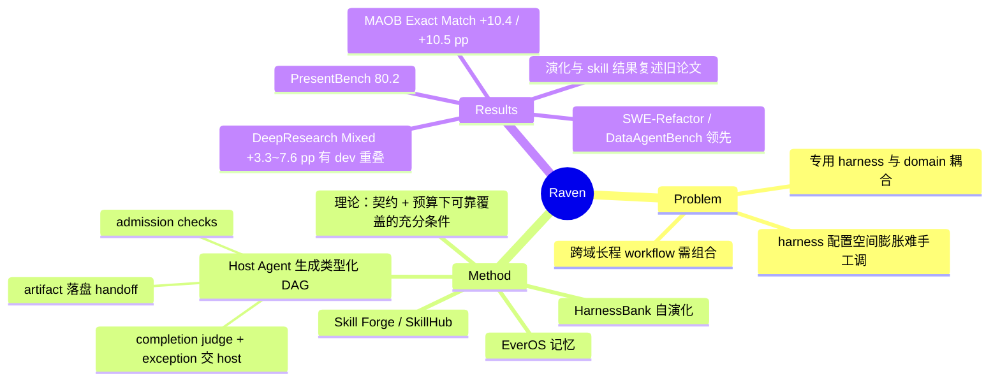

## Summary
Raven 把每个"model + harness"当作可组合的执行单元：一个 Host Agent 把用户目标拆成带类型契约的 DAG，派给自研 specialist（Research / Code / Design / Oncall）和通过 ACP 接入的第三方 agent（Claude Code、Codex、Hermes Agent、OpenClaw 等），同时配套 harness 自演化（HarnessBank）、EverOS 记忆和 Skill Forge 技能复用。论文给出"组合在共享预算下扩展可靠任务覆盖"的充分条件理论，并在自建 MAOB 规划 benchmark 与各 specialist 的领域 benchmark 上报告优于 Claude Code / Hermes Agent 等系统的结果。

## Problem & Motivation
作者的判断是：agent 能力越来越取决于 harness（tool 接口、context 管理、skill、执行策略、恢复机制），而 harness 一方面配置空间膨胀、难以手工调，另一方面与具体 domain 耦合，单个 harness 难以通吃跨领域的长程 workflow。于是问题从"为一个 domain 造更强的 harness"转为"自动构建专用 harness、用经验改进它们、再跨 domain 编排它们"。作者也承认组合收益取决于任务结构、局部能力和协调成本（引用了多 agent 失败分析与 scaling 实验）。

## Method
系统是一份技术报告式的大框架，四块组件 + 一套理论：

**理论（§2）**：把 harness 化的 agent 形式化为随机策略，capability 定义为在共同资源预算下的可靠任务覆盖。用 Hoare 式的 node / transfer 契约定义 compatible plan，证明确定性组合 soundness（Lemma 1）；再给出组合执行成功概率下界（Theorem 1，误差逐步累加、不需要独立性假设）、host 层可靠性（Proposition 1）和 task family 覆盖（Corollary 2）。这些都是**充分条件**（论文只主张充分性），作者明说"平均成功率本身不能建立这些条件化可靠性前提"——即理论并不被实验直接检验。

**多 agent 协作（§3）**：
- Agent registry：每个 agent 绑定四种 backend 之一（进程内 Raven loop、CLI 进程、ACP 连接、OpenAI 兼容 API），并标注 stateful / file-capable / progress-reporting 三种能力，host 由 LLM 直接选，不训练 router。
- 分阶段 orchestration guide：平时 context 里只放短描述，需要多 agent 时才加载完整 guide。
- 提交的 DAG 先过五组 admission checks（格式、图结构、agent 能力、状态、环境），首个错误即拒绝并返回指向 guide 的提示。
- 执行：依赖就绪调度 + 共享并发信号量；每个节点结束后由独立 LLM judge 判 accomplished / not accomplished，失败节点挂起交 host 决定 continue / abandon / replan；worker 的 clarification 先由 host 根据对话和 EverOS 记忆自动作答，但不代答授权类请求。
- 所有 handoff 走落盘文件（prompt / output / transcript），后续节点按路径引用，避免 host 转述丢信息。

**Harness 自演化（§4）**：沿用自家 HarnessBank——四个 strategy 接口（Memory / Planning / Capability / Action）包住冻结模型；Evolver 从失败 trace 提出带 activation spec 的 patch；Gene Bank 按 (edit category, pathology) 格子保留精英（quality-diversity）；validity / activation / paired-gain 三道 gate 筛选，训练集选型、held-out 测试。

**Memory（§5）**：EverOS，把交互流切成 MemCell（episode 叙述 + atomic facts + 带有效期的 foresight + 元数据），再做语义整合与按查询重构检索；分 user 与 agent 两条 track。

**Skill Forge（§6）**：基于自家 SkillCorpus 的策展 skill catalog（SkillHub）+ query rewrite / recall / rerank / LLM selector；在线 router 融合 SkillHub、本地 skill 与 EverOS 派生 skill；再用执行 case 的 intent 聚类驱动 skill 更新。

## Key Results
**MAOB（自建规划 benchmark）**：140 个基于职业场景的请求，参考 DAG 由 Claude Opus 5 先写、再用 GLM-5.2 反向生成请求文本；只评 host 提交的图，不派 worker。对比 Claude Code 与 Hermes Agent：
- Qwen3.8-27B：Node F1 0.923 vs 0.776，POA 0.950，Exact Match 0.711 vs 0.607（+10.4 pp）。
- DeepSeek-V4-Flash-0731：Node F1 0.963 vs 0.854，Edge F1 0.897 vs 0.813，Exact Match 0.867 vs 0.762（+10.5 pp）。
- 所有系统 Edge F1 都低于 Node F1——依赖预测比选 specialist 难。

**Harness 自演化（复述 HarnessBank 已发表结果）**：冻结 Qwen3.6-27B，7 个 benchmark held-out Pass@1 全部提升，+5.1（SWE-bench Verified）到 +15.4（AppWorld）；6 个过 paired-gain 判据，SWE-bench Verified（26 题 test split）未过。

**Raven-Research（DeepResearch Mixed = BrowseComp + FRAMES + HLE text-only + xBench-DeepSearch）**：三种共享 backbone 下准确率 56.3 / 59.3 / 76.5，分别比最强 baseline（MiroFlow / DeepSeek-Harness）高 6.6 / 3.3 / 7.6 pp；6 组配对比较中 5 组 McNemar p<0.02，Qwen3.5-397B 下对 DeepSeek-Harness p=0.21。DeepSeek-V4-Flash 下每题成本 0.0242 USD，介于两 baseline 之间。附录明说**同一批题目在开发 research flow 时也被使用过**，且未屏蔽 benchmark 公开副本。

**Raven-Code**：8 个设置中 6 个最高；SWE-Refactor 比 leaderboard 条目高 9.5（DeepSeek-V4-Flash）/ 3.0（GPT-5.6 Luna）；SWE-bench Pro 比同 backbone（Qwen3.8-27B）的 Claude Code 多解 15/731 题；SWE-bench Verified +0.6 / +1.2 pp（3 / 6 题）。DataAgentBench Pass@1 0.8762 / Pass@5 0.9097（Claude Opus 5），为论文 Figure 17 所列 2026-08-24 leaderboard 条目中最高（附录 C.4 注明该结果未提交给 leaderboard 维护方）。

**Raven-Design**：PresentBench 80.2（Claude Opus 5）/ 72.9（GPT-5.6 Luna）vs Claude Code 78.3 / 52.4；ArtifactsBench + GDPval 六个设置全部最高，但领先最强对手仅 0.3–2.8 分，且用的是内部 grader（GPT-5.6 Luna 当 judge）。

**Raven-Oncall**：nanochat autoresearch（5 GPU-hour）最终 BPB 1.038 vs Claude Code 1.053（起点 1.108），每个系统只跑一个 campaign；内部 17 题 AI4S benchmark 成功 14 vs 11（Claude Opus 5），人工判成功。

**Skill 复用（复述 SkillCorpus 已发表结果）**：pooled 增益 SkillsBench +7.5±2.3、GDPval +1.51±0.49、QwenClawBench +2.79±0.70；SkillsBench 上 Raven 增益 6.5 / 13.4 vs OpenClaw 4.2 / 5.8；GDPval 单 cell 增益与零不可区分。消融：完整管线 22.6%，换现成 Qwen3 retriever 13.8%，换未策展原始 crawl 14.9%，无 skill 9.2%。

## Evidence Ledger

| Claim ID | Claim | Type | Source locator | Evidence excerpt | Status |
|:--|:--|:--|:--|:--|:--|
| C1 | MAOB：140 题、137 种职业；参考图平均 2.72 节点 / 1.84 边；98 题纯串行、42 题含并行；覆盖全部 11 个 ≥2 域子集 | benchmark-setting | §7.1.1 Dataset Statistics; Table 3 | "140 tasks drawn from 137 distinct occupations ... 2.72 nodes and 1.84 edges on average" | source-verified |
| C2 | MAOB 参考图由 Claude Opus 5 编写，请求文本由 GLM-5.2 从图反向生成 | benchmark-setting | §7.1.1 Reference-Guided Construction | "Reference graphs are authored with Claude Opus 5 ... generated from the graph with GLM-5.2" | source-verified |
| C3 | MAOB 只评提交的规划图、不派 worker；baseline 为 Claude Code 与 Hermes Agent，backbone 为 Qwen3.8-27B / DeepSeek-V4-Flash-0731 | benchmark-setting | §7.1.3 | "Claude Code and Hermes Agent ... scored without dispatching workers" | source-verified |
| C4 | Qwen3.8-27B 下 Node F1 0.923 vs 0.776，POA 0.950 | number | §7.1.4 | "Raven reaches 0.923 Node F1 against 0.776 for the strongest baseline ... 0.950 POA" | source-verified |
| C5 | Exact Match 0.711 vs 0.607（+10.4 pp）；0.867 vs 0.762（+10.5 pp） | number | §7.1.4 Exact Graph Agreement | "Exact Match rate of 0.711, compared with 0.607 ... 0.867 and 0.762" | source-verified |
| C6 | DeepSeek-V4-Flash-0731 下 Node F1 0.963 / Edge F1 0.897 vs 0.854 / 0.813；所有系统 Edge F1 < Node F1 | number | §7.1.4 | "0.963 Node F1 and 0.897 Edge F1, compared with 0.854 and 0.813" | source-verified |
| C7 | §7.2 自演化结果复述自 HarnessBank（冻结 Qwen3.6-27B），held-out 增益 +5.1 至 +15.4 | number | §7.2; Table 11 | "Scores and percentage-point gains are reproduced as reported by HarnessBank" | source-verified |
| C8 | 6 组过 paired-gain 判据，SWE-bench Verified（26 题 test split）未过 | number | §7.2 | "Six comparisons pass the source's paired-gain criterion ... 26-task test split does not pass" | source-verified |
| C9 | DeepResearch Mixed：56.3 / 59.3 / 76.5，比最强 baseline 高 6.6 / 3.3 / 7.6 pp | number | Table 4; §7.3 | "exceeding the strongest baseline by 6.6, 3.3, and 7.6 percentage points" | source-verified |
| C10 | 6 组配对比较中 5 组 McNemar p<0.02，Qwen3.5-397B 对 DeepSeek-Harness p=0.21 | number | §7.3 Paired Statistical Comparisons | "p<0.02 for five of the six ... p=0.21" | source-verified |
| C11 | DeepSeek-V4-Flash 下每题 0.0242 USD，介于 MiroFlow 0.0374 与 DeepSeek-Harness 0.0211 之间 | number | Table 4; §7.3 | "mean cost of 0.0242 USD per question, between the costs of the two locally evaluated baselines" | source-verified |
| C12 | 同一批题在开发 research flow 时使用过；未屏蔽 benchmark 公开副本 | benchmark-setting | App. C.3 Comparability | "The same questions were also used while the research flow was developed." | source-verified |
| C13 | Raven-Code 8 设置中 6 个最高；SWE-Refactor +9.5 / +3.0；SWE-bench Pro 多解 15/731；Verified +0.6 / +1.2 | number | §7.4 | "highest score in six of the eight settings"; "15 more of the 731 tasks" | source-verified |
| C14 | DataAgentBench Pass@1 0.8762 / Pass@5 0.9097，为 2026-08-24 图中条目最高（未提交给 leaderboard 维护方） | sota-novelty | §7.4; Fig. 17; App. C.4 | "On August 24, 2026, this was the highest Pass@1 among the entries in Figure 17" | source-verified |
| C15 | PresentBench 80.2 / 72.9 vs Claude Code 78.3 / 52.4 | number | §7.5 Improved Slide Generation | "It scores 80.2 with Claude Opus 5 and 72.9 with GPT-5.6 Luna, compared with 78.3 and 52.4" | source-verified |
| C16 | 视觉任务六设置全最高，领先 0.3–2.8 分；内部 grader（GPT-5.6 Luna judge），不可与官方 leaderboard 比 | number | §7.5; Fig. 19 caption | "internal grader with GPT-5.6 Luna as the judge and are not comparable" | source-verified |
| C17 | AI4AI：1.038 vs 1.053 BPB（起点 1.108），每系统一个 campaign | number | §7.6 AI4AI | "It reaches 1.038 BPB, compared with 1.053 for Claude Code"; "Each system ran one campaign." | source-verified |
| C18 | AI4S 内部 17 题：14 vs 11（Claude Opus 5），DeepSeek-V4-Flash 7 题；人工判定成功 | number | §7.6 AI4S | "solves 14 of the 17 scientific tasks ... compared with 11 for Claude Code" | source-verified |
| C19 | Skill 复用结果来自已发表 SkillCorpus；pooled +7.5±2.3 / +1.51±0.49 / +2.79±0.70 | number | §7.7 | "pooled gains are +7.5±2.3 points on SkillsBench, +1.51±0.49 on GDPval, and +2.79±0.70" | source-verified |
| C20 | SkillsBench 上 Raven 增益 6.5 / 13.4 vs OpenClaw 4.2 / 5.8；GDPval 单 cell 增益与零不可区分 | comparison | §7.7 Larger Gains with the Raven Harness | "Raven gains 6.5 and 13.4 points ... compared with 4.2 and 5.8 points for OpenClaw" | source-verified |
| C21 | 消融：完整 22.6%，现成 retriever 13.8%，原始 crawl 14.9%，无 skill 9.2% | number | §7.7; Table 13 | "lowers Pass@1 from 22.6% to 13.8% ... raw crawl ... 14.9% ... no-skill baseline of 9.2%" | source-verified |
| C22 | 理论只给充分条件，Theorem 1 不需独立性假设；平均成功率不能建立条件化可靠性前提 | causal-mechanism | §2.4 Theorem 1; §2.6 | "Measured average success rates alone do not establish the conditional reliability premises." | source-verified |
| C23 | Completion judge 失败或超时时，正常返回的调用被视为完成 | causal-mechanism | §3.2 Completion Adjudication | "a normally returned call is treated as accomplished if the judge fails or times out" | source-verified |
| C24 | 代码开源于 github.com/EverMind-AI/Raven；arXiv 论文许可 CC BY 4.0（代码许可未核查） | license-code | Front matter; Abstract | "License: CC BY 4.0"; "an open-source multi-agent ecosystem" | source-verified |

## Strengths & Weaknesses
**Strengths**
- 工程设计上有几处值得借鉴的"显式化"：handoff 一律走落盘 artifact 而不是 host 转述；DAG 先过 admission checks 再派发；completion judge 的负面 verdict 必须给类别与证据，且未完成节点的输出引用被撤销、下游无法消费。这些都是在把多 agent 协作中最常见的失败（inter-agent misalignment、无验证的完成声明）变成可检查的结构。
- 理论部分写得克制：只主张充分条件、不假设独立、把规划/handoff/验证成本都计入预算，并主动承认"平均成功率不能建立条件化可靠性前提"、"DAG 或互不重名的输出文件不足以保证并行正确"。
- MAOB 只评规划图，能把规划错误与执行质量拆开；作者也写清楚 Exact Match 允许 alternative 参考、但不保证参考图唯一。

**Weaknesses**
- **"composable intelligence" 的核心主张没有端到端证据**。理论说组合能覆盖单 agent 不能可靠完成的任务，但实验没有任何一项是"多 agent 组合 vs 单 agent 在同一任务上的端到端成功率"。MAOB 只量图与参考图的一致度；specialist 评测量的是单个 harness；Design 的多 agent case study 是 7 个精选 showcase，无人类偏好评分。论文自己在 §2.6 也说 graph agreement 需要用语义契约检查、端到端结果、成本与失败归因来补充——这些都没做。
- **MAOB 是自建 benchmark 且与 Raven 的设计同源**：Raven 有专门的 orchestration guide 和 graph schema，baseline 用各自原生 delegation 接口；参考图由 Claude Opus 5 写、请求由 GLM-5.2 生成，平均只有 2.72 个节点，规模很小。"Raven 比 Claude Code 更会拆 4 个 specialist 的图"在多大程度上来自 prompt/schema 与 benchmark 构造口径对齐，不知道。
- **两块关键结果是复述旧论文**：harness 自演化（HarnessBank）与 skill 复用（SkillCorpus）的数字均直接引用已发表实验，不是在 Raven 集成系统上新跑的。按 vault 中 [[2607-HarnessBank]] 的笔记，其 SWE-bench +5.1 本身未过判据、gate 消融在 TB2 上对 test Pass@1 是 ±0.0。
- **Research 结果有 dev/test 重叠**：附录承认 DeepResearch Mixed 的同一批题在开发 research flow 时使用过，且未屏蔽 benchmark 公开副本；每题只答一次、LLM judge 重判波动约 1.3 pp。在这个前提下 3.3–7.6 pp 的领先应打折看待。
- 多项 specialist 评测为单次运行或内部 benchmark（AI4AI 每系统一个 campaign、AI4S 内部 17 题人工判定、视觉任务内部 grader），Design 视觉任务领先幅度仅 0.3–2.8 分。
- Completion judge 有可用性 fallback：judge 失败或超时则正常返回的调用视为完成——与理论中的"objective correctness ≠ 自称完成"之间存在实现缺口，作者也承认观测到的 completed 集合不同于理论的成功前缀事件。
- 整体是公司技术报告体量（理论 + 4 组件 + 7 组评测），每个组件都"有"，但组件间的增益归因（去掉 EverOS / Skill Forge / 演化后系统掉多少）缺席。

**对领域的意义**：Raven 代表了"harness 才是 agent 能力单元"这一思路的系统化落地，与 [[2609-HarnessDev]]（演化增益不稳定、只部分迁移、强依赖执行模型）、[[2607-HarnessEvolution]] 等形成一条线。它把问题推进到"harness 之间如何组合"，但证据目前只支撑"Raven 的 specialist harness 在若干 benchmark 上强"和"Raven 的规划图更贴近其 benchmark 的参考图"，尚不支撑"组合产生了单 agent 没有的能力"。

## Mind Map

## Notes
- arXiv API 元数据作者仅列 "EverMind AI"；本笔记 authors 取自论文 Appendix D Author List（Project Leader: Chuanrui Hu；Corresponding Author: Yafeng Deng）。
- 论文涉及的模型名（Claude Opus 5、GPT-5.6 Luna、Qwen3.8-27B、DeepSeek-V4-Flash-0731 等）按原文记录。
- 值得追问：如果把 Raven 的 orchestration guide 和 graph schema 原样给 Claude Code 的 delegation 接口，MAOB 差距还剩多少？这能区分"规划能力"与"接口/提示对齐"。
- 相关笔记：[[2607-HarnessBank]]（自演化方法本体）、[[2609-HarnessDev]]（演化增益不稳定的反证）、[[2607-HarnessEvolution]]、[[2606-RecursiveAgentHarness]]、[[2608-PrimeAgent]]。
