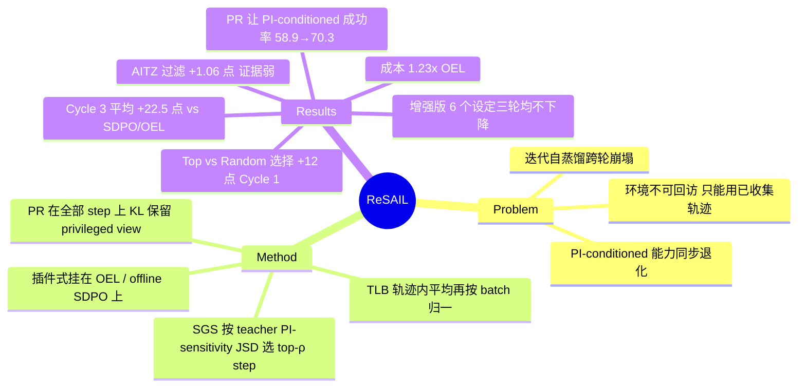

## Summary

在 OEL / SDPO 这类"部署 → 抽经验摘要当 privileged information (PI) → 离线 self-distillation → 学生当下一轮老师"的迭代循环里，作者先复现出两个现象：无 PI 的部署成功率逐轮下滑，有 PI 时的成功率也一起往下掉；于是 ReSAIL 加两件东西：只在 PI 最能改变 teacher 输出（JSD 最大）的少数 step 上蒸馏并按轨迹均衡 loss（TBSD），再加一项 KL 把学生的"带 PI 视角"拉回冻结 teacher（Privileged Retention, PR），让这个学生当下一轮老师时仍会用 PI。ALFWorld / TextCraft × Qwen3-4B/8B 三轮后，Cycle 3 成功率平均比 SDPO / OEL 本体高 22.5 个百分点，增强版在全部 6 个设定里三轮都不掉。报告的 SD 只来自三个 decoding seed，不反映训练方差（论文没有报告任何多训练 seed 的结果）；另外，基线越往后越塌，这本身就贡献了 22.5 点里的相当一部分。

## Problem & Motivation

用部署轨迹做迭代自蒸馏，被当作通往 recursive self-improvement (RSI) 的一条路径：OEL（Ye et al., 2026）交替"部署收集经验"和"把经验摘要作为 PI 离线蒸馏进权重"。但 Chen et al. (2026a) 已报告多轮重复会退化，作者在 SDPO / OEL 上也复现了跨轮崩塌（Figure 1）。作者把问题拆成两问：(Q1) 每轮应优先蒸馏哪些 interaction step；(Q2) 学生变成下一轮老师时会怎样——基础目标只训练 ordinary view（不带 PI），共享参数的 privileged view 没人看管，固定任务和 PI 后，它的 PI-conditioned 成功率逐轮下降。Chen et al. 的修法是改成 off-policy context distillation，需要用 PI-conditioned teacher 重新与环境交互收集成功轨迹；ReSAIL 针对的是更受限的设定，即部署环境不能回访，只能用已收集的轨迹。

## Method

ReSAIL 是挂在已有 PI-based self-distillation（OEL、offline SDPO）上的插件，基础目标不变：每个 step 上 ordinary-view student 对 privileged-view frozen teacher 做 token 平均的 student→teacher KL。

- **Sensitivity-Guided Selection (SGS)**：用冻结 teacher 计算每个 step 的 PI sensitivity，即同一 response 前缀下"带 PI / 不带 PI"两视角输出分布的 Jensen–Shannon divergence，在整个 batch 里取 top-ρ 的 step 做蒸馏（ALFWorld ρ=0.05，TextCraft ρ=0.25）。每次 update 重算，反传时固定。
- **Trajectory Loss Balancing (TLB)**：先在每条轨迹内对被选 step 的 loss 求平均，再按完整 batch 的轨迹数归一，避免选中 step 多的轨迹占据过多权重。
- **Privileged Retention (PR)**：在**所有** step（含未被选中的）上，把学生的 privileged-view 分布用 KL 拉回本轮冻结 teacher 的 privileged-view 分布，权重 λ（ALFWorld 0.5，TextCraft 1.0）。动机是两视角共享参数，只训练 ordinary view 会顺带改坏下一轮监督要用的 PI-conditioned 行为。
- **工程近似**：JSD 与两项 KL 都用"当前学生 ordinary view 的 Top-20 token + 一个 residual tail"近似。
- **数据协议**：文本任务三轮、每轮 30 次 update，每轮用上一轮最终 checkpoint 重新收集轨迹并替换旧语料，训练中不再与环境交互；PI 是起始策略从完整轨迹抽取的经验摘要，不是轨迹本身。

## Key Results

- **主结果（Table 1，Cycle 3，无 PI 部署成功率）**：相对各自本体，SDPO+ReSAIL 提升 7.0–26.1 点，OEL+ReSAIL 提升 20.3–37.0 点，12 个对比平均 22.5 点（abstract 写作 "22.5%"，实为百分点）。Qwen3-8B ALFWorld OOD 上 SDPO+ReSAIL 75.3%、OEL+ReSAIL 78.4%，RFT 63.8%、GRPO 62.2%、EPD 46.6%。
- **跨轮趋势**：OEL 在 6 个设定里 Cycle 3 全部低于 Cycle 1，SDPO 有 5 个低于 Cycle 1；两个增强版的均值在所有设定里三轮都不下降。崩塌最严重的例子：Qwen3-4B TextCraft 上 OEL 62.0 → 54.7 → 43.7，已低于未训练的 ReAct 初始策略（61.3）；OEL+ReSAIL 为 63.3 / 64.0 / 64.0，只比 ReAct 高约 2.7 点。
- **组件消融（Table 2，OEL / Qwen3-4B / ALFWorld，Cycle 3 ID/OOD）**：OEL 47.4/38.5；SGS+TLB 56.5/45.6（仍低于其 Cycle 1）；只加 PR 64.3/53.9；完整版 74.2/67.2。SGS 主要提升 Cycle 1，PR 决定跨轮能否保住增益。
- **选择准则（Table 3a，Cycle 1，ρ=0.05）**：Top 62.2/57.3，Random 49.7/45.8，Bottom 40.1/40.4，说明有用的是"选 PI 敏感的 step"，而不只是稀疏化。
- **保留哪个视角（Table 3b / Table 9）**：Cycle 3 无 PI 部署成功率，不保留 56.5/45.6，ordinary-view retention 72.9/65.9，privileged-view retention 74.2/67.2。固定 PI 后在 128 个 OOD 任务上测 PI-conditioned 成功率：不保留 61.5% → 44.8%，PR 58.9% → 70.3%，ordinary retention 在 Cycle 3 为 62.2%。
- **成本（Table 8，只算 Cycle 1 训练循环，不含完整部署周期，8×H800）**：OEL 4.33 GPU-h；+SGS 4.08（student optimization 成本降约 74%）；完整 ReSAIL 5.32 GPU-h，是 OEL 的 1.23 倍。
- **AITZ 离线过滤（§4.4，Qwen3-VL-4B）**：用初始模型的 PI sensitivity 保留 top 80% step，一轮 100 次 update 后 step accuracy 65.95%，OEL 为 64.89%（+1.06）；评测在 101 个 episode / 843 步的固定子集上，只用 1 个 decoding seed。

## Evidence Ledger

| Claim ID | Claim | Type | Source locator | Evidence excerpt | Status |
|:--|:--|:--|:--|:--|:--|
| C1 | 加到 SDPO/OEL 上，Cycle 3 成功率平均 +22.5 点（12 个对比） | number | Abstract; §1; Table 1 | "improves final-cycle success rates by an average of 22.5 percentage points over the corresponding SDPO and OEL baselines" | source-verified |
| C2 | 相对本体 SDPO +7.0–26.1 点，OEL +20.3–37.0 点 | number | §4.2; Table 1 | "improves final-cycle success by 7.0–26.1 percentage points for SDPO and 20.3–37.0 points for OEL" | source-verified |
| C3 | Qwen3-8B ALFWorld OOD Cycle 3：SDPO+ReSAIL 75.3，OEL+ReSAIL 78.4，RFT 63.8，GRPO 62.2，EPD 46.6 | number | §4.2; Table 1 | "achieve 75.3% and 78.4% success… 63.8% for RFT, 62.2% for GRPO, and 46.6% for EPD" | source-verified |
| C4 | OEL 6/6、SDPO 5/6 设定 Cycle 3 低于 Cycle 1（例外为 4B ALFWorld ID） | comparison | §4.2; Table 1 | "OEL finishes below its first-cycle performance in all six settings, and SDPO does so in five" | source-verified |
| C5 | 两个增强版所有设定三轮均值不下降 | comparison | §4.2; Table 1 | "maintain non-decreasing mean success across all three cycles in every evaluated setting" | source-verified |
| C6 | 4B TextCraft：OEL 62.0→54.7→43.7；+ReSAIL 63.3/64.0/64.0；ReAct 61.3 | number | Table 1 | "OEL 62.0 … 54.7 … 43.7 … + ReSAIL 63.3 … 64.0 … 64.0" | source-verified |
| C7 | 组件消融 Cycle 3 ID/OOD：PR-only 64.3/53.9；SGS+TLB 56.5/45.6；完整 74.2/67.2；OEL 47.4/38.5 | number | Table 2 | PR-only row "64.3 (1.6) … 53.9 (2.1)" | source-verified |
| C8 | Cycle 1 选择策略：Top 62.2/57.3，Random 49.7/45.8，Bottom 40.1/40.4 | number | Table 3(a) | "Random 49.7 (3.9) 45.8 (4.4) Bottom 40.1 (3.2) 40.4 (4.3) Top (ours) 62.2 (2.0) 57.3 (4.0)" | source-verified |
| C9 | Cycle 3 保留视角：None 56.5/45.6，Ordinary 72.9/65.9，Privileged 74.2/67.2 | number | Table 3(b) | "None 56.5 (3.0) 45.6 (1.6) Ordinary 72.9 (2.4) 65.9 (3.5) Privileged (ours) 74.2 (1.4) 67.2 (2.3)" | source-verified |
| C10 | 固定 PI 下 PI-conditioned 成功率：无保留 61.5→44.8；PR 58.9→70.3；ordinary retention C3 62.2 | number | §4.3; Fig. 3; Table 9 | "falls from 61.5% at Cycle 1 to 44.8% at Cycle 3. With PR, it instead increases from 58.9% to 70.3%" | source-verified |
| C11 | Cycle 1 训练循环成本：OEL 4.33 GPU-h，+SGS 4.08（优化成本 −74%），ReSAIL 5.32 = 1.23× | number | §4.4; Table 8 | "total training-loop cost from 4.33 to 4.08 GPU-hours… 5.32 GPU-hours, or 1.23 times that of OEL" | source-verified |
| C12 | AITZ：OEL+SGS 65.95 vs OEL 64.89；101 episode / 843 步固定子集，单 decoding seed | number / benchmark-setting | §4.4; App. A.1, C.2 | "At update 100, OEL reaches 64.89% accuracy and OEL + SGS (Top-80% steps) reaches 65.95%" | source-verified |
| C13 | SD 只反映 decoding 方差、不反映训练方差（已核）；"主结果为单训练 seed"系推测——原文仅 D.3 曲线明说 one training seed | benchmark-setting | App. C.1; D.3 | "describe decoding variability, rather than variation across independent training runs" | unsupported（后半句已降级为推测） |
| C14 | 超参分 benchmark 设定（ALFWorld ρ=0.05/λ=0.5，TextCraft ρ=0.25/λ=1.0）；无独立 validation split，sweep 在同一 128+128 评测集上 | benchmark-setting | Table 4; Table 5; App. A.3; Table 7 | "ALFWorld 30 32 960 0.05 0.5 TextCraft 30 8 240 0.25 1.0"; "without intermediate validation or checkpoint selection" | source-verified |
| C15 | 论文未给 ReSAIL 代码链接，只有 slime / Megatron-LM / SGLang | license-code | App. B | "Our training framework is built on slime… with Megatron-LM… and SGLang… for generation" | source-verified |
| C16 | Chen et al. 2026a 的修法需额外环境交互；ReSAIL 只用已收集轨迹 | causal-mechanism | §2; §3.1 | "Collecting these teacher trajectories requires additional environment interaction" | source-verified |
| C17 | 作者自称 "first evidence" 迭代 agent 自蒸馏崩塌可被缓解（作者 claim，未外部核查） | sota-novelty | Abstract; §1 | "We provide the first evidence that performance collapse in iterative agent self-distillation can be effectively mitigated" | source-verified |
| C18 | Qwen3-4B/8B 关闭 thinking，三轮×30 update；PI 为轨迹抽取的经验摘要；PI sensitivity = 两视角 JSD | benchmark-setting | §1; §3.2; §4.1; App. B.1 | "defined as the Jensen–Shannon divergence between the teacher's output distributions with and without PI" | source-verified |

> 核查由独立 verifier agent 对照 arXiv HTML v1 完成，派生数字（平均值、差值、设定计数）均由 verifier 从表格重算；source-verified 仅表示原文一致，不代表结果已被独立复现。C17 是作者的 novelty 自述，未做外部检索核查。

## Strengths & Weaknesses

**Strengths**

- **问题拆得准**。把"迭代自蒸馏崩塌"拆成两件可测量的事：每轮学什么（PI sensitivity），以及学生作为下一轮 teacher 还剩多少能力（固定 PI 的 dual-view 评测，Table 9）。后者是本文最有价值的诊断工具：它直接测量了"老师退化"这个通常只被猜测的机制，比只看部署成功率多给出一条因果线索。
- **消融设计扎实**。Random / Bottom / Top 同 ρ 对照排除了"只是稀疏化"；ordinary vs privileged retention 控制了 KL 方向、step 集合、平均方式和系数，只改 conditioning view；ρ=100% 一档明确说明不等于 OEL 本体。
- **方法简单、可插拔**。两个模块都只是 loss 层改动，在 OEL（每步新采样 response）和 offline SDPO（缓存 response + TIS 修正）两种很不同的 response 来源上都起作用。

**Weaknesses**

- **训练方差未知（已知 + 推测）**。附录 C.1 自陈 SD 只反映 decoding 方差，不反映独立训练 run 之间的差异；明确说只用一个训练 seed 的只有 D.3 的 PI-sensitivity 曲线，但全文没有报告任何训练 seed 方差，因此主结果大概率也是单次训练（推测）。三轮迭代的复合过程对训练随机性应当很敏感，单 seed 下"非递减"这类跨轮趋势结论偏弱；SDPO 在 Qwen3-4B OOD 上的"崩塌"只是 44.8 → 44.3，处在 SD 范围内。
- **"privileged view"本身的必要性证据偏弱（推测）**。Table 3b 中 ordinary-view retention（72.9/65.9）与 PR（74.2/67.2）的部署成功率差距落在 SD 内；拉开差距的只有 PI-conditioned 成功率（62.2 vs 70.3，Table 9），而这一项是作者自定义的代理指标。据此可以合理地推测：跨轮增益大部分来自"任何形式地锚定冻结 teacher 的 KL"，privileged 视角的增量还没有在部署指标上得到证明。附录 D.1 区分了 PR 与 GRPO 的 reference KL，但没有做"ordinary + privileged 同时锚定"或更多轮次的对照。
- **超参与测试集未分离（已知 + 推测）**。论文没有描述独立 validation split；ρ/λ 的 sweep 就在 128 个 ALFWorld ID/OOD 评测 episode 上做，而 TextCraft 用另一组超参（ρ=0.25、λ=1.0），选取过程未说明。增益量级足以抵消这部分偏差，但 ±5 点量级的对比应打折看待。
- **"22.5 点"的分母是塌掉的基线**。平均增益相对的是 Cycle 3 已崩的 OEL/SDPO；相对未训练的 ReAct，TextCraft 上 OEL+ReSAIL 只多 2.7 点（4B）。"防止塌"已有证据支持，"持续自我改进"还谈不上：3 轮、每轮 30 次 update，多数设定第 2 → 3 轮的增量已经很小。
- **AITZ 结果很弱**。+1.06 点，单 decoding seed、单训练 run，只在 843 步上测，而且只用了 SGS 当静态过滤器，没有 PR、没有迭代。它最多说明"PI sensitivity 作为过滤准则不伤性能"，支撑不了"适用于多模态 GUI agent"。
- **消融覆盖窄（已知）**。所有消融和 dual-view 分析只做了 OEL × Qwen3-4B × ALFWorld，Table 9 只覆盖 OOD；SDPO 集成、8B 和 TextCraft 上各组件的作用都没有拆开。
- **没有代码**（论文中只给出 slime / Megatron-LM / SGLang 等第三方框架链接）。

**潜在影响**：ReSAIL 把一个经验性问题说清楚了：在 PI-based 迭代自蒸馏里，下一轮老师的质量是被优化目标顺带改动的状态变量，需要显式维护。这对所有"学生变老师"的 self-evolving 循环都适用，包括 on-policy self-distillation 与 hindsight distillation。

## Mind Map

## Notes

- **与 vault 内 RSI / self-evolving 笔记的本质区别**：
  - [[2609-NeoHorse1]]：用 routing harness 的日志排 SFT 课程和 on-policy distillation 的数据调度，自陈只跑了一轮，递归没有真正发生。ReSAIL 是真跑了三轮的权重级迭代，研究的是"循环本身为什么塌"，而不是怎样排数据。
  - [[2609-SoLPi]]、[[2609-RRSI]]：RSI 发生在 harness 代码层，权重冻结，失败模式是 evolve set 过拟合 / 搜索噪声。ReSAIL 发生在权重层，失败模式是 teacher（即上一轮学生）的 PI-conditioned 能力退化。前两者的正则管的是"搜索怎么走"，PR 管的是"老师别被训坏"。
  - [[2609-RSIAgent]]、[[2609-DreamRSI]]：分别是 training-free 记忆和 exploration policy 代码的自改进，权重不变，与 ReSAIL 的问题设定不重合。
- **与 self-distillation 线的关系**：[[2607-SEED]]、[[2608-GatedHindsight]]、[[2608-PCSD]] 都用"带额外上下文的同参 teacher"给 token 级信号做蒸馏，但都是单轮、和 GRPO 联合优化，不讨论"学生变老师"后的退化。ReSAIL 的 PR 可以直接移植给这些方法：只要 teacher 与 student 共享参数，就存在 privileged view 被顺带改坏的风险。[[2605-AntiSD]] 从 PMI 角度指出 on-policy self-distillation 会奖励 shortcut token；这与 ReSAIL"选 PI 影响最大的 step"在方向上存在潜在张力（PI 敏感的 step 可能正是 shortcut 集中的地方），尚未有人检验。
- **开放问题**：(1) 3 轮之后会怎样，PR 锚定的是每轮的冻结 teacher，长期是否等价于向初始模型慢速回归？(2) PI 是起始策略自己抽的摘要，摘要质量随轮次的变化没有单独测量（D.2 用固定摘要，刻意回避了这个变量）；(3) 多训练 seed 下"非递减"是否仍然成立。
- 原文引用的 Chen et al. 2026a（arXiv 2606.04703，"Rethinking continual experience internalization for self-evolving LLM agents"）与 OEL（2603.16856）vault 中均无笔记，是理解本问题的直接前置工作，值得补读。
