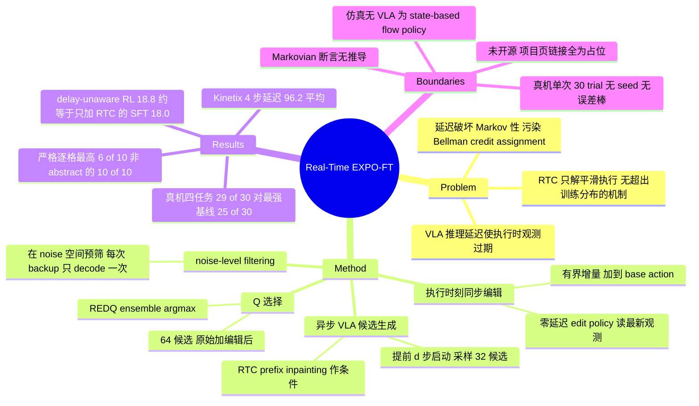

## Summary

大 VLA 的推理延迟让执行时刻用的观测已经过期，standard RL 假定的 Markov 性随之失效。Real-Time EXPO-FT 把慢的生成和快的反应拆成两条时间线：VLA 提前异步采样候选 action chunk，一个零延迟的轻量 edit policy 在执行时刻用最新观测给每个候选加一个有界增量，action critic 再从 64 个候选（32 原始 + 32 编辑后）里选一条执行。Kinetix 4 步延迟下平均 96.2%，四个真机动态任务在 10 分钟在线数据上限内从 SFT 的 12.5/30 提到 29/30。

## Problem & Motivation

VLA 的规模同时带来强 behavior prior 和高推理延迟。当延迟 d 接近或超过动作执行窗口，用来算动作的观测和动作真正落地时的状态不是同一个，形成 distribution shift。作者指出这件事对 RL fine-tuning 的伤害比对 imitation learning 更特殊：RL 的 Bellman backup 建立在「执行的动作是当前状态的函数」之上，而延迟下动作实际是 s_{t-d} 的函数，delayed process 在 s_t 上不再 Markovian，credit assignment 会被系统性带偏（§IV-A）。

已有的 real-time chunking（RTC）路线用 action inpainting 在当前 chunk 执行期间生成下一个 chunk，解决了延迟下的平滑执行，但它整条都建在 imitation learning 上，没有超出训练分布、往更高可靠性走的机制。反过来，直接把 RTC 当 base policy 套上 RL 也不够——动作仍然是从旧观测预测的，RL 能提供的精细修正落不到最新状态上。这篇要补的就是这两者的交集。

## Method

结构上沿用 EXPO / EXPO-FT 的双策略设计（大 base policy + 小 edit policy + learned critic），新增的是把两者放到不同时间线上。

**异步候选生成**。当前 chunk 还剩 d 步时启动 VLA 推理，从观测 s_{t-d} 采样 N 个候选 chunk。按 training-time RTC 的写法，推理窗口内将被执行的前 d 个动作以 clean prefix 形式 inpaint 进条件（flow-matching timestep 置 1），loss 只覆盖 postfix；每个候选只保留 prefix 之后的一段。

**执行时刻的同步编辑**。环境走到 s_t 后，edit policy 读最新观测，对每个候选输出一个被 tanh 压到 [-β, β]、再乘任务相关 edit scale 的增量，加到 base action 上。梯度不回传进 VLA backbone。作者据此声称 base + edit 的组合相对 s_t 重新变回 Markovian（§IV-B）——这是全文的核心论证，但它只是一句断言，没有任何推导或条件（见 C12）。

**Q 选择**。action critic 在 s_t 下同时评估原始与编辑后的候选，取 argmax 执行（Table III：32 base + 32 edit = 64 个候选，deterministic argmax，不做 softmax）。critic 是 10 网络 REDQ ensemble，每次取 2 个子采样的 min。

**noise-level filtering**。chunk-level TD backup 需要构造 next chunk，朴素做法要把 N 个候选全部 denoise。作者接 FASTER 的思路，用一个轻量 filter critic 直接给 32 个高斯 seed 在 noise 空间打分，只把最高分那个 denoise 一次，再采一个 edit；filter critic 用 MSE 回归到外层 target critic 对 denoised survivor 的 value（stop-gradient），使 noise 空间的排序继承 action 空间 critic 的排序。每次 backup 只需一次 VLA decode，与 N 无关。

**训练流程**。先用 prefix-conditioned flow matching 做 LoRA SFT，训到成功率「around 30% or higher」就停，这批数据同时初始化 replay buffer；随后在线 RL，base VLA 只在成功 episode（含 demo 与成功 rollout）上继续做 BC 更新，每个 update call 恰好一步。reward 是 sparse binary，由每任务一个 rule-based 检测器给出。

## Key Results

**仿真（Kinetix，10 环境，4 seeds × 100 episodes）**。延迟本身的代价可以直接读出来：同一个 BC policy 零延迟 90.7%，4 步延迟掉到 55.2%，加上 RTC 恢复到 80.0%。RL 方法里 Real-Time EXPO-FT 平均 96.2%，高于 EXPO-FT w/RTC 81.7%、DSRL w/RTC 76.1%、EXPO-FT 74.9%、DSRL 61.7%，也高于零延迟 RLPD 的 81.4%。

但 abstract 那句「best performance among delayed and non-delayed methods in 10 out of 10 environments」不成立（C2）。Table II 的加粗规则是「within 0.95x the best RL result，BC 与 RTC 排除在比较之外」，10/10 只在这条容差带下成立；按逐格严格最高数，含全部列时是 6/10（Car Launch、Catapult、Unicycle、Half-Cheetah、Trampoline、Grasp），Catcher 与零延迟 BC 并列 97，另外三个任务落后：Cartpole Thrust 98 对 BC 100 与 EXPO-FT 99，Hard Lunar Lander 94 对 BC 与 EXPO-FT 各 95，Chain Lander 92 对 DSRL w/RTC 96。只比 RL 方法则是 7/10。加粗规则自己就把 BC 排除了，因此它撑不起 abstract 里的「non-delayed methods」。

**真机（DROID 单臂，30 Hz，四任务各 30 trial，在线数据上限 10 分钟）**。Table I 的完整平均：SFT 12.5/30、SFT w/RTC 18/30、RLPD 4.5/30、DSRL 18.3/30、DSRL w/RTC 20/30、EXPO-FT 18.8/30、EXPO-FT w/RTC 25/30、Real-Time EXPO-FT 29/30。

比 abstract 的「42% → 97%」更有信息量的是把这条链拆开（以下四个差值由 Table I 已核数值算出）：

| 步骤 | 变化 | 增量 |
|:--|:--|:--|
| 只给 SFT 加 RTC，不做 RL | 12.5 → 18.0 | +5.5/30 |
| 在 RTC 之上做 EXPO-FT RL | 18.0 → 25.0 | +7.0/30 |
| 换成本文的执行时刻 edit + 异步候选 + Q 选择 | 25.0 → 29.0 | +4.0/30 |
| 参照：delay-unaware 的 RL | SFT w/RTC 18.0 vs EXPO-FT 18.8 | +0.75/30 |

最后一行是这篇论文最硬的证据，而它不在 abstract 里：不处理延迟的 RL fine-tuning 在这批动态任务上几乎等于白做，成绩和一个只加了 RTC、完全不做 RL 的 SFT policy 处在同一档。真正把 RL 的收益释放出来的前提是延迟感知，本文新增机制在此之上再贡献 +4/30。所以头条的 12.5 → 29 里，只有约四分之一归属于这篇论文自己的贡献。

RLPD 4.5/30 且在 Dynamic Picking 与 Object Passing 上 0/30——从零学的轻量 Gaussian SAC 在 10 分钟预算内做不动这类任务。

**延迟与速度扫描**。H17 Unicycle 上加大延迟，Real-Time EXPO-FT 保持稳定而 RTC 退化；Object Passing 上提高传递速度，本方法维持接近 100%，非异步的 EXPO-FT 变体随速度上升退化（§V-D，Fig. 6；该图在 arXiv HTML 中未渲染，只能读正文描述）。

**预算对齐情况**。在线数据轴是对齐的：10 分钟上限对所有方法生效。梯度轴作者主动声明不对齐且方向有利于 baseline（RLPD / DSRL 跑异步 learner、不受环境速率限制）。但这条声明本身没有数字支撑：名义 UTD 是 Real-Time EXPO-FT 20、DSRL 20、RLPD 4，§VII-F 承诺「report the measured number of optimizer steps per environment step for each run」，全文并未出现这组数（C7）。

## Evidence Ledger

| Claim ID | Claim | Type | Source locator | Evidence excerpt | Status |
|:--|:--|:--|:--|:--|:--|
| C1 | Kinetix 平均成功率：Real-Time EXPO-FT 96.2，EXPO-FT w/RTC 81.7，DSRL w/RTC 76.1，EXPO-FT 74.9，DSRL 61.7，零延迟 RLPD 81.4，零延迟 BC 90.7 | number | Table II Average 行（§VII-B） | "Real-Time EXPO-FT achieves an average success rate of 96.2% under the 4-step delay, substantially outperforming all delayed RL baselines" | source-verified |
| C2 | Abstract 称在 10/10 个环境上取得 delayed 与 non-delayed 方法中的最佳表现 | sota-novelty | Abstract 对 Table II | "Bold marks every RL method within 0.95x the best RL result on that task (BC and RTC are excluded from the comparison)" | contradicted |
| C3 | 真机四任务 Real-Time EXPO-FT 平均 29/30，SFT 平均 12.5/30，即 abstract 的 42% → 97% | number | §I，Table I | "improves the average evaluation policy performance from 42% (12.5/30) to 29/30, all without human intervention during training" | source-verified |
| C4 | Table I 最强 baseline 是 EXPO-FT w/RTC 25/30，真实头条边际是 29 对 25 而非 29 对 12.5 | comparison | Table I（§V-C） | "Success Rate (x/30). Training is capped at 10 minutes of online data." | source-verified |
| C5 | Kinetix 仿真完全不涉及 VLA，base policy 是 state-based flow-matching policy | benchmark-setting | §VII-C1 | "we use the vector-state (symbolic) Kinetix benchmark, where no VLA is involved and the base policy is a pretrained state-based flow-matching policy" | source-verified |
| C6 | 在线数据 10 分钟上限对所有方法生效，但停止准则含「until one policy reaches 30/30」，各 baseline 实际拿到多少在线数据全文未报告 | benchmark-setting | §V-C，Table I caption，Table IV | "We train each policy until one policy reaches a 30/30 success rate or 10 minutes of online data have been collected and used for training." | source-verified |
| C7 | 作者声明 RLPD 与 DSRL 的异步 learner 给了它们更多梯度更新、该不对称有利于 baseline，但未给出实测更新数 | benchmark-setting | §V-A 末段，§VII-F | "this affords them substantially more gradient updates than EXPO-FT and Real-Time EXPO-FT ... This asymmetry favors RLPD and DSRL" | source-verified |
| C8 | 四个真机任务中三个人为注入额外 100 ms 延迟，总延迟约 167 ms（d=5）；Dynamic Picking 用实测 67 ms（d=3） | benchmark-setting | §V-C 第六段，§VII-E3 | "we introduce an additional 100 ms delay ... yielding a total latency of approximately 167 ms" | source-verified |
| C9 | Ball Balancing 与 Soccer Kicking 向 critic、noise filter、edit policy 注入 privileged state；论文只明确说 DSRL 与 RLPD 也拿到，EXPO-FT 系列未明说 | benchmark-setting | §VII-D3，§VII-F | "Both DSRL and RLPD receive the same privileged state dimensions in their critics." | source-verified |
| C10 | 真机 Table I 每格为单次 30 trial，无多 seed、无重复运行、无误差棒；仿真为 4 seeds × 100 episodes | number | §VII-B，§V-C，§VII-E5，Table I | "For each method, we conduct 100 trials in each environment and average the results across four random seeds" | source-verified |
| C11 | 论文唯一 artifact 是 project page，未发布代码仓库；arXiv license 为 CC BY 4.0 | license-code | 项目页 pd-perry.github.io/real-time-expo-ft，arXiv abs | 页面三个按钮 Paper / arXiv / Code 的 href 均为 "#"，BibTeX 为占位模板 "author={Author One and Author Two...}, eprint={XXXX.XXXXX" | source-verified |
| C12 | 作者称 edit 以最新观测为条件使 base 加 edit 的组合在延迟下仍保持 Markovian | causal-mechanism | §IV-B，Eq. (8) 之后一句 | "Because the edit is conditioned on the latest observation, the combined base-plus-edit policy remains Markovian with delays." | source-verified |
| C13 | VLASH、FutureRTC、Park 与 Tulsiani、Leave No Observation Behind 只出现在 Related Work，未进入任何实验对比 | comparison | §V-A，Table I，Table II，参考文献 Cited by 字段 | 上述四条 reference 的 Cited by 均只含 §I 与 §II，实验部分 baseline 仅 RLPD、DSRL 系、EXPO-FT 系 | source-verified |
| C14 | 真机 base policy 为 π0.5 加 LoRA（gemma_2b_lora 主干 + gemma_300m_lora action expert），DROID 单臂 30 Hz Cartesian 速度控制，H=16，图像 224×224 | number | §VII-E1，§VII-D1，§V-C，Table III | "The model uses a LoRA configuration with a gemma_2b_lora language backbone and a gemma_300m_lora action expert" | source-verified |
| C15 | 在线 RL 之前，VLA 先 SFT 到成功率「around 30% or higher」，该数据同时初始化 replay buffer | benchmark-setting | §IV-C Training Procedure | "fine-tune the VLA using imitation learning with Equation 7 under a randomized delay, until it reaches a success rate of around 30% or higher" | source-verified |
| C16 | 作者为 Perry Dong、Kuo-Han Hung、Dorsa Sadigh、Chelsea Finn，Stanford University，2026-09-16 提交 v1，cs.RO 与 cs.LG，arXiv 元数据无 Comments 字段因而未标注任何 venue | number | arXiv abs 2609.18207，论文作者块 | "[Submitted on 16 Sep 2026] ... Subjects: Robotics (cs.RO); Machine Learning (cs.LG)" | source-verified |
| C17 | 本文所建立其上的 EXPO、EXPO-FT 与所用的 FASTER noise filtering 均为同一第一作者的前作；52 条引用中 8 条为第一作者自引 | comparison | 参考文献 [9] [13] [15]，§II | "[13] P. Dong, Q. Li, D. Sadigh, and C. Finn (2026) EXPO: stable reinforcement learning with expressive policies." | source-verified |

对 C2 的处理：abstract 的 10/10 表述不进入本笔记的 Summary 与 Key Results；Key Results 写入的是 Table II 支持的 6/10（全列）与 7/10（仅 RL 方法），以及 0.95x 容差带这一限定条件。

对 C6 的边界：Table IV 只列出 Real-Time EXPO-FT 自身的 environment steps（三个任务约 18k、一个约 5k；按 30 Hz 折算分别约 10 分钟与约 2.8 分钟），「(10 min reached)」标注也只出现在本方法的两格上。任何 baseline 实际训了多久，以及它们是否在别的策略先到 30/30 时被截断，原文不可判定。

对 C10 的边界：Fig. 5 与 Fig. 6 的图像在 arXiv HTML 中缺失（figure 块内无 img 元素），训练曲线上是否有方差阴影无法从 HTML 核对，相关描述只能依据正文文字。

## Strengths & Weaknesses

**做对的地方。** 问题选得准。RL fine-tuning 和 real-time inference 在 VLA 领域是两条独立推进的线（[[Topics/VLA-Survey|VLA-Survey]] 里分别是路线 8 与部署工程栈两节），这篇是第一次正面处理二者的耦合，而且抓住的耦合点是实质性的：延迟破坏的不只是控制平滑度，是 Bellman backup 所依赖的 Markov 性。解法也符合 simple 的标准——不去压 VLA 的延迟，而是把「必须用最新观测」这个责任整条转移给一个本来就零延迟的组件。这个拆法比 [[Papers/2607-VLACorrector|VLA-Corrector]] 的 training-free detect-and-correct 更彻底：后者在推理期截断 chunk 并引导下一次去噪，反应性仍受限于 base policy 的下一次调用；这里 edit policy 是被 Q-value 训出来的，每个执行步都在动。

关键对照组在。EXPO-FT w/RTC 与 Real-Time EXPO-FT 共用学习器架构、网络规模、候选数、filter、优化器与 prior-data 配置，唯一差别是 delay-unaware（§VII-F），这条隔离掉了 EXPO 优化本身的贡献。在线数据预算也统一卡在 10 分钟。这比本轮同批多数论文的对照纪律要好。

真正有价值的发现藏在 Table I 而不在 abstract：delay-unaware 的 RL（18.8/30）和不做 RL 只加 RTC 的 SFT（18/30）打平。这说明在动态任务上，延迟感知不是 RL 的一个增益项，而是 RL 能不能起作用的前置条件。

**问题。** abstract 比正文宽（C2），而且宽的方式是拿一条 0.95x 容差带说成 best，并把该容差带明确排除掉的 BC 列重新算进「non-delayed methods」。头条的 42% → 97% 同样选了最弱基线：SFT 的起点 41.7% 本身是作者的设计选择（训到 30% 以上就停，C15），不是 SFT 的能力上限；对最强基线的真实边际是 83.3% → 96.7%。

仿真部分与题目脱节。Kinetix 那 10 个环境里没有任何 VLA（C5），base 是 state-based flow policy，MLP encoder。这组实验能支持的是「delay-aware RL 算法在延迟下有效」，不能支持任何关于 VLA 的断言——而它恰恰是 abstract 里唯一带 10/10 这种强量词的实验。

全文的核心论证没有论证。「base 加 edit 的组合在延迟下仍保持 Markovian」是这套设计的全部合法性来源，§IV-A 花了一整段把非 Markov 性立为问题，§IV-B 用一句话把它宣布解决，没有推导、没有成立条件、没有引向附录（C12）。实际上这句话要真成立，需要 edit policy 的动作空间足以覆盖 base action 与最优动作之间的差距，而 edit 被限制在 [-β, β] 内——β 不够大时组合策略对 s_t 只是部分可控，论文既没讨论也没做 β 的敏感性分析。

统计强度不足。真机每格是单次 30 trial，没有多 seed、没有重复运行、没有误差棒（C10）。Ball Balancing 28/30 对 EXPO-FT w/RTC 23/30 这类差距在 n=30 的二项噪声下并不宽裕。

两处可比性缺口。其一，Ball Balancing 与 Soccer Kicking 给 critic、filter、edit policy 喂了 privileged state（球位置速度、keeper 位置速度），论文只明确说 DSRL 与 RLPD 也拿到，EXPO-FT 系列只能从「唯一差别是 delay-unaware」这句话推断（C9）——而 EXPO-FT w/RTC 正是承重的对照组，这个推断最好由作者写实。其二，baseline 的梯度优势只有定性声明没有实测数字，而承诺要报的那组数字不在文里（C7）。

延迟设定偏人工。四个任务里三个的延迟是往 67 ms 上人为加 100 ms 造出来的（C8），理由是模拟更受限的算力或更大的模型，可以接受；但这意味着头条结果里只有 Dynamic Picking 一个任务跑在真实测得的部署延迟上。§V-C 与 §VII-E3 对 d=3 的毫秒折算也不一致（前者 67 ms，后者约 100 ms，后者与 30 Hz 下 3 步的算术一致）。

比较面窄且高度自引。论文在 §II 点名了 VLASH、FutureRTC、Park 与 Tulsiani、Leave No Observation Behind 四条 real-time 路线，实验里一条都没比（C13），唯一进入 baseline 的 real-time 机制是 training-time RTC。同时框架本身与所用的 noise filtering 全部来自同一第一作者的前作（C17）。这不影响结果的正确性，但「state-of-the-art baseline」在这里指的是作者自己三个月前的工作。

无代码（C11）。项目页的 Paper / arXiv / Code 三个按钮 href 全是 `#`，BibTeX 还是未填的占位模板。复现这套异步 rollout 加 noise-space filtering 的工程栈，光靠论文附录不现实。

## Mind Map

## Notes

- **rating 4 的理由**：不是因为数字，是因为它把两条本来分开推进的线接上，并且给出了一条能改变判断的对照——delay-unaware 的 RL fine-tuning 在动态任务上约等于不做。这对任何打算在真机上做 VLA RL post-training 的工作都是前置结论。扣分项集中在 abstract 与正文的口径差、仿真设定与题目脱节、以及核心机制断言无论证。
- **和 vault 已有线索的关系**：[[Topics/VLA-Survey|VLA-Survey]] 把 real-world RL（[[Papers/2511-PiStar06|π*0.6]] 的 RECAP、[[Papers/2602-WorldVLALoop|WorldVLALoop]]、[[Papers/2607-WCM|WCM]]）和部署延迟（[[Papers/2604-Pi07|π0.7]] 训练时注入 0-12 step delay、[[Papers/2604-SnapFlow|SnapFlow]] 274→83 ms）记在两个独立的位置。这篇给出的证据说明它们不独立：在动态任务上，不先把延迟建进 RL 的 backup 里，RL 的收益就取不到。survey 的路线 8 与「Deployment 工程栈成熟」两节值得据此互相引用。
- **一个可做的最小检验**：β（edit scale）的敏感性。如果 Markovian 断言靠的是 edit 能覆盖 base action 与最优动作之差，那么把 β 从任务调优值往下压，成功率应当在某个阈值附近陡降而不是线性退化，且该阈值应随延迟 d 增大而上移。论文有 Fig. 6 的 delay 扫描但没有 β 扫描，这条正好补上机制证据。
- **可比性提醒**：Table II 的 BC 有两列（零延迟 90.7、4 步延迟 55.2）。后续引用这篇的 Kinetix 数字时要写明是哪一列，否则「BC 基线」会指向相差 35.5 个百分点的两个东西。
- **未开源**，且项目页目前是个空壳（按钮 href 全为 `#`，BibTeX 为占位模板）。若后续要做实现级分析，需等作者放出仓库。
