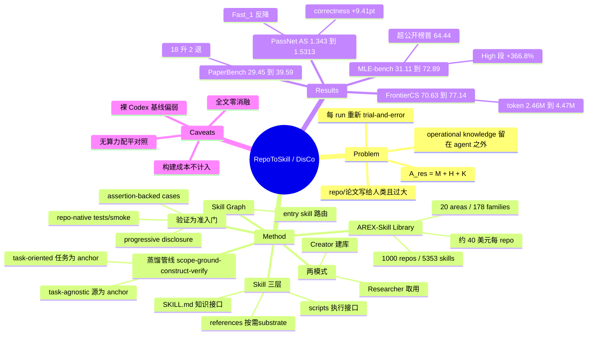

## Summary

DisCo 把 operational knowledge（把一个方法真正跑通所需的 know-how）立为 model backbone 与 harness 之外的第三层，用 task-agnostic（把常用 ML 仓库压成 skill graph）与 task-oriented（按任务能力缺口现场找材料）两条蒸馏路径产出必须通过可执行检查才准入的 skill，规模化后得到 AREX-Skill Library：1,000 个 ML 仓库、5,353 条 skill、20 areas / 178 capability families。在 GPT-5.5 backbone 与 vanilla Codex harness 固定、running budget 对齐的设定下，带 skill 的 agent 相对同一 agent 不带 skill 在 MLE-bench +134.3%、PaperBench +34.4%、FrontierCS +9.2%、PassNet +14.0%。但增益的量级高度依赖被选中的裸 Codex 基线（MLE-bench 上仅 31.11，公开榜首为 64.44），且 FrontierCS 上带 skill 条件实际多花 1.82× token——"预算固定"指的是 per-task 上限相同，而非实际算力配平。

## Problem & Motivation

论文把研究 agent 写成 `A_res = (M_θ, H, 𝒦)`：`M_θ` 是 LLM backbone，`H` 是负责 planning / execution / memory / verification 的 harness，`𝒦` 是以显式 context 形式存在的 operational knowledge。作者的判断是前两项已被大量工作推动，第三项却一直被留在 agent 之外——"the know-how that separates knowing a method from making it work"。

这层知识并非不存在。它散落在 repository 和论文里，但写给人类读者、且体量远超单次任务能装下的 context。结果是 agent 每接一个任务都要在 trial-and-error 里重新发现同一批工程细节，发现的东西随 run 结束而蒸发，无法跨任务复用。论文因此把问题重述为：能否把这层知识预先蒸馏成紧凑、经过验证、可按需加载的 skill，让它像 model 和 harness 一样成为一个可以独立调节的杠杆。

## Method

**Skill 的三层表示**。单个 skill `S = (SKILL.md, references/, scripts/)`。`SKILL.md` 是唯一先行读取的 knowledge interface，写明目标、关键概念、工具用法、指针、worked example 与已知 failure mode；`references/` 是按需加载的 knowledge substrate（API 文档、算法细节、参数配置），遵循 progressive disclosure；`scripts/` 是带明确输入输出的 execution interface——论文的措辞是 agent "invokes rather than reimplements"。

**Skill graph**。同一来源的多个 skill 组成 `𝒢 = (𝒮, ℒ)`，`ℒ` 编码 routing / dependency / composition 关系。图里有一个 entry skill 声明来源范围，并路由到对应 package function、method stage 或 protocol element 的组件 skill（setup、evaluation、diagnosis、repair 等）。使用时 agent 读入口、只沿着自己问题需要的链接走，其余不打开。

**四阶段蒸馏管线**。统一写作 `z →scope→ 𝒬 →ground→ 𝒳 →construct→ 𝒢̃ →verify→ (𝒢, R)`：`z` 是 anchor，`𝒬` 是要覆盖的 capability 集合，`𝒳` 是收集到的证据，`𝒢̃` 是候选图，`𝒢` 是被接纳的图，`R` 是构造记录。anchor 的两种取法给出两条互补路径：

- **task-agnostic（anchor = source `c`）**：Source Understanding → Capability Identification（先确定这是什么工件，再决定哪些能力值得暴露）→ Knowledge Extraction（证据从来源自身取）→ Tool Encapsulation + Skill Packaging（可执行部分包进稳定接口，三层组装成连通图）→ Skill Verification。
- **task-oriented（anchor = task `τ`）**：Task Decomposition → Capability Gap Analysis（拆出任务所需能力，隔离出 agent 自身覆盖不到的缺口）→ Source Discovery（主动去找覆盖缺口的材料，`𝒳` 是"组装"而非"筛选"出来的）→ Skill Generation → Verification。

**验证作为准入门**。graph 入库前必须过 assertion-backed usability case，配合仓库原生的安全样例（tests、CLI checks、tiny-fixture checks、smoke scripts）；归因到该 graph 的失败触发局部修复并重跑相关检查。论文明确写 skill 不得仅凭来源可信就被接纳，未消解的 gap 会被记录下来。这是全文最强的设计主张。

**两种运行模式**。Creator mode 把来源蒸馏成 skill graph 存入 AREX-Skill Library；Researcher mode 解题时按 progressive disclosure 取用——先读 router description，沿 area→family 路径打开选中的 repository graph，只加载当前这一步需要的 skill / reference / script。

**库的构建**。1,000 个 ML 仓库按开源可见度与实际使用度挑选（GitHub stars 是 curation signal 之一），覆盖模型实现、训练与部署系统、数据与评测工具、科学软件。先冻结每个仓库的简短摘要，再用 LLM-assisted pipeline 归纳出 area/family 两级树（在 100 个 10 仓库的稳定 batch 上以分离的 locator 与 judge 调用评估，按 judge review 修订）。最终得到 5,353 skill / 1,000 repository graph / 20 areas / 178 capability families。构建端用 GPT-5.5 与 GPT-5.6-sol（xhigh reasoning effort），task-agnostic 仓库图平均约 \$40/repo。

## Key Results

**统一设定**：评测端 backbone 全程 GPT-5.5（xhigh），harness 是 vanilla Codex，不加自定义 orchestration；对照是同一 agent 带 skill vs 不带 skill，两者 running budget 对齐，skill 构建走独立预算且不计入任一 runtime 条件。

**MLE-bench**（全量 75 competitions，Any-Medal，官方 held-out grader，3 次重复取 mean±SEM；baseline 行抄自官方 leaderboard）

| Agent | Backbone | Low (22) | Medium (38) | High (15) | All (75) |
|:--|:--|--:|--:|--:|--:|
| Famou-Agent 2.0 | Gemini-3-Pro-Preview | 80.30±1.52 | 64.04±2.32 | 42.22±2.22 | 64.44±1.18 |
| AIBuildAI | Claude-Opus-4.6 | 77.27±0.00 | 61.40±0.88 | 46.67±0.00 | 63.11±0.44 |
| R&D-Agent | GPT-5 | 68.18±2.62 | 21.05±1.52 | 22.22±2.22 | 35.11±0.44 |
| Codex | GPT-5.5 | 42.42±6.60 | 31.58±1.52 | 13.33±3.85 | 31.11±2.22 |
| **Codex + AREX-Skill** | GPT-5.5 | **86.36±2.62** | **69.30±3.16** | **62.22±2.22** | **72.89±1.18** |

整体 31.11 → 72.89（+41.78 pt，+134.3% 相对）。相对增益随难度单调上升：High 段 13.33 → 62.22 是 +366.8%（论文原话"4.67 times the no-skill score"），Low 段 42.42 → 86.36 约 +103.5%（该相对值为笔记按表计算，论文未直接给出）。论文强调这个成绩不依赖新 harness。

**PaperBench**（20 篇，官方 replication grader；skill 来自目标论文引用的 related work，排除目标论文本身与其代码）：平均 replication score 29.45 → 39.59（+10.14 pt，+34.4% 相对），18/20 提升、2 篇回退。最大提升出现在基线极低的任务上（ftrl 1.50 → 17.17，rice 7.94 → 48.51）。

**FrontierCS agent track**（188 道开放式 CS 题，5 h/题，2 CPU / 4 GiB；单一共享 skill graph 在评测前冻结）：70.63 → 77.14（+6.51，+9.22%，95% CI [3.41, 9.83]）。资源侧同时上升：avg steps 55.9 → 88.7、tool calls 64.7 → 105.0、tokens 2.46M → 4.47M。74 题改善（平均 +22.23），66 题持平。基线低于 50 分的 47 题均值 19.43 → 45.99（+26.56），其中 30 题越过 50 分线。论文用 Spearman ρ（tokens 0.006 / steps 0.014 / tool calls 0.015）论证增益不来自单纯堆资源；并称在 Score-token-step-tool 四维上 Pareto-dominate 两个 Claude Code 配置（后者用 3.10–3.29× token）。

**PassNet**（graph-compiler pass 生成，200 samples，A100-SXM4-40GB）

| Method | AS Score | G-Mean Speedup | Correctness | Fast_1 |
|:--|--:|--:|--:|--:|
| Eager (ref) | 1.000 | 1.000 | 100.00% | 100.00% |
| TorchInductor | 1.419 | 1.505 | 79.70% | 23.60% |
| Codex + GPT-5.5 | 1.343 | 1.5891 | 81.35% | 28.48% |
| **+ AREX-Skill** | **1.5313** | **1.6688** | **90.76%** | 26.72% |

AS Score +14.0%，Correctness +9.41 pt，失败样本 14 → 5（−64.3%）。收益主要来自"少写错"而非"优化更激进"——Fast_1 反而下降。

## Evidence Ledger

| Claim ID | Claim | Type | Source locator | Evidence excerpt | Status |
|:--|:--|:--|:--|:--|:--|
| C1 | MLE-bench All：31.11 → 72.89，+41.78 pt / +134.3% | number | Table 1 + §5.2 | "raises the overall Any-Medal score from 31.11% to 72.89%, a gain of 41.78 percentage points and a 134.3% relative improvement" | source-verified |
| C2 | 72.89 高于榜上最强公开基线 Famou-Agent 2.0 的 64.44，且用的是 vanilla Codex | comparison | Table 1 + §5.2 | "uses vanilla Codex with added distilled skills, without a custom execution harness, specialized agent orchestration strategy, or modified control loop" | source-verified |
| C3 | High 段 13.33 → 62.22 = +366.8%，为各难度中最大相对增益 | number | Table 1 + §5.2 | "the score rises from 13.33% to 62.22%, corresponding to a 366.8% improvement, or 4.67 times the no-skill score" | source-verified（Low 段 +103.5% 为笔记按表计算，论文未直述） |
| C4 | PaperBench 平均 29.45 → 39.59（+10.14 pt / +34.4%），18/20 提升、2 篇回退 | number | Table 2 + §5.3 | "Skills improve the score on 18 of the 20 tasks and degrade it on only 2" | source-verified |
| C5 | FrontierCS 70.63 → 77.14（+6.51 / +9.22%），95% CI [3.41, 9.83] | number | Table 3 + §5.4 | "an absolute gain of 6.51 points and a relative improvement of 9.22% ... 95% confidence interval of [3.41,9.83] points" | source-verified |
| C6 | FrontierCS 带 skill 条件 tokens 2.46M → 4.47M、steps 55.9 → 88.7，但 per-task 增益与额外用量近乎不相关 | causal-mechanism | Table 3 + §5.4 | "Spearman's ρ is 0.006 for tokens, 0.014 for steps, and 0.015 for tool calls." | source-verified |
| C7 | PassNet AS Score 1.343 → 1.5313（+14.0%），Correctness 81.35% → 90.76%，failed 14 → 5 | number | Table 4 + §5.5 | "raises AS Score from 1.343 to 1.5313 ... Correctness also rises from 81.35% to 90.76% ... fails on 14 samples, whereas ... only 5" | source-verified |
| C8 | AREX-Skill Library = 5,353 skills / 1,000 repository graphs / 20 areas / 178 capability families | number | §4.1 Repository Collection；Appendix B | "5,353 skills across 1,000 repository graphs, organized into 20 areas and 178 capability families" | source-verified |
| C9 | 有/无 skill 两条件在 matched running budget 下比较，一次性构建预算单列且不计入任一 runtime 条件 | benchmark-setting | §5.1 Setup；Appendix A.2.1 | "compared under a matched running budget, while the one-time construction budget is separate and is not counted in either run-time condition" | source-verified |
| C10 | 构建端用 GPT-5.5 与 GPT-5.6-sol（xhigh），评测端 backbone 固定为 GPT-5.5 | benchmark-setting | §4.1 + §5.1 Setup；Appendix A.1 | "Construction uses GPT-5.5 and GPT-5.6-sol with xhigh reasoning effort" / "keep the GPT-5.5 backbone with xhigh reasoning effort fixed across conditions" | source-verified |
| C11 | 验证是准入门：过 assertion-backed case 与仓库原生 tests / CLI / tiny-fixture / smoke 才准入，失败触发局部修复重跑 | causal-mechanism | Appendix A.1；§3.2 | "The verifier creates assertion-backed usability cases ... selects safe native examples, tests, CLI checks, tiny-fixture checks, or smoke scripts when available." | source-verified |
| C12 | 污染控制：MLE-bench 排除竞赛页与竞赛特定内容；PaperBench 排除目标论文本身及其发布代码/artifact | benchmark-setting | §5.1 Setup；Appendix A.2.1, A.2.2 | "excluding the original competition webpage and competition-specific content" / "excluding the target paper itself and any accompanying released code or artifacts" | source-verified |
| C13 | 代码开源于 github.com/VectorSpaceLab/AREX-Skill，许可为 CC BY-NC-SA 4.0 | license-code | 标题区 metadata；arXiv HTML license banner | "Code]https://github.com/VectorSpaceLab/AREX-Skill" | **unsupported（已降级）**：URL 确在论文 metadata 且仓库可访问（HTTP 200），但 CC BY-NC-SA 4.0 是 arXiv 对**论文**的分发许可；论文未声明代码许可，仓库自身标注 Apache-2.0 |
| C14 | MLE-bench 数字为 3 次重复的 mean±SEM，baseline 行抄自官方 leaderboard | benchmark-setting | Table 1 caption | "baselines are copied from the official MLE-bench leaderboard ... AREX-Skill values follow the same convention over three repeated runs" | source-verified |
| C15 | FrontierCS 基线低于 50 分的 47 题均值 19.43 → 45.99（+26.56），30 题越过 50 分线 | number | §5.4 | "the largest lift occurs on the 47 tasks below 50, whose mean rises from 19.43 to 45.99 (+26.56), with 30 improved tasks crossing the 50-point threshold" | source-verified |
| C16 | FrontierCS 上 Codex + AREX-Skill 在效率前沿上 Pareto-dominate 两个 Claude Code 配置，后者用 3.10–3.29× token | comparison | Table 3 + §5.4 | "3.29× and 3.10× as many tokens ... Codex + AREX-Skill Pareto-dominates both Claude Code configurations across Score, tokens, steps, and tool calls." | source-verified |
| C17 | MLE-bench 用全量 75 题（22 Low / 38 Medium / 15 High），Any-Medal 由 held-out grader 判定 | benchmark-setting | Table 1 header；§5.1 Setup | "we evaluate the full suite of 75 competitions across all three difficulty tiers ... Final grading uses the benchmark's held-out grader." | source-verified |
| C18 | 仓库图构建平均约 \$40/repo，该一次性构建预算不计入任一 runtime 条件 | number | §4.1；Appendix A.1；§5.1 Setup | "at an average allocation of about \$40 per repository" | source-verified（该数字仅覆盖 task-agnostic 仓库图；task-oriented 构建预算另计——MLE-bench 每任务每阶段 ≤24 GPU-hours，见 Table 5） |
| C19 | 全文无隔离单个 pipeline 阶段的消融：无 verification on/off 对照，也无 task-agnostic vs task-oriented 同基准对打 | causal-mechanism | §5.2–5.5 + Appendix A.1–A.2.4, B（全文 "ablat" 出现 0 次） | 最接近的是 Table 6 的 graph-revision 对比（no-skill / skill v1 / v2，50 道 PassNet 训练任务）与 Appendix A.2.3 的 G^(t) vs G^(t−1) | source-verified |
| C20 | PaperBench 两处回退为 sample-specific-masks（57.11 → 52.04）与 stay-on-topic（32.31 → 27.79），作者归因于检索的 precision-recall 取舍 | number | Table 2 + §5.3 | "sample-specific-masks (57.11 → 52.04, −5.07) and stay-on-topic (32.31 → 27.79, −4.52) ... consistent with a modest precision-recall trade-off in skill retrieval" | source-verified |
| C21 | PassNet 的 Fast_1 从 28.48% 降到 26.72% | number | Table 4 | 由本轮两次独立全文抓取一致读出 | **未纳入本轮 verifier claim package**，引用时按未独立核验对待 |

## Strengths & Weaknesses

**值得肯定的地方。** 第一，它把"知识"从 model 和 harness 里切出来当成独立变量来测——固定 backbone、固定 harness、只换 `𝒦`，这个归因动作在当前 harness 文献里相当罕见（对比 [[Topics/Harness-Component-Attribution]] 记录的模式：论文普遍报 bundle 级增益、把归因留给读者）。第二，准入门是可执行检查而非 LLM 自评：assertion-backed case 加仓库原生 test/smoke，比 [[Papers/2607-SkillKD]] 用 evaluator 满分作判据要硬。第三，产物规模与形态都利于复用——5,353 个 skill 以普通目录 + progressive disclosure 组织，harness-agnostic，接入成本低。

**但增益的量级由基线选择支配。** 裸 Codex 在 MLE-bench 上只有 31.11，低于榜上任何一个专门的 ML 研究 agent（Famou-Agent 2.0 64.44、AIBuildAI 63.11，连 R&D-Agent 都有 35.11）。"+134.3%" 是相对这个偏弱基线算出来的百分比，换个基线数字立刻塌掉。真正有信息量的是 72.89 > 64.44 这条绝对比较，但对手 backbone 不同（Gemini-3-Pro-Preview / Claude-Opus-4.6），不构成受控对照——论文没有、也无法从 leaderboard 拿到 GPT-5.5 上的强 harness 对照点。

**"budget held fixed" 与算力配平不是一回事。** FrontierCS 上带 skill 条件多花 1.82× token、1.59× steps、1.62× tool calls。per-task 上限相同，实际消耗差 1.8 倍。论文用 Spearman ρ≈0 论证增益不来自多花的算力，但这只说明**跨任务**的增量用量与增量收益不相关，不能排除**条件之间**的系统性算力差；缺的是一个 token-matched 或 step-matched 的 no-skill 对照（比如让裸 Codex 也跑到 4.47M token）。

**管线内部完全没有消融。** 独立核验确认全文 "ablat" 出现 0 次：scope / ground / construct / verify 四阶段没有任何一个被单独关掉。最要命的是 verification gate——论文最强的设计主张——没有 with/without 对照，因此无法回答"经过验证的 skill 比同样内容但未经验证的 skill 文本多带来多少"。task-agnostic 与 task-oriented 也没在同一 benchmark 上对打过。最接近消融的 Table 6 只是 skill graph 版本迭代（v1 vs v2）的比较，且换了 harness 与 backbone（Claude Code + DeepSeek v4 pro，论文写明是"to economize"），既不隔离阶段也不同源。

**构建成本被移出记账。** 约 \$40/repo × 1,000 repo ≈ \$4 万只是 task-agnostic 库的构建；MLE-bench 的 task-oriented skill 是**逐任务**构建的，每任务每阶段还有 ≤24 GPU-hours 的独立预算（Table 5）。把它当 amortized 基建说得通，但"固定预算下的增益"这句话在总成本口径下会失色不少——尤其是 MLE-bench 那部分预算并非一次性摊销。

**失败模式指向同一处。** PaperBench 的 2 篇回退、FrontierCS 只在 74/188 上改善、PassNet 的 Fast_1 反而下降，可能是同一件事的三个切面：检索到的 skill 在任务需要窄而特异的解法时会挤走 agent 自己本会找到的策略，并把行为推向保守（保正确性、牺牲激进优化）。作者自己提出 "better routing 或 explicit fallback to unguided reasoning"，但没实现也没测。这与 [[Papers/2607-ProgressiveDisclosure]] 的结论同构：外置知识的收益条件于 harness 与任务，不是无条件增量。

**污染控制只做了浅层排除。** MLE-bench 排除竞赛页与竞赛特定内容、PaperBench 排除目标论文与其代码，都是"按来源排除"，但 skill 是从 web search 与 related work 里蒸馏的。Kaggle 通用 winning recipe 与目标论文 method 在 related work 中的复述能否被这条边界完全挡住，论文没给检测证据。

**对领域的潜在影响。** 如果 skill library 真是与 model / harness 并列的第三根杠杆，那么 agent 榜单的报告口径需要增加一项："用了哪个知识库、构建花了多少"。目前 leaderboard 只报 backbone 和 harness；这篇论文之后这个口径会站不住。

## Mind Map

## Connections

- **同族 skill 蒸馏**：[[Papers/2606-Resource2Skill]] 从 tutorial video / 仓库 / 文章蒸馏软件操作 skill，同样用 deterministic gate 做准入、同样报"带 skill vs 不带 skill"（+11.9 pp），但落在 authoring domain 而非 ML 研究；DisCo 的差别是 anchor 从多模态资源收窄到代码仓库，并把验证做成可执行检查。[[Papers/2607-SkillKD]] 的准入判据是 evaluator 满分重跑，弱于 repo-native test。[[Papers/2608-AgentMemoryDistill]] 蒸馏的是 teacher 轨迹而非第三方仓库，服务对象是小模型 student。
- **压缩侧的对偶问题**：[[Papers/2608-SkillZip]] 与 [[Papers/2608-SkillZipPro]] 处理的是 skill 库膨胀后怎么压，DisCo 处理的是怎么建。SkillZip Pro 的四层加载成本记账（catalog / activation / path / deployment）恰好可以用来审计 AREX-Skill 的 5,353 条 skill——本文只报 skill 数量，未报 router 与 entry skill 的常驻 context 成本。
- **归因缺口**：[[Topics/Harness-Component-Attribution]] 的核心结论（组件收益与基线轨迹质量负相关、集中在原本会失败的轨迹上）在本文得到强复现——PaperBench 上低分任务涨幅最大、FrontierCS 上 <50 分的 47 题涨 +26.56、MLE-bench High 段相对增益最大。这提示"skill 的价值"同样是条件性的失败修复而非可加能力增量，本文应并入该 Topic 的证据矩阵。[[Topics/AgentHarness-Design]] 的预算口径审计可直接套用到本文的 matched-running-budget 声明上。
- **progressive disclosure 谱系**：[[Papers/2607-ProgressiveDisclosure]] 已证明 progressive disclosure 的收益条件于 harness 原生导航能力（Codex 这类强 harness 上三种路由方式在误差内打平）。本文恰好用的是 Codex，却报出大幅增益——差别在于本文换的是**内容**（外部 repo 知识）而非**路由方式**，两篇合起来支持"增益来自新知识而非组织形式"的读法。
- **AI4AI 邻居**：[[Papers/2607-FrontisMA1]] 同样打 AI4AI + ML engineering，但走训练路线（训一个模型）；本文走 context 路线（不动权重）。两者在 MLE-bench 上可作路线对照。[[Papers/2606-AgentsA1]] 的 Knowledge-Action Graph 基建与本文 skill graph 在形态上相近，但目的是产训练轨迹而非推理期加载。[[Topics/SelfEvolvingAgents-Survey]] 的 gating 一节可收本文的 verification gate 作为"外部可执行 verifier"样本。

## Notes

- **最值得追的空白**：verification gate 的净贡献。论文把它写成核心设计，却没有 with/without 对照。一个便宜的实验是把同一批 skill 的验证阶段关掉（保留内容、去掉 assertion case 与 repair 循环），在 FrontierCS 子集上跑——如果差距很小，那么本文真正的贡献就退化为"把 repo README 和文档整理进 context"，这会显著改变对整条 AI4AI skill 路线的估值。
- **算力配平的复现设计**：给裸 Codex 一个匹配到 4.47M token 的预算（例如允许多轮重试或延长 5h 上限），看 70.63 能涨到多少。这是判断 +6.51 里有多少是知识、多少是算力的最直接办法，成本也不高。
- **repo-digest 候选**：`https://github.com/VectorSpaceLab/AREX-Skill` 已可访问。值得静态分析的点：(a) SKILL.md 的实际长度分布与 router 的常驻 token 成本；(b) `scripts/` 里可执行 wrapper 的占比——如果绝大多数 skill 只有文字没有脚本，"execution interface" 这层的贡献就要打折；(c) verification 记录 `R` 是否随库发布，能否看到有多少候选 graph 被拒。
- **待核实**：仓库的实际许可（GitHub 页面标 Apache-2.0，论文未声明代码许可，笔记 C13 已降级）；以及 5,353 skill 里 task-agnostic 与 task-oriented 的构成比例，论文正文未拆分。
- **术语提醒**：论文里 "GPT-5.6-sol"、"Famou-Agent 2.0"、"Qwen3.7 Max"、"Claude Opus 4.8"、"Gemini 3.1 Pro" 等模型名均按原文保留，未做归一化。
