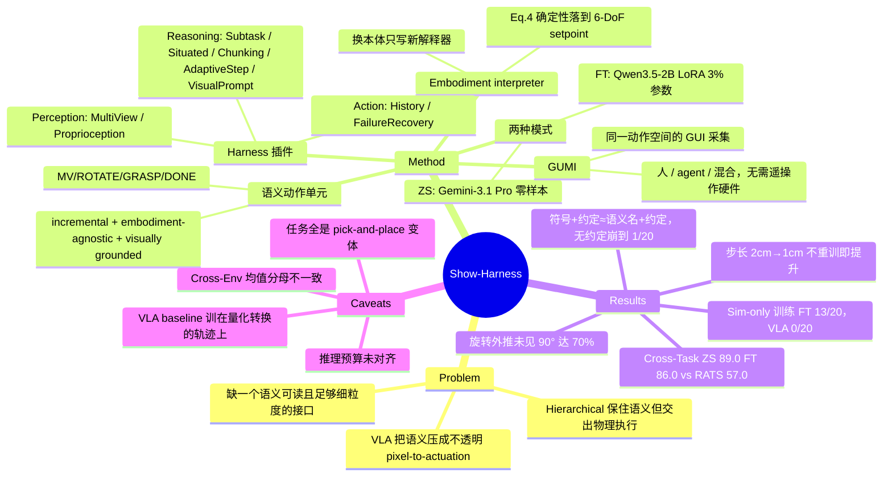

## Summary

Show-Harness 把机器人控制重写成一组离散语义动作单元（`MV_FWD`/`ROTATE_CW`/`GRASP`/`DONE` 等），VLM 每步只选一个单元，再由 embodiment-specific interpreter 确定性地把它落成一小段有界的 6-DoF 位姿更新——语义决策归模型、度量执行归解释器。同一接口既让 frontier VLM 零样本直接控制真机，也让 2B 开源模型用 LoRA 在两小时内学会同一动作空间：十个真机 pick-and-place 任务上 ZS (Gemini-3.1 Pro) 89.0% / FT (Qwen3.5-2B) 86.0%，对照 π₀.₅ 39.0%、GR00T 35.0%、最强 agentic baseline RATS 57.0%。最有信息量的不是主表而是 action-space ablation：把语义名换成任意符号、但保留文字写明的方向约定几乎不掉点（19/20 vs 20/20），去掉约定只留符号则崩到 1/20——真正起作用的是"写明的确定性映射"，而非"名字有语义"。

## Problem & Motivation

现有两条路线各让出一半。VLA 把 VLM 微调成回归 embodiment-specific 连续动作的映射，广义语义知识被压进不透明的 pixel-to-actuation 通路，换任务族或换本体通常要重新采轨迹。Hierarchical 与 code-as-policy 走反方向，让 VLM 只产出 subgoal、keypoint、value map 或对手工 API 的程序调用，语义保住了但物理实现交给下游 controller——模型说了要什么，却看不见它是怎么被实现的，每种中间表示还都绑死在一套精心工程化的 grounding pipeline 上。

作者的判断是问题出在接口层：需要一个对 VLM 语义可读、同时对机器人又足够细粒度以支撑直接控制的动作空间。这个 framing 明确借自数字 agent——computer-use 与 game agent 早就通过鼠标、键盘、手柄这种人与模型共用的紧凑接口工作，导航的 benchmark 里离散方向原语也是原生的；真实世界的 manipulation 恰恰缺一个同等简单、且人和模型都能直接驱动的接口，因为控制通常是 embodiment-specific、高维且要求细粒度空间精度的。

## Method

### 语义动作空间

动作空间 $\mathcal{A}$ 是一组紧凑的语义单元：`MV_FWD`/`MV_BACK`、`MV_LEFT`/`MV_RIGHT`、`MV_UP`/`MV_DOWN` 沿当前参考视角对应方向移动一步；`ROTATE_CW`/`ROTATE_CCW` 各配一个轴（$x$/$y$/$z$）做增量旋转；`GRASP`/`RELEASE` 开合夹爪；`DONE` 表示任务完成。设计围绕三条性质：**incremental**（每个单元只引起一次小的局部物理变化，让 VLM 通过可观察的动作效果留在控制回路里，靠连续修正达到精度）、**interpretable 且 embodiment-agnostic**（动作是符号而非数值目标，低层控制下沉给解释器）、**visually grounded**（方向相对可观测视角定义，空间推理可以直接映射到动作）。

### Embodiment grounding

每个语义决策交给 embodiment-specific 解释器 $g_E$，按 Eq. 4 更新 6-DoF Cartesian 位姿 setpoint：

$$s_{t+1}=\Pi_{E}\!\left(\mathbf{x}_{t}+\sigma_{t}R_{E}d_{a},\;\exp\!\left(\theta_{t}[R_{E}r_{a}]_{\times}\right)Q_{t}\right)$$

$\sigma_t$、$\theta_t$ 是标定过的平移/旋转步长，$R_E$ 把语义方向映射到该本体的运动坐标系，$\Pi_E$ 强制 workspace 与单步限幅（越界动作在执行前被拦下）。不同本体用不同底层控制器实现同一批语义单元——Franka 用阻抗控制跟踪 Cartesian setpoint，AgileX 走 IK 流式关节目标，仿真器发 operational-space 指令。**换本体只需要写一个新解释器，模型面对的接口不变**，这是全文所有 cross-embodiment / 变步长 / 动作组合结论的结构性来源。

### Harness 插件

感知—推理—动作三阶段，每阶段挂可配置插件（Table 1）：

| 阶段 | 插件 | 作用 |
|:--|:--|:--|
| Perception | Multi-View Guidance | 告诉 VLM 各路相机的角色与优先级（全局视角给场景上下文，腕部视角给精对齐证据） |
| | Proprioception | 把夹爪高度、单步位移、contact 与夹爪状态转成文本反馈 |
| Reasoning | Subtask Planning | 维护有序 subtask 计划，完成判据必须视觉可验；子任务推进权归模型 |
| | Situated Planning | 把不确定分支挂起，等证据可观测时再 resolve 并更新剩余计划 |
| | Action Chunking | 目标尚远时降低查询频率，开环执行一小串动作 |
| | Adaptive Step | 远用大步、近用小步 |
| | Visual Prompt | 单独一次模型调用把模糊的语言目标转成视觉标记 |
| Action | Action History | 携带最近动作，抑制来回振荡 |
| | Failure Recovery | 检测空抓，重置夹爪并回滚到对应抓取子任务 |

默认全开，Situated Planning 与 Visual Prompt 按需启用。

### 两种模式与 GUMI

**ZS mode** 直接用 frontier VLM（默认 Gemini-3.1 Pro，medium thinking effort），不微调。**FT mode** 用 Qwen3.5-2B 在同一动作空间上做 token-level 交叉熵微调（Eq. 5），关键在于语义动作**走模型原生词表**，不加 action head 也不加 special token，因此 rank-64 LoRA、约 3% 参数就够；训练时故意只保留最小上下文 $\mathcal{P}_{\min}$（指令 + 多视角观测 + 短动作历史）以便做受控对比。

**GUMI** 是同一语义空间的 GUI 前端：每个单元对应一个按钮和一个键位，人可以用键盘"玩"机器人，computer-use agent 可以操作同一个 GUI，通用 VLM agent 可以直接预测单元。每步记录执行前观测与所选动作，产出 policy-ready 的 $(o_t,a_t)$；因为落地是确定性的，同一条演示还能同时保留底层轨迹，用来训练连续控制策略。不需要专用遥操作硬件，支持远程采集与人机混合（人可中途接管纠正 agent rollout）。

## Key Results

**设置**：7-DoF Franka Research 3（exo + wrist 双视角）与双臂 AgileX（ego + 双腕三视角）。十个真机任务 = 五种物体（block / banana / tennis ball / teddy bear / chess piece）× 两种容器（plate / bowl），teddy 与 chess 对 FT 是 OOD。每任务 10 trials、随机摆放，episode 上限 50 步，超时算失败。训练语料 164 条真机 episode / 7,774 步（Franka 101/4,969，AgileX 63/2,805）+ 230 条仿真 episode / 13,523 步（ManiSkill 100、RoboLab 130），全部 2 cm 步长、全部经 GUMI 采集。

**Table 2 三层泛化**（成功率 %）：

| Setting | π₀.₅ | GR00T | H-VLA | G-VLA | CaP-X | RATS | **ZS** | **FT** |
|:--|--:|--:|--:|--:|--:|--:|--:|--:|
| Cross-Task（10 任务） | 39.0 | 35.0 | 50.0 | 13.0 | 44.0 | 57.0 | **89.0** | **86.0** |
| Cross-Environment | 40.0 | 34.0 | 63.8 | 15.0 | 52.5 | 65.0 | **100.0** | **88.0** |
| Cross-Embodiment | 41.0 | 36.0 | 49.0 | 11.0 | 43.0 | 52.0 | **93.0** | **87.0** |

Cross-Environment 的均值不可直接横比：Sim-to-real 一行只有 π₀.₅（0/20）、GR00T（0/20）和 FT（13/20）有数，ZS 与四个 agentic baseline 都是 "–"。因此 ZS 的 100.0 是 4 类扰动 / 80 trials，FT 的 88.0 是 5 行 / 100 trials，H-VLA 的 63.8 也只覆盖 80 trials。只按共有的四行重算，π₀.₅ 是 50.0、GR00T 是 42.5——被拉低的恰好是唯二真跑了 sim-to-real 的两个 baseline。**"ZS 100 vs FT 88"和"π₀.₅ 40 < CaP-X 52.5"两个读法都是分母假象**；真正干净的结论是 sim-only 训练下 FT 13/20 而两个 VLA 全灭。

**物理适应性**（Sec. 5.3.1，均不重训）：

- *变步长*：解释器步长 2 cm → 1 cm，block stacking 与 peg insertion 上 ZS 60%→82%、FT 40%→65%；π₀.₅ 用同样演示只有 18%，补了 fine-grained 训练才到 62%。⚠️ Figure 6 的柱标读作 ZS 60→80、π₀.₅ 15→60，与正文不一致（见 Ledger C5）。
- *动作组合*：五个 Plate 任务上把两个正交平移合成一次对角位移，Fig. 6 标注步数降 26%（ZS）/ 24%（FT），成功率无明显下降。
- *旋转外推*：胡萝卜抓取，每个旋转单元转 15°；FT 只见过 0° 与 45°，在未见的 90° 上仍有 70%，π₀.₅ 为 20%。
- *workspace 平移*：从核心 25%（S@1）扩到贴边 90%（S@3），Show-Harness 只轻微退化，π₀.₅ 急剧下跌。
- *双臂协同*：AgileX 上 tidy the table 与 pass the banana 各 20 trials，联合预测双臂动作 vs 两个独立单臂 agent——tidy 70%(1 次碰撞)→90%(0)，pass banana 30%(3)→70%(0)。

**语义适应性**（Sec. 5.3.2）：三杯藏块 + 字母排 "SHOW" 两个需要先推理再操作的任务上，ZS 开 Situated Planning 达 85%，FT 与 π₀.₅ 单独只有 10% 和 0%；喂同一份 Gemini 生成的 subtask 指令后 FT 升到 70%，π₀.₅ 仍停在 5%。视频 in-context：只给 "tidy up" 指令时 ZS 只有 20%（顺序未指定），给一段人或机器人演示后 ZS 20/20，FT 正文称 95%（⚠️ Fig. 6 两根 FT 柱都标 90，见 Ledger C8）。

**Ablations**：

- *前沿模型与 thinking effort*（Fig. 7）：零样本表现大体随底座能力上升；加大 thinking effort 主要是减少冗余交互步数，成功率增益很小，代价可观（GPT-5.6-sol 达 3.4× wall-clock）。所有模型 >98% 的回复都能产出合法动作单元；错误集中在精细抓取与放置而非规划，给出目标 bbox 还能继续提升。
- *backbone scaling*（Fig. 8）：2B 已经很强，更大模型主要帮 stacking / peg insertion 这类精细任务；1B 级别在目标附近反复微调导致 episode 变长；tennis ball 上小模型反而更好（及时纠正移动物体比绝对精度更重要）。
- *插件 leave-one-out*（Fig. 9，Franka + Gemini-3.1 Pro，五个 Plate 任务）：去 Subtask Planning → 60%（模型常拖着物体走而不抬起）；关 Action Chunking 仍有 96% 但模型调用变多，全程强制 chunk 掉到 74%；Adaptive Step 默认配置 96% / 平均 30 步；去 Failure Recovery → 72%（主要失效模式是未检出的空抓）。另外两个按需插件在专项场景上（各 20 trials）：Visual Prompt 把 handle-aware grasping 从 40% 提到 85%，Situated Planning 把藏物搜索从 35% 提到 85%，且都在常规任务上无增益——支持其默认关闭的设计。
- *动作空间表示*（Fig. 10，2×2）：(A) 语义名 + 文字约定（默认）20/20；(B) 只有语义名 18/20，可用但效率下降；(C) 任意符号 + 约定 19/20，几乎追平默认；(D) 只有任意符号 1/20，且模型自行探测推断出的映射只有 23.3% 正确。结论是约定提供了绝大部分 grounding，语义名主要起先验作用。

## Evidence Ledger

| Claim ID | Claim | Type | Source locator | Evidence excerpt | Status |
|:--|:--|:--|:--|:--|:--|
| C1 | Cross-Task 均值：ZS 89.0 / FT 86.0 / RATS 57.0 / H-VLA 50.0 / CaP-X 44.0 / π₀.₅ 39.0 / GR00T 35.0 / G-VLA 13.0 | number | Table 2, Cross-Task "Average (%)", p.11 | "Average (%) 39.0 35.0 50.0 13.0 44.0 57.0 89.0 86.0" | source-verified |
| C2 | Cross-Environment 均值分母不一致：ZS 100.0 覆盖 4 行 / 80 trials，FT 88.0 覆盖 5 行 / 100 trials；只有 π₀.₅、GR00T 有 sim-to-real 行 | benchmark-setting | Table 2, Cross-Environment block, p.11 | "Sim-to-real 0 / 20 0 / 20 – – – – – 13 / 20 … Average (%) 40.0 34.0 63.8 15.0 52.5 65.0 100.0 88.0" | source-verified |
| C3 | 按共有四行重算 π₀.₅ = 50.0、GR00T = 42.5，而非表中 40.0 / 34.0 | number | Table 2 逐格重算（11+9+10+10=40/80；10+9+7+8=34/80） | 由 C2 表格数值直接推出 | source-verified |
| C4 | Cross-Embodiment：ZS Franka 48/50、AgileX 45/50（93.0）；FT 45/50、42/50（87.0）；RATS 52.0 | number | Table 2, Cross-Embodiment block, p.11 | "Franka … 48 / 50 45 / 50; AgileX … 45 / 50 42 / 50; Average (%) … 52.0 93.0 87.0" | source-verified |
| C5 | 步长 2 cm→1 cm 不重训：ZS 60%→82%、FT 40%→65%、π₀.₅ 18%（补训后 62%） | number | Sec 5.3.1, p.12（正文）vs Figure 6 "Fine-grained Control", p.12 | "This improves ZS from 60% to 82% and FT from 40% to 65%. In contrast, π0.5 achieves only 18%" | **contradicted**（论文内部不一致：Fig. 6 柱标为 ZS 60→80、π₀.₅ 15→60；仅 FT 40→65 两处一致。引用时须并列两个来源） |
| C6 | 旋转外推：单元 15°，FT 在未见 90° 达 70%，π₀.₅ 20%，训练只含 0°/45° | number | Sec 5.3.1 "Rotation extrapolation", p.12（Fig. 6 一致） | "FT reaches 70% at the unseen 90◦ orientation … π0.5 reaches 20%" | source-verified |
| C7 | 推理密集任务：ZS+Situated Planning 85%，FT 10%、π₀.₅ 0%；给同一 subtask 指令后 FT 70%、π₀.₅ 5% | number | Sec 5.3.2, p.13（Fig. 6 一致） | "ZS with Situated Planning achieves 85%, while FT and π0.5 alone reach only 10% and 0%" | source-verified |
| C8 | 视频 in-context：ZS 无演示 20%、有演示 20/20；FT 95% | number | Sec 5.3.2, p.13（正文）vs Figure 6 "In-context Learning", p.12 | "ZS … succeeds in 20/20 trials from either source, while FT reaches 95%" | **contradicted**（ZS 部分文图一致；"FT 95%" 仅见正文，Fig. 6 两根 FT 柱均标 90） |
| C9 | 微调成本：rank-64 LoRA、约 3% 参数、40 epochs / 7.9K 单臂样本、单卡 H200 <2 小时 | number | Sec 5.1, p.10 + Appendix 7.1, p.25 | "updating only about 3% of parameters"; "less than 2 hours on a single H200" | source-verified |
| C10 | 语料：真机 164 ep / 7,774 步（Franka 101/4,969；AgileX 63/2,805），仿真 230 ep / 13,523 步；统一 2 cm 步长 | number | Table 3 + Sec 7.2, p.25 | "total 19 164 8.6 7774 47.4"; "All real-robot episodes are recorded … with the same 2 cm translation step size" | source-verified |
| C11 | 动作空间表示：(D) 任意符号无约定 1/20 且推断映射仅 23.3% 正确；(C) 符号+约定几乎追平 (A) | causal-mechanism | Sec 5.4.4 + Figure 10, p.16 | "Setting (D) succeeds in only 1/20 episodes with only 23.3% of inferred mappings correct" | source-verified |
| C12 | 插件消融：无 Subtask Planning 60%；强制 chunk 74%；Adaptive Step 96% / 30 步；无 Failure Recovery 72%；Visual Prompt 40→85；Situated Planning 35→85 | number | Sec 5.4.3 + Figure 9, p.15（专项场景 20 trials，p.14） | "Without planning, success drops to 60%"; "reduces success to 72%" | source-verified |
| C13 | thinking effort 主要减步数而非提成功率，GPT-5.6-sol 达 3.4× wall-clock；>98% 回复产出合法动作单元 | number | Sec 5.4.1, p.14 | "little gain in success and can incur higher wall-clock cost (e.g., 3.4× for GPT-5.6-sol)" | source-verified |
| C14 | π₀.₅ 与 GR00T 在"由同一批演示转换出的连续末端轨迹"上微调 | benchmark-setting | Sec 5.1 "Baselines", p.10 | "both are fine-tuned on continuous end-effector trajectories converted from the same demonstrations used to train our VLM policy" | source-verified |
| C15 | 评测协议：每任务 10 trials、随机摆放、50 步上限、超时算失败 | benchmark-setting | Sec 5.1 "Tasks and metrics", p.10 | "10 trials per task with randomized object placements. Episodes are capped at 50 steps, with timeouts counted as failures" | source-verified |
| C16 | sim-to-real 设置下可训练方法只用 GUMI 采的仿真演示，在真 Franka 上评测 | benchmark-setting | Sec 5.2, p.10 | "trainable methods use only simulated demonstrations collected through the same GUMI interface and are evaluated on the real Franka" | source-verified |
| C17 | 代码 / 模型 / 数据集已释出（项目页 + HF 语料） | license-code | Title page, p.1 + Sec 7.2, p.25 | "Website [Code & Model & Dataset] : https://showlab.github.io/Show-Harness"; "released at https://huggingface.co/showlab/Show-Harness-Data" | source-verified |
| C18 | 双臂联合预测 vs 独立单臂：tidy 70%(1)→90%(0)，pass banana 30%(3)→70%(0) | number | Sec 5.3.1 "Multi-arm coordination", p.13 + Fig. 6, p.12 | "Joint decision making substantially improves success on both tasks while eliminating collisions" | source-verified |
| C19 | 局限自述：只在单/双臂平行夹爪上评测；humanoid、灵巧手、tactile/force 反馈留作 future work | causal-mechanism | Sec 6, p.16 | "evaluated primarily on single- and dual-arm manipulation with parallel-jaw grippers" | source-verified |

> 19 条高风险 claim 中 17 条 source-verified，2 条（C5、C8）因论文正文与自家 Figure 6 数值冲突判为 contradicted，正文已并列两个来源。source-verified 仅表示原文确实这么写，不表示结果已被独立复现。

## Strengths & Weaknesses

**最有价值的是 action-space ablation，而不是主表。** 大多数"接口论文"只能论证"我的接口好用"，Fig. 10 的 2×2 却把功劳定位到了具体成分上：任意符号 + 文字约定（19/20）几乎追平语义名 + 约定（20/20），而只给符号不给约定崩到 1/20、自主探测出的映射只有 23.3% 正确。这个结果反过来削弱了论文自己的 framing——起作用的不是"VLM 天然理解的语义"，而是"一份写明 token→物理效果的确定性说明书"。这条读法对 GUI agent 同样成立：与其纠结动作名是否自然，不如把每个可用操作的效果显式写进上下文。是全文最可迁移的一条。

**把"语义决策"和"度量执行"拆开，确实买到了 VLA 结构上买不到的东西。** 测试期把步长从 2 cm 改到 1 cm、把两个正交平移合成对角位移、把 15° 单元叠到未见的 90°——全都只改解释器，模型一行不重训。π₀.₅ 在同数据下只有 18%、要补 fine-grained 训练才到 62%（C5，注意文图不一致），对比很干净。sim-only 训练下 FT 13/20 而 π₀.₅ / GR00T 全灭，也是同一机制的推论：语义单元对渲染器不变，连续轨迹不是。

**但演示数据的转换方式是主对比最大的隐患。** 所有演示都是通过 GUMI 在 2 cm 量化的语义空间里采的（键盘或 frontier-VLM rollout），π₀.₅ 与 GR00T 训练用的连续轨迹是**从这些量化动作序列转换回去的**（C14）。这意味着 VLA baseline 拿到的是阶梯状、非人类遥操作节律的轨迹——恰好是它们分布外的那种数据。作者把这称作 "controlled comparison"，但受控的是数据内容，不是数据形态，而形态正是 VLA 依赖的东西。论文没有跑"真·遥操作演示训 VLA vs GUMI 演示训 Show-Harness"这一组，所以主表里 39.0 vs 89.0 的差距有多少来自范式、多少来自数据格式不对口，目前无法拆开。这是我对本文最主要的保留。

**成本没有对齐。** ZS 每一步都调一次 Gemini-3.1 Pro（medium thinking effort，episode 上限 50 步），π₀.₅ 是控制频率上的单次前向。论文报了 steps/episode 和一处 3.4× wall-clock，但没有对 VLA baseline 给出每 episode 的延迟或 API 成本，于是"outperforming representative VLA paradigms"掩掉了量级差的推理预算。2 cm 步长也意味着这是准静态运动；最接近动态的 tennis ball 恰好是 ZS 最弱的两列（8/10、7/10），提示范式的边界可能就在需要连续速度调制的地方。

**任务族偏窄，"cross-task"名不副实。** 十个任务是 5 物体 × 2 容器的 pick-and-place 变体，所谓跨任务泛化是换物体—容器组合，不是换任务结构。而离散 ±xyz + 绕轴旋转的词表能否表达 wiping、pouring、compliant insertion 这类需要力调制或连续速度的行为，本身就存疑——论文的 limitation 只提到 humanoid 与灵巧手（C19），没有正面承认动作词表的表达力边界。

**统计强度弱，且 ZS 结果不可复现。** 每任务 10 trials，多数子实验 20 trials，无 error bar、无重复 run；Cross-Task 上 ZS 89 vs FT 86 在 n=100 下完全落在噪声里，插件消融里 96% vs 96% 这类差异更是个位数计数。ZS 一支绑在闭源 API 上，Fig. 7 自己显示表现随底座能力漂移，意味着这些数字随时间不可重放。

**GUMI 的评估欠账。** 作为独立贡献它没有被测量：没有与常规遥操作的采集吞吐对比，没有数据质量对比，也没有回答"2 cm 量化是否损害了下游连续策略"——而这恰恰是上面那条数据形态隐患的另一面。

**领域位置。** 与 [[2608-Zetta]] 放在一起看很有意思：两者都叫 embodied harness、都主张"不动权重、改 harness"，但 Zetta 把 VLA 当被编排的执行器、在 action chunk 层做 critic 与 recovery，Show-Harness 干脆取消了 VLA，让 VLM 自己承担每一步物理决策。两条路线对"VLM 能否直接负责细粒度物理决策"给出了相反的赌注，值得追踪谁先撞墙。

## Mind Map

## Notes

- **最想追的一条**：Fig. 10 的结论若成立，"约定文本"本身就是一个可优化对象——能不能把 convention 当成可学习/可搜索的对象，让 agent 在少量交互里自己写出比人写的更好的动作说明书？设定 (D) 里模型自主探测只得到 23.3% 正确映射，说明纯 trial-and-error 推断很弱，但那是零先验、无结构探索。介于 (C) 和 (D) 之间的"给少量约定 + 允许主动探测补全"是个空白点。
- **需要验证的怀疑**：VLA baseline 的轨迹是从 2 cm 量化动作转换而来（C14）。想知道 π₀.₅ 在同一批任务上、用常规遥操作采的等量演示训练能到多少。如果差距大幅收窄，主表的解读要改写。项目已放出数据（C17），这件事是可查的——值得挂一轮 `repo-digest` 看采集与转换代码。
- **与 GUI 的连线**：论文自己承认动作空间设计借自 computer-use / game agent。反向迁移的那条更值钱：GUI agent 的 action space 长期在"高层语义动作 vs 低层坐标点击"之间摇摆，Fig. 10 提示决定性因素可能是**动作效果是否被显式写明且确定性可复现**，而不是抽象层级本身。可以在 [[Topics/CUA-Survey]] 里作为 interface-design 的一条外部证据。
- **未解**：workspace shift 的具体数值只在 Fig. 6 的柱图里，正文只给定性描述；此处未采信任何精确数字。
- 相关笔记：[[2608-Zetta]]（另一种 embodied harness，编排 VLA 而非取消它）、[[2504-Pi05]] / [[2503-GR00TN1]]（被对比的 VLA baseline）、[[2307-VoxPoser]]（code-as-policy 前身）、[[2510-GeminiRobotics15]]（VLA + embodied reasoning 的混合路线）、[[2609-HarnessDev]]（把 harness 本身当评测对象，数字域）。
