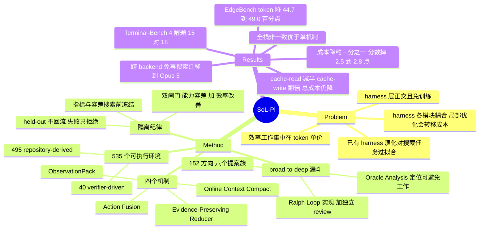

## Summary

SoL-Pi 把 RSI 式的 auto-research 放到 harness 层：研究 agent 读 base harness（Pi）的执行轨迹，在 535 个可执行环境上提出并筛掉 152 个方向，用「能力指标全部落在预先声明的容差内 + 至少一项效率指标改善」的双门留下四个机制——Action Fusion、Online Context Compact、ObservationPack、Evidence-Preserving Reducer。在 EdgeBench 的 51 个公开任务上，四机制全栈相对 Pi 把 recorded token traffic 降 44.7–49.0%、API 成本降约三分之一，代价是平均分掉 2.5–2.8 点。该 harness 只在 GPT-5.6 Sol 的轨迹上开发，不做任何再搜索直接换到 Opus 5，效率增益仍然成立。

## Problem & Motivation

现有的 LLM 效率工作几乎都在压单 token 的价格：attention kernel 与 serving 基建（FlashAttention-2、PagedAttention）、量化（SmoothQuant、GPTQ）、路由到更便宜的模型（FrugalGPT、RouteLLM）。作者选了正交的一层——harness，即模型与环境之间负责呈现状态、暴露动作、处理反馈的那段代码。改 harness 不需要再训练模型，因此可以和模型层、基建层的优化叠加。

难点是 harness 的各部分互相耦合：tool use、context 管理、验证、委派、恢复、终止牵一发动全身，一处局部变好可能把 token 成本推迟到后面的阶段，或者直接让下游失败。人工做法是读长轨迹、找反复出现的浪费、翻译成代码改动，成本高且不随任务和环境数量扩展。

已有的自动化尝试各有切口：Meta-Harness 搜可执行的 harness 程序并在任务性能与 context 成本上维护 Pareto 前沿，RHI 逐任务改 agent loop 的 prompt 级规格，AutoHarness 合成环境特定的 code guard。但 Wang et al.（arXiv:2607.12227）用 held-out 任务测出一个反例：演化出的 harness 会对搜索时用的任务过拟合，在未见任务上增益很小。SoL-Pi 接的就是这个反例，把「搜索反馈」与「最终评测」的隔离当成设计前提，而不是事后检查。

## Method

### 搜索管线：broad-to-deep 漏斗

外层负责广度，内层负责深度。外层从六个提案族（context、progress、tools、delegation、prompt and policy、improvement and evaluation）起手，共 152 个方向；在分配 rollout 预算之前先做 Oracle Analysis，从已有开发轨迹里定位 base harness 里可避免的工作量，每个入选方向必须指认一处具体的开销来源并给出对应的 harness 改动。内层把每个方向跑成一条独立的 autoresearch 循环：提案 → 实现 → 固定实验 → 检查结果 → 保留/修订/丢弃，并在实现环节加了一层基于 Ralph Loop 的迭代——实现者按显式的完成判据打磨候选，再由独立 reviewer 过一遍，审查不过就返工。每轮的多条探索轨迹由若干独立 analyzer 各看一条（分别盯重复动作、context 增长、大 observation、稀疏诊断信号），再由 reducer 汇成候选级摘要喂给下一次提案。

每条搜索线是一个共享 skill 模板的一次性实例：拷模板、设参数、跑完，只留候选和证据，改过的编排代码全部丢弃。广度靠多开隔离的循环得到，深度靠单条循环内的反复打磨。作者明确写了这些计数只描述搜索规模，不构成 scaling law。

### 隔离纪律

实验开始前就固定能力指标、可接受容差与效率指标，且这些指标脱离被优化 agent 的控制，防止它去够验收条件。候选筛选是两道顺序闸门：每项能力指标必须落在预声明容差内，且至少改善一项已声明的效率指标；两门都过的候选里保留在声明指标下的非支配解。EdgeBench 留给最终验证，评测前冻结 harness 与验收规则，held-out 结果绝不回流到搜索——验证失败只导致候选被拒，不会触发进一步优化。

### 搜索环境

搜索集共 535 个可执行环境，分两族。repository-derived 的 495 个由 GitHub issue–pull request 对构造：每个环境把 issue 与修复前的仓库状态和离线依赖配在一起，用被接受的 patch 与变更历史当参考轨迹，PR 与回归测试对 agent 隐藏，只保留「打补丁前测试失败、打完通过」的环境。verifier-driven 的 40 个反过来做：先生成定义成功的可执行 verifier，再围绕它构造任务，多数用 Terminal-Bench-2 风格的 verifier 接口，好处是允许多条有效解法、不需要参考轨迹。

### 四个留下来的机制

**Action Fusion** 针对 base Pi 常见的「改完文件再单独发一条命令去测/编译/运行」模式，把 mutation 与后续命令合成一次 tool 请求、在同一个 observation 里返回两者结果，省掉一次模型往返（API 调用从三次降到两次）。需要先看 mutation 结果才能决定的命令不合并。

**Online Context Compact** 把压缩时机挂到 plan step 的完成边界上。agent 通过 `update_plan` 维护计划，harness 在每个完成边界用「已完成步之间观察到的请求数」和「未完成步数」估计剩余模型请求数，再用「按当前增长率填满 context window 还能发多少请求」给这个估计封顶。成本闸门比较预计节省的 input 与重写 prompt cache 的额外开销；后续压缩还要摊还此前未回收的重写成本，因此要求更大的节省余量。闸门通过、或 context 用量逼近窗口上限且压缩确实能缩短 context 时，调用 Pi 原生的 compaction。

**ObservationPack** 处理「大 tool 输出在后续请求里反复重发、而其中大部分内容早已不相关」。超过 10 KiB 的结果在本地归档，接下来两次 provider 请求仍完整发送，从第三次起换成稳定 handle、原始大小和一段完整首尾行的短摘录（约 1 KB），agent 需要时可通过 handle 取回精确分页。小结果不动。

**Evidence-Preserving Reducer** 只压预定义命令集产生的、至少 4 KiB 的 build 与 test 日志，文件读取和搜索结果绕过它。harness 归档精确输出，请一个更便宜的模型（GPT-5.6 Luna at high）把关键证据抽成紧凑 receipt，再由确定性 verifier 检查 receipt 的 schema、source hash、退出状态、精确引文与体积；验证失败、疑似含凭据、或 receipt 没能减小体积时回落到原始日志。reducer 在 ObservationPack 投影 context 之前处理 tool 结果，ObservationPack 认得 reducer 的 receipt 标记并跳过这些结果，以保住已验证的证据。辅助模型只负责抽证据，诊断与动作选择仍归主 agent。

四者作用在 agent 工作流的不同位置：编辑代码时是 Action Fusion，环境返回输出时是 Evidence-Preserving Reducer 与 ObservationPack，完成 plan step 时是 Online Context Compact。

## Key Results

### EdgeBench（51 个公开任务，GPT-5.6 Sol 为搜索 backend）

| Harness | Total tokens (B) | Token cost ($) | Avg. score | $/score |
|:--|--:|--:|--:|--:|
| Codex | 3.0537 | 1,787 | 34.74 | 1.0086 |
| OpenSquilla | 1.3353 | 1,243 | 24.51 | 0.9945 |
| Oh-My-Pi | 2.2235 | 1,832 | 26.92 | 1.3347 |
| OpenCode | 2.5668 | 3,422 | 29.55 | 2.2704 |
| Oh-My-Opencode | 2.5825 | 2,678 | 38.52 | 1.3633 |
| Pi（base harness） | 2.1538 | 1,339 | 44.83 | 0.5855 |
| SoL-Pi [Efficiency]（四机制全栈） | 1.0990 | 894 | 42.00 | 0.4174 |
| SoL-Pi [Performance]（= +ObservationPack） | 2.0224 | 1,271 | 47.21 | 0.5280 |

Efficiency 点相对 Pi 少用 49.0% 的 token、成本低 33.2%，保住 Pi 平均分的 93.7%。所有成本按 2026-08-17 的 API 价格折算。EdgeBench 官方 GPT-5.5 @2h 的 31.2 是未排名的仅分数参照。

### 跨 backend 迁移（Opus 5，未做任何再搜索或适配）

| Harness | Total tokens (B) | Token cost ($) | Avg. score | $/score |
|:--|--:|--:|--:|--:|
| Claude Code | 2.0045 | 2,535 | 43.69 | 1.1377 |
| Pi | 2.3697 | 1,741 | 44.76 | 0.7625 |
| SoL-Pi [Efficiency] | 1.3101 | 1,158 | 42.22 | 0.5376 |
| SoL-Pi [Performance]（= +Action Fusion） | 2.1016 | 1,605 | 50.48 | 0.6235 |

在 Opus 5 上保住 Pi 平均分的 94.3%，token traffic 降 44.7%、成本降 33.5%。机制的 trigger rate 与 trigger intensity 在 Opus 5 上都更低，作者归因于 harness 只在 GPT-5.6 Sol 轨迹上优化过；但每一种配置在其被触发的任务子集上仍改善 token efficiency。

摘要另给出按小时算的节省：对 native Codex 与 Claude Code 是 \$8.75–\$13.50，对 Pi 是 \$4.36–\$5.71。这个数在全文只出现在摘要一处，正文、表格与图注都没有给出折算口径（单任务时长、并发假设）——**证据边界：该数字的推导过程不可核查**。按 51 个任务、每任务 2 小时预算反推，四个值与表中的成本差完全吻合（\$1,787 − \$894 = \$893，\$893 / 51 / 2 ≈ \$8.75），但这是笔记作者的反推，不是论文写出来的。

### 单机制消融（Table 4）

| 配置 | GPT-5.6 Sol：tokens (B) / cost ($) / score | Opus 5：tokens (B) / cost ($) / score |
|:--|:--|:--|
| Pi baseline | 2.1538 / 1,339 / 44.83 | 2.3697 / 1,741 / 44.76 |
| + Action Fusion | 1.8968 / 1,235 / 46.66 | 2.1016 / 1,605 / **50.48** |
| + Online Context Compact | 1.2881 / 935 / 41.99 | 1.9152 / 1,537 / 49.16 |
| + Evidence-Preserving Reducer | 1.9375 / 1,200 / 44.63 | 1.9131 / 1,456 / 43.41 |
| + ObservationPack | 2.0224 / 1,271 / **47.21** | 1.4418 / 1,176 / 47.05 |
| SoL-Pi [Efficiency]（全栈） | **1.0990 / 894** / 42.00 | **1.3101 / 1,158** / 42.22 |

每个组件在两个 backend 上都减少总 token 数，全栈在两边都拿到最低 token 数与最低成本。但全栈并非一致占优：Opus 5 上单加 ObservationPack 是 \$1,176 / 47.05，全栈是 \$1,158 / 42.22——成本几乎打平，分数低 4.8 点；GPT-5.6 Sol 上单加 Online Context Compact 是 \$935 / 41.99，全栈 \$894 / 42.00，多出的三个机制只额外买到约 4% 的成本。作者在 Figure 7 自己注明这些比较是描述性的、各配置用自己的 triggered-task 子集，无法分离交互效应。

### cache 账本

GPT-5.6 Sol 上全栈把 cache-read 从 2.1326B 压到 1.0605B，cache-write 从 0.0141B 升到 0.0316B，总成本仍从 \$1,339 降到 \$894。这条说明只盯 prefix cache 复用率会做出错误决策——cached input 本身也要付费，保住长前缀不一定是整任务最便宜的选择。

### 其他 benchmark

Terminal-Bench 4（63 个纯 CPU 任务）：Codex 与 Pi 各解 18 题，SoL-Pi 解 15 题；总成本 \$211.12 vs Pi 的 \$286.45（−26.3%），单解题成本 \$14.07 vs \$15.91（−11.6%）。GPU 相关任务因基建限制被排除。

IMO 2026（6 题，解答须用 Lean 4 形式化并验证，GPT-5.6 Sol xhigh，每题 150 分钟上限）：SoL-Pi 过 3 题、总成本 \$62.69、单过题成本 \$20.90；Codex 过 5 题、\$22.89；Pi 过 3 题、\$25.32。

Agent swarm（kernel optimization，按模拟机器周期计，起点 147,734 cycles，每种配置各跑一次两小时）：SoL-Pi swarm（20 workers）到 1,127 cycles / \$60.11，Pi baseline swarm 到 1,366 cycles / \$82.12，单个 Codex agent 到 1,333 cycles / \$39.20。相对 Pi swarm 省 26.8% 成本，但单 agent 仍是最便宜的一档。SoL-Pi swarm 与单 agent 过全部 8 条速度门槛，Pi swarm 过 7 条，卡在「少于 1,363 cycles」那条。

### Action Fusion 的谱系（案例研究）

从机会到留用共 27 次记录迭代，分四阶段：oracle analysis、baseline construction、prompt 与 tool-schema 优化、held-out 验证。oracle analysis 统计相邻动作的组合模式，预测全量触发下可减 11.5% token，据此单开一条谱系。baseline 阶段发现只靠 prompt 触发不可靠，于是扩展 tool schema 把融合动作直接暴露出来，才拿到零非法调用的稳定基线；随后在开发任务上同时用 trigger rate 与任务分数当中间验收指标。作者把「agent 自己引入 trigger rate 这个中间指标」当成 auto-research 能自造机制特定度量的证据。

## Evidence Ledger

| Claim ID | Claim | Type | Source locator | Evidence excerpt | Status |
|:--|:--|:--|:--|:--|:--|
| C1 | 全栈相对 Pi 把 recorded token traffic 降 44.7–49.0%（GPT-5.6 Sol 49.0%，Opus 5 44.7%） | number | Abstract; §3.1 | "reducing recorded token traffic by 44.7–49.0% and API cost by about one third" | source-verified |
| C2 | 成本相对 Pi 降 33.2%（\$894 vs \$1,339）与 33.5%（\$1,158 vs \$1,741） | number | §3.1; Table 1–2 | "Its token cost is 33.2% lower than Pi's" | source-verified |
| C3 | 分数保住 Pi 的 93.7%（42.0 vs 44.8）与 94.3%（42.2 vs 44.8） | number | §3.1 | "retaining 93.7% of Pi's average score (42.0 vs. 44.8)" | source-verified |
| C4 | 每小时节省 \$8.75–\$13.50（对 native harness）与 \$4.36–\$5.71（对 Pi） | number | Abstract | "estimated hourly savings are \$8.75–\$13.50 ... and \$4.36–\$5.71 relative to Pi" | abstract-only |
| C5 | EdgeBench 开源 134 题中的 51 题；51 题中 11 题用于冻结候选的单向验收，40 题留作最终泛化评测 | benchmark-setting | §2.5; §3.1 | "Of EdgeBench's 51 public tasks, 11 are used for one-way acceptance" | source-verified |
| C6 | 搜索覆盖 152 个方向、535 个可执行环境（495 repo + 40 verifier），3,000+ 次运行、60,000+ 次交互 | number | §1; §2.2; §2.3 | "search set comprises 535 executable environments: 495 ... and 40 synthetic" | source-verified |
| C7 | Terminal-Bench 4（63 CPU-only）SoL-Pi 解 15 题、Codex 与 Pi 各 18 题；单解题成本 \$14.07 vs \$15.91 | comparison | §3.2; Table 3 | "Codex and Pi each solve 18 tasks, while SoL-Pi solves 15" | source-verified |
| C8 | IMO 2026 SoL-Pi 过 3/6 且单过题成本最低 \$20.90；Codex 过 5/6 \$22.89；Pi 过 3/6 \$25.32 | comparison | §3.2; Table 3 | "lowest cost per passed problem (\$20.90), compared with \$22.89 for Codex and \$25.32 for Pi" | source-verified |
| C9 | SoL-Pi [Performance] 是按 backend 从 Table 4 选出的单机制配置：GPT-5.6 Sol 取 ObservationPack，Opus 5 取 Action Fusion | number | §3.1; Table 2 caption; Table 4 | "ObservationPack for GPT-5.6 Sol and Action Fusion for Opus 5" | source-verified |
| C10 | 全栈非一致占优：Opus 5 上单加 ObservationPack 为 \$1,176 / 47.047，全栈为 \$1,158 / 42.224 | comparison | Table 4 | "+ ObservationPack ... 1,176 ... 47.047" vs "SoL-Pi [Efficiency] ... 1,158 ... 42.224" | source-verified |
| C11 | harness 只用 GPT-5.6 Sol 轨迹开发，换到 Opus 5 未做再搜索或适配；作者称之为迁移的初步证据 | causal-mechanism | §3.1; §3.4; §5.1 | "apply SoL-Pi, developed with GPT-5.6 Sol, to Opus 5 without further search or adaptation" | source-verified |
| C12 | swarm 实验每配置各跑一次两小时：SoL-Pi 1,127 cycles / \$60.11，Pi swarm 1,366 / \$82.12，单 agent 1,333 / \$39.20 | number | §3.3; Figure 5 | "SoL-Pi swarm reaches 1,127 cycles at \$60.11 ... 1,366 cycles at \$82.12 for the Pi baseline swarm" | source-verified |
| C13 | 机制阈值：ObservationPack 归档 >10 KiB 结果、前两次请求仍全发；Reducer 处理 ≥4 KiB 的 build/test 日志，辅助模型为 GPT-5.6 Luna at high | number | §2.4; §2.5; Figure 4 | "archives results exceeding the threshold (10 KiB)"; "logs of at least 4 KiB" | source-verified |
| C14 | 代码在 github.com/NVlabs/SoL-Pi，项目页在 nvlabs.github.io/SoL-Pi | license-code | 标题块 / Links | "Code https://github.com/NVlabs/SoL-Pi" | source-verified |
| C15 | 作者机构为 NVIDIA、NTU、MIT；arXiv 提交日期 2026-09-17 | number | 标题块; arXiv submission history | "NVIDIA NTU MIT" / "[v1] Thu, 17 Sep 2026 14:58:29 UTC" | unsupported |
| C16 | GPT-5.6 Sol 上 cache-read 从 2.1326B 降到 1.0605B、cache-write 从 0.0141B 升到 0.0316B，总成本仍从 \$1,339 降到 \$894；价格口径为 2026-08-17 | number | §3.4; Table 1 note | "reduces cache-read traffic from 2.1326 B to 1.0605 B tokens ... total model cost falls from \$1,339 to \$894" | source-verified |
| C17 | Action Fusion 谱系记录 27 次迭代、分四阶段；oracle analysis 预测全量触发下减 11.5% token | number | §3.5; Figure 8 | "lineage spans 27 iterations across four stages"; "project an 11.5% token reduction under full triggering" | source-verified |
| C18 | 结论节称最佳候选提升性能 5.3–12.8%、提升 token efficiency 9.8–18.2% | comparison | §5 Conclusion | "best-performing candidates improve model performance by 5.3–12.8% and token efficiency by 9.8–18.2%" | source-verified |
| C19 | 全文未报方差、误差棒或多 seed 结果，并把 Pi 的对照值称为 point estimates | benchmark-setting | §3.1; 全文扫描 | "relative to Pi's point estimates" | source-verified |

C4 的修正说明：数字本身与摘要一致，但 "hourly" 一词在全文只出现这一次，正文、表格、图注均无折算口径，因此无法在正文层核查。

C15 的修正说明：提交日期 2026-09-17 已核实；原文只印缩写 "NTU"，从未展开全称，笔记中的 `institute` 字段因此保留缩写，不写成 Nanyang Technological University。

## Strengths & Weaknesses

搜索与评测的隔离是这篇最扎实的部分，也是它区别于本库其他 harness 演化工作的地方。指标、容差与验收规则在实验开始前固定并脱离被优化 agent 的控制；held-out 结果只用于单向拒绝，失败不触发再优化。这正好回应了 [[2609-HarnessDev]] 测出的那个硬问题——可见反馈与 held-out 分数的同向率只有 53.1%，9 条 lineage 里只有 2 条 declare 出 held-out 最优版本。SoL-Pi 用流程把「按可见反馈选版本」这一步从关键路径上拿掉了。

产物形态也值得单独记一笔。留下来的不是一个演化到看不懂的 harness 二进制，而是四段可以单独读、单独移植的机制代码，每一段都对应一个能说清楚的浪费来源。这比「一个在某模型上恰好更优的配置」更接近可复用的知识。cache 账本那一条同理：cache-read 降一半、cache-write 翻一倍、总成本仍降三分之一，这个反直觉的方向本身就是可以直接拿走用的结论。

但「performance comparable to Pi」这个说法在 EdgeBench 之外撑不住。EdgeBench 上掉 2.5–2.8 点（相对 6%）尚可称持平，Terminal-Bench 4 上是 15 题对 18 题，相对少解 16.7%。论文报的是「单解题成本更低」，而这个指标在分母变小时是可以变好的——少解 3 题同时少花 \$75，人均成本自然下来。IMO 那组更明显：Codex 过 5 题，SoL-Pi 与 Pi 都只过 3 题，SoL-Pi 赢的是单过题成本而非能力。也就是说，能力容差闸门约束的是搜索环境上的聚合指标，一旦换到分布外的 benchmark，逐任务的回归就露出来了。这与 [[2609-Ecdysis]] 和 [[2607-RethinkSkillEvolve]] 呈现的形态一致：验收判据约束聚合分数而非逐任务回归时，held-out 上的下降不会被闸门拦住。

第二个问题在 SoL-Pi [Performance] 这个操作点。它是按 backend 分别从 Table 4 里挑出的最高分单机制配置，而 Table 4 算在 EdgeBench 上。前面那套隔离纪律保护的是四个机制和 Efficiency 全栈；Performance 点的选择用了评测集自身的数字。结论节那句「提升性能 5.3–12.8%」因此是一个 selection-on-test 的结果，不应与 Efficiency 点的证据等级并列。同一现象还有一层：headline 数字报在全部 51 个公开任务上，而其中 11 题在冻结候选的单向验收里用过，约五分之一的报告评测集不是完全未接触的——尽管接触形式只是 accept/reject 而非优化反馈。

第三个问题是方差。全文没有误差棒、没有多 seed、swarm 实验明说每种配置只跑一次两小时。作者用 "point estimates" 措辞是诚实的，但这意味着 Table 4 里那些 2–5 分的差距——正是用来选 Performance 点的依据——落在一条没人测过的噪声带里。[[2609-HarnessDev]] 在同一 commit 重跑测到 ±4.75 分的波动，如果这个量级在 EdgeBench 上同样成立，Table 4 的排序基本不可读。Token 与成本这一侧的结论要稳得多（削减幅度 33%–49%，远大于任何合理噪声），分数这一侧则不稳。

「递归」在标题里，但实验里没有。整个流程跑了一轮，没有把 SoL-Pi 当作下一轮的起点 harness。论文自己在 §5.1 写明 recursive efficient improvement 是长期愿景而非本研究展示的复利效应，pretraining the harness 同样标为假设。这与 [[AgenticRL]] 2026-08-02 记下的模式完全吻合：以 RSI 为题的工作里，真正做到 generation ≥2 的一篇都没有。

最后是可移植性。四个机制全部实现为 Pi 的扩展，其中三个依赖 Pi 特定的接口——Online Context Compact 依赖 `update_plan` 的 plan step 边界和 Pi 原生 compaction，Action Fusion 依赖改 Pi 的 file-mutation tool schema，ObservationPack 依赖 Pi 的 observation 投影时机。Codex、Claude Code、OpenCode 在论文里只作为 baseline 行出现，没有一个被当成宿主试过。所以「跨 backend 迁移」已验证的是跨 LLM，不是跨 harness；后者一个数据点都没有。这个区分对本库有直接意义，因为 [[2607-HarnessBank]] 测到的 model-specific correction（匹配 patch +15.4、错配 +1.2、反向叠加 −15.7）说的是产物绑模型，而这里换模型基本没事（trigger rate 下降但效率增益保住），绑的反倒可能是 harness 架构本身。

## Mind Map

## Notes

- **对本库 harness 集群的位置**：这是目前库内隔离纪律最完整的一篇 harness auto-research 工作，也是唯一一篇把 token 成本而非分数当作优化目标的。[[2609-HarnessDev]] 问的是 LLM 能否胜任 harness 工程师（答案偏否定），[[2607-HarnessBank]] 与 [[2608-EvoHarnessRL]] 做的是 skill/patch 级演化，[[2609-Ecdysis]] 测的是 runtime harness 训练的 held-out 回归。SoL-Pi 与它们的关键差别是产物粒度：四段通用机制代码，而不是任务特定的 skill 或配置。

- **一条可以更新 mental model 的观察**：[[AgenticRL]] 2026-08-05 记的「演化产物是 model-specific correction 而非普适更优配置」在这里需要加限定条件。SoL-Pi 的机制换到 Opus 5 后 trigger rate 与 trigger intensity 都下降，但效率增益在触发的任务上仍然成立，全栈的分数-效率权衡在两个 backend 上大体一致。可判别的写法是：**绑模型的程度随产物粒度变化——编码了具体任务解法的 skill/patch 绑得死，编码了通用浪费模式的机制绑得松**。这条还只有一个数据点，最小检验是把这四个机制移植到 Codex 或 Claude Code 上重跑 EdgeBench。

- **待读**：arXiv:2607.12227 "Rethinking the Evaluation of Harness Evolution for Agents"（本文的核心动机来源，[[2607-RethinkSkillEvolve]] 的 Notes 里也标了未读）；arXiv:2603.28052 Meta-Harness（[[2608-StrongToWeakHarness]] 已引）；arXiv:2607.15524 RHI；arXiv:2604.25850 AHE。这四篇加 SoL-Pi 可以撑起一轮 harness 自动优化的专题对照。

- **未解决的核算问题**：Evidence-Preserving Reducer 会调用 GPT-5.6 Luna 抽证据，Online Context Compact 会触发 Pi 原生 compaction 的摘要调用。论文明说压缩闸门的内部估计「does not separately price the summarization call」，但没写清报告中的 \$894 是否包含这些辅助模型调用。如果不含，全栈的成本优势会被高估；如果含，Reducer 单机制那行（GPT-5.6 Sol 上 input 从 0.0011B 跳到 0.0051B，是全表唯一的 input 上升）大概就是它的痕迹。这一条无法从现有正文判定，读代码可以解决。

- **可借用的方法论**：agent 在 Action Fusion 谱系里自己引入 trigger rate 作为中间验收指标，是本库目前见到的第一个「自动研究系统自造机制特定度量」的具体案例。这个模式在 idea 评估里可以反过来用——设计自动搜索时不要只给终端指标，留出让系统提出中间指标的接口。
