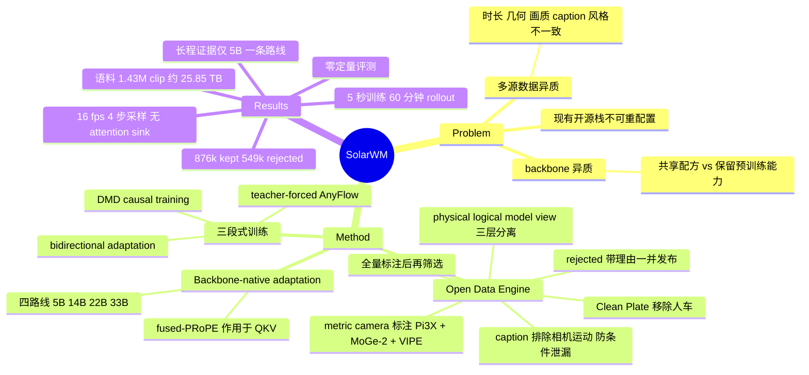

## Summary

SolarWM 把 interactive video world model 从数据准备到长时程推理的整条链路一次性开源：data engine 把 10 个来源、1.43M canonical clip 归一成含 metric camera 位姿与内参、caption、质量指标、选择决策与 provenance 的 frame-aligned 契约，并把源级预处理与 mixture 构造解耦，连被拒样本带拒绝理由一并发布；模型侧以同一套 fused-PRoPE camera 条件和 bidirectional adaptation → teacher-forced AnyFlow → DMD 三段配方，在 Wan2.2 / LTX-2.5 / MiniMax-H3 上实例化 5B–33B 四条 backbone-native 路线，只用 5 秒序列训练便跑出 4 步采样、无 attention sink 的 60 分钟不间断 rollout。代价是全文零定量评测：Experiments 只有定性图，contribution 里的 "state-of-the-art performance" 与 abstract 的 "real-time interaction" 在正文没有任何数字、baseline 或 ablation 对应。

## Problem & Motivation

论文把 interactive world model 的困难定位在两种互相耦合的异质性上，而不是模型容量。数据侧，DL3DV、MiraData、SpatialVID、Sekai、OmniWorld 这些来源在时长、分辨率、相机证据、坐标约定、metric scale、caption 风格与运动分布上都不一致，直接混合会产生不一致的监督，使单源上表现良好的模型在多源训练下退化。模型侧，video generator 在 latent 表示、attention 结构与条件注入机制上差异很大：共享一套适配策略才谈得上可扩展，但忽略这种异质性会破坏预训练能力，而 backbone-specific 的适配又让系统性比较无从谈起。

作者对现状的判断是，已有开源系统大多只覆盖受限的数据来源与 model-specific 实现；即便放出训练代码，processed data、source-to-training 构造、确切的选择与 mixture recipe、与 checkpoint 匹配的优化配置往往仍然缺失，复现一个模型或换一个数据集/backbone 需要重建系统的大部分。已有的多 backbone 发布通常只覆盖两三个 backbone family，因此无法判断一个训练设计到底是通用的还是靠 model-specific 工程撑起来的。SolarWM 要补的是这个可复现基座，而不是某个指标。

## Method

### 1. Open Data Engine：先全量标注，再谈筛选

引擎的中心原则是在施加任何训练期选择之前，把每个来源的每条 canonical clip 全部处理并标注完。不满足默认 recipe 的 clip 不被丢弃，而是连同标注、度量值与机器可读的拒绝理由进入独立的 rejected 分区。high 与 xhigh 因此只是两个方便的质量档，不是"有效数据"的不可逆定义。

**统一 sample 契约。** 每个样本是 S_i = (V_i, P_i, K_i, C_i, m_i, q_i, π_i)：视频、metric camera-to-world 位姿（N×4×4）、per-frame 内参 (f_x, f_y, c_x, c_y)、dense caption、来源与媒体元数据、完整度量记录、provenance 与 lineage，所有时序模态对齐到同一段确定性选取的帧区间。比 schema 本身更关键的是三个 namespace 被显式分开：physical corpus 存 canonical 样本与标注，logical recipe 存 split 归属、tier 策略、source 权重与 repeat factor，model view 存 backbone 特定的时间窗或预计算 latent。换 recipe 不复制视频，换 VAE 不改变数据选择。

**metric camera 标注。** 沿用 SANA-WM 的设计，按各来源可得的几何证据选路径。video-only 来源用 Pi3X 估计时间一致但尺度不定的结构、MoGe-2 提供 per-frame metric depth 锚点，融合后送入改造过的 VIPE SLAM，做带 per-frame 内参（由 GeoCalib 初始化）的 bundle adjustment；有 ground-truth 或 COLMAP 位姿的来源保留原轨迹而不用 SLAM 估计替换，Pi3X 只负责把预测结构接到轨迹的 metric gauge 上，用 robust Umeyama Sim(3) 在残差最低的 80% 帧上重估。translation 保持 metric 单位，不做全语料归一化；相机证据缺失或非有限时，只要 recipe 用到相机门就 fail closed。

**Clean Plate 派生。** 动态的人与车对 camera-controlled world model 是歧义来源，它们引入的运动既不由相机解释、也不可控。作者用 LTX-2.3 Clean Plate IC-LoRA（8 步去噪、strength 1.0、输出 1280×720 @16fps）产出 543k clean clip，作为三个独立 recipe owner 而非对原数据集的静默替换。clean 输出不继承源 clip 的质量评估，caption、视觉指标、语义指标与相机诊断全部重算，metric scale 由确定性的源帧对应恢复，重建不了则 fail closed。

**caption 与多轴标注。** 全部 1.43M clip 由同一条 Kimi-K2.6 流水线加 caption，prompt 要求只描述持久的环境与稳定场景内容，明确排除人与动物、动态车辆、动作、相机运动与镜头术语，目标是 60–150 词的单段英文。作者给出的理由值得记下来：这是为了降低文本条件泄漏相机控制信息的风险。如果 caption 里写了"镜头缓慢右摇"，camera condition 就不再是唯一的时变控制。除 caption 外还输出 entity density、quality、reject flag、scene type、scene transition 五个结构化字段，另有相机完整性、DOVER、VMAF Motion、UniMatch 光流、PySceneDetect 剪辑点等度量向量，全部保留在发布记录里，包括默认选择用不到的那些——因为不同源域的分数分布本就不同，统一阈值会在一个域里删掉有用轨迹、在另一个域里留下伪影。

**source-aware 筛选。** 每个 dataset owner 冻结一份带版本的策略，产出 xhigh / high / rejected 三个互斥标签。策略刻意不对称：Sekai-Game 保留高运动的游戏轨迹、不施加通用的相机几何与饱和度门，clean owner 则额外要求变换后的几何与 lineage 检查。作者明确说这是为了避免把所有算过的指标都追认成选择门。

### 2. Backbone-native adaptation：共享接口，保留原生语义

四条路线共用同一份 data recipe、相机几何接口与训练/推理流程，但保留各自的时间网格、文本表示、attention mask 与原生优化目标。相机条件统一用 fused-PRoPE（同 MosaicMem）：backbone 先施加自己的 video RoPE，再由位姿与内参决定的 projective rotation 直接作用在 query、key、value 上，随后走一次自注意力与匹配的输出变换。相机运动因此进入注意力计算本身，而不是追加一个条件 token 或另起一条相机分支，这也是它能在四个结构不同的 backbone 上复用的原因。

四条路线的差异集中在保留哪些原生部件：

| 路线 | 保留部件 | image 条件 | audio 处理 | VAE 下采样 T / S |
|:--|:--|:--|:--|:--|
| wan2.2-5B | 原生 TI2V latent 路径，无独立 y | 无；首个 latent 作 clean anchor 并排除出 video loss | 无 | 4× / 16× |
| wan2.2-14B | high-noise expert，训成覆盖全时间步的单一 dense 模型 | 官方 y：4 通道 mask + 16 通道 image latent | 无 | 4× / 8× |
| ltx-2.5-22B | 13.1B video core + 冻结 1.6B Gemma connector = 14.7B | 原生 first-frame latent | 移除 3.7B audio 流与 2.6B AV cross-attention | 8× / 32× |
| minimax-h3-33B | H3 Omni Transformer 与原生多模态 packing | Qwen image/caption 行 + VisualVAE 单帧 anchor | 保留 audio 行，填静音编码并置零 loss | 17n+5 → 5n+2 / 16× |

wan2.2-14B 这条值得注意：它从 I2V-A14B 的 high-noise expert 出发，但不保留两 expert 的路由规则与噪声边界，直接训成一个覆盖全时间步的 dense 模型。minimax-h3-33B 则保留了预训练的 head 划分，维度 [0:96) 保持原生内容表示与 MM-RoPE，只有 [96:128) 接收 camera-relative-pose PRoPE。

### 3. 三段式训练

1. **Bidirectional adaptation**：双向注意力下最小化 $\mathcal{L}_{\mathrm{bid}}=\mathbb{E}[\lVert f_\theta(z_t,t,c)-u_t\rVert_2^2]$，回归目标是 backbone 的原生 flow/velocity。这一段既产出因果训练的初始化，也产出 DMD 用的固定双向 teacher。
2. **Teacher-forced AnyFlow 初始化**：latent 序列切成有序块，预测当前块时只能看当前噪声态与 clean ground-truth 历史，未来块不可见。AnyFlow loss 监督任意两个噪声水平之间的 flow map，因此直接产出一个 few-step 的自回归 initializer。这是全文最实质的方法主张：TF-AnyFlow 让 Causal Forcing 与 Causal Forcing++ 各自需要的 Causal ODE / Causal CD 初始化阶段变得不必要，因为 few-step 能力从一开始就被训进去了。
3. **DMD 因果训练**：teacher forcing 看的是 clean 历史，推理看的是模型自己的预测。causal student 用 detached rollout-and-replay（以便回传 KV cache 梯度）按推理时的时间规则生成轨迹，冻结的双向 teacher 给目标分布、可训练的 fake-distribution 模型跟踪 student 当前的 rollout 分布，二者之差给出分布匹配方向。

## Key Results

这一节需要先说清楚一件事：**论文没有任何定量评测**。§7 的全部内容是 Figure 6–11 的采样帧，没有 FVD/PSNR/VBench 一类指标，没有被打分的 baseline，没有 ablation，没有 human eval，也没有训练配置表。独立核查在全文范围对 FVD、PSNR、SSIM、LPIPS、VBench、user study、ablation、baseline 的关键词扫描零命中。下面的"结果"因此分两类：可核对的语料统计，和只有定性图支撑的能力展示。

**语料统计。** 1,425,694 条 canonical clip，其中 876k 保留（high 471,798 + xhigh 404,795），549,101 条带失败原因发布在 rejected 分区；物理存储 29k shard、约 25.85 TB。按时长看，全部 78k 条短于 81 帧的 clip 都被拒；153–956 帧区间共 858k 条、保留 553k；≥957 帧的长尾保留 82k。Clean Plate 543k = SpatialVID-Clean 298k（73k @81 帧 + 224k @160 帧）+ MiraData-Clean 135k + Sekai-Walking-Clean 109k。81 帧短 recipe 覆盖 10 个 owner、600,320 条物理训练行，对 ABOT / MiraData / Sekai-Game 施加 6 倍 repeat 后每 epoch 870,210 次虚拟出现，held-out test view 1,000 行；另有每 owner 100 条、合计 1,400 行的独立 test view 供 reader 校验。

**能力展示。** 全部因果生成在 16 fps、4 步采样、无 attention sink 下产出。Figure 6 给四条 backbone 路线在双向预训练阶段的 10 秒 OOD 生成，首帧由 GPT Image 2 或 Krea 合成。Figure 7–11 则全部来自 SolarWM-wan2.2-5B-fast 这一个 causal student：10 秒第三人称 in-domain rollout、分钟级 in-domain rollout、10 秒 OOD rollout、分钟级 OOD 复合轨迹 rollout，以及从 held-out 验证帧出发的 60 分钟不间断自回归 rollout。长视频的设定是干净的——不从输入图重启、不注入参考帧、不拼接独立生成的短片、不用 attention sink，scene prompt 全程固定，唯一的时变外部控制是预设相机轨迹。

**作者声称但无证据的三条。** 其一，"achieve state-of-the-art performance" 在 Introduction 与 contribution 各出现一次，全文没有任何被打分的对照方法。其二，abstract 与 conclusion 的 "real-time interaction" 没有延迟、吞吐或实测帧率，16 fps 是生成视频的名义帧率而非生成速度。其三，"大部分优化应放在双向训练、AR 适配收敛很快、DMD 需要的步数更少"作为 key finding 写在 Introduction，之后再未被任何步数曲线、GPU 小时或成本表回访；§7.1 的 Configurations 只给推理设置。

## Evidence Ledger

| Claim ID | Claim | Type | Source locator | Evidence excerpt | Status |
|:--|:--|:--|:--|:--|:--|
| C1 | 语料 1.43M canonical clip，来自 10 个源数据集，组织为 14 个可独立寻址的 dataset owner | number | §5 | "corpus contains 1.43M canonical clips derived from 10 source datasets and organized into 14 independently addressable processing partitions" | source-verified |
| C2 | 保留 876k（high 471,798 + xhigh 404,795），rejected 549,101，总计 1,425,694；物理存储 29k shard、约 25.85 TB | number | §5.7 + owner 清单表 | "876k of the 1.4M canonical clips are retained: 471k in the high tier and 404k in xhigh" | source-verified |
| C3 | Clean Plate 543k：SpatialVID-Clean 298k（73k @81 帧、224k @160 帧）、MiraData-Clean 135k、Sekai-Walking-Clean 109k；LTX-2.3 IC-LoRA、8 步、strength 1.0、输出 1280×720 @16fps | number | §5.3 | "543k clean clips: 298k SpatialVID-Clean clips (73k at 81 frames and 224k at 160 frames), 135k MiraData-Clean" | source-verified |
| C4 | 四个模型跨 5B–33B：wan2.2-5B / wan2.2-14B / ltx-2.5-22B / minimax-h3-33B，底座为 Wan2.2、LTX-2.5、MiniMax-H3 | number | §1, §6.2 | "with model sizes spanning 5B to 33B parameters" | source-verified |
| C5 | TF-AnyFlow 使 Causal Forcing 与 Causal Forcing++ 各自需要的 Causal ODE / Causal CD 初始化阶段不再必要 | causal-mechanism | §4 | "TF-AnyFlow removes the need for the additional Causal ODE and Causal Consistency Distillation (CD) initialization stages" | source-verified |
| C6 | fused-PRoPE 的 projective rotation 直接作用于现有自注意力路径的 Q/K/V，不需要独立控制分支或额外注意力 pass | causal-mechanism | §6.1, §4.1 | "projective rotations act directly on the query, key, and value tensors in the existing self-attention path" | source-verified |
| C7 | 仅用 5 秒序列训练即产出 60 分钟不间断自回归 rollout，且不重启、不注入参考帧、不拼接短片、不用 attention sink | benchmark-setting | §7.3.3, Fig. 11 | "We do not restart from the input image, inject reference frames, independently generate and splice short clips, or use an attention sink" | source-verified |
| C8 | 全部因果结果在 16 fps、4 步采样、无 attention sink 下生成 | benchmark-setting | §7.1 | "All reported SolarWM causal results are generated at 16 fps with four sampling steps and no attention sink" | source-verified |
| C9 | 论文两次声称 "state-of-the-art performance"，但全文无任何定量评测：无指标、无被打分的 baseline、无 ablation，Experiments 全为定性图 | sota-novelty | §1 + §7（全篇关键词扫描零命中） | "our models achieve state-of-the-art performance without specialized ODE or consistency-distillation (CD) initialization" | source-verified |
| C10 | abstract 与 conclusion 的 "real-time interaction" 无任何延迟、吞吐或实测帧率支撑；16 fps 是生成视频名义帧率而非生成速度 | number | Abstract, §8, §7.1 | "The resulting causal models enable real-time interaction over rollouts ranging from minutes to hours" | source-verified |
| C11 | Figure 7–11 的 in-domain、OOD、分钟级与小时级 rollout 全部出自 SolarWM-wan2.2-5B-fast 单一 causal student，其余三条路线只出现在双向阶段的 Figure 6 | benchmark-setting | Fig. 6–11 caption | "generated by the SolarWM-wan2.2-5B-fast causal student"（Fig. 7/8/9/10/11 一致） | source-verified |
| C12 | "大部分优化应在双向阶段、AR 适配收敛快、DMD 步数更少"无 ablation、步数、GPU 小时或成本表支撑，全文亦无训练超参表 | causal-mechanism | §1 key findings；§7.1 | "most optimization should be performed during bidirectional training; AR adaptation then converges rapidly" | source-verified |
| C13 | 发布用将来时表述；Table 1 中 SolarWM 条目是"本次发布的承诺"，其他系统状态核对截至 2026-08-18 | license-code | §2；Table 1 caption | "Release status was verified from official artifacts as of August 18, 2026; SolarWM entries indicate commitments for this release" | source-verified |
| C14 | Table 1 为 18 个系统的发布矩阵，SolarWM 自评行标 "25.85 TB, 1426k clips" 且每列打勾含 Multi-BB ✓(4)；该表表体在 arXiv HTML 版未渲染，仅存表头 | benchmark-setting | Table 1（PDF p.5；HTML 表体缺失） | "Statistics cover public or committed payloads; \"Multi-BB\" denotes multiple video-backbone families" | source-verified |
| C15 | 81 帧短 recipe：10 owner、600,320 物理行，ABOT/MiraData/Sekai-Game 6 倍 repeat → 每 epoch 870,210 次虚拟出现；held-out test view 1,000 行，per-owner 100 条合计 1,400 行 | number | §5.6 | "600,320 physical training rows... producing 870,210 virtual occurrences per epoch" | source-verified |
| C16 | ltx-2.5 路线移除 3.7B audio 流与 2.6B AV cross-attention，保留 13.1B video core + 冻结 1.6B Gemma connector = 14.7B | number | §6.2 | "3.7B parameters to the audio stream and 2.6B to bidirectional audio-video cross-attention; both removed" | source-verified |
| C17 | caption 排除人、动物、动态车辆、动作、相机运动与镜头术语，作者给出的理由是降低文本条件泄漏相机控制信息的风险；目标 60–150 词单段英文 | causal-mechanism | §5.4 + Table 2 | "thereby reducing the risk that the text condition leaks camera-control information" | source-verified |
| C18 | 相机标注沿 SANA-WM：Pi3X + MoGe-2 融合后送改造版 VIPE SLAM，per-frame 内参由 GeoCalib 初始化；有 GT/COLMAP 位姿则保留原轨迹，用 robust Umeyama Sim(3) 在残差最低 80% 帧上对齐 | causal-mechanism | §5.2 | "aligned with a robust Umeyama Sim(3) fit, which is re-estimated from the lowest-residual 80% of frames" | source-verified |

## Strengths & Weaknesses

**值得学的地方**

"先全量标注、再谈筛选"是数据工程上的正确 factorization。把 rejected 分区连同拒绝理由一起发布，等于把选择策略从数据集里剥出来变成可替换的一层。这直接决定了别人能否在这份语料上做与作者不同的实验：像"放松运动过滤会怎样"这类问题，在别的发布里需要重跑昂贵的相机估计与 caption，在这里只是换一份 index。physical corpus / logical recipe / model view 三层分离是整套设计的支点，也是最容易被后来者搬走的部分。

caption 排除相机运动这一条有明确的机制理由。多数数据集的 caption 会顺手描述镜头运动，对 camera-conditioned world model 而言这是条件泄漏，会让模型分不清"因为 camera condition 而移动"和"因为 caption 说了镜头在动而移动"。作者把它写成 prompt 的 hard negative 并给出理由，属于少见的把数据决策讲清楚的做法。

fused-PRoPE 能在四个结构差异很大的 backbone 上复用，是个不算小的经验事实。它不新增分支、不加注意力 pass，只在 Q/K/V 上作用 projective rotation，对 backbone 的侵入性接近最小；minimax-h3 那条只在 [96:128) 维度注入、保留 [0:96) 的原生 MM-RoPE，是把"不破坏预训练表示"落到实处的具体做法。方法学上唯一有分量的新主张是 TF-AnyFlow：Causal Forcing 与 Causal Forcing++ 分别要 Causal ODE 和 Causal CD 才能给 DMD 一个可用的 few-step 起点，把 AnyFlow 的任意噪声水平 flow map 与 teacher forcing 合在一起，原理上确实能一步到位。

**必须打折的地方**

零定量评测使论文的能力类声明全部不可验收。"state-of-the-art performance" 没有任何被打分的对照，"real-time interaction" 没有一个延迟数字，而"大部分优化在双向阶段、DMD 步数最少"这条本该最容易用步数曲线或 GPU 小时证明的经验发现也只是一句断言。语料统计部分是硬的，能力部分是软的，两者却被写在同一套 contribution 措辞里。

"跨 backbone 通用"的证据强度被训练阶段割裂了。四条路线同时出现的只有 Figure 6 的双向 10 秒 OOD 生成；因果适配、DMD 蒸馏、分钟级与小时级 rollout 的证据全部来自 wan2.2-5B-fast 一条路线。论文实际证明的是"共享数据与相机契约能让四个 backbone 都完成双向适配"，而"三段式配方在四个 backbone 上都能得到可用的因果长程模型"目前只有四分之一的证据，这个区分在 abstract 里没有被保留。

小时级 rollout 的"成立"目前只由稀疏采样帧的可辨识性定义——作者的措辞是 60 分钟端点 remain recognizable and visually coherent。这对 [[Topics/WorldModel-Survey]] 长期记录的那个问题（动态主体出画再入画会消失或扭曲）没有提供任何判据：场景里没有可控的动态主体，Clean Plate 恰恰把人与车移除了；相机轨迹是预设的，没有回到起点的闭环一致性检验，也没有任何 revisit consistency 指标。"能连续生成一小时"和"一小时内世界保持自洽"是两件事，本文只支持前者。

语料在设计上偏向静态场景加相机控制。Clean Plate 移除动态实体而非建模它们，caption 排除人、动物与动作，唯一的时变控制是相机轨迹。这让 SolarWM 更接近一个可导航的场景外推器，而不是 abstract 所说的"响应 action 或语义指令"的交互式世界模型——后者所需的 action-conditioned 监督在这份语料里被系统性地过滤掉了。最后，发布状态需要分层读：论文本身用将来时，Table 1 里 SolarWM 的满勾是"本次发布的承诺"，其他系统的状态则是 2026-08-18 的核对结果，这张表在方法上不是同一口径的对比。

**领域影响的判断。** 如果发布确实完整，SolarWM 的价值在于把"数据 → 适配 → 长程推理"第一次做成可重配置的公共基座，让"换一个 filter / 换一个 mixture / 换一个 backbone 会怎样"从系统重建工作变成配置工作。它对 [[DomainMaps/WorldModel]] 里"Environment Synthesis 工程量大但 insight-light"那条判断是个新实例：工程价值明确，方法学新意集中在 TF-AnyFlow 一点上，而这一点恰恰没有被任何实验隔离。

## Connections

- **数据管线开放程度** — vault 里的同类工作都停在"放代码与权重"这一层：[[Papers/2607-ABotWorld0|ABot-World-0]] 放出模型与推理栈，但训练语料是内部的 ABot-World-Explorer-500h；[[Papers/2608-AlayaEvoke|Alaya-EVOKE]] 放出代码与权重，数据构造只在正文描述；[[Papers/2608-DreamXPhi|DreamX-Phi 1.0]] 同理。SolarWM 是这批里唯一把 rejected 分区、逐条度量向量、冻结的 per-owner 筛选策略（Table 3 写成可执行的 kept / xhigh 规则）与 recipe index 一并发布的。区别可以这样概括：别的工作让你复现它的模型，SolarWM 让你复现它的**选择**，也让你推翻它的选择。反过来说，这也是它唯一确定超过同侪的维度——能力维度它一个数字都没给。
- **backbone 无关适配** — [[Papers/2609-H3World|H3-World]] 与 SolarWM 的 minimax-h3-33B 路线用的是同一个 33B MiniMax-H3 底座，走的却是两个极端：H3-World 用 7,872 段 clip、rank-32 LoRA、0.199% 可训参数，把控制表达成模板渲染的英文指令塞进原生文本条件；SolarWM 全量训练 backbone，把控制表达成只作用于 [96:128) 维度的 camera PRoPE，保留 [0:96) 的原生 MM-RoPE。两者对"不破坏预训练能力"的解法是同构的（都只动一个受限子空间），但控制模态不同：H3-World 是离散动作，SolarWM 是连续 6-DoF 相机。至于"通用适配配方"这个更强的主张，SolarWM 的证据只覆盖到双向阶段，而 [[Papers/2607-ABotWorld0|ABot-World-0]] 与 [[Papers/2608-DreamXPhi|DreamX-Phi]] 各自只做单 backbone（都是 Wan2.2），因此"三段式配方跨 backbone 可迁移"在 vault 范围内至今没有被任何工作定量验证过。
- **long-horizon 推理** — 这是差别最尖锐的一轴。[[Papers/2608-AlayaEvoke|Alaya-EVOKE]] 的两小时 rollout 靠一个用 camera pose 直接寻址的外部 geometric world state bank，把 denoiser 的 context 与 session 长度解耦，并在 WBench navigation split 上给了数字（Average 80.8，尽管领先幅度只有 0.1）；[[Papers/2607-ABotWorld0|ABot-World-0]] 靠 bounded KV cache 加低比特全栈协同做到单卡 16 FPS 流式，并在 WorldRoamBench 上报了分项，包括明显落后的 memory 维度 0.5041。SolarWM 反过来主张什么记忆机制都不需要：不用 attention sink、不注入参考帧、不做长序列微调，只靠 5 秒训练加 DMD 对齐推理分布就能撑 60 分钟。这个主张比前两者激进得多，却是三者里唯一没有任何测量的。三篇合起来给出一个可以直接做的实验：把 SolarWM-wan2.2-5B-fast 放到 WorldRoamBench 或 WBench navigation split 上跑一遍，就能判定"无记忆机制的长程一致性"到底是结论还是采样帧造成的错觉。

## Mind Map

## Notes

**发布状态的独立核对（2026-09-04，vault 侧检查，非论文内容）**

论文用将来时描述发布，我按公开 API 核对了实际状态：GitHub `Junchao-cs/SolarWM` 存在，Apache-2.0，含 `data-engine/`、`src/`、`configs/`、`environments/` 等目录；HuggingFace 上四个权重仓库均已填充——`SolarWM-Wan2.2-5B`（46 文件 / 194 GB）、`SolarWM-Wan2.2-14B`（27 / 183 GB）、`SolarWM-LTX-22B`（17 / 74 GB）、`SolarWM-H3-33B`（75 / 148 GB）；数据仓库 `junchaoh-cs/SolarWM-Data` 有 1,584 个文件、合计约 2.73 TB，路径为 `SolarWM-Data-Annotation/archives/<owner>/` 加 `releases-v1/recipes`。2.73 TB 远小于论文所述的约 25.85 TB 物理语料，说明目前公开的是标注与 recipe 层加部分 clip 归档，完整媒体尚未全部上线。归档里存在 `abot-controls.tar.zst` 这类动作记录，但正文实验没有用到 action 条件。引用这份"完全开源"时应按层区分：代码与四套权重已可用，数据为部分。

**值得追的问题**

1. 唯一的方法学主张 TF-AnyFlow 恰好是唯一没被隔离的东西。最便宜的关键实验是在同一条 5B 路线上，用 Causal ODE + Causal CD 初始化跑一遍 DMD，与 TF-AnyFlow 初始化对比最终质量与总步数。代码与权重都在，这个对照可以自己跑，且能同时检验 §1 那条"DMD 步数最少"的断言。
2. 小时级 rollout 需要一个 revisit consistency 判据，而不是端点可辨识性。最小设计：让相机轨迹闭环回到起点，比较 t=0 与 t=T 的重叠视野；再在 [[Papers/2603-HybridMemory|HybridMemory]] 指出的动态主体出画再入画场景上另做一组。SolarWM 的语料因为 Clean Plate 已移除动态主体，恰好构成最有利条件下的上界，这个上界值多少本身就是有价值的数字。
3. rejected 分区是一个少见的资源：549k 条带完整标注与显式拒绝理由的样本。可以直接问一个数据侧问题——把 rejected 按理由分层加回训练，哪一类拒绝真的有害、哪一类只是保守？这类实验在别的发布上做不了，正是这套 factorization 的用武之地。
4. 一个值得记进 [[Topics/WorldModel-Survey]] 的 pattern：2026 下半年这批 open interactive world model 报告里，[[Papers/2609-H3World|H3-World]] 与 SolarWM 系统性地以定性图交付、零生成质量指标，而做了定量的（[[Papers/2607-ABotWorld0|ABot-World-0]]、[[Papers/2608-AlayaEvoke|Alaya-EVOKE]]、[[Papers/2608-DreamXPhi|DreamX-Phi]]）要么不是第一、要么领先幅度不显著。这不是巧合：长程交互生成缺一个各方都认的评测口径，于是"发得出图"替代了"打得过分"。
