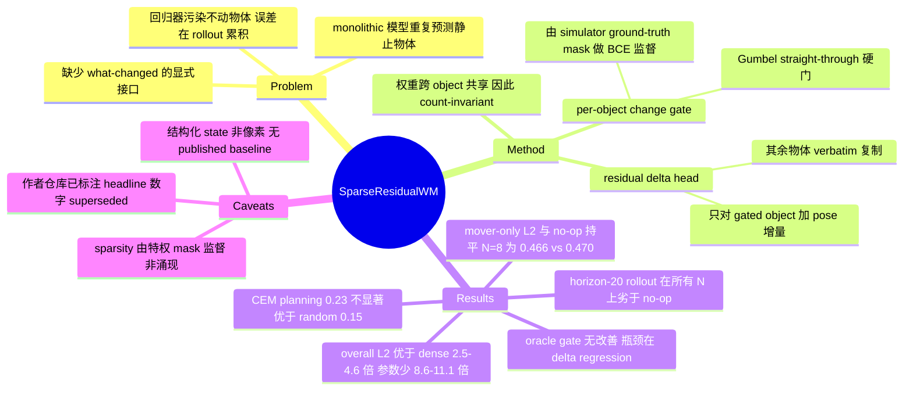

## Summary

论文用 per-object change gate 加 residual delta head 替代 monolithic 状态预测，在 3–8 物体的 MuJoCo tabletop pushing 上以 8.6–11.1× 更少的参数把 overall L2 做到 dense MLP 的 1/2.5–1/4.6。但作者自己把误差拆成 changed / unchanged 之后发现优势几乎全部来自"不去污染静止物体"：真正移动的物体上 L2 与 no-op 基线持平（N=8 为 0.466 vs 0.470），horizon-20 rollout 整体劣于 no-op，CEM planning 的 0.23±0.06 也不显著优于 random 的 0.15。论文因此在正文里主动撤回自己的 headline 措辞，把可用结论收缩为"一个不注入误差的 change detector，而非更准的动力学模型"。

## Problem & Motivation

Ha–Schmidhuber 与 Dreamer 一脉的 world model 每一步都重建整个 next state 或 latent，而物理环境的变化是极度稀疏的——推一个方块时只有一个 object 的 pose 改变。论文指出这带来三个代价：capacity 花在重复预测静止的大多数上；回归器不可避免地扰动本该逐字复制的物体，这个误差在闭环 rollout 里恰好累积在从未动过的物体上；以及可解释性缺口，monolithic predictor 不提供"它认为什么会动"的显式接口。

值得注意的是，被攻击的"monolithic world model"在本文的实验里具体化为一个 3 层 256 宽的 MLP（N=3 时 76,809 参数），而非 Dreamer 或任何已发表的 object-centric dynamics model。论文全篇没有跑过任何 published baseline，comparator 只有作者自写的 dense MLP 与 no-op 两个。

## Method

**输入是结构化 state，不是像素。** state 拼接 pusher position、每个 object 的平面 pose $(x,y,\theta)$ 与速度、以及 goal；action 是 position-controlled pusher 的 end-effector delta-$xy$。object slot 由仿真器直接给定，不存在 slot discovery 或分割。

**Gate 与 delta head。** 对每个 object $i$ 构造特征 $\phi_i(s_t,a_t)$（自身 pose/velocity、相对 goal 与 pusher 位置、action，以及对其他 object 的置换不变聚合），gate 网络输出一个 change logit，delta head 输出残差 $\Delta_i\in\mathbb{R}^3$，预测为

$$\hat{p}_i^{t+1} = p_i^t + g_i\Delta_i,\quad g_i\in\{0,1\}$$

$g_i$ 用 Gumbel straight-through 采样，推理时是硬门（严格为零更新）。两个 head 都是 2 层 width-128 MLP，跨 object 共享权重且没有任何一层的尺寸依赖 object count，因此模型 count-invariant。

**关键点：sparsity 是被监督出来的，不是学出来的。** loss 由三项组成——针对 simulator 记录的 ground-truth changed mask $m^\star$ 的 class-balanced BCE、只在 changed object 上监督的残差 L2、以及对平均门控 $\bar g$ 的稀疏惩罚：

$$\mathcal{L}=\mathrm{BCE}(g,m^\star)+\lambda_\Delta\, m^\star\!\cdot\!\lVert\Delta-\Delta^\star\rVert_2^2+\lambda_s \bar g$$

也就是说，"哪些物体会动"这件事是由 privileged simulator label 直接教给 gate 的，而不是从 dynamics 目标中涌现的归纳偏置。稀疏惩罚 $\lambda_s$ 本身几乎不贡献精度：App. D 的五点 sweep 里 $\lambda_s$ 从 0.0 到 1.0，overall L2 只从 0.146 变到 0.143，而 F1 反而在 $\lambda_s=0$（完全不加稀疏项）时最高（0.873）。真正起作用的是那个监督信号。

**实验设置。** 程序化生成的 MuJoCo tabletop，$N$ 个 5 cm 自由方块加脚本推动策略，$N\in\{3,5,8\}$。每个 $(N,\text{seed})$ 采 250 条脚本 episode × 100 步，过滤到"真有运动"的 hard subset（阈值 0.02 m），按 80/10/10 划分并带 configuration-leakage guard（原文只写 80/10/10，未标注哪一份是 train/val/test）。Planning 数据另加 200 条脚本 ×80 步与 350 条随机 ×60 步。全部模型 <0.1M 参数，在一台笔记本上训练与评测。8 物体布局使用更宽的边界与更紧的间距，作者明确承认跨 $N$ 的密度趋势因此没有被完全控制。

## Key Results

**一步预测（Tab. I 为 3 seed；no-op 与 ladder 列为 seed 0 的 Tab. II / App. F）**

| $N$ | sparse F1 | sparse L2 | dense L2 | no-op L2（seed 0） | mover-only L2 sparse / no-op | 参数比 |
|:--|:--|:--|:--|:--|:--|:--|
| 3 | 0.867±0.021 | 0.136±0.046 | 0.347±0.053 | 0.128（sparse 0.116） | 0.312 / 0.348 | 11.1× |
| 5 | 0.802±0.024 | 0.101±0.004 | 0.319±0.007 | 0.107（sparse 0.104） | 0.426 / 0.446 | 9.8× |
| 8 | 0.829±0.008 | 0.071±0.016 | 0.329±0.023 | 0.081（sparse 0.081） | 0.466 / 0.470 | 8.6× |

对 dense 的 2.5–4.6× 优势成立，但对 no-op 的优势在 $N$ 增大时消失：N=8 的 overall L2 与 no-op 完全相等，mover-only L2 只领先 0.9%（N=3 时还领先 10%，N=5 时 4.5%）。换句话说，随着场景变密，模型退化为"什么都不预测"。

**Change detection 与 metric 的自证问题。** sparse F1 0.80–0.87、precision 0.92–0.97，而 dense 的 recall ≈1，是退化的。但作者自己在 App. B 指出这个对比部分是定义造成的：ungated baseline 没有 change 输出，其 mask 由把预测 delta 在 $\epsilon_p=10^{-3}$ m 处阈值化得到，任何非零输出都会越过这个门槛，从而把 recall 强制为 1。加了 deadband 与 PR curve 之后 F1 差距"存活但收窄"，作者因此建议不要把 F1 当主指标。

**Ladder 归因（Tab. II，seed 0，overall L2）**

| $N$ | dense | oc-abs | oc-res | sparse | no-op |
|:--|:--|:--|:--|:--|:--|
| 3 | 0.367 | 0.239 | 0.221 | 0.116 | 0.128 |
| 5 | 0.318 | 0.194 | 0.171 | 0.104 | 0.107 |
| 8 | 0.354 | 0.187 | 0.159 | 0.081 | 0.081 |

gate 是唯一能降到 no-op 以下的那一级，unchanged-object L2 在 N=3 上从 0.211 一路降到 0.001。作者同时承认 ladder 缺一档 dense-residual（非 object-centric 但预测残差的 MLP），因此 dense→oc-abs 这一步里"残差参数化"与"object-centricity"的贡献是混淆的。

**Rollout（Tab. III，H=20，3 seed）**

| $N$ | sparse | dense | no-op | mover-only sparse / no-op |
|:--|:--|:--|:--|:--|
| 3 | 0.373±0.033 | 1.241±0.072 | 0.277 | 0.61 / 0.58 |
| 5 | 0.293±0.038 | 1.097±0.096 | 0.180 | 0.71 / 0.68 |
| 8 | 0.182±0.006 | 1.170±0.022 | 0.108 | 0.74 / 0.73 |

比 dense 好 3.4–6.4×，但在每个 $N$、每个 horizon 上都劣于 no-op，mover-only 亦然。作者据此把 abstract 里"hugging the no-motion floor"这句话判为"对'劣于它'的一种慷慨读法"。

**Oracle-gate 诊断。** 把 ground-truth mask 直接喂给 delta head，changed-object L2 几乎不动（N=8：0.466 → 0.474，反而略差）。瓶颈明确在 delta regression，不在 detection——这意味着即使 change 检测做到完美，动力学预测仍不会好。

**Planning（Tab. IV / App. G，CEM 256 样本 ×3 轮，horizon 15，成功半径 5 cm）**

| 条件 | success | final dist. (m) |
|:--|:--|:--|
| oracle（真仿真器） | 1.00 | 0.001 |
| scripted 控制器 | 0.95 | 0.045 |
| sparse（contact feats） | 0.23±0.06 | 0.204±0.019 |
| random | 0.15 | 0.281 |
| dense（diverse data） | 0.00±0.00 | 0.318±0.021 |

Round 1 里两个 prediction-trained 模型都是 0.00，而同一个 planner 配真仿真器成功率 1.00，说明失败源于 planner 访问的是 OOD 状态而非 planner 本身有问题。Round 2 加入 contact-aware、去速度的特征并在混合策略数据上重训后 sparse 升到 0.23，但三个 seed 分别是 0.25 / 0.15 / 0.30，最弱 seed 恰好等于 random。作者自陈这不显著优于 random，可靠的说法只是"与 dense 分离"。

**效率是参数而非墙钟。** 参数比 8.6–11.1×，但 operation 比随 $N$ 从 3.8× 退化到 1.1×，CPU 延迟上 dense 反而更快（0.04 ms vs 0.19–0.20 ms）。作者明确只主张 capacity efficiency。

## Evidence Ledger

| Claim ID | Claim | Type | Source locator | Evidence excerpt | Status |
|:--|:--|:--|:--|:--|:--|
| C1 | overall L2 比 dense 低 2.5–4.6×，参数少 8.6–11.1× | number | §V, Tab. I | "The sparse model's overall L2 is 2.5–4.6× lower than dense at every N (8.6–11.1× fewer parameters)" | source-verified |
| C2 | N=5 sparse 0.104 vs no-op 0.107；N=8 为 0.081 vs 0.081 完全相等 | number | Abstract, Tab. II | "at N=5, overall L2 is 0.104 (sparse) vs. 0.107 (no-op); at N=8, 0.081 vs. 0.081" | source-verified |
| C3 | changed-object L2：N=5 0.426 vs 0.446；N=8 0.466 vs 0.470 | number | Abstract, App. F Tab. VIII | "changed-object L2 is 0.426 vs. 0.446 (N=5) and 0.466 vs. 0.470 (N=8)" | source-verified |
| C4 | sparse F1 0.80–0.87、precision 0.92–0.97；dense recall ≈1 退化 | number | §V | "Change detection sustains F1 0.80–0.87 (precision 0.92–0.97) where dense is degenerate (recall ≈1)" | source-verified |
| C5 | gate 用 simulator ground-truth changed mask 做 class-balanced BCE 监督 | causal-mechanism | §III Eq. 2, §IV | "a class-balanced binary cross-entropy on the gate against the ground-truth changed mask" | source-verified |
| C6 | H=20 rollout 在每个 N 上都劣于 no-op（0.373/0.277、0.293/0.180、0.182/0.108） | number | §VII, Tab. III | "sparse is uniformly worse than no-op overall (N=3: 0.373 vs. 0.277…)" | source-verified |
| C7 | oracle gate 几乎不改善 changed-object L2，瓶颈是 delta regression | causal-mechanism | §VI, App. F Tab. VIII | "Perfect detection barely moves the number, so the changed-object bottleneck is delta regression" | source-verified |
| C8 | ladder 把最大单步归给 gate（1.7–2.0×），且明确承认缺 dense-residual 一档 | benchmark-setting | §VI | "the ladder lacks a dense (non-object-centric) MLP predicting residuals rather than absolute poses" | source-verified |
| C9 | planning 0.23±0.06 vs random 0.15、dense 0.00；作者自陈不显著优于 random | number | §VIII, Tab. IV, App. G | "0.23±0.06 vs. random 0.15 is not significantly better than random (weakest seed exactly 0.15)" | source-verified |
| C10 | 参数对齐的 dense 控制组重训后 sparse 仍全面胜出（单 seed 0） | benchmark-setting | App. E Tab. VII | "we shrink the dense MLP to the sparse model's exact parameter budget and retrain … Sparse still wins" | source-verified |
| C11 | 输入是结构化 per-object state 而非像素；作者称结论不直接迁移到 perception-first 设定 | benchmark-setting | §III, §IX | "Structured state, not pixels; results do not transfer directly to perception-first settings." | source-verified |
| C12 | arXiv 列表页 abstract 的措辞强于正文 abstract，正文逐条撤回；提交历史只有 v1 | comparison | abs 页 + §V/§VII/§IX | 正文："'Hugs the no-op floor' is a generous reading of being worse than it." | source-verified |
| C13 | 代码开源于 github.com/ParamThakkar123/sparse_world_models（MIT，仓库可访问） | license-code | 标题脚注 + 仓库 | "are released at https://github.com/ParamThakkar123/sparse_world_models" | source-verified |
| C14 | 效率优势在参数而非墙钟：op 比从 3.8× 退化到 1.1×，dense 延迟更快 | number | §V, App. C Tab. V | "eroding the operation-count ratio (3.8× to 1.1×), and dense's single matmul is faster in latency" | source-verified |
| C15 | 数据规模 250×100 每 (N,seed)；planning 另加 200×80 + 350×60；80/10/10 划分 | benchmark-setting | §IV, App. A | "250 scripted episodes (×100 steps) per (N,seed)… 80/10/10 split with a configuration-leakage guard" | source-verified |
| C16 | 环境为程序化 MuJoCo tabletop、5 cm 方块、脚本推动策略，指标算在 0.02 m hard subset 上 | benchmark-setting | §IV, App. A | "A procedural MuJoCo tabletop with N free 5 cm boxes and a scripted pushing policy" | source-verified |
| C17 | N=8 布局用更宽边界与更紧间距，跨 N 密度趋势未被完全控制 | benchmark-setting | §IV Scaling, §IX | "the 8-object layout uses wider bounds and tighter spacing to fit the boxes" | source-verified |
| C18 | 作者与机构：VJTI / Arizona State University / ZuiGO；2026-09-02 提交，cs.RO + cs.AI | number | 作者块 + abs 页 | "Param Thakkar Affiliation: Veermata Jijabai Technological Institute…" | source-verified |

> Status 一律只表示 primary source 与 claim 一致，不表示结果已被独立复现。全部 18 条由独立 verifier agent 逐条定位原文核查。

### 补充：来自论文所链仓库的二手证据（**未经独立 verifier 核查**）

以下内容由本笔记作者直接抓取论文所链 GitHub 仓库的 `README.md` 与 `experiments/RESULTS.md`（status map 标注 "Rewritten 2026-08-15"，早于 arXiv v1 的 2026-09-02 提交），**不在论文正文中**，也未经 Step 4.5 的独立核查，因此不进入上表：

| # | 仓库中的表述 | 对论文的影响 |
|:--|:--|:--|
| R1 | 论文的 "Headline numbers, Findings 1–4" 被标为 **superseded — leaky splits, straw-man baseline** | Tab. I 全部数字被作者自己判为不可引用 |
| R2 | 划分泄漏：`create_hard_subset` 先于 `split_dataset` 执行，N=3/seed 0 下 247 条源 episode 里有 62 条（25%）同时出现在 train 与 test；`configuration_leakage: false` guard 检测不到 | 论文 §IV 引以为据的 leakage guard 无效 |
| R3 | 干净划分重测后 sparse 在 N=8 上 overall L2 从 0.0705 升到 0.0931（+30%），dense 反而下降；作者称"泄漏专门讨好了 sparse 模型"，但 ordering 与量级不变 | 论文"N=8 sparse 0.071 vs no-op 0.081"这一关键比较，在干净划分下方向可能反转 |
| R4 | 论文 §V 的 dense-interaction control（"restores ~12× margin at N=8"）被标为 **retracted — does not reproduce** | 该论据应视为已撤回 |
| R5 | 十一条 0 参数或 1 参数的 trivial rule 在三个连续 benchmark 上分别以 F1 0.927 / 0.961 / 0.955 击败 learned gate 的 0.825 / 0.694 / 0.772；另实现 GNS、C-SWM、SlotFormer、PETS、NPS 五个已发表模型（capacity-matched、native objective），全部 recall 0.9986–1.0000 同样退化 | 论文唯一保留的 "durable win"（change detection）在一条 `nearest_to_pusher` 规则面前失效；论文全篇未跑任何 trivial 或 published baseline |
| R6 | "only the sparse model plans" 被标为 **REFUTED** — 五个已发表模型中四个能规划，PETS 以 0.350 > sparse 0.250 | 论文 §VIII 的"与 dense 分离"这一稳健结论也失去意义 |
| R7 | 仓库自述"An earlier version of this work appeared at WORLDS @ IROS 2026; its central claims did not survive proper baselines"，并把当前核心结论改为"object-centric manipulation 的 change-detection benchmark 普遍退化" | 论文与仓库的结论层级已经分叉 |

引用本工作时应以 `experiments/RESULTS.md` 的 status map 为准，而非 arXiv 版本。

## Strengths & Weaknesses

**亮点。** 论文最有价值的地方不是方法，而是它对自己下手的方式。它做了绝大多数 world model 论文不做的四件事：把 no-op（原样复制）当作一等基线而不是脚注；把 L2 拆成 changed / unchanged 两支；给离散组件做 oracle 版本诊断（结果直接否定了自己的叙事重心）；在 planning 里放 random-action 下界并逐 seed 报告。正是这四件事让它发现自己的 headline 是假的，并在 §IX 里逐句撤回——"predicts dynamics far more accurately" 这类措辞被显式 retire。这套控制组合本身值得作为方法论清单沉淀：任何"world model 让控制变好"的断言，缺了这四项中的任何一项都可能什么都没证明。

**核心弱点是 inductive bias 的叙事与实际机制不符。** 论文卖的是"显式建模变化是更好的归纳偏置"，但 gate 是用仿真器的 ground-truth changed mask 做 BCE 监督训练出来的二分类器，object slot 也由仿真器直接给定。真正的稀疏先验（$\lambda_s\bar g$ 项）在 App. D 的 sweep 里对精度几乎无影响，$\lambda_s=0$ 时 F1 甚至最高。所以起作用的是特权监督信号，不是架构偏置；把它称作 bias 是名实不符。

**归因链条比论文自陈的还要脆。** 按 Tab. II 的 overall L2 列做算术（本笔记自算）：从 dense 到 sparse 的总降幅里，object-centric featurization 占 51.0% / 57.9% / 61.2%（N=3/5/8），residual 只占 7.2% / 10.7% / 10.3%，gate 占 41.8% / 31.3% / 28.6%。也就是说按绝对降幅，**最大的单步是 featurization 而非 gate**，与论文"the gate is the largest single step"的表述相反——后者用的是相对倍率（gate 1.91× / 1.64× / 1.96× vs featurization 1.54× / 1.64× / 1.89×），两个读法在 N=5 上基本打平。论文引用的"featurization earns 35–47%"只在 L2unch 列的 N=3 上对得上（47.6%）。gate 唯一稳健的功劳是它是唯一能降到 no-op 以下的那一级。

**没有任何外部基线。** Interaction Networks、GNS、C-SWM、SE3-Nets 都在 Related Work 里被引用，却一个都没跑。更关键的是缺一个近乎免费的对照：state 里同时有 pusher 位置和 object pose，"离 pusher 最近/接触距离内的物体会动"是一条零参数规则，而 Round 2 里作者自己引入 contact-aware 特征恰恰承认接触几何才是信号来源。论文没有报告这条 heuristic 的 F1——而作者仓库后来跑了，结论是这条规则以 0.961 碾压 learned gate 的 0.694。

**统计与内部一致性问题。** Tab. I / III / IV 是 3 seed，但 §VI 全部诊断、Fig. 3b/c 的 transfer 与 sample efficiency、App. D/E/F 都是 seed 0 单点。§V 有一处交叉引用错误："Table I's 0.081 vs. 0.081 is exact equality"——但 Tab. I 根本没有 no-op 列，该数对在 Tab. II。更实质的是，sparse-vs-dense 的 headline 用 3-seed 均值（N=8 为 0.071±0.016），sparse-vs-no-op 的比较却用 seed-0 的 Tab. II（0.081 vs 0.081），两种口径混用。Planning 每 seed 只有 20 个 episode，共 60 局。另外 pose error 把米和弧度池化进同一个 L2 范数，作者承认这不是"单位可通约"的主张，但这让所有 L2 数值都难以物理解读。

**规模与外部效度。** 全部模型 <0.1M 参数，最大 8 个方块，单一 planner（CEM）、单一任务、无像素、无真机、无多步训练。把 3×256 的 MLP 称为"monolithic world model"并据此论证 Dreamer 一脉的设计缺陷，是一个 strawman。

**最需要记住的一点：论文发布时就已经落后于自己的代码库。** 仓库的 status map 重写于 2026-08-15，比 arXiv v1 的 2026-09-02 早了两周半，其中已把论文的 headline 数字标为 superseded（leaky splits）、把 dense-interaction control 标为 retracted、并把"只有 sparse 能规划"标为 REFUTED（PETS 0.350 > sparse 0.250）。这不是"预印本会过时"的常规情形，而是作者在明知结论已被自己推翻的情况下仍投放了旧版本。对我们的实践含义是直接的：`code` 字段不只是可复现性标记，也可能是比正文更新的证据源；对声称"我们的模型预测什么会变"的工作，抓仓库应当先于抓正文。

**领域影响的判断。** 方法本身不会有影响力。真正会留下来的是它无意中提供的两个校准点：其一，在 change-sparse 的物理任务上，聚合的一步 L2 相对 dense 基线的巨大提升可以完全不包含动力学信息——它只说明基线在往静止物体上灌噪声；其二，change-detection F1 在这类 benchmark 上是被单个标量（速度、到 pusher 距离、到最近 mover 距离）决定的，因而是退化指标。任何在 vault 里引用"object-centric world model 提升预测精度"的地方，都应该被要求补上 no-op 基线和 changed/unchanged 分解。

## Mind Map

## Notes

**可复用的方法论清单。** 这篇论文的四件控制值得固化为 world model 类笔记的检查项：(1) no-op / copy 基线是否存在；(2) 误差是否按 changed / unchanged 分解；(3) 离散组件是否有 oracle 版本诊断；(4) 下游控制是否有 random-action 下界与逐 seed 数字。再加上作者仓库补上的第五件：(5) 是否跑过零参数的 trivial rule。这五项里论文做了前四项，缺第五项就足以让唯一存活的结论失效。

**与 vault 内笔记的关系。** 最近的邻居是 [[2608-DALeWM]]——同样在追问"world model 的预测指标与它对 planner 的实际价值之间的落差"，但 DA-LeWM 给出的是可测的诊断量（Plan-Real Spearman）并在 PushT 上把 success 从 49.3% 提到 92.7%，本文则停在"两个模型都无法规划"的阴性结果上；两者放在一起构成同一命题的正反例。[[2605-OAWAM]] 与本文共享 per-object slot 的可寻址性动机，但在 LIBERO / SimplerEnv 上有真实任务成功率，且 slot intervention 有 0.87 的 swap-binding 证据，方法成熟度高一个量级。[[2607-ObjectCentricEnv]] 的 object-centric 是符号/代码层面的环境模型，与本文的连续状态回归不同轴。[[2609-DiscriminativeWM]] 与 [[2609-H3World]] 同为 2026-09 的 world model 工作但域不同（web agent / 语言控制）。[[2607-N0TWAM]] 的模式与本文相似——消融显示预训练规模而非新颖模块才是主因。以上均非重复：vault 中没有针对"per-object change gate + residual delta"这一具体参数化、也没有针对 MuJoCo tabletop pushing 上 sparse-vs-no-op 对照的笔记。

**待办与开放问题。** (1) 那个缺失的 dense-residual rung 是这篇论文最便宜也最关键的实验——如果一个非 object-centric 的 MLP 只要改成预测残差就能消掉大部分 dense 的误差注入，那么"object-centricity"这条叙事线基本不成立；作者把它列为 future work，仓库里似乎也未见结果。(2) 更一般的问题：在 change-sparse 的环境里，什么样的 benchmark 才不退化？仓库 `RESULTS.md` 的 "Why it happens, and what a non-degenerate benchmark would need" 一节给了初步答案（单点 pusher 使标签可由一个标量恢复），值得单独抓一次 repo-digest。(3) 本文的 gate 依赖 privileged change mask，去掉这个监督之后 change 结构能否从 dynamics 目标本身涌现，是把这条线做成真正 inductive-bias 研究的必要一步。
