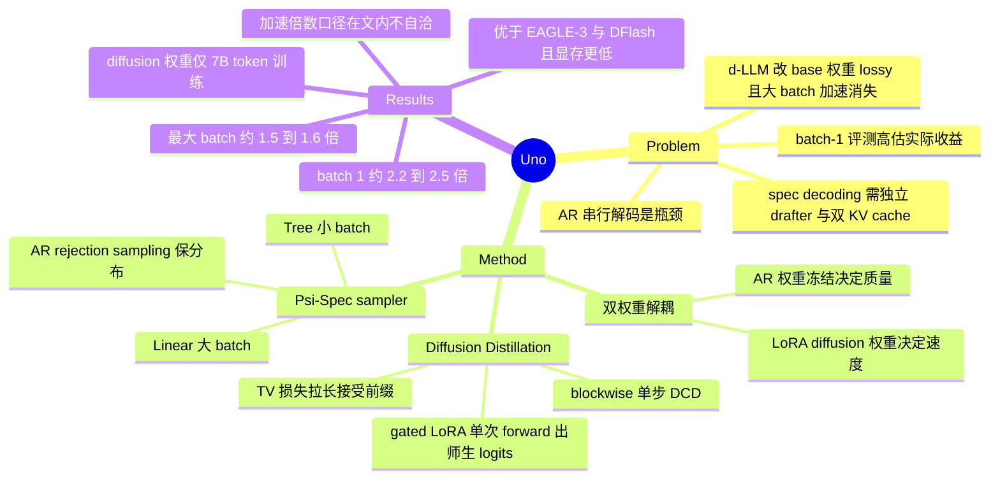

## Summary

Uno 在冻结的 AR LLM 每一层挂一组 rank-128 LoRA "diffusion weights"，用 blockwise 单步 Discrete Consistency Distillation 配合 TV 损失，把 AR 模型在一个 block 上的分布蒸馏进一个可并行出 token 的 drafter，再由 Ψ-Spec sampler 对原始 AR 分布做 rejection sampling 验证。由于 base 权重全程不更新、drafter 只是它的一个 LoRA 扰动，加速在采样分布意义上是 lossless 的，并且 drafting 与 verification 共享同一份 KV cache、不需要独立 draft model。论文实测相对 base AR 的吞吐提升在 batch size 1 上约 2.2×（自训 8B 模型）/ 2.5×（Qwen3-8B 版本），在设备可容纳的最大 batch 上回落到 1.5–1.6×。

## Problem & Motivation

AR LLM 的质量来自 next-token prediction，但推理必须逐 token 串行，长 reasoning trace 与 RL rollout 都因此成为瓶颈。已有的两条加速路线各有硬伤：speculative decoding 的收益取决于一个额外训练、与 target 对齐良好的 draft model，需要维护两套权重与两份 KV cache；discrete diffusion LLM（d-LLM）原生支持并行生成，但主流 d-LLM 都通过改动 base AR 权重把模型转成扩散模型，因此相对原 AR 模型是 lossy 的，且加速只在小 batch 成立、大 batch 下消失。

论文提出的评测立场比方法本身更值得注意：agentic workload 里单个请求就会派生并行 agent、分支轨迹、工具调用与重试，serving 系统还会跨请求批处理，所以 batch-size-1 latency 只覆盖很窄的运行区间，会系统性高估那些"加速随并发衰减"的方法。实用的加速必须在真实 batch size 下评测。

由此得到的问题表述是：能否先定义一个高质量的 AR 分布，再学会从**同一个分布**并行采样多个 token——把"生成质量"和"生成速度"交给两组解耦的参数。

## Method

**双权重架构（diffusion-augmented LLM）**。每层同时持有 AR 权重 θ_AR 与 diffusion 权重 θ_Δ。θ_AR 走标准 pretrain → SFT → RL 流程，决定质量；θ_Δ 实现为每个权重矩阵对应的 LoRA adapter（rank 128，LoRA-α 256），只负责并行 drafting。Drafting 路径用 θ_AR + θ_Δ，verification 路径只用 θ_AR，两者通过共享的 base 参数天然耦合。这一点是设计的关键：把 drafter 参数化成 base 的低秩扰动，既让 draft 与 verify 分布靠得足够近以提高接受率，又几乎不增加推理显存，还避免了 MTP 类方法对架构的改动。

**Diffusion Distillation Phase**。冻结 θ_AR，只训 θ_Δ。目标是让"单步扩散在一个 block 上的分布"匹配"AR 在同一 block 上的分布"。做法上有三处工程取舍：(1) 标准 DCD 需要模拟并存储 PF-ODE 中间态，在 LLM 规模上代价过高，因此把整条轨迹压成从全噪声 z₁ 直接到 clean 的**单步**去噪；(2) 单步恢复整条长序列太难，于是切成大小为 B 的 block 逐块去噪，用 block-causal attention mask 让噪声块只看前面的干净块；(3) teacher（θ_AR）与 student（θ_AR + θ_Δ）的 logits 必须在同一次 forward 里算出来，用 gated LoRA 在 clean 位置关掉 adapter、在 noisy 位置打开。噪声侧用 uniform-state diffusion 而非 masked diffusion，理由是前者原生支持 self-correction 与 few-step 生成。

损失是 DCD 的 KL 项与一个 TV 项的加权和。TV 项来自 Leviathan et al. 的 Corollary 3.6：sampler 只保留被接受的最长前缀，因此最小化 draft 与 AR 的 blockwise total variation 距离等价于拉长期望接受前缀。实践中 DCD 项比 TV 项大一个数量级，最终配置是 α = 0.01、β = 1（自训模型）或 α = 0、β = 1（Qwen 版本）。

**Ψ-Spec sampler**。扩散路径一次 forward 提出 B 个 token 的 block，其中第一个位置只用 θ_AR 算 logits（避免 clean 位置的 distribution shift，且该 token 必然被接受），其余位置用 θ_AR + θ_Δ；然后用标准 speculative decoding 的 rejection correction 验证，保留最长被接受前缀。两种候选采样策略对应两种运行区间：大 batch 计算受限时用 Linear sampler（单条候选），小 batch 显存受限时用 Tree sampler（沿用 Medusa 的树状候选 + EAGLE-3 的前缀剪枝，超参 B/K/V）。因为每步固定两次 forward（draft + verify），tokens-per-forward-pass 的上界是 (B+1)/2。

**训练课程与部署**。若只求推理加速，AR 训练完成后再蒸馏 diffusion 权重；若还想加速 RL rollout，则在 SFT 之后、RL 之前蒸馏——RL 只更新 θ_AR、不动 θ_Δ。Sampler 在 Nano-vLLM 与 SGLang 中都有实现，论文实验用的是 Nano-vLLM 版本。

## Key Results

**吞吐评测协议**。论文没有直接在下游任务上测吞吐（会让生成更短 trace 的模型显得更快），而是定义"1K/8K throughput test"：m = 1024 个随机输入 token、固定输出 n = 8192；先在各 benchmark 上测出平均 TPF，再跑 ⌈n/TPF⌉ 步、约束每步平均接受 TPF 个 token。这是一个半合成协议——TPF 来自真实 benchmark，wall-clock 来自固定长度的模拟解码。

**自训 8B 模型（Uno）**。AR 权重在约 23T token 的内部数据上训练（含 8K → 32K → 128K → 512K 的上下文扩展），diffusion 权重只用 7B token、8 台 8×H200 约 60 小时——两者相差约 3300 倍，说明"并行采样能力"可以作为后挂模块低成本获得。在 H200 上，最大 system throughput 5255 tok/s vs base AR 3577 tok/s（1.47×，batch 64）；per-request throughput 383 vs 176（2.18×，batch 1）。

**与 d-LLM 的对比**（Table 1，Uno 标称 8B，实为 6.95B transformer body + 约 2.05B 未绑定词表矩阵）：τ²-Telecom 90.1、SWE-bench Verified 68.4、Terminal-Bench v2.1 39.6、AA-LCR 68.0、AIME-24 93.0，多数条目大幅领先 DiffusionGemma-26B-A4B 与 Nemotron-Labs-Diffusion-14B。System throughput 5255 也高于 DiffusionGemma 的 1136 与 Nemotron 的 2794，但 DiffusionGemma 在 batch 1 的 per-request throughput（836）反而更高。

**与 speculative decoding 的对比**（UnoQwen，base = Qwen3-8B，diffusion 权重在 OpenThoughts3-1.2M 上训 3 epoch / 14.7B token）：system-throughput 最优配置下 τ = 3.89（EAGLE-3 2.08、DFlash 2.07），5733 tok/s（EAGLE-3 4944、DFlash 5351）；per-request 最优配置下 τ = 5.97，445 tok/s（EAGLE-3 284、DFlash 370）。峰值显存 118–122 GiB vs 两个 baseline 的约 130 GiB，额外参数 0.35B vs 0.40B / 1.05B。Table 18 显示 Uno 在 concurrency 1–64 的全部档位上都 Pareto 占优。

**跨分布可行性**。用 OpenThoughts 微调 Qwen3-8B 本身会掉分（HumanEval 94.4 → 77.8，AIME-25 70.7 → 53.3），但在同一数据上训出来的 diffusion 权重仍能给冻结的 Qwen3-8B 带来 lossless 加速——drafter 与 base 不必同分布训练。

**RL rollout**。SFT 阶段训出的 diffusion adapter 在 DAPO 后训练之后仍保留加速，平均 TPF 从 2.25 降到 2.10（约 6%），这一点有 Table 8 支撑。但"end-to-end RL 训练加速 up to 40%"这条只在正文出现一句，论文明写"We will provide detailed results in the next revision"，本版本没有任何计时数据。

**负面复现结果**。作者报告用 I-DLM 官方发布的 LoRA adapter 与 sampler 无法复现其宣称的 losslessness，并定位到其 sampler 做 greedy drafting 却没有相应调整 rejection sampling 的验证过程；换成 Ψ-Spec（mask prior）后 losslessness 成立，但速度明显低于 Uno。

**Ablation**。只用 TV 损失 TPF 2.39，优于 DCD+TV 与纯 DCD 的 2.23；把 DCD 权重降到 0.01 得到 2.40。Block size 课程（4 → 16，每半 epoch 递增）比固定 B = 16 更好（2.71 vs 2.65）。Adapter 摊到所有层优于集中在部分层；LoRA rank 从 128 提到 256 能提 TPF 但推理更贵，α/r = 64 最佳。

## Evidence Ledger

| Claim ID | Claim | Type | Source locator | Evidence excerpt | Status |
|:--|:--|:--|:--|:--|:--|
| C1 | 自训 Uno max system throughput 5255 tok/s vs base AR 3577 tok/s，即最大 batch（64）下约 1.5× | number | Table 7 (p.29); Sec 5.1.3 (p.10) | "Uno (Ours) 5255 ... AR (Ours) 3577"; "at which Uno is 1.5× faster" | source-verified |
| C2 | Abstract 与 Conclusion 的 "up to 3× speedup over the base AR model" 在正文任何表格中都没有对应测量；可从数据推出的最大比值为 2.53× | number | Abstract; Sec 7; Table 7; Table 18 | "Uno achieves up to a 3× speedup over the base AR model" | source-verified（表述存在，数据不支持：Table 18 concurrency 1 为 445/176 = 2.53×，各并发档单调下降至 1.57×） |
| C3 | Takeaway 1 的 "over 2× higher throughput across all batch sizes" 与同页正文 "batch size 64 时 1.5×" 冲突 | number | Sec 5.1.3, p.10 | "delivering over 2× higher throughput across all batch sizes" | source-verified（内部矛盾） |
| C4 | "Uno outperforms open-weight d-LLMs on every benchmark" 被自家 Table 1 的 AA-Omniscience 推翻（Uno 14.3 < DiffusionGemma 17.7） | comparison | Sec 5.1.3 Takeaway 2; Table 1 | "Uno outperforms open-weight d-LLMs on every benchmark" | source-verified（被自家表格反证） |
| C5 | Table 1 中 Mercury 2 在 SWE-bench Verified、MBPP、HumanEval、GSM8K、MATH500、AIME 全系列与 τ²-Retail 上均无数据 | benchmark-setting | Table 1, p.11 | Mercury 2 列在上述行显示 "–" | source-verified |
| C6 | Diffusion 权重为 rank-128 LoRA（α = 256）；UnoQwen 额外参数 0.35B，少于 EAGLE-3 的 0.40B 与 DFlash 的 1.05B | number | Sec 5.2.2; Table 2 | "Additional Params (B; ↓) 0.35 0.40 1.05" | source-verified |
| C7 | AR 权重约 23T token，diffusion 权重仅 7B token / 8×8 H200 约 60 小时 | number | Sec 5.1.2, p.9–10 | "trained on approximately 23T tokens"; "We train them on 7B tokens" | source-verified |
| C8 | Losslessness 机制：θ_AR 冻结充当 verifier，draft 经标准 rejection sampling 保留 base 分布；draft/verify 共享单份 KV cache | causal-mechanism | Sec 4.2, p.8; Sec 5.2.3, p.13 | "θAR remains frozen ... provides an unchanged verifier and enables lossless speculative speedups" | source-verified |
| C9 | UnoQwen concurrency 1 为 445 vs AR 176（2.53×）；concurrency 64 为 5733 vs 3662（1.57×） | number | Table 18, p.38 | "Con.=1: Uno B16,V32 = 445, AR = 176; Con.=64: 5733 / 3662" | source-verified |
| C10 | "RL 端到端训练加速 up to 40%" 在本版本无任何支撑数据，论文自陈留待下一版 | number | Sec 5.1.3, p.11; Suppl. C.2 | "We will provide detailed results in the next revision." | source-verified（claim 存在但无数据；不得当作已测结果引用） |
| C11 | SFT diffusion adapter 在 RL 后训练后 TPF 2.25 → 2.10，论文称约 6% | number | Table 8, p.30 | "TPF 2.25 2.10"; "only a 6% reduction in TPFs" | source-verified（精确为 6.7%） |
| C12 | "Mercury 2 = 1,154 tok/s，Uno 约 4.6×" 所用的 1154 与 Table 1/7 里的 1197 不一致且全文未调和 | number | Sec 5.1.3, p.10; Table 1; Table 7 | "Mercury 2 reports a system throughput of 1,154 tokens/s ... ∼4.6× higher" | source-verified（5255/1154 = 4.55；5255/1197 = 4.39） |
| C13 | 作者报告无法用 I-DLM 官方 LoRA + sampler 复现其 losslessness，归因于 greedy drafting 与未调整的 rejection sampling | comparison | Sec 6, p.15; Suppl. C.5 | "its sampler performs greedy drafting, but its rejection-sampling verification procedure is not adjusted accordingly" | source-verified |
| C14 | 标称 8B 的模型实为 6.95B transformer body + 约 2.05B 未绑定词表矩阵 | number | Sec 5.1.2, p.9; Table 1 | "6.95B transformer-body parameters plus approximately 2.05B parameters from the ... vocabulary matrices" | source-verified |
| C15 | Uno per-request throughput 在三处表格分别为 405 / 383 / 379，全文未调和 | number | Table 1; Table 7; Table 6 | Table 1 "405"; Table 7 "383"; Table 6 best "379" | source-verified（另 Table 6 最高 system throughput 5190 与 Table 1/7 的 5255 亦不一致） |
| C16 | 吞吐口径为 1K/8K test：m = 1024 随机输入、n = 8192 固定输出，先测 benchmark 平均 TPF 再跑 ⌈n/TPF⌉ 步 | benchmark-setting | Sec 5 "Throughput Analysis", p.8 | "we use m = 1024 and n = 8192"; "run ⌈n/TPF⌉ decoding steps" | source-verified |
| C17 | 机构为 Institute of Foundation Models、UIUC、Cornell Tech、Harvard、Cerebras Systems；2026-09-03 提交；代码页 s-sahoo.com/uno | license-code | Title block, p.1 | "Institue of Foundation Models, University of Illinois Urbana-Champaign, Cornell Tech, Harvard University, Cerebras Systems" | source-verified（github.com/ifm-ai/uno 由项目页给出，非论文正文） |

## Strengths & Weaknesses

**亮点。** 这个 factorization 很干净，也很符合 simple-and-scalable 的品味：把"决定质量的参数"和"决定速度的参数"彻底分开，前者一动不动，后者只是前者的低秩扰动。三个好处几乎是白拿的——losslessness 直接由"verifier 就是原模型"给出，不需要额外论证；draft 与 verify 分布天然对齐，省掉了 EAGLE-3 那一堆 drafter 架构超参（深度、hidden dim、MLP expansion、head 数、KV 投影）；共享 KV cache 让峰值显存反而低于两个 speculative baseline（118 vs 130 GiB），这在大 batch 下直接换成更高的可行并发。训练成本的量级差（7B vs 23T token）说明并行采样能力可以作为一个廉价后挂模块，对已有开源模型是真正的 drop-in。

**方法论上最有价值的一条**其实不是方法，是评测立场。论文明确指出 d-LLM 的加速在 batch=1 才好看、随并发衰减，并给出 1K/8K 固定输出协议来消除"生成更短 trace 的模型看起来更快"这个偏差。Table 18 那张 concurrency × 配置的完整网格，比大多数同类工作只报一个峰值数字要诚实得多。对 I-DLM losslessness 的负面复现结果（定位到 greedy drafting 与 rejection sampling 不匹配）同样罕见且有用。

**主要问题一：加速倍数的口径全线不自洽。** Abstract 和 Conclusion 写 "up to 3×"，但论文自己的表格里能推出的最大值是 2.53×（UnoQwen，batch 1），各并发档单调下降到 1.57×，没有任何一个数字接近 3×。Introduction 的第 4 条贡献写"最大 batch 下 up to 2×"，实测是 1.47× / 1.57×。Takeaway 1 的"all batch sizes 上 over 2×"与同一页正文的"batch 64 时 1.5×"直接打架。per-request throughput 在 Table 1 / 7 / 6 里是 405 / 383 / 379 三个数，system throughput 在 Table 6 里又是 5190 而非 5255。这些不是致命的方法缺陷，但对一篇核心卖点就是"加速多少"的论文来说，数字管理松到这个程度会侵蚀全部结论的可信度。我的判断是：本文可引用的加速区间应写作 **batch 1 约 2.2–2.5×、最大 batch 约 1.5–1.6×**，不应引用 3×。（"3×"最可能的来源是 TPF 口径而非 wall-clock——Table 3 里 UnoQwen 的 TPF 达到 4.21，但 TPF 假设 draft 与 verify 的 forward 等价，忽略 LoRA 分支与树验证的实际开销。）

**主要问题二：质量比较不是 size-controlled，也不是同协议。** 8B（实为约 9B）对 26B-A4B、14B 和参数量未公开的闭源 Mercury 2；Mercury 2 的吞吐数字来自第三方 live tracker（batch size 10、Blackwell 硬件、量化未知），与 Uno 的 H200 + bf16 完全不可比，论文自己也承认这点却仍在 Takeaway 里写"4.6× higher"。"outperforms on every benchmark"更是被自家 Table 1 的 AA-Omniscience 一行推翻。Agentic coding 那条比较（"beats Mercury 2 on coding"）在 Table 1 里根本没有 Mercury 2 的对照数字。

**主要问题三：从零训练的那一半不可复现，可复现的那一半只报速度。** 自训 8B 用的是 proprietary 数据，AR baseline 也是自家模型，外部无从核对 90.1 的 τ²-Telecom 与 68.4 的 SWE-bench Verified。这两个数字对一个 8B 模型来说异常高（**这是我的判断，不是论文的 claim**），需要独立评测确认；如果成立，那它本身是比加速更大的新闻，而论文对 base AR 模型的训练细节披露有限。另一半 UnoQwen 完全基于开源 checkpoint 可复现，但按"lossless 方法不报精度"的惯例只给了速度。

**方法本身的边界。** (1) losslessness 只保证"和 base AR 同分布"，不带来任何质量提升——天花板就是 base 模型。(2) Sec 4.3 提出的 inference-time scaling（增加去噪步数 T > B）要拿到收益必须关掉 AR 验证，那一刻 losslessness 就没了；论文把这条完整留给 future work，等于承认这个新增的 scaling 轴目前零实证。(3) 每步两次 forward 使 TPF 上界锁死在 (B+1)/2，Quadratic sampler 可以合并但需要专门 kernel，未做。(4) DCD 训练在确定性 PF-ODE 轨迹上，与采样时的随机轨迹存在 train-test mismatch，论文在附录自陈这是限制。(5) 加速随 batch 增大而衰减的趋势 Uno 同样存在（2.53 → 1.57），只是衰减比 d-LLM 温和——"大 batch 下依然有效"成立，但不是"不衰减"。

**对领域的影响。** 如果加速数字经独立验证成立，这套"冻结 base + LoRA drafter + rejection sampling"的组合会成为 speculative decoding 的默认替代形态：更少参数、更少显存、不用设计 drafter、不改 base。对本 vault 关心的 agentic serving 与 RL rollout 加速是直接相关的；RL rollout 那条（adapter 在 SFT 阶段训练、RL 期间冻结仍保留加速）如果下一版补上端到端计时数据，会是比推理加速更重要的结果。

## Mind Map

## Notes

- 与 vault 内已有笔记的关系：[[2604-FastdVLM]] 走的是"把 AR VLM 直接转成 block diffusion"的 lossy 路线，正是本文批评的对象（Fast-dLLM v2 在 Table 3 里是 lossy baseline）；[[2604-LLaDA2Uni]] 属于从零训练的 d-LLM 一支。Uno 的立场是第三条：不改 base，只加一个可丢弃的并行采样附件。
- 值得追的一个问题：本文的 losslessness 是相对 base AR 的**采样分布**而言。在 agentic 场景里，真正关心的是任务成功率而不是分布等价——如果 drafter 的接受模式在长 trace 上有系统性偏斜（比如工具调用的结构化片段接受率显著高于自由推理），wall-clock 加速在不同 workload 上会差很多。论文只报了 benchmark 平均 TPF，没有 per-workload 的接受率分布。
- 另一个可挖的方向：Sec 4.3 提出的"固定 context length 下靠增加去噪步数做 inference-time scaling"是个真问题——现有 test-time scaling 全靠拉长 context，这条路子换了轴。但它与 losslessness 互斥，需要一个独立的质量判据来决定何时关掉 AR 验证。这可能是本文留下的最有价值的 open problem。
- 待核实：τ²-Telecom 90.1 与 SWE-bench Verified 68.4 对 8B 模型而言异常强，且依赖未公开的自训 base 模型。引用这两个数字前应等待独立评测。
