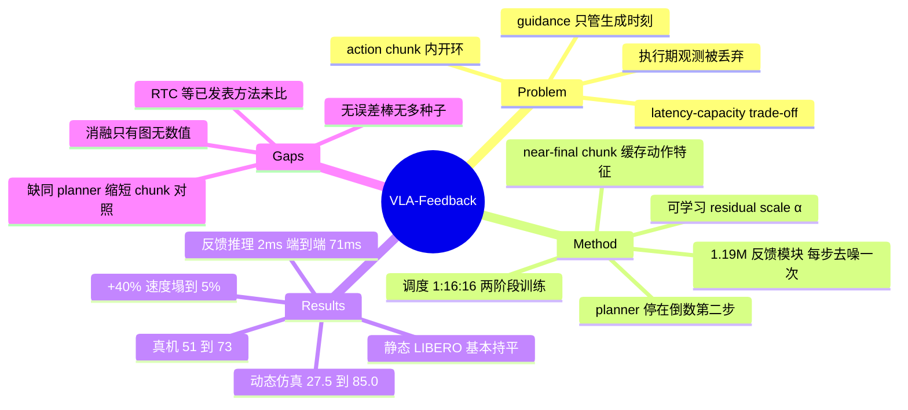

## Summary

VLA-Feedback 把 diffusion VLA 的最后一步去噪从「planner 内部的收尾动作」改成「执行期的反馈接口」：慢通路的 VLM-DiT 规划器停在倒数第二步、输出 near-final action chunk，执行每个动作之前由一个 1.19M 可训练参数的 Feedback Denoising Module 用最新 hand-view 观测预测去噪速度并做一次更新。三个动态 Robosuite 任务的平均成功率由 GR00T 的 27.5% 提到 85.0%，静态 LIBERO 基本持平（Goal 92 持平、Object 97.5 → 95.5），真机 Franka 三任务平均 51% → 73%。论文已被 CoRL 2026 接收，代码与仿真 checkpoint 均已放出。

## Problem & Motivation

- action chunking 是 VLA 压低端到端延迟的主力手段，代价是 chunk 内部开环：执行期间到来的观测被直接丢弃。目标在动、接触状态在变时，chunk 的后半段就是按过期观测在走。
- 现有两条缓解路线各有代价。双系统 / 两时间尺度把慢 VLM 和快动作模块拆开跑在不同频率上，但撞上 latency-capacity trade-off——快通路做成浅 MLP 会丢表达力，做成 diffusion 又得重新引入 chunking。guidance 与 ControlNet 式条件化能让中间去噪状态被额外信息 steer，但只在 chunk 生成那一刻起作用，管不到执行期。
- 作者因此把问题重新表述了一次：关键不是「怎么生成更好的 chunk」，而是「怎么让已经生成的 chunk 在执行中仍然可改写」。他们主张在生成过程内部做反馈，而不是在最终动作空间外挂残差、或另起一个反应式策略。

## Method

**两时间尺度的分工。** 慢通路是冻结的 GR00T（Eagle-2 VLM + DiT flow-matching action head，约 3B）。它在规划时刻跑完除最后一步外的全部去噪，输出 near-final 轨迹 $a^{k-1}_{t:t+H-1}$，$H=16$。快通路是 Feedback Denoising Module，在每个执行步用最新观测把对应的那一个动作做完最后一步去噪。一个 chunk 的调度写作 1:16:16——1 次 planner 调用、16 次 feedback 更新、16 个执行动作。

**Feedback Denoising Module 的两条分支。** 动作分支由 action encoder、cross-attention 与单层投影组成，对整个 chunk 只算一次 $e^a$ 并缓存，执行期不重算；观测分支是冻结的 ImageNet 预训练 ResNet-18（约 11.2M 参数、64 个 visual token）加单层投影，每个控制步刷新 $e^o_{t+h}$。两者经一层 pre-norm Transformer decoder（4 head、FFN 512、$d=256$）融合成 $h_{t+h}$，再过一次 visual residual scale 插值 $h^{fb}_{t+h} = e^a_{t+h} + \alpha(h_{t+h} - e^a_{t+h})$，其中 $\alpha$ 可学习、初始化 0.3。最后一个 $256 \to 7$ 的 velocity head 给出 $\hat{v}^{fb}_{t+h}$，最终动作由一次更新得到：$a^{k}_{t+h} = a^{k-1}_{t+h} + \Delta k \cdot \hat{v}^{fb}_{t+h}$。

**规模与观测分配。** 可训练参数约 1.19M，含冻结视觉编码器共约 12.4M，对照冻结 planner 的约 3B。慢通路同时吃 agent-view 与 hand-view，快通路只吃 hand-view。

**两阶段训练。** 阶段一按 GR00T 的 flow-matching 目标训 planner。阶段二冻结 planner（含 VLM、DiT 以及与 feedback 模块共享的 action-side 去噪分支），只用 $L_2 = \mathbb{E}\|\hat{a}^k_{t+h} - a^{gt}_{t+h}\|^2$ 回归 ground-truth 动作来训新增组件。作者试过端到端训练，因为梯度要穿过整个 VLM-DiT，"frequently failed to converge" 且显著更贵；这些探索性实验没有按最终评测协议跑，也没有定量报告。

**一个值得单独点出的设计后果。** 修正是逐动作独立的：缓存的 $e^a_{t+h}$ 在规划时刻就定死，第 $h$ 步的修正不会回流去改第 $h+1$ 步的 near-final 动作，chunk 内部也没有显式的跨步一致性约束项。对修正强度的唯一被论文描述为「控制项」的量是特征层的 $\alpha$；式 (6) 的步长 $\Delta k$ 同样乘在修正项上，但全文没有给它的数值。

## Key Results

**仿真主表（Table 1，成功率 %，所有 baseline 由作者按各自 released finetuning protocol 复跑）**

| 任务 | OpenVLA | FiS-VLA | GR00T | VLA-Feedback |
|:--|--:|--:|--:|--:|
| LIBERO-Goal | 78 | 41.5 | 92 | 92 |
| LIBERO-Object | 88.5 | 53.5 | 97.5 | 95.5 |
| Pick up 1D Robot | 5 | 0 | 47.5 | 80 |
| Pick up 2D Robot | 60 | 67.5 | 20 | 75 |
| Drop Ball to Cup | 0 | 80 | 15 | 100 |
| Catch Block（unseen） | 0 | 0 | 60 | 67.5 |
| 1D Robot Speed（unseen） | 0 | 0 | 0 | 50 |
| Drop Ball Color（unseen） | 0 | 60 | 2.5 | 97.5 |
| Drop Ball Speed（unseen） | 0 | 0 | 0 | 57.5 |

- abstract 的 27.5% → 85.0% 正是中间三个动态任务的算术均值（GR00T 47.5/20/15，VLA-Feedback 80/75/100）。
- 静态 LIBERO 严格说不是「持平」：Goal 92 打平，Object 由 97.5 降到 95.5。abstract 用的是 "matched"，正文如实写了 "2 percentage points lower on Object"。
- 四个 unseen 动态变体改的是物体外观、形状、运动模式或速度区间；VLA-Feedback 在四项上全部领先，其中 1D Robot Speed 与 Drop Ball Speed 两项 GR00T 为 0。

**真机。** Franka Emika Panda 单臂，1 个静态任务（pick up bread）+ 2 个动态任务（catch the rolling can、drop the lemonade into the cup），每任务 50 条示范、20 次 rollout，平均 51% → 73%。逐任务数字只在 Fig. 4 的柱状图里，正文未给。Sec 4.3 与附录描述的真机对照只有 GR00T 与 VLA-Feedback 两方，OpenVLA 与 FiS-VLA 未上硬件。

**速度外推（Table 3，drop-ball 任务，GR00T / VLA-Feedback）。** 原速 15% / 100%，+10% 为 5% / 92.5%，+20% 为 5% / 85%，+30% 为 0% / 57.5%，+40% 为 0% / 5%。反馈带来的鲁棒性在 +30% 到 +40% 之间有一个陡崖。

**时延（Table 2 与 Table 5）。** Table 2 定义 $\bar{T}_{react} = T_{update} + \frac{R}{2}\Delta t$，其中 $R$ 是两次观测条件更新之间执行的动作数：

| 方法 | S:F:A | $T_s$ | $T_f$ | $R$ | $\bar{T}_{react}$ |
|:--|:--|--:|--:|--:|:--|
| OpenVLA | 1:0:1 | 160 ms | – | 1 | $160 + \frac{1}{2}\Delta t$ |
| GR00T | 1:0:16 | 80 ms | – | 16 | $80 + 8\Delta t$ |
| FiS-VLA | 1:4:4 | 73 ms | 40 ms | 1 | $40 + \frac{1}{2}\Delta t$ |
| VLA-Feedback | 1:16:16 | 79 ms | 2 ms | 1 | $2 + \frac{1}{2}\Delta t$ |

- 这个公式里的 $T_{update}$ 只算模块自身运行时间。附录 Table 5 给的硬件实测端到端反馈回路是 71.01 ms，其中 feedback inference 只占 1.95 ms，相机采集与曝光 62.00 ms、IPC 4.00 ms、机器人通信 2.00 ms、执行 1.00 ms；仿真侧因为没有物理采集与通信，总计 2.04 ms。
- feedback 与控制跑在 10 Hz（100 ms 间隔），慢规划器每 16 个动作调用一次即 0.625 Hz，全程不做 intra-chunk replanning。把 $\Delta t = 100$ ms 代回 Table 2，VLA-Feedback 的期望反应延迟约 52 ms、GR00T 约 880 ms（这是笔记作者的代入计算，不是论文给出的数字）。
- 全文没有报告任何 GPU 型号，也没有 TensorRT、量化或编译优化的说明；唯一一处 "GPU" 字样是说 FiS-VLA 因显存限制被降配。

**消融（Fig. 5，只有柱状图、无数值表）。** 去掉观测输入但保留模块与 16 次更新频率，动态任务大幅下降而静态基本不变；把 Transformer 融合换成 MLP 只有小幅下降；改成直接预测动作空间残差 $\Delta a$ 在动态任务上明显更差，作者的解释是 planner 输出已经接近最终值、残差目标太小因而学起来噪声大；降低 feedback 更新频率对静态影响小、对动态影响大。四条结论的方向可核，具体数值不可从论文文本提取。

## Evidence Ledger

| Claim ID | Claim | Type | Source locator | Evidence excerpt | Status |
|:--|:--|:--|:--|:--|:--|
| C1 | 三个 dynamic sim 任务均值 GR00T 27.5% → VLA-Feedback 85.0%，即 Table 1 中 47.5/20/15 与 80/75/100 的均值 | number | Abstract; Table 1 | "improving average success on dynamic simulation tasks from 27.5% to 85.0%" | source-verified |
| C2 | 静态 LIBERO：Goal 92 持平、Object 由 97.5 降至 95.5，abstract 的 "matched" 对应正文的「低 2 个百分点」 | number | Table 1; Sec 4.2 | "matched on Goal and was 2 percentage points lower on Object" | source-verified |
| C3 | 真机平均 51% → 73%；Franka Panda，1 静态 + 2 动态任务，每任务 50 demo / 20 rollout | number | Abstract; Sec 4.1; A.1 | "improved average success from 51% to 73%" | source-verified |
| C4 | feedback inference 1.95 ms；硬件端到端反馈回路实测 71.01 ms，其中相机 62.00 ms、IPC 4.00 ms；仿真侧合计 2.04 ms | number | A.3, Table 5 | "end-to-end latency was 71.01 ms, with only 1.95 ms from feedback inference" | source-verified |
| C5 | feedback 与控制 10 Hz（100 ms 间隔），慢规划器 0.625 Hz，明确不做 intra-chunk replanning | benchmark-setting | A.3 | "Feedback and control ran at 10 Hz (100 ms interval) ... No intra-chunk replanning was used." | source-verified |
| C6 | Table 2 的 $T_{update}$ 只取模块自身运行时间，公式不含相机采集与 IPC | benchmark-setting | Sec 4.2, Eq 9, Table 2 | "For single-system policies, Tupdate = Tslow. For two-system policies, Tupdate = Tfast" | source-verified |
| C7 | 全文未报告 GPU / 加速器型号，未提及 TensorRT、量化或编译优化；时延数字未绑定硬件平台 | number | 全文检索 | 唯一 GPU 字样："due to GPU memory limits, we froze its vision backbone"（指 FiS-VLA） | source-verified |
| C8 | planner 停在最后一步去噪之前输出 near-final 轨迹，反馈模块只做一次去噪更新，不重生成轨迹、不训练独立快策略 | causal-mechanism | Sec 3.2, Eq 6 | "stops before the final denoising step and outputs a near-final action-space trajectory" | source-verified |
| C9 | 对修正强度唯一被描述为控制项的是式 (5) 的可学习 $\alpha$（作用于融合特征，初始 0.3）；无动作增量显式上界，无 chunk 内时间一致性约束 | causal-mechanism | Sec 3.2 Eq 5; A.2; 全文检索 clip/clamp/bound/smooth/temporal | "To control how strongly visual feedback changes the planner output, we use a visual residual scale" | source-verified |
| C10 | 存在「保留模块与更新频率、仅去掉观测输入」的消融，动态任务下降远大于 MLP 融合变体，静态基本不变；数值仅见于图 | causal-mechanism | Sec 4.4; Fig 5(a) | "Removing the observation input caused a much larger drop on dynamic tasks" | source-verified |
| C11 | 降低 feedback 更新频率（默认 1:16）对静态影响小、对动态大幅下降；数值仅见于图 | causal-mechanism | Sec 4.4; Fig 5(b) | "small effect on static tasks but sharply reduced dynamic-task success" | source-verified |
| C12 | 未评测「缩短 chunk 长度」或「提高 replanning 频率」的受控 baseline | benchmark-setting | A.3; Table 4; 全文检索 replan | "No intra-chunk replanning was used." | source-verified |
| C13 | 动态任务是执行期真实运动：速度每 2 s 离散切换；1D $v_y \in \{0,-0.04\}$、2D $v_x \in \{0,\pm 0.012\}$ 与 $v_y \in \{0,-0.038\}$、小车 $v_y=-0.05$ m/s；真机罐子与杯子约 5–10 cm/s | benchmark-setting | A.1 | "velocities switched discretely every 2 s" / "approximately 5–10 cm/s" | source-verified |
| C14 | baseline 由作者复跑而非引用数字；所有方法共享示范、划分、初始状态分布、运动模式、rollout 预算与成功判据；GR00T 与本方法仅差最后一步去噪 | benchmark-setting | Sec 4.1; A.2, Table 4 | "VLA-Feedback differed only by replacing the final denoising step" | source-verified |
| C15 | FiS-VLA 被降配：horizon 取官方值 1，因显存限制冻结视觉 backbone、语言 backbone 用 LoRA；LIBERO 成绩 41.5 / 53.5 | benchmark-setting | A.2, Table 4; Table 1 | "due to GPU memory limits, we froze its vision backbone and applied LoRA finetuning" | source-verified |
| C16 | Table 3 速度外推：15/100、5/92.5、5/85、0/57.5、0/5（GR00T / VLA-Feedback） | number | A.1, Table 3 | Table 3 五行数值 | source-verified |
| C17 | 反馈模块：冻结 ResNet-18（约 11.2M、64 token）、$d=256$、一层 pre-norm Transformer decoder（4 head、FFN 512）、gate 初始 0.3、$256\to7$ head；可训练约 1.19M、共约 12.4M，对照 planner 约 3B | number | A.2 | "∼1.19M parameters are trainable ... compared with the ∼3B frozen planner" | source-verified |
| C18 | 快通路只用 hand-view，慢通路用 agent-view + hand-view | causal-mechanism | A.2 | "used both views in the slow planner and only the hand-view observation in the fast feedback decoder" | source-verified |
| C19 | 阶段二冻结 planner（含 VLM、DiT 与共享 action-side 分支）；端到端训练被尝试过但常不收敛，未定量报告 | causal-mechanism | Sec 3.3; A.2 | "it frequently failed to converge ... we did not report them quantitatively" | source-verified |
| C20 | 四个 unseen 变体 VLA-Feedback / GR00T：67.5/60、50/0、97.5/2.5、57.5/0 | number | Table 1 | Table 1 unseen 四列 | source-verified |
| C21 | 正文与 abstract 只给 project page，未写 GitHub；project page 上挂有 Apache-2.0 代码仓库与 HuggingFace 仿真 checkpoint | license-code | Abstract; project page | "Additional materials can be found on our project page https://vla-feedback.github.io" | source-verified |
| C22 | 已被 CoRL 2026 接收 | benchmark-setting | arXiv abs comments | "10th Conference on Robot Learning (CoRL 2026), Austin TX, USA" | source-verified |
| C23 | 全文所有成功率均无误差棒、置信区间与多训练种子，无显著性检验 | number | 全文检索 seed/std/error bar/confidence/significan | 零命中；Tables 1/3/5 与两张柱状图均为单点值 | source-verified |
| C24 | 全文未给总去噪步数 $K$，也未给最后一步步长 $\Delta k$ 的数值 | number | Sec 3.2 Eq 6; 全文检索 | "one denoising update with step size ∆k"（无数值） | source-verified |
| C25 | 规模：每 LIBERO 任务 50 demo、每动态任务 60 demo；评测每 LIBERO 任务 20 rollout、每动态任务 40 rollout；真机每任务 50 demo / 20 rollout | benchmark-setting | Sec 4.1 | "50 demonstrations per LIBERO task and 60 demonstrations per dynamic task" | source-verified |
| C26 | baseline 在动态任务上高度非单调：OpenVLA 1D 仅 5 而 2D 达 60；FiS-VLA 1D 为 0、2D 为 67.5、drop-ball 为 80，而 GR00T 2D 仅 20、drop-ball 仅 15 | number | Table 1 | Table 1 对应单元格 | source-verified |
| C27 | 真机对照只有 GR00T 与 VLA-Feedback；Fig. 4 图例只列这两方 | benchmark-setting | Sec 4.3; Fig 4; A.1 | "GR00T and VLA-Feedback used the same initial pose ranges, motion procedures, rollout budgets" | source-verified |

> 核查边界：Fig. 4 与 Fig. 5 的柱状图没有数据标签，独立核查只能按坐标轴估读（±2 个百分点）。上表 C10、C11 只断言方向而不断言数值；若日后要引用这两张图里的具体数字，须重新标为 `not-checkable`。

## Strengths & Weaknesses

**Strengths**

- 接口选得准。把「最后一步去噪」当作反馈入口，意味着修正天然落在 planner 学到的动作流形方向上，而不是在最终动作上硬加一个自由度不受约束的残差。论文自己的 $\Delta a$ 残差消融给出了支持这个选择的证据，解释也说得通：planner 输出已经接近最终值，残差目标太小、信噪比差。整个模块 1.19M 可训练参数挂在 3B 冻结 planner 上，改动量小到可以直接搬去别的 flow / diffusion policy。
- 主 confound 被自己的消融切开了。「保留 16 次高频更新、只去掉观测输入」这条对照直接回答了「收益是来自看见新观测，还是仅仅来自执行频率变高」——同类工作经常省掉这一步。配上频率扫描消融，两个方向都被压过一遍。
- 动态评测是真动态。目标在执行期间以固定速度移动、每 2 s 离散换向；chunk 是 16 步 @ 10 Hz = 1.6 s，换向周期 2 s，因此速度切换普遍落在 chunk 执行中途（这是笔记作者按 A.1 与 A.3 的推算，论文没有明说扰动时机与 chunk 边界的关系）。真机的滚动可乐罐与绳牵引杯子同样是执行期扰动，不是初始位姿随机化。
- 主对照是受控的。GR00T 与 VLA-Feedback 共享同一 planner、同样 horizon 16、同样控制频率，唯一差别是最后一步去噪换成反馈模块；baseline 由作者复跑而非抄已发表数字。这让主 claim 的归因比大多数同类工作干净。
- 失败边界写得诚实。Table 3 显示目标速度 +40% 时自己也只剩 5%，Limitations 节承认 one-step 反馈在「初始 chunk 离可行解很远」或「接触附近目标突变」时没有足够修正空间，端到端训练失败的经历也照实写了。

**Weaknesses**

- 「real-time」的说服力主要来自 Table 2，而 Table 2 只算模块运行时间。硬件上从观测到动作的实测通路是 71 ms，其中 62 ms 是相机采集——这套系统的响应上限主要由相机决定，2 ms 的反馈推理在里面不是瓶颈。这不改变方法相对 GR00T 的排序（采集开销对双方相同），但把「2 ms 反应延迟」当作系统响应性来读会失真。同时控制频率本身是 10 Hz，"high-frequency feedback" 需要放在这个绝对值上理解。附录给了端到端数字，值得肯定；问题在于进 Table 2 与 abstract 的是不含感知的那一个。
- 最朴素的对照没做。论文没有评测「同一 planner 缩短 chunk 长度」或「提高 replanning 频率」，附录明确写了 "No intra-chunk replanning was used"。Table 4 里 OpenVLA 与 FiS-VLA 确实用的是 horizon 1，算是短 chunk 的旁证，但它们是异构架构，构不成受控对照。这条重要是因为 GR00T 的规划器只要 80 ms，与 100 ms 控制间隔同量级——单看规划器它装得下每步重规划；把 Table 5 的 69 ms 感知与通信开销加回去后端到端约 149 ms，会把控制率压到约 6.7 Hz（这是笔记作者按 Table 2 与 Table 5 的推算，论文未做此实验）。所以「每步重规划」并非免费，但它究竟输不输给反馈去噪，本文没有回答。
- 最近的同类方法一个都没跑。related work 点名了 Real-Time Chunking、Leave No Observation Behind（真机 VLA chunk 实时修正）与 Policy Decorator 三条直接竞争路线，实验里只用作者自己实现的「直接动作残差」消融作替身。用内部消融代替已发表方法的对比，得出的「去噪空间修正优于动作残差修正」只能约束到本文的实现，不能推广成对那几条路线的否定。
- 统计基础薄。动态仿真每任务 40 rollout、真机每任务 20 rollout，全文没有误差棒、置信区间或多训练种子。真机 51% → 73% 对应 60 次试验里约 13 次的差异（这是笔记作者按 3 任务 × 20 rollout 的推算）。Table 1 里 baseline 的表现还高度非单调——OpenVLA 在 1D 任务 5 分但 2D 任务 60 分，FiS-VLA 在 1D 为 0 却在 drop-ball 拿 80 分——这更像某些策略碰巧走到了对的位置，而不是它们具备不同程度的闭环跟踪能力；同一批任务对本方法的方差应该同样不可忽略。
- FiS-VLA 这个 baseline 被降配了。作者因显存限制冻结了它的视觉 backbone、只对语言 backbone 做 LoRA，horizon 取官方的 1，结果它在 LIBERO 上只有 41.5 / 53.5。论文对此是公开的，但这个数字不能当作 FiS-VLA 的能力上界，「优于双系统方法」的结论因此比表面上弱。
- 消融只有图、没有数。Fig. 5 的四个设计选择与频率扫描都没有配套数值表，正文只给了 "slightly reduced"、"much larger drop" 这类定性描述。这几条恰恰是支撑机制解释的关键证据，缺数值意味着它们无法被引用、也无法被复核。
- 修正的结构约束偏弱。唯一被描述为控制项的是特征层的可学习 $\alpha$（初始 0.3），没有对动作增量的显式上界，chunk 内也没有跨步一致性项；论文没有报告任何轨迹平滑度或 jerk 指标，因此「逐步独立修正是否引入抖动」在证据上是空白。总去噪步数 $K$ 与最后一步的步长 $\Delta k$ 都未给出，最后一步实际承担多大比例的修正量无法从论文判断——这直接影响对「一步够不够」的评估。
- 反馈模块的视觉编码器是冻结的 ImageNet ResNet-18，只看 hand-view。阶段二用示范数据上的专家动作做监督回归，没有在线修正数据或 DAgger 式的分布补齐，所以它训练时见到的观测分布仍来自示范、而非自身 rollout（这是笔记作者的推断，论文未讨论分布偏移）。这与 +40% 速度时崩到 5% 的现象方向一致：修正容量本身是有限的。

**影响**：把「最后一步去噪 = 反馈接口」抽象出来，是目前解 chunk 开环盲区的方案里改动最小的一种——不换基座、不训第二个策略、不改变规划节奏。如果后续有人把它与 Real-Time Chunking 这类「replan 时保动作连续」的方法正面比一次，或者把它接到别的 flow policy 上验证可移植性，这个接口有机会变成标准组件；在此之前，它的证据面还局限在一个 planner、三个动态仿真任务和三个真机任务上。

## Mind Map

## Notes

- 与 [[2607-VLACorrector]] 是同一问题的两种时机。VLA-Corrector 检测到视觉偏差后截断 chunk 并引导下一次 policy call，解决的是「何时重规划」；本文不重规划，直接在每个动作执行前改写最后一步去噪，解决的是「执行中怎么改」。两者都没跑 Real-Time Chunking 对比——这条线上的共同空缺。
- 与 [[2609-RealTimeExpoFT]] 的对照很有信息量。两者都在执行时刻用最新观测给已生成的动作加增量，但 EXPO-FT 的 edit policy 作用在最终动作空间、配 critic 从候选里选、用在线 RL 训练；本文作用在去噪速度空间、纯监督、无候选选择。本文的 $\Delta a$ 残差消融恰好是前者的简化版本，结论是去噪空间更好——但这个比较只在本文自己的实现里成立，不构成对 EXPO-FT 的否定。更值得注意的是两篇论文犯的是同一个错：都在 related work 点名了一批 real-time 路线，实验里一条都没比。
- [[2609-CommitFlow]] 提供第三种时机：在 stage transition 之前核验语义条件并扣住动作。三篇放在一起，「chunk 开环」已经分化出 检测-截断 / 执行中改写 / 语义前置核验 三条支路，但没有人把它们放在同一 benchmark 上比过。谁去建这个对比 benchmark，谁就拿到了这条线的裁判权。
- planner 用的是 [[2503-GR00TN1]]，全程冻结，所以本文的收益完全不依赖重训基座——这是可移植性的来源，也意味着上限被 GR00T 的 near-final 动作质量锁死。论文的 Limitations 节自己承认了这一点。
- 一个开放问题：既然最后一步去噪可以当反馈接口，那倒数第二步、倒数第三步能不能构成多级反馈（越靠后的步越快、修正幅度越小）？论文只做了「最后一步」这一个切点，也没给总步数 $K$，所以切点位置与修正容量的关系完全没被探索。这大概是最直接的后续方向。
- 代码仓库为 Apache-2.0、2026-09-10 建库，顶层含 `vla_feedback` / `config` / `experiments` / `scripts` / `third_party`，另有一个仿真 checkpoint 在 HuggingFace（两个链接在 2026-09-21 均可访问，这是笔记作者的检查，独立核查只确认了链接在项目页上真实存在）。值得单独跑一轮 repo-digest，重点看 $\Delta k$ 与总去噪步数这两个正文没给的值，以及反馈模块与 GR00T 的接入方式。
