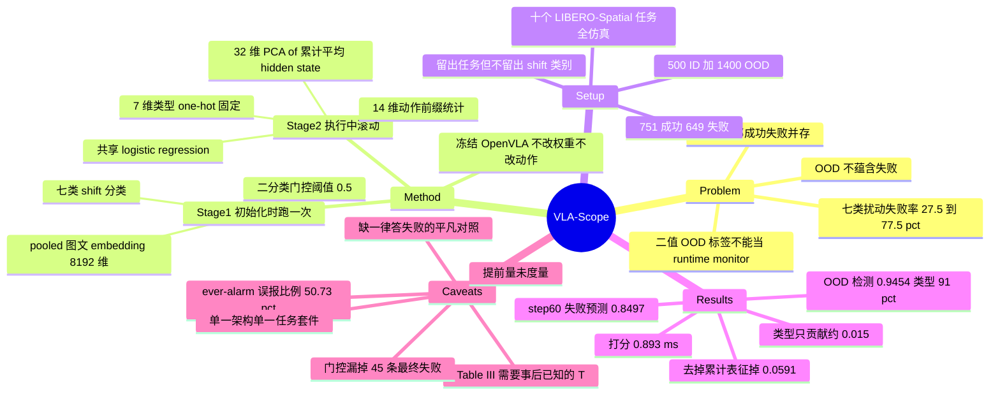

## Summary

VLA-Scope 在冻结的 OpenVLA 外挂一套全部由 logistic regression 构成的两段诊断器：第一段用初始观测的 pooled 图文 embedding 判 ID/OOD 并分七类 shift（ROC-AUC 0.9454、类型准确率 91.00%），第二段把预测出的类型 one-hot、14 维手工动作前缀统计、以及从第 10 步起累计平均的 4096 维 hidden state 的 32 维 PCA 拼成 53 维，送进一个跨类别共享的 logistic regression，在执行途中滚动更新「这条 rollout 最终会不会失败」的风险分。在 LIBERO-Spatial 十任务、1,400 条合成 OOD rollout 上，执行 60 步时 ROC-AUC 0.8497，高于作者自行复现的 ActProbe（0.8132）与 SAFE（0.8055 / 0.7414），单次打分 0.893 ms。真正承重的输入是累计表征（去掉掉 0.0591），而标题主打的 shift 类型只贡献约 0.015。

## Problem & Motivation

出发点是一句成立的观察：**OOD 不蕴含失败**。相机视角变了、背景换了、指令改写了，策略仍可能把任务做完；同一个 OOD 类别里的 rollout 也会有不同结局。因此一个二值 OOD 标签既说不出 shift 是哪一类，也说不出这次执行会不会崩——把 OOD detector 当 runtime monitor 用，在告警口径上是错配的。论文用自己的数据把这句话量化了：七类扰动的失败率从 Layout 的 27.5% 到 Camera 的 77.5%，每类 200 条 rollout，且**每一类里成功与失败都存在**（C15、C18）。

作者据此把问题拆成两问——初始输入偏到哪里去了，以及这条正在跑的 rollout 最终会不会失败。前者是 OOD 文献的地盘（MSP、energy、Mahalanobis 距离，以及 Farid et al. 把分布偏移接到策略性能界违反上的 task-driven 变体），后者是 runtime monitor 的地盘（Sentinel 的一致性+进度监控、FIPER 的观测新颖度+动作熵、FAIL-Detect 把失败检测做成序列 OOD 并用 conformal prediction 校准阈值、SAFE 在内部特征上训 MLP/LSTM、ActProbe 用动作幅值与时序一致性喂指令条件化的循环模型）。论文的定位是把这两段接起来，并检验**动作行为与内部表征是否互补**——前者概括「已经发出了什么命令」，后者编码「生成这些命令时看到和读到了什么」。

## Method

整套方法在冻结的 OpenVLA 之外，没有任何神经网络：三个 scikit-learn logistic regression 加一次 PCA（C11）。

**Stage 1 — OOD Characterizer（只在初始化时跑一次）。** 取动作执行前的 token embedding，图像 token 与有效文本 token 分别 mean-pool（各 4096 维，排除 BOS），拼成 8192 维的 z₀。两个独立训练的 logistic regression 共用这个向量：二分类器输出 OOD 概率 d(z₀) 作为门控分数，阈值 τ_OOD = 0.5；类型分类器在 Background / Camera / Language / Light / Noise / Layout / Robot 七类里取 argmax。两者都用 class-balanced 权重；二分类器把图像特征留作未标准化、标准化后的文本特征乘 0.005（开发期固定的手工配比）。**门控只在这里出现一次，此后整条 rollout 的类型不再更新**——中途才出现的 shift 对 Stage 1 不可见；被判为 ID 时系统不给风险分，论文明确声明这不等于预测成功（C17）。

**Stage 2 — Failure Risk Predictor（执行中滚动更新）。** 三路输入拼成 53 维：

- **7 维类型 one-hot** e(ĉ)，整条 rollout 内固定，在线性模型里等价于一个加性截距偏移。
- **14 维动作前缀统计** sₖ：对 6 个平移/旋转分量各算前缀内的平均绝对幅值 m 与相邻命令平均变化量 v（共 12 维），加上平均 gripper 命令 ḡ 与 gripper 翻转率 ρ。用的是**反量化后、控制器 clip 与缩放之前**的解码命令值。
- **32 维累计表征** rₖ：每步保留生成该动作那次前向中最后一个 prompt token 位置的末层 hidden vector hᵢ（4096 维），从第 10 步累计平均到当前步 k，再经训练集拟合的标准化 + PCA 压到 32 维。h̄₁₀ = h₁₀，此后只并入执行中已产生的表征。

53 维标准化后进一个跨全部七类**共享参数**的 logistic regression（L2，C=1），输出 p̂ₖ。因为是线性的，任意两步之间的 logit 差可以精确拆成「动作统计贡献」与「累计表征贡献」两项——这是论文选线性模型的显式理由之一。

**训练/评测协议。** k_min = 10；对一条跑了 T 步的 rollout，训练用 k = 10 … T−1 的每一个前缀，标签一律是最终结局 y，每个前缀权重 1/(T−10) 使每条 rollout 总权重相等。十折 leave-one-group-out，每折留出**一整个任务**；全部预处理只在训练任务上拟合。

## Key Results

**环境与数据。** 冻结的 OpenVLA checkpoint（在同十个 LIBERO-Spatial 任务上微调过），224×224 RGB。每条 rollout 先 10 步 settling（不计数）再最多 220 步策略动作，环境报成功或耗尽预算即终止。扰动用 LIBERO-Plus 的类别与素材、按作者自己的采样协议生成：每任务 50 条 ID + 每任务每类 20 条 OOD = 500 ID + 1,400 OOD = 1,900 条初始输入；OOD rollout 里 751 成功 / 649 失败（C6、C21）。**全部实验在仿真中完成，无真机、无第二种 VLA 架构。**

**Stage 1（Table I）。** ID/OOD 检测 ROC-AUC 0.9454，TPR 84.57% / FPR 6.20%；类型分类准确率 91.00%、macro-F1 0.9123。分类别检测 TPR 差异很大：Camera 100.00% 最高、Layout 61.00% 最低（C1、C14）。只用 ID 表征的 cosine 1-NN 对照拿到 0.8176，但论文同时说明监督分类器「用到了距离基线拿不到的 OOD 训练样本」（C18）。输入消融（Table V）：Image-only 0.8827 / 88.14%，Text-only 0.5714 / 27.14%（接近随机），Image+Text 0.9454 / 91.00%；语言输入把 Language 类的检出从 18/200 拉到 170/200、类型正确从 157 拉到 200，代价是 Layout 检出从 133 掉到 122（C13）。

**Stage 2 主表（Table II，全部 1,400 条 OOD，绕过门控）。**

| Step | 存活成功 | 失败 | ROC-AUC | TPR (%) | FPR (%) | F1 (%) |
|:--|:--|:--|:--|:--|:--|:--|
| 10 | 751 | 649 | 0.6852 | 59.94 | 36.09 | 59.43 |
| 30 | 751 | 649 | 0.7675 | 58.09 | 13.85 | 66.73 |
| 60 | 751 | 649 | 0.8497 | 70.72 | 12.52 | 76.37 |
| 90 | 598 | 649 | 0.9108 | 80.12 | 11.87 | 83.87 |
| 120 | 226 | 649 | 0.9235 | 86.44 | 15.93 | 90.05 |
| 160 | 25 | 649 | 0.8395 | 92.76 | 52.00 | 95.25 |
| 200 | 7 | 649 | 0.8759 | 95.99 | 57.14 | 97.65 |

只有前三行（step 10/30/60）共享同一批 751/649 的 cohort，因此「积累执行证据有用」这个结论只由这三行承担。step 90 之后成功方大量完赛离场，cohort 越来越以失败为主，后四行的 F1 增长不可与前三行并读——论文自己点明了这一点（C8）。

**Table III（回溯式进度口径，1,400 条全留）。** 按每条 rollout 的最终长度 T 取 25% / 50% / 75% / 100% 的进度检查点（100% 即 prefix T−1），ROC-AUC 0.8329 → 0.9186 → 0.9699 → 0.9818。**这组数字需要预先知道 T，运行时拿不到**（C7）。

**Table IV（基线对比与 CPU 打分延迟）。**

| Method | Step 30 ROC-AUC | Step 30 延迟 (ms) | Step 60 ROC-AUC | Step 60 延迟 (ms) |
|:--|:--|:--|:--|:--|
| ActProbe | 0.7601 | 0.703 | 0.8132 | 1.068 |
| SAFE-MLP | 0.7294 | 1.712 | 0.8055 | 3.249 |
| SAFE-LSTM | 0.6867 | 4.501 | 0.7414 | 6.773 |
| VLA-Scope | 0.7675 | 0.608 | 0.8497 | 0.893 |

三个基线都由作者在同一批 rollout、同一外层划分、同一标签上重训，神经基线取三个 seed 均值。step 30 对 ActProbe 只领先 0.0074，step 60 扩到 0.0365——领先集中在较长前缀上，不是全程均匀（C4）。

**消融（Table VI，step 60）。** 去掉累计表征 0.8497 → 0.7906（−0.0591），去掉动作特征 → 0.8344；Actions only 0.7756、Type only 0.6739、Actions + Type 0.7906（C3、C5）。三项动作特征里去掉 translation change 伤得最重（0.7064）；**去掉 gripper 特征反而略微上升**（0.7929 vs 0.7906）（C20）。selected-C 的上下文对照：actions alone 0.7750、instruction context 0.6567、predicted-type context 0.7902。

**几个决定部署价值的次要读数。**
- 门控实际运行时，1,400 条里 216 条拿不到任何风险分，其中含 45 条最终失败；门内 1,184 条的 step-60 ROC-AUC 是 0.8534（C9）。
- 若把告警规则改成「截至 step 60 风险分曾越过 0.5 一次」（这更接近真实 monitor 的行为），召回升到 83.51%，但误报比例同时到 50.73%（C16）。
- 累计平均把相邻打分步之间的平均风险变化从 3.52 个百分点压到 0.70，且没有对输出做平滑（C20）。
- 开销：打分本身 0.608 / 0.893 ms（CPU，表征已缓存，不含模型加载、仿真与特征获取）；Stage 1 的初始表征捕获+池化+门控给策略生成加了 2.15 ms（178.80 → 180.94 ms）（C10）。
- 未发布代码或项目页（C12）。

## Evidence Ledger

| Claim ID | Claim | Type | Source locator | Evidence excerpt | Status |
|:--|:--|:--|:--|:--|:--|
| C1 | OOD 检测 ROC-AUC 0.9454 / TPR 84.57% / FPR 6.20%；类型准确率 91.00% / macro-F1 0.9123 | number | Table I | "0.9454 84.57 6.20 91.00 0.9123" | source-verified |
| C2 | step 60 失败预测 ROC-AUC 0.8497、TPR 70.72%、FPR 12.52%、F1 76.37%，cohort 751 成功 / 649 失败，绕过门控 | number | Table II step-60 行；Abstract | "Evaluated independently of the OOD gate on all 1,400 OOD rollouts" | source-verified |
| C3 | 去掉累计表征 0.8497 → 0.7906（−0.0591）；去掉动作特征 → 0.8344 | number | Table VI；Sec IV-D | "Removing the cumulative representation reduces step-60 ROC-AUC from 0.8497 to 0.7906" | source-verified |
| C4 | step 60 领先 ActProbe 0.8132 / SAFE-MLP 0.8055 / SAFE-LSTM 0.7414；step 30 对 ActProbe 仅 +0.0074；神经基线取三 seed 均值 | comparison | Table IV；Sec IV-A、IV-C | "The gap over ActProbe is small at step 30 (0.0074)" | source-verified |
| C5 | shift 类型贡献有限：Actions only 0.7756 vs Actions+Type 0.7906（+0.015），Type only 0.6739；selected-C 下 0.7750 / 0.6567 / 0.7902 | number | Table VI；Sec IV-D | "0.7750 with actions alone, 0.6567 with instruction context, and 0.7902 with predicted-type context" | source-verified |
| C6 | 全仿真、单一冻结 OpenVLA、十个 LIBERO-Spatial 任务；shift 由 LIBERO-Plus 类别与素材合成 | benchmark-setting | Sec IV-A | "We evaluate a frozen OpenVLA checkpoint fine-tuned on ten LIBERO-Spatial tasks" | source-verified |
| C7 | 预测目标是最终 rollout 结局；k_min=10、预算 220 步；Table III 的进度检查点由最终长度 T 回溯确定，100% 即 prefix T−1 | benchmark-setting | Sec III-C；Sec IV-A；Table III | "y=0 if the environment reports task success within the action budget" | source-verified |
| C8 | Table II 后段 cohort 缩水：存活成功 751 → 598 → 226 → 25 → 7，失败恒为 649 | benchmark-setting | Table II；Sec IV-C | "only seven successes remain at step 200" | source-verified |
| C9 | 门控实际运行时 216/1,400 无风险分（含 45 条最终失败）；门内 1,184 条 step-60 ROC-AUC 0.8534 | number | Sec IV-C | "excludes 216 cases, including 45 eventual failures that receive no risk score" | source-verified |
| C10 | 打分延迟 0.608 / 0.893 ms；Stage 1 给策略生成加 2.15 ms（178.80 → 180.94）；计时不含模型加载、仿真与特征获取 | number | Table IV；Sec IV-E | "increases policy-generation time by 2.15 ms (178.80 to 180.94 ms)" | source-verified |
| C11 | 方法全部是冻结策略之上的 logistic regression + PCA；53 维 = 7 维类型 + 14 维动作 + 32 维 PCA；不改权重也不改动作 | causal-mechanism | Sec III-A / III-B / III-C；Fig 2 | "VLA-Scope reads signals from this process without changing the model weights or its actions" | source-verified |
| C12 | 未发布代码仓库或项目页 | license-code | arXiv abs 页；全文 | abs 页无 code/project 链接；正文无 github 字样；Comments 仅 "9 pages, 3 figures" | source-verified |
| C13 | 输入消融：Image-only 0.8827 / 88.14%，Text-only 0.5714 / 27.14%，Image+Text 0.9454 / 91.00% | number | Table V | "Image only 0.8827 ... Text only 0.5714 ... Image + Text 0.9454" | source-verified |
| C14 | 分类别检测 TPR：Camera 100.00% 最高，Layout 61.00% 最低 | number | Table I 下半表 | "Camera 100.00 ... Layout 61.00" | source-verified |
| C15 | 七类失败率：Camera 77.5 / Robot 67.5 / Noise 52.0 / Language 40.0 / Light 31.5 / Background 28.5 / Layout 27.5，每类 200 条 | number | Fig 1 左栏（400 dpi 渲染）；Sec IV-C 正文仅给两端点 | "ranging from 27.5% for Layout to 77.5% for Camera, with 200 rollouts per category" | source-verified |
| C16 | 「曾越过 0.5 一次」的告警规则到 step 60 得 83.51% 召回但 50.73% 误报比例（542/649 与 381/751） | number | Sec IV-C | "yielding 83.51% recall and a 50.73% false-alarm fraction" | source-verified |
| C17 | OOD Characterizer 只在初始化运行，类型整条 rollout 不更新；判 ID 时不给风险分且不等于预测成功 | causal-mechanism | Sec III-A；Sec III-B | "operates only at initialization, so the predicted category is not updated for shifts arising later" | source-verified |
| C18 | 十折只留出任务、不留出 shift 类别，七类在每折训练与测试两侧都出现；ID-only cosine 1-NN 对照 0.8176 | benchmark-setting | Sec IV-A；Sec IV-B | "but also uses OOD training examples unavailable to the distance baseline" | source-verified |
| C19 | ActProbe 基线吃 execution-side 命令，而本文动作特征用 pre-transform 解码值；基线可在 C∈{0.1,1,10} 里选，本文固定 C=1 | comparison | Sec IV-A Baselines 段 | "using execution-side rather than pre-transform commands" | source-verified |
| C20 | 累计平均把相邻步平均风险变化从 3.52 压到 0.70 个百分点；去掉 gripper 特征 0.7929 高于 Actions+Type 0.7906 | number | Sec IV-F；Table VI | "reduces the mean absolute risk change from 3.52 to 0.70 percentage points" | source-verified |
| C21 | 500 ID + 1,400 OOD = 1,900 初始输入；OOD rollout 751 成功 / 649 失败；Language 200 条类型全对但只有 170 条过门 | number | Sec IV-A；Sec IV-B | "All 200 Language cases receive correct type labels, yet only 170 pass the binary gate" | source-verified |

> 核查说明：草稿另有一条被独立 verifier 判为 `contradicted` 的 claim（把 77.5% 的最高失败率同时安给 Camera 与 Language），已按 Fig. 1 更正为 C15。verifier 的口径校验是决定性的——七类失败率按每类 200 条折算成计数为 155+135+104+80+63+57+55 = 649，正好等于 Table II 的失败总数，另一组读数无法自洽。论文正文只写出 27.5% 与 77.5% 两个端点，中间五个值仅见于矢量图 Fig. 1。
> 另两处原文口径瑕疵：Sec IV-A 字面写作 "50 ID cases and 20 OOD cases per category per task"，照字面读会得到 3,500 条 ID，只有「50 条 ID 按任务计、20 条 OOD 按任务×类别计」的读法才能还原 500/1,400。「全仿真、无真机」这一判断基于缺席——9 页正文没有任何真机章节，但论文本身从未写下「仅仿真」字样。

## Strengths & Weaknesses

**先说这篇最该被记住的一点：它自己的消融否定了自己的标题。** 论文叫 "Shift-Aware"，卖点是把 shift 类别接进失败预测。但 Table VI 给出的账是——承重的是累计表征（去掉掉 0.0591），动作特征次之（去掉掉 0.0153），而 shift 类型在已有动作特征的前提下只值约 0.015（Actions only 0.7756 → Actions+Type 0.7906），单独用类型则只有 0.6739。换句话说，一旦开始读执行证据，「知道偏的是哪一类」基本不再提供额外信息。这不是论文的失误，反而是它最有价值的负面结果，只是被标题和摘要的叙事盖住了：作者在正文把这组数字正面表述为「predicted-type context 在十个任务里的七个排名高于 actions alone」，而没有把 +0.015 这个幅度放到台面上。

**Stage 1 那个 0.9454 的名字起大了。** 这里的「OOD detection」实际上是一个**闭集监督分类问题**：七类扰动由 LIBERO-Plus 的固定生成器产生，而十折交叉验证留出的是**任务**不是**类别**——每一折的训练侧都见过全部七种扰动（C18）。所以 0.9454 回答的是「线性探针能不能在没见过的任务上认出它训练时见过的七个扰动生成器」，而不是「能不能发现一个没见过的偏移」。后者恰恰是部署时唯一会发生的情况，而论文没有留出类别的对照。1-NN 那条距离基线（0.8176）之所以低，论文自己也说明了是因为它拿不到 OOD 训练样本——这句自陈其实已经把整段结论的适用边界写清楚了。

**「提前量」这个词在这篇里是空的。** 预测目标是**最终结局**，不是某个具体失败事件；risk 在 step 60（220 步预算的约 27%）给出，但论文没有任何「提前多少步预警」的度量，也没有把风险上升与实际失败发生的时刻对齐。真正接近 runtime monitor 行为的是那条 ever-alarm 读数：到 step 60 召回 83.51%，误报比例 50.73%（C16）——一半以上最终成功的 rollout 会先收到一次误警。Table II 的 12.52% FPR 是「恰好在第 60 步这一瞬间看一眼」的 FPR，而没有哪个部署系统会这么用。这两个数之间差了四倍，论文诚实地把它报了出来，但它才是该方法的真实工作点。

**Table III 不能当成运行时能力读。** 0.9818 的 ROC-AUC 出现在「进度 100%」，而进度是用**最终长度 T 回溯算出来的**，等价于在 prefix T−1 打分——这是事后分析，不是预警（C7）。同理 Table II 从 step 90 起 cohort 只剩越来越少的成功样本，F1 冲到 90%+ 主要是类别比例在变（C8）。全篇唯一可以拿来论证「积累执行证据有用」的是 step 10/30/60 这三行。

**缺一个零参数对照，而这个对照会吃掉相当一部分头条数字。** 649/1,400 的失败率意味着「一律预测失败」的平凡规则 F1 = 63.35%（这是笔记作者据 C2/C21 的计数推算，不是论文给出的数字）。对照 Table II：step 10 的 59.43% **低于**这条平凡基线，step 30 的 66.73% 只高出 3.4 个百分点，要到 step 60 的 76.37% 才拉开 13 个百分点。ROC-AUC 不受这个问题影响（论文选它当主指标是对的），但 F1 一列在前两个检查点几乎不含信息。这正是 [[EmbodiedAI-Survey]] convergence 第 13 条反复点名的形态。

**基线对比里有一处不对称值得留意。** ActProbe 被喂的是 execution-side 命令，也就是经过控制器 clip 到 [−1,1] 并缩放之后的值；而 VLA-Scope 自己的动作特征用的是 clip 之前的解码值（C19）。ActProbe 的核心特征正是**动作幅值**，而 clip 恰好摧毁的就是幅值信息——被截断的大动作全部压成边界值。论文没有做「给 ActProbe 同样的 pre-transform 输入」这一行对照，所以 step-60 那 0.0365 的领先里，有多少来自累计表征、多少来自输入表示的差异，现有证据分不开。另一侧倒是对基线慷慨的：基线可以在 C∈{0.1,1,10} 里按 step-60 ROC-AUC 调参，本文固定 C=1。

**三篇最该比的工作被引了但没跑。** Sentinel、FIPER、FAIL-Detect 都在 Related Work 里，都没进 Table IV。FAIL-Detect 尤其关键——它把失败检测做成序列 OOD 并用 conformal prediction 做时变阈值校准，是与本文设计正面竞争的方案，而校准阈值恰恰是本文最弱的一环（全程硬编码 0.5）。更直接的遗漏是 Mahato & Ren（arXiv 2606.29699），标题就是 "Early warning signals for OpenVLA failure under visual distribution shift"——同一个底座、同一个问题、同样训线性探针，引了却没比。

**方法本身的简洁是真优点，不该被上面的批评盖掉。** 三个 logistic regression 加一次 PCA，0.6–0.9 ms CPU 打分，策略侧只多 2.15 ms 的初始化开销，底座权重与动作完全不动。线性形式让 logit 差可以精确拆成动作项与表征项，这不是修辞而是可用的诊断接口。与 [[VLA-Survey]] 横切议题四（冻结权重之上的适配层）里的其他成员相比，它还有一个结构性优势：Zetta / Zeva / RobustExecAgenticRL 的共同举证缺口是适配层同时带来了额外的执行步数或交互轮次、而冻结底座没拿到同等预算，**VLA-Scope 完全不干预执行**，所以它的数字不受这个混淆影响——这是这一族里少数能干净归因的工作。

**其他边界。** 累计表征取的是「末层最后一个 prompt token 位置的 hidden vector」，这是 OpenVLA 这类自回归离散 token 策略的结构；flow-matching / diffusion 动作头（π₀ 一族）没有对应的量，摘要里 "general diagnostic framework" 的说法目前只有一个架构的证据（C6）。门控是硬 0.5、跨任务共用、只在初始化跑一次；中途出现的 shift 不可见（C17），而 216 条被门挡下的样本里有 45 条最终失败，即约 6.9% 的失败会**一个分数都拿不到**（由 C9/C21 推算）。最后，论文在几处的诚实值得记一笔：主动点出 cohort 变化、主动报 ever-alarm 的误报率、主动报去掉 gripper 特征反而略好、主动报加入文本会让 Layout 检出下降——这在一篇 9 页的短文里不常见。

## Mind Map

## Connections

- [[2609-EarlyEval]] —— 同一问题形状在 agent 域的镜像，最值得并读。EarlyEval 也是把轨迹展成前缀、每个前缀继承最终标签、按 1/(T+1) 加权使每条轨迹等重、用树模型而非 LLM judge 以换取亚毫秒推理——连训练配方都几乎逐条对应（VLA-Scope 用 1/(T−10) 与 logistic regression）。两者独立收敛到「手工特征加轻量判别器足够」这一结论，是比任一篇单独主张更强的证据。差别在目的与代价结构：EarlyEval 拿预测去**替代**真实结果以省钱，因此必须守住 Δ|Pass@1|；VLA-Scope 拿预测去**预警**，因此该守的是提前量与误报率，而这两项恰恰都没有被正面度量。EarlyEval 还给 VLA-Scope 指出了一个缺失的对照：它做了 leave-one-agent-out 却坦承没留出 task，VLA-Scope 留出了 task 却没留出 shift 类别——两篇在同一处栽了对称的跟头（泛化轴选错了一维）。

- [[2609-FailBench]] —— VLA-Scope 的监督信号上游。这里的标签来自仿真器报告的 success，免费且准确；FailBench 则测出真机/离线视频场景下「判定这次操作成没成」本身最好只有 0.77 macro balanced accuracy，且五个专门微调的失败检测器全部低于各自基座，最高的已发表分数 0.806 与「一律答失败」的 0.797 几乎无差。把 VLA-Scope 这类 outcome-supervised predictor 搬到真机，训练标签就换成了这个 0.77 的判定器——标签噪声会直接侵蚀 0.85 的 ROC-AUC，而论文完全没有讨论标签来源的可迁移性。FailBench 的「一律答失败」对照也正是 VLA-Scope 缺的那一条（见 Strengths & Weaknesses 的推算）。

- [[2607-VLACorrector]] —— 同一回路的下游半段。VLACorrector 做 detect-then-correct：外挂约 40M 的 latent-space vision monitor 在线检测视觉动态偏差，触发后截断剩余 action chunk 并用 online gradient guidance 引导下一次去噪，等效于事件触发的自适应 action horizon。VLA-Scope 只出分不干预。拼起来才是完整的「监测—干预」闭环，但时间尺度对不上：VLACorrector 的干预粒度是单个 chunk（几步到十几步），而 VLA-Scope 要到 step 60 才拿到可用的 ROC-AUC（step 10 时只有 0.6852，F1 还低于平凡基线）。这个时间尺度错配是把两者接起来的第一道障碍，也提示「预测最终结局」与「及时干预」可能根本是两个任务。

- [[2608-Zetta]] —— [[VLA-Survey]] 横切议题四里最接近的邻居，对照很干净。Zetta 在冻结 π0.5 / GR00T N1.5 外套一层代码化的运行时 critic，监控在动作频率上读谓词信号并触发 bounded retry 与演化出的恢复技能。两条路线的分歧点正好落在可部署性上：Zetta 的监控信号里含官方 grasp predicate，真机上不可得；VLA-Scope 的信号全部来自策略自身的前向（动作命令与 hidden state），真机可得，但代价是需要一批带最终成败标签的 rollout 来训练。另一处反差是归因质量——Zetta 全文无 component-level 消融、baseline 没拿到同等执行预算，而 VLA-Scope 因为**完全不干预执行**，天然不存在预算配平问题，Table VI 的逐项消融也做得齐全。

- [[2608-CofactVLA]] / [[2608-GSRParaVLA]] —— 机制侧的互补。这两篇争论的是 VLA 语言鲁棒性的失效定位（「语义保住了、路由坏了」vs「语义根本没进来」），VLA-Scope 则给出一个纯频率侧的旁证：在它这批 LIBERO-Plus 合成扰动下，Language shift 的失败率 40.0%，排第四，远低于 Camera 的 77.5% 与 Robot 的 67.5%——视角与机器人初始化的扰动比指令改写伤得更重。这与两篇把语言鲁棒性当作核心病灶的叙事张力不大，但提醒了口径差异：GSRParaVLA 的 LIBERO-Para 是**只改措辞、不改物理**的系统性改写，而 LIBERO-Plus 的 Language 轴是另一套扰动生成器，两者的「语言 shift」不是同一个量。CofactVLA 同样基于 LIBERO-Plus，其每任务 1 episode 的预算问题在这里不存在（每类 200 条 rollout），可以作为该 benchmark 上样本量更充分的一个参照点。

- [[2604-VLASafety]] —— VLA safety 综述列出的 open problem 里，runtime monitoring 与 OOD-aware deployment 正是本文所在的格子；本文可以作为该综述「检测侧」的一个具体实例补充，但它只做诊断不做缓解，覆盖不到威胁模型的另一半。

- [[2406-OpenVLA]]（被诊断的底座）、[[2609-LatentInterfaceTraining]]（LIBERO-Plus 口径注意事项：Overall 为七轴非加权均值、需设 `LIBERO_PLUS_FIX_LANG` 才可比——本文只用 LIBERO-Plus 的素材与类别做自己的采样协议，不报 LIBERO-Plus 官方分数，故不涉及该口径坑，但引用其「七类扰动」时应说明是自采样而非官方划分）。

## Notes

- **vault 在 VLA runtime failure detection 这条线上基本是空的。** 全库检索不到 SAFE、SAFECAST、ActProbe、FAIL-Detect、Sentinel、FIPER 任何一篇的笔记，只有 [[2609-FailBench]]（判定器本身的误差）与 [[2607-VLACorrector]]（检测+纠正）两个孤点。VLA-Scope 的 Related Work 把这六篇一次性列全了，是一份现成的补读清单；按重要性排，FAIL-Detect（序列 OOD + conformal 阈值校准）与 SAFE（NeurIPS，多任务失败检测，本文基线）应当优先。

- **最该被追问的实验，论文没做：留出 shift 类别而非留出任务。** 现在十折留的是任务，七类扰动在训练侧全部见过（C18），所以 0.9454 衡量的是闭集识别而非开集检测。把协议改成 leave-one-category-out（用六类训、在第七类上测），Stage 1 还剩多少 ROC-AUC，Stage 2 在未见类别上的风险分还能不能用——这两个数字才决定这套东西能不能部署，而数据全部现成，成本几乎为零。这也是 [[EmbodiedAI-Survey]] Open Problem 7 讲的「换评测轨迹分布而非换任务就能恢复鉴别力」在检测侧的对应版本。

- **第二个缺口是阈值。** 全程硬编码 τ_OOD = 0.5 与 p̂ ≥ 0.5，跨任务共用、不随执行步变化。而 Table II 显示同一个 0.5 在 step 10 给出 36.09% FPR、在 step 60 给出 12.52%、在 step 160 又回到 52.00%——同一个阈值在不同前缀长度上的含义完全不同。FAIL-Detect 用 conformal prediction 做时变阈值正是针对这一点。给 VLA-Scope 配一层按步长校准的阈值，大概率比再加特征更划算，而且是一个纯后处理的改动。

- **「最终结局预测」与「及时预警」可能应该拆开。** 本文把两者混为一谈：目标函数是最终 y，但叙事按 runtime monitor 写。这两个任务的最优解未必一致——一个在 step 200 才收敛的准确预测对干预毫无价值，而一个在 step 15 就报出「抓空了」的粗糙信号可能更有用。可操作的检验是给每条失败 rollout 标注**失败事件的实际发生步**（LIBERO 里可从谓词状态反推），然后报 lead time 分布而非某个固定 step 的 AUC。这会把 Table III 那种需要事后已知 T 的口径彻底替换掉。

- 一个顺手的延伸：本文用的是「最后一个 prompt token 位置的末层 hidden vector 的累计平均」，而累计平均本身是在做一个极低通的时序滤波（也正是 3.52 → 0.70 pp 稳定性提升的来源，C20）。既然线性模型已经证明这条通路承载了主要信息（−0.0591），一个自然的问题是**平均是不是最优的聚合**——指数加权、多尺度窗口、或者干脆保留几个分位点，成本都在同一量级。论文比较了「累计平均 vs 当前步融合」两种，中间的整片设计空间没扫。
