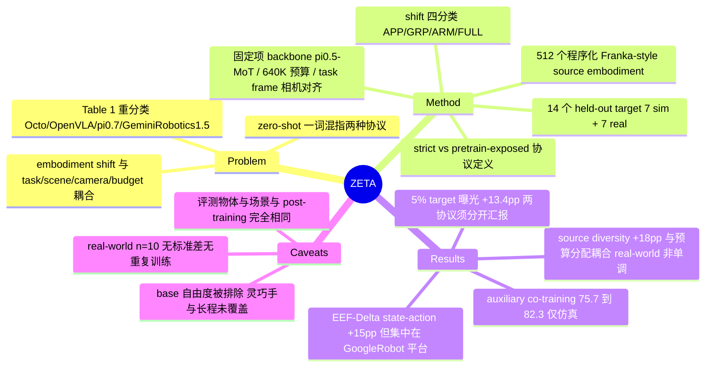

## Summary

ZETA 把文献里混用的 "zero-shot cross-embodiment transfer" 拆成两种协议——strict（target embodiment 不出现在任何训练数据）与 pretrain-exposed（只出现在 pretraining、不出现在 post-training）——并在 backbone、640K 预训练预算、source-only post-training、评测场景与相机全部对齐的条件下，用 14 个 held-out target embodiment（7 个 simulation + 7 个 real-world）逐一测量四个设计因子。结论是 local EEF-Delta state/action、source embodiment 多样性、auxiliary co-training 分别把 strict transfer 平均提升约 15 / 18 / 7 个百分点，而只要在 pretraining 里掺 5% target 数据就再拿 13.4 个百分点，说明两种协议的难度不同、必须分开汇报。

## Problem & Motivation

Cross-embodiment 泛化是 VLA 的核心诉求，但这个领域至今说不清自己在测什么。作者指出两个具体障碍。

第一是术语。同一个 "zero-shot" 标签下藏着两种难度差异很大的设定：有的工作让 target robot 完全不出现在训练数据里，有的只是把它排除在 task-specific post-training 之外，而它早已在 pretraining 里出现过。论文用 Table 1 把代表性工作按这条轴重新分类：LAP、Cloak、RDT2 属于 strict；Octo、π0.7、Qwen-RobotManip、[[2406-OpenVLA|OpenVLA]]、[[2510-GeminiRobotics15|Gemini Robotics 1.5]] 属于 pretrain-exposed；Being-H0.5 报告的是 unseen task–embodiment pair，两种协议都不属于。

第二是归因。现有评测把 embodiment shift 和 task、scene、camera、data quantity、protocol 的差异同时改掉，一旦性能下降就无法判断责任在哪。ZETA 的应对是把研究范围收窄到 stationary tabletop manipulation + two-finger gripper，用这个"窄但可控"的 regime 换取每个因子的独立测量。

## Method

**协议定义**。两种协议共用同一份 post-training 数据 `D_post = D({e_s}, T_post)`，都在 target embodiment `e_t` 上评测同一批 downstream 任务，区别只在 `e_t` 是否属于 `E_pre`。两者都强制 `T_pre ∩ T_post = ∅`，所以 target 的 downstream 任务在任何阶段都没被训练过。

**Embodiment shift 四分类**。appearance-only（只改外观）、gripper-only（只换末端）、arm-only（只换手臂形态与运动学）、full-embodiment（两者都换）。simulation 的 source 是 Franka，7 个 target 依次是 Franka+logo、Franka+green、Franka+UMI、UR5e+Franka hand、GoogleRobot+Franka hand、UR5e+UMI、GoogleRobot；real-world 的 source 是 Franka-Robotiq，7 个 target 覆盖到 humanoid 与 Piper-on-Quadruped。

**四个被操纵的变量**。state-action representation（Abs. EEF 或 EEF-Delta state × World-Delta 或 EEF-Delta action，共四种组合）；source embodiment 数量；auxiliary co-training 目标（language-action 的 EEF-frame 与 both-frames 变体、subgoal prediction、task-conditioned bounding box）；pretraining 中的 target 数据占比。论文顺带指出 state-free policy 可以看成 `h=0` 时的退化 EEF-Delta state，因为此时 history 只剩恒等变换、不携带信息。

**被固定的变量**——这份清单是论文价值的实际载体：backbone 为 π0.5 式 Mixture-of-Transformers（见 [[2504-Pi05|π0.5]]），视觉输入 224×224 的 wrist + third-person 双视角、4 步 state history、12 步 action chunk、flow-matching loss；pretraining 640K trajectory、batch 320、16×H800、120K steps，post-training batch 160、8×H800、100K steps；simulation post-training 每任务 40K trajectory × 3 任务，real-world 每任务 50 demo × 2 任务，且全部采自同一台 source Franka。third-person 相机外参在一个与机器人无关的 tabletop task frame 里跨 robot 完全一致，wrist 相机在各自 gripper frame 里对齐（real-world 只做到"近似一致"）；lighting、背景、桌面材质、workspace 布局跨 embodiment 相同；**评测用的物体就是 post-training 里那批物体实例本身**，不引入任何 object-identity shift。

**Source pool 的构造方式**。512 个 source embodiment 由单一 Franka-style 桌面臂模板 procedurally generate：六段可动 link 按约 0.7–1.3 缩放、gripper 手指长宽厚与 fingertip 采样、contact plank 几何随机、每个 embodiment 分配一组 6–8 色的低饱和调色板。7 台商用测试机器人作为外部 held-out target 被排除在这个池子之外。pretraining 还叠加了大量 domain randomization（1000+ 材质、Objaverse 筛出的 10000+ 物体、相机外参与光照随机化、质量与摩擦随机化）。

**指标**。每条 rollout 打 `s ∈ {0, 0.5, 1}`，接触到任务相关物体给 0.5、完成给 1。聚合用 macro-average：先按 task 平均，再在四个 shift category 内部按 robot 平均，最后取四类的算术平均。

## Key Results

**RQ1 · state-action representation（simulation，Table 3，均值 ± 3 次训练的标准差）**

| State | Action | e_s | APP | GRP | ARM | FULL | Average |
|:--|:--|--:|--:|--:|--:|--:|--:|
| Abs. EEF | World-Delta | 87.7 ± 2.1 | 86.3 ± 1.3 | 82.6 ± 1.7 | 38.5 ± 0.8 | 33.9 ± 2.3 | 60.3 ± 1.1 |
| Abs. EEF | EEF-Delta | 92.6 ± 1.0 | 91.8 ± 1.1 | 88.2 ± 2.6 | 39.9 ± 0.5 | 38.6 ± 0.8 | 64.6 ± 0.4 |
| EEF-Delta | World-Delta | 87.8 ± 1.4 | 88.0 ± 0.9 | 77.2 ± 1.0 | 69.8 ± 1.9 | 58.4 ± 1.3 | 73.4 ± 0.7 |
| EEF-Delta | EEF-Delta | 91.5 ± 0.6 | 90.0 ± 1.1 | 78.3 ± 2.4 | 74.3 ± 0.9 | 60.4 ± 0.9 | 75.7 ± 1.3 |

`e_s` 列是 within-embodiment 的 positive control：source Franka 在四种配置下都在 87.7–92.6 之间，所以 target 上的下降可以归因到 embodiment shift 而不是策略本身没学会。60.3 → 75.7 就是摘要里的"约 15 个百分点"。但增益分布极不均匀：ARM 与 FULL 各涨 35.8 与 26.5，APP 只涨 3.7，GRP 反而从 82.6/88.2 掉到 77.2/78.3。论文自己在 §5.6 承认了这一点——"absolute EEF state with EEF-Delta actions can remain competitive when the shift is limited to the end effector or appearance"。

real-world RQ1（Table 4，每格 10 次试验、单次训练、无标准差）：四种配置平均分为 56.0 / 61.6 / 60.8 / 89.9，(EEF-Delta, EEF-Delta) 领先幅度远大于 simulation。同一张表里 (Abs. EEF, EEF-Delta) 的 FULL 列是 16.3，低于 (Abs. EEF, World-Delta) 的 21.3，与 simulation 的排序不一致。

**RQ2 · source embodiment 多样性**。固定 640K 总预算时，per-embodiment 数据从 1 source 的 640K trajectory 掉到 512 source 的每个 1,250 条；simulation 上 512-source 比 single-source 高约 18 个百分点，增益集中在 GRP / ARM / FULL。real-world 出现非单调：8 sources 时 arm-only 与 full-embodiment 反而低于 single-source，到 512 sources 才恢复。另一组固定 per-embodiment 预算的 sweep（32 / 128 / 512 sources，总预算随之增长）在 simulation 与 real-world 都单调上升。结论是 source diversity 与 budget allocation 是耦合变量，不能假定"source 越多越好"。

**RQ3 · auxiliary co-training（simulation only，Table 5）**

| Post-train data | e_s | APP | GRP | ARM | FULL | Average |
|:--|--:|--:|--:|--:|--:|--:|
| No co-training | 91.5 ± 0.6 | 90.0 ± 1.1 | 78.3 ± 2.4 | 74.3 ± 0.9 | 60.4 ± 0.9 | 75.7 ± 1.3 |
| Language-action (eef-frame) | 90.5 ± 1.1 | 88.6 ± 0.2 | 86.7 ± 1.4 | 79.3 ± 0.9 | 70.5 ± 0.5 | 81.3 ± 0.5 |
| Language-action (both frames) | 89.5 ± 1.5 | 88.6 ± 0.4 | 79.8 ± 0.8 | 73.8 ± 1.6 | 68.4 ± 1.5 | 77.7 ± 0.3 |
| Subgoal | 89.1 ± 1.8 | 90.3 ± 0.8 | 87.4 ± 2.2 | 77.8 ± 0.5 | 71.5 ± 1.5 | 81.8 ± 0.8 |
| Task-conditioned BBox | 90.4 ± 1.4 | 90.2 ± 0.4 | 87.0 ± 0.9 | 80.1 ± 0.8 | 71.9 ± 1.4 | 82.3 ± 0.2 |

四种辅助目标都比 imitation-only 好，三种最好的落在 81.3–82.3 的窄带内，彼此差距接近标准差。真正超出噪声的是 language-action 内部的对比：EEF-frame 变体 81.3 明显高于 mixed-frame 的 77.7，与 RQ1 偏好的 local EEF 语义一致。

**RQ4 · target exposure**。在 640K 总预算内用 target 数据置换 source 数据。只掺 5% 就把 UR5eUMI 从 69.3 拉到 78.6、GoogleRobot 从 51.4 拉到 68.9（平均 +13.4），是边际收益最大的一档；继续加到 30% / 100% 收益明显递减。task-averaged 曲线始终低于 target post-training oracle，说明 pretraining 曝光缓解但不消除 target-task adaptation 的需求。Table 6 显示 5% 曝光会把四种 representation 的差距大幅压平（0% 时 33.9–60.4，5% 时 66.9–71.1），也就是说 representation 的选择主要在 strict 设定下才关键。

## Evidence Ledger

| Claim ID | Claim | Type | Source locator | Evidence excerpt | Status |
|:--|:--|:--|:--|:--|:--|
| C1 | (EEF-Delta, EEF-Delta) 平均 75.7 vs (Abs. EEF, World-Delta) 60.3，差约 15 pp | number | Table 3 / §5.2 | "Abs. EEF World-Delta … 60.3 ± 1.1"; "EEF-Delta EEF-Delta … 75.7 ± 1.3" | source-verified |
| C2 | 换成 EEF-Delta state 后 ARM 从 38.5–39.9 升到 69.8–74.3，FULL 从 33.9–38.6 升到 58.4–60.4 | number | Table 3 / §5.2 | "raises arm-only transfer … and full-embodiment transfer from 33.9–38.6% to 58.4–60.4%" | source-verified |
| C3 | 固定 640K 预算下 512-source 比 single-source 高约 18 pp | number | §1 Introduction | "the 512-source setting … outperforms the single-source model by around 18 percentage points" | source-verified |
| C4 | auxiliary co-training 把平均从 75.7 提到 77.7–82.3，BBox 最高 82.3 | number | §5.4 / Table 5 | "raising average progress from 75.7% to 77.7–82.3%"; "Task-conditioned BBox … 82.3 ± 0.2" | source-verified |
| C5 | 5% target 数据带来 +13.4 pp；UR5eUMI 69.3→78.6，GoogleRobot 51.4→68.9 | number | §5.5 / Abstract | "improving UR5eUMI from 69.3% to 78.6% and GoogleRobot from 51.4% to 68.9%" | source-verified |
| C6 | benchmark 含 14 个 held-out target embodiment（7 sim + 7 real） | benchmark-setting | Abstract / §1 / Tables 9–11, 21–24 | "a controlled benchmark spanning 14 held-out target embodiments across simulation and real-world validation" | source-verified |
| C7 | 每模型 simulation 6,300 rollout（3×7×100×3），real-world 140 rollout（2×7×10） | benchmark-setting | §5.1 Metrics and evaluation scale | "yielding 3×7×100×3=6300 simulation rollouts per model"; "yielding 2×7×10=140 real-world rollouts per model" | source-verified |
| C8 | 512 个 source embodiment 由单一 Franka-style 模板 procedurally generate，link 缩放约 0.7–1.3，非 512 台真实机器人 | benchmark-setting | Appendix D | "512 source embodiments are procedurally generated from a Franka-style tabletop arm template … spanning approximately 0.7–1.3" | source-verified |
| C9 | 评测物体就是 post-training 用的同一批实例；sim 场景与相机跨 robot 严格一致，real-world 相机仅"近似一致" | benchmark-setting | Appendix F.2 / F.3 | "the evaluation objects are exactly the same object instances as those used in the corresponding post-training data" | source-verified |
| C10 | GoogleRobot / humanoid / Piper-on-Quadruped 的 base state 与 base command 被排除在模型输入输出之外 | benchmark-setting | Appendix E.1, E.2 | "mobile-base states and commands are not included in the model inputs or outputs" | source-verified |
| C11 | 存在 within-embodiment positive control：Table 3 的 e_s 列为 87.7–92.6，Table 4 的 e_s 列为 87.5–100.0 | number | Table 3; Table 4 | "State Action e_s APP GRP ARM FULL Average"; real-world e_s "87.5 … 90.0 … 85.0 … 100.0" | source-verified |
| C12 | serving-sausages 表中 Abs. EEF state 下 GoogleRobot 平台的两个 target 得分近 0，同列 UR5e 平台 target 在 58.6–76.8 | number | Table 9 (Appendix C) | "Google+Franka 0.0/ 0.0/ 0.0 2.0/ 1.0/ 1.0"; "GoogleRobot 1.0/ 1.0/ 0.0 0.0/ 1.0/ 0.0" | source-verified |
| C13 | backbone 为 π0.5 式 MoT；pretrain batch 320 / 16×H800 / 120K steps，post-train batch 160 / 8×H800 / 100K steps | benchmark-setting | Appendix I | "Pretraining uses batch size 320 on 16 H800 GPUs for 120K steps, and post-training uses batch size 160 on 8 H800 GPUs" | source-verified |
| C14 | real-world 实验的 pretraining 数据来自 simulation 生成的 512-embodiment 池，真实数据只用于 post-training（每任务 50 demo，2 个任务）与评测 | benchmark-setting | §4.2 / Table 8 / Appendix F.5 | "For real-world post-training, we use two tasks … with 50 demonstrations per task" | source-verified |
| C15 | real-world Table 4：四种 representation 平均 56.0 / 61.6 / 60.8 / 89.9；(Abs. EEF, EEF-Delta) 的 FULL 列 16.3 低于 (Abs. EEF, World-Delta) 的 21.3 | number | Table 4 / §5.2 | "Abs. EEF World-Delta 87.5 87.5 67.5 47.5 21.3 56.0 Abs. EEF EEF-Delta 90.0 90.0 80.0 60.0 16.3 61.6" | source-verified |
| C16 | appearance-only target 的绿色与 logo 橙饱和度为 0.77 / 0.99，source palette 最高 0.46；原文称不应视作强 OOD 外观偏移 | benchmark-setting | Appendix D / Figure 8 | "saturation values of 0.77 and 0.99 … compared with a maximum saturation of 0.46"; "should not be interpreted as strongly out-of-distribution appearance shifts" | source-verified |
| C17 | Table 1 把 LAP / Cloak / RDT2 归为 strict，Octo / π0.7 / Qwen-RobotManip / OpenVLA / Gemini Robotics 1.5 归为 pretrain-exposed，Being-H0.5 两者皆非 | sota-novelty | Table 1 / §3 | "LAP ✗ ✗ Strict Cloak ✗ ✗ Strict RDT2 ✗ ✗ Strict Octo ✓ ✗ Pretrain-exposed"; "Being-H0.5 ✓ ✓ Unseen task–emb. pair" | source-verified |
| C18 | real-world RQ2 非单调：8 sources 时 arm-only 与 full-embodiment 低于 single-source，512 sources 才恢复 | number | §5.3 / Fig. 5(b) / Tables 23–24 | "with 8 sources, arm-only and full-embodiment transfer falls below the single-source setting before recovering at 512 sources" | source-verified |
| C19 | RQ3 只在 simulation 评测，无 real-world 验证 | benchmark-setting | §5.4 / Table 8 | "We evaluate these variants in simulation because several objectives require annotations beyond standard demonstrations" | source-verified |
| C20 | real-world 结果不报标准差、不做重复训练；标准差只定义在 simulation 的 3 次独立训练上 | benchmark-setting | Tables 4, 21–24 / Appendix F.4 | "Each entry reports mean task progress (%) over 10 rollouts"; std defined "For simulation experiments with three independent training runs" | source-verified |
| C21 | 论文未提供公开代码仓库或 project page | license-code | arXiv abs 页 + 全文 | 全文与 abs 页均无非 arXiv 的代码/项目链接 | source-verified |
| C22 | task-progress 指标离散化为 s ∈ {0, 0.5, 1}，接触任务相关物体记 0.5 | benchmark-setting | Appendix F.4 | "Each rollout is assigned a task-progress score s∈{0,0.5,1}" | source-verified |
| C23 | RQ2 用两套预算控制；固定总预算下 per-embodiment 数据从 640K 条降到每个 1,250 条 | benchmark-setting | Table 8 / §5.3 | "decreases from 640K trajectories … to 1,250 trajectories per embodiment" | source-verified |
| C24 | 三个 simulation 任务的两个 Abs. EEF 列共 18 个 per-run entry 中，GoogleRobot 平台两个 target 最高只有 10.0；同列 UR5e 平台最低 58.6 | number | Tables 9, 10, 11 (Appendix C) | "Google+Franka 2.0/ 10.0/ 2.0 3.0/ 2.0/ 3.0"; "UR5e+UMI 69.7/ 60.6/ 58.6 …" | source-verified |
| C25 | EEF-Delta state 在 gripper-only 类别上是负收益：82.6→77.2、88.2→78.3 | number | Table 3, GRP 列 | "Abs. EEF World-Delta … 82.6 ± 1.7"; "EEF-Delta World-Delta … 77.2 ± 1.0" | source-verified |
| C26 | serving-sausages 单任务上 oracle 低于 100% pretrain-exposed（两个 target 的三次运行皆然）；但 task-averaged 曲线仍在 oracle 之下，与正文表述不冲突 | number | Table 18 (Appendix C) | "Pretrain-exposed (100%) 89.9/ 84.8/ 85.9 73.7/ 68.7/ 71.7 Target post-training oracle 83.8/ 78.8/ 80.8 69.7/ 62.6/ 60.6" | source-verified |

## Strengths & Weaknesses

**控制确实是真的，这是本文最稀缺的部分。** 大多数声称 cross-embodiment 的 VLA 工作同时改动数据、任务、相机与架构，ZETA 把这些逐项钉死：同一 backbone、同一 640K 预训练预算、同一份 source-only post-training 数据、同一优化 schedule、`T_pre ∩ T_post = ∅`、third-person 相机外参在与机器人解耦的 task frame 里跨 robot 完全一致、连评测物体都是 post-training 那批实例本身。更关键的是它带 positive control——`e_s` 列在 simulation 87.7–92.6、real-world 87.5–100.0（C11）。没有这一列，任何 target 上的低分都无法区分"迁移失败"和"策略根本没学会"，而这是同类研究最常缺的一环。simulation 侧每模型 6,300 次 rollout、3 次独立训练并报标准差（C7、C20），也把 seed noise 与效应量分开了。

**协议 taxonomy 是比数字更耐用的贡献。** Table 1 不是综述式罗列，而是对现有文献用词的一次审计：Octo、OpenVLA、π0.7、Gemini Robotics 1.5 被重新归为 pretrain-exposed，Being-H0.5 被判定落在两种协议之外（C17）。RQ4 用 +13.4 pp 给这个区分标了价（C5）——把两种协议混着报，等于把一个十几个百分点量级的自由度留给作者自行处置。这一条应当直接进入 vault 读 cross-embodiment 论文时的检查清单。

**"15 pp" 这个头条数字的内部结构比它本身更值得注意。** 按 Table 3 与 Tables 9–11 反推（笔者推算，非原文给出），15.4 pp 的平均增益分解为 APP +3.7、GRP −4.3、ARM +35.8、FULL +26.5。ARM 与 FULL 各只含两个 target，其中一个都是 GoogleRobot 平台。在 Abs. EEF state 下 Google+Franka 与 GoogleRobot 在全部 18 个 per-run entry 里最高只有 10.0 分，属于彻底失效而非性能退化（C24）；换成 EEF-Delta state 后升到 50–79。同样条件下 UR5e+Franka 只从约 75 升到约 80，UR5e+UMI 从约 67 升到约 69，gripper-only 的 Franka+UMI 还倒退 4.3 分（C25）。也就是说，平均增益基本由"抢救两个 GoogleRobot 平台"贡献。这带来一个不同的机制解读：GoogleRobot 是 mobile manipulator，base frame 约定与 Franka 差别很大，绝对 base-frame EEF pose 直接落到分布外——那更像坐标记账问题，而不是"local 表示天然更可迁移"。论文的实用建议不受影响，但它作为机制证据的强度应当按这个分解来读，而不是按平均值。

**real-world 部分的统计功效撑不起它承担的角色。** 每个 task–embodiment 格子 10 次试验、2 个任务、单次训练、无标准差（C7、C20），而指标本身量化到 {0, 0.5, 1}，单格分辨率就是 5 分。Table 4 里 89.9 vs 56.0–61.6 的差距远大于 simulation 的 75.7 vs 60.3；同一张表里 (Abs. EEF, EEF-Delta) 的 FULL 列 16.3 反而低于 World-Delta 的 21.3（C15），排序与 simulation 相反。real-world RQ2 的 Piper-on-Quadruped 在 1/8/512 sources 下走 90.0 → 45.0 → 80.0，这种幅度在 n=10 时无法与噪声区分。论文把 real-world 定位为 external-validity check 是恰当的，但读者不应把 real-world 的具体数值当作独立于 simulation 的第二组证据。还要注意 real-world 模型的 pretraining 仍然全部来自仿真池（C14），所以它验证的是"sim 预训练 + 真机 post-training"这条 recipe，而不是在真实数据预训练的模型上复现同一结论。

**受控设计的代价是结论的适用域比标题窄。** 评测沿非 embodiment 轴被刻意做简单：同一批物体实例、同一场景、同一光照、相机在 task frame 里对齐（C9）。这对隔离变量是正确选择，但也意味着报告的数字是部署条件下 cross-embodiment transfer 的上界，且 representation 的排序未必在叠加 object/scene shift 后成立。appearance-only 这一类几乎不承载信号——作者自己用 HSV 分析承认 held-out 颜色主要只在饱和度维度越界、不应视作强 OOD（C16），而四种配置下 APP 分数都在 source 附近 2 分内。所有 mobile/legged 平台的 base 自由度都被排除在模型接口之外（C10），所以"full-embodiment shift"依然共享一个固定维度的 Cartesian EEF 接口；action 维度不同、灵巧手、whole-body 这些真正困难的部分被设计排除了。论文在 Limitations 里明确承认了这一点，措辞诚实。

**RQ2 的 "18 pp" 是关于程序化形态增广，不是关于异构机器人数据池化。** 512 个 source 全部来自同一个 Franka 模板的参数扰动（C8），与 OXE 式跨机构、跨真实平台的数据混合不是一回事。论文正文一贯写作 "within our procedurally generated Franka-style source pool"，但摘要里的 "the source embodiment diversity … improve … by around 18 percentage points" 读起来比实际范围宽。另一个值得记的正面细节是它报告了不利结果：固定总预算下 real-world 在 8 sources 处跌破 single-source（C18），并据此把"source 数量"与"预算分配"讲成耦合变量而非单调收益。

**其余边界。** RQ3 只在仿真里做，7 pp 的 co-training 收益没有真机验证（C19），且三种最优目标落在 81.3–82.3 的窄带内、彼此差距接近标准差，能站住的只有 EEF-frame 与 mixed-frame language-action 的 81.3 vs 77.7。RQ4 的 oracle 也不是硬上界：serving sausages 单任务上，100% pretrain-exposed 在两个 target 的三次运行里都高于 oracle（C26），说明 target post-training 本身并未饱和；task-averaged 曲线仍在 oracle 之下，正文表述在其自身聚合层级上成立。论文未放出代码或 project page（C21），而这套 benchmark 的价值高度依赖 512-embodiment 生成器与评测协议能否复用——不开源的话，它更可能作为一份阅读别人论文时的判据清单流传，而不是作为一个可复现的 benchmark。

## Mind Map

## Notes

- 与 [[2608-VLAProprioception]] 是同一方法论家族的姊妹工作：同样用 π0.5 scaffold、同样把一条长期靠惯例决定的设计轴（proprioceptive state 接口 / state-action frame）拆成受控变量做 matched 对比。两者的结论互相咬合——ZETA 发现 EEF-Delta state（`h=0` 时退化为 state-free）在大形态偏移下大幅优于绝对 state，而 VLAProprioception 发现当前帧 state 收益不大且没有任务无关的最优接口。值得在 [[Topics/VLA-Survey]] 里把这两条放到同一小节。
- 与 [[2510-XVLA|X-VLA]] 构成方法与测量的互补：X-VLA 用 per-source soft prompt 处理异构性、追求性能，ZETA 不提新方法、只追求归因。若把 X-VLA 放进 Table 1 的协议轴，它的 cross-embodiment 结果属于哪一类值得单独确认。
- 直接可用的审稿判据：读到任何声称 zero-shot cross-embodiment 的 VLA 论文时，先问 target embodiment 是否出现在 pretraining。按 ZETA 的量化，这个自由度值约 13 个百分点。
- 待确认的机制问题：Abs. EEF state 下 GoogleRobot 平台的 0 分究竟是 base-frame 约定导致的输入越界，还是别的原因？论文没有做这项拆解。一个便宜的检验是把 GoogleRobot 的 base frame 重标定到与 Franka 一致的约定后重跑 Abs. EEF 配置——如果分数回到 UR5e 量级，那 "local 表示更可迁移" 的机制解释就要大幅收窄。
- 论文的 embodiment 命名里出现 "Franka with CoRL logo"，暗示投稿去向；arXiv 页面未给 comments 字段，venue 暂记 arXiv。
