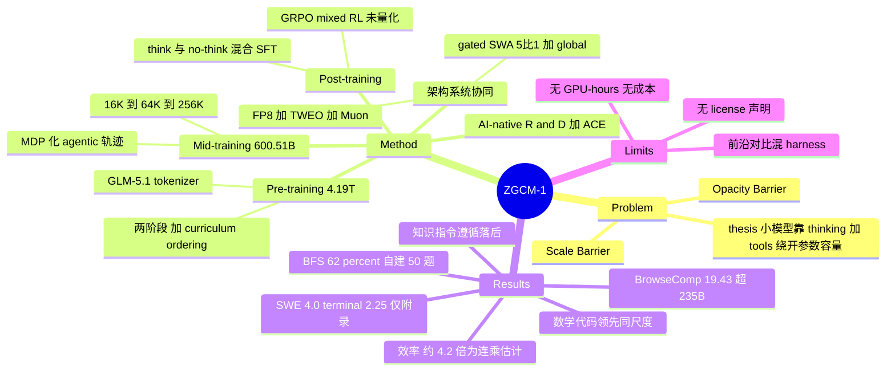

## Summary

ZGCM-1 是 Zhongguancun Academy 从零训练的 7.39B dense 基座技术报告：以 hybrid gated SWA（5:1）加 FP8 Muon 的架构-系统协同设计，在 4.19T general pre-training token 与 600.51B mid-training token 上把上下文推到 256K，论点是"小模型无法被动记住开放网络，但可以用 deliberate thinking 加 external tool use 绕开参数容量上限"。它区别于其他 7B 开源模型的地方不是分数，而是把各阶段权重、中间 checkpoint、per-stage 数据与 data recipe、W&B 日志一并放出，并写下 8 条包含负面结果的经验发现。最有信息量的单点是 BrowseComp 19.43%——7B 高于 Qwen3-235B-A22B 的 2.30%——但同一 agentic 叙事下 SWE-bench Verified Mini50 只有 4.0%、Terminal-Bench 2.0 只有 2.25%，且两个数字都只出现在附录而未进入任何主表。

## Problem & Motivation

论文把当前开放基座研究的困境拆成两个 barrier。Scale Barrier 是指前沿 reasoning 与 deep agentic search 被普遍视为百亿到千亿参数系统的专属，算力受限的研究者根本无法进入这一层的训练与探索。Opacity Barrier 更具体：多数有竞争力的模型只是 open-weight 而非 fully open-source，上游过滤配方、mid-training curriculum、长上下文调度与多轮 agent 轨迹都是黑箱，外部无法研究训练动力学与容量边界。

由此推出的 core thesis 是一个可证伪的断言：compact model 的参数记忆容量有限这一点无法改变，但如果把 long-horizon chain-of-thought 与自主 tool use 耦合起来，模型可以在需要外部知识的任务上把容量瓶颈转移到检索侧。这个 framing 值得注意的地方在于它自带适用边界——它只在"信息可检索"的任务上成立，在闭卷召回任务上必然失效，而论文自己的 Limitations 第一条正是这样承认的。

## Method

### 1. 架构与系统协同设计

主干是 32 层 dense Transformer，hidden 4096，32 query heads / 8 KV heads（head dim 128），SwiGLU + RMSNorm + RoPE，最大上下文 256K，共约 7.39B 参数。注意力层按 5:1 混合：27 层 gated sliding-window attention（窗口 128 token），5 层 global causal attention，global 层放在第 6/12/18/24/30 层。gated SWA 在局部注意力输出上乘一个 learned sigmoid gate 再做 output projection，global 层不加 gate。另外用 QK RMSNorm 与 Partial RoPE（rotary fraction 0.33）。

架构选型实验（Figure 4a）在 8 张 H100、序列长度 4,096、10B token 预算下比较 full attention、Flash-GQA、MLA 与 SWA 1:1/3:1/5:1。SWA 5:1 吞吐最高（9,566 tokens/s/GPU）且 tail loss 与 full attention 持平（1.93），SWA 3:1 loss 最低（1.92）但吞吐略低，MLA 吞吐明显更差且没有 loss 收益。需要注意这些配置是 non-parameter-matched 的。

数值侧用 hybrid FP8（forward E4M3、backward E5M2）+ delayed scaling（每 1,024 步更新一次 scale）+ TWEO activation regularizer 抑制激活离群值，其余算子保持 BF16/FP32。优化器上 matrix 参数用 Muon（momentum 0.9，5 步 Newton–Schulz，constant LR 2e-4），scalar 参数用 Adam。

### 2. General pre-training：两阶段 + curriculum ordering

语料分两阶段：Stage 1 约 0.99T token，Stage 2 约 3.20T token，跨阶段去重保证 Stage 2 不含 Stage 1 内容。来源涵盖过滤后的英文 web、academic/OCR（olmOCR 产出的 Ai2 科学内容）、arXiv LaTeX、code（code-rich 网页 + 开源仓库）、分层数学语料，以及 Nemotron-Pretraining-Specialized-v1 这类专门推理数据。分词用 **GLM-5.1 tokenizer**。数据配比先在 3B proxy model 上跑约 30B token 做 mixture search，再迁到目标规模。

Curriculum ordering 只对 general-language 文档按 lexical complexity 排序，code 与 mathematics 单独 interleave——Finding 1 明确说 lexical complexity 对技术领域是差的难度代理，表面统计量跟踪的是 boilerplate 而非算法或推理深度。

### 3. Mid-training：渐进上下文 + MDP 化轨迹

从 2.86T 的候选池采样出 600.51B token 的调度，分 16K（180B）、64K（240B）、256K（180.51B）三段渐进扩上下文，各段维持约 12.6M token/step（global batch 768/192/48），LR 1e-4，256K 段用 RoPE base 10M 与 full activation recomputation。能力配比上 code 与 math 各约 20%，knowledge 从 10.50% 升到 14.23%，agentic 从 1.50% 升到 3.30%，pre-training replay 从 13.00% 降到 9.00%。

Agentic 部分的做法是把通用交互轨迹重写成 **MDP 式 state-conditioned next-action prediction**，在保留完整轨迹上下文的同时提供更密集的局部决策监督。这一步论文明确标注为 following agentic continual pre-training（Su et al., 2025），是沿用而非自创。

### 4. Post-training：think/no-think 混合 SFT + mixed RL

SFT 语料 4,921,933 条，general 占 96.46%、agentic 占 3.54%，全部用 GLM-5.1 conversation format 渲染并做 assistant-only loss masking。混合 think/no-think 监督：think 模式目标含显式推理链，no-think 模式直接给答案。质量侧是多级 tiered curation（规则过滤 + model-based 多维打分 + 分层而非硬阈值）。训练两个长度变体，最终发布的是 256K 变体，10 epoch，19.46B packed token，matrix 参数用 layer-wise Muon。

RL 阶段用 GRPO：数学用二值答案正确性，代码用通过测试比例，通用任务用正确性或指令遵循标准；加 KL 正则与轻度长度惩罚；rollout 允许 65,536 新 token、总上下文 98,304 token。

### 5. AI-native R&D 与 ACE

研究者指挥 agent swarm 覆盖数据工程、架构设计、学习算法、实验监控、基建、评测与部署七个环节，共享 harness 沉淀 validated script / workflow / debugging history。评测侧自建 Atomic Capability Evaluation（ACE）：18 个 category、183 个 atomic capability、2,503 个 probe，一次完整跑约 2-3 分钟，用于 ablation 期间的高频诊断。

## Key Results

### 7B–8B 同尺度（think mode，Table 2，单位 %）

| Benchmark | ZGCM-1-7B | DeepSeek-R1-0528-Qwen3-8B | MiniCPM-4.1-8B | Qwen3-8B | Olmo-3-7B-Think |
|:--|--:|--:|--:|--:|--:|
| MATH-500 | **97.13** | 96.32 | 95.60 | 96.20 | 95.10 |
| AIME 2024 | 80.62 | **83.33** | **83.33** | 80.00 | 71.60 |
| AIME 2025 | 73.33 | **75.21** | 73.33 | 63.33 | 64.60 |
| AIME 2026 | **75.00** | 69.17 | 71.67 | 66.67 | 66.16 |
| HMMT 2025 | **70.42** | 61.50 | 52.50 | 43.33 | 43.89 |
| HMMT 2026 | **59.48** | 51.52 | 46.21 | 45.45 | 43.94 |
| HumanEval+ | **90.24** | 88.87 | 89.63 | 80.20 | 89.90 |
| LiveCodeBench v6 | 46.86 | **53.57** | 52.14 | 52.20 | 49.26 |
| MMLU | 73.88 | 82.09 | 83.51 | **85.40** | 77.80 |
| GPQA-Diamond | 47.87 | **60.10** | 47.98 | 59.09 | 49.94 |
| IFEval | 75.42 | 72.37 | 73.24 | 87.40 | **88.20** |

数学与代码这一侧确实领先，但知识（MMLU、GPQA-Diamond）与指令遵循（IFEval）是明显短板。论文在 Introduction 宣称的是"ranks first on average across 14 reasoning benchmarks at the 7B–8B scale"，而它报告的完整非 agentic 套件是 20 个 benchmark——被排除的 6 个恰好包含它落后最多的三项。

### Agentic search（Table 3，单位 %；baseline 取自各家公开报告，非同一 harness 重跑）

| Benchmark | ZGCM-1-7B | Kimi-K2 | Qwen3-235B-A22B | WebDancer-32B | Claude 4 Sonnet | GPT-5 |
|:--|--:|--:|--:|--:|--:|--:|
| WebWalkerQA | **63.09** | 63.00 | 59.60 | 38.40 | 61.70 | – |
| BrowseComp | 19.43 | 14.10 | 2.30 | 2.50 | 12.20 | **54.90** |
| GAIA text-only | 42.52 | 57.30 | 45.60 | 40.70 | 68.30 | **76.40** |

### Binary Function Search（Table 4，作者自建 benchmark，50 题子集）

DeepSeek-V4 Flash 与 Qwen3.5-397B-A17B 并列 76.00%（38/50），GLM-5.1 66.00%（33/50），ZGCM-1-7B 与 Kimi-K2 并列 62.00%（31/50），DeepSeek-R1 36.00%，GPT-4o 18.00%，同尺度的 Qwen3-8B 只有 12.00%（6/50）。

### 只出现在附录、未进入任何主表的 agentic 结果

- SWE-bench Verified **Mini50**（作者自定的 50 题内部子集，mini-SWE-agent v2 harness）：best fully audited ZGCM-family evaluation 解出 2/50 = **4.0%**（Section 11.3）
- Terminal-Bench 2.0（完整 89 题）：解出 2/89 = **2.25%**（Section 11.4）

### 效率

- 16K 生产训练稳定在约 585 model TFLOP/s/GPU，对 H100 BF16 dense peak 989 TFLOP/s 约为 60% BF16-equivalent MFU
- SWA 5:1 相对 full attention 的吞吐优势随上下文增长：4K 时 1.13 倍，256K 时 3.94 倍
- KV cache 在 256K 下 full attention 需 32.0 GiB，GDN 3:1 linear attention 需 7.0 GiB，本文 hybrid 只需 5.0 GiB（per-token 从 128 KiB 降到 20 KiB，6.4 倍缩减）
- 标称的约 4.2 倍 16K pre-training time-to-loss 提升，是把 SWA 5:1 的 1.4 倍、FP8 系统的 1.5 倍、Muon 的 1.8 倍、Pre-LN 的 1.1 倍**相乘**得到的估计值，对照物是一个"OLMo 3-style 7B BF16/AdamW"基线

### Findings 中信息量最高的几条

Finding 4：SFT 质量优于数量——剪掉约一半候选池把六 benchmark 均值从 67.78 提到 68.83，增益集中在 BBH（+10.10）。Finding 5：long-CoT 监督效用非单调，过量会损害指令遵循（这与上表 IFEval 的落后互相印证）。Finding 6：只用 agent 数据微调会降低交互保真度，必须与通用指令数据共训。Finding 7：mid-training 打好的长上下文地基让 256K 能力可以只用中等长度 SFT 数据激活，省掉昂贵的 256K 长轨迹。Finding 8：9 位核心贡献者对 11 类任务各自打分（共 99 条评级），实验监控与部署这类 operational 任务达到 L4，而架构与学习算法设计停在 L2–L3。

## Evidence Ledger

| Claim ID | Claim | Type | Source locator | Evidence excerpt | Status |
|:--|:--|:--|:--|:--|:--|
| C0 | 2026-09-11 提交，机构为 Zhongguancun Academy 与 Zhongguancun Institute of Artificial Intelligence | metadata | abs 页 + 论文页眉 | "1]Zhongguancun Academy 2]Zhongguancun Institute of Artificial Intelligence" | source-verified |
| C1 | 7.39B dense，32 层，hidden 4096，32 query / 8 KV heads，最大上下文 256K | number | Sec 2.1 | "approximately 7.39 billion parameters, 32 Transformer layers, a hidden dimension of 4,096" | source-verified |
| C2 | 5:1 混合注意力 = 27 层 128-token 窗口 gated SWA + 5 层 global | number | Sec 2.1 | "Of the 32 layers, 27 use gated SWA with a 128-token window and five use global causal attention" | source-verified |
| C3 | Pre-training 0.99T + 3.20T ≈ 4.19T token；mid-training 600.51B token | number | Sec 3.1.1 / Fig 5 / Sec 3.2.1 | "approximately 0.99T tokens in Stage 1 and 3.20T tokens in Stage 2" | source-verified |
| C4 | 约 4.2 倍是四个因子（1.4 × 1.5 × 1.8 × 1.1）相乘的估计值，对照 OLMo 3-style BF16/AdamW 基线，非端到端实测 | causal-mechanism | Sec 3.1.3 "Training efficiency" / Finding 3 | "Multiplying these gives 1.4×1.5×1.8×1.1≈4.2" | source-verified |
| C5 | 其中 Pre-LN 的 1.1 倍被明确标为 estimated，来自 exploratory 7B evidence | causal-mechanism | Sec 3.1.3 | "the Pre-LN contributes an estimated 1.1× data efficiency from exploratory 7B evidence" | source-verified |
| C6 | 全文（含附录 Sec 9.1 / Table 6）不披露总 GPU-hours、总时长、总 FLOPs 或金额成本 | number（absence） | 全文 | Table 6 只给 TP/PP/CP/DP、MBS/GBS、recompute、LR、RoPE base | source-verified |
| C7 | 256K 下 3.94 倍吞吐加速、6.4 倍 KV cache 缩减（32.0 GiB → 5.0 GiB） | number | Sec 2.2 / 2.3 / Fig 4b,4c | "growing from 1.13× at 4K to 3.94× at 256K"; "a 6.4× reduction over full attention" | source-verified |
| C8 | 16K 生产运行约 585 model TFLOP/s/GPU，约 60% BF16-equivalent MFU | number | Sec 3.1.3 / Finding 2 / Table 6 | "sustains approximately 585 model TFLOP/s/GPU, i.e. approximately 60% BF16-equivalent MFU" | source-verified |
| C9 | Table 2 数值：MATH-500 97.13 / AIME 2024 80.62 / AIME 2025 73.33 / AIME 2026 75.00 / HMMT 2025 70.42 / HMMT 2026 59.48 | number | Table 2 | "MATH-500 97.13 ... AIME 2026 75.00 ... HMMT 2026 59.48" | source-verified |
| C10 | AIME 2024/2025 非最优（DeepSeek-R1-0528-Qwen3-8B 83.33 / 75.21 更高），AIME 2026 与两项 HMMT 最优 | comparison | Table 2 | "AIME 2024 80.62 83.33 83.33 80.00" | source-verified |
| C11 | MMLU 73.88、GPQA-Diamond 47.87、IFEval 75.42 均低于同尺度最强对手 | comparison | Table 2 | "MMLU 73.88 82.09 83.51 85.40"; "IFEval 75.42 72.37 73.24 87.40 88.20" | source-verified |
| C12 | "14 reasoning benchmarks 平均排名第一"是 20 个非 agentic benchmark 中的 14 项子集 | benchmark-setting | Sec 1 + Sec 5.1 + Fig 1 caption | "ranks first on average across 14 reasoning benchmarks"; "The non-agentic suite covers 20 benchmarks" | source-verified |
| C13 | WebWalkerQA 63.09 / BrowseComp 19.43 / GAIA 42.52；BrowseComp 高于 Kimi-K2 14.10 与 Qwen3-235B-A22B 2.30，但低于 GPT-5 54.90；GAIA 低于 Kimi-K2 与 Claude 4 Sonnet | number + comparison | Table 3 | "ZGCM-1-7B 63.09 19.43 42.52"; "GPT-5 – 54.90 76.40" | source-verified |
| C14 | Table 3 中除 WebDancer 外的 baseline 取自各家公开技术报告，未在同一 harness 重跑 | benchmark-setting | Sec 5.1 Setup（Sec 14 重申） | "Web baseline values other than WebDancer are taken from public technical reports and model releases" | source-verified |
| C15 | BFS 50 题子集：ZGCM-1-7B 62.00（31/50），与 Kimi-K2 并列，低于 GLM-5.1 66.00 与两个 76.00 | number + comparison | Table 4 | "GLM-5.1 50/50 33/50 66.00 ZGCM-1-7B 50/50 31/50 62.00 Kimi-K2 50/50 31/50 62.00" | source-verified |
| C16 | Section 5 全部主表结果来自发布的 256K SFT checkpoint；全文无任何 post-RL 结果表 | benchmark-setting | Sec 5.1 Setup + Sec 4.2 | "Reported results use the released 256K SFT checkpoint (Section 4.1)." | source-verified |
| C17 | 草稿原断言"论文不报告 SWE-bench / Terminal-Bench 分数"被核查推翻：附录报告 SWE-bench Verified Mini50 2/50 = 4.0%、Terminal-Bench 2.0 2/89 = 2.25%，但两者不进任何主表 | benchmark-setting | Sec 11.3 / Sec 11.4 | "resolves 2 of 50 tasks (4.0%)"; "resolves 2 of 89 tasks (2.25%)" | contradicted → 已按原文更正 |
| C18 | 开放物包含各阶段权重、中间 checkpoint、training code、per-stage 数据与 data recipe、W&B 日志，三个链接在页眉给出 | license-code | Abstract + 页眉 | "open-source model weights from the pre-training, mid-training, and post-training stages, intermediate checkpoints, training code, per-stage data and data recipes, and W&B logs" | source-verified |
| C19 | 全文未为权重、数据或代码声明任何 license | license-code（absence） | 全文 | 检索 licen*/Apache/MIT/CC BY 均无命中 | source-verified |
| C20 | 预训练语料使用 GLM-5.1 tokenizer | number | Sec 3.1.1 | "We then tokenize and index the shards with the GLM-5.1 tokenizer." | source-verified |
| C21 | Finding 4：剪掉约一半候选池使六 benchmark 均值 67.78 → 68.83，BBH +10.10 | number | Finding 4 / Sec 10.1.1 | "improved the six-benchmark mean from 67.78 to 68.83 ... (BBH +10.10)" | source-verified |
| C22 | 草稿原断言"SFT 含 22,309 条 terminal 轨迹"被核查推翻：该视图是 Agent-SFT ablation artifact，非主 SFT run 所用子集；正式语料只给出 4,921,933 总量、3.54% agentic、20,217 deep-research、30,014 + 30,000 SE 轨迹 | number | Sec 4.1.2 / Sec 10.2.3 / Table 1 | "This view is an ablation artifact and is not the terminal subset used in the main SFT run." | contradicted → 已按原文更正 |
| C23 | MDP 化轨迹重写明确沿用 agentic continual pre-training（Su et al., 2025） | sota-novelty | Sec 3.2.4 | "following agentic continual pre-training (Su et al., 2025), reformulate general traces as Markov decision process-style" | source-verified |

**核查修订记录**：24 条高风险 claim 由独立 verifier 逐条定位原文，22 条 source-verified，2 条（C17、C22）与原文冲突并已按原文改写——C17 的更正把"未报告"改为"报告了但只在附录"，反而强化了下节的批评；C22 的 22,309 数字已从正文删除。另有 4 条附范围限定：C5（Pre-LN 1.1 倍原文只说 estimated，未逐字说"未在生产环境实测"）、C10（AIME 2025 上 MiniCPM-4.1-8B 是并列 73.33 而非更高）、C13（GPT-5 的 WebWalkerQA 为 dash，不参与该项比较）、C16（该句只管辖 Section 5 主表，附录 ablation 表另有 checkpoint）。所有 source-verified 仅表示 primary source 确实包含该信息，不表示结果已被独立复现。

## Strengths & Weaknesses

### 值得肯定的

**放出来的东西比分数稀缺。** open-weight 现在不稀缺，稀缺的是 per-stage 数据本身、data recipe、各阶段与中间 checkpoint、以及训练遥测。这套组合让外部研究者可以研究训练动力学本身（论文 Section 9.2 就直接评测了从 0.04T 到 4.19T 的 54 个 base checkpoint），而不是只能在终态模型上做黑箱探测。这是 OLMo 一脉的传统，愿意跟的团队不多。

**八条 finding 里有负面结果，这是报告质量的真信号。** Finding 1 承认 lexical complexity curriculum 在 code/math 上失效，Finding 5 承认 long-CoT 过量会伤指令遵循，Finding 6 承认纯 agent 数据微调会降低交互保真度。这些是别人可以直接避坑的知识，信息量高于任何一行 benchmark 数字。Finding 7（长上下文能力由 mid-training 奠基、SFT 只需中等长度数据激活）如果能被复现，对 post-training 成本结构影响相当大。

**架构消融设计合格。** KV cache 对比是 iso-parameter 的三方比较（full attention 7.39B / GDN 3:1 linear 7.47B / hybrid SWA 5:1），把 hybrid SWA 与 linear attention 放在同一坐标系里量，比只跟 full attention 比更有说服力。

**BrowseComp 19.43% 是全文唯一真正支撑其 core thesis 的数据点。** 7B 在这个考察多跳、抗干扰、长程检索的任务上高出 Qwen3-235B-A22B 一个数量级（19.43 vs 2.30），这正是"检索可以替代参数记忆"应该表现出的形态。相比之下 AIME/HMMT 的领先只说明数学数据配比做得好，跟 thesis 无关。

### 需要打折扣的

**"Extremely efficient"是吞吐口径，不是总成本口径。** 4.19T 预训练 + 600.51B mid-training token 不是一个小预算，量级上跟 OLMo 3 属于同一档。全文没有任何 GPU-hours、wall-clock、总 FLOPs 或金额——按 Section 9.1 的 TP=2/DP=96 可推算 16K 主训练约用 192 张 H100（这是笔记作者的推算，不是论文给出的数字），但没有时长就无法得出总量。在没有任何绝对成本数字的前提下宣称"tractable on academic compute budgets"，是一个未量化的断言。

**约 4.2 倍是四个因子连乘的估计，不是一次端到端对照实验。** 对照基线（OLMo 3-style 7B BF16/AdamW）他们并没有真跑，四个因子分别来自不同实验，其中 Pre-LN 的 1.1 倍原文自己标了 estimated / exploratory。连乘隐含假设是四项收益彼此独立且不重叠——SWA 的吞吐增益与 FP8 的系统增益都作用在同一个 attention/GEMM 栈上，这个独立性既没有论证也没有测量。这是全文最经不起推敲的头条数字。而且 3.94 倍那个数只在 256K 成立，4K 时只有 1.13 倍，实际主预训练跑在 16K，对应的增益是 1.4 倍。

**"14 个 reasoning benchmark 平均排名第一"是选出来的切片。** 完整套件是 20 个，被排除的包含 MMLU（落后 11.5 分）、GPQA-Diamond（落后 12.2 分）、IFEval（落后 12.8 分）。"平均排名"本身也是脆弱统计量——它对 benchmark 集合的选择极度敏感，换掉两三个就会翻转。

**前沿模型对比是混 harness 的。** Table 3 里除 WebDancer 外的所有 baseline 都抄自各家公开报告，搜索工具、步数上限、判分方式都不受控。所以"与大一个数量级的前沿模型竞争"这个结论，严格说只在 WebDancer 和 BFS 两处站得住（那两处才是同 harness）。BFS 本身又是作者自建 benchmark 的 50 题子集，62% 意味着 31/50，一题就是 2 分——与 Kimi-K2 的并列、与 GLM-5.1（33/50）的 2 题差距都在噪声量级内。

**Agentic 能力的覆盖面比叙事窄得多。** 这是核查过程中最值得记下的一条：论文标题与摘要主打 agentic search，正文把 BFS 62% 放进主表并反复引用，但 SWE-bench Verified Mini50 的 4.0%（2/50）与 Terminal-Bench 2.0 的 2.25%（2/89）只出现在附录 Section 11.3 / 11.4 的 harness 描述末句，且归属写的是模糊的"ZGCM-family"而非某个具体 checkpoint。SFT 里有 6 万条 software-engineering 轨迹，产出是 2/50——这个投入产出比本身就是有价值的负面结果，不该被放在附录脚注的位置。结论应该是：ZGCM-1 的 agentic 能力局限在"搜索-阅读-综合"与"Ghidra 工具链下的符号定位"这两类结构化、单工具、短状态空间的环境，一旦进入需要长程修改持久状态的软件工程或终端任务就基本失效。

**头条分数来自 SFT checkpoint，RL 贡献未量化。** Section 5.1 明说主表用的是发布的 256K SFT checkpoint，而 Section 4.2 完整描述了 GRPO 的数据、reward、采样规模与超参，却没有任何 post-RL 结果表。也就是说 RL 那一节目前是纯 recipe 披露，读者无法判断它值不值这份算力。

**"Fully open"与 GLM 依赖之间有张力。** tokenizer 用 GLM-5.1 的，SFT conversation format 用 GLM-5.1 的，评测服务用 GLM tool-call parser 与 GLM-4.5 reasoning parser。这些都不影响权重开放，但它意味着这条 recipe 并不是自足的——想完全复刻要先接受一整套 GLM 的接口约定。另外全文没有为权重、数据、代码声明任何 license，而"fully open"是一个法律含义很强的词；在 license 明确之前，这个形容词只能理解为"披露充分"而非"可自由使用"。

**Finding 8 的证据等级需要说清楚。** 99 条自治性评级来自论文自己的 9 位核心贡献者，在一个序数量表上打分，论文也承认"small differences between means are not meaningful"。把它当作团队对自身工作流的结构化复盘是合理的，当作关于 AI agent 能力边界的证据则不成立。

### 对领域的意义

最有参考价值的不是 ZGCM-1 这个模型，而是它坐标系里的两个对照：一是 BrowseComp 19.43 vs 2.30 这组数字给"检索替代参数记忆"提供了迄今比较干净的小模型证据；二是同一模型在 SWE/terminal 上的 4.0%/2.25% 给这个替代关系划出了边界——检索能补的是知识缺口，补不了长程状态管理与执行可靠性。把这两个数字并排看，比读它任何一条 finding 都更接近问题本身。

## Mind Map

## Notes

- 待查：HuggingFace 上 `zgcagi/ZGCM-1-7B` 与 `zgcagi/ZGCM-1-Data` 的实际 license 与数据完整度。论文正文不给 license，而"fully open"的含金量几乎全押在这两个仓库的实际条款上。如果数据仓只放 recipe 不放 token，整篇的开放性定位需要下调。
- 该论文属于系统/基建类工作，`code` 字段非空，建议后续另起一轮 `repo-digest` 深挖训练代码与 data pipeline 的实现（尤其 FP8 + TWEO 的具体实现与 delayed scaling 的落地方式）。
- 可与 [[2504-BrowseComp]] 对照：ZGCM-1 的 19.43% 在 BrowseComp 原始设定下意味着什么量级的能力，需要回看原 benchmark 的难度分布与人类基线。
- 与 [[WebAgent-Survey]] 的关联点在"小模型 + tool use 替代参数记忆"这一论证链；该 survey 里现有的证据大多来自 30B 以上模型，ZGCM-1 是目前见到的最小尺度反例。
- 方法论上值得单独记一笔：Finding 7（长上下文能力由 mid-training 奠基，SFT 只需中等长度数据）如果成立，意味着大量团队在 post-training 阶段采集超长轨迹的投入是错配的。这条值得找独立复现证据。
- 本次 digest 中两条草稿 claim 被 verifier 推翻，其中 C17 的错误形态是"从 Limitations 的定性描述推断论文没报数字，实际数字在附录 harness 描述的最后一句"。absence claim 必须搜完附录再下判断。
