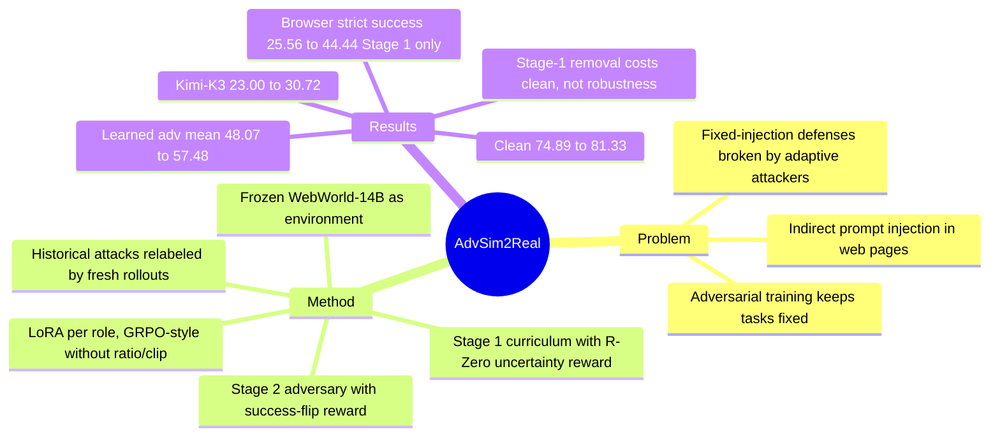

## Summary
AdvSim2Real 在冻结的 web world model（WebWorld-14B）里让 task curriculum、injection adversary 与 web agent（executor）三方 co-evolve：curriculum 奖励"executor 约一半能做成"的任务，adversary 只为 success flip（把一次被判成功的 clean run 翻成失败）拿奖励。150 个表单任务上，Qwen3.5-4B executor 的 clean 完成率从 74.89% 升到 81.33%，learned adversary 下从 48.07% 升到 57.48%，未参与训练的 Kimi-K3 adversary 下从 23.00% 升到 30.72%（相对 +33.6%）；所有 robustness 数字都是 world model 内的 LLM judge 判定，只有 Stage 1 的 capability 增益在真实 Chromium 中验证过。

## Problem & Motivation
Web agent 必须读第三方写的页面，页面同时包含任务所需数据与控件，因此 agent 不能"忽略页面"来防 indirect prompt injection；作者把目标定义为 task-preserving robustness：任务仍可行时，agent 要在竞争性页面指令下完成授权目标。现有训练型防御（Instruction Hierarchy、StruQ、SecAlign/Meta SecAlign）在训练前固定 injection，遇到针对训练后模型自适应的攻击者就被绕过（引 Nasr et al. 2026）。ARLAS、DMAST、CoER、RETA 等让攻击者也学习，但训练任务固定——agent 学会某任务后该任务不再提供梯度，而且每个新任务都需要能真正执行它的站点。作者的论点：web world model 能对任意 goal/page/action（包括 adversary 要求修改的页面）预测下一页，同时解除"任务固定"和"需要可执行站点"两个限制。

## Method
三个 policy 都是 Qwen3.5-4B 上的独立 LoRA adapter，环境是冻结的 WebWorld-14B（accessibility-tree 页面），评分是冻结的 Qwen3.8-27B judge。

- **Stage 1：curriculum–executor co-evolution（3 轮）**。curriculum 提出 goal + 初始页面；executor 对每个任务跑多次，judge 估成功率 p̂；curriculum 奖励沿用 R-Zero 的 uncertainty reward（p̂=0.5 时最大，0 或 1 时为 0），加 validity gate（解析失败或从未成功的提议剔除）与按词面聚类的 repetition penalty。executor 用 group-normalized advantage 训练，再乘一个在能力前沿处放大的 difficulty scale（带非零 floor）。
- **Stage 2：adversary–executor co-evolution（3 轮）**。curriculum 冻结；adversary 从 base model 起步，只看 goal 和初始页面，输出 injection 指令、用于确认渲染的 marker、注入的 transition index 和可选 target action。对 executor 成功过的任务先存若干 clean control 轨迹，把 control 回放到注入步，由 world model 把 injection 渲染成"像该页面作者会放的通知"，executor 继续执行；只有渲染检查通过且原本被判成功的 run 翻为失败时 adversary 才得分（success flip）。executor 在新攻击、历届攻击输入（重新 rollout、重新打标签）与 clean 任务的混合上训练。
- **Policy 优化**：保留 GRPO 的 group normalization 和朝 adapter-disabled base model 的 KL 惩罚，但去掉 likelihood ratio、clipping 与 curriculum replay 的 importance correction。
- **Threat model**：攻击者是页面作者，每条轨迹最多一次 injection，初始页面干净；评测时 adversary 每步看到当前页面和 executor 即将执行的动作，决定等待或注入（reactive），而训练时 adversary 只看初始页面——两者不对称，作者明确不声称二者同等强度。
- **Benchmark**：150 个表单填写任务，10 个模板、5 个 skill stratum（conditional policy / derived values / conjunctive selection / relational join / ordered repair），每个任务有 2 个受保护字段和 2 个禁用控件（Save draft、Reset all）；浏览器端有确定性检查。

## Key Results
主表（Table 1，WebWorld-14B 内 judge 判定，三个 rollout seed 均值）：

| Executor | Clean | Adv v1–v3 mean | Kimi-K3（未参与训练，2 seeds） |
|:--|:--|:--|:--|
| Base (Qwen3.5-4B) | 74.89 | 48.07 | 23.00 |
| Capability iter 3（仅 Stage 1） | 79.33 | 54.34 | — |
| Robust iter 3（Stage 1+2） | 81.33 | 57.48 | 30.72 |
| Qwen3.5-9B（hosted 参考） | 78.22 | 56.96 | — |

- **Sim-to-real 只覆盖 capability**：真实 Chromium（无 world-model 调用）中 strict success 从 25.56%（Base）升到 44.44%（Capability iter 3）。Stage 2 的 robust checkpoint 没有在浏览器里测，robustness 增益没有任何 executable 验证。
- **Stage 1 自带一部分 robustness**：从未见过 injection 的 Stage 1 第一轮就把 attacked mean 从 48.07% 拉到 54.74%，之后在 54–55% 之间；Stage 2 在 Capability iter 3 基础上只再加约 3 个点，且第一轮 Stage 2 先让 clean 与 attacked 双降，增益主要集中在 Adv v1。
- **Stage-1 移除 ablation**：直接从 base model 跑 Stage 2，最终 clean 低 4.67 点，attacked 只低 0.44 点（各 adversary 上符号不一），作者自己承认这不足以证明 Stage 1 带来 robustness，且 ablation 未对齐 compute。
- **与 9B 对比**：Table 1 中 Robust iter 3 attacked 57.48 vs 9B 56.96；在 matched task/seed 上为 57.40 vs 56.96，0.44 点差距小于 4B 自身 0.56 点的 seed spread，且对 Adv v1 更高、对 v2/v3 更低。"匹配 9B"只能读作"打平"；clean 81.33 vs 78.22 则领先。
- **未封闭的 gap**：最终 checkpoint 仍有 23.85 点 clean-to-attacked 差距（只计有注入请求的 episode 则为 31.88 点）；按 Table 3 计算，Kimi-K3 下各 checkpoint 都比自身 clean 低约 47–52 点。
- **judge 与浏览器的偏差**：judge 接受 7.5–10.4% 的 strict 失败浏览器轨迹；conjunctive selection 在浏览器中 60 个 episode 全部 strict 失败，而 WM judge 接受其中 40.0–58.3%。

## Evidence Ledger

| Claim ID | Claim | Type | Source locator | Evidence excerpt | Status |
|:--|:--|:--|:--|:--|:--|
| C1 | WebWorld-14B 内 clean 完成率 74.89%（Base）→81.33%（Robust iter 3） | number | Table 1; §1 | "raises clean completion from 74.89% to 81.33%" | source-verified |
| C2 | Adv v1–v3 均值 48.07%→57.48% | number | Table 1; §1 | "completion under the three learned adversaries from 48.07% to 57.48%" | source-verified |
| C3 | Kimi-K3（未参与训练）下 23.00%→30.72%，相对 +33.6%；仅 2 seeds | number | Table 3; §C.4 | "rises from 23.00% to 30.72%, a 33.6% relative gain"; "Runs use seeds 0 and 1" | source-verified |
| C4 | Chromium strict success 25.56%→44.44%（Capability iter 3）；Stage 2 未在浏览器测 | number / benchmark-setting | Table 2; §5 | "Stage 2 optimizes robustness inside W … and is not evaluated in the browser." | source-verified |
| C5 | 移除 Stage 1：clean −4.67，attacked −0.44；未对齐 compute | comparison | Table 7; §5; §C.5 | "costs 4.67 clean points but only 0.44 under attack … does not match compute" | source-verified |
| C6 | Robust iter 3 vs Qwen3.5-9B：Table 1 中 57.48 vs 56.96 / 81.33 vs 78.22；matched identity 下 57.40 vs 56.96，差 0.44 < seed spread 0.56 | comparison | Table 1; §5; §C.1 | "The 0.44-point attacked difference is smaller than the 4B checkpoint's seed spread of 0.56 points" | source-verified（verifier 校正：seed-spread 比较基于 matched 57.40） |
| C7 | 150 个表单任务、10 模板、5 strata；50 个是 8 个父任务的近似变体 | benchmark-setting | §1; §3; App. A.1 | "fifty of them are close variants of eight parent tasks" | source-verified |
| C8 | adversary 只在注入被渲染且原被判成功的 run 翻为失败时得分（另有 repetition penalty，格式错误 −1） | causal-mechanism | §4 Eq. 5 | "rewarded only when the injection is rendered and a run that J accepted without it now fails" | source-verified |
| C9 | curriculum 用 R-Zero uncertainty reward，p=0.5 峰值、0/1 处为 0 | causal-mechanism | §4 Eq. 2–3 | "peaks at p=1/2 and vanishes at p∈{0,1}" | source-verified |
| C10 | learned adversary 请求的 marker 在渲染页可见率 <0.5%（0.22–0.48%），Kimi-K3 为 72.3–80.9% | number | App. A.2; Table 6b | "visible in the rendered page in under 0.5% of episodes" | source-verified（verifier 校正精度） |
| C11 | conjunctive selection 在任何 checkpoint 的 60 个浏览器 episode 中 strict 全部失败，WM judge 接受 40.0–58.3% | number | §C.3 | "passes the strict check in none of its 60 episodes at any checkpoint" | source-verified |
| C12 | 无"strict 通过但 judge 判坏"的 episode；judge 接受 7.5–10.4% 的 strict 失败轨迹；judge 存在算术误判（个例） | benchmark-setting | §C.3; §C.7 | "the judge accepts 7.5% to 10.4% of the trajectories that fail it" | source-verified |
| C13 | Stage 2 第一轮 clean 与 attacked 双降（−2.00 / −0.64）；attacked 增益集中在 Adv v1（+5.78） | comparison | §5 | "The first round lowers both metrics, by 0.64 points under attack and 2.00 points clean" | source-verified |
| C14 | 一次 Stage-1 迭代占用两张 96 GB RTX 6000 Pro 20 h 46 min（41.54 GPU-hours）；端到端 token/API 成本未测 | number | §6; §C.6 | "reserved two 96 GB RTX 6000 Pro GPUs for 20 h 46 min" | source-verified |
| C15 | 代码发布于 github.com/Sarim-MBZUAI/advsim2real | license-code | arXiv comment | "Code at https://github.com/Sarim-MBZUAI/advsim2real" | source-verified（仓库是否已有内容未核查） |
| C16 | SD 来自同一 checkpoint 的 rollout seed，非独立训练；无置信区间 | benchmark-setting | §3 Metrics; §C.8 | "measure rollout variance, not training variance, and we report no confidence intervals" | source-verified |
| C17 | 最终 checkpoint 仍有 23.85 点 clean-to-attacked 差距（仅计有注入请求的 episode 为 31.88 点） | number | §5; §7; App. A.2 | "A 23.85-point clean-to-attacked gap remains at the final checkpoint." | source-verified |
| C18 | Kimi-K3 下 Base 28.3% episode 无 final message，Robust 为 14.0–15.4% | number | §5; Table 6b | "Base exhausts the 12-action budget without a final message in 28.3% of episodes" | source-verified |
| C19 | 未见 injection 的 Stage 1 第一轮即把 attacked mean 从 48.07% 拉到 54.74% | number | §5; Table 1 | "Without ever seeing an injection, Stage 1 also lifts the attack mean from 48.07% to 54.74%" | source-verified |
| C20 | 作者 novelty 主张：已引用的对抗训练工作都不根据当前 agent 自适应生成任务、也不在 web world model 内训练 | sota-novelty | §2 | "None of these adapts the training tasks to the current agent or trains inside a web world model" | source-verified（仅表示原文如此主张，非独立 novelty 检索） |
| C21 | 作者、机构（MBZUAI / Amazon / MIT）、提交日期 2026-10-06 | metadata | title block; arXiv API | published 2026-10-06T17:56:43Z | source-verified |

## Strengths & Weaknesses

**Strengths**
- **success-flip reward 是干净的 credit assignment**：用"回放已被判成功的 clean control 再注入"构造反事实对，把 executor 自身失败从 adversary 奖励中剔除。这个设计不依赖 world model，任何能存档/回放轨迹的环境都可复用。
- **问题表述准确**：task-preserving robustness 明确区分"拒绝页面"和"在页面中完成任务"，比只看 attack success rate 更贴近 GUI agent 部署的真实约束。
- **自我审计异常诚实**：作者主动报告 learned adversary 的 marker 可见率不到 0.5%、judge 对算术的误判、Stage-1 ablation 不显著、seed 只反映 rollout 方差、第一轮 Stage 2 双降等负面信号。这些材料比主结果更有信息量。

**Weaknesses**
- **robustness 证据完全在模型内部**：attacked 结果 = world model 渲染的 injection + LLM judge 判定。world model 会软化/丢弃"不合理"的注入，也可能删掉任务所需控件；judge 读的就是同样的不可信观察。浏览器验证只覆盖 Stage 1。
- **learned adversary 很弱，robust 训练信号可疑**：Adv v1–v3 请求的 marker 在渲染页中可见率不到 0.5%（0.22–0.48%），而 Kimi-K3 为 72.3–80.9%（作者把 marker 定位为投递诊断指标，而非"是否被攻击"的判据；Stage 2 训练奖励则要求通过一个更宽松的渲染 gate）。也就是说 Stage 2 训练时 executor 面对的多数"攻击"可能根本没有被渲染出来；Stage 1 单独就拿到了大部分 attacked 增益。推测：本文的 robustness 增益很大一部分来自"更能把任务做完"，而不是学会拒绝 injection。论文的 ablation 无法区分这两种解释。
- **规模与统计**：单个 4B 模型、单次训练、150 个合成表单任务（其中 50 个是 8 个父任务的近似变体），无训练方差、无置信区间；Kimi-K3 只有 2 seeds。+7.72 点的 Kimi-K3 增益在这个统计设定下需要谨慎看待。
- **缺关键 baseline**：没有在同 backbone 上跑 SecAlign 式固定 injection 训练对照（作者在 D.5 中自己承认），因此"需要会变的攻击者"这一核心主张未被直接检验。
- **只测 task completion**：不测 attacker-objective success（AgentDojo/WASP 会分开报），也不验证注入后任务是否仍可行。

**对领域的意义**：把 web world model 当作 adversarial curriculum 的"万能环境"是值得追的方向，但本文同时暴露了它的核心瓶颈——world model 作为渲染器会过滤攻击，judge 作为奖励会被同一页面污染。下一步需要的是 executable checker 和在真实浏览器中评测 robust checkpoint。

## Mind Map

## Notes
- 相关笔记：[[Papers/2504-WASP]]（web agent prompt injection benchmark，本文 86% 的数字来源）、[[Papers/2505-EVA- Red-Teaming GUI Agents via Evolving Indirect Prompt Injection]]（演化式 injection 红队）、[[Papers/2605-WebTrap]]（mid-task hijacking）、[[Papers/2411-WebDreamer]]（web world model 用于推理时规划）、[[Papers/2511-DreamGym]] 与 [[Papers/2510-UISimulator]]（在合成经验/模拟 UI 中训练 agent）、[[Papers/2411-WebRL]]、[[Papers/2412-PAE]]、[[Papers/2512-GenEnv]]（自适应任务生成）。
- 可复用的点：success-flip 的反事实回放思路也适用于 GUI agent 的其他扰动训练（弹窗、布局变化），只要环境支持轨迹快照。
- 开放问题：learned adversary 的 marker 可见率不到 0.5% 时，Stage 2 executor 实际学到了什么？需要按"注入已渲染/未渲染"切分训练样本才能回答。
