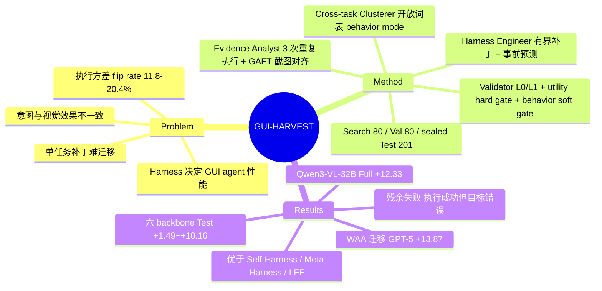

## Summary
GUI-HARVEST 在冻结 backbone 的前提下自动改写 GUI agent 的可执行 harness（prompt、动作接口、控制流、验证/恢复/终止逻辑）：用同一任务 3 次重复执行 + 前后截图对齐做诊断，跨任务聚类成 behavior mode，再由 Harness Engineer 提出带"事前行为预测"的源码补丁，经 score hard gate 与 behavior soft gate 双重验证后才晋升。在 OSWorld-Verified 上六个 backbone 的 sealed Test 均提升（+1.49~+10.16 pp，Qwen3-VL-32B Full +12.33），同起点下优于 Self-Harness / Meta-Harness，冻结 harness 迁移到 WindowsAgentArena 使 GPT-5 +13.87。

## Problem & Motivation
GUI agent 的性能很大程度由 runtime harness 决定（Agent S 系列已经说明了这一点），但已有自动 harness 优化器（Meta-Harness、Self-Harness）只在非 GUI 领域工作，读的是文本 trace 和分数。作者认为 GUI 场景有三个耦合难点：(1) 模型自述的意图与屏幕上真实的视觉效果可能不一致（"点了 Save 但对话框还开着"）；(2) 执行结果有随机性，同一任务在 deterministic decoding 下也会时成时败，作者测得 baseline 下 11.8–20.4% 的任务在 3 次执行中既有 0 分也有正分，单条失败轨迹不足以定位原因；(3) 单任务补丁未必可迁移，需要把跨任务的同类失败归到共享的 runtime 机制上，并且要检查补丁确实修正了该失败模式，而不只是总分上涨。

## Method
四个 optimizer 角色（均为 Claude Sonnet 5，所有 backbone 共用同一套 role prompt）+ 确定性程序组成闭环：

- **任务划分**：OSWorld-Verified 361 题（剔除 8 个 Google Drive 任务）按 domain 分层随机划分为 Search 80 / Validation 80 / sealed Test 201。只有 Search 轨迹对 optimizer 可见；Validation 只回传聚合分；Test 直到优化结束才开封。
- **Evidence Analyst**：每个 Search 任务跑 K=3 次组成 task-round bundle（附 Task Card：指令、domain、应用、feasibility 标注、setup、公开 hint；以及 Harness Card）。至少一次 0 分即进入诊断。GAFT 工具把文本、计划动作/实际动作、前后截图按 step 对齐，只计算可复现的机械事实（全屏与落点窗口的像素变化比例、重复动作等），语义解释交给 analyst。Finding = 失败 run 的决定性 step + 观察到的意图-状态不一致 + 可用时的成功 run 对照。确定性 verifier 检查 run/step 引用、引文局部性等，通过后才保留。
- **Cross-task Clusterer**：先按决定性动作与机器结果给每个 finding 分配确定性的 outcome category，再在类别内用开放词表归纳至少覆盖 2 个独立任务的 behavior mode（含可观察机制、成员判据、行为目标）。
- **Harness Engineer**：在 capability manifest 限定的可写范围内（不可改模型 client、benchmark、evaluator、资源上限）挑选少量兼容的 mode，定位源码、打有界补丁、跑本地测试，并在 GUI 评测**之前**写下 update plan：目标 mode、代码位置、可观察的行为预测、用于检验的 Search 任务、需保持不变的接口。
- **Validator**：L0（权限、diff 规模、语法、静态规则）/ L1（import、接口、单测、smoke test）代码检查 → 在 Search 与 Validation 全部任务上各跑 3 次 → **utility hard gate**（两个 split 都不下降且至少一个严格上升）+ **behavioral soft gate**（独立 validator 对比冻结的预测与补丁后轨迹，给 supported / contradicted / inconclusive，按固定规则聚合）。全部通过才 promote，否则 rollback。Update ledger 记录补丁、预测、分数、裁决，供后续提案参考。
- **预算**：15-step Search rollouts，最多 10 轮、每轮最多 5 个候选；某个 harness 状态下 5 次全被拒即停止。

## Key Results
- **配对提升（15 步，Table 1）**：六个 backbone 的 Test 均上升，幅度 +1.49（OpenCUA-32B）到 +10.16（Qwen3-VL-32B）。Qwen3-VL-32B：Test 43.02→53.18，Full 38.61→50.94（+12.33）。通用/前沿模型 Full 提升 6.91–12.33，OpenCUA 仅 3.53–4.68，作者归因于 OpenCUA 被 post-train 到其原生坐标动作协议上，对新增工具和控制机制的适应性较低（推测性解释）。
- **步数外推**：15 步上优化的 harness 冻结后在 50/100 步继续提升，Gemini 3.1 Pro 100 步达 79.14%。但 15→100 步对 Qwen3-VL-8B/32B 只多 2.54/0.85，对 Gemini/GPT-5 多 5.77/6.00。
- **对比其他优化器（Table 2）**：同一 Qwen3-VL-32B / Agent S3 起点、同为 Claude Sonnet 5 与 10 轮上限，Self-Harness Test +2.00（45.02），Meta-Harness +4.38（47.40），GUI-HARVEST +10.16。LFF 因 optimizer 未开源，只能评估其公开补丁：OpenCUA-72B 上 LFF 41.29/39.50 vs GUI-HARVEST 44.18/42.33（Test/Full）。
- **WAA 迁移（50 步，无 WAA 优化，只换平台 adapter）**：Qwen3-VL-32B 38.21→44.68（+6.47），GPT-5 50.88→64.75（+13.87）。
- **消融（Qwen3-VL-32B，Test/Full）**：去视觉证据 44.54/40.69（掉得最多），去 Clusterer 45.66/42.13，单次执行证据 47.44/43.12，仅 hard gate 49.36/48.08（跑了 9 轮反而选出更差的 harness），完整版 53.18/50.94。
- **重复次数 K**：K=1 选出的 harness Full 43.1%，K=3 为 50.9%，K=5 为 49.7%（成本更高但不更好）；SE 从 1.61 降到 0.93。
- **推理成本（只算目标模型推理，不含优化过程）**：GPT-5 15 步 harness 62.4% / 约 $72，对比 Agent S3 100 步 62.6% / 约 $260（后者由 published 每题成本 $0.72 乘题数重构；两者步数和协议不同，属 source-reported operating point 对比）。冻结 harness 的配对成本：Qwen3-VL-32B $27.3→$34.2（上升），GPT-5 $78.6→$72.3，Gemini $140.0→$92.4（下降）。

## Evidence Ledger

| Claim ID | Claim | Type | Source locator | Evidence excerpt | Status |
|:--|:--|:--|:--|:--|:--|
| C1 | OSWorld-Verified 361 题（剔除 8 个 Google Drive），按 domain 分层划为 Search 80 / Val 80 / sealed Test 201 | benchmark-setting | §4.1; App. G.2 | 361 tasks after excluding eight Google Drive tasks... 80 tasks to Search, 80 to Validation, and 201 to sealed Test | source-verified |
| C2 | 15 步下六个 backbone 的 Test 提升 +1.49~+10.16 pp | number | §1; Table 1 | At 15 steps, Test scores improve by 1.49–10.16 percentage points across all six frozen backbones. | source-verified |
| C3 | Qwen3-VL-32B Test 43.02→53.18（+10.16），Full 38.61→50.94（+12.33） | number | Table 1; §4.2 | Qwen3-VL-32B 43.02 38.61 53.18 (+10.16) 50.94 (+12.33) | source-verified |
| C4 | 15 步优化的 harness 冻结后，Gemini 3.1 Pro 100 步达 79.14% | number | §1; Figure 1 | Gemini 3.1 Pro reaching 79.14% at 100 steps without further optimization | source-verified |
| C5 | WAA 50 步迁移（只换平台 adapter）：Qwen3-VL-32B 38.21→44.68，GPT-5 50.88→64.75 | number | §4.2; Table 11 | GPT-5 improves from 50.88% to 64.75% (+13.87). With only platform adapters changed | source-verified |
| C6 | 同起点同 optimizer 模型（Claude Sonnet 5）与 10 轮上限下，Self-Harness Test 45.02、Meta-Harness 47.40、GUI-HARVEST 53.18 | comparison | Table 2; App. G.8 | Both adaptations use Claude Sonnet 5 and a maximum of ten optimization rounds. | source-verified |
| C7 | LFF 只评估其公开补丁（optimizer 未公开）；OpenCUA-72B 上 LFF 41.29/39.50 vs GUI-HARVEST 44.18/42.33 | comparison | Table 2; §4.2; App. G.8 | we evaluate the released intervention patches under the same protocol, as the optimizer implementation... not publicly available | source-verified |
| C8 | 消融 Test/Full：去视觉证据 44.54/40.69，去 Clusterer 45.66/42.13，单次执行 47.44/43.12，仅 hard gate 49.36/48.08 | number | Table 3; §4.5 | Removing visual evidence produces the largest drop, to 44.54% and 40.69% | source-verified |
| C9 | baseline 下 11.8–20.4% 任务在 3 次执行中 flip，Qwen3-VL-32B 最高 20.4% | number | App. C, Table 8 | Depending on the backbone, 11.8–20.4% of tasks flip between zero and positive score across three executions. | source-verified |
| C10 | 重复次数 K=1/3/5 选出的 harness Full 43.1/50.9/49.7；SE 1.61→0.93 | number | App. C.1, Figure 7 | lowers the standard error from 1.61 to 0.93... improves from 43.1%... to 50.9%... slightly weaker 49.7% harness | source-verified |
| C11 | GPT-5 15 步 62.4%/约 $72 vs Agent S3 100 步 62.6%/约 $260（后者由 published 每题成本重构）；不含优化成本 | comparison | §4.4; App. F.1; App. G.10 | nearly matches Agent S3's accuracy (62.4% versus 62.6%) at approximately 72% lower full-suite API cost | source-verified |
| C12 | 冻结 harness 推理成本：Qwen3-VL-32B $27.3→$34.2，GPT-5 $78.6→$72.3，Gemini $140.0→$92.4 | number | App. F.1, Figure 9 | cost increases from $27.3 to $34.2... GPT-5 moves from 55.2% at $78.6 to 62.4% at $72.3 | source-verified |
| C13 | 四个 optimizer 角色均为 Claude Sonnet 5；Qwen/闭源从 Agent S3 + UI-TARS-1.5-7B grounder 起步；OpenCUA 用官方 runtime | benchmark-setting | §4.1; App. G.1 | All four optimizer roles in our algorithm use Claude Sonnet 5 with the same role prompts across backbones. | source-verified |
| C14 | Task Card 含 feasibility 标注与公开 hint | benchmark-setting | §3.2 | a Task Card containing the instruction, domain, related applications, feasibility annotation, setup steps, and any published hint | source-verified |
| C15 | 代码开源于 GaryYang12345/GUI-HARVEST | license-code | Abstract | The code is available at https://github.com/GaryYang12345/GUI-HARVEST. | source-verified |
| C16 | 15→100 步：Qwen3-VL-8B/32B 仅 +2.54/+0.85，Gemini/GPT-5 +5.77/+6.00 | number | §4.3 | adds only 2.54 and 0.85 points for Qwen3-VL-8B and 32B, versus 5.77 and 6.00 | source-verified |
| C17 | 15 步下比 CoAct-1/GPT-5 高 22.61（62.42 vs 39.81），是文中列出的最大差距（跨协议对比） | comparison | §4.3; Figure 1 | The largest gains include 22.61 percentage points over CoAct-1 with GPT-5 (62.42% versus 39.81%) | source-verified |
| C18 | Qwen3-VL-32B 初始 harness Search 31.07 / Test 43.02 | number | App. B.1, Table 4 | Qwen3-VL-32B-Instruct 31.07 35.06 43.02 38.61 | source-verified |
| C19 | Qwen3-VL-32B 8 轮晋升 7 次，共 25 次候选 | number | App. D.2 | Qwen3-VL-32B promotes seven updates in eight rounds with 25 candidate-edit attempts | source-verified |
| C20 | infeasibility misjudgment 在六个 backbone 中均出现 | causal-mechanism | App. D.1, Table 10 | Infeasibility misjudgment appears in all six backbones | source-verified |

## Strengths & Weaknesses
**Strengths**
- **问题切得准**：把"重复执行的结果方差"当作诊断信号而不是噪声，用同任务的成功 run 作对照定位分叉点。这一点有消融支撑（K=1 → 43.1 vs K=3 → 50.9），也和 flip rate 数据（11.8–20.4%）一致，是本文最有说服力的设计。
- **事前预测 + behavior gate**：要求补丁先写可证伪的行为预测，再检查预测是否兑现，这是对"只看总分"的 hill-climbing 的实质改进。hard-gate-only 消融跑了更多轮却选出更差的 harness（48.08 vs 50.94 Full），说明纯分数选择在 80 题小 split 上容易过拟合到噪声。
- **评测协议相对干净**：sealed Test、跨 backbone 固定 split、同起点同 optimizer 模型对比 Self-/Meta-Harness，并且明确承认 LFF 只能比补丁、published 对比是不同协议的 operating point。
- **Appendix D 的失败模式分析有信息量**：同一症状（如 infeasibility misjudgment）在不同 backbone 上需要不同补丁；残余错误逐渐变成"动作执行成功但对象/路径错误"，这类错误在截图和日志里看起来都正常，harness 缺少本地信号去触发恢复。这指出了 harness-only 路线的天花板。

**Weaknesses / 需警惕**
- **"增益"中有多少是 harness 本该有的工程修补？** 不少被选中的机制是具体的工程修补：OpenCUA 的 zero-duration drag 归一化、`computer.*`→`pyautogui.*` API 映射、保留最后一步 DONE、LibreOffice 保存前置。这些是有价值的 bug fix，但更接近"自动发现 runtime bug"而非通用 self-improvement；对已经调优过的 harness，空间可能小得多。
- **Task Card 含 feasibility 标注和公开 hint**：optimizer 在 Search 上能看到哪些任务不可行，而 infeasibility misjudgment 在六个 backbone 中都出现并被针对性修补。补丁不能直接读 Test 的标注，但 OSWorld 的 infeasible 任务有共性模式，存在 benchmark-specific 拟合风险。论文未讨论这一点（推测）。
- **Split 很小且不均衡**：Qwen3-VL-32B 初始 harness Search 31.07 / Test 43.02，差 12 分，说明 80/80/201 的划分方差不小；单一 seed 的划分，跨 split 的比较需谨慎。所有结果都是一次优化运行，没有优化过程本身的方差（不同 seed 重跑 optimizer）。
- **优化成本未报告**：成本对比只计目标模型推理，Claude Sonnet 5 四角色 + 每个候选 160 题×3 次 rollout 的开销被排除。与"零训练成本"的叙事放在一起时，这个遗漏不小。
- **与 published 系统的对比口径混杂**：Figure 1 "每个 model–budget 组合都最高"里，GUI-HARVEST 是 3 次均值，published 行沿用各自协议、runtime 和 grounder（Agent S3 自带 UI-TARS-1.5-7B grounder）。配对实验（Table 1/2）才是干净证据。
- **依赖强 optimizer 模型**：所有角色用 Claude Sonnet 5，未测试更弱 optimizer 下是否仍成立；"GUI-specific diagnosis 优于通用优化器"的结论只在 Qwen3-VL-32B 一个 backbone 上验证。

**定位**：这是目前 GUI 领域最完整的"harness-as-optimization-target"工作，方法上把 LFF（文本诊断 + 人工校验补丁）推进为带视觉证据、重复执行和行为验证的闭环。对我们的启发主要在两处：一是重复执行方差是可利用的信号；二是残余失败集中在"看起来成功的错误动作"，这正是 GUI verifier / process reward 该攻的地方，harness 补丁到这里就收益递减了。

## Mind Map

## Notes
- 相关笔记：[[Papers/2606-LearningFromFailure]]（LFF，本文直接对比的 GUI failure-driven 前作）、[[Papers/2604-VLAA-GUI]]（Completeness Verifier + Loop Breaker，本文被选中的 save gate / loop rejection 与之同构，但这里是自动发现的）、[[Papers/2510-ScalingAgents]]（Agent S3 / bBoN，本文的初始 harness）、[[Papers/2607-HarnessBank]]（同样用确定性 gate 筛 harness 变体，非 GUI）、[[Papers/2608-StrongToWeakHarness]]（强模型为弱模型构建 harness）、[[Papers/2609-SoLPi]]（harness 层 auto-research 双门）。
- 开放问题：behavior soft gate 本身由 LLM validator 判 supported/contradicted，它的准确率没有单独评估；如果它对"看起来成功"的轨迹同样被骗，就和残余失败模式是同一个盲点。
- 可追问：把 GUI-HARVEST 发现的补丁反向蒸馏进模型（而非留在 harness）是否更省？OpenCUA 适应性低的现象暗示 post-train 后的动作协议会锁死 harness 可改的空间。
