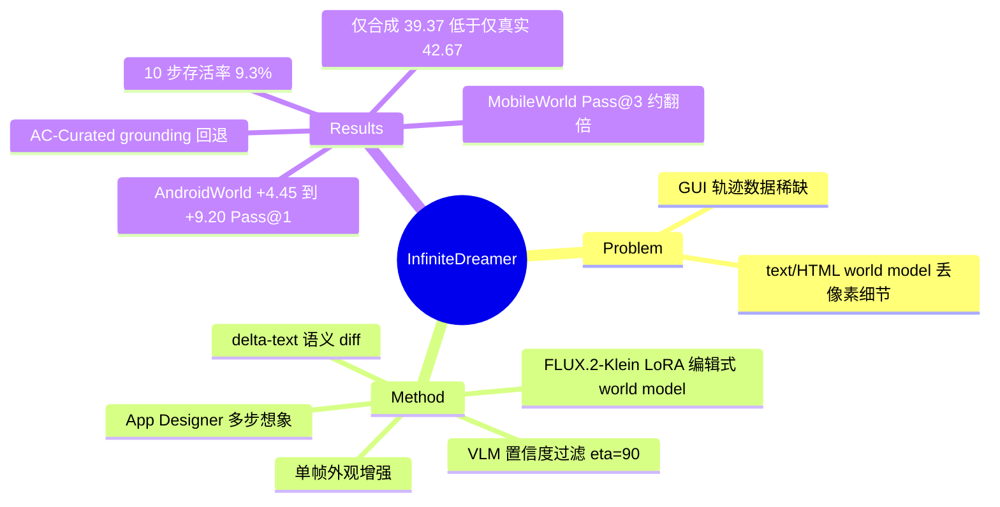

## Summary
Infinite-Dreamer 把 GUI 状态转移改写成 image editing：先用 VLM 把真实 (s_t, a_t, s_{t+1}) 抽成结构化 delta-text（触发操作、新增元素、消失元素、下一步 affordance），再用 AndroidControl 上的截图对 LoRA 微调 FLUX.2-Klein（4B/9B），得到 pixel-level GUI world model，用来合成单帧外观增强数据与 App Designer 驱动的多步想象轨迹。只用合成数据 SFT 的 Infinite-Actor 在 AndroidWorld 上相对 zero-shot Qwen3-VL 提升 +4.45（8B）至 +9.20（4B）Pass@1，MobileWorld Pass@3 近乎翻倍；但在同一 4B ablation 中，纯合成数据（39.37）仍低于纯真实 OpenMobile 数据（42.67），离线 AC-Curated 的 grounding 指标也普遍回退，所以它更像对真实数据的增量补充，替代不了真实数据。

## Problem & Motivation
GUI agent 训练依赖大量带 action 标注的 visual-action 轨迹。人工示范贵、难扩展、涉及隐私；random walk / heuristic 探索缺乏长期目标，容易陷入短循环和死胡同，数据偏向短交互。已有 GUI world model（Qwen-AgentWorld、Code2World 等）用文本描述或 HTML 渲染模拟环境，会丢失 icon、banner、布局样式等像素级细节（Fig. 1）。作者主张截图本身就是 GUI 最自然的状态空间，因此可以直接把 image editing 模型当 GUI world model，在不搭模拟器的前提下（simulation-free）合成训练数据。

## Method
- **层级化转移建模**：把 P(s_{t+1}|s_t, a_t) 分解为语义层 T_sem:(s_t, a_t)→Δ_t 与视觉层 T_vis:(s_t, Δ_t)→s_{t+1}（Eq. 9）。作者的理由是 raw action label 不包含视觉规格，直接预测 s_{t+1} 是 ill-posed 的。
- **Delta-text 抽取（§3.2，App. C）**：训练阶段用 GLM-4.7v 看真实 (s_t, a_t, s_{t+1}, a_{t+1}) 产出 delta-text，字段为 trigger operation / added elements / removed elements / 可选 next-step affordances。合成阶段换成 text-only extractor，从 App Designer 写的 UI 描述反推 delta-text。
- **Image-Editing World Model（§3.3，App. A.1）**：backbone 为 FLUX.2-Klein 4B/9B，按 rectified flow-matching 的 velocity 目标训练，LoRA rank 32、3 epochs、batch 1、分辨率 672×1536，在 4×A100 上用 AndroidControl train split 训练。输入是源截图加 delta-text，不给坐标。
- **两种合成方式（§3.4）**：
  - *Single-frame augmentation*：用外观类 delta-text（换主题、重新着色、icon 重绘）改写单张截图，保持布局和文字不变，原 instruction/action 标签直接复用。
  - *Multi-step imagination*：LLM App Designer 根据真实 seed 截图设计多步任务和每步 UI 描述，text-only extractor 写出 delta-text，world model 自回归 rollout。
- **VLM 质量过滤（§3.4，App. E）**：Qwen3.5-397B-A17B 对每个合成步骤预测该执行的 action 并给出 0–100 置信度；低于 η=90 的步骤丢弃，含这类步骤的轨迹整条移出训练集。
- **Agent 训练（§3.5，App. A.3）**：Qwen3-VL 2B/4B/8B 全参 SFT，1,000 steps、batch 32。主表中的 Infinite-Actor **只用合成数据（aug+gen），不含任何真实轨迹**。

## Key Results
- **World model 质量（Table 2，GLM-4.7v 判分，0–100）**：Infinite-Dreamer-9B 单步 Acc 68.13，未微调的 FLUX.2 Klein 9B 为 62.44，最强通用 editor FireRed-Image-Edit-1.0（20B）为 64.34。10 步 rollout 得分 48.84 / 29.61 / 40.96，9B 在 1/5/10 步三个 horizon 上都最高。去掉 delta-text、只给 trigger action 时，Acc 跌到 21.56（Table 4）。
- **AndroidWorld（Table 1）**：8B Pass@1 从 39.37 升到 43.82（+4.45），Pass@3 从 56.90 升到 62.07；4B Pass@1 从 30.17 升到 39.37（+9.20），与 Qwen3-VL-8B 持平；2B Pass@1 从 22.56 升到 31.61（+9.05），Pass@3 从 29.31 升到 49.14（+19.83）。
- **MobileWorld（Table 1）**：8B Pass@1 从 8.77 升到 15.20，Pass@3 从 11.40 升到 21.93，约翻倍；绝对水平仍远低于 Gemini-3-Flash（43.27/52.63）。
- **AC-Curated 离线 step-level（Table 1）**：多项回退。4B Hard 的 Box Acc 从 77.00 降到 64.70、Step SR 从 57.10 降到 44.20；2B Easy Step SR 从 72.10 降到 61.10；8B Hard Step SR 从 61.60 降到 57.90。作者分析认为框中心是整体位移，不是边缘噪声，且损失集中在小目标上（§4.3）。
- **数据源 ablation（Table 3，Qwen3-VL-4B，AndroidWorld Pass@1）**：无训练 30.17；只用合成数据 39.37；只用真实数据（OpenMobile）42.67；真实+gen 44.83；真实+aug 47.41；三者全用 48.28。aug 的增益（+4.74）大于 gen（+2.16）。
- **按难度分层（Fig. 3a）**：mix-4b 相对 real-4b 在 Easy 上 +4.9、Medium 上 +8.3，Hard 上 −2.7（10.5 vs 13.2）。Hard 失败分析只覆盖 19 个任务、每任务 1 个 episode：17 个失败里 41.2% 耗尽步数预算，35.3% 是虚假完成（App. G.3）。
- **Rollout 存活率（Table 11）**：1,599 条想象轨迹中，单步通过率稳定在 78–85%，累计存活率从第 1 步的 84.6% 降到第 10 步的 9.3%。
- **推理成本（Table 7）**：9B 生成一张图约 57.2 s，4B 约 28.8 s（40 步，672×1536）。

## Evidence Ledger

| Claim ID | Claim | Type | Source locator | Evidence excerpt | Status |
|:--|:--|:--|:--|:--|:--|
| C1 | Infinite-Actor 只用合成数据（aug+gen）训练，不含真实轨迹 | benchmark-setting | §4.1 Datasets; App. A.3 | "trained solely on the Infinite-Dreamer synthesis data ... without using any real trajectories" | source-verified |
| C2 | World model 基于 FLUX.2-Klein 4B/9B，在 AndroidControl train split 上做 LoRA rank 32 微调 | benchmark-setting | App. A.1 Table 5 | "Backbone FLUX.2-Klein (4B / 9B) ... AndroidControl train split ... LoRA rank 32" | source-verified |
| C3 | AndroidWorld 8B：Pass@1 43.82 vs 39.37，Pass@3 62.07 vs 56.90 | number | Table 1; §4.3 | "Infinite-Actor-8B achieves 43.82 Pass@1 and 62.07 Pass@3 ... (39.37 and 56.90)" | source-verified |
| C4 | 2B Pass@1 31.61 vs 22.56（+9.05），Pass@3 49.14 vs 29.31；4B Pass@1 39.37 vs 30.17 | number | Table 1; §4.3 | "Infinite-Actor-2B improves over Qwen3-VL-2B by +9.05 on Pass@1 and +19.83 on Pass@3" | source-verified |
| C5 | MobileWorld 8B：Pass@1 15.20 / Pass@3 21.93 vs 8.77 / 11.40 | number | Table 1; §4.3 | "Infinite-Actor-8B reaches 15.20 Pass@1 and 21.93 Pass@3, against 8.77 and 11.40" | source-verified |
| C6 | AC-Curated 回退：4B Hard Box Acc 77.00→64.70、Step SR 57.10→44.20；2B Easy Step SR 72.10→61.10；8B Hard Step SR 61.60→57.90 | number | Table 1; §4.3 | "regresses in coordinate grounding (Box Acc: 77.00→64.70 on 4B Hard)" | source-verified |
| C7 | Table 2：9B 单步 Acc 68.13 vs FLUX.2 Klein 9B 62.44 vs FireRed 64.34；10 步 48.84 vs 40.96 vs 29.61 | comparison | Table 2; §4.2 | "At 10 steps it scores 48.84, versus 40.96 for FireRed-Image-Edit-1.0 and 29.61" | source-verified |
| C8 | 数据源 ablation：30.17 / 39.37（仅合成）/ 42.67（仅真实，OpenMobile）/ 44.83 / 47.41 / 48.28 | comparison | Table 3; §4.4 | "Adding multi-step imagination to real-only training (42.67) lifts SR to 44.83 ... 48.28" | source-verified |
| C9 | Hard 任务 mix-4b 10.5 vs real-4b 13.2；失败分析覆盖 19 个任务、每任务 1 个 episode，41.2% 耗尽预算、35.3% 虚假完成 | number | §4.4; App. G.3 Table 12 | "mix-4b underperforms real-4b by -2.7 points (10.5 vs. 13.2)" | source-verified |
| C10 | 去掉 delta-text 后单步 Acc 从 68.13 降到 21.56 | causal-mechanism | Table 4 | "removing delta-text collapses synthesis quality (Acc. drops from 68.13 to 21.56)" | source-verified |
| C11 | 过滤阈值 η=90；1,599 条轨迹的累计存活率从 84.6% 降到 9.3%（第 10 步） | number | App. E.2 Table 11 | "Cumulative survival ... falls from 84.6% at step 1 to 9.3% at step 10" | source-verified |
| C12 | GLM-4.7v 同时担任 delta-text extractor 和合成质量 judge；Qwen3.5-397B-A17B 担任过滤器 | benchmark-setting | AI use statement; §4.1 | "GLM-4.7v serves as the delta-text extractor ... and as the judge" | source-verified |
| C13 | 所有结果均为单次训练（seed 42） | benchmark-setting | App. A.4 | "obtained from a single training run per model configuration" | source-verified |
| C14 | 代码仓库为 swaydy-n/Infinite-Dreamer；合成数据与脚本在论文发表后释放 | license-code | Abstract; Reproducibility statement | "synthesized dataset and the generation and training scripts will be released upon publication" | source-verified |
| C15 | 推理耗时：9B 约 57.2 s/张，4B 约 28.8 s/张 | number | App. A.2 Table 7 | "Average Time per Image 57.202 s | 28.779 s" | source-verified |
| C16 | 论文未报告训练 Infinite-Actor 所用合成数据的总规模 | benchmark-setting | App. A.5; A.3 Table 8; E.2 | A.5 只描述 D_aug/D_gen 构成、无样本数；1,599 条为 E.2 的 "validation cache" | source-verified |
| C17 | 作者单位为 Jilin University 与 OPPO | number | Title block | "School of Artificial Intelligence, Jilin University ... OPPO" | source-verified |

## Strengths & Weaknesses
**Strengths**
- **问题定位准确**：GUI world model 有 text、HTML/code、sketch、pixel 几条路线，这篇是 pixel 路线中把现成 image editor 当 transition model 的一个简单实现。Table 2 和 Table 4 都支持"delta-text 是关键接口"：去掉 delta-text 后 Acc 从 68 跌到 22，可见编辑模型自身几乎不懂 GUI 的因果逻辑，GUI 语义要靠 VLM 写成 diff 再交给编辑模型渲染。
- **Ablation 比较诚实**：Table 3 同时给出纯合成和纯真实两个点，作者也没有回避 Hard 任务回退和 AC-Curated 的 grounding 回退，并在 App. G.3 用日志统计区分了"已测量的结果"和"未证实的机制"。
- **Single-frame augmentation 很便宜，收益也最大**：在真实数据之上，aug 带来 +4.74，gen 只有 +2.16。对外观做扰动、保留布局和文字，标签可以直接复用，不需要改动 action 语义。

**Weaknesses / 隐含假设**
- **"只用合成数据"的增益缺少同量真实数据的对照**：主表比较的是 SFT 后的模型与 zero-shot Qwen3-VL。这里的增益至少包含两部分：一是对动作空间和 prompt 格式的适配，二是合成数据本身的价值。纯真实 OpenMobile 数据（42.67）高于纯合成数据（39.37）；world model 本身又是在 AndroidControl 真实数据上训练的，但论文没有给出"直接用 AndroidControl 真实轨迹做 SFT"这一最直接的对照。（推测）相当一部分增益可能来自 in-domain SFT，而不是"想象"。
- **数字口径不一**：Abstract 的 "+9.05" 是 2B 的增益，Intro 的 "up to +9.20" 是 4B 的增益，两处都没有说明对应哪个规模。
- **Contribution 表述前后不一**：§1 写的是 "blending synthetic and real-world data ... outperforming agents trained purely on real demonstrations"，主表却是纯合成设定，两个结论分别对应不同实验。"超过纯真实数据训练"的结论只在 Table 3 的混合设定（48.28 vs 42.67）下成立。
- **评测存在自评风险**：GLM-4.7v 既写训练用 delta-text，又给 Table 2 打分，同一 VLM 判自己参与生成的条件，可能偏向 delta-text 风格的结果；没有 pixel 指标（SSIM/LPIPS）和人工评估作补充。Table 2 中 Step1X-Edit 的 5 步得分（48.95）高于 1 步（33.96），这种非单调也说明 judge 噪声不小。
- **统计强度弱**：所有结果单次训练、seed 42；Hard 任务只有 19 个、每任务 1 个 episode，−2.7 的差距约等于 0.5 个任务（推测：在 AndroidWorld Hard 子集上 1 个任务对应约 5 个百分点），很难判断显著性。
- **合成数据规模和成本不透明**：没有给出 D_aug、D_gen 的样本数（E.2 的 1,599 条轨迹 / 9,504 张截图是用于存活分析的 validation cache，不是训练集规模；训练只给出 1,000 steps × batch 32）；9B 生成一张图约 57 s，"scalable" 的论断缺少每条轨迹的成本核算。
- **长程合成基本不可用**：只有 9.3% 的轨迹能完整保留到第 10 步，gen 数据实际偏向短 horizon，这与动机中"扩展到复杂多步工作流"相矛盾。Hard 任务回退和虚假完成占比高，与这一点一致。
- **过滤口径前后不一**：App. E 写的是含被拒步骤的轨迹整条移除，A.5 写的是 "retained step-by-step after VLM quality filtering"，实际进入训练的是截断轨迹还是完整轨迹并不明确。
- **"world model" 的定位偏强**：GUI 的因果逻辑（点了会出现什么）实际由 App Designer（LLM）和 delta-text 决定，编辑模型负责把语义 diff 渲染成像素。App. A.9 用了较长篇幅论证它"不只是 renderer"，但证据主要是定性的，没有测过错误或不合法 delta-text 下的行为。
- **与同类工作的绝对水平（推测，跨论文、设定不同）**：vault 中 OpenMobile 的 Qwen3-VL-8B 在 AndroidWorld 上报告 64.7%，远高于这里的 43.82；本文的 Qwen3-VL-8B zero-shot 只有 39.37，同样低于常见报告值，可能与 prompt/harness 有关。这类比较不能直接作为 SOTA 依据。

## Mind Map

## Notes
- 与 [[2605-MobileWorldModelGUI]]（delta text / full text / diffusion image / renderable code 四模态比较）直接对话：本文属于 "diffusion image + delta text 条件" 这一格，可以拿来检验那篇的"renderable code 保真度高、text 在 OOD 更鲁棒"的结论。本文没有和 code 路线（Code2World、[[2608-AppDeltaWorld]]）做下游 agent 对比。
- 与 [[2600-MobiledreamerGenerativeSketchWorld]]（sketch 抽象）、[[2606-QwenAgentWorld]]（language world model）构成 GUI world model 的表示谱系：text → sketch → code → pixel。
- 真实数据来源与 [[2604-OpenMobile]] 相同（Table 3 的 real data），可交叉对照。
- 待解问题：aug 的增益是否主要来自 theme/dark-mode 鲁棒性？AndroidWorld 模拟器的默认主题与 AndroidControl 的分布差异可能决定这部分收益。
- repo_candidate 候选：代码仓库已公开，但贡献主要在数据合成 pipeline，不是 runtime 或基建，优先级低。
