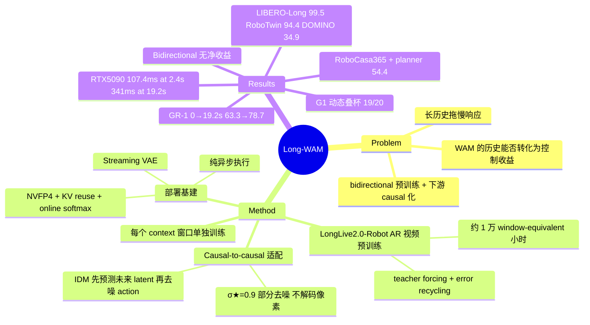

## Summary
Long-WAM 研究 causal world-action model（WAM）的视觉历史长度能否转化为控制收益：先在约 10,000 window-equivalent 小时的 robot/egocentric 视频上做 action-free 的 autoregressive（AR）视频预训练（LongLive2.0-Robot），再以保持因果顺序的方式接 action expert（先预测未来 latent、再条件化去噪 action 的 IDM 模式）。核心发现是"能访问历史 ≠ 会用历史"：RoboCasa GR-1 上 context 从 0.0 s 拉到 19.2 s，AR 初始化的成功率从 63.3% 升到 78.7%，而 bidirectional（Wan2.2）初始化没有净收益。配套的异步执行、streaming VAE 与 NVFP4 加速把 2.4 s context 下单个 action chunk 的推理压到 RTX 5090 上 107.4 ms，并在 Unitree G1 / YAM 真机上做动态拦截与长程操作。

## Problem & Motivation
单帧观测能给出物体位置，却给不出运动方向与交互进度；WAM 把视频预测接进闭环控制，历史帧是天然的输入资源，但更长的历史意味着更长的 prefill 与更慢的响应。已有 WAM（DreamZero、LingBot-VA）把 **bidirectional 预训练**的视频生成器改造成 causal 控制器，因果结构只在下游 action 适配阶段才学；LingBot-VA 2.0 则联合预训练 causal video 与 latent action。作者的问题是：WAM 的控制性能如何随 context 长度变化，这种收益依赖什么条件，以及能否在实时约束下保住它。

## Method
**1. LongLive2.0-Robot（AR 视频预训练）**
- 从 LongLive-2.0 的 16 s AR checkpoint 继续训练，数据为 RoVid-X、AgiBot World、EgoDex、EgoVerse、VITRA 共约 2.29M 个 TI2V 样本；"~10,000 小时" 是按每个样本 16 s 折算的 window-equivalent 估计，**不是**唯一原始素材时长（Appendix B.1 自陈）。
- 纯视频监督，不需要跨 embodiment 统一 action space；序列最长 30 s，用 LongLive-2.0 的 sequence-parallel AR 训练，block-causal teacher forcing + 来自 SVI 的 error recycling（对 context/latent/noise 加 buffered model error，target 仍回归原始 latent）。
- 预训练成本约 30,720 GPU-hours（64×H100）；下游 WAM 在 16×GB200 上训练。

**2. Causal-to-causal world-action adaptation**
- 沿用 DreamZero / LingBot-VA 的非对称 video/action expert 接口：video query 只读自己及更早的视觉 block、永不读 action token；action query 读观测历史、部分去噪的未来 latent 与整个 noisy action chunk。
- **IDM 模式**（predict-then-act）：video expert 从噪声 rollout 4 步，停在 σ★=0.9（不去噪到干净视频、不解码到像素），把历史+未来的 layer-wise KV 交给 action expert，action 去噪全程复用该 KV。对照模式：w/o V（无未来视频）与 CoD（video/action 联合 co-denoising）。
- 训练两 pass：video flow matching；action flow matching 以前向加噪到 σ★ 的 ground-truth future 为条件，且 detach 视觉 cache（action loss 只更新 action expert 与本体感知 adapter）。作者明确承认训练用"带残余 GT 成分的未来 latent"、推理用模型 rollout，两者分布不同，是 training approximation。

**3. Context scaling 实验设计**
- 只改变 causal prefix 中真实观测的时长，未来预测与 action horizon 固定；**每个 context 窗口单独训练一个模型**，在其训练长度下评测；早期历史不足时重复首帧 padding。
- 比较三种视频初始化：Wan2.2（bidirectional）、LongLive-2.0（通用 AR）、LongLive2.0-Robot（robot-domain AR），统一做 causal WAM 适配。GR-1 扫 0–38.4 s，LIBERO-Long 做补充。

**4. 部署基建**
- **纯异步执行**：chunk 长 H，只执行前 R 步，触发步长 S，overlap O=R−S；handoff 时丢弃已过期前缀、直接切换，不做 blending / RTC 式 inference-time guidance / 训练期 prefix conditioning。
- **Streaming VAE**：随观测到达逐组做 causal VAE 编码，触发后只编码剩余帧，满足 T_ready ≤ OΔt 的 handoff deadline，从而允许更短的 overlap。
- **加速**：video expert 线性层 W4A4 NVFP4（action 计算与 KV 存储保持 BF16）+ CUDA Graph + torch.compile；单次调用内复用 denoising-invariant 的 text/state/观测视频 KV；QKV 共享输入量化；video/action 两个 KV buffer 用 online softmax 合并而非拼接；再加 RTX 5090 / DGX Spark / Jetson AGX Thor 的分设备 kernel 调优。

## Key Results
**Context scaling（核心证据，RoboCasa GR-1 / LIBERO-Long，Figure 6）**
- GR-1：LongLive2.0-Robot 初始化 0.0 s → 19.2 s，63.3% → 78.7%；2.4 s → 19.2 s 为 66.3% → 78.7%，LongLive-2.0 为 65.7% → 76.7%。
- Bidirectional（Wan2.2）初始化：61.7%（2.4 s）→ 64.1%（9.6 s）→ 61.6%（19.2 s），无净收益；robot-domain AR 对它的领先从无历史时 3.3 点扩大到 19.2 s 时 17.1 点。
- LIBERO-Long：2.4 s 历史即把 94.5% 提到 99.5%（LongLive-2.0 初始化 94.2% → 99.0%），峰值 context 远短于 GR-1，作者解读为任务依赖的记忆需求。
- 38.4 s 时 GR-1 回落到 75.2% / 74.2%；该窗口是平均训练轨迹（12.1 s）的约 3 倍，80.4% 的历史帧是 padding——作者只是**假设**下降来自历史覆盖不足而非内在记忆上限，未做验证。
- 代价：RTX 5090 上 0 s / 2.4 s / 19.2 s 历史对应 74.6 / 107.4 / 341.0 ms 每 chunk。

**仿真 benchmark**
- LIBERO：IDM 平均 99.5%，LIBERO-Long 99.5%（Table 1：w/o V 94.5%，CoD 95.8%；正文 §5.3 把 CoD 写成 97.8%，实为 CoD 的四套件平均，属论文笔误）。
- RoboTwin 2.0：平均 94.4%（Clean 94.7 / Randomized 94.2），比 ABot-M0.5 高 0.3、比 LingBot-VA 2.0 高 0.8——差距在噪声量级。
- DOMINO（动态物体，经 dynamic-data 微调）：34.9% SR / 45.1 MS，Fast-WAM 19.9% SR。
- RoboCasa GR-1 表：78.7%，比最强基线 Cosmos Policy（67.1%）高 11.6 点。

注：LIBERO / RoboTwin 2.0 / DOMINO 主结果使用最多 2.4 s context，长窗口研究只在 GR-1 上做。

**层级系统（RoboCasa365，Human300 训练、2.4 s context 的 checkpoint，加 planner 时不再训练 policy）**
- Long-WAM 单独 31.4% Overall，+GPT-6 Astra planner 54.4%；planner 单独 25.2%，π0.5 16.9% → 30.5%。Composite-Unseen 6.1% → 35.0%。外部基线分数取自 leaderboard（Qwen-RobotManip 例外，取自其技术报告）。

**部署**
- RTX 5090 V4/A4 端到端 107.4 ms（含观测 VAE），较 BF16 eager（356.0 ms）3.3×；RoboTwin SR 94.4% → 93.5%。DGX Spark 328.2 ms，Thor 378.7 ms。
- 纯异步（S=12, R=24）下 IDM 94.4% → 94.2%，Fast-WAM 掉 15.4 点、LingBot-VA 掉 45.5 点。
- 真机 Unitree G1：传送带 3.0 → 7.5 cm/s 抓杯 100/100/95/90%，Fast-WAM 75% → 0%、π0.5 15% → 0%；动态叠杯 19/20，两基线 0/20。YAM 平均 >40 s 的长程任务成功率 80/80/85%（均值 81.7%）。每条件 20 次。

## Evidence Ledger
| Claim ID | Claim | Type | Source locator | Evidence excerpt | Status |
|:--|:--|:--|:--|:--|:--|
| C1 | GR-1 上 context 0.0 → 19.2 s，成功率 63.3% → 78.7% | number | Abstract; Fig.1; §1; Fig.6(b) | "increasing context from 0.0 to 19.2 seconds raises success from 63.3% to 78.7%" | source-verified |
| C2 | Wan2.2 初始化 61.7(2.4s)→64.1(9.6s)→61.6(19.2s)；robot AR 领先从 3.3 扩大到 17.1 点 | comparison | §5.3 AR vs Bidirectional; Fig.6 | "rises from 61.7% at 2.4 seconds to 64.1% at 9.6, then returns to 61.6% at 19.2" | source-verified |
| C3 | LIBERO-Long 2.4 s 历史：94.5→99.5（Robot AR），94.2→99.0（LongLive-2.0） | number | §5.3 Context Scaling; Fig.6(a) | "raises LIBERO-Long success from 94.5% to 99.5% with LongLive2.0-Robot and 94.2% to 99.0%" | source-verified |
| C4 | 38.4 s 降到 75.2/74.2；窗口约为平均轨迹 12.1 s 的 3 倍，80.4% padding；下降原因为作者假设 | causal-mechanism | §5.3; Appendix A | "80.4% of its sampled history frames are padding. We hypothesize that the decline reflects limited history coverage" | source-verified |
| C5 | GR-1 78.7% 比最强基线 Cosmos Policy 67.1% 高 11.6 点 | comparison | §5.3; Table 4 | "its 78.7% exceeds the strongest GR-1 baseline by 11.6 points" | source-verified |
| C6 | Table 4 把 63.3% 标为 2.4 s，与正文（2.4 s=66.3%）和摘要（0.0 s=63.3%）矛盾；Fig.6(b) 显示表格标签有误 | benchmark-setting | Table 4 vs §5.3 vs Abstract/Fig.6(b) | Table 4: "Long-WAM (2.4 s) \| 63.3"; §5.3: "from 2.4 to 19.2 seconds improves success from 66.3%" | source-verified（论文内部不一致） |
| C7 | LIBERO IDM 平均 99.5，LIBERO-Long 99.5；LIBERO-Long 上 w/o V 94.5、CoD 95.8（Table 1） | number | Table 1; §5.3 Denoising Strategy | Table 1 CoD: "98.6 \| 99.8 \| 96.8 \| 95.8 \| 97.8" | contradicted → 已更正（原草稿照正文写 CoD 97.8，Table 1 为 95.8） |
| C8 | RoboTwin 2.0 平均 94.4（Clean 94.7 / Rand 94.2），比 ABot-M0.5 高 0.3、比 LingBot-VA 2.0 高 0.8 | comparison | §5.2; Table 2 | "leads on average (94.4%) and Clean (94.7%), and ties the best Randomized score" | source-verified |
| C9 | DOMINO（dynamic-data 微调后）34.9% SR / 45.1 MS；Fast-WAM 19.9% SR | number | §5.2; Table 3 | "After dynamic-data fine-tuning, Long-WAM leads with 34.9% SR and 45.1 MS" | source-verified |
| C10 | RTX 5090 V4/A4 107.4 ms（含观测 VAE），BF16 eager 356.0 ms 的 3.3×；SR 94.4→93.5 | number | §1; §6.2; Table 6/8 | "107.4 ms per action chunk on RTX 5090, including the full observation VAE computation, a 3.3× speedup" | source-verified |
| C11 | 107.4 ms 对应 2.4 s 历史；19.2 s 为 341.0 ms，0 s 为 74.6 ms | benchmark-setting | Appendix G, Table 12 | "48 \| 2.4 \| 107.4" ... "384 \| 19.2 \| 341.0" | source-verified |
| C12 | 全部优化后 DGX Spark 328.2 ms、Thor 378.7 ms | number | §6.2; Table 8 | "yielding 107.4, 328.2, and 378.7 ms, for total speedups of 3.3×, 4.1×, and 3.2×" | source-verified |
| C13 | 纯异步：IDM 94.4→94.2；Fast-WAM 掉 15.4、LingBot-VA 掉 45.5 点 | comparison | §6.2; Table 7 | "IDM loses 0.2 percentage points ... Fast-WAM and LingBot-VA lose 15.4 and 45.5" | source-verified |
| C14 | G1 传送带 3.0→7.5 cm/s：100/100/95/90%；Fast-WAM 75→0%，π0.5 15→0%；叠杯 19/20，基线 0 次成功；每条件 20 次 | comparison | §6.1 Dynamic Tasks; Fig.7 | "Long-WAM stays at 90–100% (100%, 100%, 95%, and 90%)" | source-verified |
| C15 | YAM 平均 >40 s 任务 80/80/85%，均值 81.7% | number | §6.1; Fig.8 | "Long-WAM succeeds in 80%, 80%, and 85% ... (81.7% on average" | source-verified |
| C16 | RoboCasa365：31.4→54.4（+GPT-6 Astra），Astra 单独 25.2，π0.5 16.9→30.5，Composite-Unseen 6.1→35.0；外部基线来自 leaderboard（Qwen-RobotManip 除外） | comparison | §6; Table 5; Appendix D | "Composite-Unseen success from 6.1% to 35.0%; Overall improves from 31.4% to 54.4%" | source-verified（已补 Qwen-RobotManip 例外） |
| C17 | context-scaling 中每个窗口单独训练，在各自训练长度下评测 | benchmark-setting | §3.3 | "Each window uses a separately trained model evaluated at its training context length" | source-verified |
| C18 | 约 10,000 window-equivalent 小时，不是唯一原始素材时长；约 30,720 GPU-hours，64×H100 | number | Appendix B.1; §5.1 | "It is not a measurement of unique raw footage" | source-verified |
| C19 | 代码链接为 NVlabs/LongLive/tree/main/Long-WAM；论文许可 CC BY 4.0 | license-code | arXiv HTML header | "License: CC BY 4.0" | source-verified |
| C20 | 论文没有真机 context 长度 ablation，作者把它列为 next step | benchmark-setting | Appendix A（全文 grep 未发现此类 ablation） | "real-robot context-length studies are a natural next step" | source-verified（基于全文检索未发现） |
| C21 | RoboCasa365 用 Human300 训练、2.4 s context 的 checkpoint，加 planner 时不再训练 policy | benchmark-setting | §6 | "Human300-trained checkpoint with 2.4 seconds of visual context, then add GPT-6 Astra without further policy training" | source-verified |
| C22 | CoD 比 IDM 快（V4/A4 下 90.9 vs 107.4 ms），作者说明该对比不能单独归因于执行顺序 | comparison | Appendix F; Table 11 | "does not isolate execution order as the sole source of the latency difference" | source-verified |

## Strengths & Weaknesses
**Strengths**
- **问题表述好**：把"有没有 memory"换成"预训练目标是否教会模型用历史"，并给了一个干净的三组对照（bidirectional / 通用 AR / robot AR，同一 causal 适配）。bidirectional 曲线在 19.2 s 回到起点，而 AR 曲线持续上升，这是全文信息量最大的一张图——它说明 attention mask 层面的"可访问"不够，history-to-future 的预测结构需要在预训练阶段学到。
- **每个窗口单独训练**让 context 收益的读数相对干净（不混入 train/test 长度失配）。
- **诚实的自陈**：window-equivalent hours 的口径、训练/推理未来 latent 分布不一致、38.4 s 下降只是 hypothesis、CoD/IDM 延迟对比不能归因于执行顺序——这些都在附录里主动写明。
- 异步执行不需要 RTC/blending 也能保住成功率（RoboTwin -0.2 点 vs Fast-WAM -15.4），overlap RMSE 约为 Fast-WAM 的 1/3；作者把它归因于连续的未来预测提供了 chunk 间一致的条件——这是机制**推测**，没有去掉未来预测的异步对照（w/o V 的异步结果未报告）。

**Weaknesses / 隐含假设**
- **头条延迟与头条 context 收益不在同一个工作点**：107.4 ms 对应 2.4 s 历史；拿到 78.7% 需要 19.2 s，延迟是 341.0 ms（3.2×）。摘要并列这两个数字容易让人以为"长 context + 实时"同时达成。真机实验用的 context 长度正文未明确报告，且作者自己把 real-robot context-length study 列为 next step——**真机上长 context 是否有用目前没有证据**。
- **benchmark 头条数字也不是长 context 的结果**：LIBERO / RoboTwin 2.0 / DOMINO 主结果只用"最多 2.4 s"context（§5.2），长窗口只在 GR-1 上用。因此 "Long-WAM 在多个 benchmark 上最好"与"长 context 有用"是两条相互独立的证据，不能互相背书。
- **context-scaling 结论只建立在 GR-1 一个 benchmark 的长窗口扫描上**（LIBERO-Long 在 2.4 s 已饱和至 99.5%）；"AR 预训练才会用历史"是一个跨 benchmark 未复验的单点结论，且 GR-1 每个点的 trial 数与方差未在正文给出。
- **AR vs bidirectional 对比存在混杂**：Wan2.2 与 LongLive-2.0 不只是预训练目标不同，模型规模、数据、训练长度（LongLive 训练到 16–30 s 长序列）都不同；"AR 目标本身"与"长序列视频训练经验"无法从这组对照中分离。
- **论文内部有两处数字/标签不一致**（Evidence Ledger C6、C7）：Table 4 把 63.3% 一行标为 "Long-WAM (2.4 s)"，但摘要和 Figure 6(b) 显示 63.3% 对应 0.0 s、2.4 s 对应 66.3%，所以表格标签有误；§5.3 写 CoD 在 LIBERO-Long 上 97.8%，Table 1 为 95.8%。另外正文引用 GR-1 基线时写的是 "Table 6"，实际是 Table 4。这些都是小错，但 GR-1 上和基线比较时要以 Figure 6 为准。
- RoboTwin / LIBERO 的领先幅度（0.3–1.0 点）在 benchmark 饱和区，不足以支撑"方法更强"；DOMINO 与真机动态任务的差距更有说服力，但真机基线（π0.5、Fast-WAM）是否在相同数据上微调、是否同样异步部署，正文交代有限。
- RoboCasa365 层级实验的 "strong policy amplifies planning" 只比了两种 policy（Long-WAM 与 π0.5），且 planner 是闭源 GPT-6 Astra，还能发 bounded end-effector correction；"15 步高频查询即可到 84.4% Atomic" 也说明一部分收益来自重规划频率。

**对领域的影响**：给 WAM 社区一个可操作的论断——想让 world model 的历史有用，要在视频预训练阶段就学因果预测，而不是只改 attention mask。若在更多 benchmark 和真机上复现，这会影响"从 bidirectional video DiT 改 WAM"这条主流路线的选择。

## Mind Map

## Notes
- **与 vault 中相关工作的本质区别**：
  - [[2605-LongLive2]]：Long-WAM 的视频底座与 NVFP4/SP 基建都直接继承自 LongLive-2.0（同一团队）；LongLive-2.0 是长视频生成基建，Long-WAM 把它的 AR 预训练变成控制先验，并加了 robot-domain 继续预训练与 action expert。
  - [[2602-DreamZero]]：DreamZero 把 bidirectional 预训练的 video diffusion 改造成 causal WAM，因果结构在下游学；Long-WAM 的核心论点正是针对这条路线——同样的 causal 适配，bidirectional 初始化用不上长历史。
  - [[2603-MEM]] / [[2607-LaMemVLA]]：这两篇给 VLA 加显式 memory 模块（MEM 用 video encoder 短时 + 语言摘要长时；LaMem-VLA 用 latent memory token）；Long-WAM 不加 memory 模块，只延长原始观测 prefix，把"会不会用历史"归因到视频预训练目标，并主张长时语义记忆交给上层 planner。
  - [[2607-STWAM]]：ST-WAM 也用历史（近 4 帧 DINO feature 检索意图），关注视觉分布偏移下的鲁棒性；Long-WAM 关注历史长度的 scaling 与预训练目标，二者正交。
  - [[2608-ZeroWAM]]：Zero-WAM 用 human video 做 in-context 任务规约（context 是外部示范），Long-WAM 的 context 是机器人自身交互历史。
  - [[2606-AdaWAM]]：AdaWAM 关心何时触发视觉/文本推理以控制开销；Long-WAM 通过固定的 predict-then-act 加系统级加速控制开销，"按需分配 context"是其 Appendix A 提出的 future work，与 AdaWAM 的自适应思路可对接。
  - [[2607-ABotM05]]：RoboTwin 2.0 的主要对手（94.1% vs 94.4%），差距在噪声量级。
- **待追问**：(1) AR vs bidirectional 的差距是否在模型规模/数据量对齐后仍成立？(2) 去掉未来视频预测（w/o V）在异步设置下是否也能保住成功率——这决定"连续预测带来 chunk 一致性"的因果解释是否成立。(3) 单模型 test-time 自适应 context（作者的 next step）能否在 74.6–341 ms 之间按任务取舍。
- 文中引用的相关工作 RoboTTT（context scaling for robot policies）、WAM-TTT、Fast-WAM、LingBot-VA 2.0、AHA-WAM 在 vault 中暂无独立笔记，可作为后续候选。
