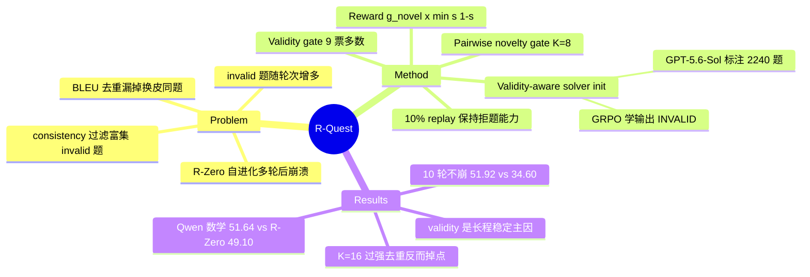

## Summary
R-Quest 诊断 R-Zero 式 questioner–solver 自进化在多轮后崩溃的两个数据侧原因：自生成题目中 invalid 题（矛盾、缺条件、歧义、无解）随轮次增多，且 answer-consistency 过滤反而抬高其占比；BLEU 词面去重识别不出"换皮同题"，题型集中度持续上升。方法是先用 GRPO 把 solver 训练成会输出 `INVALID` 拒题，再用它的多数投票做 validity gate，同时让 frozen base model 对 batch 内随机抽取的 K=8 道题做两两"是否同一题型"判断作为 novelty gate，只有通过两道门的题才拿 uncertainty reward。Qwen3-4B-Base 上 10 轮自进化不崩，第 10 轮数学均分 51.92，比同轮已崩溃的 R-Zero（34.60）高 17.32 分（峰值对峰值只高 2.82 分）；5 轮主表中在两个 backbone、数学/代码/通用推理三个 domain 的均分上都高于 R-Zero、OCNR、R-Diverse。

## Problem & Motivation
R-Zero 一类 self-evolving reasoning 框架让同一初始化的 questioner 和 solver 交替 GRPO：questioner 以 frozen solver 答案一致性接近 0.5 为 reward 出题，solver 用多数投票 pseudo-label 训练。已知问题是自进化几轮后性能回落甚至跌破 base model（本文复现：R-Zero 第 3 轮达峰 49.10，第 10 轮跌到 34.60，低于 base 的 46.17）。已有稳定化方法 OCNR、R-Diverse 都从"多样性"切入，靠 solver 表征距离或额外的 code generator + code encoder 衡量新颖性。本文的切入点是直接检查 R-Zero 产出的题目本身，问两件事：题是不是良定义的？是不是在反复出同一道题？

## Method
**诊断（§2.2）**。用 GPT-5.6-Sol 当外部裁判分析 R-Zero（Qwen3-4B-Base）各轮题池：
- **Validity**：每轮抽 200 题，valid 率从第 1 轮 76.5% 降到第 5 轮 39.5%；经 R-Zero 的 consistency ∈ [0.3, 0.8] 过滤后，第 5 轮训练集 valid 率只剩 27.64%。直觉解释：invalid 题的多数答案天然处于"中等一致"区间，恰好被 uncertainty 过滤器偏好保留。
- **因果检验**：两份各 1,273 题的匹配数据集（共享 766 道 valid 题；其余 507 道一份为原 invalid 题，一份为 GPT-5.6-Sol 修复版），GRPO 训练后最终数学均分 49.91 vs 46.54，前期相近、后期分叉。
- **Repetition**：第 5 轮过滤后题池抽 200 题按"数学构造 + 所问任务"分组，前三大题型占 59.5%；最大题型在 R-Zero 的 BLEU 聚类下被拆成 22 个簇。repetition penalty 按簇大小计，拆簇等于稀释惩罚。

**R-Quest 三个组件**：
1. **Validity-aware solver initialization（§3.1）**：从 R-Zero 前 5 轮 solver 训练集去重抽样，GPT-5.6-Sol 两阶段标注（判 valid/invalid → 只对 valid 题独立解出参考答案，再经答案复核、必要时人工复核），得到 2,240 题（valid 923 / invalid 1,317；train 1,943 / val 297）。GRPO 训练 base model：答对或正确拒题 +1，拒掉 valid 题 −0.5，其余 0；训练 15 步后的 checkpoint 作为 solver 初始化。
2. **Sampled pairwise novelty（§3.2）**：frozen base model 对候选题与 batch 内均匀抽取的 K=8 道其他题逐对判 SAME_TYPE / DIFFERENT，任一对判同类即拒。通过概率近似 (1−p)^K（p 为同类题占比）：p=5% 时约 66.3%，p=20% 时约 16.8%。成本从 O(B²) 降到 O(BK)。
3. **Questioner reward（§3.3）**：solver 先采 9 个 validity 回答，INVALID 比例 u>1/2 则 reward = 1/2 − u（负值）；否则再采 10 个常规解答算一致性 s，reward = g_novel · min(s, 1−s)，g_novel ∈ {0,1}。solver 训练数据同样先过 validity gate，再按 s ∈ [0.3, 0.8] 过滤、多数投票作 pseudo-label；每轮混入 10% 初始化数据 replay，维持拒题能力。

self-evolution 期间不调用比 base model 更强的外部模型；但 validity 初始化数据的标注依赖 GPT-5.6-Sol（见 Strengths & Weaknesses）。

## Key Results
设置：Qwen3-4B-Base 与 OctoThinker-3B-Hybrid-Base；baseline 为 base、R-Zero、OCNR、R-Diverse（后两者由作者在 R-Zero 框架内按论文描述复现，OCNR 每轮 20,000 候选题即 2 倍预算）；每轮 10,000 候选题。7 个数学 benchmark（AMC/AIME 用 mean@32，其余 greedy），代码 HumanEval+/MBPP+（pass@1），通用推理 SuperGPQA/MMLU-Pro/BBEH。主表跑 5 轮，**每个方法每个 domain 报告测试集均分最高的那一轮 checkpoint**。

| 数学均分 | Base | +validity init | R-Zero | OCNR | R-Diverse | R-Quest |
|:--|:--|:--|:--|:--|:--|:--|
| Qwen3-4B-Base | 46.17 | 47.07 | 49.10 | 49.57 | 49.82 | **51.64** |
| OctoThinker-3B | 24.90 | 25.22 | 28.25 | 28.12 | 28.61 | **30.69** |

- **代码 / 通用推理**（Table 2）：Qwen 代码均分 62.69（base 58.79，R-Zero 59.27），通用 32.75（base 28.79）；OctoThinker 代码 18.90（base 13.67，R-Zero 14.14），通用 15.50（base 8.30，R-Zero 14.10）。只做 validity init 的增益很小，增益主要来自后续自进化。
- **10 轮长程**（Fig. 5，Qwen）：R-Zero 第 3 轮 49.10 后跌到第 10 轮 34.60；R-Quest 第 1–10 轮每个 checkpoint 都高于 R-Zero 的峰值，第 10 轮达最高 51.92（比 base 高 5.75，比同轮 R-Zero 高 17.32）。注意 17.32 是 R-Quest 峰值对 R-Zero 崩溃后的值；峰值对峰值（51.92 vs 49.10）差 2.82 分。
- **Ablation**（Table 3，Qwen 数学均分）：完整 51.64 / w/o novelty 51.02 / w/o validity 50.27 / 两者都去（=R-Zero）49.10 / frozen validity judge 49.93。10 轮曲线上去掉 validity 出现后期崩溃，去掉 novelty 只是温和下降且仍高于 base——validity 是长程稳定的主因。
- **过程指标**（Fig. 6–7，GPT-5.6-Sol 裁判）：held-out 297 题上 R-Quest 的 invalid recall 第 10 轮 86.36%，R-Zero 各轮 10.23%–26.14%；未过滤题池 valid 率 R-Quest 第 4–10 轮 94.5%–97.5%，R-Zero 跌到 49.0%；valid 题上多数投票答案正确率第 10 轮 54.69% vs 2.06%；前五大题型占比 R-Zero 从 17.0% 升到 69.0%，R-Quest 第 5 轮 24.0%。
- **K 的反直觉结果**：K=16 进一步压低题型集中度（第 4 轮 30.0% → 16.8%），但数学性能始终低于 K=8——过强的去重会连同"同题型中更难的变体"一起压掉。

## Evidence Ledger

| Claim ID | Claim | Type | Source locator | Evidence excerpt | Status |
|:--|:--|:--|:--|:--|:--|
| C1 | R-Zero 题池 valid 率第 1 轮 76.5% → 第 5 轮 39.5%（每轮 200 题，GPT-5.6-Sol 判） | number | §2.2.1, Fig. 3(a) | "valid-question rate falls from 76.5% in round one to 39.5% in round five" | source-verified |
| C2 | consistency ∈ [0.3, 0.8] 过滤后第 5 轮 valid 率 27.64% | number | §2.2.1 | "the valid question rate is further reduced, reaching 27.64% in round five" | source-verified |
| C3 | 匹配实验（1,273 题，共享 766 valid，507 题原版 vs 修复版）：49.91 vs 46.54 | number / causal-mechanism | §2.2.1, Fig. 3(b) | "final average score of 49.91 across seven mathematical benchmarks, compared with 46.54" | source-verified |
| C4 | 第 5 轮前三大题型占 59.5%；最大题型被 BLEU 拆成 22 簇 | number | §2.2.2, Fig. 4 | "the largest type of question is split into 22 clusters" | source-verified |
| C5 | Questioner reward：g_valid=1/2−u<0 时取 g_valid，否则 g_novel·min(s,1−s)；9 个 validity 回答 + 10 个解答 | causal-mechanism | §3.3 公式; App. C.2, Table 7 | "To evaluate each generated question, the frozen solver first produces nine validity responses." | source-verified |
| C6 | frozen base model 与 K=8 道随机题两两比较，任一同类即拒；通过概率 ≈ (1−p)^K | causal-mechanism | §3.2; App. B.1–B.2 | "reject the candidate if any reference is judged to be of the same type" | source-verified |
| C7 | 初始化数据 2,240 题（train 1,943 / val 297），reward +1 / −0.5 / 0，15 步，10% replay | number | §3.1; App. A.1 Table 4; A.3 Table 6; C.2 | "Annotation and answer review yield a final dataset of 2,240 questions" | source-verified |
| C8 | Table 1 数学均分：Qwen 46.17/49.10/49.57/49.82/51.64；Octo 24.90/28.25/28.12/28.61/30.69 | comparison | Table 1 | "R-Quest achieves the highest average performance across seven mathematical reasoning benchmarks on both backbones" | source-verified |
| C9 | 主表 5 轮，每方法每 domain 取测试均分最高的 checkpoint | benchmark-setting | §4.1 Evaluation | "For each domain, we report the checkpoint with the highest average benchmark score across evaluated rounds." | source-verified |
| C10 | 10 轮：R-Zero 第 3 轮 49.10 → 第 10 轮 34.60；R-Quest 第 10 轮 51.92，同轮领先 17.32，各轮均高于 R-Zero 峰值 | comparison | §4.2, Fig. 5 | "every checkpoint from rounds one through ten exceeds R-Zero's best score" | source-verified |
| C11 | Table 2 代码/通用均分（Qwen 62.69 vs 58.79/59.27；Octo 18.90 vs 13.67/14.14；通用 32.75 vs 28.79、15.50 vs 8.30） | number | Table 2 | "improves average code generation scores over the base models by 3.90 points ... and 5.23 points" | source-verified |
| C12 | Ablation 数学均分 51.64 / 51.02 / 50.27 / frozen judge 49.93 | number | Table 3; App. F Table 9 | "removing either validity or novelty feedback lowers performance across all three domains" | source-verified |
| C13 | 去 validity 后期崩溃，去 novelty 温和下降且高于 base | causal-mechanism | §4.2, Fig. 5 | "its removal leads to late-stage collapse, whereas the variant without novelty feedback shows a milder decline" | source-verified |
| C14 | balanced acc 64.80% → 72.93%；invalid recall 86.36% vs R-Zero 10.23%–26.14% | number | §4.3.2, Fig. 6(a)(b) | "R-Quest achieves an invalid recall of 86.36% in round ten" | source-verified |
| C15 | 题池 valid 率 R-Quest 88.0% → 94.5%–97.5%（第 4–10 轮）；R-Zero 76.5% → 49.0% | number | §4.3.2, Fig. 6(c) | "the rate for R-Zero falls from 76.5% to 49.0%" | source-verified |
| C16 | 第 10 轮 valid 题多数答案正确率 54.69% vs 2.06%（严格口径） | number | §4.3.2, Fig. 6(d) | "R-Quest retains 54.69% accuracy, whereas R-Zero falls to just 2.06%" | source-verified |
| C17 | top-5 share R-Zero 17.0% → 69.0%；R-Quest 24.0%；K=16 第 4 轮 30.0% → 16.8% 但性能低于 K=8 | comparison | §4.3.3, Fig. 7 | "This further lowers the top-five share, most notably from 30.0% to 16.8% in round four." | source-verified |
| C18 | 自进化中不调强模型，但初始化数据由 GPT-5.6-Sol 标注 | benchmark-setting | §1; §3.1; App. A.2 | "without further calls to stronger external models"; "We use GPT-5.6-Sol to annotate these questions" | source-verified |
| C19 | 代码链接 github.com/JinYuanLi0012/R-Quest | license-code | HTML 标题区 Code 链接 | href="https://github.com/JinYuanLi0012/R-Quest" | source-verified |
| C20 | OCNR 每轮 20,000 候选（2 倍预算）；R-Diverse 用 Qwen2.5-Coder-7B + Jina-Code-Embeddings-1.5B | benchmark-setting | App. D | "we generate 20,000 candidate questions per round, twice our standard budget" | source-verified |
| C21 | 7 位作者、WashU + UMich、v1 提交 2026-10-03 | number | HTML 作者区; arXiv API | "Washington University in St. Louis, University of Michigan, Ann Arbor" | source-verified |

> 21/21 条由独立 verifier 对照 arXiv v2 HTML 全文核查为 source-verified；仅表示原文一致性，不表示结果已被独立复现。所有过程指标（C1–C4、C14–C17）的裁判均为 GPT-5.6-Sol，单次运行、无方差。

## Strengths & Weaknesses
**Strengths**
- **诊断先于方法**。没有直接再加一个多样性正则，而是先量化 R-Zero 题池的病理，再用匹配数据集（同 766 题、只替换 507 道 invalid 题）做干预实验，把"invalid 题导致退化"从相关推进到局部因果（在该设置下）。这个 1,273 题对照实验是全文信息量最高的一处。
- **点破了 consistency 过滤的结构性缺陷**：uncertainty reward 与 [0.3, 0.8] 过滤偏好"答案不一致"的题，而 ill-posed 题正是答案最不一致的一类，所以过滤器会系统性富集 invalid 题。这对所有用 self-consistency 当难度代理的方法都成立，不限于 R-Zero。
- **novelty 判定的简化很干净**：把集合级多样性降为原子化的两两"同题型"判断 + 随机抽样，有闭式通过概率 (1−p)^K 可解释 K 的作用，不需要额外 encoder。
- 过程指标（invalid recall、题池 valid 率、伪标签正确率）把"为什么不崩"和"性能"分开报告，R-Zero 第 10 轮 valid 题上多数答案正确率仅 2.06%，说明崩溃不只在题目侧，伪标签监督也同时失效。

**Weaknesses / 边界**
- **"self-contained"打了折扣**：自进化循环内确实不调强模型，但拒题能力来自 GPT-5.6-Sol 标注的 2,240 题外部监督（含人工复核），且这批题恰好采自 R-Zero 在同一 backbone 上的失败题池。这相当于把强模型的"良定义"判断蒸馏进 solver，与 R-Diverse 调用外部 code 模型的差别是"前置一次"vs"每轮调用"，而非有无外部知识。frozen validity judge 变体（49.93）低于完整方法，说明持续 replay + 自进化中的拒题训练有作用，但这仍不能区分外部标注与内生机制各自的贡献。
- **测量依赖同一个外部裁判**：诊断（valid 率、题型分组）和效果分析（valid 率、伪标签正确率、top-5 share）都由 GPT-5.6-Sol 打分，题型分组还依赖 LLM 顺序聚类（3 种随机顺序取平均）。裁判与初始化标注是同一模型，R-Quest 的 solver 学的正是这个裁判的"invalid"口径，过程指标对 R-Quest 存在天然的口径对齐优势。
- **主表 checkpoint 选择用测试集**：每个方法取测试 benchmark 均分最高的那一轮，对所有方法一致，但会抬高绝对数，且数学、代码、通用三个 domain 的数字可能来自不同轮次的 checkpoint，没有独立 validation set。5 轮内各方法差距约 1.8–2.5 分，未报告多 seed 方差；AIME 等小 benchmark 上的个别格子（如 OCNR AIME25 7.92）波动明显。
- **baseline 是复现**：OCNR、R-Diverse 由作者在 R-Zero 框架里按论文描述重写，非官方代码。初始化是否统一用于所有 baseline，正文表述模糊（Training Settings 写"The solver uses the validity-aware initialization"，但 R-Zero 行与 ablation "w/o both (R-Zero)" 数值相同，提示 R-Zero 行未用该初始化）；R-Zero 各轮 invalid recall 仅 10%–26% 也与"从初始化模型出发"不符。w/o validity 变体只去掉 gate 还是连初始化和 replay 一起去掉，论文未定义——这影响对 "validity 是长程稳定主因" 的归因。
- **领域边界**：只在数学题自进化上验证，validity 有相对清晰的定义（矛盾/缺条件/无解）。开放式任务、代码任务中"invalid"的边界更模糊；3–4B 规模之外是否成立也未测。

**影响判断**：这篇论文把"自进化崩溃"的讨论从"多样性不足"推到"题目是否良定义"，并给出 consistency 过滤反向富集 invalid 题这一机制性观察，对任何以 self-consistency 当 reward/难度代理的自生成数据流程都有警示意义。方法本身是 R-Zero 的增量修补（两道 gate），novelty 主要在诊断。

## Mind Map

## Notes
- **与 R-Zero / Absolute Zero 的本质区别**：vault 中暂无 R-Zero、Absolute Zero 的独立笔记。[[Papers/2606-VisPlay|VisPlay]] 是 R-Zero 范式向 VLM 的迁移（同一作者群：Chengsong Huang、Jiaxin Huang），其 questioner 同样以 confidence→0.5 为 reward、多数投票作 pseudo-label——R-Quest 指出的"consistency 过滤富集 invalid 题"在 VisPlay 上应同样存在，值得回看 VisPlay 是否报告长程轮次。Absolute Zero 用代码执行做任务与答案验证，validity 由执行器外生保证，因而根本不存在本文的 invalid 题问题；R-Quest 的处境是没有执行器的纯数学文本自进化，只能靠学出来的 validity 判断来补上"外部 verifier"的缺位。[[Papers/2604-SpatialEvo|SpatialEvo]] 走 Absolute Zero 那条路：用确定性几何环境替代模型共识，同样绕开了题目良定义问题。
- **与崩溃文献的关系**：[[Papers/2606-RiseAndCollapse|RiseAndCollapse]] 把 self-training 崩溃归因于固定分布上的 within-task over-optimization；[[Papers/2606-CodeSelfReviewCollapse|CodeSelfReviewCollapse]] 认为模型 self-gate 会进入 rubber-stamp regime、必须有 exogenous verification。R-Quest 给出第三种机制（训练分布本身被 invalid 题和重复题污染），并且其 self-gate 恰好是用外部强模型标注数据"预校准"过的——这与 CodeSelfReviewCollapse 的结论并不矛盾，反而支持"self-gate 需要外部锚点"。R-Quest 的 frozen validity judge 弱于持续训练的 judge，与 rubber-stamp 担忧方向相反，是一个值得对照的矛盾点（推测：差别在于 R-Quest 有 10% 带真标签的 replay 作锚）。
- [[Papers/2607-SpyRL|SpyRL]]、[[Papers/2512-GenEnv|GenEnv]] 同属"模型给自己造任务"一族：SpyRL 用任务变换造可验证 reward，GenEnv 用 α-curriculum 对齐难度。两者都没有显式处理"生成任务是否良定义"。
- **开放问题**：(1) validity 能力是否必须靠外部标注启动？能否用 solver 自身多路径矛盾检测冷启动？(2) uncertainty reward 与 invalid 题的耦合是否可以从 reward 设计上直接解耦（例如用"解题路径一致但答案分歧"区分难题与坏题）？(3) 题型 novelty 只做 batch 内比较，跨轮重复（R-Diverse 有 memory penalty）未处理。
