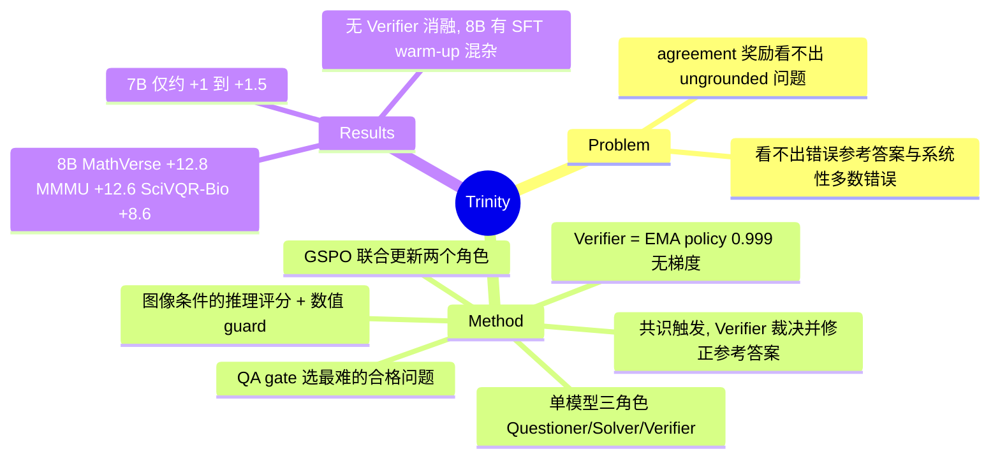

## Summary
Trinity 在 Questioner–Solver 式 self-evolving VLM 里加了第三个角色 Verifier：它是 policy 自身的 EMA 副本（α=0.999，不接收梯度），在问题进入监督前检查 image grounding 和参考答案是否正确，按图像给 Solver 的推理打分，并在 Solver 强共识与参考答案冲突时裁决，用来替代纯 agreement 奖励。只用 Vero-600K 的图像训练时，Qwen3-VL-8B 在 MathVerse 上 +12.8、MMMU 上 +12.6、SciVQR-Bio 上 +8.6，Qwen2.5-VL-7B 则只有约 +1 到 +1.5。但 8B 起点做过 300 条 SFT format warm-up，各模型 decoding 设置不同，论文也没有 Verifier 组件消融，所以增益中有多少来自 Verifier 无法从原文判断。

## Problem & Motivation
现有 self-evolving VLM（VisPlay、V-Zero、EvoLMM、iReasoner 等）主要用 Solver 采样答案之间的 agreement 当奖励：Solver 分歧率接近目标值的问题算"好问题"，与多数票一致的回答算"对"。作者指出 agreement 有两个盲区。一是看不出问题是否 grounded：问图中不存在的对象，或者不看图也能答的问题，同样会造成分歧并被当成"难"，Questioner 因而会漂向病态问题。二是看不出参考答案是否错误：Questioner 自带的答案错了，正确的 Solver 反而被惩罚；Solver 犯同一种系统性错误时，多数票也会一致地错。这两种失败只看答案统计是发现不了的，需要一个看图的评估者。

## Method
**三角色单模型**：Questioner 和 Solver 共享可训练 policy $\pi_\theta$，只靠 prompt 区分；Verifier $\pi_\phi$ 是 $\pi_\theta$ 的 EMA 副本，只做推理，每个 outer step 后按 $\phi\leftarrow 0.999\phi+0.001\theta$ 更新（在 merged 权重上做 EMA，不是对 LoRA 因子做平均）。部署时只用 Solver。

**流程（每张无标注图像 $x$）**：
1. Questioner 采样 $G=4$ 个候选 (q, a)，a 为至多 10 词的短答案。
2. **QA 筛选**：Verifier 给每个候选打三个信号：question factuality $R_{\text{fact-q}}\in\{0,1\}$（前提都可在图中看到，且不看图答不出），answer correctness $R_{\text{corr-a}}\in\{0,1\}$，以及 difficulty $R_{\rm diff}\in\{0.1,0.4,0.7,1.0\}$（四级 rubric：observable / single-step / multi-step / conceptual）。在两个 gate 都通过的候选里选 $R_{\rm diff}$ 最高的作为 $(q^*,a^*)$；全部不通过时该图只贡献 Questioner rollout。
3. Solver 对 $(q^*,a^*)$ 采样 $K$ 个回答（8B 为 4，7B 为 6）。
4. **回答评估**：$R_{\rm correct}$ 分三层：先做规则匹配（LaTeX/单位/比例归一化），再用数值 hard-mismatch guard（两边都是数字且相差超过 1% 时直接判 0，防止 Verifier 误判为对），剩下的模糊情况交给纯文本的 Verifier 等价判断。$R_{\rm reason}\in\{0,0.25,0.5,1\}$ 由 Verifier 结合图像打分，惩罚视觉误读、逻辑错误和 shortcut。
5. **争议裁决**：当 ≥75% 的格式合规 Solver 答案一致、与 $a^*$ 不同、且都被判错时，Verifier 拿到图像、两个答案和一条支持推理，自己解题后选边。若站在 Solver 一边，就覆盖 $a^*$、重算所有 $R_{\rm correct}$，并把 Questioner 的 $R_{\text{corr-a}}$ 置 0（实际效果是该候选奖励减半，不是清零）。多次重试后仍得不到可解析的裁决时，实现上**直接采纳多数票**。

**奖励**：
- Questioner：$R_Q=R_{\rm fact}(0.3\,\widetilde R_{\rm diff}+0.7\,R_{\rm chal})$，format 不合规时为 $-0.5$。其中 $R_{\rm fact}=R_{\text{fact-q}}(1+R_{\text{corr-a}})/2$，$R_{\rm chal}=1-\overline{R_{\rm correct}}$（当前 Solver 的经验失败率），$\widetilde R_{\rm diff}=R_{\rm diff}(0.5+0.5R_{\rm chal})$。效果是：ungrounded 的问题拿 0 分；grounded 但参考答案错误的问题最多拿一半；经验失败率的权重高于 Verifier 先验难度。
- Solver：$R_S=0.5R_{\rm correct}+0.3R_{\rm reason}R_{\rm correct}+0.2R_{\rm fmt}$。只有答对，推理分才计入。

**优化**：按图像、按角色分组标准化得到 GRPO 式 advantage，两个角色的 rollout 合并后用 GSPO 的 sequence-level clipped surrogate 联合更新，外加一个对 rollout policy 的正则项；没有 length reward。只训练 LLM 部分的 LoRA，vision encoder 冻结。

## Key Results
**设置**：backbone 为 Qwen2.5-VL-7B-Instruct 和 Qwen3-VL-8B-Instruct；训练只读 Vero-600K 的图像（约 600K，其中约 1/6 是 STEM），不使用其 QA 标注。OmniScience（约 1.5M 张论文 figure）作为数据消融。8B 的起点不是原版 Instruct，而是用 300 条 Vero-600K 样本做过 format warm-up SFT 的 checkpoint（原数据集的题目和参考答案，加上 Qwen3-VL-8B-Thinking 生成的推理）。硬件为单节点 8×A100 80GB；8B 每个 outer step 约 10–20 分钟，300 step 需要数天。

**Qwen3-VL-8B（Table 1）**：

| Model | MathVision | MathVerse | MathVista | MMMU | EMVista | SciVQR-Bio | MME-SCI |
|:--|:--|:--|:--|:--|:--|:--|:--|
| Qwen3-VL-8B-Instruct | 52.3 | 58.2 | 76.7 | 57.0 | 44.8 | 56.7 | 19.0 |
| MM-Zero | 39.6 | 45.1 | 67.2 | 58.3 | 45.0 | 62.5 | 17.6 |
| DPE | 53.9 | 57.2 | 76.2 | 69.1 | 44.1 | 60.8 | 20.4 |
| Trinity (Vero-600K) | 57.8 | 71.0 | 79.6 | 69.6 | 47.0 | 65.3 | 20.3 |
| Trinity (OmniScience) | 58.2 | 70.6 | 79.6 | 70.7 | 47.0 | 62.5 | 21.9 |

- Trinity 在所有 benchmark 上都高于 base，涨幅最大的是 MathVerse（+12.8）和 MMMU（+12.6）。MathVerse 上比 DPE 高 13.8；MMMU 上与 DPE 持平（69.6 vs 69.1）。MM-Zero 在三个数学 benchmark 上都低于 base。
- 科学类 benchmark 只跑一次（K=1）。开放题由本地 Qwen3.5-27B 评判（官方 judge 是 Qwen2.5-72B-Instruct）。Trinity 用 temperature 1.0 / top-p 0.95 解码，base 和 DPE 用 0.7 / 0.8。

**Qwen2.5-VL-7B（Appendix B, Table 2）**：增益很小，MathVision +1.1、MathVerse +1.5、MathVista +1.2。表中只有 Trinity 在 MathVerse 和 MathVista 上都没有低于 base（VisPlay 在 MathVerse 上降了 10.9）。不过 VisPlay、iReasoner、V-Zero 的数字直接取自各自论文，评测协议不一致；7B 的科学 benchmark 上 Trinity 用采样解码，base 和 EvoLMM 用 greedy。

**训练动态（8B OmniScience，前 50 步均值 → 后 50 步均值）**：$R_{\rm fact}$ 0.27→0.57，$R_{\rm diff}$ 0.11→0.23，$R_{\rm correct}$ 0.53→0.63，$R_{\rm reason}$ 0.76→0.93，$R_{\rm chal}$ 始终低于 0.09，选中率 0.16→0.23。作者把"$R_{\rm chal}$ 平稳、而 $R_{\rm fact}$ 和 $R_{\rm diff}$ 上升"解读为 curriculum 一直略领先于 Solver。附录 A.5 也承认，单看奖励趋势无法区分"推理变好"和"出题分布或评估者行为变了"。

## Evidence Ledger

| Claim ID | Claim | Type | Source locator | Evidence excerpt | Status |
|:--|:--|:--|:--|:--|:--|
| C1 | 作者 Youngwan Lee / Yong-Ju Lee / Sung Ju Hwang（ETRI、KAIST、DeepAuto.ai），NeurIPS'26 AgenticLS workshop，v1 2026-10-03 | benchmark-setting | Title page; arXiv API | "arXiv:2610.04469v1 [cs.AI] 03 Oct 2026 … Agentic AI for Biological Discovery (AgenticLS)" | source-verified |
| C2 | Questioner/Solver 共享权重、只以 prompt 区分；Verifier 为无梯度 EMA 副本，α=0.999 | causal-mechanism | Sec 1; Sec 2 Joint optimization and EMA | "Questioner and Solver share the trainable policy weights and differ only by prompt … Verifier is an EMA copy" | source-verified |
| C3 | $R_Q=R_{\rm fact}(0.3\widetilde R_{\rm diff}+0.7R_{\rm chal})$，format 失败 −0.5；$R_{\rm fact}$ 与 $\widetilde R_{\rm diff}$ 定义如正文 | causal-mechanism | Sec 2 Eq.(1) | "(α_Q,β_Q,ρ_f)=(0.3,0.7,0.5)" | source-verified |
| C4 | $R_S=0.5R_{\rm correct}+0.3R_{\rm reason}R_{\rm correct}+0.2R_{\rm fmt}$ | causal-mechanism | Sec 2 Eq.(2) | "(w_c,w_r,w_f)=(0.5,0.3,0.2)" | source-verified |
| C5 | 争议裁决：≥75% 共识且全判错时触发；站 Solver 则覆盖参考答案、Questioner 奖励减半；无可解析裁决时采纳多数 | causal-mechanism | Sec 2 Dispute resolution; App A.3 | "If no parsable verdict is obtained after the retries, the implementation adopts the majority" | source-verified |
| C6 | 只用 Vero-600K 图像（约 600K，1/6 STEM），不读 QA 标注；OmniScience 1.5M 作数据消融 | benchmark-setting | Sec 3 Setup; App A.1 | "using only the images of Vero-600K, about 600K images of which one sixth are STEM" | source-verified |
| C7 | 8B 起点经 300 条 SFT format warm-up（原 QA + Qwen3-VL-8B-Thinking 推理）；7B 无 warm-up | benchmark-setting | App A.1 Qwen3-VL-8B initialization | "The warm-up contains 300 examples sampled from Vero-600K … reasoning generated by Qwen3-VL-8B-Thinking" | source-verified |
| C8 | 8B base→Trinity(Vero)：MathVerse 58.2→71.0 (+12.8)、MMMU 57.0→69.6 (+12.6)、SciVQR-Bio 56.7→65.3 (+8.6) 等七项 | number | Table 1 | Trinity row 57.8 / 71.0 / 79.6 / 69.6 / 47.0 / 65.3 / 20.3 | source-verified |
| C9 | DPE MMMU 69.1、MathVerse 57.2（Trinity 领先 13.8）；MM-Zero 三个数学 benchmark 均低于 base | comparison | Table 1; Sec 3 Main results | "matches Trinity on MMMU but trails it by 13.8 points on MathVerse" | source-verified |
| C10 | 原文称 OmniScience 与 Vero 变体在科学 benchmark 上"statistically indistinguishable"，而科学 benchmark 为单次运行 | benchmark-setting | Sec 3; App A.4 | "The three science benchmarks are single-run (K=1) values" | source-verified |
| C11 | 解码不一致（Trinity 1.0/0.95，base 与 DPE 0.7/0.8）；开放题用本地 Qwen3.5-27B 而非官方 Qwen2.5-72B judge | benchmark-setting | App A.4 Evaluation protocol | "local Qwen3.5-27B judge (the official judge is Qwen2.5-72B-Instruct" | source-verified |
| C12 | 7B：三个数学 benchmark +1.1/+1.5/+1.2，只有 Trinity 在 MathVerse/MathVista 上不低于 base；部分基线数字取自原论文；科学 benchmark 上 base/EvoLMM 用 greedy | comparison | App B Table 2 | "base model and EvoLMM are decoded greedily, following their release settings" | source-verified |
| C13 | 训练动态：$R_{\rm fact}$ 0.27→0.57、$R_{\rm diff}$ 0.11→0.23、$R_{\rm correct}$ 0.53→0.63、$R_{\rm reason}$ 0.76→0.93、$R_{\rm chal}<0.09$、选中率 0.16→0.23 | number | Sec 3 Training dynamics; Fig 2 | "R_fact increases from 0.27 to 0.57 … R_chal remains below 0.09" | source-verified |
| C14 | 无 Verifier 组件消融（唯一的消融是 OmniScience 数据消融） | sota-novelty | Whole paper; App D | "As a data ablation, we also train on OmniScience" | source-verified |
| C15 | 论文未提供代码仓库链接（唯一非模板链接是 Vero-600k 数据集） | license-code | Whole paper; HTML links | 唯一外链为 huggingface.co/datasets/zlab-princeton/Vero-600k | source-verified |
| C16 | MME-SCI 增益几乎全来自选择题；base 开放题常常无法终止，Trinity 修复了这一点；多图问题无优势；Verifier 有假阴性与假阳性 | causal-mechanism | App D Scope of the gains; Verifier reliability | "base model often fails to terminate open-ended answers within the token budget, which Trinity training fixes" | source-verified |
| C17 | 8×A100 80GB；8B 每个 outer step 约 10–20 分钟，300 步需数天 | number | App A.2; App D Memory footprint | "one outer step takes on the order of ten to twenty minutes … 300 steps take several days" | source-verified |
| C18 | Text-only 对照（Qwen3.5-27B，20 次采样）在四个案例上答对 0/20、2/20、4/20、0/20 | number | App E Text-only controls | "judge answers correctly 0/20, 2/20, 4/20 and 0/20 under the first control" | source-verified |

## Strengths & Weaknesses
**Strengths**
- 问题诊断说到了点子上：agreement 奖励对"ungrounded 问题"和"错误参考答案"都是盲的。这一点给 VisPlay、V-Zero 这一路共同的软肋起了名字，并且给出了具体机制。
- 奖励设计里有几处细节体现了对 reward hacking 的意识：数值 hard-mismatch guard 防止 Verifier 把数值不符判成对；推理分只在答对时计入，防止"流畅但错误"的推理拿分；争议裁决的触发条件是共识，但最终由看图的 Verifier 判，而不是直接采纳投票。
- 作者自己很坦诚：附录 D 列出了 Verifier 的假阴性和假阳性、MME-SCI 增益几乎全部来自选择题、base 在开放题上经常无法在 token 预算内终止，以及多图问题上没有优势。

**Weaknesses**
- **没有 Verifier 消融（最关键的缺口）**：论文的核心 claim 是"self-verifier 让 self-evolving 更可靠"，但没有报告去掉 QA gate、去掉争议裁决、把 EMA Verifier 换成当前 policy，或完全不用 Verifier 的对照。Table 1 的对手是不同数据、不同方法的 MM-Zero 和 DPE，不是"Trinity 减去 Verifier"。所以文中"增益来自 verified curriculum"的归因目前只是推测。
- **base 对照存在混杂**：(a) 8B 起点做过 300 条 SFT warm-up，数据是带参考答案的原 QA 加上 Thinking 模型的推理，论文自己也说这属于 supervised initialization，比较时必须考虑；(b) Trinity 和 base 的解码温度不同；(c) 附录 D 承认，base 在开放题上经常无法在预算内终止，而 Trinity 训练修好了这一点。MMMU 上 base 只有 57.0，而按同样 base 条件评测的 DPE 有 69.1，两者都高出约 12 分。这说明 MMMU 的涨幅可能主要来自格式和终止行为的修复，而不是 Trinity 特有的东西（推测，原文没有拆解）。
- **统计支撑弱**：科学 benchmark 只跑一次，但文中仍称 OmniScience 和 Vero 两个变体"statistically indistinguishable"，没有给出检验；SciVQR-Bio 只有 360 题，两个变体相差 2.8 分。
- **7B 增益很小**（约 +1 到 +1.5）。作者用"Verifier 就是 backbone，弱模型评得也差"来解释，这恰好说明这条路的上限被 backbone 自身的感知能力锁住：Solver 读错图，Verifier 也会读错。self-verifier 无法纠正与 policy 共有的错误，作者在附录 C/D 也把这一点列为主要局限。
- 代价高：训练时 policy、EMA 副本和 vLLM 引擎同时驻留，8B 跑 300 步需要数天；论文没有提供代码链接。

**对领域的意义**：这篇论文的价值在于问题陈述，而不是证据。它把 self-evolving VLM 的瓶颈从"如何定义难度"推到"监督信号的真值从哪里来"。但它给出的答案（EMA 自评）在原理上仍然是 endogenous verification。与 SpatialEvo 用确定性几何、Agent0-VL 和 MM-Zero 用工具或执行反馈相比，Trinity 只是延迟了自评偏差的累积，并没有引入外部真值。

## Mind Map

## Notes
- **与 [[2606-VisPlay]] 的本质区别**：VisPlay 的 Questioner 以 frozen Reasoner 的不确定性为奖励，Reasoner 以 majority-vote pseudo-label 为奖励，两个角色交替训练，监督信号完全来自答案统计。Trinity 在它前面加了一道看图的 gate，后面加了一道争议裁决，且两个角色联合更新。Trinity 的 7B 表格中 VisPlay 在 MathVerse 上掉了 10.9，作者把它当成 agreement 奖励会把 Questioner 引向病态问题的间接证据。但两者的评测协议不同，这一推断不能当成定论。
- **与 [[2604-SpatialEvo]] 的本质区别**：SpatialEvo 从点云和相机位姿确定性地算出真值，是 exogenous verification；Trinity 的 Verifier 是 policy 的 EMA，是 endogenous verification。SpatialEvo 只适用于真值可计算的领域（3D 几何）；Trinity 适用于任意图像，代价是没有独立的真值来源。两者合起来刻画了一个权衡："真值可计算 → 可靠但领域窄；自评 → 通用但上限受 backbone 限制"。
- **与 self-training 失败模式文献的张力**：[[2606-CodeSelfReviewCollapse]] 发现模型自评 gate 会进入 rubber-stamp regime（通过率上升、正确率下降）。Trinity 的 $R_{\rm fact}$ 0.27→0.57、$R_{\rm reason}$ 0.76→0.93 恰恰是"Verifier 越来越宽松"时也会出现的曲线，附录 A.5 也承认奖励趋势无法区分这两种情况。EMA 的滞后能否真正避开 rubber-stamp 和 [[2606-RiseAndCollapse]] 的 rise-then-collapse，需要更长的训练和对 Verifier 判定的独立标注校准来回答，目前只有 300 步。
- **原文内部小矛盾（verifier 发现，不影响结论）**：正文写 EMVista +2.3，Table 1 实为 47.0−44.8=2.2；MM-Zero EMVista 正文写 +0.3，表中为 0.2；7B 的 iReasoner/V-Zero/EvoLMM 在 MathVerse 上的退步正文写"5 to 7"，Table 2 实为 4.1/7.4/5.1。本笔记数字一律以表格为准。
- [[2407-SelfImprovementReversal]] 的视角：可以检查 Trinity 在 MathVerse 上的增益是否大多来自 base 的 pass@N 已经覆盖的题目，即是否只是 answer selection 的锐化。原文没有 pass@k 分析。
- 可做的 idea 方向（未检索验证）：用一个固定 Solver 搭配不同强度的 Verifier（作者自己也提出了这个实验），把"Verifier 准确率 → 下游增益"的关系定量画出来；只在争议裁决这一步插入外部锚点（figure 来源论文的 retrieval、符号检查器），看最少需要多少外部真值才能打破共有错误。
