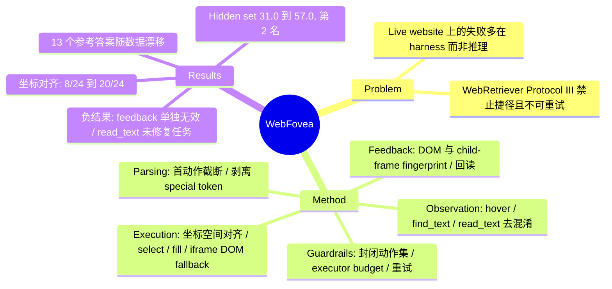

## Summary
WebFovea 是 WebRetriever Challenge 2026 第 2 名方案（hidden set 57.0/100）的技术报告，核心论点是 vision-based web agent 在 live website 上的大量失败不在模型推理，而在 harness：每一步都是 parsing → execution → feedback → observation 四个 stage 的 round trip，任一 stage 静默出错，强模型也会表现得像"推理错误"。作者全程固定 claude-opus-4-6，只改 harness，四次提交把官方分数从 31.0 提到 57.0（受 live site 的 run-to-run variance 影响）。

## Problem & Motivation
WebRetriever Protocol III 要求 agent 从 entry URL 出发，只能通过网站自身界面在真实 live site 上操作并返回可精确核对的答案，禁止 URL 跳转、搜索引擎与数据 API 捷径，且任务不可重试。在这种设定下，作者观察到很多失败并非出自模型判断：点击坐标整体偏移、native dropdown / iframe / 文本框上的动作静默失效、模型自己生成的 chat-template token 被当成文本输入搜索框。已有工作大多改进模型本身或页面表征（DOM vs screenshot vs Set-of-Mark），对"模型决策到页面再回到模型"这条通路的工程可靠性缺乏系统分析；最接近的是 SWE-agent 的 agent-computer interface 论点，本文把它搬到 vision-based web agent。

## Method
出发点是主办方提供的 UI-TARS 1.5 参考实现（observe–think–act loop、5 张最近截图 + 全部文本历史）。模型只看截图、按像素坐标行动，不接收 DOM / accessibility tree；DOM 只在 executor 内部和两个窄文本通道（feedback note、`read_text`）中使用。

四个 stage 与 guardrails 的具体组件：

- **Parsing**：只保留回复中的第一个 Thought/Action 对（模型有时一次写完整个虚构 trajectory 并在 step 1 就 `finished`）；剥离 `<|eot_id|>` 等自生成 special token 与动作后的杂散标记，同时保留 prompt 用的 `<|box_start|>/<|box_end|>`。
- **Execution**：
  - *Coordinate-space alignment*：参考实现按 UI-TARS 的 `smart_resize`（28-px patch）映射坐标，对 1920×1080 几乎是恒等映射；但 API 在模型看到之前已把图降采样到约 1440×810，导致每次点击落在目标坐标的 3/4 处。修正方式是自己先把截图缩到 ≤1440×810，再按"发送图像 / 实际 viewport"的运行时比例映射坐标。
  - *元素级动作*：`select(box, option)` 直接设置 native `<select>`（精确匹配 → 归一化匹配 → 子串匹配）；`fill(box, content)` 聚焦、清空、逐键输入并回读，原生 date input 转 ISO。
  - *兑现 prompt 承诺*：参考 prompt 说 `type` 以 `\n` 结尾即提交，但 executor 从未按 Enter，现补上。
  - *Iframe DOM fallback*：动作落在 child frame 且两层 frame 均无变化时，在该 frame 内派发完整的 DOM mouse event 序列；CAPTCHA 提供方的 frame 排除在外。
- **Feedback**：动作前后比较 DOM fingerprint（URL、title、节点数、文本长度、滚动偏移、焦点），不受时钟、轮播影响；无变化时告知模型点中了哪个元素、是否可点。修了两处：fingerprint 覆盖 child frame（否则 iframe 内成功点击被报为"no detectable change"，模型随之放弃有效动作），hover / SVG / canvas 目标额外比较页面文本 hash（同长度 tooltip 替换否则检测不到）。`fill` 回读实际值，`select` 失败时返回可选项列表。
- **Observation**：截图尺寸上限；`hover` 暴露 tooltip 值；`find_text` 类似 Ctrl+F，只滚动到匹配处、不返回文本（答案仍须从截图读）；`read_text` 返回 label 附近 ≤600 字符 DOM 文本，仅用于核对已从截图读出的值，并把 custom font 混淆的码位替换成 "?"。工具触发条件写成 prompt 中的硬规则，而非交给模型"需要时调用"。
- **Guardrails**：动作集封闭（无 URL 导航、JavaScript、HTTP），`goto` 和浏览器级快捷键仍被解析但仅用于拒绝并解释；14 条硬约束；executor 侧强制 per-action budget 与 80 steps / 1,800 s；scroll breaker 改为"连续滚动且页面停止变化"才终止；模型调用 403/429/5xx 重试；共享队列派发任务。

## Key Results
- **官方 hidden set**：四次提交 31.0 → 41.0 → 46.0 → 57.0，最终排名第 2，主办方 manual review 未扣分。每次提交捆绑多项改动，作者明确说明增益不能归因到单个组件；第二次提交的 +10 中约 7 分来自完成更多任务（首轮超时只完成 79/100），约 3 分来自准确率。
- **Coordinate alignment**：1920×1080 输入下坐标需要 1.324/1.350（x/y）修正因子，1440×810 输入下为 1.010/0.993；真实页面上 3 个目标的偏差从 122–189 px 降到 1–5 px；24 个 dev task 的 version-level 配对比较中成功从 8/24 升到 20/24（+12/0），撞 step limit 比例 67% → 4%（该版本还含其他改动，且 baseline 仍可走 `goto` 捷径）。
- **Token 污染**：305 个本地 episode 中 15 个（4.9%）被污染，污染 vs 干净成功率 7.7% vs 41.7%（观测性比较）；离线 replay 7,705 步，修复改动了全部 551 个污染步、0 个干净步。
- **`goto` 捷径审计**：早期版本在 dev70 上调用 `goto` 692 次，18/70 任务直接查数据 API、21 个访问搜索引擎，58% 的正确答案来自此类捷径——这是关闭动作集的动机。
- **Enter 漏发**：356 次 `type` 调用中 79 次（22%）以 `\n` 结尾却从未被提交。
- **负结果**：仅加"no detectable change" feedback note，10 个 idle-looping 任务仍为 0/10、总步数同为 400（模型在 thought 中承认了 note 却继续重复）；启发式 idle breaker 误杀一个本可成功的任务；`read_text` 在 6 个目标任务中被用了 5 次但一个也没修好；早期 40→65 step limit 实验无增益，在新代码上重做 40→80 则 8 个任务从 0–1 升到 4。
- **失败分析**（100 个公开任务，跨所有 run 的最佳结果，属于上界；作者标注为近似分桶、可重叠）：55 个答对，13 个参考答案已过时或定义不同，16 个站点从作者网络不可达，其余是结构性障碍（CAPTCHA、canvas-only UI 等）、capability gap 与决策错误。
- **成本**：平均每步约 10.6k input / 127 output tokens，一次 100 任务评测约 $170–230，大部分 input 来自每步重发 5 张截图。

## Evidence Ledger

| Claim ID | Claim | Type | Source locator | Evidence excerpt | Status |
|:--|:--|:--|:--|:--|:--|
| C1 | WebRetriever Challenge 2026 第 2 名，hidden set 57.0/100 | number | Abstract | placed 2nd in the WebRetriever Challenge 2026 [1, 2] with a final score of 57.0 out of 100 | source-verified |
| C2 | 四次提交同一模型 claude-opus-4-6，31.0→41.0→46.0→57.0 | number | Abstract; Table 4; §3 | we used the same model in all four submissions, the rise of our official hidden-set score from 31.0 to 57.0 | source-verified |
| C3 | API 将 1920×1080 截图降采样至约 1440×810，导致点击落在目标坐标 3/4 处 | causal-mechanism | Abstract; §4.3 | the API was downscaling the image before the model saw it ... consistent with downscaling to about 1440×810 | source-verified |
| C4 | 修正因子 1.324/1.350（1920×1080）vs 1.010/0.993（1440×810） | number | §4.3 | needed a correction factor of 1.324/1.350 in x/y ... When we sent 1440×810, the factor was 1.010/0.993 | source-verified |
| C5 | 24 dev task 配对：8/24→20/24（+12/0），撞 step limit 67%→4%；版本级比较含其他改动 | number | §4.3; Table 5 | success rose from 8/24 to 20/24 with the version containing this fix (12 fixed, 0 broken) | source-verified |
| C6 | 真实页面 3 个目标偏差 122–189 px→1–5 px | number | §4.3; Fig 3 | three targets that had been missed by 122–189 px were hit within 1–5 px | source-verified |
| C7 | 305 episode 中 15 个（4.9%）被 token 污染；成功率 7.7% vs 41.7%（观测性） | number | §4.2 | Of the 305 task episodes we ran locally, 15 (4.9%) were contaminated | source-verified |
| C8 | 离线 replay 7,705 步：改动 551/551 污染步、0/7,154 干净步 | number | §4.2; Table 5 | the fix changed all 551 contaminated steps and none of the 7,154 clean ones | source-verified |
| C9 | 早期 goto 版本：692 次 goto，18/70 查 API，21 访问搜索引擎，58% 正确答案来自捷径 | number | §4.6 | found 692 goto calls: 18 of 70 tasks queried data APIs directly and 21 visited search engines | source-verified |
| C10 | 79/356（22%）`type` 调用以 \n 结尾但 executor 从未按 Enter | number | §4.3 | its executor never pressed Enter; 79 of 356 type calls (22%) had this form | source-verified |
| C11 | 仅加 feedback note：10 个 idle-looping 任务仍 0/10，总步数同为 400 | comparison | §5.4 | left 10 idle-looping tasks at 0/10, with the same 400 total steps | source-verified |
| C12 | `read_text` 6 个目标任务中被用 5 次，修复 0 个 | number | §5.4 | read_text was used in 5 of 6 targeted tasks but fixed none of them. | source-verified |
| C13 | step limit 40→80：8 任务 0–1→4；早期 40→65 无增益因代码过时 | comparison | §5.3–5.4; Table 5 | raising the step limit from 40 to 80 increased the number solved from 0–1 to 4 | source-verified |
| C14 | 第二次提交 +10 中约 7 分来自完成更多任务（首轮仅完成 79/100），约 3 分来自准确率 | causal-mechanism | §5.2 | roughly 7 of the 10 points came from completing more tasks and about 3 from answering more accurately | source-verified |
| C15 | holdout30（25 可评分）本地 52.0% vs hidden 46.0；16/100 站点不可达 | number | §5.1 | these 25 tasks scored 52.0% locally, and the hidden set scored 46.0 officially | source-verified |
| C16 | 100 公开任务最佳结果：55 答对（上界）、13 参考答案过时、16 不可达（表注为近似，桶可重叠） | number | Table 6; §5.5 | Reference answer outdated or defined differently 13 ... Site unreachable from our network 16 | source-verified |
| C17 | 每步约 10.6k input / 127 output tokens；100 任务约 $170–230 | number | §5.6 | average step consumed about 10.6k input and 127 output tokens ... cost about $170–230 | source-verified |
| C18 | 参考实现从未提交 hidden set；31.0 起点已含修复；参考实现+同模型 10 任务子集 0 解 | benchmark-setting | §6.2 (ii) | the 31.0 starting point already includes several of our fixes | source-verified |
| C19 | Table 1 leaderboard 基线任务集不同，不可直接比较（如 claude-4-8-opus CU 47%，不在 approved list） | benchmark-setting | §2; Table 1 | evaluated on a different task set with human verification, so they are not directly comparable | source-verified |
| C20 | 主办方 manual review 未扣分 | number | Table 4 caption; §4.6 | Manual review deducted no points from the final submission. | source-verified |
| C21 | 代码开源 github.com/jianganghan/WebFovea；CC BY 4.0；单作者独立研究者 | license-code | Header; Code Availability | License: CC BY 4.0 ... Affiliation: Independent Researcher | source-verified |
| C22 | 模型不接收 DOM / accessibility tree；DOM 仅限 executor 与 feedback note、read_text | benchmark-setting | §4.1 | the model receives no DOM or accessibility tree | source-verified |
| C23 | iframe DOM fallback 解决此前 40/80 步均未解的 Tableau 任务，25 步通过 | number | Fig 4; Table 5 | This task had never been solved in earlier runs with step limits of 40 or 80. | source-verified |

## Strengths & Weaknesses
**Strengths**
- 问题定位的价值高于方法本身。"模型对、点击错"的坐标空间 bug 是一个很具体、可复查的发现：API 静默降采样 + `smart_resize` 假设恒等映射，导致整套参考实现在该模型上近乎全盘失效（作者报告参考实现 + 同模型在 10 任务子集上 0 解）。这提醒所有用 closed API 做 GUI grounding 评测的工作：坐标系对齐是需要显式标定的实验变量，而不是默认正确的前提。
- 四 stage 拆解简单、模型无关，可直接当 debug checklist。"每个 action 在 prompt / parser / executor / feedback 四处定义一致"这条原则对应了三个真实 bug（hover 未告知模型、`\n` 未按 Enter、parser 未剥离 token），可操作性强。
- 负结果写得诚实且信息量大："feedback 到达模型且被模型承认，但行为不变"直接支持"budget 必须在 executor 强制，而非写在 prompt 里"；`read_text` 用了但没修好任何任务，说明"工具被调用"与"工具有用"是两回事。
- 对 benchmark 本身的诊断有用：13% 公开参考答案随 live data 漂移，这是 live-site benchmark 的结构性问题；作者建议给参考答案附时间戳证据截图。

**Weaknesses**
- 证据强度有限，作者也承认：单一模型（claude-opus-4-6），组件证据来自 1–24 个任务的定向小集合，每个官方分数只有一次 run，live site 有 run-to-run variance。31 → 57 的 hidden-set 提升是捆绑改动，没有 per-component ablation。
- 缺同模型 hidden-set baseline：31.0 起点已经包含 coordinate alignment 等关键修复，所以"harness 贡献多少"缺乏干净的零点。
- 部分修复是模型/API 特异的（坐标降采样、chat-template token 泄漏），可迁移的是"按 stage 排查"的方法论，具体 patch 未必迁移；作者自己也说明了这一点。
- 与 Table 1 leaderboard 基线（如 claude-4-8-opus Computer Use 47%）不可直接比较：任务集与评测方式都不同。
- 定位是竞赛技术报告，没有可学习组件或新的建模假设；研究贡献主要是工程诊断与 negative evidence。

**对领域的影响（推测）**：与 vault 中 harness 系列工作一致，进一步说明 GUI/Web agent 的"能力"测量混杂了大量 harness 质量因素。若坐标映射类 bug 普遍存在，部分 benchmark 上 closed-model 的 GUI 分数可能被系统性低估，这一点值得在 CUA-Survey 的评测可信度部分记录。

## Mind Map

## Notes
- 相关：[[Papers/2401-SeeAct]]（hybrid observation 不一定更好，作者 future work 引用）、[[Papers/2401-WebVoyager]]（live-site 多模态 web agent 先例）、[[Papers/2501-UITARS]]（参考实现基座，`smart_resize` 坐标约定来源）、[[Papers/2605-Region4Web]]（另一条路线：改 observation 粒度而非修 round trip）、[[Papers/2608-EnvHarness]] / [[Papers/2609-HarnessDev]]（harness 作为独立研究对象）。
- 疑问：WebRetriever 基准本身（arXiv 2607.06118）vault 中尚无笔记；Table 1 中各 baseline 是否也受类似坐标映射问题影响，本文未讨论。
- 本报告的 Disclosure 说明作者全程使用 Claude Code 辅助实现、分析日志与起草报告。
