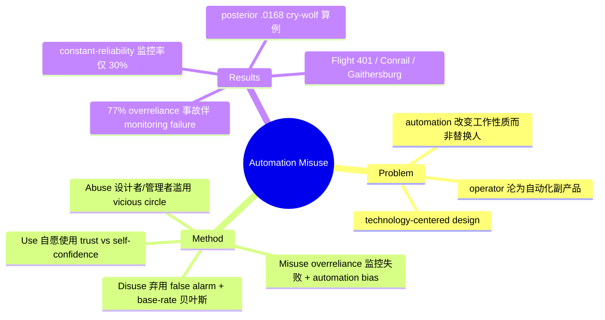

## Summary
这篇 Human Factors 1997 综述用 use / misuse / disuse / abuse 四分法系统命名了人对自动化的依赖失效——misuse = 过度信任导致的监控失败与决策偏差（automation bias），disuse = 因虚警而弃用告警系统（base-rate 问题），abuse = 设计者/管理者不顾人因后果地滥用自动化——为 25 年后 GUI/LLM agent 的 over-reliance 现象提供了现象学根祖。

## Problem & Motivation
数字计算机革命把大量认知功能交给机器，但关于 automation 的公共讨论几乎只谈技术议题（如何实现、传感器/控制/软件的能力），极少谈人的表现。作者的核心反论点：automation 并非简单替换人（不是 Chaplin《Modern Times》里那种 tyrannical machine），而是**改变人的工作性质**——人从执行者变成自动化的 "consumer"、变成监督/监控者。既有实践往往是 technology-centered：只要技术可行、成本低就自动化，把 operator 的角色定义为自动化的**副产品（by-product）**。这直接引出一连串人因问题：反馈不足（Norman 1990）、mode awareness 丧失（Sarter & Woods）、underreliance 与 overreliance（Sorkin 1988; Parasuraman et al. 1993）。作者要建立一个统一框架，回答"人如何、为何选择用或不用自动化"，把散落在事故报告和实验里的现象收敛成可操作的词汇。

## Method
这是一篇 review/analytical 论文，核心贡献是一套四维分类学，且每一类都配一个机制解释而非仅贴标签：

- **Use（使用）**：operator 自愿激活/停用 automation 的行为。影响因素：trust、mental workload、cognitive overhead（启用与管理 automation 本身的成本，若过高则宁可手动，Kirlik 1993）、self-confidence、perceived risk、automation reliability、fatigue、task complexity、state learning（Figure 1 的因果图）。关键规律：Lee & Moray——**当 trust in automation 超过 self-confidence 时才会依赖，反之选择手动**。且 attitudes 不能可靠预测 behavior，个体差异极大，使个体级预测困难。
- **Misuse（误用）= overreliance**：在不该用时用、或用了却不有效监控。两条机制：(a) **monitoring failures**——人是糟糕的 monitor，尤其在多任务下；恒定高可靠会诱发 complacency（automation-induced complacency，Parasuraman et al. 1993）。(b) **decision biases / automation bias**——把 automated cue 当作 information-seeking 的启发式替代（Mosier & Skitka），产生 **omission errors**（自动化没提示、人也没发现问题）与 **commission errors**（人执行了不恰当的自动化指令），并倾向忽略与自动化冲突的 disconfirming evidence。
- **Disuse（弃用）= 忽视/关闭自动化**（尤指无视或关掉告警、safety system）。主因是 false alarm。核心洞见来自信号检测/贝叶斯：即使 alarm 灵敏度极高（hit rate .999、false alarm .0594），只要待检测事件的 **base rate 很低**（如 .001），一次报警是真警的 **posterior probability 仅 .0168** → "cry wolf" → 操作员**理性地**不信任并关掉它。设计者只调 decision criterion 不看 base rate 是不够的。解药：likelihood alarm（分级而非二值），把 base rate 纳入 criterion 设置。
- **Abuse（滥用）= 设计者/管理者不顾对人（及系统）表现的后果去自动化**，把 operator 的角色定义为自动化的副产品。这是 technology-centered design 的极端：automation 替代的其实是 **designer 而非 operator**——把系统对 operator error 的脆弱换成对 **designer error** 的脆弱；automation 还能充当 manager 的 surrogate（把运营策略强加给现场）。abuse 会反过来诱发 misuse/disuse，形成 **vicious circle**：designer 不信任 operator → 部署高权限 automation → operator 不信任/弃用 → 管理层加更多高层自动化。

## Key Results
作为综述，"结果"是若干可引用的经验证据点：

- **监控实验**（Parasuraman et al. 1993, Figure 2）：多任务下对自动化失效的检测率，constant-reliability 条件仅约 30%，variable-reliability 显著更高；当监控是**唯一**任务时检测率 >95%。→ complacency 由恒定高可靠诱发，而非能力问题。
- **ASRS 分析**（Mosier et al. 1994）：**77% 涉及 overreliance 的事故报告伴随 monitoring failure**；automation bias 的错误率在学生与职业飞行员之间相近——**专业性并不免疫**（Mosier, Skitka, Burdick & Heers 1996）。
- **Riley 1994b**：在自动化失效时，仍有近半飞行员继续依赖它（marked individual differences）。
- **事故案例**：Eastern Flight 401（Everglades，机组忙于诊断 landing gear，未察觉 autopilot 脱开与高度下降——misuse/监控失败）；A320 Strasbourg（vertical speed / flight path angle 的 mode confusion）；Conrail Baltimore 1987（告警 buzzer 被胶带贴住，且多个车厢普遍如此——disuse）；Gaithersburg MD 轻轨相撞（管理层雪天**拒绝**司机手动运行的请求——abuse）；weight-on-wheels sensor 阻止飞行员部署减速装置（设计者错误的例子）。
- **贝叶斯分析**（Parasuraman, Hancock & Olofinboba 1997, Figure 3）：给出 posterior = .0168 的算例，量化"为何理性操作员会弃用高灵敏告警"。

## Strengths & Weaknesses
**Strengths**：把散落的人因现象收敛成一个近乎正交、可操作的 4-way 词汇，且每类都给出**机制假设**而非停在分类本身——use 是决策问题、misuse 是监控/偏差问题、disuse 是信号检测/base-rate 问题、abuse 是组织/设计问题。把 base-rate/贝叶斯这一"看似纯技术"的量化嵌进"人为何弃用告警"的行为解释，是 first-principles 的范例。强调 individual differences 与 attitude≠behavior，克制地避免过度概化。3600+ 引用，是 human-automation 领域的奠基文献。

**Weaknesses / 适用边界**：几乎全部证据来自 aviation / process-control / ground-transport 的 **supervisory-control** 场景——那里 automation 通常高可靠、待检测事件 base rate 低、人处于纯 monitoring 角色。GUI/LLM agent 的失效分布不同（agent 常不可靠、错误并不 rare、人往往是 co-actor 而非纯 monitor），四分法可迁移但阈值与机制需重新标定。框架本质是 **descriptive taxonomy，无预测模型**（作者自己承认个体级预测困难）；Figure 1 中相当多关系是 hypothesized（dotted arrows），实证支持不均衡。

## Mind Map

## Notes
GUI/LLM agent 连接（本文被作为"用户盲从错误动作 / 过度依赖"的邻域根祖来读）：

- **Misuse ≈ 今天 agent 的 automation bias / over-reliance**：用户盲从 agent 的错误动作、不去查证。本文的 omission（agent 漏了、人没接住）vs commission（人执行了 agent 的不当建议）二分，正是 agent 可靠性评测应当分开度量的两类错误。
- **monitoring failure 随 automated subsystem 数量增长而增多** → 直指 multi-step agent trajectory：人无法逐 action 监控，complacency 几乎是结构性必然，而非用户不认真。
- **disuse / base-rate** → agent 的 confirmation dialog / guardrail / 风险告警若虚警偏多会被用户直接关掉（"cry wolf"）；本文的启示是用 likelihood-style（分级置信）提示优于二值拦截，并在设计时把真实 base rate 纳入触发阈值。
- **abuse** → 产品把 autonomy level 设为"技术可行即全自动"、把人的角色当副产品，正是当前 agent 部署的风险；trust>self-confidence 规则解释了为何用户在**自身能力低**时反而更易盲从自动化。

配套实证对照：本文引用的 Mosier & Skitka (1996) / Mosier, Skitka, Burdick & Heers (1996) 是 automation bias 的直接实证线；其后 Skitka, Mosier & Burdick (1999) 进一步量化了错误自动化提示下的 commission/omission error 率。本文自身可引用的硬数字是 "**77% 的 ASRS overreliance 事故伴随 monitoring failure**"。[未在本文核到"75% 飞行员盲从"这一具体数字，故不将其作为本文结论引用。]
