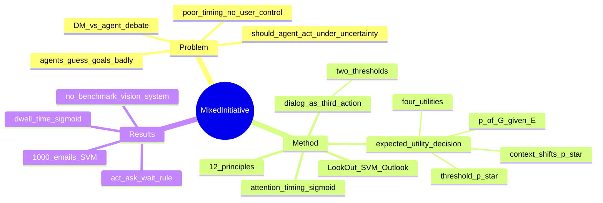

## Summary
面对 1990s HCI 界"direct manipulation vs interface agent"之争，Horvitz 主张不是二选一而是有原则地耦合：用不确定性下的**期望效用**（expected utility）统一决定 agent 何时自动行动 / 何时发起对话澄清 / 何时按兵不动，并给出 12 条 mixed-initiative 设计原则，以 LookOut 邮件日程助手作为验证平台。这是今日 human-in-the-loop / agent oversight 的根祖文献。

## Problem & Motivation
1999 年 HCI 存在两条路线之争：一派（Shneiderman）主张深化 direct manipulation，让用户直接操纵界面；一派（Maes）主张 interface agent，让系统感知用户活动并自动行动。Horvitz 指出 agent 路线有四类系统性弊病：**乱猜用户目标**、**不计行动的代价/收益**、**时机差**、**不给用户引导调用与纠偏的机会**。他反对把二者对立，也反对"用复杂推理机器给糟糕设计打补丁"。核心问题被重述为一个可计算的决策问题：**在对用户目标存在不确定性时，agent 到底该不该替用户行动？** 这正是今天 GUI agent oversight 要回答的同一个问题。

## Method

### 12 条 mixed-initiative 原则
将 agent 与 direct manipulation 有效集成的关键因素（原文 critical factors）：

1. **提供真正增值的自动化**——自动化必须比纯 direct manipulation 带来实质价值，否则不值得引入不确定性。
2. **考虑对用户目标的不确定性**——系统常不确定用户目标与注意力焦点，应显式推断并利用这种不确定性。
3. **在服务时机中考虑用户注意力状态**——行动/提醒的时机是代价收益的关键因子，应建注意力模型，把打断推迟到干扰最小的时刻。
4. **在代价、收益、不确定性下推断理想行动**——不确定下的自动行动有 context 相关的代价收益，用**期望价值**引导是否调用。
5. **用对话解决关键不确定性**——不确定时应能与用户高效对话，同时权衡"无谓打扰"的代价。
6. **允许高效的直接调用与终止**——不确定下的决策会出错，须给用户直接调用/终止服务的便捷手段。
7. **最小化猜错的代价**——服务与提醒的设计应让"猜错"代价最低，含适当超时与自然的拒绝手势。
8. **让服务精度匹配不确定性/目标变异**——不确定高时优雅降级，"做少但做对"，减少代价高昂的 undo/backtrack。
9. **提供 agent-用户协作精化结果的机制**——假设用户常想补全或修正 agent 的分析。
10. **采用社交得体的交互行为**——agent 应有符合"善意助手"社会预期的默认行为与礼貌。
11. **维护近期交互的工作记忆**——记住近期交互，让用户能自然引用共享的短期上下文。
12. **持续从观察中学习**——持续学习用户目标与需求，越用越准。

### 从 belief 到 action：期望效用决策框架
- 设推断得到 p(G|E)：给定证据 E 下用户持有目标 G 的概率。四种确定性结局的效用（0-1 归一）：u(A,G)、u(A,¬G)、u(¬A,G)、u(¬A,¬G)。
- 行动的期望效用 `eu(A|E)=p(G|E)·u(A,G)+[1−p(G|E)]·u(A,¬G)`；不行动同理。两条随 p(G|E) 变化的直线相交于**阈值概率 p\***：p(G|E)>p\* 就行动，否则不动。给定四个效用即可解析求 p\*，无需实时算期望值。
- **p\* 随 context 移动**：用户越专注于别的任务，误动作 u(A,¬G) 代价越高 → p\* 抬高（更保守）；用户越匆忙，漏动作 u(¬A,G) 代价越高 → p\* 降低（更主动）。这是 adaptive autonomy 的雏形。
- **对话作为第三种行动**：把"问用户"纳入同一框架，加入 u(D,G)、u(D,¬G)。因为"问一下"在猜错时代价通常低于"直接错动"，在猜对时价值又低于"直接对动"，于是产生**两个阈值**——不动↔对话 `p*(¬A,D)`、对话↔行动 `p*(D,A)`。低置信度问、中置信度对话、高置信度直接做。
- 阈值也可由设计者/用户直接指定，这隐含了一个 expected-utility 模型。

### 注意力与时机
对 LookOut 加插桩，测"读邮件到手动调用服务"的时间间隔，发现 message 长度与用户接受服务前的 **dwell time 呈 sigmoid 关系**；可将其转成时间相关的效用，或单纯用来推迟服务到用户就绪。

### LookOut 系统（testbed）
叠加在 Outlook 上的日程助手：邮件进入焦点时解析正文/主题，抽取事件的日期时间并预填 appointment，猜不准则降级为展示合适跨度的日历视图让用户直接操纵。用 **linear SVM 文本分类器**（Platt 的快速线性近似，~1000 封邮件 500 正 500 负训练）估 p(G|E)，据此三选一：(1) 不动等直接操纵/手动调用、(2) 发起对话、(3) 直接执行第二阶段服务。多模态：纯手动 / 自动填充 / social-agent（动画角色 + TTS + ASR 语音对话，"yes/sure/do it" vs "no/not now/go away"）。失败处理：超时时长随 p(G|E) 变化，检测到用户在思考（"hmmm…"）则延长停留，隐喻是"直觉、礼貌的管家"。含 life-long learning：持续把邮件标注为 schedule-relevant/irrelevant、记录 dwell time，按用户设定的训练计划增量精化用户模型与时机模型。

## Key Results
这是 vision + system paper，无 benchmark 对照。可报告的具体事实：LookOut 在 Microsoft Outlook 上实测；SVM 用约 1000 封邮件（500 相关 / 500 不相关）训练；实测 message 长度与"接受自动日程服务前的 dwell time"呈 sigmoid 关系（Figure 7）；p\* 阈值既可由四个 utility 解析计算，也可由用户/设计者直接指定两个阈值来控制 dialog 与 action。核心 takeaway 不是某个指标，而是一个可迁移的**决策规则**：把 act / ask / wait 的选择归结为 p(G|E) 与 context 相关阈值的比较。

## Strengths & Weaknesses
**Strengths**
- 把"该自动做还是问用户还是等着"从 ad-hoc 启发式提升为**可计算的期望效用决策**，这是方法论上的根本贡献。simple 且 generalizable——框架与具体任务（日程）无关。
- **阈值 p\* 的 context 依赖性**（注意力深度、匆忙程度、屏幕空间改变阈值）精确预言了今天的 adaptive autonomy / interruptibility 研究。
- **dialog-as-action** 是"低置信度时发起澄清对话"的鼻祖，两阈值结构直接对应今天 agent 的 act / clarify / defer 三态。
- attention-aware timing（何时打断）预言了后续 Bayesian interruptibility（Horvitz 自己的 Notification Platform / Priorities 线）。

**它对 GUI agent oversight 的直接映射**
今天大量 human-in-the-loop GUI agent 论文本质是本文的**再发现**：confidence-gated handoff、ask-vs-act policy、human takeover、置信度触发澄清、uncertainty-aware deferral——多数只是把 SVM 换成 LLM/VLM 的置信度或 verifier score，把"邮件日程"换成"GUI 多步操作"，决策骨架（p(G|E) vs 阈值、误动作代价、问的代价）几乎照搬。凡是没显式写出效用/代价结构、只用一个裸置信度阈值做 handoff 的工作，都是本文框架的退化特例。

**Weaknesses / 适用边界**
- 框架假设四个 utility **可获取且可标定**——而这恰是今日最难的部分（真实用户效用异质、随时间漂移、且往往不可观测）。
- 依赖 p(G|E) **校准良好**；现代 LLM 置信度普遍未校准，直接套阈值会系统性偏差。
- 是**单步（myopic）决策**：只处理"这一次该不该动"，不覆盖 long-horizon rollout 中错误累积、何时中途交还、多步 oversight 的信用分配——这是当代 GUI agent 相对本文真正需要补的部分。
- social-agent 拟人化（Clippy 同期思路）在今天的可用性研究中评价存疑，不应作为原则照搬。

## Mind Map

## Notes
- 谱系锚点：本文是 GUI agent oversight / human-in-the-loop 的**根祖**。读任何"confidence-gated autonomy / ask-vs-act / human takeover / clarification"论文时，先问它相对 Horvitz 1999 多给了什么——若只是把 SVM 换成 LLM 置信度、把日程换成 GUI，本质是再发现。
- 真正的开放问题不在"要不要用期望效用"（那已被本文解决），而在：(1) 如何在 GUI agent 场景**校准** p(G|E)/verifier 分数；(2) 如何从单步 myopic 阈值推广到 **long-horizon** 的中途交还与错误累积；(3) 效用/代价结构如何**在线学习**而非手工标定。这三点是可以做出 important 而非仅 publishable 贡献的缺口。
- 关联：Lumiere（Bayesian user modeling，ref 6）、Notification Platform / Priorities（Horvitz 的中断代价线）是同一作者的姊妹工作，可一并追踪构成"decision-theoretic HCI"完整脉络。
