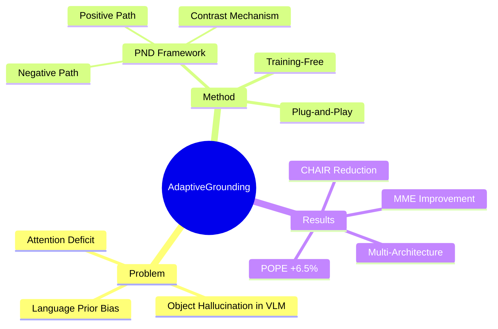

## Summary

提出 Positive-and-Negative Decoding (PND)，一种 training-free 的推理框架，通过在每一步解码中对比正向视觉放大路径和负向 counterfactual 路径的输出，解决 VLM 的 object hallucination 问题。核心发现是 VLM 存在 attention deficit——视觉特征在解码时被系统性低估。

> [未获取全文，以下内容基于 arXiv abstract 及多源搜索结果整理，Method 和 Key Results 节中的细节可能不完整]

## Problem & Motivation

Vision-Language Models (VLM) 在生成文本描述时容易产生 object hallucination——即生成与视觉输入不一致的内容。根本原因在于 VLM 过度依赖语言先验 (linguistic priors)，而视觉特征在解码过程中被系统性低估（attention deficit）。

现有方法的局限：
- 需要额外训练（如 RLHF、DPO），计算成本高
- 一些 training-free 方法（如 contrastive decoding）设计了固定的干预策略，缺乏对全局上下文 vs 局部细节的自适应权衡
- 多数方法只关注"减少幻觉"而忽略了描述质量（descriptive detail）的保持或提升

核心问题：在解码时，如何自适应地平衡对 global context 和 local detail 的视觉 grounding，以同时减少幻觉并保持/提升描述质量？

## Method

PND (Positive-and-Negative Decoding) 是一个 **training-free** 的 inference-time 干预框架，核心思路是通过双路径对比，在每一步 token 生成时引导模型输出视觉事实性文本。

**三个核心组件：**

1. **Positive Path（正向路径）**：利用多层 attention 放大显著视觉证据 (salient visual evidence)，直接对抗 attention deficit，鼓励模型生成视觉忠实的描述。这一路径确保模型"看见"图像中的关键物体。

2. **Negative Path（负向路径）**：识别并主动降级核心物体特征，构造一个强的 counterfactual——即"如果模型没有正确关注这些视觉特征会怎样"。通过惩罚这种无根据的、依赖语言先验的生成行为，压制 hallucination 倾向。

3. **Contrast（对比机制）**：在每个 decoding step，对比两条路径的输出概率分布，通过差异信号 (contrast signal) 调整最终的 token 概率，使生成结果偏向视觉事实性文本而非纯语言先验。

**关键设计选择：**
- 完全 training-free，不修改模型参数
- Plug-and-play，可用于任意 VLM 架构的推理阶段
- 在单次推理中同时运行两条路径（具体实现细节未知，可能涉及 attention manipulation 或 hidden state intervention）

**与相关方法的区别：**
- 对比 contrastive decoding（如 VCD）：PND 在单个模型内部构造正负路径，不需要额外模型
- 对比 attention-based 方法（如 OPERA）：PND 通过 counterfactual 路径显式惩罚而非仅重加权 attention

## Key Results

> [未获取全文，以下数据来自 abstract 及搜索结果摘要，具体数值和实验设置待核实]

- **POPE benchmark**：最高 **6.5%** 准确率提升，达到 SOTA 水平
- **MME**：在 perception 和 cognition 两个维度均有显著提升
- **CHAIR**：object hallucination rate 大幅降低（具体 CHAIRs/CHAIRi 数值未获取）
- **描述质量**：不仅减少幻觉，同时提升了描述的 detail 丰富度（即不是简单地让模型更保守/少说话）
- **多架构泛化**：在 LLaVA (1.5)、InstructBLIP、InternVL、Qwen-VL 上均有效

**消融实验**（未获取具体数据）：
- 正负路径各自的贡献
- 不同 attention layer 选择的影响
- contrast weight 的敏感性分析（推测存在）

## Strengths & Weaknesses

**Strengths:**
- **Training-free 且即插即用**：无需任何训练或微调，可直接应用于现有 VLM 推理流程，实用性强
- **核心 insight 有诊断价值**：attention deficit 的发现不仅驱动了 PND 的设计，也为理解 VLM hallucination 的机制提供了新视角
- **同时提升准确性和描述质量**：避免了"以牺牲描述丰富度为代价减少幻觉"的常见 trade-off
- **多架构泛化**：在 4 种不同架构的 VLM 上验证有效，表明方法抓住了 VLM 的共同弱点而非特定模型的 quirks

**Weaknesses / 局限：**
- **[推测]** 双路径推理增加计算开销：每一步 decoding 需要运行两条路径并计算对比，推理时间可能显著增加（论文中未见 overhead 分析）
- **[推测]** 需要额外超参数调优：contrast weight、负向路径的 degradation 强度等需要针对不同模型调整
- **[不知道]** 与同期 training-free 方法（如 VCD, DoLa, HALC, AGLA）的详细对比和定位
- **[不知道]** 在 GUI grounding 等需要精确坐标/区域定位的场景下表现如何——论文聚焦于 caption/description 层面的 hallucination，而非 spatial grounding 任务

**对领域的潜在影响：**
- 为 hallucination mitigation 提供了新的视角：从"如何更好地融合视觉特征"转变为"如何诊断并纠正视觉特征的利用偏差"
- 双路径 contrast 框架可以迁移到其他 modality grounding 问题（如 video, audio）
- Adaptive grounding（全局 vs 局部）的概念对 GUI agent 的 visual grounding 策略设计有启发

## Mind Map

## Notes

**与 GUI Grounding 的联系：**
- PND 的核心概念——在 global context 和 local detail 之间自适应选择视觉 grounding 的粒度——与 GUI agent 中的 grounding 策略高度相关
- GUI grounding 同样面临权衡：全局布局信息（screen structure, layout）vs 局部元素细节（button text, icon shape, bounding box）
- PND 的"通过构造 counterfactual 诊断 attention deficit"的思路可以迁移到 GUI grounding：对于 GUI agent 的 grounding 错误，是否可以构造 counterfactual 来定位是全局理解不足还是局部细节遗漏？

**值得跟进的问题：**
1. PND 的 attention manipulation 具体如何实现？能否适配到 GUI-specific VLM（如 SeeClick, CogAgent）？
2. "Adaptive" 的具体含义——是 per-sample 自适应还是 per-token 自适应？选择机制是什么？
3. Negative path 中的 counterfactual 构造方式在其他 grounding 任务（如 spatial grounding, referring expression）中是否同样有效？
4. 与 AGLA (CVPR 2025, Assembly of Global and Local Attention) 的方法有何异同？两者都关注 global vs local attention，但一个用 attention assembly，一个用 contrastive decoding

**论文消化状态：**
- 仅基于 abstract + web 摘要，待获取 PDF 全文后更新 Method / Key Results 节的具体数据和实验细节
