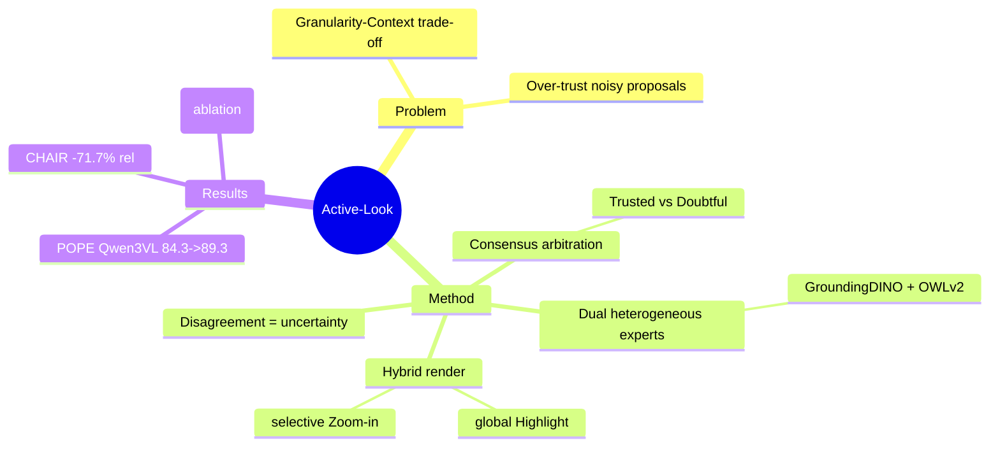

## Summary

提出 **Active-Look**——一个 training-free、plug-and-play 的 Think-with-Images (TwI) 框架，把 TwI 形式化为"按预算获取视觉证据"。核心是用两个异构 grounding expert (GroundingDINO + OWLv2) 的 **disagreement 作为不确定性代理**，只对有争议的区域花预算做验证；并用 conflict-aware hybrid rendering（全局 highlight 保拓扑 + 对 doubtful 区域 selective zoom-in 补细节）化解 granularity–context trade-off。

## Problem & Motivation

LVLM 在多步推理时容易与视觉证据脱钩，产生 object-existence hallucination。Think-with-Images（生成 zoom 裁剪或 highlight 辅助视图）想缓解这一问题，但作者诊断出两个耦合失败模式：

1. **Granularity–context trade-off**：zoom-in 提升局部细节但破坏全局拓扑/关系；highlight 保留全局上下文但对小物体缺乏分辨率。同一操作对一部分样本有益、对另一部分有害（performance bifurcation）。
2. **Over-trust 失败**：TwI 依赖单一感知工具决定"看哪里"，工具一旦错误就是 single point of failure；naive 地并多个工具取并集会注入噪声 proposal，使证据质量反而下降、甚至低于标准 prompting。

## Method

**Active-Look**（Algorithm 1，conflict-driven active verification）按 propose→select→render→reason 四步：

- **Hypothesis-driven Propose**：从 query 抽取 target concept，用两个异构 expert（GroundingDINO、OWLv2）各自产生 proposal，取并集为候选池，降低单检测器偏置。
- **Consensus arbitration Select**：对两 expert 的 box 做 IoU 匹配，按 scene conflict ratio 自适应阈值，划分为 Trusted（两 expert 一致）与 Doubtful（仅一个 expert 提出 → 更模糊、更值得验证）。disagreement 即不确定性代理，是 intractable information-gain 目标的可计算 surrogate。
- **Conflict-aware Render（"glance vs. stare"）**：渲染一张全局 highlighted 视图保拓扑，仅对 budget 内的 doubtful box 做 selective zoom-in，把视觉 token 预算花在争议区域。
- **Multi-view Reason**：联合 global highlight + verified local crops 解码最终答案。

关键：完全 training-free、推理期即插即用；budget 约束的是 LVLM 的 visual token 消耗（非系统总延迟）。

## Key Results

- **POPE (Adversarial)**：一致优于 prompting 与单算子 TwI。LLaVA-1.5-7B +4.45% Acc、Qwen3-VL-8B 84.32→**89.26** Acc(+4.94%)；InternVL2-8B Recall 显著提升（selective zoom 找回漏检物体）。
- **MME（Existence/Count/Position/Color）**：LLaVA-1.5-7B 总分 431.33→**516.66**，Count +30.33、Position +26.66。
- **CHAIR（caption 幻觉）**：LLaVA-1.5-7B CHAIRs 53.0→**15.0**（句级幻觉相对降 71.7%）；InternVL2-8B 同时降幻觉(37.0→21.5)并升 Recall(62.3→64.7)。
- **Ablation（关键反直觉）**：naive 并集双 expert (86.14% Acc) **低于**单用 Expert B (87.87%)——无结构聚合会传播冲突的 false positive；Consensus+Conflict 机制 (89.26%) 才把噪声转成确定性。

## Strengths & Weaknesses

**Strengths**：
- 诊断扎实——先用 scale-based 实验证实 granularity–context trade-off（Zoom 对 Small 物体好、Highlight 对 Large 好），再用 noise injection 证实 over-trust 失败（noisy proposal 下 Simple 48.2% vs 53.6% baseline），由现象驱动设计。
- "用 expert 分歧定位该验证哪里"是简洁且可计算的不确定性代理，避免对所有区域 exhaustive zoom。
- training-free + 跨 3 类架构（LLaVA / Qwen3-VL / InternVL2）一致增益。

**Weaknesses**：
- 依赖外部 grounding expert 的 recall——两个检测器都漏掉的稀有/抽象目标无法验证。
- budget 只省 LVLM token，hypothesis-driven 阶段跑双 external expert 有固定计算开销（作者明确承认是"用预处理换 token 经济 + faithfulness"）。
- conflict 仲裁主要面向 object existence / attribute，复杂 spatial reasoning、action understanding 的幻觉尚未覆盖。

## Mind Map

```mermaid
mindmap
  root((Active-Look))
    Problem
      Granularity-Context trade-off
      Over-trust noisy proposals
    Method
      Dual heterogeneous experts
        GroundingDINO + OWLv2
      Disagreement = uncertainty
      Consensus arbitration
        Trusted vs Doubtful
      Hybrid render
        global Highlight
        selective Zoom-in
    Results
      POPE Qwen3VL 84.3->89.3
      CHAIR -71.7% rel
      Union<single (ablation)
```

## Notes

- **纠正**：旧笔记把本文误记为 "PND (Positive-and-Negative Decoding)" 的 dual-path contrastive decoding——与原文不符。本文是 **Active-Look**（dual-expert disagreement 驱动的 TwI active verification），已据全文重写。
- **与 GUI grounding 的联系**：GUI grounding 同样面临 global layout vs local element detail 的权衡；"用多 grounder 分歧定位不确定区域，再选择性放大验证"的思路可迁移到 GUI element grounding 的 evidence-dependence 诊断（参见 [[Ideas/EvidenceDependence-GUIGrounding]]）。
- 反直觉 ablation（盲目并工具会变差）对所有 multi-tool agent 设计是个警示：聚合需要冲突仲裁而非简单 union。
