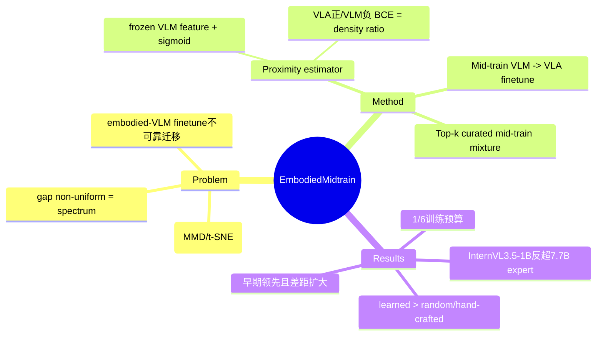

## Summary

提出 **EmbodiedMidtrain**：在 VLM→VLA 之间插入一个 mid-training 阶段，用一个轻量 **proximity estimator**（frozen VLM 特征上的二分类器）给 VLM 样本打"与 VLA 域接近度"分，选 top-k 组成 distribution-aligned 的 mid-training 混合数据，先 mid-train VLM 再做 VLA fine-tune。核心论点：决定下游 VLA 性能的不是 VLM 见过多少预训练数据，而是 mid-training 数据与 embodied 分布对齐得有多好。

## Problem & Motivation

VLA 普遍直接用 off-the-shelf VLM 当 backbone，但 VLM 预训练（caption / VQA / 文档理解）与 VLA 训练（机器人操作轨迹）分布严重不匹配：

- 用 VLM 末层 hidden state + MMD 度量，VLA 数据形成**紧凑簇**，与广而散的 VLM 分布大体分离（cross-group MMD > within-group）。
- 但 gap **非均匀**——少数 VLM 样本天然更接近 VLA，对齐是 spectrum 而非二元。
- 已有工作（在 embodied benchmark 上 finetune VLM）的增益**不可靠地**迁移到 VLA 下游（Zhang et al. 2026）。

因此需要 sample-wise 地把 VLM 训练分布重塑向 VLA 域。

## Method

**Proximity-based data selection**（把选择建模为 domain-membership 问题）：

- 在 frozen VLM 的 last hidden state 上训一个 learnable 打分器 + sigmoid，VLA 样本为正、VLM 样本为负，BCE 训练。由 Goodfellow 的经典结果，最优二分类器输出单调于 density ratio p_VLA/p_VLM，故按分数排序 ≈ 按密度比排序。
- 对全部 VLM 候选打分、取 top-k 组成 curated mid-training 语料（保留多样性同时偏向 VLA 兼容样本）；early stop 在 90% val acc。
- 在 InternVL3.5-1B、Qwen3VL-2B 上 mid-train（全参，batch 256，5000 步），再按 VLM4VLA 管线接两分支 MLP action decoder（连续臂动作 + 二值 gripper）做 VLA fine-tune。
- 候选池：general（LAION-400M、CC-12M+BLIP、LLaVA-Instruct-665k、VCR）+ embodied（RefSpatial、EmbSpatial-Bench、Robo2VLM、RoboPoint）。

整个 pipeline 轻量、可扩展、对 VLM/VLA 无架构改动。

## Key Results

- **三 benchmark 一致提升**（Calvin ABC-D avg len / SimplerEnv Bridge / Libero-10）：
  - InternVL3.5-1B (1.1B)：3.173→**3.714** / 36.5→**56.3** / 39.0→**54.2**
  - Qwen3VL-2B (2.1B)：3.205→**3.584** / 38.5→45.8 / 33.8→40.2
- **小模型反超大模型**：mid-trained 1.1B 在 Calvin 上超过 expert VLA（OpenVLA 7.7B、π0 3.1B），并优于 Paligemma-1/2、KosMos-2 等 3–8× 大的 VLM；且只用 1.0M/4.1M/4.1M 样本（baseline 7.7M/25.6M/25.6M），预算仅一小部分。
- **跨 backbone 可迁移**：用 InternVL3.5-1B 特征选出的数据，迁到 Qwen3VL-2B 仍一致增益。
- **Ablation**：Random selection (Calvin 3.398) < Learned estimator (3.714)；hand-crafted 代理（feat-space dist 3.126、VLA-cond perplexity 3.159、delta perplexity 1.527）均不如 learned。
- **Training dynamics**：mid-trained 从最早 checkpoint 就领先且差距随训练**扩大**——是更好的 initialization 而非短暂 head start；且该差异**不体现在 training loss**（两者 loss 相近）。
- **选数据偏好**：RefSpatial 平均 proximity 最高、VCR 最低；estimator 学会偏好 spatial grounding/reasoning，压低 text-only VQA。

## Strengths & Weaknesses

**Strengths**：
- 把"VLM→VLA 迁移"重构为数据分布对齐问题，并给出可计算、无需人工领域知识的 proximity 信号（density-ratio 理论支撑）。
- "小模型 + 对齐数据 < 大模型 + 海量数据"的 budget 对比有说服力；cross-backbone 迁移说明信号是分布层面的而非某模型特有。
- training-loss 与下游性能脱钩的观察很有价值——提醒 loss 不足以衡量 initialization 质量。

**Weaknesses**：
- 只在仿真 manipulation（Calvin/Simpler/Libero）验证，真机未测；action decoder 固定为 VLM4VLA 的两分支 MLP。
- proximity estimator 的正样本来自"VLA fine-tune 数据的平衡混合"，对 target VLA 分布有依赖；换 target 任务族是否需重训 estimator 未充分讨论。
- 仅 1.1B/2.1B 两个 backbone，更大规模是否仍有同等增益未知。

## Mind Map

## Notes

- 旧笔记基于 abstract，方向正确但缺全部数值；本次据全文补全 Table 1/2 数据、proximity estimator 的 density-ratio 机制、CMU+Bosch 机构信息。
- 与"数据选择/对齐"主题相关：proximity-as-classifier 的思路可类比 [[Papers/2604-EmbodiedMidtrain]] 之外的 data-centric 训练；对 GUI/CUA 训练数据筛选（哪些 web/GUI 数据最接近目标 agent 分布）有借鉴。
- 最有信息量的发现：**training loss 不反映 initialization 质量**——下游差距明显但 loss 几乎一致。
