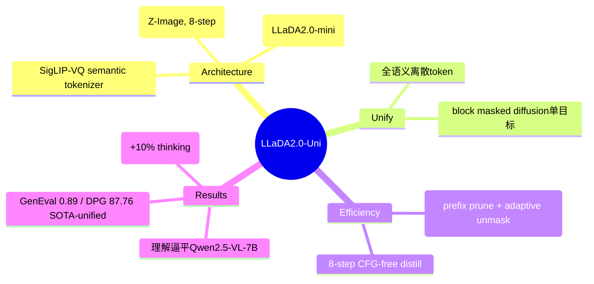

## Summary

LLaDA2.0-Uni 是一个**统一的离散 diffusion LLM (dLLM)**，用单一 block-level masked diffusion 目标同时做多模态理解与生成。三大件：**SigLIP-VQ 全语义离散 tokenizer** + **16B MoE dLLM backbone (LLaDA2.0-mini)** + **基于 Z-Image 的 diffusion decoder**（蒸馏到 8 步 CFG-free）。核心 insight：理解和生成都用**同一套全语义离散 token**，无需异构 encoder，端到端单目标训练。

## Problem & Motivation

统一多模态模型多基于 autoregressive (Janus / BAGEL / OmniGen2)。masked diffusion 在 parallel decoding + bidirectional context 上有天然优势，且单目标训练避免 AR/diffusion loss 的平衡难题。但已有 unified masked diffusion（MMaDA、Lumina-DiMOO）落后于 SOTA AR，根因：

1. reconstructive VQ tokenizer 缺语义 → 理解差；
2. VQ 过度压缩 → 生成质量降；
3. 全 bidirectional attention 对 text 不可靠；
4. 理解任务假设固定输出长度，限制 open-ended 场景。

## Method

- **Semantic Discrete Tokenizer (SigLIP-VQ)**：基于 X-Omni，SigLIP2-g ViT + vector quantizer（codebook 16384 × 2048），**直接在理解任务上训练**而非像素重建，故保留语义、利于理解；支持 dynamic resolution。
- **16B MoE dLLM backbone**：扩 LLaDA2.0-mini 词表纳入 SigLIP-VQ codebook + 生成/理解特殊 token；**block-wise attention**（非纯全注意力，兼顾质量与并行）；1D RoPE + `<height>/<width>` size token 表示 2D 与任意分辨率；auxiliary-loss-free load balancing。
- **Diffusion Decoder**：基于 Z-Image-Base (6B T2I)，把 dLLM 生成的语义 token 作为唯一 conditioning（区别于 X-Omni/NextFlow 冗余地拼 text prompt），consistency 蒸馏到 **8-step CFG-free**。
- **SPRINT**（training-free 推理加速）：Sparse Prefix Retention（modality-aware 剪 prefix KV cache，图像 token 高冗余可激进剪、文本不剪）+ Non-uniform Token Unmasking（confidence-adaptive 替代固定 denoising schedule）。
- **训练 3 阶段**：S0 视觉-语言对齐 (100B tokens) → S1 多任务预训练 (210B) → S2 SFT (80B，先 8k 后扩 16k 上下文)，seq len 8192。SFT ~60M 样本（text:multimodal = 1:5）；生成数据 200M web 图过滤到 140M；引入 reasoning-augmented 数据支持 CoT-before-generation 与 interleaved reasoning。

## Key Results

- **理解（21 benchmark）**：与 specialist Qwen2.5-VL-7B 持平甚至个别超过——MMStar **64.1**（Qwen 63.9）、CountBench 86.0、MMMU 50.1、MathVista 68.1；显著优于 diffusion unified baseline（Lumina-DiMOO MMStar 61.0、LLaDA-o 58.0）。
- **生成**：GenEval overall **0.89**（unified 最高，Position 0.90 居首）；DPG-Bench **87.76**（unified SOTA，超 LLaDA-o 87.04 / HunyuanImage-3.0 86.10）；UniGenBench **79.63**（unified SOTA）；OneIG 0.505（Alignment/Reasoning 居 unified 首）。
- **文本渲染（CVTG-2K）**：0.765，多区域文本时下降比 BAGEL/Lumina-DiMOO/InternVL-U 缓和。
- **reasoning 生成（WISE）**：0.68，加 thinking 模式再 +10%（0.78）。
- **效率**：decoder 8-step CFG-free；SPRINT 进一步加速且质量损失可忽略。

## Strengths & Weaknesses

**Strengths**：
- 真正"全语义离散 token 统一理解+生成"，避免 ViT(理解)+VAE(生成) 的双模块 modeling gap（区别于 BAGEL / LLaDA-o）；SigLIP-VQ 语义 tokenizer 是把 dLLM 理解做上去的关键。
- 在 unified + diffusion 这条赛道上把生成多个 benchmark 推到 SOTA、理解逼平 specialist VLM，证明 discrete diffusion 路线可规模化。
- 工程实在：SPRINT、8-step 蒸馏、offline VQ token 预抽取、data packing、dFactory 训练引擎，关注效率落地。

**Weaknesses**：
- 16B MoE + diffusion decoder 体量不小；虽有 SPRINT/8-step，端到端真实延迟与显存仍待独立核验。
- 个别维度仍落后 specialist：dense text 生成、MMMU-Pro (34.0 vs BAGEL 37.1)、部分 OCR。
- 大量数据/蒸馏依赖 Qwen3-VL-235B 等做标注与过滤，pipeline 复杂、复现成本高。

## Mind Map

## Notes

- 旧版笔记只有摘要级信息，架构方向对但缺全部数值与 16B/SigLIP-VQ/Z-Image/SPRINT 细节；本次据全文补全，并修正机构为 "AGI Research Center, Inclusion AI"、tags 去掉误标的 `world-model`。
- 与本 vault GUI/CUA 主线关系较弱（off-focus，置于 Archive），保留主要因 DomainMap/survey 引用。最有迁移价值的点：**用语义 VQ token 统一理解与生成**、以及 **SPRINT 的 modality-aware KV 剪枝**（对长 multimodal 序列推理加速的思路）。
