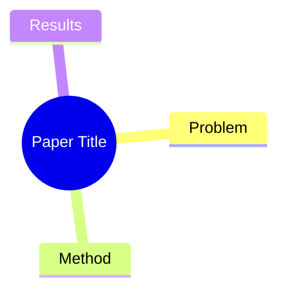

---
title:
authors: []
institute: []
date_publish:
venue:
tags: []
url:
arxiv_id: "%% arXiv id，如 2606.19409；非 arXiv 留空。由 assign_cite_keys.py 自动从 url 抽取 %%"
doi: "%% DOI，如 10.1109/TPAMI...；期刊/会议有则填，否则留空 %%"
cite_key: # 留空、勿加引号（写成 "" 会让 assign_cite_keys.py 静默跳过）；由脚本分配，一旦写入永久冻结
code:
rating: "%% 1=不相关, 2=了解即可, 3=有参考价值, 4=重要, 5=必读 %%"
content_scope: "%% full-text / abstract-only %%"
verification_status: "%% source-checked / partial / unverified；仅表示原文一致性核查，不表示独立复现 %%"
date_added: "{{date}}"
---
## Summary
%% 一句话概括：解决了什么问题、怎么解决的 %%

## Problem & Motivation
%% 问题背景与动机，2-5 句话。为什么重要？现有方法有什么局限？ %%

## Method
%% 核心方法/架构。中文撰写，保留英文技术术语。可分段，鼓励列出关键组件。 %%

## Key Results
%% 主要实验结果，包含具体数字和 benchmark 名称。 %%

## Evidence Ledger
%% 只列高风险 claim：数字、SOTA/novelty、benchmark 可比性、license/code、因果或机制断言。Source locator 用 page/section/table/figure；Evidence excerpt 为原文短摘录（≤25 words）。Status 允许 source-verified / unsupported / contradicted / not-checkable / abstract-only。source-verified 仅表示 primary source 确实包含该信息，不表示结果已被独立复现。 %%

| Claim ID | Claim | Type | Source locator | Evidence excerpt | Status |
|:--|:--|:--|:--|:--|:--|
| C1 |  |  |  |  |  |

## Strengths & Weaknesses
%% 方法亮点与局限的个人评价，以及对领域的潜在影响。 %%

## Mind Map
%% root 节点用论文 ShortTitle，子节点覆盖 Problem / Method / Results 三个维度 %%

## Notes
%% 其他想法、疑问、启发。留空供后续填写。 %%
