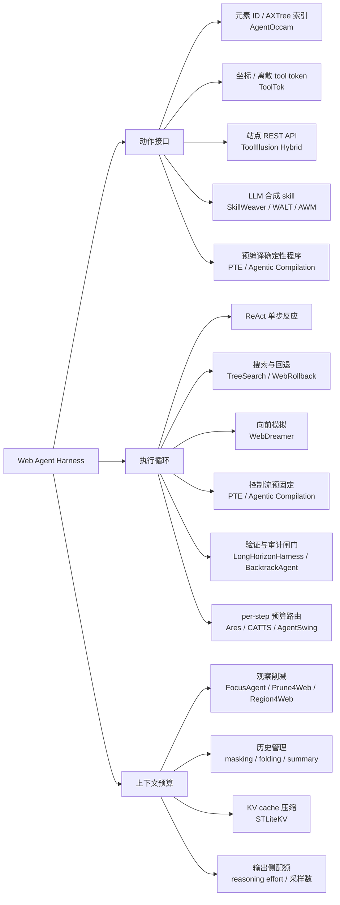
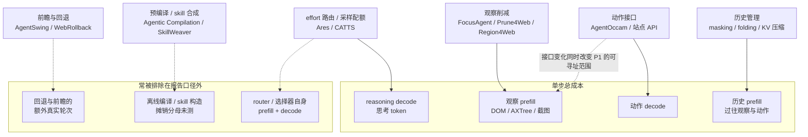

## Overview

Web agent harness 的三条设计轴共用同一份 per-step 预算，因此任一轴上报告的收益只有在预算口径对齐时才可解释。三条轴分别是：

- **动作接口**：agent 能发出什么原语，以及这些原语由谁定义（benchmark、harness 作者、LLM 自己、还是站点 API）
- **执行循环**：单步决策如何串成轨迹，尤其是如何处理不可逆动作与错误恢复
- **上下文预算**：每一步喂进去多少观察、留下多少历史、允许生成多少 reasoning token

这三条轴在 2024 年基本是独立的工程选择，到 2026 年已经互相咬合。[[Papers/2605-Region4Web]] 的观察粒度改动同时改变了动作粒度的可寻址范围；[[Papers/2604-ToolIllusion]] 的动作接口升级把 WebArena 单次实验的 token 从 10.5M 推到 33.9M；[[Papers/2603-Ares]] 在循环里插一个 router 来分配 reasoning token，而 router 自身的 prefill 又落回上下文预算。任何只报告单轴数字的工作，都在隐式假设另外两轴不变。

当前主流做法在三条轴上都已收敛出可辨认的家族。动作接口从 benchmark 原生的元素 ID 点击，分化为坐标动作、站点 REST API、LLM 合成 skill 与预编译确定性程序四支。执行循环从 ReAct 出发，因为真实站点不能 reset 而分化为向前模拟、控制流预固定、验证闸门三支，2026 年又长出第四支：不改循环拓扑、只在循环上挂一个决定"这一步花多少钱"的路由器。上下文预算则分裂成输入侧削减（DOM/AXTree 剪枝、region 粒度、检索、KV cache 压缩）与输出侧配额（reasoning effort、采样数、arbiter 调用）两个方向。

整体趋势是从"给模型更多"转向"给模型更对"，并且两次撞上同一个反直觉现象：给得越多不一定越好，拐点位置随 backbone 能力移动。输入侧的证据是 [[Papers/2604-ReadMoreThinkMore]]——强模型用完整 HTML 比用 a11y tree 高出最多 17.5pp，gpt-oss-20b 用同样的完整 HTML 掉 18.8pp；输出侧的证据是 [[Papers/2602-CATTS]]——WebArena-Lite 上 majority vote 在 N=10 饱和于 43.2%，N=20 在 token 翻倍下退回 43.0%。[[Papers/2410-AgentOccam]] 给出的是同一现象的第三个面：它删动作、改观察格式后 WebArena 达到 43.1%，而 Table 4 显示每步观察 token 从 2210.2 涨到 2930.9，收益来自表示对齐而非压缩。

证据状况是这个方向最需要先说清楚的一件事。第 4 节按预算口径审计了十项代表工作：只有一项的 headline 数字建立在算力对齐的对照上，四项部分对齐，四项不对齐，一项因为没有跑过 agent 而不适用。不对齐的形态是重复出现的同几种——router 自身开销从未测量、baseline 是算术推导而非运行结果、压缩率只统计 actor 侧、headline 对着一个便宜 4 至 8 倍的对照、跨框架比较里同一模型的无工具基线相差 16.4pp。这是该文献族的系统特征，不是个别论文的疏忽。组件级归因的缺口（bundle 报增益、不做角色消融）另见 [[Topics/Harness-Component-Attribution]]。

三条设计轴与其下的方法家族；叶节点只列本文正文有证据讨论的代表工作。

## 技术路线

### 1. 动作接口：谁来定义原语

动作接口的演进由一个反复出现的发现驱动：benchmark 原生动作空间是为了描述"网页上能做什么"而设计的，不是为了让 LLM 好决策而设计的。WebArena 提供 click / type / hover / press / scroll / 标签页与导航共十余个原语，[[Papers/2410-AgentOccam]] 删掉 noop、hover、press、scroll 与全部标签页动作，补上 note、stop、go_home、branch、prune，把核心集收到八个，WebArena 达到 43.1%，高于同期 SteP 的 33.3% 与 WebPilot 的 37.2%，且不用 in-context example、不加 agent 角色、不用在线反馈、不做搜索。branch 在全部任务上只被调用 34 次、prune 47 次，说明收益并不来自新增的规划动作被频繁使用，而来自被删掉的那些动作不再消耗决策概率质量。

沿着"减少决策熵"这条线继续走，接口可以一路上移到站点自己的语义层。[[Papers/2604-ToolIllusion]] 是目前这条线上证据最完整的工作：人工编写的站点 REST API（Hybrid-Agent，每站 437 个）让全部五个 backbone 在 WebArena 上提升 12.4 到 19.6pp（GPT-5-mini 从 19.3 到 38.9），在 VisualWebArena 上提升 3.4 到 8.2pp。但 LLM 合成的工具做不到这件事：WALT 用 GPT-5-mini 造的工具让 GPT-5 从 52.9 掉到 50.9，SkillWeaver 用 GPT-4o 造的工具只对 GPT-5-nano 在两个 benchmark 上都有效。论文由此给出一条单向规律，并用反向 scaling 实验确认：合成工具只在工具使用者明显弱于工具构造者时有效，GPT-5-nano 在全部六种组合下获益，GPT-5 只在使用自己造的工具时获益。这条规律有一处论文自身的例外：GPT-5-mini 在 SkillWeaver-CMS 上对三种 constructor 均有提升，引用时应保留这个边界。

接口质量的可测量代理是调用率与可组合性，而不是工具数量。SkillWeaver 的工具有 79%（341 个）从未被调用过，WALT 22%（9 个），Hybrid 20%（389 个）；Hybrid 有 52% 的任务用到两个以上工具，这批任务成功率 41.2%，而 WALT 的对应数字是 18% 与 32.1%、SkillWeaver 是 25% 与 27.5%。代价同样明确：加工具后单次实验总 token 从 10.5M 涨到 33.9M，Hybrid 的平均步数还从 7.1 升到 8.3。

把接口再往上推一层就是取消运行时决策。[[Papers/2605-PlanThenExecuteWeb]] 主张 web agent 默认采用 plan-then-execute 而非 ReAct，理由是信任边界：ReAct 把攻击者可控的 token 放在模型选择下一个动作的位置上，而 PTE 在观察任何不可信内容之前就固定了控制流图，运行时数据"不能增加步骤、删除步骤、插入新分支、选择新工具或触发重规划"。作者人工静态分类了 WebArena 全部 860 个任务：699 个（81.28%）是纯程序化的，161 个（18.72%）需要运行时 LLM 子过程但不改控制流，需要重规划的为 0，因此 100% 与 PTE 兼容。站点方差极大——Wikipedia 只有 8.70% 属纯程序化（2/23），GitLab 高达 90.69%（185/204）。真正决定这条路线可行性的不是 81.28% 而是另一个数字：WebArena 的 Postmill 只暴露 16 个 REST API，覆盖其 129 个任务中的 33%。论文本身没有跑 agent，全文不含任何成功率、token 或延迟数字，Appendix B 只有几段无量化的 planner 试用观察（Swagger 2.0 JSON 表示法优于 GraphQL）。

[[Papers/2604-AgenticCompilation]] 把同一思路做成工程系统：DOM sanitization、一次性编译成 JSON blueprint、确定性 runtime 执行，每次编译都必过一道人工审核闸门。它的 framing（把连续 agent 的 O(M×N) 推理成本换成 amortized O(1)）值得记，数字不值得引用——$150 的连续 agent 基线是估算，从未运行，也从未给出 per-token 价格或 baseline 模型名；实测的只有编译侧的 $0.002 至 $0.0916；宣称的"1500× 成本削减"是一个假设值除以一个实测值。DOM 压缩宣称"up to 85%"，同样没有任何测量。

这条路线上还有一支把动作定义权交给 agent 自己：[[Papers/2504-SkillWeaver]] 让 agent 自主探索站点并把复用交互蒸馏成可执行 API，[[Papers/2409-AgentWorkflowMemory]] 从轨迹中归纳自然语言 workflow 注入 prompt。二者在各自论文中均报告显著相对提升（SkillWeaver WebArena +31.8%，AWM WebArena +51.1%）。[[Papers/2606-SkillMemoryBudget]] 在 token 对齐条件下重测这一族，结论相反：Vanilla-IB 在三个模型上全胜（Gemini 3 Flash 50.74% / 71.9K，对 AWM 44.98% / 102.0K、ReasoningBank 45.54% / 86.4K），并查出 AWM 有 49.5% 至 52.3% 的 workflow 来自失败轨迹、ReasoningBank 有 52.9% 至 59.5% 的"成功"条目实际来自失败轨迹。该反驳的适用范围限于在线按任务付费的场景，离线摊销不在其射程内。

下表把五种接口层级放在同一组维度上对照，回答的问题是：每种接口需要什么前置条件才成立，以及它把成本转移到了哪里。

| 接口层级 | 代表工作 | 动作原语 | 前置条件 | 已测得的代价 |
|:--|:--|:--|:--|:--|
| 元素 ID / AXTree 索引 | [[Papers/2410-AgentOccam]] | click / type / go_back / note / stop / go_home / branch / prune | 可访问性树可用且元素索引稳定 | 步数 6.2 → 9.0；每步观察 token 2210.2 → 2930.9 |
| 坐标 / 离散 tool token | [[Papers/2602-ToolTok]] | 光标移动、点击、返回、输入编码为可学习 token，coarse-to-fine 寻路 | 需训练；约 5K 合成 + 2K 真实样本 | 多步寻路取代单步回归，步数上升 |
| 站点 REST API | [[Papers/2604-ToolIllusion]] Hybrid | 人工编写，每站 437 个 | 每个站点都要人工写 API 并维护 | 总 token 10.5M → 33.9M；平均步数 7.1 → 8.3 |
| LLM 合成 skill | [[Papers/2504-SkillWeaver]]、WALT、[[Papers/2409-AgentWorkflowMemory]] | agent 自主蒸馏的可执行程序或自然语言 workflow | 构造者必须明显强于使用者 | 零调用率最高 79%；token 对齐后被 Vanilla-IB 反超（[[Papers/2606-SkillMemoryBudget]]） |
| 预编译确定性程序 | [[Papers/2605-PlanThenExecuteWeb]]、[[Papers/2604-AgenticCompilation]] | 编译期固定的控制流图 / JSON blueprint | 站点需有完整可信 API；Postmill 实测只覆盖 33% 任务 | 每次编译必过人工闸门；拼写错误等运行时异常直接终止 |

这一节的待解决问题集中在两处。第一，接口收益的机制归因仍未分离：AgentOccam 在观察变长的同时提升成功率，说明收益来自决策空间对齐；但站点 API 的收益里同时混着"少走几步"与"每步更容易选对"，[[Papers/2604-ToolIllusion]] 的步数数据显示 Hybrid 的步数反而上升，两种机制的相对贡献没有被拆开。第二，编译式接口的适应性成本从未被测量——[[Papers/2604-AgenticCompilation]] 的真实规模是 O(S_compile × R)，其中 R 是重编译频率，而全文没有任何脆性率、重编译频率或衰减曲线。

### 2. 执行循环：不可逆性如何塑造循环拓扑

循环设计的主线是对"动作不可逆"的处理方式，而这条线的起点是一个实现细节。[[Papers/2407-TreeSearchLMAgents]] 是首个在真实 web benchmark 上有效的推理期树搜索（best-first + GPT-4o value function，VisualWebArena 18.9% → 26.4%，WebArena 15.0% → 19.2%），它的回溯实现方式是重置环境并重放动作序列——这本身就是"环境没有原生快照能力"的最直接证据。同一年 [[Papers/2411-WebDreamer]] 给出的替代方案正是从这个约束出发：既然真实站点上 reset 与 undo 不可行，就让 GPT-4o 同时充当 world model 与 value function，在执行前对候选动作做自然语言模拟。VisualWebArena 上 23.6%（反应式 17.7%，树搜索 26.4%），但 wall-clock 只有树搜索的约四分之一，且能跑在树搜索完全无法运行的真实站点上（Mind2Web-live 25.0% 对反应式 22.1%）。

回退作为显式动作是第三种处理。[[Papers/2504-WebRollback]] 让 agent 自己决定何时多步回退，critique 模块每步二值判断 continue 或 rollback，浏览器通过 URL 重定向恢复状态，live benchmark 上零样本提升 3 至 6pp。[[Papers/2505-BacktrackAgent]] 把这套做到移动端并给出该机制最重要的边界条件：它的回退只在非 live benchmark 上可行（Mobile3M 是预先 BFS 过的页面图，Auto-UI 是画在截图上的模拟执行），全文没有讨论如何撤销真实动作。它的消融进一步说明为什么这条路难走——改用模拟生成的结果页做回退只带来 +0.70 并且降低任务与步准确率，即错误检测在结果页不真实时就失效；错误检测精度 75.12% / 召回 43.58%，reflector 只挽回 2.37% 的真实错误，同时破坏 0.78% 的正确动作。

控制流预固定是第四种，见第 1 节的 [[Papers/2605-PlanThenExecuteWeb]] 与 [[Papers/2604-AgenticCompilation]]：不处理不可逆性，而是让不可信数据没有机会改写控制流。代价是失去反应能力，作者自己列出 ReAct 更优的三类场景（高动态站点、探索密集任务、跨站点工作流），并给了一个具体失效例子——查询里把 furniture 拼成 furnture 时 PTE 直接终止而 ReAct 会继续迭代。

第五种是把验证做成循环里的独立角色。[[Papers/2608-LongHorizonHarness]] 的 Manage-Execute-Audit 循环把任务状态放在执行之外，只用独立核实过的环境事实更新；manager 不能观察或修改环境，executor 是每轮丢弃原始轨迹的受限 episode，read-only auditor 从不含 executor 轨迹的全新上下文出发独立比对环境与验收标准，executor 的自述永远不能更新状态。WeaveBench 51.8 → 80.7、Terminal-Bench 2.1 69.7 → 77.2 均为算力对齐的自跑对照，但 OSWorld 2.0 的 2.8 → 8.3 不是工具面对齐的（基线是官方 GUI-only 数字，本方法用 GUI+CLI 混合工具池），且全文没有任何角色级消融。[[Papers/2606-RecursiveAgentHarness]] 把递归单元从模型调用升级为完整 harness，父 agent 写 Python 脚本用 asyncio.gather 绕开供应商的每轮并行工具调用上限，子 agent 有隔离工作区且不共享父与兄弟上下文；Oolong-Synthetic 上 81.36%（GPT-5）对全上下文 59.22%，但没有任何消融、没有测量 token、三个基线全部是引用的已发表数字而非重跑，bootstrap 置信区间只对自己的 199 个逐例分数重采样。它的主导失败模式值得记：父 agent 干脆不写派生脚本、退化成单个 coding agent，且集中在长上下文桶，也就是该机制本该起作用的地方。

2026 年出现的第六支不改循环拓扑，只在循环上挂一个决定"这一步花多少钱"的路由器。三个工作的信号不同但结构一致。[[Papers/2603-Ares]] 用一个微调过的 Qwen3-1.7B 每步预测 backbone 该用 low / medium / high 哪档 reasoning effort，标签来自"锚定最短成功轨迹、逐步回放、找出能稳定复现该步动作的最低档"的自动标注流水线；WebArena 上 46.5% / 1512K token，对 always-high 的 45.0% / 2763K，即 +1.5pp 且省 45.3%。[[Papers/2602-CATTS]] 用投票分布的熵或 margin 作为信号，只在不确定性超阈值时才调用 arbiter，其余步骤直接用多数票；WebArena-Lite 47.9% / 745K，对 majority vote 43.2% / 920K。[[Papers/2603-AgentSwing]] 把信号做成真实环境里的前瞻 rollout：上下文占用触发阈值后，对 Keep-Last-N、Summary、Discard-All 三个分支各跑 K=3 个真实轮次，再由 agent 模型自己路由。三者都有效，三者的成本记账都有问题，见第 4 节。

同一支上还有两个把控制信号做到模型内部的工作。[[Papers/2607-MHLC]] 在冻结的 LLM/VLM 上训练两个读取生成期 hidden state 轨迹的轻量控制头，AndroidWorld 上把 Qwen3-VL-4B 到 32B 的 routed execution 从 0.47 提到 0.60 并省下 90.7% 付费 API 成本。[[Papers/2606-AgenticAbstention]] 处理的是路由的极端情形——何时应当停止：当前 agent 的问题不是永远不 abstain，而是经常 abstain 得太晚。

下表按"该循环结构需要环境提供什么"组织，这是决定它能否搬到真实站点的唯一硬约束。

| 循环结构 | 代表工作 | 对环境的要求 | 报告增益 | 成本口径 |
|:--|:--|:--|:--|:--|
| ReAct 单步反应 | WebArena 原生设定 | 无 | 基线 | 基线 |
| 推理期树搜索 | [[Papers/2407-TreeSearchLMAgents]] | 可 reset 并重放动作序列 | VWA 18.9 → 26.4 | 未做算力对齐；wall-clock 为模拟法的约 4 倍 |
| 向前模拟 | [[Papers/2411-WebDreamer]] | 无（可跑真实站点） | VWA 17.7 → 23.6 | wall-clock 约为树搜索的 1/4 |
| 显式回退 | [[Papers/2504-WebRollback]]、[[Papers/2505-BacktrackAgent]] | 状态可由 URL 恢复；或页面图为离线预抓 | live +3~6pp；Mobile3M +7.59 | BacktrackAgent 推理慢约 50% |
| 控制流预固定 | [[Papers/2605-PlanThenExecuteWeb]]、[[Papers/2604-AgenticCompilation]] | 完整可信站点 API | 未跑 agent / 编译成功率 80~94% | PTE 无成本数字；编译侧 $0.002~$0.092 |
| 管理-执行-审计 | [[Papers/2608-LongHorizonHarness]] | 环境状态可被独立读取核验 | WeaveBench 51.8 → 80.7 | WeaveBench 与 Terminal-Bench 对齐，OSWorld 不是工具对齐 |
| 递归 harness | [[Papers/2606-RecursiveAgentHarness]] | 可执行代码、可隔离工作区 | Oolong 71.75 → 81.36 | 未测 token；基线为引用数字 |
| per-step 预算路由 | [[Papers/2603-Ares]]、[[Papers/2602-CATTS]]、[[Papers/2603-AgentSwing]] | 无（Ares 需同模型多档 effort） | +1.5 / +4.7 / +7.5 | 见第 4 节，三者口径各有缺失 |

这一节的待解决问题有两个。第一，路由器信号的比较从未被做过：lookahead rollout、投票不确定性、独立 router 模型、hidden-state 控制头四种信号在同一环境同一 backbone 上孰优孰劣，尚未见任何工作对照。第二，前瞻类方法的收益来源没有被隔离——[[Papers/2603-AgentSwing]] 的消融显示 k=1 在 GPT-OSS-120B 上恰好持平最好静态策略的 52.5、在 Tongyi-DR 上恰好持平 58.0，而 random 路由（51.0 / 56.5）与去掉前瞻（50.0 / 57.0）都低于最好静态策略，也就是"手里有多个候选"这件事本身贡献为负，全部增益来自 k=1 到 k=3 那一步；但"多跑了 9 个真实轮次"与"看到了下游反馈"两种解释同样符合这个形状。

### 3. 上下文预算：输入削减、历史管理与输出配额

上下文预算是三条轴里方法最密集、也是负证据最集中的一条。输入侧削减在 2025 年已经形成四种做法。规则式压缩把线性化的可访问性树重构成紧凑结构，[[Papers/2605-A11yCompressor]] 在 OSWorld 上压到基线的约 22% 同时平均成功率提升 5.1pp（该证据来自桌面环境，网页上的对应实验尚未见）。检索式削减让一个轻量模型按任务目标挑选观察行，[[Papers/2510-FocusAgent]] 用 GPT-4.1-mini 在 WorkArena 与 WebArena 上削减 50% 以上观察并基本追平全观察基线，其防御变体只在检索 prompt 里加一句防御说明，就把 banner 与 popup 注入攻击成功率从 32.4% 与 90.4% 压到约 1%。程序化剪枝把打分逻辑从 LLM 转移到固定程序，[[Papers/2511-Prune4Web]] 让 LLM 只生成打分参数、由程序遍历 DOM 剪枝，候选元素削减约 25 至 50 倍，低层子任务 grounding 精度从 46.8% 提到 88.28%。视觉侧的对应做法是按历史点击坐标裁剪截图，[[Papers/2601-CompressToFocus]] 报告约 53% 至 55% 的 token 压缩与最高 3.8 倍训练加速。

第四种做法改的是粒度而非内容。[[Papers/2605-Region4Web]] 把观察粒度设在功能区域、动作粒度仍留在元素，用一个 536K 参数的边分类器对可访问性树做一次自底向上的合并或切分，再由微调的 Qwen3-0.6B 为每个区域生成稳定的 purpose 与易变的 state summary；进入页面时由 actor 自己的 backbone 选择相关区域，选中的展开完整子树、未选中的只留 purpose，跨步骤只有 purpose 持久化。四个 backbone 平均每步观察 6,437 → 3,671（−43%），成功率 +2.3pp。这个数字有两层必须分开：−43% 只统计 actor 侧，把区域选择（19.5%）与 view_all 回退（6.6%）的开销计入后，任务尺度净削减是 −25%（GPT-5.1 单 backbone 上中位 26,707 → 19,944）。更有诊断价值的是它的消融：单独加 Region4Web 让观察变长 9.5%（5,410 → 5,922）只换来 +1.8pp，全部压缩来自 PageDigest 的区域选择与跨步骤持久化；而加上 self-context 与元素级变体后准确率跌到 46.1%，低于 48.5% 的基线。论文没有讨论的是六处域级回退，其中 AgentOccam 在 GitLab 上从 66.7 掉到 50.0。

历史管理这一支的证据比输入侧削减更分裂。最简手段是遮蔽最近 K 步之外的陈旧观察，[[Papers/2605-MaskingRegimeMap]] 把它的收益画成随基线准确率变化的不对称倒 U：弱检索器下是 +6.2 到 +6.6 的低平台，强检索器配中等能力模型时达到 +11.7 的峰值，模型饱和后崩塌为零甚至负值（−1.1，live web 上 −4.8）。折叠是更结构化的做法，[[Papers/2510-ContextFolding]] 给 agent 两个显式动作：branch 开独立工作上下文做子任务、return 折叠分支只留摘要回主线程，KV cache 回滚到 branch 位置，活跃上下文缩小 10 倍。[[Papers/2512-FoldAct]] 对整条折叠路线提出理论批评：摘要会修改 agent 未来的观察空间，使观察分布依赖于策略且非平稳，违反 policy gradient 的平稳观察假设，带来梯度稀释与训练崩溃；其修复方案在 WebWalker 上让 7B 超过 32B 基线并提速 5.19 倍，而去掉一致性约束的 49.6 倍版本会在第 173 步崩溃。摘要与丢弃之间的选择本身也可以路由，见 [[Papers/2603-AgentSwing]]。

KV cache 层的压缩是这一支里唯一给出机制诊断的工作。[[Papers/2603-STLiteKV]] 发现 GUI 场景的注意力在所有层上都是均匀高稀疏的，这使得 PyramidKV 与 VL-Cache 那类按层分配预算的方法放大数值噪声；它改用逐层均匀预算加上两个零超参组件，1% 预算下 ScreenSpot Pro 得 7.3 而 VL-Cache 1.1、PyramidKV 4.8，80% 预算下 43.4 反超全 cache 的 42.3。AITW 上 20% 预算的 20.1 / 20.7 高于全 cache 的 18.2 / 18.7，作者归因于过滤了视觉高度重复的陈旧历史。解码加速在 3 / 5 / 10 帧下为 1.25 / 1.68 / 2.45 倍，prefill 约 0.98 至 0.99 倍。该工作的主体证据在移动与桌面 GUI 上，Multimodal-Mind2Web 是其中唯一的网页评测。它的摘要里"平均高出基线 7.3%"是被证伪的——7.3 是最大的单格差值，真实均值约 2.2% 至 2.4%。

输出侧配额是 2026 年新长出来的一支，处理的是 reasoning token 而不是观察 token。[[Papers/2603-Ares]] 的效果分布本身比总数更有用：WebArena 上早期 0 至 2 步以 low 为主，high 比例随任务推进上升，按动作类型看 go_back 与 branch 的 high 占比最高，也就是算力主要该花在自我纠错与重规划节点上。[[Papers/2602-CATTS]] 给出的是采样与仲裁两级配额：per-step majority vote 在 N=10 饱和（43.2%），N=20 回退（43.0%）；arbiter 在高一致性步骤上是净负的，Figure 4 的分箱显示熵在 0.0 至 0.3 区间时 arbiter 净效应 −4.4%，更高熵区间才是 +4% 至 +6%。它还给出一个观察性但量化的代价：495 个任务运行中，零 override 的任务成功率 46.9%，至少一次 override 的 35.0%，差 11.9 个点，Fisher 精确检验 p=0.026；该对照是观察性的，样本非独立，且与轨迹长度混淆。

下表把这一节的方法放在"它削减哪一部分预算"的坐标上。

| 削减对象 | 方法 | 代表工作 | 报告效果 | 已知失效条件 |
|:--|:--|:--|:--|:--|
| 单步观察（规则） | a11y tree 结构重构 | [[Papers/2605-A11yCompressor]] | OSWorld token 压到 22%，+5.1pp | 证据在桌面环境；网页对应实验未见 |
| 单步观察（检索） | 按目标检索观察行 | [[Papers/2510-FocusAgent]] | 削减 >50%，追平全观察 | 每次观察检索耗时 105.69s（[[Papers/2605-MFSCoverage]] 测得） |
| 单步观察（程序剪枝） | LLM 出打分参数，程序遍历 | [[Papers/2511-Prune4Web]] | 候选削减 25~50×，grounding 46.8 → 88.28 | 依赖 DOM 结构可解析 |
| 单步观察（粒度） | 功能区域观察 + 元素动作 | [[Papers/2605-Region4Web]] | actor 侧 −43%，任务尺度 −25%，+2.3pp | 单独使用观察反而 +9.5%；SPA 客户端路由不触发失效 |
| 视觉历史 | 按点击坐标裁剪 ROI | [[Papers/2601-CompressToFocus]] | 53~55% 压缩，3.8× 训练加速 | 非坐标动作的截图被整帧丢弃 |
| 跨步历史（遮蔽） | mask 最近 K 步外的观察 | [[Papers/2605-MaskingRegimeMap]] | 峰值 +11.7 | 模型饱和时 −1.1，live web −4.8 |
| 跨步历史（折叠） | branch / return + KV 回滚 | [[Papers/2510-ContextFolding]]、[[Papers/2512-FoldAct]] | 活跃上下文 −10×；7B 超 32B | 摘要使观察分布非平稳，无一致性约束会训练崩溃 |
| KV cache | 逐层均匀预算 + 空间显著性 | [[Papers/2603-STLiteKV]] | 1% 预算 7.3 对 VL-Cache 1.1 | 网页证据仅 Multimodal-Mind2Web 一项 |
| 输出 reasoning token | per-step effort 路由 | [[Papers/2603-Ares]] | WebArena +1.5pp / −45.3% | router 自身开销未计入 |
| 输出采样与仲裁 | 不确定性门控 arbiter | [[Papers/2602-CATTS]] | 47.9% / 745K 对 43.2% / 920K | 低熵步骤上 arbiter 净效应 −4.4% |

这一节的待解决问题有三个。第一，压缩质量目前主要靠端到端成功率来评，代价是每改一次都要跑一遍完整评测；[[Papers/2605-MFSCoverage]] 提出的 Minimal Failure Set 覆盖率是目前唯一的替代代理，报告 290 倍与 246 倍的评测提速（48.2 分钟对 232.4 小时）并在偏相关下与端到端成功率保持强相关，但它尚未被其他组独立使用。第二，输入侧最优表示随 backbone 移动这件事已经被 [[Papers/2604-ReadMoreThinkMore]] 量化（强模型用完整 HTML 最高 +17.5pp，gpt-oss-20b −18.8pp），但没有任何工作给出选择规则。第三，截图与图像 token 的预算策略在当前检索范围内未见针对 web agent 的专门研究——已有工作要么只裁剪坐标 ROI（[[Papers/2601-CompressToFocus]]），要么在 KV 层做（[[Papers/2603-STLiteKV]]），没有工作系统比较"给几张截图、给多大分辨率"这一层的取舍。

### 4. 预算口径：为什么多数 harness 效率数字不可横向比较

前三节反复出现同一个问题：报告的收益与成本落在不同的口径上。这一节把口径本身当作分析对象，因为在这个方向上，口径差异造成的数字差距经常大于方法之间的真实差距。

下图把单步预算拆成四项，并标出每种方法作用在哪一项、哪些项通常被排除在报告口径之外。虚线框内是三类常被漏记的成本。

单步 token 预算的四项组成，以及三类常被漏记的成本；实线表示该方法直接作用的预算项，虚线表示未纳入报告口径的部分。

三种口径错位反复出现。第一种是**统计边界错位**：只统计方法作用的那一部分成本。[[Papers/2605-Region4Web]] 的 −43% 只算 actor 侧观察，把区域选择与 view_all 计入后是 −25%；[[Papers/2603-Ares]] 的 cost 函数在 §3.1 就被定义为 agent 生成的 token，router 自己的 prefill 与 decode 从未出现任何数字。Ares 这一处尤其值得展开：router 是与 agent 不同的模型（Qwen3-1.7B 对 gpt-oss-20b），无法复用 agent 的 KV cache，每一步都要独立 prefill 整段交互历史与观察，而 WebArena 的可访问性树动辄数千 token。论文在引言里正是用"为另一个模型重新编码上下文"这项成本来贬低跨模型路由的，这项成本原样落在它自己的 router 上。

第二种是**基线错位**：headline 对着一个成本量级不同的对照。[[Papers/2602-CATTS]] 摘要里的 +9.1% 是对 ReAct N=1（96K token）而言，而 CATTS 花的是 4.2 至 7.8 倍的 token；"2.3× fewer tokens" 对的又是另一个基线（majority vote N=10 的 920K）。同一篇论文里其实存在一组干净的算力对齐对照（always-arbitrate 762K / 44.0% 对 CATTS(H) 745K / 47.9%），但它不是被拿去做 headline 的那一组。同样地，[[Papers/2603-Ares]] 相对 always-high 省 45.3%，但相对 random 路由，Ares 在四个设置里 token 全部更高；random 相对 always-high 的削减是 64.3% / 40.3% / 78.7% / 69.0%，每一项都大于 Ares。成立的结论是"random 换不来准确率"，不是"random 换不来成本削减"。

第三种是**干预捆绑**：一次比较里同时变了不止一件事。[[Papers/2604-AgenticCompilation]] 的连续 agent 基线假设每步重发 20,000 token 的原始 DOM，而编译路径用的是压缩后的骨架，节省里混着 DOM 削减与消除逐步推理两部分。[[Papers/2604-ToolIllusion]] 的框架内对照是干净的，跨框架对照不是：同一个 GPT-5 的无工具 WebArena 基线在 WALT 下是 52.9、在 SkillWeaver 下 39.2、在 Hybrid-Agent 下 36.5，16.4pp 的 scaffold 差距被整体归因给了 API 质量；论文只在一个脚注里承认排序会随框架变化，没有说明这个绝对差距。

下表按 budget-matched 的三档判定汇总前三节讨论的工作。判定依据是：headline 数字所对照的基线，是否在 token 或算力上与本方法对齐。

| 工作 | headline 宣称 | 对照基线 | budget-matched | 口径问题 |
|:--|:--|:--|:--|:--|
| [[Papers/2606-SkillMemoryBudget]] | Vanilla-IB 胜过全部 memory harness | 同 token 预算 | yes | 该工作本身就是口径反驳；结论限于在线按任务付费 |
| [[Papers/2608-LongHorizonHarness]] | WeaveBench 51.8 → 80.7 | 同工具面自跑基线 | partial | WeaveBench 与 Terminal-Bench 对齐；OSWorld 那格基线是官方 GUI-only 数字 |
| [[Papers/2605-Region4Web]] | −43% token，+2.3pp | 4 backbone 同 evaluator 同 tokenizer | partial | −43% 仅 actor 侧；唯一近似等长的对照对的是另一种压缩方法，不是全观察基线 |
| [[Papers/2604-ToolIllusion]] | WebArena +12.4~19.6pp | 同框架内有无工具 | partial | 框架内对齐；跨框架同模型基线差 16.4pp，token 10.5M → 33.9M 未纳入结论 |
| [[Papers/2602-CATTS]] | +9.1%，2.3× fewer tokens | 两个不同基线 | no（headline） | 干净对照存在于 Table 4（762K/44.0 对 745K/47.9），但未用作 headline；τ 在评测集上调 |
| [[Papers/2603-Ares]] | WebArena +1.5pp / −45.3% | always-high | no | router 自身 prefill 与 decode 无任何数字；相对 random 反而更贵 |
| [[Papers/2603-AgentSwing]] | Pass@1 超最好静态策略 +7.5 | best static | no | 无任何 token 或算力对齐对照；每次触发 3×3 个额外真实轮次是否计入 400 轮预算未说明 |
| [[Papers/2606-RecursiveAgentHarness]] | Oolong 71.75 → 81.36 | 引用的已发表数字 | no | 无消融、未测 token、基线未重跑 |
| [[Papers/2604-AgenticCompilation]] | 1500× 成本削减 | 估算的连续 agent | no | $150 从未运行；DOM 压缩与消除推理两个干预捆绑 |
| [[Papers/2605-PlanThenExecuteWeb]] | 100% 任务与 PTE 兼容 | 无 | 不适用 | 未跑 agent；全文无成功率、token、延迟数字 |

这张表的用法不是给论文排名，而是给引用设边界：判定为 no 的行，其效率数字不应被跨论文搬运；判定为 partial 的行，搬运时必须带上限定条件。

## Datasets & Benchmarks

harness 研究用的评测基本沿用通用 web agent benchmark，没有专门为 harness 设计的评测。这带来一个结构性问题：这些 benchmark 的主指标是成功率，成本是各论文自己定义的附加列，因而口径不统一。下表的 SOTA 列只填本文正文有证据讨论的结果，不代表该 benchmark 的全局最优。

| Dataset | 规模 | 评估指标 | 本文涉及的最高结果 | 特点 |
|:--|:--|:--|:--|:--|
| WebArena | 812 任务 / 5 站点 | 程序化成功率 | 47.5%（[[Papers/2605-Region4Web]] + GPT-5.1）；46.5%（[[Papers/2603-Ares]] + AgentOccam scaffold） | harness 研究的默认场地；可 reset，因此树搜索类方法只在这里成立 |
| WebArena-Lite | 165 任务 | 程序化成功率，平均 8~12 步 | 53.9%（[[Papers/2605-Region4Web]] 消融，GPT-5.1）；47.9%（[[Papers/2602-CATTS]]） | 单题粒度 0.61 个百分点，因此小于 1 点的差异等价于一道题的差别 |
| VisualWebArena | 910 任务 | 程序化成功率 | 26.4%（[[Papers/2407-TreeSearchLMAgents]]） | 视觉依赖任务；[[Papers/2604-ToolIllusion]] 显示加工具后视觉缺口普遍缩小 |
| WorkArena L1 | 33 任务族 | 成功率 | 55.56%（[[Papers/2606-SkillMemoryBudget]] Vanilla-IB） | 企业 SaaS 界面；CSS 属性密集，压缩方法的域依赖在此暴露 |
| Mind2Web / Multimodal-Mind2Web | 离线轨迹 | 步级 / 元素准确率 | 88.28% 低层 grounding（[[Papers/2511-Prune4Web]]） | 离线，无状态转移，只能评观察与 grounding，不能评循环 |
| Mind2Web-live | 在线 | 成功率 | 25.0%（[[Papers/2411-WebDreamer]]） | 真实站点，不可 reset，是回退类方法的硬约束场地 |
| WebLinx | 对话式网页导航 | 成功率 | 保持 89% 成功率下 3.1× 提速（[[Papers/2605-MFSCoverage]]） | 文本密集，与 WorkArena 构成压缩方法的域对照 |
| GoBrowse | 采样 341 任务 | LLM-as-judge，平均 4~6 步 | 90.4%（[[Papers/2602-CATTS]]） | 基线已在 86~90% 区间，饱和度高，容易掩盖方法差异 |
| BrowseComp / BrowseComp-Plus | 500 题级 | Pass@1 | 62.5%（[[Papers/2603-AgentSwing]]，DeepSeek-v3.2） | 检索式任务，无网页状态转移；属邻接证据，见 [[Topics/WebAgent-Survey]] |

## 失败模式与负证据

**压缩单调有益是错的，且拐点随 backbone 移动。** [[Papers/2604-ReadMoreThinkMore]] 在 WorkArena L1 上系统对比 a11y tree 与原始 HTML：claude-sonnet-4-6、gpt-5.1、gemini-2.5-flash 用完整 HTML 更好，最高 +17.5pp；gpt-oss-20b 用同样的完整 HTML 掉 18.8pp。[[Papers/2605-MaskingRegimeMap]] 在长程搜索上给出同形状的结果：遮蔽陈旧观察的收益是随基线准确率变化的倒 U，模型饱和时为 −1.1，live web 上 −4.8。[[Papers/2410-AgentOccam]] 提供第三个面：它的完整版让每步观察从 2210.2 涨到 2930.9 token，成功率仍为 43.1%，高于只做动作删减的版本。

**观察粒度改动单独使用会让观察变长。** [[Papers/2605-Region4Web]] 的消融显示，只加区域表示时观察从 5,410 涨到 5,922 token（+9.5%），只换来 +1.8pp；把 self-context 与元素级变体叠上去后准确率跌到 46.1%，低于 48.5% 的基线。全部压缩来自 PageDigest 的选择与持久化。

**LLM 合成的工具在使用者不弱于构造者时无效或有害。** [[Papers/2604-ToolIllusion]] 中 WALT 的工具让 GPT-5 从 52.9 掉到 50.9；SkillWeaver 的工具有 79% 从未被调用。语义化 skill 描述对强模型有帮助（GPT-5 在 CMS 上 skill 45.1 > 无工具 43.4 > 原始 tool 42.9），对弱模型有害（GPT-5-nano skill 9.3 < 无工具 9.9 < tool 12.1）。

**memory / workflow harness 在 token 对齐后全面落后。** [[Papers/2606-SkillMemoryBudget]] 在三个模型上重测 AWM、ASI、ReasoningBank，Vanilla-IB 全胜，并查出 AWM 有约一半 workflow 来自失败轨迹、ReasoningBank 过半"成功"条目实际来自失败轨迹、ASI 的 skill 首步失败率 9.8% 至 72.2%。真正驱动差异的是任务长度：Admin 域从 10 步延长到 15 步，成功率从 48.72 升到 57.14。

**回退机制依赖离线环境。** [[Papers/2505-BacktrackAgent]] 的回退只在预抓页面图与模拟执行上成立；改用模拟生成的结果页做回退只带来 +0.70 并降低任务与步准确率。其错误检测召回率 43.58%，reflector 只挽回 2.37% 的真实错误、破坏 0.78% 的正确动作。

**per-step 采样与仲裁都会饱和并回退。** [[Papers/2602-CATTS]] 的 majority vote 在 WebArena-Lite 上 N=10 饱和于 43.2%，N=20 在 token 翻倍下退回 43.0%；Plan-and-Act 同样非单调（GoBrowse 在 8 倍预算下从 83.3% 降到 80.6%）。arbiter 在低熵步骤上净效应为 −4.4%。

**多候选并行本身不产生增益。** [[Papers/2603-AgentSwing]] 的消融里，k=1 恰好持平两个 backbone 各自的最好静态策略（52.5 与 58.0），random 路由与去掉前瞻都低于最好静态策略。

**编译式路线的适应性成本从未被测量。** [[Papers/2604-AgenticCompilation]] 全文没有脆性率、重编译频率或衰减曲线；其 §5.5 把自动重编译列为 future work，而 §3.4、§5.2、§5.4 用现在时描述该机制正在运行，论文内部对此自相矛盾且无代码可核。

**递归 harness 的失败集中在它本该起作用的地方。** [[Papers/2606-RecursiveAgentHarness]] 的主导失败模式是父 agent 不写派生脚本、退化成单个 coding agent，且 GPT-5 在 262K、1M、2M、4M 四个长上下文桶上都低于 71.75% 的基线。

## Key Evidence Matrix

| Survey claim | State | Evidence objects | Claim IDs / locators | Contradictions / boundary |
|:--|:--|:--|:--|:--|
| 观察压缩并非单调有益，最优表示随 backbone 与 thinking 预算变化 | consensus | [[Papers/2604-ReadMoreThinkMore]]、[[Papers/2605-MaskingRegimeMap]]、[[Papers/2410-AgentOccam]] | ReadMoreThinkMore 主表（+17.5 / −18.8）；MaskingRegimeMap regime 曲线（+11.7 / −1.1 / −4.8）；AgentOccam Table 4（2210.2 → 2930.9） | 三者环境不同（WorkArena L1 / 长程搜索 / WebArena），共享的只有"符号会翻转"这一结论；具体拐点不可跨环境搬运 |
| 动作空间对齐的收益来自减少决策熵，而非减少 token | single-source | [[Papers/2410-AgentOccam]] | Table 4 三档观察 token；43.1% 对 SteP 33.3 / WebPilot 37.2；branch 34 次 / prune 47 次 | 尚未见独立复现；其他工作未做"删动作但不改观察"的隔离 |
| 人工编写的站点 REST API 对全部 backbone 有效，LLM 合成工具只在使用者明显弱于构造者时有效 | single-source | [[Papers/2604-ToolIllusion]] | C1（WebArena +12.4~19.6pp，五 backbone）；C4（反向 scaling，Table 5） | 论文自身有例外：GPT-5-mini 在 SkillWeaver-CMS 上对三种 constructor 均获益；跨框架同模型无工具基线差 16.4pp，该 16.4pp 未被论文解释 |
| WebArena 全部 860 个任务与 plan-then-execute 兼容，无需重规划 | single-source | [[Papers/2605-PlanThenExecuteWeb]] | C1（Table 1 合计 860，replan-needed 0）；C2（699/860 = 81.28%） | 人工单标注，无第二标注者与一致性统计；未跑 agent，无成功率/token/延迟数字；同论文的 33% API 覆盖率（Postmill 16 个 API / 129 任务）是更强的可行性约束 |
| Region4Web 的 −43% 是 actor 侧数字，任务尺度净削减为 −25% | source-verified | [[Papers/2605-Region4Web]] | C1（6,437 → 3,671，四 backbone 均值）；C11（26,707 → 19,944，GPT-5.1 中位） | 两个数字口径不同：−43% 是四 backbone 的每步均值之均值，−25% 是 GPT-5.1 单 backbone 的任务尺度中位；GPT-5.1 自身的每步中位为 −33% |
| CATTS 的 +9.1% 不是算力对齐的比较 | source-verified | [[Papers/2602-CATTS]] | C17（47.9 − 38.8 = 9.1）；C18（920K/405K = 2.27）；全文 compute-matched / iso- 零命中 | 同论文 Table 4 存在干净对照（always-arbitrate 762K/44.0 对 CATTS(H) 745K/47.9）；τ 在评测集上扫出，无 held-out 集，全阈值平均自报 45.6% 且无法由 Table 9 复算（复算为 46.17%） |
| Ares 的 45.3% token 削减不含 router 自身开销 | source-verified | [[Papers/2603-Ares]] | C11（cost 定义为 agent 生成 token；全文无 router token/延迟/算力数字）；C9（相对 random 四设置 token 全部更高） | "router 无法复用 agent KV cache"是笔记推断，论文既未承认也未反驳；论文侧的事实只是不存在任何 router 成本数字 |
| AgentSwing 的增益全部来自 k=3 前瞻，多候选并行本身贡献为负 | source-verified | [[Papers/2603-AgentSwing]] | C12（Table 3：random 51.0/56.5，w/o Lookahead 50.0/57.0，k=1 52.5/58.0，k=3 60.0/60.5）；C13 | k=1 在两个 backbone 上恰好持平各自最好静态策略；"看到下游反馈"与"多跑 9 个真实轮次"两种解释都符合该形状，论文未做隔离 |
| Agentic Compilation 的 1500× 是估算除以实测 | source-verified | [[Papers/2604-AgenticCompilation]] | C2（$150 / $15 原文标 estimated，无 per-token 价格、无 baseline 模型名、无连续基线运行）；C4（150/0.10 = 1500） | 实测部分只有编译侧 $0.002~$0.0916；DOM 压缩宣称 "up to 85%" 无任何测量，强行对照 Table 1 只得 41.9%~50.2% |
| token 对齐后，memory / workflow harness 不优于无 memory 基线 | single-source | [[Papers/2606-SkillMemoryBudget]] | Vanilla-IB 三模型全胜（Gemini 3 Flash 50.74/71.9K 对 AWM 44.98/102.0K）；资产污染比例 | 与 [[Papers/2409-AgentWorkflowMemory]]、[[Papers/2504-SkillWeaver]] 的原论文结论直接冲突；冲突来源是成本对齐口径，不是任务或指标 |
| 真实站点不可 reset，因此树搜索类方法不能直接迁移 | consensus | [[Papers/2407-TreeSearchLMAgents]]、[[Papers/2411-WebDreamer]]、[[Papers/2505-BacktrackAgent]] | TreeSearch 的回溯实现为 reset + 重放；WebDreamer 明写 live 站点 reset/undo 不可行；BacktrackAgent 的两个 benchmark 均非 live | 三者独立且结论一致；[[Papers/2504-WebRollback]] 给出的中间点依赖状态可由 URL 恢复，不是通解 |

## Key Takeaways

1. **harness 的效率数字必须带口径才能引用。** 第 4 节审计的十项工作里，只有一项（[[Papers/2606-SkillMemoryBudget]]）的 headline 建立在算力对齐的对照上，四项判定为 partial，四项为 no。最常见的三种错位是统计边界（只算方法作用的那部分成本）、基线错位（headline 对着成本量级不同的对照）、干预捆绑（一次比较里变了不止一件事）。实践含义很直接：读到"省了 X%"时，先问省的是谁的 token、相对谁省的、以及同一篇论文里有没有一组更干净但没被选做 headline 的对照。

2. **动作接口的收益来自降低决策熵，不来自降低 token。** [[Papers/2410-AgentOccam]] 是最干净的证据：删动作、改观察格式后每步观察变长 33%，成功率仍达到 43.1%。[[Papers/2604-ToolIllusion]] 从另一侧确认同一点——加站点 API 后 token 从 10.5M 涨到 33.9M、平均步数从 7.1 升到 8.3，成功率仍涨 12.4 至 19.6pp。这条判断可操作：设计动作接口时该优化的目标函数是"这一步有几个合理候选"，token 是需要单独预算的第二目标，两者经常反向。

3. **循环拓扑的分化由环境的不可逆性决定，而不是由算法偏好决定。** 树搜索需要 reset 与重放，[[Papers/2407-TreeSearchLMAgents]] 的回溯实现就是这个约束的直接体现；真实站点没有这个能力，于是分成向前模拟（[[Papers/2411-WebDreamer]]，wall-clock 约为树搜索的四分之一）、控制流预固定（[[Papers/2605-PlanThenExecuteWeb]]）与验证闸门（[[Papers/2608-LongHorizonHarness]]）三支。选型的第一个问题不是"哪个循环更强"，而是"这个环境允许我撤销吗"。

4. **2026 年新出现的 per-step 预算路由是一个共同结构，而不是三个孤立方法。** [[Papers/2603-Ares]]、[[Papers/2602-CATTS]]、[[Papers/2603-AgentSwing]] 都在循环上挂了一个"用便宜信号决定这一步花多少钱"的组件，信号分别是独立 router 模型、投票分布不确定性、真实环境前瞻 rollout。这个结构值得单独命名，因为它与前三种循环改造正交：它不改动作接口、不改循环拓扑，只改预算分配。同时它带来一类新的记账漏洞——路由器自身的成本落在被优化的目标函数之外，Ares 的 cost 定义直接把 router 排除在外就是最清楚的例子。

5. **算力该花在纠错节点上，这是目前跨方法一致的唯一分配先验。** [[Papers/2603-Ares]] 的动作类型分解显示 go_back 与 branch 的 high effort 占比最高，早期导航步以 low 为主；[[Papers/2602-CATTS]] 的熵分箱显示低熵步骤上额外算力是净负的（−4.4%），高熵区间才是 +4% 至 +6%。两项工作的信号、方法、benchmark 都不同，指向同一个分配形状：均匀分配算力是在低熵步骤上浪费、在纠错步骤上不足。该先验目前只在 AgentOccam 动作空间与两个 WebArena 变体上验证过，换 scaffold 后是否成立尚未见检验。

## Open Problems

**1. 路由信号的横向比较（Validated Gap）**

问题表述：在同一环境、同一 backbone、同一 token 预算下，lookahead rollout、投票分布不确定性、独立 router 模型、hidden-state 控制头四种 per-step 预算信号，哪一种的成本效益比更高？

支持证据：四种信号分别由 [[Papers/2603-AgentSwing]]、[[Papers/2602-CATTS]]、[[Papers/2603-Ares]]、[[Papers/2607-MHLC]] 提出，各自只与静态基线对比，四者之间没有任何交叉实验。四篇的 benchmark 也不重叠（BrowseComp / WebArena-Lite / WebArena / AndroidWorld）。

最接近的已有工作：[[Papers/2603-AgentSwing]] 的 Table 3 消融比较了 random、无前瞻、k=1/3/5 五种变体，但全部在同一信号族内。

为什么重要：这四种信号的获取成本相差一到两个数量级（前瞻要跑 3×3 个真实环境轮次，hidden-state 控制头只要一次前向），而它们报告的增益量级接近。若便宜信号能达到同样效果，前瞻类方法的整条路线就没有必要。

**2. 路由器自身成本的完整记账（Validated Gap）**

问题表述：把 router 的 prefill 与 decode 计入总成本后，per-step 预算路由相对静态中档策略还剩多少优势？

支持证据：[[Papers/2603-Ares]] 的 cost 函数在 §3.1 被定义为 agent 生成的 token，全文含附录无任何 router token、延迟或算力数字，只有"remains lightweight and fast"这类定性表述。同一篇的 TAU-Airline 结果显示 SFT router 比静态 medium 低 6.0 点且贵 6.9 倍，说明静态中档策略是一个真实的竞争者。[[Papers/2602-CATTS]] 的 token 账同样从未被拆解，唯一自洽的读法是"更好的决策缩短了任务总长度"，但这个 outcome-mediated 效应从未被分解。

最接近的已有工作：[[Papers/2606-SkillMemoryBudget]] 对 memory harness 做了这件事，并把三个方法全部推翻；同一套记账纪律尚未被施加到路由类方法上。

为什么重要：路由类方法是 2026 年 harness 效率工作的主流形态，而它们共享同一个未测量的成本项。

**3. 编译式接口的适应性成本（Observed Tension）**

问题表述：预编译的站点程序在 UI 变更下的重编译频率 R 是多少，其真实规模 O(S_compile × R) 在什么 R 下退化到不如连续 agent？

支持证据：[[Papers/2604-AgenticCompilation]] 全文没有脆性率、重编译频率或衰减曲线的任何测量；其 §5.5 把自动重编译列为 future work，而 §3.4、§5.2、§5.4 用现在时描述该机制正在运行，无代码可核。[[Papers/2605-PlanThenExecuteWeb]] 假设每个站点都有完整可信 API，而 WebArena 的 Postmill 实测只有 16 个 REST API、覆盖 33% 任务。

最接近的已有工作：[[Papers/2607-AAPT]] 对预编译策略树做了带预注册端点与逐种子配对检验的评估，但它的编译对象是动作调度而非站点接口，且外部 benchmark 上是平局（6/39 对 7/39，p=1.0）。

为什么重要：编译式路线的全部成本论证都建立在"编译一次、执行多次"上，而多次的分母从未被测量过。

**4. 压缩质量的低成本代理（Observed Tension）**

问题表述：能否用不需要跑完整端到端评测的指标预测观察压缩方法的下游成功率？

支持证据：[[Papers/2605-MFSCoverage]] 提出 Minimal Failure Set 覆盖率，报告 290 倍与 246 倍的评测提速（48.2 分钟对 232.4 小时；28.5 分钟对 117.0 小时），与端到端成功率的强相关在对 reduction ratio 做偏相关后仍然成立，约 4 个 MFS 实例即可达到 ρ>0.7。但它同时给出域依赖的证据（WebLinx 文本密集、WorkArena CSS 属性密集，最优压缩策略不同），且尚未见其他组独立使用。

最接近的已有工作：[[Papers/2605-Region4Web]] 用区域级 F1（τ=0.55 时 0.7749）作为中间指标，但没有报告该 F1 与端到端成功率的关系。

为什么重要：压缩方法的迭代速度目前被端到端评测的成本锁死，这直接解释了为什么这一族工作普遍只有单次运行、没有方差。

**5. 截图与图像 token 的预算策略（Observed Tension）**

问题表述：web agent 每步该带几张截图、什么分辨率、保留多长的视觉历史？

支持证据：在当前检索范围内未发现针对 web agent 的专门研究。已有工作各自只覆盖一个切面：[[Papers/2601-CompressToFocus]] 裁剪历史点击坐标的 ROI（53% 至 55% 压缩），[[Papers/2603-STLiteKV]] 在 KV cache 层做（其网页证据只有 Multimodal-Mind2Web 一项），[[Papers/2604-ToolIllusion]] 只报告了去掉视觉后的成功率缺口（八个格全部掉分，六个设置中五个的缺口在有工具时更小）。三者没有任何共同的预算坐标。

最接近的已有工作：[[Papers/2604-ReadMoreThinkMore]] 为文本观察表示做了这件事（a11y tree 对完整 HTML，叠加 thinking budget 与历史两个变量），视觉侧没有对应工作。

为什么重要：截图 token 在多模态 web agent 里通常占单步预算的主要部分，而这一层目前没有任何选择规则。

## 调研日志

- **调研日期**: 2026-08-10
- **run_id**: survey-agentharness-20260810-1130
- **论文统计**: vault 已有 27 篇 + 新 digest 7 篇 + 未 digest 6 篇（预算）
- **新 digest**（全部经独立 verifier 核查，verifier 与 digest 作者不同）：
  - [[Papers/2605-PlanThenExecuteWeb]]（13 claim，12 source-verified，1 contradicted 已改写）
  - [[Papers/2604-AgenticCompilation]]（15 claim，14 source-verified，1 unsupported 已改写）
  - [[Papers/2605-Region4Web]]（18 claim 全部 source-verified，3 处口径限定由 verifier 补齐）
  - [[Papers/2604-ToolIllusion]]（16 claim 全部 source-verified，2 处措辞由 verifier 收窄）
  - [[Papers/2603-AgentSwing]]（22 claim，21 source-verified，1 contradicted 已改写）
  - [[Papers/2602-CATTS]]（28 claim，27 source-verified，1 contradicted 已改写）
  - [[Papers/2603-Ares]]（26 claim，24 source-verified，2 downgraded）
- **claim 统计**: 138 total / 134 source-verified / 4 downgraded 或改写 / 0 disputed
- **未能获取**: 无。以下论文在检索中出现但因 max_papers 预算未 digest，供后续补充——arXiv 2606.06708（SDO）、2603.05294（STRUCTUREDAGENT）、2605.12481（ToolCUA）、2608.04828（Skill-Use）、2608.02276（Harness-R1）、2607.25825（CHILL-Harness）
- **检索通道**: WebSearch 本轮不可用（API 400，output_config.effort 'xhigh' 与 thinking disabled 冲突，与 [[Topics/Harness-Component-Attribution]] 2026-08-05 记录的是同一环境故障）。外部发现改走 arXiv API 与 OpenAlex，共 5 条 arXiv query。因此本文所有否定性表述均限定为"在当前检索范围内未发现"。
- **verification 后 gap pass**: 3 条 query（截图/图像 token 预算、GUI agent 图像 token 成本、multi-action 批处理），全部零命中；已单独验证 arXiv API 通道正常（HTTP 200），故零命中反映的是这些具体检索式过窄或该方向确实稀薄，不能读作"无人研究"。1 个回环，未超预算。
- **out-of-scope 边界集**: 本文限定 web agent 范围。coding / CLI agent 的 harness 证据（[[Papers/2606-GUIvsCLI]]、[[Papers/2604-GenericAgent]]、[[Papers/2606-RecursiveAgentHarness]]、[[Papers/2608-LongHorizonHarness]]）只在与 web 结论直接对照时引用，其组件归因分析归 [[Topics/Harness-Component-Attribution]]。桌面/移动 GUI 的压缩证据（[[Papers/2605-A11yCompressor]] 的 OSWorld、[[Papers/2603-STLiteKV]] 的 AITW 与 ScreenSpot、[[Papers/2510-MGA]]）已在正文标注环境边界。
- **与其他 survey 的关系**: 本文与 [[Topics/CUA-Survey]] 共享部分论文但切面不同——CUA-Survey 按平台与能力组织，本文按 harness 的三条设计轴组织并以预算口径为审计维度。[[Papers/2603-AgentSwing]] 属 deep research 路线，记账归 [[Topics/WebAgent-Survey]]，本文只取其上下文管理分支的证据。
- **digest→survey 路由**: 本文文件名不带 `-Survey` 后缀，因此**不参与** `survey_updates.py` 的自动路由（该脚本只匹配 `Topics/*-Survey.md`）。这是刻意的：`Topics/_index.md` 规定所有 GUI 论文先进入 CUA-Survey 单一主报告、每篇只设一个 primary section，再开一个竞争性路由会造成重复记账。frontmatter 的 `keywords` 保留下来备用——若日后决定让本文接管 harness 方向的路由，改名为 `AgentHarness-Design-Survey.md` 即可生效，同时须在 CUA-Survey 加对应 `exclude_keywords`。与 [[Topics/Harness-Component-Attribution]] 同属这一类专题分析文件。
- **建议加入 DomainMaps**: GUI-Agent 的 Pattern 层建议补两条——(a) "per-step 预算路由"作为 2026 年出现的第四类循环改造，与前三类（搜索、模拟、验证）正交；(b) "动作接口收益来自降低决策熵而非降低 token"，样板证据为 AgentOccam Table 4 与 ToolIllusion 的 token/步数反向。
- **status**: completed
