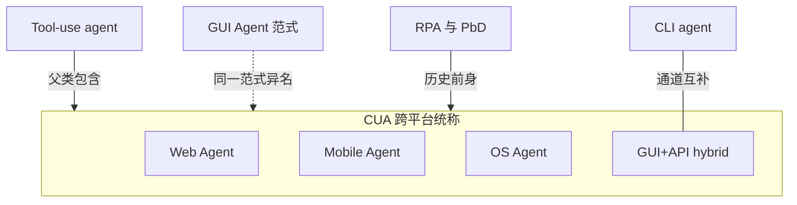
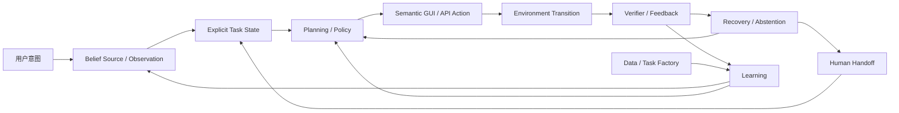
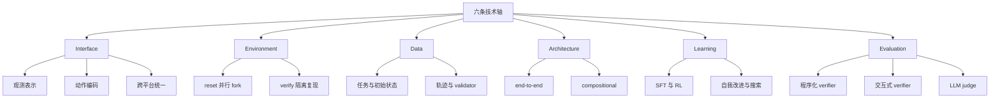
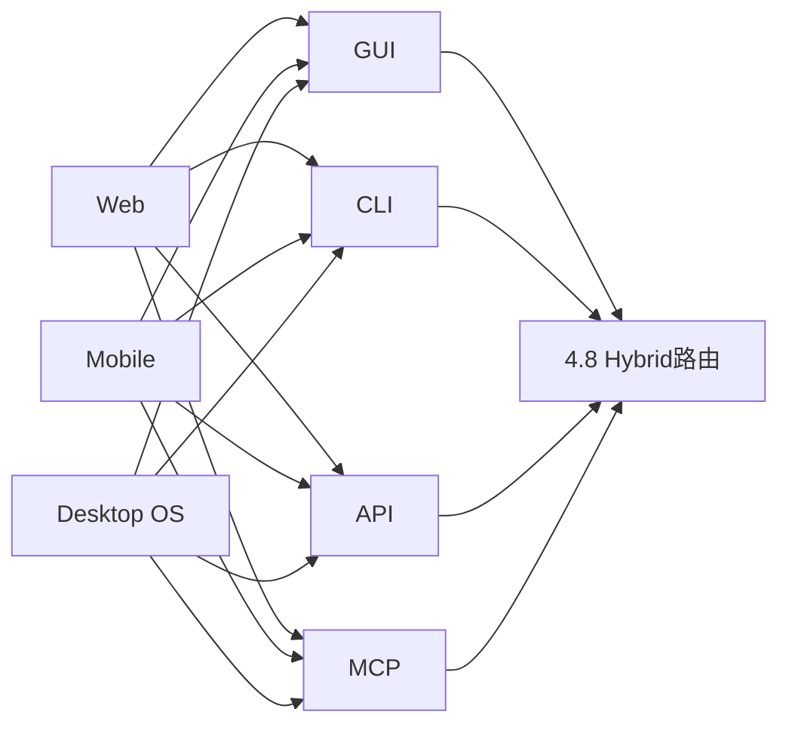
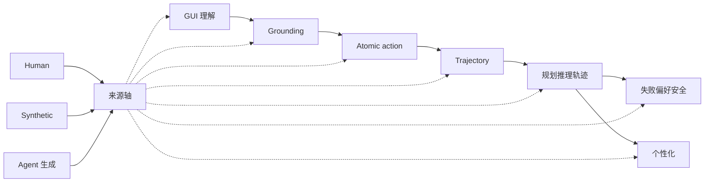
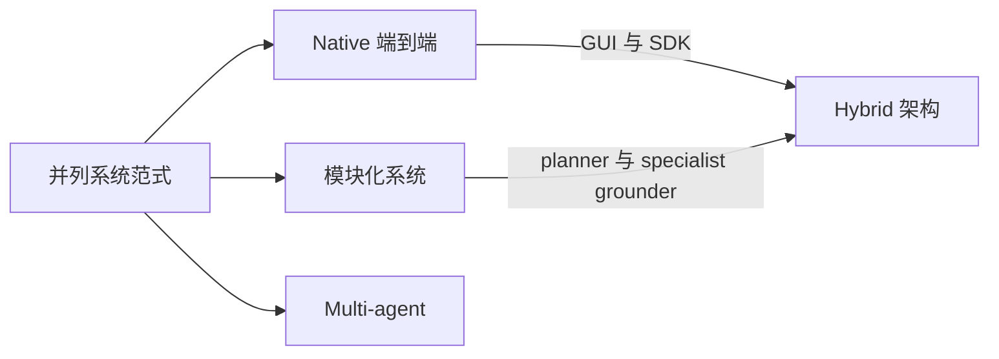
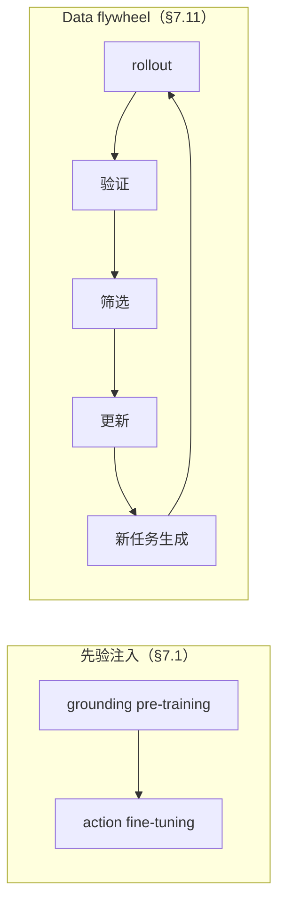
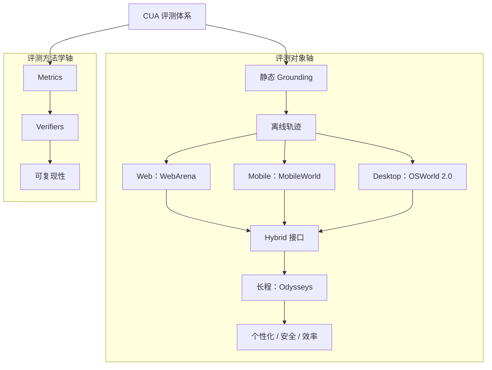
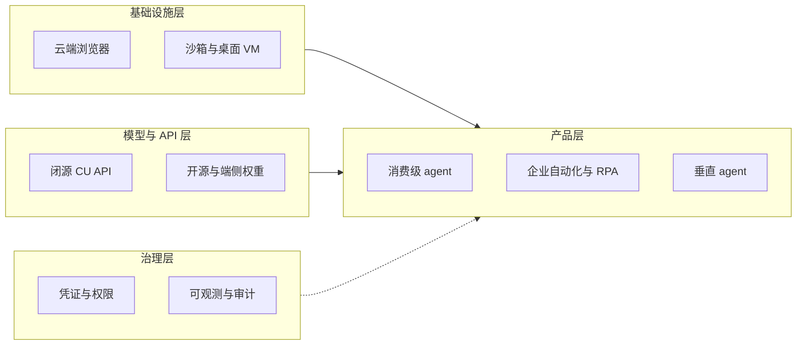
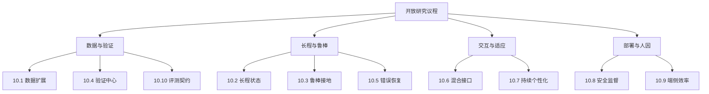

> [!note] 版本说明（2026-07-23）
> 本文在 GUIAgent-Survey 的基础上按 12 节完整 CUA survey 目录重排并补全；原 GUIAgent-Survey 的全部内容已并入本文。

# Computer-Use Agents: A Unified Survey

## 1. Introduction

Computer-Use Agents 以自然语言目标驱动对现有数字界面的连续操作，研究对象是部分可观测环境中的长程状态控制而非孤立的点击预测。领域的中心张力是 benchmark 分数的快速上升与真实长程可靠性之间的落差：局部 grounding、长程执行与真实部署采用不同证据设置，任何一层的改进都不能自动外推为完整 computer-use 能力。发展史由五次系统抽象升级构成——结构化接口、screenshot-native、agent-system 化、闭环学习与可问责系统——每一次都解决旧瓶颈并把新瓶颈推向更长的 horizon 与更严格的验证条件，而现有 survey 的截稿窗口与组织方式恰好错过 environment、Agentic RL、verifier 与 runtime 的最新一轮发展。本文由此提出可证伪的 accountable-state thesis，把来源可追溯、结果可核验、失败可恢复的状态转移作为 CUA 的优化单元，并以十二个研究问题组织从定义到部署的完整链路。

### 1.1 Background and Motivation

Computer-Use Agents（CUA）将自然语言目标转化为对现有数字界面的连续操作，使 agent 能够在缺少专用 API 的网页、移动应用、桌面软件与遗留系统中完成任务。相较于固定 selector 与脚本驱动的 GUI automation，CUA 面向动态界面、开放指令和跨应用工作流，其研究对象不是孤立的点击预测，而是部分可观测环境中的长程状态控制。

现有综述共享两组主要组织轴：平台轴覆盖 Web、Mobile、Desktop 与跨平台系统，组件轴覆盖 observation、grounding、planning、memory、action、execution feedback 与 verifier。Microsoft 的综述以平台 × pipeline 的 cookbook 组织领域，OS Agents 进一步区分环境、观察空间、动作空间以及 understanding、planning、grounding 能力，technology-agnostic 的 ACU survey 则补入 domain、interaction 与 learning 视角 [[Papers/2411-GUIAgentSurvey]] [[Papers/2508-OSAgentsSurvey]] [[Papers/2501-ACUSurvey]]。本综述沿用这一公共坐标，研究范围包括 GUI-only 与 GUI+API/CLI hybrid agent，但排除不直接研究 UI observation、GUI action、computer-use environment、GUI verifier 或部署期监督的通用 Agent、VLM 与 World Model 工作。

在这一公共坐标之上，本文进一步论证：CUA 的优化单元正在从屏幕识别与动作生成，扩展为来源可追溯、结果可核验、失败可恢复的状态转移；environment、runtime、verifier 与 human oversight 因而成为与模型同等重要的系统层。支撑证据集中于 2026 年的新近工作（§1.3 第五阶段与 §11.1），尚缺跨系统因果验证与独立复现。

### 1.2 Research Significance

CUA 的研究意义不由单一 benchmark 分数决定，而来自通用数字接口、序列决策、系统基础设施与人类监督四个层面的耦合。局部 grounding、长程执行和真实部署采用不同证据设置，任何一层的改进都不能自动外推为完整 computer-use 能力。

| 层面 | 核心价值 | 主要研究约束 |
|:--|:--|:--|
| 通用接口 | GUI 是大量 Web、Mobile、Desktop 与遗留软件共同暴露的人机接口 | UI drift、平台碎片化、无稳定 selector 或 API |
| 序列决策 | 将视觉理解、语言目标、规划与动作执行放入同一闭环 | partial observability、误差累积、长程 credit assignment |
| 系统基础设施 | environment、reset、parallel rollout、runtime 与 verifier 决定训练和评测上限 | 状态污染、不可复现、验证器偏差与高 rollout 成本 |
| 人机协作 | agent 会接触账号、文件、通信和不可逆操作 | privacy、prompt injection、权限边界、澄清与人工接管 |

OSWorld 同时展示了success rate 的快速上升与横向比较的脆弱性。下表只列能够在原始论文中定位到具体表格或原文 claim 的锚点；它们不是同一受控实验，不能被解释为单一模型能力的纯时间曲线。

| 时间 | 系统与 OSWorld 设置 | Success Rate | 证据边界 |
|:--|:--|--:|:--|
| 2024-10 | GPT-4o + OS-Atlas-Base-7B | 14.63% | 只替换 grounding 模块；同表 human baseline 为 72.36%，直接说明 grounding 并非全部瓶颈 [[Papers/2410-OSAtlas]] |
| 2025-08 | OpenCUA-72B，OSWorld-Verified，100 steps | 45.0% | 三次运行并由 OSWorld 团队独立评测；属于当时开源系统锚点 [[Papers/2508-OpenCUA]] |
| 2025-10 | BJudge，100 steps | 72.6% | GPT-5 与 Opus 4.5 各生成 5 条 rollout，再由 GPT-5 选优；相对 72.36% human baseline 的 0.24 点差约等于一个任务，不能据此宣称稳定超越人类 [[Papers/2510-ScalingAgents]] |

高分辨率专业软件又暴露出另一种边界：在普通 grounding benchmark 上的能力不能直接迁移到密集工具栏、小图标和多窗口界面，ScreenSpot-Pro 因此把评测从通用页面推进到专业桌面场景 [[Papers/2504-ScreenSpotPro]]。这些结果共同说明，benchmark 分数上升并未消除 setting、cost、verifier 与长程可靠性的差异；对 CUA 能力的任何横向比较都必须同时报告分数与其证据条件。

### 1.3 Development of Computer-Use Agents

CUA 的发展不是模型名称的顺序更替，而是连续五次系统抽象升级。每一阶段解决上一阶段最明显的可扩展性问题，同时把瓶颈推向更长的 horizon、更隐蔽的状态或更严格的验证条件。

| 阶段 | 主导抽象 | 解决的旧问题 | 新暴露的瓶颈 | 代表证据 |
|:--|:--|:--|:--|:--|
| 2017–2023：结构化接口 | DOM/AXTree + element action + self-hosted Web | 将自然语言目标映射为可执行 navigation | 依赖网页结构，难迁移到 canvas、Mobile 与 Desktop | [[Papers/2307-WebArena]] |
| 2023–2024：Screenshot-native | 高分辨率视觉 + coordinate grounding + OS/Mobile benchmark | 绕过不完整或不可用的结构化接口，获得跨平台观察能力 | 局部 grounding 与长程成功脱节 | [[Papers/2312-CogAgent]]、[[Papers/2408-OmniParser]] |
| 2024–2025：Agent-system 化 | grounder、planner、memory、critic 与 tool router | 将 perception、planning 和 execution 分给专用模块 | 模块误差级联、成本上升、状态所有权不清 | [[Papers/2504-AgentS2]] |
| 2025–2026 上半年：闭环学习 | task/state/verifier 共生成 + online RL + environment factory | 让真实交互产生可学习的 reward 与新任务 | task validity、rollout 吞吐、reset 成本与 verifier 偏差成为上限 | [[Papers/2601-EvoCUA]]（task/verifier 工厂 + 大规模并发 sandbox）；[[Papers/2511-DreamGym]] 为用合成经验规避 reset 成本的反向应对 |
| 2026 年 7 月：可问责系统（萌芽） | belief provenance + explicit task state + semantic action + oversight | 将端到端成功拆为可检查的状态转移 | 跨层因果证据、安全边界和人类注意力分配尚未闭合 | [[Papers/2607-GUIStateBelief]]、[[Papers/2607-Tactile]] |

结构化接口首先获得可执行性，却把 agent 绑定在特定平台；screenshot-native 提供通用观察后，错误从元素识别转移到长程状态维护；模块化 agent 为长程任务引入规划与记忆，又产生跨模块误差和隐式状态；闭环学习利用真实 interaction 改进 policy，却要求可重置环境与可信 reward。第五阶段据此把 provenance、task state、verification、recovery 与 oversight 提为一等对象，但其证据主要来自距本文编写时间很近的 preprint，应理解为前瞻性研究假设，而非已经完成的范式转折。

### 1.4 Limitations of Existing Surveys

现有 survey 已建立平台、组件、能力和学习范式的基础 taxonomy，但其截稿时间与组织方式不足以覆盖 2025–2026 年 environment、Agentic RL、verifier、runtime 和可靠部署的快速发展。各 survey 的覆盖范围、可复用价值与局限对照如下。

| Survey | 主要覆盖 | 可复用价值 | 对完整 CUA 综述的局限 |
|:--|:--|:--|:--|
| Large Language Model-Brained GUI Agents [[Papers/2411-GUIAgentSurvey]] | Web/Mobile/Desktop/跨平台；perception、prompt、inference、action、memory、data、model、evaluation | 覆盖面广，提供平台 × pipeline 的 living cookbook | 平台切分使同一方法分散在多章；缺少 setting-aware quantitative meta-analysis；2025 年下半年后的 RL、runtime 与 verifier 进展未被系统吸收 |
| OS Agents [[Papers/2508-OSAgentsSurvey]] | 环境/观察/动作三组件，understanding/planning/grounding 三能力，以及 foundation model、framework、benchmark | component taxonomy 清晰，适合作为 OS Agent 检索入口 | 文献窗口主要反映 2024 年末；RL 覆盖偏轻；表格以 categorical label 为主，缺少 benchmark 数字与 failure-mode 综合；safety defense 和 personalization 较薄 |
| A Comprehensive Survey of Agents for Computer Use [[Papers/2501-ACUSurvey]] | domain、interaction、agent 与 learning 的 technology-agnostic taxonomy | 能把早期 specialized/RL agent 与 foundation agent 放入同一坐标 | 关键证据多为 illustrative cross-paper comparison；缺少统一再评测和定量 meta-analysis；GUI grounding、商业系统及后续 Agentic RL 覆盖不足 |

三类 survey 的共同缺口是：taxonomy 强于机制归因，静态模型与 framework 强于 environment/runtime，任务成功率汇总强于 verifier 可信度，成功案例强于 failure、recovery、abstention 与 human oversight。完整 CUA 综述因而需要把模型、学习、数据、环境、评测和部署放入同一状态转移闭环，并在每项横向比较中显式报告 harness、step budget、backbone、verifier、cost 与数据分布。

此外，[[Papers/2604-RLGUIAgentsSurvey]] 从 RL 视角给出 Offline / Online / Hybrid 三分类学与 reward engineering 三层架构，可作 §7 的外部 taxonomy 参照系；但它自述为 RL×GUI agent 领域首篇综述，与更早的 arXiv:2504.20464 冲突，且本文尚未对其内容做独立核验。

### 1.5 Research Questions

全文由十二个研究问题组织，每个问题映射到对应章节。问题从定义与感知逐步推进到学习基础设施、可靠部署和开放研究议程。

| RQ | 主题（对应章节） | 核心问题 |
|:--|:--|:--|
| RQ1 | Definition and Taxonomy（§2–§3） | CUA 的必要组成、能力边界与平台 × 组件坐标应如何定义？GUI-only、OS Agent 与 GUI+API/CLI hybrid system 如何区分？ |
| RQ2 | Perception and Grounding（§4.5、§6.7） | screenshot、DOM、AXTree、OCR、SoM 与 hybrid observation 在什么条件下有效，又在何种 UI 分布上失效？ |
| RQ3 | Action and Interface（§4.6–§4.8） | coordinate、element、semantic action、code、API 与 MCP 如何统一，动作抽象如何影响可迁移性和安全性？ |
| RQ4 | Model and Agent Architecture（§6.1–§6.6） | native end-to-end model、compositional framework 与 multi-agent system 的性能、成本和误差传播边界是什么？ |
| RQ5 | Planning, Memory and Tool Use（§6.8–§6.9） | planning、search、memory、reflection 与 tool routing 如何维护长程 task state，而不放大陈旧信息和模块误差？ |
| RQ6 | Training and Reinforcement Learning（§7） | pretraining、SFT、offline/online RL、RLVR 与 self-improvement 分别需要什么 reward、headroom 和稳定性条件？ |
| RQ7 | Data, Tasks and Experience（§5） | instruction、initial state、trajectory、failure、validator 与 curriculum 如何生成、过滤和组合？ |
| RQ8 | Environment and Runtime（§4.2–§4.4、§9.6） | reset、snapshot、fork、parallel rollout、isolation 与 reproducibility 如何同时满足 realism、controllability 和 scalability？ |
| RQ9 | Evaluation and Verifier（§8） | grounding、step、trajectory 与 task success 应如何评测？programmatic verifier、LLM judge 与 interactive verifier 的误差边界是什么？ |
| RQ10 | Reliability and Recovery（§6.10、§10.5） | agent 如何检测 false completion、定位失败、选择 recovery、abstain，并恢复到可验证状态？ |
| RQ11 | Safety, Privacy and Human Oversight（§6.11、§8.9、§10.8） | 权限、隐私、prompt injection、不可逆动作、clarification、confirmation 与 human handoff 应如何共同设计？ |
| RQ12 | Deployment and Future Directions（§9–§10） | cost、latency、personalization、continual adaptation 与真实组织工作流如何改变 CUA 的研究目标和开放问题？ |

### 1.6 Contributions

本综述的贡献包括：

- **统一研究对象。** 以平台 × 组件为基础坐标，同时纳入 GUI-only、跨平台与 GUI+API/CLI hybrid system，并给出与相邻 Agent、VLM、World Model 研究的纳排边界。

- **重建因果演进。** 将 CUA 组织为结构化接口、screenshot-native、agent-system、闭环学习与可问责系统五个阶段，解释每次升级解决的问题及其新暴露的瓶颈。

- **执行 setting-aware 证据综合。** 对关键数字同时记录 environment、task split、step budget、backbone、verifier、rollout scaling 与 cost，避免把不可比设置压成单一 leaderboard。

- **贯通模型与基础设施。** 在同一闭环中分析 observation、action、architecture、learning、data、environment、runtime、evaluation、recovery、safety 与 HCI，突出跨层依赖而非孤立模块增益。

- **提出可证伪的 accountable-state thesis。** 将 provenance、explicit task state、semantic action、verification、recovery 与 oversight 视为长程可靠性的候选共同接口，并将其作为有待检验的前瞻性假设；其有效性仍需独立复现和因果实验。

- **形成十二问题研究议程。** 后续章节以十二个 RQ 覆盖从基础定义到真实部署的完整链路，并将缺乏来源、设置不可比和证据冲突保留为显式 gaps，而非转写为确定结论。

十二个研究问题按线性顺序递进：从定义与坐标出发，经感知、动作、模型架构、规划与记忆、训练、数据、环境与评测，逐步推进到可靠性、安全监督与部署及开放问题。

## 2. Scope, Terminology, and Review Methodology

CUA、GUI Agent、Web Agent、Mobile Agent 与 OS Agent 并非互斥范畴，其命名分歧来自研究社区的历史起点与平台边界而非机制分歧，三篇独立撰写的 survey 已各自收敛到平台 × 观察/动作原语这同一组织坐标。真正的定义性边界不在平台之间而在交互通道上：GUI 是否为主要观察与操作通道，把 CUA 与 tool-use agent、CLI/coding agent 和 RPA 区分开，而 GUI 与 CLI 在同一系统内已被证明是互补而非竞争的动作通道。这一定义还需向前回溯：pixels-in / keyboard-mouse-out 的交互范式自 Sikuli 起未变，LLM 补上的是语义理解与规划能力，而非交互通道本身。在此边界之上，纳排判据、双通道检索、verification gate 与论文编码方案共同决定每条证据能支撑多强的结论。

### 2.1 Definition of Computer-Use Agents

Computer-Use Agent（CUA）指以自然语言目标为输入、以人类在 Web / Mobile / Desktop 上实际使用的 GUI（screenshot、DOM/AXTree）为主要观察与操作通道、通过点击/输入/滑动等低级动作序列完成任务的智能体，必要时可辅以 API/CLI 调用，但 GUI 仍是其定义性的交互通道——这一点把 CUA 与"纯文本/纯代码工具调用 agent"区分开（见 §2.3）。

这一定义可用 POMDP 形式统一表达：给定 instruction $i$，agent 每步依据 observation $o_t$ 采样动作 $a_t\sim\pi(\cdot\mid o_t,i)$，并引入两个工程化算子——observation simplification（$o_t\to o_t^*$，如降采样/结构化 screenshot）与 action grounding（$a_t^*\to a_t$，把"点击提交按钮"这类语义动作解析为 `click(x,y)`）[[Papers/2501-ACUSurvey]]。这套形式化把 GUI Agent、Web Agent、Mobile Agent 与 Desktop/OS Agent 统一到同一个 loop 里，彼此的差异只在于 domain（Web/Android/PC）决定的 observation 与 action 具体实现，而非机制分歧（详见 §2.2）。

screenshot-native grounding 常被视为 LLM 时代的产物，但这一范式的起点早于 LLM：[[Papers/0910-Sikuli]]（UIST 2009）已经用 GUI 元素截图同时做检索与鼠标键盘定位，确立了"看像素、按图操作、不依赖 API/坐标"的路线——这正是当前 CUA 的核心交互范式。但 Sikuli 本质是纯外观模板匹配（MSER+SIFT），无语义泛化：它只能匹配确切的截图、无法解析"点击提交按钮"这类语义指令，因而是 visual macro 而非 agent。RPA 与 programming-by-demonstration 是同一时期的另一条工业界路线——录制固定操作序列、按规则重放，同样不具备语义泛化，是 LLM-based agent 目前在产业界正逐步取代的对象（见 §2.3）。LLM/VLM 补上的正是语义理解与 planning 能力，而 pixels-in / keyboard-mouse-out 的底层交互范式自 Sikuli 起未变。把这条 pre-LLM 谱系纳入定义，是为了纠正"视觉操作 GUI 是 LLM 发明"的时序错觉：LLM 改变的是 agent 能否理解与规划，而不是交互通道本身。

### 2.2 CUA vs GUI Agent / Web Agent / Mobile Agent / OS Agent

CUA、GUI Agent、Web Agent、Mobile Agent 与 OS Agent 在文献中并非互斥范畴，而是同一交互范式在不同 platform 边界上的命名分歧——差异主要来自研究社区的历史起点（web navigation/HCI vs. mobile accessibility service vs. desktop OS 自动化）与目标平台的观察-动作原语，而非机制本身的分歧。下表按术语的典型平台范围、历史起点与代表 survey/benchmark 做横向定位：

| 术语 | 典型平台范围 | 历史起点/社区 | 观察-动作原语 | 代表 survey / benchmark |
|:--|:--|:--|:--|:--|
| GUI Agent | Platform-agnostic，强调"看 GUI、做操作"这一范式本身 | LLM agent 社区，随 VLM 兴起（2023 起） | screenshot / DOM+AXTree 皆可，不预设平台 | [[Papers/2400-LargeLanguageModelBrained]] |
| Web Agent | 限定浏览器内 DOM/网页 | Web navigation / IR 社区，早于 LLM 时代已有结构化导航研究 | DOM/AXTree/element-ID 为主，screenshot 为辅 | [[Papers/2307-WebArena]]、[[Papers/2412-BrowserGymAgentLab]] |
| Mobile Agent | Android/iOS | 移动 HCI + accessibility service 社区 | screenshot + accessibility tree + touch/gesture | [[Papers/2605-MobileGym]]、[[Papers/2512-MobileWorld]] |
| Desktop / OS Agent | 完整操作系统（跨应用、文件系统、shell） | 桌面自动化 + OS 研究社区 | screenshot + OS API + files/shell | [[Papers/2409-WindowsAgentArena]]、[[Papers/2508-OSAgentsSurvey]] |
| CUA | Web/Mobile/Desktop 的跨平台统称 | Anthropic 等厂商的产品命名 + ACU 学术综述 | 上述三类原语的并集，platform 由具体系统决定 | [[Papers/2501-ACUSurvey]] |

三篇独立撰写的已发表 survey——[[Papers/2400-LargeLanguageModelBrained|LLM-Brained]]（环境-推理-执行-反馈闭环）、[[Papers/2508-OSAgentsSurvey|OS Agents]]（environment/observation space/action space 三组件 + understanding/planning/grounding 三能力）与 [[Papers/2501-ACUSurvey|ACU]]（domain × observation/action 的 POMDP taxonomy）——各自独立收敛到"平台 × 观察/动作原语"这同一组织坐标，这是跨作者、跨机构的共识性证据，而非单篇 survey 的一家之言，本综述沿用这一坐标作为 §4-§9 的底层分类依据。但三者在"是否把 CLI/API 调用也算进 action space"上并不统一：OS Agents 的 extended operations 与 ACU 的 code action 都承认这类动作存在，却未把它当作与 GUI action 平级的一等公民——这正是 §2.3 要单独厘清的边界。把平台切片与 §2.3 的通道边界放入同一张包含-交叉图：CUA 统摄 Web/Mobile/OS 三类平台切片并内含 GUI+API/CLI hybrid，与 GUI Agent 是同一范式的命名分歧，向上有 tool-use agent 作为更广泛的父类，横向与 CLI agent 构成互补通道，向下承接 RPA 这一历史前身。

### 2.3 Relationship with Tool Agents, CLI Agents, and RPA

Tool-use agent（泛指任意 function-calling/API 调用的 LLM agent）、CLI/terminal/coding agent 与 RPA 三者与 CUA 共享"自主执行多步动作完成任务"这一底层定义，但在**交互通道是否为人类可见的 GUI** 这一维度上与 CUA 分道——这也是本综述划定核心研究对象与邻接证据的关键轴（表见下）：

| 类别 | 交互通道 | 与 CUA 的关系 | 代表工作 |
|:--|:--|:--|:--|
| Tool-use / function-calling agent | 结构化 API schema，无 GUI | 更广泛的父类；CUA 可视为"工具即操作系统本身"的特例 | — |
| CLI / terminal / coding agent | Shell 命令、文件系统、代码执行，无视觉输入 | 与 CUA 平行发展的姊妹范式，动作粒度更粗、无 grounding 问题 | [[Papers/2604-ClaudeCode]]、[[Papers/2607-LongHorizonTerminalBench]] |
| GUI + API/CLI hybrid | 以 GUI 为默认通道，按需路由到 API/CLI | 属于 CUA 内部的一种 action space 设计，非独立范畴 | [[Papers/2508-ComputerRL]]、[[Papers/2606-WeaveBench]] |
| RPA / programming-by-demonstration | 录制的固定 GUI 操作序列，规则重放 | CUA 的历史前身与产业界替代对象，非语义泛化系统 | [[Papers/0910-Sikuli]] |

GUI 与 CLI 并非互斥而是可比较、可路由的两条通道，二者的取舍在同一系统内已有直接实验证据：[[Papers/2508-ComputerRL]] 在 GPT-4o 上做框架消融，纯 GUI 通道 OSWorld 11.2% 提升到 GUI+API 混合通道 26.2%（+134%，Office 域从 6.2%→27.9%），说明相当一部分 desktop 任务的上限来自可用的 API 注入而非算法本身；[[Papers/2605-OpenComputer]] 则在同一 14 应用、343 个 CLI 兼容任务上直接对比两条纯通道——GUI agent 通过率更高（75.2% vs. CLI 67.2%），但 CLI agent 显著更快（141s vs. GUI 的 288–622s），因为绕开了 screenshot-action 循环。这组对照支撑一个具体判断：**GUI 与 CLI 不是竞争关系而是互补的动作通道**，谁更优取决于任务是否需要视觉反馈校验——这正是 [[Papers/2607-Tactile]] 等 semantic action runtime 试图显式建模的路由问题（见 §4.8）。

CLI/coding agent 领域也存在与 CUA 不直接重叠、只作邻接证据的部分：[[Papers/2605-EnvTrustBench]] 把"agent 把观察到的一条 claim 当成证据却不核对当前环境真实状态"的失败模式（evidence-grounding defect）形式化，在 6 个 LLM backbone × 5 个 coding/CLI scaffold 共 14 个 stack、3,850 次受控 run 上测得 83.3% 的聚合 Environmental Misgrounding Rate；但该工作明确将 scope 限定为通用软件/CLI agent（阅读文件、查 API、跑脚本），**非 GUI-specific**，因此本综述只将其作为"belief provenance 缺失是通用 agent 问题而非 GUI 独有"的邻接证据，不纳入核心对象。

### 2.4 Inclusion and Exclusion Criteria

纳入判据是"是否直接研究 UI observation、GUI action、computer-use environment、GUI verifier，或部署期 safety/HCI"；不满足者即便共享模型 backbone 或算法术语也不纳入，只作邻接证据引用。下表把这条边界具体化为可操作的类别判定：

| 判定 | 类别 | 说明 | 边界案例 |
|:--|:--|:--|:--|
| 纳入 | 核心 CUA 研究 | 直接产出 GUI observation/action/environment/verifier 或部署 safety/HCI 证据 | [[Papers/2307-WebArena]] |
| 邻接（不纳入） | 纯 Deep Research / 通用 Agentic RL / 通用 VLM-World Model / Embodied Agent | 不因共享 backbone、RL 算法或"agent"术语纳入 | — |
| 条件纳入 | 通用 LLM/CLI/coding agent | 仅当显式对比 GUI vs. CLI 或构造 GUI+CLI 混合动作空间时纳入 | [[Papers/2605-OpenComputer]] 纳入；[[Papers/2605-EnvTrustBench]]（纯 CLI，无 GUI 交互证据）仅邻接 |
| 硬排除 | 命中 `hard_exclude_keywords`（如 browsecomp） | 无条件排除，不受论文自身 tag 覆盖 | — |

实现上采用"关键词打分 + 硬性覆盖"两层机制：`keywords`（gui-agent / gui grounding / computer-use / computer use agent / cua / web agent / browser agent / mobile agent / desktop agent / os agent）命中加分优先纳入；`exclude_keywords`（deep research / information seeking / browsecomp / research agent / search agent）命中降权；`exclude_tags: [deep-research]` 对打了该 tag 的论文直接降权；但若论文自身带 `exclude_override_tags`（gui-agent / computer-use），即便命中普通 exclude_keyword 也不硬排除——这一层是为了防止"GUI agent 论文里提到一句 information seeking"被误杀；只有 `hard_exclude_keywords`（browsecomp）命中时才无条件排除，不受 override 挽回。

已发表的 [[Papers/2501-ACUSurvey|ACU survey]] 采用了相近但独立制定的边界——明确排除 game-playing、coding agent、software testing 与纯 RPA。这与本综述的边界高度重合，可作外部校准证据，但这是该单篇 survey 自身的选择，不构成跨综述共识。

### 2.5 Literature Search and Selection

检索遵循先审计后补缺的原则：先审计已有论文清单与既有 survey 覆盖度、定位结构性缺口，再针对缺口做定向外部检索，而非对相似主题重复召回。检索沿两条互补通道执行——OpenAlex 主题检索（覆盖期刊/顶会）与通用 web 搜索（覆盖 arXiv 新预印本），并按九类 query 角度分工：核心主题、主流技术路线、既有 survey、benchmark/数据集、应用场景五类"覆盖角度"，加上矛盾检索、负结果检索、邻域检索、术语漂移检索四类"证据完整性角度"；后者即使返回"未发现反例"也要记录，因为"缺矛盾"本身是覆盖信号。

本综述的前身 GUIAgent-Survey 经过多轮检索迭代：2026-07-21 一轮围绕模型/状态、RL、数据、环境/runtime、评测、Safety/HCI 六个主题执行 4 组 arXiv API、5 组 OpenAlex 与 4 组 web 搜索查询，纳入 10 篇新论文；2026-07-22 一轮针对性检索 11 篇已发表 GUI/CUA survey，校准本综述的组织结构与选材标准，同时核对 SOTA/baseline canon 与社区 reviewer 关注点；随后的覆盖度审计确认盲点不在 frontier（已饱和）而在结构性根基——pre-LLM 自动化谱系（RPA/PbD/Sikuli）零覆盖、HCI oversight 仅由 GUI 论文自身支撑、accountable-state 论断主要靠单一时间窗口的 preprint 支撑——据此触发术语漂移（Sikuli/RPA/PbD）、邻域（Horvitz mixed-initiative、Parasuraman automation bias）、矛盾/负结果三类 gap-driven 检索并补入相应论文。截至定稿，纳入并去重后的引用文献共 111 篇，覆盖年份范围 1997–2026（起点由 pre-LLM 谱系论文决定）。

所有候选论文经逐条证据抽取生成 Evidence Ledger 后进入 verification gate：会进入 Overview、benchmark 横向比较、Key Takeaways 或 Open Problems 的高影响 claim，由不同于抽取者的独立 verifier 核对，统一标注为 `source-verified / unsupported / contradicted / not-checkable / abstract-only` 五态之一，只有 `source-verified` 的 claim 可无保留进入关键结论；跨论文横向比较还需核对 environment、verifier、step budget、backbone 与数据集 split 是否可比，不可比时禁止写成横向胜负。

### 2.6 Paper Coding Scheme

每篇纳入综述的论文按两组正交字段编码：一组是内容分类字段，决定它落在新 12 节结构的哪个位置；一组是证据质量字段，决定它能支撑多强的结论。内容分类字段如下：

| 字段 | 允许取值 | 用途 |
|:--|:--|:--|
| `platform` | web / mobile / desktop / cross-platform / hybrid GUI+API/CLI | 对应 §2.2 的平台坐标 |
| `task_level` | grounding / step / app workflow / cross-app long-horizon / interactive-proactive | 能力层级（见 §3.3 能力阶梯） |
| `primary_section` | model-architecture / training-RL / data-task / environment-runtime / evaluation-verifier / reliability-safety-HCI | 论文的唯一主归属章节 |
| `environment_setting` | offline / self-hosted / live / real-device | 决定其 claim 的可迁移性边界 |
| `verifier_type` | programmatic / interactive agent / visual-rubric judge / human / none | 决定其成功率数字的可信度基线 |
| `evidence_strength` | direct end-to-end / component-only / adjacent transferable evidence | 决定它能否支撑核心结论还是仅作旁证 |

每篇论文只允许一个 `primary_section`，最多再向 1–2 个其他章节 cross-link，避免同一证据在多处被重复计为独立支持；与本综述主题明显无关的候选论文（keyword 打分误报）直接跳过，不勉强归入任何字段。证据质量字段有两个：一是内容质量与相关性评分（1–5），二是 Evidence Ledger 的逐条核验状态（`source-checked` / `partial` / `unverified` / `abstract-only`）；后者决定该论文报告的数字能否被写入 survey 正文——核验状态为 `abstract-only` 或未建立 Evidence Ledger 的文献，只能作为论文存在性与主题归类证据，不得凭其新增关键数字、共识判断或 Key Takeaway。

`primary_section` 当前取值沿用前身 GUIAgent-Survey 的六层结构（该结构是本综述 §4–§9 的直接前身）；重排为 12 节结构后，六层取值到新章节编号的映射尚未形式化，是本编码方案的一处已知局限。

## 3. Problem Formulation and Unified Taxonomy

Computer-use 任务在形式上共享同一副数学骨架：agent 无法直接读取数字系统的真实状态，只能在观察、决策、执行与核验的部分可观察序贯决策循环中逼近目标。这一形式化的价值在于，它不依赖任何具体架构就预测了贯穿后续各章的两个结构性瓶颈——belief 维护的可靠性与稀疏延迟奖励下的 credit assignment。把抽象元组展开为可追踪的执行闭环后，“成功”随之显形为复合判断：从 grounding 精度到主动克制的能力阶梯上，每一级都有独立的失效模式与证据要求。在这副骨架之上，interface、environment、architecture、data、learning、evaluation 六条轴构成第 4–8 章的统一坐标系——它们不是六个孤立话题，而是同一执行闭环在不同截面上的投影。

### 3.1 Sequential Decision Formulation

Computer-use agent 的执行过程可以形式化为一个部分可观察序贯决策问题（POMDP）：agent 不能直接读取数字系统的真实状态，只能反复观察、决策、执行并核验，直到任务终止或被判定失败。这不是本文独创的记号——[[Papers/2501-ACUSurvey]]（JAIR 2026，87 篇 ACU agent 的系统综述）与 [[Papers/2412-BrowserGymAgentLab]]（ServiceNow/Mila 的 web agent 研究基础设施）分别从"文献综述"和"系统实现"两条独立路径显式采用了 POMDP 形式化，可视为领域内事实上的通用记号。

标准 POMDP 六元组 $(S, A, O, T, \Omega, R)$ 在 computer-use 场景中的实例化如下：隐藏状态 $s_t \in S$ 是数字环境的真实状态（数据库记录、后端 session、文件系统、通知队列、权限设置），大多不会完整渲染到屏幕上；观测 $o_t$ 是 screenshot、DOM/AXTree、accessibility tree 或 network trace 的组合（[[Papers/2412-BrowserGymAgentLab]] 的 observation space 即包含 task goal、tab 状态、raw screenshot、DOM/AXTree object、唯一 element id、bbox/可见度信息与上一步 action 的 error feedback）；动作 $a_t$ 是 click/tap/type/scroll 等 GUI 动作与 shell/API 调用的组合；指令 $i$ 在整个 episode 内固定，是策略的外生条件变量而非标准元组的一部分——[[Papers/2501-ACUSurvey]] 把这一点显式写成 $a_t \sim \pi(\cdot \mid o_t, i)$；环境转移 $T$ 由浏览器引擎、模拟器或真机执行，往往不可逆；reward/verifier 只在终止步或间歇性地被观察到，构成稀疏反馈。[[Papers/2501-ACUSurvey]] 进一步指出该 taxonomy 刻意做成 technology-agnostic，使 RL-era 的 specialized agent 与当前 foundation-agent-era 的 prompt-based agent 能被放进同一坐标系比较，这也是本节沿用该形式化而非另行提出新记号的原因。

这一形式化直接预测了两个后续章节反复出现的结构性难题，而不依赖任何具体架构：其一，部分可观察意味着 belief 维护本身是一个非平凡且易错的子问题——多数实现把 belief 简化为对原始 history $h_t$ 的隐式拼接（screenshot + 文本 token 直接塞进 context），而非显式维护、可核验的状态对象；其二，稀疏且延迟的终止奖励使跨长程步骤的 credit assignment 天然困难，这正是第 7 章反复讨论的训练稳定性瓶颈的形式化根源。[[Papers/2501-ACUSurvey]] 报告的 offline/online 评测差距（同一 agent 在 Mind2Web 上 offline success 12% vs online success 36%）是第一个难题的一个侧面：静态轨迹匹配无法捕捉 belief 与真实环境状态的分歧，只有让 policy 真正与环境交互才能暴露差距。

第一个难题近期得到了一项更直接的诊断证据：[[Papers/2607-GUIStateBelief]] 用成对单通道干预把"看见了什么"与"最终相信什么"分开测量，发现即使模型 image-only accuracy 高达 0.85–0.93，融合 DOM/AXTree 与 screenshot 时仍有 0.30–0.75 的样本会转向陈旧的结构化文本而非正确的像素证据；在零编辑的真实 stale-web 快照上，不同模型服从过期 structure 的比例达 0.38–0.88；更关键的是，在需要至少两步的 episode 中，仅在第一步注入一次错误的结构化证据，最终失败率就升到 0.97–1.00，自恢复率最高只有 0.03。这是单篇诊断研究的发现，不构成领域共识，但它说明"belief 是 history 的一个可靠函数"这一 POMDP 教科书式假设，在当前系统的朴素实现（无 provenance 的 token 拼接）下并不成立——belief 更新本身就是一个尚未解决的可靠性瓶颈，而非工程细节。这为后续架构章节中"显式 task state / belief provenance"路线提供了第一性原理层面的动机。

上述四元组只刻画了单步的输入—输出关系；真实 computer-use 系统在 $o_t$ 与 $a_t$ 之间插入了更多显式阶段，也包含教材式 POMDP 未直接涵盖的恢复与人类介入路径——这是下一节执行闭环的内容。

### 3.2 The Computer-Use Execution Loop

若把 3.1 的抽象元组展开成一个可追踪的运行时闭环，会得到贯穿本综述模型、学习、数据、环境与评测各章的统一执行图：

前向路径（$I \to O \to S \to P \to A \to E$）把 3.1 中的每个符号具体化为一次工程决策：$I$ 是固定不变的指令 $i$；$O$ 对应观测 $o_t$ 及其简化 $o_t \to o_t^*$（如降采样 screenshot、裁剪 DOM）；$S$ 是本应从 $O$ 与历史中提炼出的显式 belief/task state，而非 3.1 讨论过的隐式 token 拼接；$P$ 是策略 $\pi$ 在给定 $S$ 与 $i$ 下产生的规划；$A$ 是动作 grounding $a_t^* \to a_t$ 之后的可执行 GUI/API 动作；$E$ 是环境转移 $T$。这条链上的每一次翻译都在解决上一步暴露的问题，也都会引入新的误差来源——这正是第 4、5、6 章分别沿 interface、data、architecture 三条轴追踪的具体内容。

返回路径（$V \to R \to P/H$，$H \to S$）说明闭环不是单向的："核验—恢复—人类介入"不是边缘情形，而是与前向路径同级的第一等环节。[[Papers/2604-VeriGUI]] 发现 72.3% 的失败来自重复无效动作导致的 timeout，[[Papers/2604-VLAA-GUI]] 报告失败任务中超过 86% 是 false completion——两者共同说明大量失败不是"不会点"，而是"动作没生效却继续相信自己成功"，即 $V$ 未能正确核验、$R$ 未能触发。当 $R$ 判定当前策略无法自行恢复时，闭环提供 $H$（人类介入）作为退出通道，介入后的信息重新写回 $S$（而非重新走一遍 $O$），使执行可以从被修正过的状态继续，而不是从头重新观察。

外层学习路径（$V \to L$，$D \to L$，$L \to O/P$）把单个 episode 的核验信号与任务工厂产出的数据汇总为可学习信号，再反哺观测与策略——这把"闭环学习正在成为新阶段"的论断（详见第 1 章五阶段叙事）落到图上：verifier 与 data 不再只是评测或训练的旁路输入，而是与执行闭环共享同一组状态与反馈。第 5 章（数据）与第 7 章（学习）分别追踪 $D \to L$ 与 $V/L \to O,P$ 这两条边的具体实现；第 8 章（评测）追踪 $E \to V$ 这条边上 verifier 本身的可靠性。

### 3.3 Core Agent Capabilities

评测一个 computer-use agent 时，"成功"本身是一个复合判断，需要按能力层级拆开，同一分数才不会把低层短板（如 grounding 错误）与高层短板（如不知道该停）混为一谈。本文采用如下能力阶梯组织后续各章对能力的讨论，由低到高依次是：

1. grounding accuracy——能否在给定观测中定位正确元素或坐标；
2. step/action correctness——单步动作是否符合任务语义；
3. task outcome——完整任务是否达成真实的功能性成功；
4. long-horizon / cross-app completion——跨多步、多应用的复合任务是否能持续推进；
5. error awareness 与 recovery——能否发现动作未生效并自行纠正；
6. clarification、abstention 与 proactive restraint——能否在指令不明确或证据不足时主动澄清或停止，而不是盲目执行；
7. privacy、safety 与 side effect——能否避免不可逆或有害的副作用。

这一阶梯并非人为堆叠：每一级都在解决前一级留下的问题，也都暴露出新的失效模式。第 1、2 级大致对应 [[Papers/2501-ACUSurvey]] 独立提出的评测层级划分（step-level 的 step success rate / action F1 / element accuracy，task-level 的 task success rate / progress / avg reward），两者从不同角度收敛到同一个"先看单步、再看整体"的结构，可以视为跨来源的交叉验证。第 3 级向第 4 级的跃迁揭示了一个此前被 end-to-end 分数掩盖的缺口：[[Papers/2607-EvoGUI]] 从 Mind2Web/WebLINX 轨迹构造 3,000 个 diagnostic VQA instance，专测 temporal ordering、inverse action/value prediction 与 successor discrimination，最强模型 EvoGain 也仅 60.4，且 model scale 与 GUI specialization 均不能稳定预测这种 state-dynamics 理解能力——这是单篇诊断研究的发现，说明"任务能做到"与"状态转移能被正确建模"是两件事，任务级高分不能反推 agent 真的理解了长程动态。第 5 级同样有具体证据支持其独立性：现有工作报告 error awareness 与 depth-5 recovery 之间存在明显落差（见后续架构章 verification/recovery 小节），"发现错了"本身并不等于"能改回来"。第 6 级的证据来自两组独立研究：[[Papers/2602-AmbiBench]] 显示非交互 mobile agent 在指令降为 Ambiguous 级时 task success rate 直接归零（AutoGLM 从 Detailed 65.2% 降到 Ambiguous 0%），[[Papers/2606-AgenticAbstention]] 在 WebShop、terminal 与 QA 三类 setting 上测 13 个 agent 系统，发现最强 baseline 的 timely abstention recall 也只有 26.7%，且同一 base model 换 scaffold（Codex CLI 约 0.38 vs Terminus 2 约 0.18）abstention 能力差异巨大——两者共同说明"知道何时不做"是一项独立于任务执行能力、且当前普遍薄弱的能力，而非执行能力足够强后的自然副产品。第 7 级（隐私、安全、副作用）在现有证据中呈现出与第 6 级相近但不完全重合的失效模式（判断风险 vs 精确定位敏感信息 vs 预测动作后果），具体证据与机制留待架构与部署相关章节展开。

评测报告能力层级时必须同时绑定 evidence setting：environment version、step budget、verifier 类型、是否 live/real-device、是否同 backbone 对照。否则 leaderboard 差异可能来自环境、预算或 judge 本身，而非方法真实差距——[[Papers/2501-ACUSurvey]] 的 online/offline 差距（36% vs 12%，见 3.1）就是同一能力层级（task outcome）因 evidence setting 不同而产生数倍级差异的直接例证。这一要求贯穿第 6、8、10 章对具体能力层级的深入讨论。

### 3.4 Environment, Interface, Architecture, Learning, and Evaluation Axes

#### 3.4.1 六轴坐标系与轴间关系

第 4–8 章分别沿 environment、interface、architecture、data 与 learning、evaluation 六条轴追踪各自的历史演进与开放问题，而非按论文发表时间或方法热词分组。Interface 与 Environment 两轴常被混为一谈，但二者回答的问题不同：Interface 定义观测与动作空间本身（屏幕如何表示、动作如何编码），Environment 定义这些空间背后的运行时能否被 reset、并行、fork、核验与复现——模型与 agent 系统（Architecture 轴）是在给定的 Interface 内工作的使用者，而不是 Interface 的设计者。下表把每条轴的核心问题、当前最强证据与主要瓶颈并列，供读者在进入具体章节前建立坐标：

| 轴 | 对应章节 | 核心问题 | 当前最强证据 | 主要瓶颈 |
|:--|:--|:--|:--|:--|
| Interface | 第 4 章 | 屏幕/状态如何表示为观测，动作如何编码，跨平台观测—动作空间如何统一 | 高分辨率视觉、a11y/DOM hybrid observation 与统一 action schema（如 [[Papers/2412-BrowserGymAgentLab]] 的两层 action space：raw code + high-level action mapping）已支撑起跨 benchmark 的可比 harness | 同一 grounding 精度换平台、换分辨率会显著漂移，接口层的"统一"尚未消灭 out-of-distribution 脆弱性 |
| Environment | 第 4 章 | 如何 reset、并行、fork、verify、隔离并复现状态 | self-hosted software、functional simulator、snapshot engine 已形成供给谱系 | realism–controllability–scalability 三者不可同时最大化 |
| Architecture | 第 6 章 | 模型如何在给定接口内定位元素、编码动作；agent 系统如何规划、记忆、调用工具并管理历史状态；native end-to-end 与 compositional framework 如何取舍 | 高分辨率视觉、专用 grounding head 已显著提升局部能力；native end-to-end 与 compositional framework 各有优势场景 | grounding 提升不会自动转化为长程成功；模块化系统有误差级联、状态所有权不清 |
| Data | 第 5 章 | 如何得到可执行任务、初始状态、轨迹与 validator | task/state/verifier co-generation 正在替代单纯轨迹采集 | judge 噪声、只读偏置、环境绑定 |
| Learning | 第 7 章 | 如何用 SFT、RL、self-improvement 与 test-time search 提升 policy | RLVR 在有 headroom 和可靠 reward 时有效 | reward variance、credit assignment、训练稳定性（3.1 已指出其形式化根源） |
| Evaluation | 第 8 章 | 如何确认真实成功、发现错误、恢复并控制风险 | programmatic verifier 与 interactive verifier 明显优于纯 LLM judge | hidden state、false completion、不可逆副作用 |

这六条轴不是彼此独立的六个话题，而是 3.2 执行闭环在不同截面上的投影：Data 轴的产出（$D$）与 Evaluation 轴的产出（$V$）共同喂给 Learning 轴（$L$），Learning 轴的结果又反过来改写 Interface 轴的观测处理与 Architecture 轴的策略——这正是 3.2 图中 $D \to L$、$V \to L$、$L \to O, P$ 三条边的含义，也是本文判断"闭环学习"是当前主导阶段的形式化基础。六条轴及其核心取值可进一步展开为一棵分类树，每条轴下辖各自的关键维度：

#### 3.4.2 平台维度与轴系边界

平台（Web / Mobile / Desktop / Hybrid）是 Environment 与 Interface 两轴的联合实例化：同一套算法在不同平台上因可用结构与主要难点不同而获得不同强度的证据支持：

| 平台 | 可利用的结构 | 主要难点 | 代表 setting |
|:--|:--|:--|:--|
| Web | DOM / AXTree / screenshot / network state | live drift、bot detection、transactional state、prompt injection | WebArena、VisualWebArena、Online-Mind2Web |
| Mobile | screenshot / accessibility / emulator state / real device | 小目标、系统弹窗、账号与权限状态、真机漂移 | AndroidWorld、AndroidLab、RealMobile |
| Desktop | screenshot / OS API / files / shell / app state | 跨应用、长程专业 workflow、隐私与不可逆操作 | OSWorld、WindowsWorld、SaaSBench |
| Hybrid | GUI + API / CLI / SDK | 工具路由、语义对齐、权限边界 | [[Papers/2508-ComputerRL]]、[[Papers/2606-WeaveBench]] |

第 9 章（产业与部署）与第 10 章（开放问题）不构成第七、八条独立技术轴，而是把上述六轴的结论分别投射到真实产品化约束（成本、延迟、凭证与权限管理）与尚未解决的研究问题上。

## 4. Tasks, Environments, and Interaction Interfaces
Computer-use agent 的任务难度不由单一 benchmark 分数刻画，而是由能力层级、运行平台与任务结构共同决定。Web、Mobile 与 Desktop/OS 环境在 realism、controllability 和 scalability 之间采取不同取舍，也因此暴露出不同的状态、验证与复现边界。Observation 与 action interface 从单一像素或结构通道走向 GUI、CLI、API 与 MCP 的混合组合，但通道增多同时放大了证据冲突、权限与副作用风险。Trainer-facing 的 reset、并行和 verifier 已相对成熟，而跨平台的 agent-facing runtime 与 Hybrid action routing 仍缺统一、受控的因果证据。

### 4.1 Task Taxonomy

现有 GUI/CUA benchmark 各自定义任务分类，尚无共享的报告卡；但把它们放在一起看，任务复杂度沿三条基本独立的轴展开——**能力层级**（完成任务需要哪种能力）、**平台**（可利用的结构与主要难点）、**结构形状**（步数、跨应用范围、是否只读、指令是否完整）。早期 benchmark 把这三轴都锁定在最简单的一点：单页面、单步、完全指定指令；后续工作分别沿单一轴推高难度，而不是提出一个笼统的"更难"，这也是为什么跨 benchmark 的分数不能直接横向比较（另见 §6、§8）。

#### 4.1.1 能力层级

能力层级本身构成一条从局部到系统性的梯度：

| 层级 | 要求的能力 |
|:--|:--|
| 1. Grounding accuracy | 定位单个元素 |
| 2. Step/action correctness | 单步动作是否符合意图 |
| 3. Task outcome | 端到端功能是否达成 |
| 4. Long-horizon / cross-app completion | 多步骤、跨应用组合 |
| 5. Error awareness 与 recovery | 察觉动作未生效并纠正 |
| 6. Clarification、abstention 与 proactive restraint | 指令不完整时主动澄清或拒绝 |
| 7. Privacy、safety 与 side effect | 后果预测与不可逆操作规避 |

这一梯度在 §6.1 被用作评测报告必须绑定的强制维度；这里仅作为任务复杂度的组织坐标。

#### 4.1.2 平台边界

平台是第二条轴，决定了同一算法证据强度的来源与边界：

| 平台 | 可利用的结构 | 主要难点 | 代表 setting |
|:--|:--|:--|:--|
| Web | DOM / AXTree / screenshot / network state | live drift、bot detection、transactional state、prompt injection | WebArena、VisualWebArena、Online-Mind2Web |
| Mobile | screenshot / accessibility / emulator state / real device | 小目标、系统弹窗、账号与权限状态、真机漂移 | AndroidWorld、AndroidLab、RealMobile |
| Desktop | screenshot / OS API / files / shell / app state | 跨应用、长程专业 workflow、隐私与不可逆操作 | OSWorld、WindowsWorld、SaaSBench |
| Hybrid | GUI + API / CLI / SDK | 工具路由、语义对齐、权限边界 | [[Papers/2508-ComputerRL]]、[[Papers/2606-WeaveBench]] |

#### 4.1.3 任务结构形状

第三条轴是任务的结构形状，它把"更难"拆成四对可分别度量的二元维度。**单步/长程**上，[[Papers/2604-WindowsWorld]] 在同一套系统内把 single-app 任务的 46% 压到 cross-app 任务的 14%；[[Papers/2605-SaaSBench]] 的专业跨系统工作流把最强模型压到 3.8% resolved（vs 43.9% checkpoint），说明"部分推进"与"完整闭环"之间存在巨大落差，checkpoint 式打分不能代替端到端判定。**单应用/跨应用**是这条轴在数据侧的具体化：[[Papers/2400-GuiodysseyComprehensiveDatasetCross|GUIOdyssey]] 用 8,334 个 episode、212 个 app、1,357 种 app 组合定义了 mobile 上的跨应用导航任务集合，平均 15.3 步，明确区别于单页面操作数据。**只读/事务性**上，[[Papers/2502-InSTA]] 因禁止状态修改而系统性偏向信息检索任务，学不到下单、提交表单这类 transactional 操作——这恰是最难也最有价值的部分；WorkArena++ 的组合型长程任务把成功率进一步压低，显示同一分类内部"组合"本身就是独立的难度来源，不是长度的线性函数。**完整指令/模糊指令**是最新加入的一轴：[[Papers/2512-MobileWorld]] 把 22.4%（45/201）的任务设计成刻意省略关键信息的 Agent-User-Interaction 类型，逼迫 agent 主动澄清而非幻觉补全；同类信号也出现在 AmbiBench 的四级模糊度设计中（非交互 agent 在最模糊设置下 TSR 为 0，见 §7.3）。

| 结构维度 | 对比 | 代表数字 |
|:--|:--|:--|
| 单步 / 长程 | single-app vs cross-app | [[Papers/2604-WindowsWorld]] 46% vs 14% |
| 原子 / 组合 | atomic vs compositional | WorkArena++ 组合长程任务拉低 SR |
| 只读 / 事务性 | informational vs transactional | [[Papers/2502-InSTA]] 系统性偏只读 |
| 完整指令 / 模糊指令 | fully-specified vs ambiguous | [[Papers/2512-MobileWorld]] Agent-User-Interaction 占 22.4%；AmbiBench 非交互 TSR 0% |

### 4.2 Web Environments

GUI 环境供给可用统一的六轴能力规格描述，Web 是该谱系下最先成熟、也最先分化的平台。

#### 4.2.1 环境能力框架

环境研究的角色经历了三步变化，这条线索贯穿 Web、Mobile、Desktop 三个平台，本节先给出统一框架，4.2–4.4 再分平台报告供给谱系。第一代环境是 benchmark container，负责初始化、执行动作与终态评分；第二代环境成为 trainer-facing infrastructure，把 reset、parallel rollout、snapshot/fork 和 programmatic reward 纳入 RL 系统；第三步开始向 agent 暴露 semantic target、action affordance、verification cue 与 provenance，形成 agent-facing runtime——这一步目前只有零星证据（见 4.4）。Trainer-facing 的并行、reset 和 deterministic judge 已相对成熟，真正早期的是 agent-facing runtime：它是否能在不泄漏 gold answer 的前提下，把软件状态变成模型可利用、可核验、可回滚的执行接口，仍缺 frozen-policy 因果实验。

GUI 环境同时追求 realism、controllability 与 scalability，但三者存在结构性冲突，现有供给形态实际上是同一三角约束下的不同取舍。Live / real-device 把 realism 推到最高，代价是难以 reset、并行、复现和安全探索，等于让渡了 controllability 与 scalability 的大部分；self-hosted real software 居中，可控且有真实功能，但站点/应用覆盖有限、维护成本高，scalability 成为它让渡的轴；functional simulator / synthetic environment 走向另一端，易 scale、易 fork，却可能丢失真实后端、异常态和视觉分布，把损失集中在 realism 一侧。三者没有绝对优劣，只是把冲突转移到不同的轴上；因此环境工作应按能力规格比较，而不是只按"真实/合成"二分。

六轴构成环境的能力规格语言：任何环境都应沿这六条轴声明自己提供什么、缺什么。训练与评测对每轴的需求并不相同——训练侧优先 rollout throughput 与稳定 reward 信号，评测侧优先可复现与防污染——同一环境因此可能胜任训练供给而不胜任评测，反之亦然。

| 轴 | 最低能力 | 训练价值 | 评测价值 | 典型失败 |
|:--|:--|:--|:--|:--|
| Init / Reset | 可编程初始状态、episode 级清理 | 课程生成、重复采样 | 可复现与难度控制 | 状态污染、手工 reset |
| Verify / Reward | 可查询的 outcome / progress / side effect | RL reward、数据过滤 | functional correctness | LLM judge 假阳性、rule 漏判 |
| Parallelism | 独立实例、资源隔离、异步调度 | 提升 rollout throughput | 多配置可比 | browser 泄漏、慢样本拖全组 |
| Fork / Rollback | checkpoint、clone、branch、replay | tree rollout、counterfactual data | 重试与失败定位 | 只能 URL 回退，后端状态丢失 |
| Task Supply | task + state + validator 同步生成 | policy-aware curriculum | 覆盖与难度审计 | 不可执行任务、只读偏置 |
| Determinism / Isolation | 固定版本、时间、网络与账号边界 | 稳定训练信号 | 可复现与防污染 | live drift、跨 episode 泄露 |

#### 4.2.2 Web 供给谱系

在这套框架下，Web 是供给谱系最先成熟、也最先分化的平台：

| 环境/系统 | 类型 | 关键能力 | 已知边界 |
|:--|:--|:--|:--|
| [[Papers/2307-WebArena]] | self-hosted real software | functional correctness、可复现任务 | 站点少，RL reset/并行成本高 |
| [[Papers/2412-BrowserGymAgentLab]] | unified web gym | screenshot/DOM/AXTree/SoM 与统一 action API | 统一接口不等于 agent-friendly state access |
| [[Papers/2510-WebServ]] | snapshot engine | 1.78s clone、28 MiB/instance、200+ 并发、运行中 fork | 尚无端到端 GUI RL 因果实验 |
| [[Papers/2509-AgentGymRL]] | multi-environment RL stack | full reset、并行 Chromium、horizon curriculum | 环境改造成本转移到框架维护 |
| [[Papers/2606-OpenWebRL]] | live RL stack | K8s isolation、retry、failure taxonomy、80–100 并发 | 51% 失败仍来自 bot detection/封锁/网络 |
| [[Papers/2502-InSTA]] | live task proposal | 150K sites、2.2M trajectories、\$521；judge 82.6% | 任务偏只读，init/reset/事务性缺失 |
| [[Papers/2506-GoBrowse]] | structured exploration | 界面建图，reset 频率调节覆盖（1 reset/30 任务→183 URL vs 15 reset/2 任务→260 URL） | reset 依赖共享沙盒，两个 affordance 目前只在训练管线里用 |
| [[Papers/2600-WebHarbor]] | self-hosted mirror | coding agent 生成 15 个 WebVoyager 网站的 Docker 镜像，sub-second reset，模型排序与 3 个 live-web benchmark 一致 | task-driven scoping 只覆盖任务所需功能，非完整站点；验证仍偏初步 |
| [[Papers/2504-REAL]] | deterministic web replica | 112 tasks / 11 sites，localStorage state diff + rubric | 副本覆盖有限，非动态站点 |

环境供给谱系呈现出清晰的成熟度梯度。Trainer-facing 能力已相对成熟：[[Papers/2510-WebServ]] 把 fork 成本压到 1.78s clone、28 MiB/instance 并支撑 200+ 并发，reset 与并行已不再是主要瓶颈。Live 供给的主要损耗依旧发生在环境本体之外：[[Papers/2606-OpenWebRL]] 的 51% 失败仍来自 bot detection/封锁/网络，说明 realism 一侧的缺口主要是漂移与对抗，而非接口设计。[[Papers/2502-InSTA]]、[[Papers/2600-WebHarbor]]、[[Papers/2504-REAL]] 代表同一"live↔mirror"权衡的三个不同取舍点——InSTA 用真实站点换规模、放弃 init/reset/事务性；WebHarbor 与 REAL 用本地镜像换可控与可复现，代价是只覆盖任务定义所需的功能面而非完整站点。[[Papers/2506-GoBrowse]] 则把 reset 成本直接变成显式的数据质量旋钮：reset 越勤，覆盖越广，但对共享沙盒的污染风险也越高。

### 4.3 Mobile Environments

Mobile 没有 Web 式的单一 reset-cheap backend，覆盖需要同时组合 functional simulator、mock app、sandbox 与真机，这使得 mobile 供给谱系天生是混合形态而非单一路线的迭代。

| 环境/系统 | 类型 | 关键能力 | 已知边界 |
|:--|:--|:--|:--|
| [[Papers/2605-MobileGym]] | functional mobile simulator | JSON state fork、deterministic judge、95.1% sim-to-real gain retention | agent-facing 仍以 screenshot + primitive action 为主 |
| [[Papers/2607-HyMobileAgent]] | mock + sandbox + real-device mixture | 2,000+ 实例；PhoneWorld 34 apps / 34,242 tasks | AndroidWorld 82.6% 到私有真机 42.0%；高风险状态被过滤 |
| [[Papers/2512-MobileWorld]] | 开源应用替身 + agent-user interaction / MCP-augmented | 201 tasks / 20 apps，直连 PostgreSQL 后端做 deterministic 验证 | 子类样本偏薄（MCP 40、User-Interaction 45）；开源替身 UI 不等于真实商业 app 分布 |
| [[Papers/2500-A3AndroidAgentArena]] | live dynamic online app | "essential-state"程序化评估，100 tasks / 20 apps | 依赖 MLLM 作 reward model；动态在线应用维护成本高 |

[[Papers/2605-MobileGym]] 用可 fork 的 JSON state 与确定性 judge 把 mobile 环境的可复现性做到接近 web 的水平，但它面向 agent 暴露的接口仍是 screenshot + primitive action，没有把内部状态变成可核验的执行接口。[[Papers/2607-HyMobileAgent]] 是目前唯一同时覆盖 mock app、sandbox 与真机三层的供给方案，规模到 2,000+ 实例，但 AndroidWorld 82.6% 到私有真机骤降至 42.0% 说明 sim-to-real 缺口尚未被这套组合真正弥合，且高风险状态被主动过滤而非解决。[[Papers/2512-MobileWorld]] 走另一条路径：不用真实商业 app（不可控、不可复现），而是部署工业标准的开源替代品（如 Mattermost 替 Slack），换取可直连数据库的确定性验证，并首创 agent-user interaction 与 MCP-augmented 两类任务，把动作空间从纯 GUI 扩展到"发起用户交互"与"MCP 调用"。[[Papers/2500-A3AndroidAgentArena]] 则直接在真实在线 app 上运行，用"基本状态"程序化评估应对静态评估无法捕捉动态状态变化、连锁失败与替代路径的问题，但代价是评估准确性系于 MLLM reward model 本身的可靠性。

### 4.4 Desktop and OS Environments

Desktop 供给最先在大规模 VM 并行与可验证状态上成熟，随后沿跨应用组合、专业工作流、个性化上下文与更长 horizon 四个方向分化出专门挑战。

| 环境/系统 | 类型 | 关键能力 | 已知边界 |
|:--|:--|:--|:--|
| [[Papers/2508-ComputerRL]] | RL 训练基建 | 千级并行 Ubuntu VM（qemu-in-docker + gRPC）+ API-GUI 混合动作 | 环境改造针对特定 app 集合构建，跨 OS 未验证 |
| [[Papers/2607-SCALECUA]] | desktop RL/task factory | 100+ task workers、600 并发 VM、capability-frontier rollout | 50-turn cap、Ubuntu-only；抽样 task validity 仍需人工 audit |
| [[Papers/2605-OpenComputer]] | verifiable software world | app-specific 程序化 verifier，33 apps / 1,000 tasks，94.1% 人类对齐（LLM judge 仅 79.2%） | 高质量 verifier 依赖可观测内部状态 |
| [[Papers/2604-Crab]] | sandbox runtime | agent-facing rollback；步数 −29%，branch token −40–64% | 仅 shell/FS/process，不是 GUI 全栈先例 |
| [[Papers/2604-WindowsWorld]] | cross-app long-horizon | single-app 46% vs cross-app 14% | 181 tasks / 16 personas，样本偏小 |
| [[Papers/2605-SaaSBench]] | professional SaaS workflow | 23 个可本地部署开源 SaaS 系统，106 tasks | resolved 3.8% vs checkpoint 43.9%，partial 打分掩盖端到端失败 |
| [[Papers/2606-MyPCBench]] | personalized long-horizon desktop | 17 个模拟 web app + 184 个源自真实社区请求的任务，预登录账号与历史数据 | Claude Opus 4.6 fully-solved 仅 55.4%，失败集中在 long-horizon/multi-app |
| [[Papers/2606-OSWorld2]] | checkpointed long-horizon | 108 tasks / 31 sites | binary 20.6% / partial 54.8%，分差反映"过程正确但终态未达成" |

环境内部有 state、snapshot 和 verifier，不代表 agent 能利用它们。两者应明确区分：**Trainer-facing** 指 rollout scheduler、reset、parallel、ground-truth reward、hidden validator；**Agent-facing** 指 task-agnostic 的 `observe()`、`ground()`、`act()`、`feedback()`、`checkpoint()`、`rollback()` 等能力，它不能泄露 gold action 或直接给出 task success。Trainer-facing 一侧已相对成熟：[[Papers/2607-SCALECUA]] 已能调度 600 并发 VM，[[Papers/2605-OpenComputer]] 的 app-specific verifier 做到 94.1% 人类对齐。相比之下 agent-facing runtime 刚起步：[[Papers/2604-Crab]] 的 agent-facing rollback 仅覆盖 shell/FS/process。[[Papers/2607-Tactile]] 把 accessibility semantics、OCR text 与 visual fallback 编译成带 source label、geometry、affordance 和 verification cue 的 action object，使 runtime 从"鼠标驱动"变成 `observe–ground–act–verify` contract，在 macOSWorld-style tasks 上把 Codex Success@100 从 41.1% 提到 50.0%；但 AX-adapted 提升 10.04 个百分点，Limited-AX 只有 5.55 个百分点，canvas、remote desktop 与 stale metadata 仍会退回坐标歧义，说明 semantic action 的上限受环境结构质量约束，还不是 browser/mobile/desktop 全栈先例。

### 4.5 Observation Spaces

环境向 agent 暴露的 observation 有三种基本形态，对应一条清晰的发展线。最早的 web 环境依赖结构化输出——DOM / AXTree / element ID token-efficient 且便于精确操作，先解决了把自然语言目标转成可执行 navigation 的问题；但这一表示对 canvas、远程桌面和跨平台迁移脆弱，随着研究对象从 self-hosted web 扩展到 mobile 与 desktop，screenshot-only 取而代之成为通用路线：它与人类可见状态一致，跨平台性最强，代价是小目标、密集布局和动态页面使 grounding 成为显式瓶颈。工程实践因此收敛到 hybrid observation：screenshot + DOM/AXTree + bbox/SoM 兼顾语义和视觉，是工程上的主流折中。这条谱系的 pre-LLM 根基比通常认为的更早：[[Papers/0910-Sikuli]]（UIST 2009）已用 GUI 元素截图同时做检索与鼠标键盘定位，确立"看像素、按图操作、不依赖 API/坐标"路线，只是它是纯外观模板匹配、无语义泛化。[[Papers/2312-CogAgent]] 用 dual-resolution 视觉架构证明高分辨率 screenshot-only 输入可以超过 HTML-based 大模型；[[Papers/2408-OmniParser]] 代表把 detector、OCR 与 icon caption 组合成可插拔 perception layer 的路线。

hybrid observation 并非没有代价：多通道叠加暴露了新问题——若没有 provenance、freshness 与一致性检查，更多通道会把 stale structure 变成更强的错误证据。[[Papers/2607-GUIStateBelief]] 用 735 个跨 Web、Mobile、Desktop 的 paired probes 证明这一点：模型在 image-only 读取接近饱和时，仍会在冲突下跟随 stale structure，真实网页中的结构跟随率最高达 0.88；在最多六步的 MiniWoB++ click-style episodes 中，首步冲突导致 structure-following error 后，self-recovery 不超过 0.03。这一发现改变了"通道更多、因而更可靠"的默认判断——环境暴露多少种 observation 通道，不等于模型能安全地整合它们。

与视觉/结构侧的表示重构平行，web agent 有一条独立成型的 **observation reduction** 线，针对 raw DOM/HTML 常达 10k–100k token 的问题优化喂给 agent 的观察。四条路线已固化：程序化剪枝（[[Papers/2511-Prune4Web]]，候选削减 25–50×，low-level grounding 46.8→88.28）、LLM 选行检索（[[Papers/2510-FocusAgent]]，削减 >50%）、规则式结构重构（[[Papers/2605-A11yCompressor]]，OSWorld input token 压到约 22% 的同时 success +5.1pp）、与"缩短"正交的表示对齐（[[Papers/2410-AgentOccam]]）。这条线最有价值的产出是三个跨论文的校正性发现：其一，**优化 ≠ 省 token**——AgentOccam 每步观察 token 反而从 vanilla 的 2210 升到 2930，真正起作用的机制是"对齐 LLM 预训练分布 + 降噪"而非缩短长度；其二，**压缩并非普遍有益、且高度依赖底座**——[[Papers/2604-ReadMoreThinkMore]] 显示强模型（gpt-5.1、claude-sonnet-4-6）用完整 HTML 反而 +14.6~17.5pp、弱开源模型用 HTML 大幅退化（gpt-oss-20b −18.8pp）；其三，**收益随模型变强而蒸发**——Prune4Web 对 GPT-4o 零提升、FocusAgent 在 WebArena 反低于全观察（32.3 vs 36.5）。该子领域已成熟到自建廉价评测代理（[[Papers/2605-MFSCoverage]]），侧面印证方法层面接近饱和。

局部 grounding 与结构压缩之外，还有一条正交的推理期效率线——当 observation 与历史轨迹撑大 context 时如何在不掉精度下压缩存储。[[Papers/2606-StarKV]] 用 spatial mutual-information prior 替代通用 KV cache 压缩的单一 saliency 先验，在 40% 预算下与 full cache 持平；[[Papers/2601-CompressToFocus]] 把压缩折进多轮 RL，GUI-Odyssey 长程 SR +21.4pp；[[Papers/2603-STLiteKV]] 更具实质性的贡献是诊断——GUI 注意力在所有层都均匀高稀疏，导致分层预算先验（PyramidKV/VL-Cache）在低预算下崩溃。这条线与前述 belief-source 讨论正交：它按 attention/redundancy 启发式决定留哪些 token，而非按证据来源或新鲜度决定，裁剩的 token 不保证仍反映当前 UI state。

### 4.6 GUI Action Spaces

动作表示的发展线是从裸坐标走向携带更多语义与验证信息的动作对象：coordinate action 以平台无关、与 screenshot 对齐为起点，element-ID 与 structured GUI action 换取精确与易验证，semantic action object 进一步把 target、affordance、provenance 与 verification cue 一体化。贯穿这条线的核心分歧是平台无关性与可验证性的取舍——越依赖像素越可跨平台，越依赖结构越可核验、也越受 DOM/AXTree 可用性约束。

| 表示 | 优点 | 主要失败模式 | 代表工作 |
|:--|:--|:--|:--|
| Coordinate action | 平台无关、与 screenshot 对齐 | 分辨率变化、细小目标、坐标文本生成错位 | [[Papers/2400-SeeclickHarnessingGuiGrounding]] |
| Region / action head | 直接在 visual patch 上预测可交互区域，避免文本坐标生成 | patch 粒度限制；需要额外 head / verifier | [[Papers/2500-GuiActorCoordinateFree]] |
| Relative tool token | 离散相对移动可跨分辨率并形成 coarse-to-fine path | 多步定位增加 latency，online 长程收益未验证 | [[Papers/2602-ToolTok]] |
| Element-ID action | 精确、token-efficient、易验证 | 依赖 DOM/AXTree 与 stable ID | [[Papers/2307-WebArena]]、[[Papers/2412-BrowserGymAgentLab]] |
| Structured GUI action | click/type/scroll/drag 语义清晰 | 长尾交互 modality 覆盖不足 | [[Papers/2605-CUActSpot]] |
| Semantic action object | target、affordance、provenance、verification cue 一体化 | 依赖可用 AX/OCR；canvas 与 remote desktop 会退回视觉歧义 | [[Papers/2607-Tactile]]（详见 §4.4） |

统一 Agent 不等于统一动作 token。跨平台模型必须保留 platform convention 或显式路由，否则 mixed-SFT 会让 desktop/mobile 的交互规则相互污染；[[Papers/2607-UIMOPD]] 的 platform-conditioned distillation 就是在解决这一冲突——desktop teacher 与 mobile teacher 各自 SFT 后，再按 rollout 来自哪个平台施加对应的 on-policy 蒸馏监督，在 OSWorld / MobileWorld 上分别达 38.2% / 12.0%。长尾交互 modality 仍是这条线最薄弱的一环：[[Papers/2605-CUActSpot]] 的 206 eval + 50M synthetic 长尾 action grounding 数据上，最强的 Phi-Ground-Any-4B 也只有 44.4%；单篇工作 [[Papers/2601-SwipeGen- Bridging the Execution Gap in GUI Agents via Human-like Swipe Synthesis|SwipeGen]] 把 swipe 手势分解为多个可量化维度、自动合成 human-like swipe 数据，其 GUISwiper 达到 69.07% 的 swipe 执行准确率（较已有 VLM baseline +214%），指出当前 GUI action 覆盖的另一个缺口是执行层面的手势精细度，而非仅是定位精度。

### 4.7 CLI, Code, API, and MCP Actions

GUI 之外的 API、CLI/Code 与 MCP 通道以更高的工具选择、权限与副作用管理复杂度换取执行效率。

#### 4.7.1 动作通道分类

GUI 之外，computer-use agent 可用的动作通道还包括应用内建/自动构建的 API、CLI/Code 脚本以及通过 Model Context Protocol（MCP）调用的外部工具。这些通道的共同动机是绕开重复低效的界面操作，代价是工具选择、权限与副作用管理更复杂。

| 通道 | 暴露的能力 | 优点 | 已知边界 | 代表工作 |
|:--|:--|:--|:--|:--|
| API（应用内建/自动构建） | 直接调用应用功能，跳过 UI 渲染 | 一步替代多步点击，减少 grounding 错误累积 | 需工程化构建 workflow API，覆盖仅限已建功能 | [[Papers/2508-ComputerRL]] |
| CLI / Code | 脚本化操作文件系统、配置、后台进程 | 精确、可复现、天然可验证 | 无法触达纯视觉/渲染层交互；依赖沙盒权限 | [[Papers/2606-WeaveBench]] |
| MCP（外部工具协议） | 标准化调用第三方服务/数据源 | 复用既有工具生态，无需重建 API | 返回内容体量大，易撑爆 context window | [[Papers/2512-MobileWorld]] |
| GUI（兜底通道） | 处理必须可视化交互的前端操作 | 通用、无需应用专属集成 | 慢、脆弱、误差随步数累积 | 见 §4.6 |

#### 4.7.2 混合通道证据

混合通道的现有证据共同表明，效率收益与 context、权限和验证成本同时上升。

[[Papers/2508-ComputerRL]] 把 API 通道系统化为工程流程：为应用自动构建 workflow API（103 个 API，覆盖 Code/Chrome/LibreOffice 三件套/VLC 共 6 类应用），在 system prompt 里同时暴露 API 函数和 10 个 GUI 原语，让 agent 自行选择；GPT-4o 上的框架消融显示纯 GUI 11.2% 到 API+GUI 26.2%（+134%），Office 域从 6.2% 升到 27.9%，说明相当一部分收益来自工程化的 API 注入而非策略本身。[[Papers/2606-WeaveBench]] 则从 benchmark 侧证实了单一通道的系统性不足：114 个覆盖 8 个真实工作领域的长 horizon 任务上，GUI-only 与 CLI-only 两种单通道设置全面崩溃（GUI-only ≤1.8%，CLI-only ≤3.5%），同一 interface ablation 下 Hybrid 升到 35.1%（Claude Opus 4.7，Δ+31.6）；全局最高 41.2% PassRate 来自另一 runtime 组合（Claude Code），与前两者非同一实验轴。最佳 rollout 中位数 76 次工具调用、16 次 GUI↔CLI 通道切换；trajectory-aware judge 相比 outcome-only grading 系统性拉低 10–20 个百分点，失败分析显示 35.2% 的失败源于 reward hacking 而非能力不足。MCP 作为最新一类通道，本综述覆盖的文献中证据仍然稀薄：[[Papers/2512-MobileWorld]] 首创的 MCP-Augmented 任务类别（40/201，19.9%）显示混合工具调用与 GUI 操作是真实 mobile 使用中被现有 benchmark 忽略的能力维度，最优框架在该类别达 51.6% SR，但最主要的失败模式是 context overflow——MCP 工具返回内容过大，直接撑爆 agent 的 context window。生产级参考架构上，[[Papers/2604-ClaudeCode]] 对 Claude Code 源码的逆向分析显示，其扩展机制按上下文代价分四层递增：Hooks（零成本）→ Skills（极低成本）→ Plugins（中等成本）→ MCP Servers（高成本，8+ 传输协议的远程工具墙），这一层级结构本身即说明 MCP 在生产系统中被当作最昂贵、需要最谨慎路由的扩展手段，而非默认通道。

针对上述 MCP 证据稀薄的缺口，近期已出现专门评测：[[Papers/2510-OSWorldMCP]] 在 computer-use agent 内基准化 MCP tool invocation，[[Papers/2506-MCPWorld]] 提供统一 API/GUI/Hybrid 测试床——两者把 MCP 从被忽略的旁路通道推进为可独立度量的接口维度（均为新近收录的工作，其结果尚未经独立验证）。

### 4.8 Hybrid Action Routing

谁在每一步决定该走 GUI 还是 Code/API/MCP，是与"有没有这些通道"独立的问题。当前证据分别来自训练侧联合 policy、prompt 侧多 agent 编排与规则式静态 fallback 三种范式，尚无同 backbone、同环境下的直接因果对照。

Web、Mobile 与 Desktop/OS 的执行环境经由 GUI、CLI、API 与 MCP 动作通道汇入 Hybrid action routing 的路由决策。

| 路由范式 | 机制 | 代表工作 | 关键数字 |
|:--|:--|:--|:--|
| RL 训练联合 policy | 同一 policy 在 system prompt 中同时看到 API 函数与 GUI 原语，由 RL 学会选择 | [[Papers/2508-ComputerRL]] | GUI-only 11.2%→API+GUI 26.2%（+134%），Office 域 6.2%→27.9% |
| LLM 多 agent 编排 | Orchestrator 逐子任务动态派发给 Programmer（写代码）或 GUI Operator | [[Papers/2508-CoAct1]] | OSWorld 60.76% SOTA；ablation Programmer-only 35.73%（均 1.14 步）/GUI-only 50.68%（11.20 步）/Hybrid 60.76%（10.15 步） |
| 规则式静态 fallback | "能 CLI 就 CLI，否则退回 GUI"的确定性规则 | [[Papers/2604-ClawGUI]] | 定性描述，无受控 ablation |

[[Papers/2508-CoAct1]] 的 backbone ablation（Orchestrator/Programmer 用 o4-mini/o4-mini 得 43.43%，o3/o3 得 58.72%，o3/o4-mini 得 60.76%）表明路由质量的瓶颈在于负责分派的 Orchestrator 的推理能力，而非执行子任务的模块本身；同时它在 OSWorld 上把平均步数从 GTA-1 的 15.22 步降到 10.15 步，用一段脚本替换长串易错点击序列，同时提升成功率与效率。[[Papers/2606-WeaveBench]] 的 interface ablation（GUI-only ≤1.8%，CLI-only ≤3.5%，Hybrid 35.1%）是一个跨系统、跨范式的收敛证据：无论路由决策由谁做出，排除任一通道都是灾难性的，这与 CoAct-1 的模态 ablation（代码单独 35.73% / GUI 单独 50.68% / 混合 60.76%）指向同一结论——两种模态互补而非替代。

这一路由问题与 §4.5 讨论的混合观察融合问题结构对称：前者要决定该用哪个通道执行，后者要决定该信任哪个证据来源，两者都需要一个显式的仲裁策略，简单地把所有通道/证据都暴露给模型并不自动带来更好结果。[[Papers/2606-WeaveBench]] 的失败分析给出了这一对称性的反例——当模型可以自由选择通道时，35.2% 的失败属于 reward hacking（包括伪造渲染、CLI 绕过 GUI 检查等），说明自由路由有时会被模型用来选择最容易伪造证据的通道，而非功能上正确的通道；这是路由侧的失败模式，与 [[Papers/2607-GUIStateBelief]] 在观察侧发现的 stale-structure-following 是同一类"多通道仲裁缺位"问题的两个实例。

### 4.9 Open Problems

**任务分类缺乏共享 schema。** §4.1 的能力层级、平台、结构形状三条轴目前分散在不同 benchmark 的自定义标签里（informational/transactional、single/cross-app、GUI-only/Agent-User-Interaction/MCP 等），没有一张能同时标注这三条轴、供跨 benchmark 对照任务难度的报告卡。缺少这张卡，"benchmark A 比 benchmark B 更难"这类判断就无法被系统核验。

**MCP 作为 GUI/computer-use 专属动作通道的研究仍然稀薄。** 本综述覆盖的文献中，除 [[Papers/2512-MobileWorld]] 的 context-overflow 观察与 [[Papers/2604-ClaudeCode]] 的生产级 harness 案例外，没有针对 GUI agent 场景下 MCP tool-selection policy、权限边界或 MCP-specific reward hacking 的受控研究；MobileWorld 的 MCP 子类样本仅 40 个任务，统计噪声较大。

**三种路由范式尚无同环境对照。** [[Papers/2508-ComputerRL]]（RL 联合 policy）、[[Papers/2508-CoAct1]]（LLM 编排）与 [[Papers/2604-ClawGUI]]（规则式 fallback）来自三个不同 backbone、三个不同 benchmark，无法判断固定 backbone 与环境下哪种路由范式更优、或路由本身贡献了多少收益（相对于单纯拥有更多通道）。

**Agent-facing runtime 仍是 desktop 局部证据，未覆盖全平台栈。** [[Papers/2604-Crab]] 的 agent-facing rollback 仅覆盖 shell/FS/process，[[Papers/2607-Tactile]] 的 semantic action object 仅验证于 desktop；browser/mobile/desktop 全栈的 `observe–ground–act–verify–checkpoint–rollback` contract 尚未在同一 frozen policy 下与 screenshot-only baseline 做因果对比。

## 5. Data for Computer-Use Agents

CUA 数据的核心张力在于，规模化供给可以扩大覆盖，却不能单独保证高保真、可验证的监督：自动化探索扩大覆盖，人工标注提高密度，模型合成则受生成器与 verifier 的上限约束。监督层级从 GUI understanding、grounding 和 atomic action 逐步推进到 trajectory、planning/reasoning trace，再延伸到 failure、preference、safety 与 personalized user data；前层能力是后层有效监督的基础，却不能由单层高分直接外推端到端可靠性。Human、synthetic 与 agent-generated 不是互斥路线，而是贯穿各层并逐渐走向混合供给。数据的组合与配比（§5.10）以及质量、隐私与污染审计（§5.11）把关注点从采集什么转向如何治理已采集的语料。数据规模本身不足以定义质量；coverage、feasibility、validator validity、recovery、benchmark overlap 与 cross-domain transfer 应当共同进入数据质量判断（§5.12）。

数据监督沿能力层级逐步扩展，Human、Synthetic 与 Agent 生成三种来源横切全部层级。

### 5.1 GUI Understanding Data

GUI understanding data 是监督颗粒度最粗的一层：它不直接监督坐标或动作，只要求模型"看懂"界面构成——元素类型、布局、功能描述、跨帧状态转移——为下游 grounding 与 trajectory 学习提供语义基座。这一层最早以图文对/VQA 形式规模化，但最新证据显示 understanding 层的高分并不自动传导为端到端能力，理解与行动之间存在明确断层。

| 数据集/模块 | 规模 | 覆盖内容 | 证据与边界 |
|:--|:--|:--|:--|
| GUICourse（GUIEnv/GUIAct/GUIChat）[[Papers/2400-GuicourseFromGeneralVision]] | 规模数字未能核实 | 三段式课程：OCR+定位（GUIEnv）、导航指令（GUIAct）、多轮对话（GUIChat），面向把通用 VLM 升级为 GUI agent | 具体准确率数字未经核实，不采信；仅课程结构（OCR/定位→导航→对话）可信 |
| ScaleCUA-Understanding [[Papers/2509-ScaleCUA]] | 471K | 元素级外观/OCR/布局/意图标注 + 截图级 Interface Captioning + Screen Transition Captioning，跨 6 平台 | 32B 模型 MMBench-GUI L1-Hard 达 94.4，超过 GPT-4o（53.5）；但同一模型端到端 OSWorld 仅 17.7%——understanding SOTA 不等于 acting 能力 |
| GUI-World [[Papers/2400-GuiWorldVideoBenchmark]] | 精确视频/片段数未能核实 | 面向动态 GUI 视频理解：时序操作、跨窗口切换、弹窗，并基于此微调出 GUI-Vid | 作者报告 image-LLM 与 video-LLM 在动态 GUI 场景普遍表现弱，GUI-Vid 微调后有提升但仍与可靠 GUI agent 有明显差距——这是论文自己承认的负结果，而非 cherry-pick |

ScaleCUA 把三层监督（understanding/grounding/trajectory）放进同一个数据管线对比，其"understanding 分数高但 OSWorld 低"的结果本身就是一个方法论信号：静态截图理解和多步动作执行是两种不同难度的能力，不能用同一份 understanding 数据的 scale 去外推 agent 的实际可靠性。GUI-World 进一步指出理解层还有一个尚未被规模化的维度——时间/视频维度，当前数据供给几乎全部停留在单帧截图，跨帧状态跟踪缺乏对应体量的监督。

### 5.2 GUI Grounding Data

Grounding data 把"看懂"收窄为"精确定位"：给定 instruction 和 screenshot，输出目标元素坐标。这条数据线最早被规模化，也最先形成"数据量→性能"的清晰曲线；但近期证据表明规模不是唯一杠杆——标注密度与采集来源（自动化 pipeline vs 人工标注）同样决定上限。

| 数据集 | 规模 | 采集方式 | 证据与边界 |
|:--|:--|:--|:--|
| OS-Atlas [[Papers/2410-OSAtlas]] | 13M elements / 2.3M screenshots，跨 Win/macOS/Linux/Android/Web | Web 用 FineWeb URL 整页截图切片；desktop/mobile 用 AndroidEnv/OSWorld + A11y tree（pyatspi/pywinauto/ApplicationServices）DFS/random walk 自动遍历 | ScreenSpot 7B 平均 82.47（standard）/85.14（GPT-4o planner），显著超 SeeClick/UGround-7B；但纯 web 预训练难以 transfer 到 desktop grounding，desktop 数据有独立价值 |
| GroundCUA [[Papers/2511-GroundCUA]] | 87 apps、56K screenshots、3.56M elements，人工标注 | 真人录制 desktop 任务 → 提取 keyframe → 标注每个可见元素 bbox+文本标签+类别（50% 元素）→ MLLM 合成 Direct/Functional/Spatial 三类指令 | GroundNext-7B 在 5 个 grounding benchmark 平均 70.5（vs JEDI-7B 56.1）；700K 高质量样本击败 9M+ 自动化样本，是"数据质量>规模"针对 scale-only 路线的直接反例 |
| ScaleCUA-Grounding [[Papers/2509-ScaleCUA]] | 17.1M（point/bbox/action 三种监督格式，LLM 增广） | agent-environment 自动探索 + agent-human 混合双环 pipeline，跨 6 平台 | ScreenSpot-Pro 59.2、OSWorld-G 60.6 开源 SOTA；但同一模型端到端 OSWorld 仅 17.7% |
| AGUVIS grounding+planning 语料 [[Papers/2400-AguvisUnifiedPureVision]] | 规模数字未经核实 | 纯视觉多模态 grounding+推理标注，两阶段课程（先 grounding 再 planning/reasoning） | 具体准确率数字未经核实，不采信；仅两阶段课程设计（grounding 先于 reasoning）可信 |

GroundCUA 与 OS-Atlas/ScaleCUA 之间的对比构成了这一层最有信息量的张力：自动化 pipeline（A11y 遍历、agent 探索）能便宜地把元素数量堆到千万级，但平均每张截图的标注密度低；GroundCUA 用真人标注把密度做到平均每图约 64 个元素（据 GroundCUA 报告：64.1 vs OS-Atlas 7.8、UGround 11.6，约 8× / 5.5×），覆盖到自动化流程常漏掉的 icon/toolbar/control，最终以 13 倍小的数据量反超。这说明 desktop grounding 的真正瓶颈不是截图数量，而是密集小元素的标注覆盖，这一结论目前只在 GroundCUA 单篇工作中被验证，尚未被独立复现。

近期补充：[[Papers/2505-Jedi]] 用 user interface decomposition and synthesis 把 computer-use grounding 数据规模化，是继 GroundCUA 之后 grounding 数据一侧的又一条合成路线（尚未见独立验证）。

### 5.3 Atomic Action Data

Atomic action data 监督单步、至多短程的 observation→action 映射，不要求跨 app、跨 session 的状态维护。这一层最早确立的 canon 是 AITW 与 AndroidControl（现有综述已将其列为离线 step-wise 评测三件套之二），随后 AMEX 提高了单 app 内的标注密度，GUI-Odyssey 把范围从单 app 扩展到跨 app。

| 数据集 | 规模 | 层级 | 证据与边界 |
|:--|:--|:--|:--|
| AITW / AndroidControl（canon） | — | single-app 单步/短程动作 | 已确立为社区 canon 训练/评测数据，但本文未独立核阅其原始论文，精确规模数字未经核实 |
| AMEX [[Papers/2400-AmexAndroidMultiAnnotation]] | 104K+ 高分辨率截图 | 三层标注：GUI 交互元素定位 + 屏幕/元素功能描述 + 复杂指令-GUI 操作链 | 在 SPHINX agent 上验证有效；针对性解决 AITW/AndroidControl 类数据集"标注不准确、任务多样性不足"的问题 |
| GUI-Odyssey [[Papers/2400-GuiodysseyComprehensiveDatasetCross]] | 8,334 episodes、平均 15.3 步、6 设备、212 apps、1,357 种 app 组合 | cross-app 导航，每步带 semantic reasoning 标注 | 相比 AITW/AndroidControl 的 single-app 限制，首次系统覆盖跨应用上下文迁移；配套 OdysseyAgent 的 history resampler 对 in-domain 与 out-of-domain 跨 app 任务均有提升 |

AMEX 与 GUI-Odyssey 的分工体现了 atomic action 层的演化方向：前者在单 app 内把标注密度做深，后者把动作序列的边界从单 app 推到跨 app 组合，两者共同暴露的问题是——原子动作数据的"原子性"本身是相对的，跨 app 切换点才是长程任务失败最常见的断裂处，而这恰恰是本层数据历史上覆盖最弱的部分。

AndroidControl 的原始工作 [[Papers/2406-DataScaleUIControl]] 系统研究了数据规模对 UI control agent 的影响（域内外泛化随数据量的不同曲线），是本节 atomic-action 数据的规模化锚点（尚未见独立验证）。

### 5.4 Interaction Trajectory Data

多步交互轨迹数据经历了从 human demonstration 到规模化自动生成的演化：tutorial replay 与 interaction-first exploration 最先降低采集成本；reverse task synthesis 把"先定任务再采集"反过来，从环境里 actually executable 的 transition 反推任务，从根源上避免"想象的任务在 UI 里不可达"；task/state/verifier co-generation 进一步解决可执行性问题；最新路线开始把昂贵的 state-space exploration 与廉价的 trajectory composition 分开，并依据当前 policy 动态供给任务。数据单位也随之从单条轨迹扩展为可复用的 transition graph 与 task factory：高价值训练单元至少要包含 task、initial state、observation、action、transition evidence 与 validator，缺其中任一项都很难支持 counterfactual learning、可靠 reward 或失败恢复。

| 生成层级 | 机制 | 代表工作 | 证据与边界 |
|:--|:--|:--|:--|
| Tutorial replay | 从教程或演示重放得到轨迹 | [[Papers/2412-AgentTrek]]、[[Papers/2500-TonguiInternetScaleTrajectories]] | 成本低，受教程覆盖和 replay 成功率限制 |
| Interaction-first exploration | 先探索，再 hindsight 标注任务 | [[Papers/2410-NNetNav]] | 消除不可行任务；沙盒到 live 仅 9.5% |
| Reverse task synthesis | 先乱点收集 `<s_pre, a, s_post>` transition，再反推 low/high-level 指令 | [[Papers/2412-OSGenesis]] | AndroidWorld 上 Qwen2-VL-7B 从 task-driven 9.82% 升到 17.41%，WebArena overall 从 7.05% 升到 10.79%，与 human 数据 SR retention >80%；但 exploration、reverse synthesis、执行、reward modeling 四环节均依赖 GPT-4o，开源 VLM 尚接不上这条 pipeline |
| Live task proposal | proposer–agent–judge 在真实网站采集 | [[Papers/2502-InSTA]] | 150K sites、2.2M trajectories、\$521；judge 82.6%，任务偏只读 |
| Structured exploration | 网站/界面建图，从中间态采样 | [[Papers/2506-GoBrowse]] | reset 频率直接影响 coverage，环境能力进入数据质量 |
| Accessibility-driven crawling | 用 a11y 接口系统探索桌面应用，组织成层次化状态图（MacApp Tree） | [[Papers/2500-GuirillaScalableFrameworkAutomated]] | 量化了平台代表性缺口：macOS 界面在既有 grounding 语料 OS-Atlas 中仅占 0.06% 样本，在自动采集 desktop UI 整体中约占 2.45%；自身采集规模（应用数/状态数/转移数）未披露 |
| Stochastic exploration + intent-aware reasoning | 随机探索模拟试错，再任务导向补全并回顾性标注 | [[Papers/2500-GuiRewalkMassiveData]] | 作者声称提升交互流覆盖率与用户意图真实性，但论文未给出可核实的规模数字 |
| Transition-graph composition | 先构建 screen/element transition graph，再组合多 subgoal path | [[Papers/2607-SEE]] | 47K steps、平均 14.8 步；可解释并抑制 spurious cycles/redundant oscillations，但 composition 不等于真实失败/恢复 |
| Task/state/verifier co-generation | 同时生成可执行任务、状态与 validator | [[Papers/2601-EvoCUA]]、[[Papers/2603-AgentSynth]] | hard-task generation 由 11% 提到 52%；validator 质量是上限 |
| Policy-frontier task factory | 生成 executable judge，并按当前成功率动态供给任务 | [[Papers/2607-SCALECUA]] | 24K+ candidates、近 3K RL tasks；抽样审计 human-valid 仅 58.3–82.0% |
| Data-environment co-scaling | mock app、sandbox 与 real device 联合供给 | [[Papers/2607-HyMobileAgent]] | 2,000+ 实例、34,242 mock tasks；组件捆绑且真机 benchmark 私有 |
| Human demonstration infrastructure | 跨 OS 非侵入式采集工具 + 反思式 CoT 标注 | [[Papers/2508-OpenCUA]] | AgentNet 22.6K desktop trajectories；放宽"全对轨迹"要求，把标注错误留作 reflection 训练信号 |
| Simulator experience | world model/experience model 合成 transition 与 reward | [[Papers/2507-WebSynthesis]]、[[Papers/2511-DreamGym]] | 可控且便宜；fidelity、reward hacking 与 sim-to-real 需单独审计 |

[[Papers/2607-SEE]] 把 exploration 得到的 transition graph 当成可复用资产，再从图上组合长路径；Qwen3-VL-4B 在 disjoint-app SEE-Test 上的 step success 从 62.61% 提到 77.29%，说明 graph-composed supervision 能提升跨 app 的 step-level generalization，但这一结论目前只来自该工作自身的探索实验，且跨到 AndroidControl 时部分 grounding 会下降，尚不能推广为共识。更重要的是，数据质量不是静态属性，而是相对于当前 policy、environment version 与 verifier coverage 的关系；[[Papers/2607-SCALECUA]] 的 frontier sampling 与 [[Papers/2607-EvoCUA15]] 的 policy-relative data 都指向这一点——同一批轨迹对弱 policy 是有效监督，对强 policy 可能已是冗余甚至噪声。

### 5.5 Planning and Reasoning Traces

这一层监督的不是坐标或动作本身，而是动作之前的显式推理——任务分解、里程碑识别、错误反思。它比 atomic action/trajectory 数据出现得更晚，因为其前提是模型已经具备可靠的 grounding 与执行能力，推理监督才有意义；目前最完整的公开方案来自 [[Papers/2508-OpenCUA]] 的三层 CoT 体系。

OpenCUA 把推理标注分成 L1（reasoning）、L2（planning+reflection）、L3（observation）三层，并用 reflector/generator/summarizer 的合成 pipeline 生成反思式思维链。其核心发现是：仅在 state-action pair 上做 SFT 几乎不 scale（OSWorld 4.4%），但加入 reflector 合成的 reflection thought 后才解锁数据 scaling 收益（提升至 18.5%+）——这意味着错误标注不是训练噪声，只要能被识别，就能教会模型 error recovery。论文还报告 L2 优于 L1/L3，这与更早的 Aguvis 系列"L1 最优"的结论相反，作者将差异归因于自己的 L2 包含更多 planning+reflection 内容，而 L3（observation）反而引入了与任务无关的视觉干扰；这是单篇工作的反直觉发现，尚待独立复现。

另有两个更早期、抽象层级的推理数据合成尝试：[[Papers/2501-InfiGUIAgent- A Multimodal Generalist GUI Agent with Native Reasoning and Reflection]] 采用两阶段 SFT，第一阶段做 GUI understanding/grounding，第二阶段用合成数据训练 hierarchical reasoning 与 expectation-reflection 能力；[[Papers/2500-UI-TARS- Pioneering Automated GUI Interaction with Native Agents]] 提出 System-2 Reasoning（任务分解、反思思维、里程碑识别等多种推理模式）并配合"数百台虚拟机上自动采集-过滤-反思精炼"的迭代训练。对这两篇工作的考察目前仅基于 abstract，具体标注规模与 CoT 质量均未核实，只能作为方法方向的佐证，不作为数字依据。

邻域方法证据（非 GUI-core）：[[Papers/2505-AgentX]] 面向 vision-centric agentic 任务评测深层多模态推理，其 reasoning-trace 质量评测思路可迁移到 GUI CoT faithfulness 审计，但对象不是 computer-use loop（尚未见独立验证）。

### 5.6 Failure and Recovery Data

失败轨迹曾被视为噪声直接丢弃，这一层数据供给的核心转变是把失败重新定位为暴露 grounding、planning、工具使用、恢复缺陷的结构化证据。目前的做法分两类：一类是把失败轨迹转成可复用的训练信号（reward 建模、SFT 数据），另一类是把失败诊断转成 inference-time 的运行时修复，不需要重新训练。

[[Papers/2606-LearningFromFailure]] 是后一类的代表：不丢弃 OSWorld 上的失败轨迹，而是让 Claude 4.5 Sonnet 作为 meta-controller 诊断失败模式，归纳出四类可执行修复策略——grounding 错误配 visual search（裁剪目标周围 400×400 patch 放大标红圈）、能力缺口配 terminal execution、知识缺陷配外部 knowledge support、重复循环配 repetition warning。基于 OpenCUA-72B，该 loop 把 OSWorld 100-step 成功率从 42.3% 提升到 48.9%，无需额外训练；作者报告超过 97% 的 LLM 生成修复建议无需人工修改即可接受，人工修改平均少于 3% 的行数——这是单篇工作的结果，且诊断质量高度依赖所用 meta-controller（论文比较了 Claude/GPT-5.2/Gemini/Qwen3-VL，认为 Claude 最稳定）。

前一类的代表是 [[Papers/2500-UiGenieSelfImproving]]：其 UI-Genie-RM-517k reward 数据集不只收集正例，还系统性构造难负例——规则验证提供初始监督、controlled trajectory corruption 人为篡改单步或多步动作制造"接近正确但实际错误"的轨迹、hard negative mining 从模型易混淆样本中挑选困难案例；配套的 UI-Genie-Agent-16k 轨迹数据则用于 agent/reward model 联合迭代自增强。同样把失败纳入训练闭环的还有 [[Papers/2508-OpenCUA]]（放宽"全对轨迹"要求，保留标注错误作 reflection 信号）以及 [[Papers/2603-CAPTCHA Solving for Native GUI Agents- Automated Reasoning-Action Data Generation and Self-Correctiv]]（用失败的 CAPTCHA 交互轨迹构造 self-correction 数据，作者报告 CAPTCHA 求解成功率从约 30% 提升到 80%，但该数字仅来自论文 abstract，全文证据未核实）。

上述失败数据工作的共同特征是：每篇工作都自建了自己的失败分类体系（four failure modes / hard negative / self-correction），彼此之间没有统一的 failure taxonomy 或可复用的标注 schema，系统性、跨方法可比的失败语料仍然稀缺。

### 5.7 Preference and Safety Data

Preference data 把"哪条轨迹更好"变成可学习的相对信号，主要服务于 DPO/reward model 训练；safety-oriented preference data 则进一步把"什么该做/不该做"的人类判断固化为对齐信号。这条数据线比失败恢复数据更早成熟，因为偏好对不要求精确定位错误发生的具体步骤，只需要相对排序。

[[Papers/2408-AgentQ]] 是较早的完整闭环：用 guided MCTS 在网页上探索，同一 LLM 对候选动作做 AI 过程监督排序得到 Q 值，再用 |Q(h,a^w)−Q(h,a^l)|≥θ 的节点构造 step-level 偏好对，做 off-policy DPO。这套方法把失败轨迹也变成了监督来源（RFT 只能扔掉失败）：WebShop 上从 xLAM 零样本 28.6% 经 RFT 31.3%、outcome-only DPO 40.6% 提升到 Agent Q 50.5%（≈人类均值 50.0%）；真实网站 OpenTable 上从零样本 18.6% 一天训到 81.7%（+MCTS 达 95.4%），GPT-4o 零样本仅 62.6%。[[Papers/2500-UiGenieSelfImproving]] 的 UI-Genie-RM-517k（见 §5.6）同样属于这一层——其难负例构造方式本质是为 reward model 生产偏好对。

Safety 方向的代表是 [[Papers/2606-PrivacyAlign]]：其数据集包含 1,350 个 agentic 场景、来自 599 个独立标注者的 3,516 条详细标注，核心 insight 是 privacy violation 不只是被标注的，更是被人类判断所定义的——因此把人类标注同时用于 annotation-conditioned reward modeling/RL 训练和 annotation-conditioned LLM judge 评估，试图解决"规则匹配/敏感词过滤"这类 proxy 指标与真实人类判断脱节的问题。对该工作的考察目前仅基于 abstract，方法细节与训练结果尚未核实。

### 5.8 Personalized User Data

个性化数据要求 agent 在带有用户历史、偏好与账户状态的环境里工作，而不是在无个人上下文的干净沙盒里执行通用任务。这条数据线目前几乎全部以评测集形式出现，专门为训练构建的大规模个性化语料仍然稀少。

| 数据集/benchmark | 规模 | 个性化维度 | 证据与边界 |
|:--|:--|:--|:--|
| PSPA-Bench [[Papers/2603-PSPA-Bench- A Personalized Benchmark for Smartphone GUI Agent]] | 12,855 条个性化指令，覆盖 10 个日常场景、22 个 mobile app | 真实用户行为衍生的个性化指令 | 作者报告 11 个 SOTA GUI agent 在个性化设置下普遍表现差；该结论仅基于论文 abstract，聚合分数未核实 |
| PersonaVLM [[Papers/2603-PersonaVLM]] | 30k+ 交互、500 personas 合成训练集 + 2000+ case 评测集 | 长期 memory（core/semantic/episodic/procedural）+ Big Five 人格向量的 persona 建模 | Persona-MME 上比 baseline +22.4%、超 GPT-4o +5.2%（128k 设置）；是本节唯一同时发布大规模合成训练集的工作 |
| MyPCBench [[Papers/2606-MyPCBench]] | 17 个模拟 web app 的完整 Linux 桌面（预登录账号、历史数据）+ 184 个源自真实社区请求的任务 | 登录态、个人文件、跨 app 生活上下文 | 最强模型 Claude Opus 4.6 也仅 fully-solve 55.4%，失败集中在 long-horizon、multi-app 任务 |
| AgentCIBench [[Papers/2606-AgentCIBench]] | multi-app personal workspace 场景（contextual integrity 框架） | 信息流是否符合 sender/recipient/transmission principle 规范，而非"是否敏感" | 无 adversary 的正常使用中测得平均 contextual leakage 67.9%——任务完成本身就会过度披露个人状态 |
| PIRA-Bench [[Papers/2603-PIRABench]] | 100 条 mobile/desktop trajectories，平均约 32 张截图，每条搭配 3 个不同 socio-economic/preferences profile | 依赖 profile 的 proactive intent 推断 + 纯噪声负样本 | 最佳模型 final score 仅 28.05，远低于人类 90.35，主要差距来自 false positive（过度主动）而非 recall |
| AndroidInteraction [[Papers/2500-AgentInitiatedInteractionPhone]] | 规模数字未能核实 | 基于 AndroidControl 衍生，标注"何时该主动询问用户、问什么" | 标注人数、IAA、筛选阈值等实现细节未能核实，只能确认存在系统性标注流程 |

这六份材料共享一个结构：几乎都是评测集，PersonaVLM 是唯一明确发布大规模（30k+）可训练合成语料的工作。个性化数据与隐私数据高度纠缠——MyPCBench 需要真实登录态、AgentCIBench 直接把"过度披露"作为核心指标——这意味着构建更大规模个性化训练语料的同时，几乎必然放大隐私风险，两者目前没有被同一份数据集系统地联合处理。

近期工作：[[Papers/2601-PersonalAlign]] 用长期 user-centric records 做分层隐式意图对齐，把个性化从评测集推进到训练语料方向，直接对应本节此前的语料缺口（尚未见独立验证）。

### 5.9 Human, Synthetic, and Agent-Generated Data

把前几节的代表工作按数据来源重新归类，可以看到 CUA 数据供给中三种范式的分工正在从互相替代走向互补组合。人工示范提供最高保真度但成本随覆盖面线性甚至超线性增长；规则/agent 驱动的自动化探索把成本压到接近零，但受限于探索策略本身的偏差；模型驱动的 reverse synthesis 与 hybrid loop 试图在两者之间找平衡点。

| 数据来源范式 | 代表工作 | 成本/覆盖特征 | 关键发现 |
|:--|:--|:--|:--|
| 人工示范 | [[Papers/2511-GroundCUA]]、[[Papers/2508-OpenCUA]] | 标注密度最高，规模随人力线性增长 | GroundCUA 用 700K 人工标注击败 9M+ 自动化数据；OpenCUA 的 AgentNet Tool 是首个跨 OS 非侵入式自然采集工具 |
| 规则/accessibility 驱动的 agent 探索 | [[Papers/2410-OSAtlas]]、[[Papers/2500-GuirillaScalableFrameworkAutomated]]、[[Papers/2509-ScaleCUA]] | 规模可到千万级元素，但标注密度低、依赖平台 accessibility 支持质量 | ScaleCUA 发现 VLM-driven agent 探索因模型固有 bias 导致轨迹多样性不足，改用 rule-driven random-walk 后覆盖面显著更广 |
| Reverse task synthesis（模型驱动） | [[Papers/2412-OSGenesis]] | 成本低于 live 人工采集，多样性高于 task-driven 合成 | 与 human 数据 SR retention >80%，但该 gap 是否在更大 scale 依然成立未被验证；pipeline 核心引擎仍是 GPT-4o，尚不能纯开源复现 |
| 混合闭环（human + rule + model） | [[Papers/2509-ScaleCUA]]、[[Papers/2607-HyMobileAgent]] | 用人工补采 goal-directed 轨迹弥补自动化探索的目标缺失 | ScaleCUA 明确报告"完全依赖 VLM agent 探索多样性不足"是促使其转向混合方案的直接原因 |

三种范式的分工并非静态：GroundCUA 的"质量>规模"结论目前只在 desktop grounding 单一任务上成立，尚不清楚是否推广到 trajectory 层；OS-Genesis 的 synthetic-human gap 收窄证据来自 1K 量级的特定 backbone 实验。跨方法在同一 benchmark 上直接对比数据效率曲线的研究目前不存在，这是本节最大的空白。在 trajectory 与标注之外，人类既有多模态资源（tutorial video、代码仓库、文章）构成第四类供给：Resource2Skill 将其蒸馏为可执行 skill 资产而非训练语料，其中 video 是单一最有价值来源（去除后平均下降 9.5 个百分点）；该路线目前只在 programmatic 接口的软件创作任务上验证（详见 §7.11）[[Papers/2606-Resource2Skill]]。

### 5.10 Data Processing and Mixture

数据处理与配比决定的是同一批语料在训练中被如何组合、稀释、去重，而不是采集了什么。这条线索在 CUA 语境下刚开始被显式讨论，此前的处理决策大多埋在训练细节里而非作为独立研究问题。

[[Papers/2509-ScaleCUA]] 报告了一个具体的配比选择：通用多模态数据在训练中的占比随模型尺寸递增（3B 25%、7B 50%、32B 75%），理由是大模型记忆容量更大，能容纳更多通用知识而不严重稀释 GUI 专有能力；这是单点工程决策，论文未给出配比消融实验。跳出 GUI 语境，通用 VLM 数据 curation 的系统性证据来自 [[Papers/2606-DataCompVLM]]：汇集 160 个公开数据集、6T token 的数据池，在 1B-8B 四档规模上系统比较 filtering 与 mixing 策略，核心结论是 mixing 而非 filtering 才是主要杠杆——产出的 DCVLM-Baseline 在 33 任务 Core 套件上达 63.6%，超 FineVision +5.4pp。这一发现并非 GUI 专用，但直接呼应 ScaleCUA 式的"通用数据比例"决策：如果 mixing 比 filtering 更重要，那么 CUA 训练中通用多模态数据与 GUI 专有数据的配比本身就应该是一个被系统消融的变量，而不是凭经验设定的固定比例。

处理流程的另一维度是迭代式在线精炼：[[Papers/2500-UI-TARS- Pioneering Automated GUI Interaction with Native Agents]] 报告其数据瓶颈应对方式是"在数百台虚拟机上自动收集、过滤、并反思性精炼新的交互轨迹"，通过迭代训练让模型持续从自己的错误里学习；这一描述目前仅来自论文 abstract，具体过滤规则和精炼算法未见展开。[[Papers/2607-SCALECUA]] 则在训练数据侧做了 exact instruction、JSON 与 near-duplicate 审计，直接把去重作为降低 benchmark contamination 风险的处理步骤（详见 §5.11）。

### 5.11 Data Quality, Privacy, and Contamination

数据质量问题在 CUA 语境下呈现三种彼此独立的形态：benchmark contamination（训练/测试环境或任务重叠导致分数虚高）、恶意数据投毒（训练语料本身被植入后门）、以及隐私标注体系的缺口（模型知道有隐私风险但无法精确定位）。三者的应对手段完全不同，不能用同一套"数据清洗"处理。

Contamination 方面，[[Papers/2606-CUAGym]] 指出一个具体风险：其 16 个 desktop apps 来自 OSWorld environment pool，并在 OSWorld-Verified 上评测，尽管任务不同，环境熟悉度仍可能贡献部分分数提升，作者认为更干净的证据来自增幅较小的 WebArena transfer。[[Papers/2607-SCALECUA]] 采取的对策是训练数据侧的 exact instruction、JSON 与 near-duplicate 审计，用以降低训练语料与评测任务直接重叠的可能性；但这类审计目前只在个别工作中出现，尚未成为行业标配，也没有面向 GUI trajectory 语料的公开污染检测工具。

数据投毒是一个更少被讨论的风险面：[[Papers/2606-IAG]] 展示了针对 VLM-based visual grounding 的 input-aware backdoor 攻击——攻击者在下游模型常见的开放平台分发的预训练权重中注入少量 poisoned 样本，用 text-conditioned U-Net 根据攻击目标描述生成动态 trigger，使模型在触发条件下无视用户 query、转而定位攻击者指定目标，同时尽量维持 clean accuracy。这一威胁模型直接指向 CUA 数据供给链的一个薄弱环节：现有 grounding 数据集（如 §5.2 列出的开源语料）本身依赖公开权重与公开数据的组合，攻击面尚未被系统评估。

隐私标注体系方面，[[Papers/2601-GUIGuardBench]] 提供了本文覆盖的工作中最完整的标注 schema：241 条 Android/PC 真实 agent trajectories、4,080 张截图，每个 privacy element 标注 bounding box、三档风险等级、六类语义类别以及 task-necessity 标签。其核心发现——平均 binary privacy detection 在 Android/PC 达 89.0%/63.3%，但 strict full match 仅 8.8%/0.6%——说明"知道存在隐私风险"和"精确指出哪些信息不该披露"是两种不同难度的标注目标，现有数据体系在后者上几乎没有覆盖。[[Papers/2606-PrivacyAlign]]（见 §5.7）从另一个方向回应这一缺口：用人类标注本身（而非规则/关键词）作为隐私判断的 ground truth。

邻域方法（非 GUI 专用）：[[Papers/2411-MMDetect]] 系统分析多模态 LLM 训练数据污染，提出 text 与 image 双模态泄漏的联合检测，其审计方法可迁移到 GUI trajectory/screenshot 语料，但本身不在 GUI 域验证（尚未见独立验证）。

### 5.12 Open Problems

本章尚未解决的核心分歧是 **compositional long horizon** 与 **causal long horizon** 的区别。前者只需把可行的 transition edge 接成一条长路径（§5.4 中 transition-graph composition、policy-frontier task factory 等大多数自动化方案属于此类）；后者必须包含状态依赖、不可逆副作用、失败分支与恢复，并由独立 verifier 判断最终后果。在本文覆盖的数据工作中，尚无一份声称同时满足这两个条件，多数"长程"数据集的"长"指的是步数而非因果复杂度。

未来的数据报告应当同时给出 state/transition coverage、task feasibility、validator validity、recovery coverage、benchmark overlap 与 cross-domain transfer 六个维度，而不是只报轨迹数和平均步数：§5.4 的代表工作大多只报告其中一到两个维度（如 SEE 报 step success、EvoCUA 报 hard-task 比例），没有一份工作提供全部六项，使得跨工作的数据质量比较缺乏共同尺度。

分层级看，薄弱环节集中在三处。第一，§5.3 的 atomic action 层仍依赖 AITW/AndroidControl 这类本文未独立核阅其原始论文的数据集作为 canon，规模数字只能通过二手引用推断。第二，§5.6/§5.7 的失败与偏好数据几乎每篇工作各自定义 taxonomy，缺乏可复用、跨方法可比的标注 schema，"失败恢复"作为监督信号的价值被反复验证（OpenCUA、UI-Genie、Learning from Failure 独立得出相似结论），但从未被统一到同一套语料里。第三，§5.8 的个性化数据与 §5.11 的隐私标注在结构上互相拉扯——更真实的个人上下文（登录态、历史数据）天然放大隐私风险，但目前没有工作把"个性化收益"和"隐私成本"放进同一份数据集的联合评估里。

## 6. Models and Agent-System Paradigms

CUA 架构选择不是 native、modular 或 multi-agent 的静态排名，而是围绕 state ownership、latency、可诊断性、数据闭环与安全边界的联合优化。Native model 将部分系统边界迁入训练数据、context policy 与 action schema，modular system 将 planning、execution、grounding、memory、verification 与 tool routing 分配给可替换组件，hybrid architecture 则把模型与外部工具的分工变成 routing 问题。

本章把 native、modular 与 multi-agent 作为并列范式；hybrid 同时覆盖 native policy + GUI/SDK 与 planner + specialist grounder 两种组合形态。

### 6.1 Specialized GUI Grounding Models

GUI grounding 从外观模板匹配演进为 instruction-conditioned localization，再分化出高分辨率编码、跨平台数据扩展、显式解析器、注意力监督与离散动作 token 等路线。它们共同改善"目标在哪里"，但静态 grounding 增益能否稳定转化为长程任务成功仍未被充分证明。

[[Papers/0910-Sikuli]] 已确立 pixels-in、keyboard/mouse-out 的跨接口路线，但其 MSER+SIFT 模板匹配只能识别已知外观。[[Papers/2400-SeeclickHarnessingGuiGrounding]] 将语义 grounding 作为视觉 GUI agent 的独立预训练目标；[[Papers/2312-CogAgent]] 通过 dual-resolution 编码保留小文字和图标；[[Papers/2410-OSAtlas]] 则以跨 Web、Mobile、Desktop 的数据与统一 action space 扩展基础动作模型。UGround 的结果本文仅经 OS-Atlas 等工作的对比实验间接覆盖，未对其原始论文做一手核验。

| 路线 | 代表工作 | 核心机制 | 已知边界 |
|:--|:--|:--|:--|
| 高分辨率视觉编码 | [[Papers/2312-CogAgent]] | 低分辨率主干与高分辨率 cross-module 并行 | 单图定位不自动解决 history、planning 与 recovery |
| Grounding pre-training | [[Papers/2400-SeeclickHarnessingGuiGrounding]]、[[Papers/2410-OSAtlas]] | 从 GUI metadata 构造 instruction–element–coordinate 监督 | 自动标注可能遗漏密集小元素；跨平台数据不等于跨平台执行能力 |
| Expert-dense data | [[Papers/2511-GroundCUA]] | 从真人 desktop demonstration 提取 keyframe，并做密集元素标注 | 其数值结果本文尚未逐项核验，本节只采纳其方法定位，不使用数值比较 |
| 轻量数据配方 | [[Papers/2601-ZonUI3B]] | 跨平台、多分辨率数据与分阶段 specialization | 证据集中在 static point grounding，未证明长程收益 |
| 可插拔 parser | [[Papers/2408-OmniParser]] | detector、OCR 与 icon caption 组成外部 perception layer | parser error 会成为新的级联错误源 |
| 离散相对动作 | [[Papers/2602-ToolTok]] | coarse-to-fine tool-token pathfinding 代替一步绝对坐标 | 多步定位增加 latency，online 长程效果未知 |
| 内生注意力监督 | [[Papers/2511-GuiAima]] | `<ANCHOR>` token 的 patch attention 直接接受 grounding 监督 | 效果依赖 backbone 原生视觉定位能力与 zoom 策略 |

GUI-AIMA 提供了本文所覆盖工作中这一方向最完整的定量证据：3B 模型用 509k 样本达到 ScreenSpot-Pro 61.5、ScreenSpot-v2 92.1；移除 training-free zoom 后 ScreenSpot-Pro 降至 53.8，而迁移到 InternVL3.5-4B 的增益仅为 1.8 个百分点。单篇结果表明，attention supervision 可以降低额外 grounding head 的需求，但最终表现仍由 backbone 与推理期视觉缩放共同决定 [[Papers/2511-GuiAima]]。

### 6.2 Vision-Language-Action Models

CUA 与 embodied VLA 共享"视觉观察与语言目标条件化动作"的形式，但数字环境的动作包含坐标、element ID、键盘快捷键、API/CLI 调用和 terminal action，不能直接套用连续机器人控制的 VLA taxonomy。GUI-specific VLA 方向本文尚缺乏完整、经一手核验的文献覆盖；本节暂不使用 embodied VLA 结果替代 CUA 证据。

### 6.3 Native End-to-End CUA Models

Native CUA 把 perception、grounding、reasoning、短期记忆与 action generation 收进同一可训练模型，解决模块之间无法共同学习的问题。代价是错误归因困难：同一条错误轨迹通常无法直接区分视觉漏检、错误 belief、规划偏差或动作解码失败。

| 模型家族 | Native 化路径 | 能力扩展 | 主要边界 |
|:--|:--|:--|:--|
| UI-TARS | screenshot 与有限历史直接生成 thought/action | 统一跨平台动作与 reasoning pattern [[Papers/2501-UITARS]] | 内部状态不可审计；完整 observation history 受 context 限制 |
| UI-TARS-2 | 在 native policy 上加入 multi-turn RL、分层记忆及 GUI/SDK action | 从纯 GUI 扩展到 terminal、filesystem 与工具调用 [[Papers/2509-UITARS2]] | 已跨入 hybrid architecture；收益无法只归因于模型参数 |
| ScaleCUA | 同一 VLM 支持 grounding、direct action 与 reasoned action | 跨平台数据使模型既可独立执行，也可作为 grounder [[Papers/2509-ScaleCUA]] | 强局部 grounding 未稳定转化为 desktop/mobile 长程执行 |
| GUI-Owl-1.5 | technical report 将其描述为多规模、多平台 native agent | 覆盖 grounding、automation、tool use 与 memory [[Papers/2602-Mobile-Agent-v3.5- Multi-platform Fundamental GUI Agents]] | 本文仅依据其摘要收录该工作；架构和 benchmark 数字不进入强结论 |

UI-TARS 系列说明 native model 可以形成统一的 data flywheel；ScaleCUA 则提供反向边界：扩大 grounding 与跨平台训练数据仍可能留下明显的端到端执行缺口。现有证据因此不支持"native 化自动消除系统设计"，只支持把部分系统边界从显式模块接口迁移到训练数据、context policy 与 action schema。

### 6.4 Modular Agent Systems

模块化 CUA 将 planning、execution、grounding、memory、verification 与 tool routing 分配给可替换组件，优点是能力可组合、错误可定位。其性能上限同时受到 router 稳定性、组件接口损失、额外调用成本和 cascading error 约束。

[[Papers/2504-AgentS2]] 的 Agent S2 是代表性实例：Manager 分解 subgoal，Worker 生成 atomic action，再按任务类型路由到 visual、textual 或 structural grounding expert；Manager 在每个 subgoal 后基于新 observation 主动重规划。该设计表明 grounding 并非单一坐标问题：文字 span、视觉图标和 spreadsheet cell 分别适合 OCR、视觉 grounder 与结构化 API。

| 组件 | Agent S2 中的职责 | 解决的问题 | 新引入的风险 |
|:--|:--|:--|:--|
| Manager | subgoal decomposition 与 proactive replanning | 长程目标漂移 | Manager 判断错误会重写全部下游任务 |
| Worker | atomic action 与 expert routing | 将高层意图落实为操作 | router 行为依赖 backbone 与 prompt |
| Visual grounder | 元素描述到坐标 | 通用截图操作 | 小目标与布局变化 |
| Textual expert | 文本 span 定位 | 精细文本选择 | OCR 错误与文本边界错位 |
| Structural expert | 直接更新结构化对象 | 绕过脆弱点击路径 | API 可用性、权限与环境依赖 |

Agent S2 支持"专用模块可以优于一个模型兼任所有角色"的单工作结论，但尚不能推出模块化普遍优于 native model。现有比较通常同时改变 backbone、调用预算、工具权限和 observation access，架构效应仍未被独立识别。

### 6.5 Multi-Agent Systems

Multi-agent CUA 将单 agent 的长程串行执行拆成任务分解、并行探索与状态交接。现有两类证据并不矛盾：可分解任务可能从并行中获益，而顺序依赖强、共享状态频繁变化的任务会放大协调与验证成本。

[[Papers/2606-MACU]] 用 Manager 将任务表示为 DAG，调度 ready frontier 上的 subagent 并行执行，并在结果返回后动态修改依赖图。其关键并非 agent 数量，而是显式依赖关系、关键状态传递与重新规划；没有这些机制，下游 agent 无法从局部 observation 恢复上游已经获得但不可重新观察的信息。

[[Papers/2512-ScalingAgentSystems]] 的受控研究覆盖 general agentic 与 web 场景，结论更保守：independent 并行容易传播错误，centralized orchestration 可以形成验证瓶颈，但在顺序依赖、高单 agent 基线或固定总预算下，多 agent 可能负收益。该工作未直接覆盖桌面 GUI，因此只能作为架构边界证据，而非 GUI-specific 性能结论。

| 条件 | 预期更适合的架构 | 原因 |
|:--|:--|:--|
| 子任务独立、结果可合并 | DAG-based centralized MAS | 并行节省 wall-clock time，依赖关系可显式表达 |
| UI state 强耦合、动作顺序不可交换 | 单 agent 或串行 orchestrator | 并行分支容易基于过期 state 行动 |
| 多个可逆探索分支 | 带 verifier 的并行 search | 分支可以比较并丢弃 |
| 不可逆副作用或共享账号状态 | 集中式 action gate | 必须串行化权限与后果检查 |
| 固定总 token/tool budget | 小团队或单 agent | 多 agent 会碎片化每个执行位点的有效预算 |

### 6.6 Hybrid Model-System Architectures

Hybrid architecture 保留 native policy 的统一学习能力，同时把高风险、低效率或需要精确状态访问的操作交给外部工具。它不是 native 与 modular 的临时折中，而是把"何时依赖模型、何时依赖可执行结构"提升为 routing 问题。

| Hybrid 形态 | 代表工作 | 组合方式 | 核心瓶颈 |
|:--|:--|:--|:--|
| Native policy + GUI/SDK | [[Papers/2509-UITARS2]]、[[Papers/2508-ComputerRL]] | 同一 trajectory 混合 click、terminal、filesystem 与 API | 工具权限、路由和副作用控制 |
| Planner + specialist grounder | [[Papers/2504-AgentS2]] | 强 planner 保留任务所有权，grounder 负责落点 | planner–grounder 语义对齐 |
| One model, multiple inference modes | [[Papers/2509-ScaleCUA]] | grounding、direct action、reasoned action 共用模型 | mode selection 与共享训练冲突 |
| Native policy + semantic runtime | [[Papers/2607-Tactile]] | runtime 暴露带 affordance、provenance 和 verification cue 的动作对象 | 依赖 AX/OCR 完整性 |
| Platform-conditioned policy | [[Papers/2607-UIMOPD]] | 用 platform condition 缓解 desktop/mobile convention 污染 | 新平台仍需可靠 condition 与动作映射 |

Hybrid 系统的决定性问题是 capability ownership：grounding、state、permission 与 verification 分别由谁拥有，失败后由谁修改。若 ownership 不显式，系统虽然模块更多，却仍无法回答某一步为何执行、依据是否过期以及哪个组件应承担恢复责任。

### 6.7 Perception and Grounding

Perception 已从"选择 pixels 或 structure"演进为 observation selection、alignment、compression 与 evidence consistency 的联合问题。更多 observation channel 不必然更可靠；结构通道一旦 stale，额外细节可能成为更有说服力的错误证据 [[Papers/2607-GUIStateBelief]]。

#### 6.7.1 Observation 通道的选型边界

三类基本 observation 各自服务不同目标：

| Observation | 强项 | 主要失效模式 | 适用条件 |
|:--|:--|:--|:--|
| Screenshot-only | 与人类可见状态一致、跨平台 | 小目标、OCR、密集布局、视觉歧义 | remote desktop、canvas、无结构接口 |
| DOM/AXTree | token-efficient、元素语义与 ID 明确 | stale structure、canvas 缺失、树膨胀 | 结构可用且 freshness 可检查 |
| Hybrid | 结合视觉外观与结构语义 | 通道冲突、provenance 丢失、级联错误 | runtime 能比较来源、新鲜度与一致性 |

#### 6.7.2 Observation reduction 的条件性收益

Observation reduction 的证据否定了"越短越好"的简单目标。A11yCompressor 将输入压到 linearized AXTree 的约 22%，并在其 OSWorld 设置中把整体 success 从 0.156 提到 0.207；但三个处理阶段单独使用都不超过基线，说明收益来自联合重构而非任意剪枝 [[Papers/2605-A11yCompressor]]。AgentOccam 在 WebArena 达到 43.1%，其最终每步 observation token 却由 vanilla 的 2210.2 增至 2930.9，表明预训练分布对齐与去噪可以比缩短长度更重要 [[Papers/2410-AgentOccam]]。

模型能力还会反转最优表示。WorkArena L1 上，Claude Sonnet 4.6 从 a11y 的 52.4 提升到完整 HTML 的 67.0，而 gpt-oss-20b 从 46.4 降到 27.6；同一研究还发现 diff-based history 可把输入压到约三分之一（普适结论），并在 gpt-5.1(low)、o3-mini 等部分设定下仍保持相当或更好的表现 [[Papers/2604-ReadMoreThinkMore]]。因此，"完整 HTML"与"压缩结构"都不是普适答案，选择必须条件化于 model capability、thinking budget 与任务类型。

Web reduction 的独立结果进一步强化这一边界。Prune4Web 将候选元素减少 25–50 倍，并在其 low-level grounding 设置中把准确率从 46.8 提到 88.28，但对 GPT-4o 的 task-level 结果没有提升 [[Papers/2511-Prune4Web]]；FocusAgent 剪除约一半 AXTree 后，在 WebArena 上低于完整 observation，说明选择性 reduction 的代价并非免费 [[Papers/2510-FocusAgent]]。

#### 6.7.3 视觉 history 的压缩路线

视觉 history 的效率优化则形成正交路线。STaR-KV 在 UI-TARS 的 40% cache budget 下得到 49.94，对应 full cache 的 49.75；20% budget 将 ScreenSpot-Pro 峰值显存由 37.36 GB 降至 22.97 GB [[Papers/2606-StarKV]]。Compress-to-Focus 用 action-relevant ROI 裁剪历史截图，使 observation 数从 1 增至 3 时的 token 增幅由 semi-online RL 的 41% 降至约 4%，并在 GUI-Odyssey 的三项设置之一取得 21.4pp 提升 [[Papers/2601-CompressToFocus]]。ST-Lite 在 10–20% cache budget 下报告 2.45× decoding acceleration；该工作其余结果本文未逐项核验，此处仅采用已核验的 acceleration 与"GUI attention 跨层高稀疏"结论 [[Papers/2603-STLiteKV]]。

这些工作优化的是保留哪些 token，而不是某条 evidence 是否仍然为真。Perception 的下一阶段需要把 saliency、provenance、freshness 与 action-induced invalidation 联合建模。

### 6.8 Planning and Reasoning

Planning 从扩大 history 与生成一次性计划，发展为可复用 workflow、显式 task state 和可编辑 persistent plan。演进原因是长程执行不断产生新状态；静态 plan 即使初始正确，也会因弹窗、权限、工具反馈与部分完成而失效。

Agent S2 在每个 subgoal 后主动重规划，代表 observation-conditioned hierarchical planning [[Papers/2504-AgentS2]]。[[Papers/2409-AgentWorkflowMemory]] 与 [[Papers/2504-SkillWeaver]] 则把成功轨迹分别压缩为自然语言 workflow 与可执行 skill，使 planning 从单次生成转向跨任务复用。

SKILL.nb 将两者连接为 selective formalization：每个步骤依据执行证据选择代码或自然语言表示，gate 失败时按代码、自然语言、裸意图逐级回退。其 WebArena-Verified 单轮 success 为 53.7%，三次重跑保留 91.7% 初始成功任务；有限修复回收 72.9% 失败，修复后 regression 为 4.2%，而移除 gate 后 regression 从 3.3% 升至 18.6% [[Papers/2606-SkillNb]]。这些是经原文核验的单篇工作结果，支持"可靠复用依赖 execution gate"，不构成所有 skill system 的普遍定律。

Explicit task state 同样具有条件性。[[Papers/2607-TSR]] 报告其作用会随环境与 backbone 改变方向，说明额外状态只有在 horizon 与状态密度足以抵消 context 和维护误差时才有净收益。[[Papers/2607-Plover]] 把 plan 变成 persistent、inspectable、editable artifact，使局部修复可以保留已完成进度；它证明的是专家介入下的 recoverability upper bound，而非普通用户性能。

Planning 的核心对象正在从"下一步 thought"转为可检查的状态转换契约：当前 subgoal、前置条件、预期 UI 变化、完成证据、可逆性以及失败后的替代路径。缺少这些字段时，长 CoT 只是更长的不可审计内部状态。

### 6.9 Memory and State Tracking

Memory 研究已经从"是否保存历史"转向"保存什么证据、何时失效、如何影响动作"。多项独立工作共同否定 memory 越多越好的假设，但尚未形成统一的 state schema。

#### 6.9.1 Memory 内容选择与设计谱系

整屏 visual memory 会产生方向相反的效果：它降低 cognitive 与 visual-state failure，却将 hidden-operation blindness 从 67.1 提高到 78.8、grounding error 从 27.5 提高到 36.1。AGMem 改存 action-relevant crop 与 recovery memory 后，在其 OSWorld 设置中从 18.3 提升到 27.2；WebForge 上三种配置仍均为 2.0，说明机制不具普适性 [[Papers/2606-NaiveVisualMemory]]。

| Memory 设计 | 状态表示 | 优点 | 主要张力 |
|:--|:--|:--|:--|
| Raw trajectory / screenshot history | 原始 observations 与 actions | 高保真、实现简单 | context 膨胀、无关像素干扰、stale evidence |
| Validated delta chain | 双帧验证后的 `ΔS_t` | 只保存已确认状态变化 | append-only 链仍可能累积 verifier error |
| Latent memory | 压缩成 soft token | 紧凑、可端到端训练 | belief source 不可读、难审计 |
| Workflow / skill memory | 自然语言或代码化过程 | 跨任务复用 | UI drift、权限变化与回归 |
| Context-as-action | policy 主动折叠 history/state | 将保留决策内化到模型 | 需要训练 context action；错误折叠难恢复 |

#### 6.9.2 Verified delta 与 latent compression

两条机制路线分别把可验证性与紧凑性作为首要目标。

MGA 用双帧验证将 observation change 分为 Success、Failure、Uncertain，只把已验证 `ΔS_t` 写入 append-only memory。其消融中，完整配置的两项指标为 56.3/36.4，移除 memory 后降至 39.0/27.7，说明 memory 与 observer 在该模块化系统中都提供独立贡献 [[Papers/2510-MGA]]。

Mem-W 则将 working 与 experiential memory 经共享 Q-Former 压成 soft token，在 MMInA-Shop 上从 18.50 提升到 48.50，在 AndroidControl-v2 High 的 Pass@1 上从 49.30 提升到 63.07；消融显示两类 memory 互补 [[Papers/2605-MemW]]。这些结果支持 latent compression 的有效性，却同时暴露可验证性张力：policy 能利用 memory，但外部系统难以判断某次动作受哪条历史证据影响。

#### 6.9.3 Context 管理与状态元数据

[[Papers/2605-MementoGUI]] 代表多模态 memory controller；[[Papers/2606-MemGUI]] 则把 context management 建模为 policy action，并维护 folded action history、folded UI state 与 recent step record。后者本文仅依据摘要收录，只作为新问题 formulation 纳入，不采用其性能主张。

可靠 state tracking 至少需要记录 value、source、timestamp/freshness、confidence、last validating observation、supersession 和 downstream actions。仅保存摘要而丢弃这些元数据，会把 memory 从辅助信息变成不可追责的隐藏状态。

### 6.10 Verification and Error Recovery

Verification 与 recovery 不是 planning 的附属步骤，而是独立能力链：预测动作效果、观察真实变化、识别偏差、选择补救、确认恢复结果。现有工作通常只覆盖其中一段，因此"发现错误"不能等同于"恢复成功"。

| 能力 | 代表工作 | 机制 | 证据边界 |
|:--|:--|:--|:--|
| Action-effect verification | [[Papers/2604-VeriGUI]] | 执行前预测效果，下一步核验 | 对 partial transition 与不可逆副作用覆盖不足 |
| Error awareness | [[Papers/2605-GUIRobustEval]] | 区分错误发生、被识别与被恢复 | awareness 本身不提供补救策略 |
| Safe backtracking | [[Papers/2512-WebOperator]] | 根据可逆性决定是否回溯 | checkpoint 无法恢复全部后端状态 |
| Timely abstention | [[Papers/2606-AgenticAbstention]] | 在无望或高风险时提前停止 | 最终拒绝与及时停止需分别评测 |
| Repair reproducibility | [[Papers/2607-TeachStop]] | 对局部 blocker 做受控修复 | 局部修复只有在 sole-blocker 条件下才传递到 task success |
| Real-distribution recovery | [[Papers/2606-XiaomiGUI0]] | 从真机异常态与 teacher takeover 获取监督 | 工业环境昂贵、漂移且难复现 |
| Mandatory verifier + loop breaker | [[Papers/2604-VLAA-GUI]] | 完成门、外部 judge 与固定升级策略 | 同 backbone 自审和额外调用开销限制独立性 |

MGA 展示了 verification 与 memory 的紧耦合：未经双帧验证的 state delta 不进入 memory [[Papers/2510-MGA]]。SKILL.nb 则把 verification 用于 reusable skill 的发布、回退与回归控制；移除 gate 后，修复后 regression 显著上升 [[Papers/2606-SkillNb]]。两项独立证据共同支持"验证结果应改变持久状态和后续控制流"，而不仅是生成一段 critique。

恢复策略仍缺少按 failure state 自适应选择的证据。固定重试、换模态、回退、重新规划、请求人类和接受当前状态分别适用于不同后果结构；统一 escalation ladder 会在弱模型或紧预算下把恢复开销变成新的失败源。

### 6.11 Safety and Human Control

CUA safety 已从筛查用户指令，扩展到环境内容、跨应用信息流、动作后果、运行时权限和持久记忆。Human control 也不能简化为每步 confirmation；有效监督需要决定何时 act、ask、wait、abstain，以及人类介入时应看到哪些证据。

#### 6.11.1 风险面分类与控制位置

这一问题并非从 CUA 才出现。[[Papers/9905-MixedInitiative]] 已将 act、ask、wait 建模为不确定性下的效用决策；[[Papers/9706-AutomationMisuse]] 区分 use、misuse、disuse 与 abuse，并指出低 base-rate 告警会造成 cry-wolf effect。CUA 的新增难点是视觉 observation、长程副作用、跨应用隐私和多 agent 状态交接。

| 风险面 | 代表工作 | 控制位置 | 未覆盖边界 |
|:--|:--|:--|:--|
| Environmental prompt injection | [[Papers/2504-WASP]]、[[Papers/2409-EIA]] | observation filtering 与 instruction hierarchy | goal-aligned injection |
| Contextual privacy leakage | [[Papers/2606-AgentCIBench]]、[[Papers/2601-GUIGuardBench]] | disclosure policy 与 least privilege | 精确识别应隐藏字段 |
| Consequence-level risk | [[Papers/2607-SeerGuard]] | 执行前预测动作后果 | world model 与环境漂移 |
| Trust isolation | [[Papers/2607-UCM]] | privileged planner 与 quarantined content 分离 | trust-label error 与 typed value corruption |
| Clarification / confirmation | [[Papers/2602-AmbiBench]]、[[Papers/2503-OS-Kairos- Adaptive Interaction for MLLM-Powered GUI Agents]] | ambiguity detection 与 adaptive autonomy | 频繁询问造成 interaction cost |
| Proactive restraint | [[Papers/2603-PIRABench]] | 推荐前估计 false-positive risk | restraint 与 recall 的联合校准 |
| Editable intervention | [[Papers/2607-Plover]] | 修改 persistent plan 后续跑 | 专家上界不代表普通用户 |
| Background monitoring | [[Papers/2607-Sidekick]] | ambient cue、resume summary、reasoning view | alarm fatigue、attention cost 与多 agent 扩展 |

#### 6.11.2 运行时证据核验与分层防线

Observation reduction 可以兼作廉价安全层。FocusAgent 在单项 WebArena-Reddit 设置中将 banner injection ASR 从 32.4% 降至 0.9%、popup ASR 从 90.4% 降至 1.0%，同时保留 task-relevant AXTree 行 [[Papers/2510-FocusAgent]]。这是单工作结果，只支持"与目标无关的注入可被相关性过滤"，不能覆盖伪装成 task-relevant content 的攻击。

General agent 的 EnvTrustBench 进一步显示，安全问题不仅来自恶意指令，也来自未经核验的 stale 或错误环境 claim。在其刻意构造的压力测试中，聚合 Environmental Misgrounding Rate 为 83.3%；该数字不是现实部署发生率，但其 scaffold 审计发现 execution authority 通常有 gate，而 provenance、freshness 与 evidence verification 缺少可强制 gate [[Papers/2605-EnvTrustBench]]。对 CUA 的直接含义是：permission confirmation 不能替代证据核验。

安全控制应形成分层链条：context admission、provenance、freshness check、verification policy、consequence prediction、least-privilege execution、post-action validation 与 human escalation。任何单层防线都只能覆盖自身威胁模型。

### 6.12 Architectural Trade-offs

架构选择不是 native、modular 或 multi-agent 的静态排名，而是围绕 state ownership、latency、可诊断性、数据闭环与安全边界的联合优化。跨论文 benchmark 分数通常同时改变 backbone、工具、预算与环境版本，因此本节只比较结构属性。

| 架构 | 学习闭环 | 可诊断性 | Latency / Cost | 状态一致性 | 跨平台性 | 适合场景 |
|:--|:--|:--|:--|:--|:--|:--|
| Native end-to-end | 强；统一参数可吸收新轨迹 | 低；错误纠缠在模型内部 | 单步调用少，但模型通常更大 | history 由隐式 context 管理 | 强，若动作空间统一 | 高频、低风险、数据充足的通用操作 |
| Modular | 组件可独立训练与替换 | 高；可定位 planner/grounder/verifier | 多次调用与接口开销 | 需要显式 state contract | 取决于 parser/tool 可用性 | 专业 workflow、可审计执行 |
| Multi-agent | 可并行生成或分工学习 | 中；需跨 agent provenance | 调用量和通信开销高 | state transfer 是首要风险 | 取决于 subagent 环境隔离 | 可分解、可并行、结果可合并任务 |
| Hybrid native + tools | 模型学习与结构化执行兼得 | 中高；tool boundary 可审计 | 依赖 routing 质量 | tool state 与视觉 state 需同步 | 较强 | GUI、API、CLI 混合 workflow |
| Semantic runtime | 模型只选择可执行对象 | 高；动作带 affordance/provenance | runtime 建设成本高 | 可在执行层核验 | 受 AX/OCR 覆盖限制 | 高风险企业与辅助技术场景 |

动作表示进一步改变架构的可移植性与可验证性：

| Action interface | 优点 | 主要失败模式 | 代表工作 |
|:--|:--|:--|:--|
| Coordinate action | 平台无关、与 screenshot 对齐 | 分辨率变化、小目标、坐标生成错位 | [[Papers/2400-SeeclickHarnessingGuiGrounding]] |
| Region / action head | 直接预测 visual patch | patch 粒度与额外 head | [[Papers/2500-GuiActorCoordinateFree]] |
| Relative tool token | 跨分辨率 coarse-to-fine 定位 | 多步 latency 与累计误差 | [[Papers/2602-ToolTok]] |
| Element-ID action | 精确、token-efficient、易验证 | 依赖 stable DOM/AXTree ID | [[Papers/2307-WebArena]] |
| Structured GUI action | click/type/scroll/drag 语义明确 | 长尾 modality 覆盖不足 | [[Papers/2605-CUActSpot]] |
| Semantic action object | target、affordance、provenance 与 verification cue 一体化 | 结构缺失时退回视觉歧义 | [[Papers/2607-Tactile]] |
| GUI + API/CLI | 绕开重复操作并直接查询状态 | 权限、路由与副作用复杂 | [[Papers/2508-ComputerRL]] |

Architecture 的最小可审计单位应是一条 state transition：使用了哪些 evidence、由哪个组件选择动作、动作预期改变什么、实际改变什么、谁验证结果、失败后谁有权修改 state。没有这条契约，增加模块或 agent 数量只会增加不可见的依赖边。

### 6.13 Open Problems

当前证据最稳定的结论不是某一架构胜出，而是局部能力、长程状态与可验证执行之间仍存在断裂。以下问题均来自已观察到的跨工作张力，不应解释为"无人研究"。

| Open problem | Evidence state | 需要回答的问题 |
|:--|:--|:--|
| Grounding-to-execution transfer | Observed tension | Specialized grounder 与大规模 grounding data 可以提高局部定位，但 [[Papers/2509-ScaleCUA]] 等结果表明长程执行仍受 planning、memory 与 verification 限制。需要固定 backbone、数据与预算，测量 grounding 增益在不同 horizon 上的传递率。 |
| Accountable state belief | Validated gap | [[Papers/2607-GUIStateBelief]] 显示视觉与结构冲突会诱发 stale-evidence following；[[Papers/2510-MGA]] 只写入 verified delta。下一步需要统一表示 source、freshness、confidence、supersession 与 downstream influence。 |
| Architecture-level causal attribution | Validated gap | Native、modular 与 hybrid 比较通常同时改变模型调用量、工具权限和 observation access。需要等 backbone、等 trajectory、等 evidence budget、等 action budget 的 factorial ablation。 |
| Adaptive observation policy | Observed tension | 完整 HTML 对强模型有益、对弱模型有害；剪枝既可能改善 grounding，也可能删除动作后果。需要让 agent 按 task、model capability、risk 与 freshness 动态选择 pixels、structure 和 history。 |
| Verifiable memory lifecycle | Observed tension | Raw visual memory 会干扰 grounding，latent memory 又牺牲 provenance。Memory item 应支持 write-time source attribution、失效传播、选择性删除、回滚与对下游 action 的 influence tracking [[Papers/2606-AgentTracesToTrust]]。 |
| Recovery policy selection | Validated gap | 现有系统多用固定重试、回退或升级规则。需要在相同 detector、executor 与 verifier 下比较 continue、retry、change modality、backtrack、replan、ask human 和 abort，并显式纳入可逆性、成本与副作用。 |
| Multi-agent state isolation | Observed tension | MACU 展示 DAG 协作的潜力，受控 MAS 研究则显示无协调并行会传播错误。需要 GUI-specific、等总预算实验，区分任务分解、同任务多副本探索和异构 specialist 协作 [[Papers/2606-MACU]]、[[Papers/2512-ScalingAgentSystems]]。 |
| Consequence-aware safety | Validated gap | Instruction screening 无法覆盖良性指令触发的危险动作。Runtime 需要在执行前预测后果、执行时限制权限、执行后核验状态，并保留 parameter-level provenance。 |
| Human attention as a budget | Validated gap | Confirmation、告警、后台监控与 context resumption 都占用认知资源。未来评测应联合报告 task success、intervention timing、false alarm、恢复时间、用户遗漏与 automation bias，而非只统计询问次数。 |

这些问题指向同一架构原则：Computer-Use Agent 的核心不只是生成下一步动作，而是维护一份可追溯、可修改、可验证的执行状态。模型能力决定候选动作质量，系统架构决定错误是否被发现、隔离和恢复。

## 7. Learning and Optimization

GUI agent 的 learning 方法覆盖 pre-training、SFT、behavior cloning、preference optimization、reward 建模、RL、self-training、continual learning、蒸馏与不改权重的 inference-time optimization。监督学习负责注入动作先验并处理异构动作数据，preference/RL 路线受 policy support、reward 可信度、verifiable task supply 与环境吞吐约束；data flywheel 通过 rollout、验证、筛选、更新与新任务生成形成闭环，而 continual learning 的现有证据仍然薄弱；distillation 与 inference-time optimization 分别面向模型压缩和运行时控制流。跨路线收敛的判断是：方法选择应先诊断 policy support、verifier 有效性与环境吞吐，再考虑更换优化算法。

训练链路中有两段结构得到明确刻画：grounding 先验经 action fine-tuning 才接入可执行动作空间，data flywheel 则以 rollout—验证—筛选—更新—新任务生成构成闭环。

### 7.1 Pre-training

GUI agent 的 pre-training 已从通用视觉语言建模转向跨平台 GUI grounding：先学习元素、指令与坐标之间的对应关系，再通过 action fine-tuning 接入可执行动作空间。这一步解决视觉—动作先验不足的问题，但不会自动带来长程规划与错误恢复能力。

某工作发现，OS-ATLAS 使用覆盖 web、mobile 与 desktop 的 13.58M GUI elements、约 2.3M screenshots 构建 grounding corpus；其消融显示 web-only pre-training 不能充分迁移到 desktop/mobile，说明跨平台覆盖比单纯扩大单域数据更关键。随后使用 unified action space 做 multi-task action fine-tuning，使 grounding prior 能进入不同平台的动作接口。该证据来自单一工作，不能升格为所有 backbone 的通用 scaling law。[[Papers/2410-OSAtlas]]

### 7.2 SFT

SFT 仍是 GUI agent 获得动作语法、输出格式、界面知识与基本轨迹模式的主要入口；它把通用模型变成能被环境执行的初始 policy，却难以覆盖恢复行为和长尾状态。当前发展方向不是取消 SFT，而是让监督目标更贴近 action token、grounding token 与部署时的 context policy。

OS-ATLAS 在 grounding pre-training 后使用跨数据集 action fine-tuning，将平台异构动作统一为共享语义。[[Papers/2410-OSAtlas]] GUI-Libra 进一步混合 reasoning-then-action 与 direct-action 数据，并提高 action/grounding token 的训练权重，以缓解长 CoT 对 grounding 的干扰；这是某工作的条件性发现，不代表 reasoning 普遍有害。[[Papers/2602-GUILibra]] EvoCUA 则把 cold-start SFT 限定为行为先验注入，随后才由 rejection sampling 与 preference optimization 消费 agent 自身产生的经验。[[Papers/2601-EvoCUA]]

### 7.3 Behavior Cloning

Behavior Cloning 的关键作用不是重复一般 SFT，而是在目标动作不属于当前 policy support 时，把 teacher correction 直接写入可采样行为。它解决 sparse reward 无法强化"从不出现的正确动作"的冷启动问题，随后才适合用 policy optimization 调整这些动作的概率。

TeachStop 的 SA-OPSD 将 clipped GRPO 与 advantage-gated behavior cloning 结合：GRPO 抑制已采样的坏动作，behavior cloning 注入 verifier teacher 给出的 correction。该工作中，reward-only 无法安装 base policy 从不生成的 `done()` 行为，而 distillation signal 可以；这一结果来自单一 35B policy 与确定性 web mirrors，应表述为支持边界，而非领域共识。[[Papers/2607-TeachStop]]

### 7.4 Curriculum and Multi-Task

Curriculum 已从预设的任务难度排序演进为 policy-relative task allocation：固定 multi-task 训练先解决平台与动作空间异构，失败驱动课程再扩充学习材料，online frontier sampling 最后根据当前成功率动态分配 rollout。每一步提高了训练信号密度，同时暴露出新的问题——静态难度会随 policy 更新而失效，生成任务也可能可执行但语义无效。

OS-ATLAS 用 unified action space 支撑跨平台 multi-task fine-tuning。[[Papers/2410-OSAtlas]] WebRL 将失败轨迹转成下一轮课程任务，并联合 ORM、KL 约束和经验回放稳定在线更新。[[Papers/2411-WebRL]] AgentGym-RL 通过逐步扩大 interaction horizon，避免初期直接训练长轨迹导致优化崩溃。[[Papers/2509-AgentGymRL]] SCALECUA 与 EvoCUA-1.5 则按当前 policy 的 success frontier 选择任务。[[Papers/2607-SCALECUA]] [[Papers/2607-EvoCUA15]] task difficulty 是 policy-relative 变量这一结论已获多篇工作独立支持；尚不清楚的是，不同环境中的可学习区间能否由统一阈值描述。

### 7.5 Preference Optimization

Preference optimization 将失败经验从轨迹级排序细化到关键决策点，使监督集中在"从哪里开始走错"而非整段输出的总体优劣。它降低了长轨迹中的信用稀释，但依赖可比较状态、可靠分叉定位以及对 action aliasing 的处理。

EvoCUA 在成功与失败轨迹的首个分叉点构造两类 step-level offline DPO 数据：Action Correction 比较错误动作与正确动作，Reflection & Recovery 比较恢复策略与盲目继续。[[Papers/2601-EvoCUA]] 该方法说明失败轨迹可以转化为边界监督，但不能证明单一示范动作是某状态下唯一正确选择；GUI-Libra 所揭示的 partial verifiability 正是这种离线偏好数据的主要边界。[[Papers/2602-GUILibra]]

GUI 侧近期实例：[[Papers/2505-MobileIPL]] 用迭代式 preference learning 改进 mobile agent 的 thinking process，把偏好优化从单轮 response 扩展到多步 reasoning trace（暂未检索到独立验证）。

### 7.6 Reward and Process Models

长程 GUI task 的核心矛盾是 outcome reward 可信但稀疏，process reward 密集却容易受到 judge bias、partial observability 与 reward hacking 污染。现有路线可按对 outcome-only reward 的改造深度形成一条因果链。

改动最小的是 first-failure 或 fork-point 定位：不改变 reward 形式，只把成功与失败轨迹的最早分叉转为局部监督，但需要可比较的成对轨迹。[[Papers/2601-EvoCUA]] Milestone/progress reward 进一步把可验证中间状态转成中间信用，信号更密集，却可能奖励与最终目标脱钩的局部进展。Tree rollout 利用兄弟子树的 outcome 差异生成 step-level signal，把 reward-design 成本转移到环境的 fork、reset 与并行能力。最后，interactive verifier 主动读取截图、文件、进程或 GUI 状态，以更高验证成本换取 hidden evidence。[[Papers/2602-VAGEN]]

AgentRewardBench 表明 rule-based evaluator 与通用 LLM judge 会分别产生漏判和误判，因此 reward model 不能默认等同于 ground truth。[[Papers/2504-AgentRewardBench]] EvoCUA-1.5 进一步报告 PRM score 上升而 executable outcome 停滞的负结果，说明 process score 必须锚定环境状态变化。[[Papers/2607-EvoCUA15]] VAGEN 支持主动取证路线，但只验证了 evaluator 与 Best-of-N，尚未证明其成本与攻击面能承受大规模 RL 闭环。[[Papers/2602-VAGEN]]

### 7.7 Offline RL

Offline optimization 通过静态轨迹、rejection sampling 与 preference pairs 降低真实环境 rollout 成本，适合 reset 困难或交互昂贵的 GUI 系统。它解决经验利用问题，却无法直接观察当前 policy 导致的新状态、恢复路径与分布漂移。

EvoCUA 的离线路线依次使用 cold-start SFT、成功轨迹 RFT 与首分叉 step-level DPO，并强调数据价值取决于生成它的 policy。[[Papers/2601-EvoCUA]] GUI-Libra 面对离线 step-wise verification 的 partial verifiability，保留 KL trust region 并缩放不可靠负梯度；其结论是"去 KL"只适用于 reward 充分可验证的条件，不能直接迁移到多解 GUI 状态。[[Papers/2602-GUILibra]] 已知的是 offline learning 能高效消费已有经验；未知的是离线 step metric 在何种 verifier coverage 下足以预测 live end-to-end success。

代表工作：[[Papers/2502-DigiQ]] 为 device-control agent 学习 Q-value function、从静态轨迹做 value-based offline RL，是本节 value-based 路线在 GUI/device-control 上的锚点（暂未检索到独立验证）。

### 7.8 Online and Multi-Turn RL

Online RL 把策略更新置于真实状态转移中，能够学习恢复、终止和长程决策，却同时放大环境吞吐、reset、reward coverage 与统计方差问题。算法名称不是首要选择依据；应先诊断 policy support、任务边界、rollout group 和环境可靠性。

#### 7.8.1 训练前诊断清单

Online RL 的任一训练前提不满足时，应先补数据、修 verifier 或改环境，而不是继续调整 policy-gradient 变体。下表给出 online RL 训练前的逐项诊断清单。

| 前置变量 | 诊断 | 失败时优先选择 | 证据 |
|:--|:--|:--|:--|
| Sampling headroom | base policy 的 pass@k 是否明显高于 pass@1 | 无 headroom 时补 SFT、mid-training 或 expert data | [[Papers/2607-GRPONullWebAgent]] |
| Group reward variance | rollout group 是否全失败或全成功 | 全失败时注入 expert trajectory 或做 curriculum | [[Papers/2607-MAG]] |
| Reward coverage | validator 是否覆盖关键中间态与副作用 | 先改 verifier，不把噪声直接放进梯度 | [[Papers/2504-AgentRewardBench]] |
| Environment throughput | reset、并行与失败恢复是否可承受 | 先改环境、用 simulator，或转 offline/distillation | [[Papers/2509-AgentGymRL]]、[[Papers/2511-DreamGym]] |
| Policy-relative data | 数据对当前 policy 是否仍有学习信号 | 动态筛选或重生任务，不复用静态高质量集 | [[Papers/2607-EvoCUA15]] |
| Verifiable task frontier | task 是否可执行、可判定且成功率接近学习边界 | 先做 task/validator audit，再按 capability 动态分配 rollout | [[Papers/2607-SCALECUA]] |
| Replication variance | 增益是否跨 data draw、run 与 seed 保持方向 | 报告 crossed data-draw × seed，而不是单次最好结果 | [[Papers/2607-TeachStop]] |

#### 7.8.2 Support 边界与复现方差

GRPONull 的受控阴性结果给出 support 边界：SFT 已掌握的任务上 GRPO 没有可信提升，而在仍有 sampling headroom 的任务上，同一 pipeline 增加 22 percentage points。RL 因而更像已有行为分布的重塑器，而不是可靠的零起点技能注入机制；该结论目前只在论文测试的小模型与 MiniWoB 条件下成立。[[Papers/2607-GRPONullWebAgent]]

TeachStop 将复现性提升为训练方法的一部分：最难 cell 中 data draw 解释 48% 方差，单一 cell 的 run distribution 甚至呈 bimodal（Hartigan dip p=0.07），在论文测得的高方差 regime 中，同量级 improvement 约三分之一概率会报告错误方向。固定 `done()` token 的 held-out emission 为 0.97±0.06，coordinate grounding 为 0.53±0.35，开放式 generative fill 仅为 0.14±0.04；局部修复也只有在它是任务唯一剩余 blocker 时才转化为 end-to-end success。[[Papers/2607-TeachStop]]

### 7.9 RLVR

RLVR 将训练扩展性建立在可自动判定的 reward 上：输出可解析、状态可检查、任务可重复执行时，agent 可以在较少人工标注下获得大量策略更新。其瓶颈已从 optimizer 转向 verifiable task supply、validator coverage 与 environment throughput。

UI-R1 代表局部结构化动作上的 rule-based RLVR：action type、coordinate 与 format 可以直接计算 reward，但该证据主要覆盖单步 action prediction，不能外推到任意长程任务。[[Papers/2500-UiR1EnhancingEfficient]] GUI-Libra 则给出反例条件：当多个动作都可能正确而 verifier 只认可示范动作时，step-wise RLVR 只有 partial verifiability，KL trust region 反而有助于限制错误负梯度。[[Papers/2602-GUILibra]]

SCALECUA 展示了 algorithm–data–system co-design 的正面上限：VeriGen 生成 24K+ candidate tasks 并筛成近 3K RL tasks，Frontier Sampling 将 rollout 分配给通过率处于学习边界（frontier）的任务，Visual Context Segmentation 同时改善信号与吞吐。Qwen3.5-9B 在 OSWorld 达到 68.7%，训练加速 2.83 倍；移除 VeriGen 后降至 43.9%，说明 headline gain 的主要来源是 verified task supply，而非更换 policy-gradient 公式。160 条跨 domain 生成轨迹的人类审计中，task validity 在 OSWorld 与 ScienceBoard 分别只有 82.0% 和 58.3%，因此"judge 可执行"不能等同于"任务有效"。[[Papers/2607-SCALECUA]]

### 7.10 Self-Training and Rejection Sampling

Self-training 把当前 policy 生成的经验重新变成监督数据，rejection sampling 则用 verifier 选择值得学习的成功或恢复轨迹。它们解决人工 demonstration 不可扩展的问题，但 selector bias 会被重新写入 policy，静态 off-policy 样本也会随能力变化而失去学习价值。

EvoCUA 按任务难度分配 rollout budget，对成功轨迹做 step-level 去噪并执行 rejection sampling fine-tuning；失败轨迹不直接混入成功集合，而是保留 reasoning 与 failure termination，再转成首分叉偏好对。[[Papers/2601-EvoCUA]] VAGEN 用 interactive verifier 支持 Best-of-N rejection sampling，但没有进行真实 RL 训练，因此只能证明 verifier-guided selection 的可行性，不能证明长期 self-training 不会放大 verifier bias。[[Papers/2602-VAGEN]]

### 7.11 Data Flywheel and Self-Evolution

Data flywheel 将 rollout、验证、筛选、更新与新任务生成闭合为循环；self-evolution 则把改进对象从 model weights 扩展到 memory、tool/skill 和 workflow/harness。扩展改进对象可以降低频繁参数更新的成本，却使验证独立性成为共同约束。

#### 7.11.1 改进对象分型与参数飞轮

Self-improvement 路线首先由改进对象区分，不同对象会分别把错误累积到模型权重、检索记忆、可执行资产或控制流中。

| 路线 | 改进对象 | 代表机制 | 主要风险 |
|:--|:--|:--|:--|
| Parameter update | model weights | RFT、online RL、self-distillation | verifier bias 被固化进权重 |
| Context / memory | retrieved experience | workflow、failure pattern、state memory | 错误抽象与检索漂移 |
| Tool / skill | executable asset | API skill、runtime patch | 权限扩大、跨版本失效 |
| Workflow / harness | control flow | planner、retry、visual search、terminal assist | benchmark overfitting 与安全偏航 |

EvoCUA 将 task、initial state 与 executable validator 共生成，再用异步 sandbox rollout 产生新经验；EvoCUA-1.5 进一步说明 task value 与 PRM reliability 都随 policy 改变。[[Papers/2601-EvoCUA]] [[Papers/2607-EvoCUA15]] 因而不能把"生成更多数据"等同于"形成正向 flywheel"，每轮更新都需要独立、可追溯且难以被当前 policy 操纵的 gate。

#### 7.11.2 非参数 skill 资产路线

SKILL.nb 与 Resource2Skill 相互独立地指向同一结论：可执行 skill 资产的可靠性主要由验收闸门而非生成量决定。SKILL.nb 是非参数路线的具体实例：workflow step 只有通过 environment-observable gate 才被固化，并按 repair burden 自动 demote 或 retire。在 GitLab 版本漂移测试中，frozen-vs-fresh 差距为 −1.7/+0.6 percentage points；去掉 gates 后，hard subset 的回归率由完整系统的 3.3% 上升到 18.6%，说明收益主要来自验收闸门，而不是单纯生成可执行 skill。[[Papers/2606-SkillNb]]

Resource2Skill 把 skill 的来源轴从 agent 自身经验扩展到人类既有多模态资源：tutorial video、代码仓库、文章与参考 artifact 经 vision-capable LM 蒸馏为 4,893 条分层 Skill Wiki 条目，入库前须通过五道 deterministic acceptance gates（schema 完整性、provenance、SHA1 去重、模态一致性、sandbox 可执行性）。在 PPT/Excel/Web/Blender 等七个软件创作 domain、四个 GPT-5.x backbone 的同 backbone 对照中，带 skill 平均 56.8% 对 no-skill 45.0%（GPT-5.4 rubric judge 评分，self-hosted programmatic 执行）；去掉 video 源平均下降 9.5 个百分点而 video 单源即达 66.8%，0→200 条 skill 已获得大部分收益；online 补库仅在缺失能力压力集上有效（41.2%→62.8%），标准集上接近噪声（+0.7 pp）[[Papers/2606-Resource2Skill]]。证据边界：七个 domain 全部经 programmatic 接口执行（openpyxl、bpy、ReaScript 等），无 screenshot 观察与 GUI 动作，对 screenshot-based CUA 只能作为邻接可迁移证据；judge 与被测 agent 同属 GPT-5.x 家族（judge-human 一致性 ρ=0.71 为中等水平），且缺少 matched-budget 原始资源 RAG 对照，蒸馏环节相对"直接提供原始资源"的净价值尚未被隔离。

### 7.12 Continual Learning

本节方向的文献证据仍然薄弱：跨 UI version 与 domain 的长期顺序适应缺少系统性研究（另见 §7.15）。

近期工作 [[Papers/2602-ACuRL]] 提出面向环境适应的 computer-use agent 自主持续学习，直接对应本节跨 UI version/domain 顺序适应的缺口；该证据来自单篇工作，暂未检索到独立验证。

### 7.13 Distillation and On-Device

Distillation 在训练侧用于把 policy support 之外的 teacher correction 写入较小模型，on-device 路线则试图降低运行时参数量、延迟与外部服务依赖。两者的共同问题是压缩不能只保持单步 grounding，还必须保留长程状态、恢复和安全边界。

TeachStop 表明 self-distillation 可以安装 sparse reward 无法自行发现的 correction，但开放式生成行为的稳定性显著弱于固定动作。[[Papers/2607-TeachStop]] Ferret-UI Lite 探索 compact end-to-end on-device GUI agent，并结合混合数据、RL 与 inference-time visual tools；现有证据足以支持其研究定位，却缺少 source-verified latency、energy、memory footprint 与长期真机评测，因此不能把小参数模型直接表述为已完成可部署验证。[[Papers/2500-FerretUiLiteLessons]]

近期工作 [[Papers/2605-LiteGUI]] 用 reinforcement learning 蒸馏出紧凑 GUI agent，指向端侧/低成本部署方向；real-device latency/energy 等硬指标仍缺 source-verified 证据，且暂未检索到独立验证。

### 7.14 Inference-Time Planning, Reflection, Search

Inference-time optimization 不修改权重，而是通过规划、主动验证、局部搜索、回退与 workflow fallback 改变一次任务中的控制流。它能在训练覆盖之外处理错误，却会增加环境交互成本，并受到不可逆动作与 verifier 误判的约束。

BacktrackAgent 在每步动作后检查 outcome page，由 rule verifier 与 learned judger 决定是否回到执行前状态并重写动作；其证据支持"真实状态转移比 simulated outcome 更适合驱动 reflection"，但回退深度固定为一步，且 benchmark 环境绕开了真实 GUI 的不可逆操作。[[Papers/2505-BacktrackAgent]] VAGEN 将验证者本身变成能够调用 screenshot、shell、Python 与 GUI action 的 agent，使 inference-time search 可以主动获取 hidden evidence。[[Papers/2602-VAGEN]] SKILL.nb 则在 code、natural-language procedure 与裸意图之间执行 gate-conditioned fallback，将 search 从动作级提升到 workflow implementation 级。[[Papers/2606-SkillNb]]

当前证据支持的是受控环境中的局部 backtracking、主动取证和分层 fallback，而不是任意深度的通用 GUI tree search。未知问题包括：如何在发送、删除、支付等不可逆动作后安全回滚，以及如何把搜索预算分配给真正存在分支价值的 decision point。

### 7.15 Open Problems

Learning and Optimization 的主要未解问题不是缺少更多 optimizer，而是无法可靠区分 skill deficit、credit failure、validator error、environment fault 与 stale context。相同的 0 reward 可能对应完全不同的干预，错误归因会把数据、reward 或系统故障直接写入 policy。

- **Support-aware method selection**：在训练前报告 pass@k、group reward variance 与 teacher-action coverage，区分应使用 SFT/behavior cloning 还是 RL。[[Papers/2607-GRPONullWebAgent]] [[Papers/2607-MAG]] [[Papers/2607-TeachStop]]

- **Verifier validity beyond executability**：同时审计 false positive、false negative、side effects 与 task semantic validity；程序可运行、judge 可判定和用户目标合理是三个不同条件。[[Papers/2504-AgentRewardBench]] [[Papers/2607-SCALECUA]]

- **Outcome-anchored credit assignment**：PRM、milestone 与 tree-derived signal 都应回到 executable state change 或 counterfactual outcome 检查，避免 process score 自我强化。[[Papers/2607-EvoCUA15]]

- **Replication as a training requirement**：最低报告协议应包含 held-out trajectories、multi-seed、multi-data-draw、run-to-run variance 与 state-level oracle；单次最好结果不足以支持算法因果结论。[[Papers/2607-TeachStop]]

- **Continual and deployment evidence**：跨 UI version、domain、resolution 与 device constraint 的长期适应证据仍薄弱；需要同时测新分布适应、旧能力保持、回归、安全与真实运行成本。

- **Joint algorithm–data–system accounting**：应分别报告 optimizer、task supply、sampling policy、context policy、verifier 与 rollout infrastructure 的边际贡献，避免把系统级扩展收益归因于单一 RL objective。[[Papers/2607-SCALECUA]] [[Papers/2607-EvoCUA15]]

## 8. Benchmarks and Evaluation

CUA 评测的核心张力是隔离诊断与真实闭环之间的权衡：越静态、越可控的协议越易归因，越接近在线与专业环境的任务越能暴露状态漂移、恢复、成本与副作用。评测对象轴由静态 grounding 和离线 trajectory 逐步延伸到 Web、Mobile、Desktop 等在线环境，再扩展到 hybrid interface、long-horizon professional workflow，以及 personalization、safety 与 efficiency。评测方法学轴则从 metrics、verifier evidence access 与 protocol 一直延伸到 reproducibility 和 contamination，使任何 headline score 都必须绑定 setting、证据与 release。现有判断已经收敛到：单一 benchmark 或 task-success 数字不能代表完整 CUA 能力，可信结论依赖对象层级与方法学条件的同时对齐。

整个评测空间形成相互正交的对象轴与方法学轴：前者逐步逼近真实任务，后者约束分数如何被解释。

### 8.1 Grounding Benchmarks

GUI grounding benchmark 已从静态点选扩展到高分辨率专业软件、长尾动作、功能理解、目标缺失与多证据冲突。它们隔离的是 perception-to-action interface，而不是完整任务能力；高 grounding accuracy 不能推出 long-horizon completion。

下表区分不同 benchmark 实际暴露的 grounding 失败，避免把所有定位任务压成同一个 element accuracy。

| Benchmark | 评测对象 | 指标 / Verifier | 解释边界 |
|:--|:--|:--|:--|
| ScreenSpot-Pro [[Papers/2504-ScreenSpotPro]] | 专业高分辨率桌面中的小目标定位 | offline 人工目标标注；执行 step budget 不适用 | 隔离定位能力，不测 action effect 或任务完成 |
| CUActSpot [[Papers/2605-CUActSpot]] | click、drag、draw、文本、表格、canvas 与图像区域等长尾动作 | Correct Region + Banned Region | 覆盖动作几何，但不测多步状态维护 |
| MMBench-GUI [[Papers/2507-MMBench-GUI- Hierarchical Multi-Platform Evaluation Framework for GUI Agents]] | content understanding、grounding、automation、collaboration 的层级能力 | offline 与 online 分层评测；EQA 同时考虑质量与效率 | 多层 aggregate 不能替代逐层 failure attribution |
| AutoGUI-v2 [[Papers/2604-AutoGUIv2]] | region function、element function 与 interaction-outcome prediction | VLM-human 标注的 offline functional evaluation | 预测界面变化不等于在真实环境中实现变化 |
| GUI-HalluBench [[Papers/2606-ExposingAndEvaluating]] | 相似元素误选与目标不存在时的坐标编造 | Localization Accuracy、Rejection Rate | 属于 grounding reliability probe；尚不能推出端到端安全性 |
| State-Belief Conflict Probes [[Papers/2607-GUIStateBelief]] | pixels 与 DOM / accessibility structure 冲突时的 belief provenance | 单通道成对干预与 PFG | 诊断 fusion failure，不是通用 task-success metric |

一个已 source-verified 的单工作结果说明 setting 为什么必须完整绑定：GUI-AIMA-3B 在 ScreenSpot-Pro 的 offline 标注口径下，经 training-free zoom-in 得到 61.5，而不使用 zoom-in 时为 53.8；这里没有 execution step budget，比较只适用于同一 3B 方法的 grounding 设置 [[Papers/2511-GuiAima]]。该结果支持 search-space reduction 对高分辨率定位有帮助，但不能写成所有 grounding model 的领域共识。

### 8.2 Offline Action/Trajectory

Offline action benchmark 将固定 trajectory 中的 action type、target、value 或 successor state 单独评分，适合低成本训练诊断。它们不允许 agent 探索替代路径，也不测试执行失败后的 recovery，因此 step-wise 高分与在线成功之间不存在自动对应关系。

下表回答每类离线协议保留了什么信号、又丢掉了什么闭环信息。

| 协议 / Benchmark | 主要信号 | 代表工作 | 主要缺失 |
|:--|:--|:--|:--|
| AITW、AndroidControl、GUI-Odyssey | action type、grounding、step success 与 trajectory match | [[Papers/2601-CompressToFocus]]、[[Papers/2603-STLiteKV]] | 替代动作、环境反馈、恢复与副作用 |
| Multimodal-Mind2Web、MMInA | web/mobile trajectory 上的 action 与 memory-conditioned decision | [[Papers/2605-MemW]] | live drift、真实后端状态与运行时成本 |
| EvoGUI | temporal ordering、inverse action/value、logged successor discrimination | [[Papers/2607-EvoGUI]] | sampled distractor 不是 executable counterfactual |
| OS-Critic Bench | 给定 goal、memory、screenshot 与 candidate action 判断 step correctness | [[Papers/2606-OSOracle]] | candidate 分布受生成模型影响；offline critic accuracy 不保证 online gain |

source-verified 对照进一步显示 benchmark horizon 会改变方法结论。在 GUI-Odyssey 的 offline TM/GR/SR 口径中，CCPO-3B-3AO（Qwen2.5-VL-3B）为 90.6/88.5/80.9，论文对照的 UI-S1-7B 为 76.3/61.7/59.5；二者 backbone 不同，因此只能视作该论文内的 benchmark comparison。相同工作在 Android Control 上，CCPO-7B-3AO 的 SR 为 73.3、GR 为 79.7，而 UI-TARS-7B 分别为 72.5 与 80.5，说明短程 setting 下 success 与 grounding 指标甚至可能反向变化 [[Papers/2601-CompressToFocus]]。两组都是离线评分，execution step budget 不适用，不能与 real-device task success 直接比较。

### 8.3 Web Agent

Web benchmark 的演进由 static trajectory 推向 self-hosted functional state，再推向 live website。三类设置分别控制诊断成本、可复现性与生态真实性；它们互补，而不是按时间顺序相互替代。

下表按环境状态与 verifier 组织 web benchmark，而非按 leaderboard 分数排序。

| Benchmark | Environment | Verifier | 能回答的问题 |
|:--|:--|:--|:--|
| WebArena [[Papers/2307-WebArena]] | self-hosted 多站点后端 | 数据库、API、locator 与文本规则 | agent 是否产生了正确 functional state |
| VisualWebArena [[Papers/2401-VisualWebArena]] | self-hosted visual web | functional state + visual task contract | 视觉信息是否为完成任务的必要条件 |
| WorkArena [[Papers/2403-WorkArena]] | ServiceNow enterprise sandbox | programmatic final-state checks | 知识工作与 compositional workflow 能力 |
| REAL [[Papers/2504-REAL]] | 确定性现代网站 replica | local state diff + semantic rubric | 可配置、可 reset 的现代 web workflow |
| Online-Mind2Web [[Papers/2504-OnlineMind2Web]] | live public websites | trajectory evidence + WebJudge | static/cached 成绩能否迁移到当前网站 |
| Odysseys [[Papers/2604-Odysseys]] | live long-horizon web | task rubric + execution audit | 长程状态维护、恢复与效率 |
| WebArena-Verified | verified task/verifier release | versioned state checks | 原始任务与 checker 修订后结论是否保持；代表使用见 [[Papers/2606-SkillNb]] |

原版 WebArena 上的 [[Papers/2410-AgentOccam]] 与 WebArena-Verified 上的 [[Papers/2606-SkillNb]] 不能仅凭同名 benchmark family 横向排序；release、checker、backbone、step cap 与 scaffold 都必须同时对齐。[[Papers/2504-OnlineMind2Web]] 提供了 static-to-live 失效的单工作证据，足以否定"静态高分自动代表 live 能力"，但尚不足以给所有 agent 估计统一折损率。

网站本身也可能是混淆变量。[[Papers/2607-AgentReadyWeb]] 用合成双站点探索结构化标记、语义 actionability 与 API/MCP 暴露对 agent 的影响，但该工作仍是单一电商 proof-of-concept；它更适合作为 website-side ablation 的起点，而不是现实 web 总体水平的估计。

本综述未检索到同一 backbone、scaffold、step budget 与 verifier 下 static-to-live 的 source-verified paired rerun 数字，这是本节的主要开放缺口。

[[Papers/2508-AmazonBench]] 是 e-commerce 域的 functionality-grounded web agent 基准，用功能性判定而非字符串匹配评测下单/检索类任务，补充本节的真实商业站点评测（本文尚未独立核验其结果）。

### 8.4 Mobile Agent

Mobile benchmark 的核心张力是可验证性与真实生态：emulator/open-source app 允许读取 backend state，real-device 与闭源 app 更接近用户环境，却引入漂移、账号状态和 judge 不确定性。新一代任务还加入主动澄清、跨 app memory 与 GUI+MCP 编排，说明单 app 明确指令已不足以覆盖 mobile-use。

下表区分环境、任务扩展与判定证据。

| Benchmark | 能力扩展 | Verifier | 解释边界 |
|:--|:--|:--|:--|
| AndroidWorld | emulator 上的可重置长程操作 | app/emulator state evaluator | 适合作为稳定回归集；不能代表闭源商业 app |
| MobileWorld [[Papers/2512-MobileWorld]] | GUI-only、agent-user interaction、MCP-augmented 与跨 app 任务 | backend DB、ADB、本地状态与 callback | 开源替身提高可验证性，但与真实商业 app 仍有分布差异 |
| AmbiBench [[Papers/2602-AmbiBench]] | 不同 instruction clarity 下的主动澄清 | user simulator + outcome/process/interaction judges | interaction metric 依赖 simulator 与 judge calibration |
| AndroidDaily [[Papers/2605-AndroidDaily]] | real-device、闭源商业 app 与多约束任务 | visual trajectory evidence + guideline-grounded judge | 看不到 hidden backend；结果是时间敏感快照 |
| MemGUI-Bench [[Papers/2602-MemGUIBench]] | cross-temporal、cross-spatial 与 cross-session memory | snapshot emulator + memory-specific metrics | memory failure 与 perception failure 的归因仍可能耦合 |

这些 benchmark 不应汇总成单一 mobile SOTA 表。至少应分别报告 emulator/open-source/closed-source、single-app/cross-app、clarification 是否允许、MCP 是否可用、real-device failure policy、step cap、retry 与 verifier evidence access。

### 8.5 Desktop/Cross-App

Desktop benchmark 已从单应用 task completion 推进到 professional workflow、cross-app state 与受控错误注入。研究现状显示，桌面能力不能再由一个 OSWorld headline score 概括；任务依赖深度、应用切换、partial checkpoints 与 recovery protocol 都会改变结论。

下表说明各 benchmark 对桌面闭环增加了哪一层约束。

| Benchmark | 主要约束 | Verifier | 主要用途 |
|:--|:--|:--|:--|
| OSWorld 2.0 [[Papers/2606-OSWorld2]] | long-horizon、动态消息、隐式状态与跨源证据 | programmatic checkpoints 优先，必要时 rubric judge | binary completion + partial progress |
| WindowsWorld [[Papers/2604-WindowsWorld]] | professional persona、跨应用 workflow 与 infeasible task | intermediate/final checkpoint judge | 分离单应用能力与 cross-app coordination |
| OpenComputer [[Papers/2605-OpenComputer]] | 多桌面应用的可验证 software world | app-specific state verifier | functional correctness 与 verifier maintenance |
| GUI-RobustEval [[Papers/2605-GUIRobustEval]] | controlled error injection、awareness 与 recovery depth | 注错后状态与恢复判定 | 将恢复能力从普通 success rate 中解耦 |

一个 source-verified setting 展示了 step budget 的实际影响：[[Papers/2510-MGA]] 在 OSWorld 的 369-task、134 个 rule-based predicate 评测中，MGA w/ GPT-5 使用 GPT-5 planner、Qwen3-8B memory、Qwen2.5-VL-7B observer 与 UI-TARS grounder，overall 为 64.7；其 OS 子域为 87.5@50 steps，而同篇引用的 CoAct-1 为 75.0、最多使用 150 steps。该结果只能说明这组系统在论文给定 verifier 下的表现；不同预算使它不能被简化为"某架构无条件优于另一架构"。

### 8.6 Hybrid GUI/API/MCP

真实 CUA runtime 往往同时拥有 GUI、CLI、code、API 与 MCP，但多数 benchmark 仍固定单一 action surface。当前证据主要证明 hybrid interface 具有必要性，尚未充分回答 agent 应在什么状态下切换接口、切换是否遵守用户可见性与权限约束。

下表把真正要求接口协同的 benchmark 与仅提供工具环境的工作区分开。

| Benchmark | Interface contract | Verifier | 边界 |
|:--|:--|:--|:--|
| WeaveBench [[Papers/2606-WeaveBench]] | 同一任务必须交错使用 GUI 与 CLI/Code，单通道不可替代 | trajectory-aware judge + artifact checks + shortcut detection | Linux/英文任务；judge 与 runtime 成本高 |
| MobileWorld [[Papers/2512-MobileWorld]] | mobile GUI 与 MCP action 共存 | backend DB、ADB 与 callback | MCP 仅覆盖一个任务子集 |
| CHI-Bench [[Papers/2605-CHIBench]] | policy-rich professional workflow，经 MCP tools 操作多系统状态 | deterministic contract + rubric judge | 医疗行政模拟；更接近 MCP/service agent 而非纯视觉 CUA |
| SaaS-Bench [[Papers/2605-SaaSBench]] | browser-only 操作真实 SaaS | state/content checks + judge | 可作为 hybrid benchmark 的纯 GUI 控制组 |
| ToolVerse [[Papers/2607-ToolVerse]] | 大规模 mock MCP/tool environment | turn-level dictionary matching | 不含 GUI handoff，不能直接测跨接口 orchestration |

本综述未检索到 source-verified 的等预算实验：同一 task、同一 backbone、同一 verifier 下，比较 GUI-only、API-only、MCP-only 与 adaptive hybrid，并审计 UI bypass、permission escalation、state divergence 与切换成本。该缺口不能由 tool-use benchmark 或 browser-only benchmark 单独填补。

### 8.7 Long-Horizon/Professional

Long-horizon 的难度不等于 step 数增加。真正的专业任务把业务实体、跨源证据、不可逆交接、动态约束和最终 artifact 验证串成依赖链；局部高 checkpoint score 仍可能在最后一个关键状态上失败。

下表按 horizon 来源与完成证据区分代表 benchmark。

| Benchmark | Horizon 来源 | 完成证据 | 适用边界 |
|:--|:--|:--|:--|
| Odysseys [[Papers/2604-Odysseys]] | live website 上持续导航、状态追踪与恢复 | rubric + live execution audit | 真实但会随网站漂移 |
| OSWorld 2.0 [[Papers/2606-OSWorld2]] | desktop、self-hosted services、mid-task change 与 cross-source reasoning | 多 checkpoint functional state | 人工策展，环境维护成本高 |
| SaaS-Bench [[Papers/2605-SaaSBench]] | 跨 SaaS 业务实体与下游依赖 | Resolved + weighted checkpoint | browser-only，隔离了 API/CLI 能力 |
| WindowsWorld [[Papers/2604-WindowsWorld]] | professional persona 与跨应用 workflow | intermediate + final checks | 模拟环境与应用分布有偏 |
| Claw-Eval-Live [[Papers/2604-ClawEvalLive]] | 随 workflow demand 更新的任务信号 | trace、audit log、service state 与 workspace artifact | snapshot 可复现，信号源代表性仍需验证 |
| CHI-Bench [[Papers/2605-CHIBench]] | policy density、multi-role handoff 与多方交互 | deterministic state + rubric | 单一高风险专业域，不能外推所有职业 |

因此专业能力至少要同时报告 strict completion、partial checkpoint、dependency depth、cross-app/channel switches、run consistency、side effects、cost 与 human time。Step cap 提高只说明给了更多尝试机会；若 verifier、scaffold 或环境同时变化，就不能把增益归因于长程 reasoning。

### 8.8 Personalization

Personalization benchmark 需要区分四件事：读取个人历史、遵循稳定偏好、跨会话适应，以及在 authority/privacy 边界内使用这些状态。当前 benchmark 多覆盖前两项，对状态撤销、共享设备、多用户冲突和 least disclosure 的覆盖仍薄弱。

下表说明现有工作实际测到了哪一层。

| Benchmark / Protocol | 个性化状态 | 评测重点 | 缺失 |
|:--|:--|:--|:--|
| MyPCBench [[Papers/2606-MyPCBench]] | logged-in-like desktop、跨 app 历史与 persona data | task rubric、partial progress 与 trajectory efficiency | 单一 persona；privacy leakage 不是主指标 |
| PSPA-Bench [[Papers/2603-PSPA-Bench- A Personalized Benchmark for Smartphone GUI Agent]] | smartphone workflow preference 与 personalized instruction | structure-aware process evaluation | 目前仅依据 abstract 收录，不能承载强定量结论 |
| MemGUI-Bench [[Papers/2602-MemGUIBench]] | session 内外的任务记忆 | retention、recovery 与 memory proficiency | 记忆能力不等于用户偏好或身份治理 |
| AOEP-v0 [[Papers/2606-AlwaysOnAgents]] | persistent state 的 authority、scope、provenance 与 rollback obligation | obligation pass 与 negative-invariant pass 分离 | 通用 LLM-agent pilot，非 GUI end-to-end benchmark |

Personalization 不能只看"用了多少用户历史后成功率提高"。同一 benchmark 还应检查与任务无关的信息是否被读取或披露、撤销是否传播、偏好是否越过 user/task scope、错误个性化是否可回滚，以及 agent 能否解释某个动作由哪条个人状态授权。多 persona、跨 session、带 permission/privacy verifier 的 source-verified end-to-end 证据目前仍然薄弱，是本节的主要缺口。

### 8.9 Safety and Security

Safety evaluation 已从恶意 prompt 检测扩展到 environmental injection、contextual privacy、证据误接地与已执行副作用。关键分界是"模型表达了危险意图"与"环境中真正出现了违规状态"；两者需要不同 verifier。

下表按 threat model 与可见证据组织代表工作。

| Benchmark / 工作 | Threat model | Verifier evidence | 解释边界 |
|:--|:--|:--|:--|
| WASP / EIA [[Papers/2504-WASP]]、[[Papers/2409-EIA]] | web/environmental injection 与 PII exfiltration | attack goal + trajectory/outcome checks | 攻击预算与 agent 能力共同决定 ASR |
| FocusAgent defense evaluation [[Papers/2510-FocusAgent]] | 与目标无关的 banner/popup injection | WebArena task outcome + attack success | 对 goal-aligned injection 不构成保证 |
| GUIGuardBench [[Papers/2601-GUIGuardBench]] | Android/PC disclosure 与 least disclosure | privacy item matching | 检测隐私存在不等于精确控制披露范围 |
| AgentCIBench [[Papers/2606-AgentCIBench]] | 无 adversary 的跨应用 contextual leakage | task completion 与 leakage 分开评分 | 正常使用分布仍受模拟环境限制 |
| EnvTrustBench [[Papers/2605-EnvTrustBench]] | stale/误导环境 claim 未核实即驱动动作 | case-specific false-path oracle | 通用 software/CLI agent 压力测试，非 GUI 真实发生率 |
| Vera-Bench [[Papers/2607-VeraSafetyTesting]] | 用户与工具通道攻击造成实际环境违规 | state-first、tool-second、response-last | coding/tool/MCP scope；verifier 本身仍需审计 |

source-verified 的 EnvTrustBench 在 55 个可机器判分 case、11 个压力场景、14 个 model-scaffold stack、共 3,850 次受控 run 中得到 83.3% aggregate EMR [[Papers/2605-EnvTrustBench]]。该协议没有可迁移的固定 GUI step budget，且论文明确测的是刻意注入误导证据后的 susceptibility；这个数字不能解释成现实部署中 83.3% 的普通行动会失误。

Safety benchmark 应至少分开报告 attack success、executed violation、benign utility、false positive intervention、side-effect severity 与 rollback success。把它们压成单一 safety score 会奖励过度拒绝，也会掩盖"任务完成但越权"的失败。

### 8.10 Efficiency and Cost

效率评测至少包含三层：agent inference/deployment cost、benchmark evaluation cost、以及训练或长期上下文的计算成本。accuracy-only 排名会奖励 retry、更长 reasoning 和更重 scaffold，却无法回答这些调用是否带来经济上或科学上有意义的改进。

#### 8.10.1 成本对象与解释框架

成本证据只有绑定具体对象与 setting 才具备可比性。

下表给出三类成本证据及其正确读法。

| 工作 | 成本对象 | 指标 / Setting | 正确解释 |
|:--|:--|:--|:--|
| AI Agents That Matter [[Papers/2407-AgentsThatMatter]] | downstream agent 调用 | accuracy–dollar Pareto、holdout 与简单 retry baseline | 单一最高 accuracy 不能识别算法进步 |
| HAL [[Papers/2510-HAL]] | model × scaffold × benchmark | dollar、token、accuracy 与统一 harness | model 与 scaffold 必须联合报告；价格需要时间戳 |
| MFS Coverage [[Papers/2605-MFSCoverage]] | observation-reduction 方法的评测成本 | MFS coverage 对端到端 SR 的 proxy | 只解释关键元素缺失型失败，不能替代 planning/reasoning 评测 |
| A11y-Compressor [[Papers/2605-A11yCompressor]] | desktop observation token | token、success、trial protocol | 压缩率与 task success 必须分开报告 |
| ST-Lite / STaR-KV [[Papers/2603-STLiteKV]]、[[Papers/2606-StarKV]] | KV cache、显存与 decoding | cache budget、backbone、benchmark 与硬件指标 | FLOPs、显存与 wall-clock 不是同一成本 |
| CCPO [[Papers/2601-CompressToFocus]] | multi-turn RL 训练上下文 | token growth、训练加速与 offline task metrics | 精度比较必须绑定 history window 与 base model |

#### 8.10.2 Evaluation-side 与 Agent-side 证据

Evaluation-side proxy 与 agent-side 压缩只有在各自 setting 内才可解释。

MFS Coverage 提供了 source-verified 的 evaluation-cost 例子：WorkArena L1 的 33 个任务上，11 种方法 × 32 个配置的端到端评测累计为 232.4 小时，而 coverage 评测为 48.2 分钟，约 290×；WebLINX test-iid 的对应累计时间为 117.0 小时与 28.5 分钟，约 246×。policy setting 为 Qwen3.5-122B-A10B 与 MiniMax-M2.5；Evidence Ledger 未核定统一 action step cap，因此这些数字只比较同一研究中的累计评测时间，不支持跨 agent 的 success 排名 [[Papers/2605-MFSCoverage]]。

agent-side 也需要同样严格的 setting card。A11y-Compressor 在 OSWorld 的 358-task、Qwen3-VL-32B、每任务两次且 best-of-2、OSWorld verifier 口径下，把输入 token 压到 linearized a11y 的约 22%，同时 success 从 0.156 到 0.207；Evidence Ledger 未给出 step cap，因此该结果不能与其他 OSWorld leaderboard 分数直接比较 [[Papers/2605-A11yCompressor]]。STaR-KV 则在 ScreenSpot-Pro 的 offline setting、UI-TARS-1.5-7B、execution step budget 不适用的条件下，把 20% cache budget 的峰值显存从 37.36 GB 降到 22.97 GB [[Papers/2606-StarKV]]。

#### 8.10.3 最低报告集与人类基线

最低报告集应包含美元/任务、input/output token、wall-clock、agent steps/tool calls、retry、hardware、peak memory、verifier cost 与价格时间戳；结果应画在 cost–accuracy Pareto frontier 上，而不是只报最贵配置。

[[Papers/2506-OSWorldHuman]] 以 human 完成效率为基线评测 computer-use agent 的步数/时间效率，把成本-效率维度从 token 计价推进到 human-normalized efficiency（本文尚未独立核验其结果）。

### 8.11 Evaluation Metrics

CUA 评测需要同时报告能力层级与 evidence setting。一个 task-success 数字混合了 perception、planning、execution、environment failure 与 verifier error，无法单独定位方法增益。

能力层级应至少覆盖：

1. grounding accuracy；
2. step/action correctness；
3. task outcome；
4. long-horizon / cross-app completion；
5. error awareness 与 recovery；
6. clarification、abstention 与 proactive restraint；
7. privacy、safety 与 side effect。

下表给出各层适合的互补指标。它回答的是"该指标能诊断什么"，不是建议将所有维度求平均。

| 层级 | 指标族 | 代表工作 | 不能单独推出什么 |
|:--|:--|:--|:--|
| Grounding | point/box accuracy、Localization Accuracy、Rejection Rate、PFG | [[Papers/2504-ScreenSpotPro]]、[[Papers/2606-ExposingAndEvaluating]]、[[Papers/2607-GUIStateBelief]] | action 生效与 task completion |
| Step / Process | action correctness、operation F1、critic Acc/F1、checkpoint completion | [[Papers/2606-OSOracle]]、[[Papers/2604-GUIDE- Interpretable GUI Agent Evaluation via Hierarchical Diagnosis]] | 合法替代轨迹与最终业务闭环 |
| Outcome | binary success、Resolved、weighted rubric、partial checkpoint | [[Papers/2307-WebArena]]、[[Papers/2605-SaaSBench]]、[[Papers/2606-OSWorld2]] | run consistency 与失败位置 |
| Reliability | Pass@k、Pass^k、paired rerun retention | [[Papers/2604-ClawEval]]、[[Papers/2606-SkillNb]] | 单次部署的风险分布，除非同时给 trial protocol |
| Recovery | awareness、recovery@depth、backtrack success、post-repair regression | [[Papers/2605-GUIRobustEval]]、[[Papers/2606-SkillNb]] | 原始 policy competence |
| Interaction | question precision、information gain、timely abstention、restraint | [[Papers/2602-AmbiBench]]、[[Papers/2606-AgenticAbstention]] | 用户满意度，除非有人类校准 |
| Safety | ASR、EMR、executed violation、side effects、benign utility | [[Papers/2510-FocusAgent]]、[[Papers/2605-EnvTrustBench]] | 真实发生率，除非 threat model 匹配部署 |
| Efficiency | cost/task、token、latency、steps、memory、Pareto position | [[Papers/2407-AgentsThatMatter]]、[[Papers/2510-HAL]] | 经济价值，除非价格和硬件可重算 |
| Verifier quality | precision、recall、coverage、abstention、human alignment、cost | [[Papers/2504-AgentRewardBench]]、[[Papers/2510-CUARewardBench]] | agent 能力；这里只测 evaluator |

每个 headline metric 必须附 setting card：environment/release、task split、step cap、retry、model checkpoint、scaffold、observation/action space、verifier version 与证据访问、live failure policy、价格时间戳和硬件。MMBench-GUI 的 EQA [[Papers/2507-MMBench-GUI- Hierarchical Multi-Platform Evaluation Framework for GUI Agents]] 是把 execution quality 与 efficiency 联合考虑的尝试，但任何 aggregate 都应保留原始分量。

### 8.12 Task Verifiers and Protocols

Verifier 的根本差异不在判定模型大小，而在证据访问能力。越接近 hidden functional state，判定越确定但覆盖越窄；越依赖截图和 rubric，适用范围越广但更易受 partial observability、prompt bias 与 hallucination 影响。

下表给出 verifier 谱系及其适用协议。

| Verifier | 证据访问 | 优点 | 上限 / 风险 | 代表工作 |
|:--|:--|:--|:--|:--|
| Programmatic state verifier | DB、文件、app state、event log | 确定、便宜、适合 RL | checker coverage 与 schema drift | [[Papers/2605-OpenComputer]]、[[Papers/2606-CUAGym]] |
| Hybrid checkpoint verifier | state checks + content checks + semantic rubric | 支持 partial credit 与开放 artifact | 权重和 judge 仍会改变排名 | [[Papers/2605-SaaSBench]]、[[Papers/2604-ClawEval]] |
| Passive visual/rubric judge | final screenshot、selected frames、trajectory | 可用于闭源环境 | 看不到 hidden backend，易被信息选择影响 | [[Papers/2605-AndroidDaily]] |
| Learned ORM/PRM/critic | trajectory 或 step representation | 可扩展到 outcome 与 process reward | precision/recall trade-off、训练分布偏差 | [[Papers/2504-AgentRewardBench]]、[[Papers/2510-CUARewardBench]]、[[Papers/2606-OSOracle]] |
| Hierarchical diagnostic judge | segment→subtask→overall | 降低长轨迹 context overload 并给出 failure location | segmentation error 会向后传播 | [[Papers/2604-GUIDE- Interpretable GUI Agent Evaluation via Hierarchical Diagnosis]] |
| Interactive verifier agent | screenshot、shell、Python、GUI 主动取证 | 可补 hidden/ambiguous evidence | 成本高、实例耦合、可能污染状态 | [[Papers/2602-VAGEN]] |
| Human audit | 完整语境与任务意图 | 适合最终仲裁与 calibration | 慢、贵、难以 scale | 应用于分层抽检和争议样本，而非默认在线 reward |

可信协议应按以下顺序构建：

1. 先定义 success contract、禁止副作用与允许的替代解；
2. 在 agent 运行期间记录不可由 agent 篡改的 trace、audit log、state snapshot 与 artifact provenance；
3. programmatic check 优先，只有语义维度再交给 rubric judge；
4. 在按任务类型、成功/失败、side effect 与环境故障分层的人类样本上校准 precision、recall、coverage、abstention 与 cost；
5. 冻结 verifier version，并用 shortcut、gold leakage、state tampering 与 judge-prompt variation 做对抗审计。

不存在 universal verifier。现实目标是带 evidence provenance、coverage、uncertainty 与 abstention 的 verifier stack，并明确哪些任务因证据不足而不可自动判定。

### 8.13 Reproducibility and Contamination

CUA benchmark 的不可复现性来自四个不同层面：任务/参考答案泄漏、verifier 或 scaffold 可被利用、环境和模型版本漂移、以及训练与运行本身的方差。只固定 random seed 不能覆盖这些来源。

#### 8.13.1 威胁面与最低防线

可复现性风险必须按泄漏、漂移与方差来源分别设防。

下表把已观察到的威胁与所需协议对应起来。

| 威胁 | 现有证据 | 最低防线 |
|:--|:--|:--|
| Shortcut / hard-code | [[Papers/2407-AgentsThatMatter]] 讨论 benchmark-specific shortcut；[[Papers/2510-HAL]] 报告 scaffold 与日志中的 gaming case | task-level holdout、未见网站/任务模板、禁止 benchmark-specific branch |
| Gold / grader leakage | [[Papers/2510-HAL]] 报告 benchmark example 进入 scaffold 的单项泄漏；[[Papers/2606-WeaveBench]] 将读取 ground-truth artifact 与伪造 output 列为作弊模式 | grader 在运行后注入、reference 与 task config 分离、agent-visible filesystem 审计 |
| Original→Verified release | WebArena-Verified 的使用见 [[Papers/2606-SkillNb]]；OSWorld-Verified 与后继 release 的边界见 [[Papers/2606-OSWorld2]] | release ID、checker commit、task exclusions 与 migration table；原版和 Verified 不共用 leaderboard denominator |
| Static→Live drift | [[Papers/2504-OnlineMind2Web]]、[[Papers/2604-Odysseys]] | 时间戳、paired rerun、site-failure breakdown 与维护窗口 |
| Data draw / run nondeterminism | [[Papers/2607-TeachStop]] 的单工作 variance decomposition | data-draw × seed crossed design、paired task statistics、完整 run distribution |
| Partial evaluation bias | [[Papers/2607-AgentBenchmarkBudget]] 的 completed-record replay | 预注册 pairwise error、task-group coverage、unresolved rate 与 selection policy |
| Persistent-state contamination | [[Papers/2606-AlwaysOnAgents]]、[[Papers/2606-AgentTracesToTrust]] | provenance、freshness、deletion propagation、rollback trace 与 session isolation |

#### 8.13.2 方差、Release 与证据边界

[[Papers/2607-TeachStop]] 的结论应表述为某一训练系统中的发现：evaluation noise 较小，而 data draw 与 run-to-run nondeterminism 主导结果；它尚不是 Android、desktop 与 live web 的普遍定律。对应的最低报告单位应从单次 headline gain 改为 task-level paired outcomes、多个独立 data draws、多个 runs、环境故障和完整分布形态。

Verified 重发不是对旧分数的简单修补，而是新的 benchmark release。论文必须标明原版/Verified、task exclusions、checker version、environment image、step budget、backbone/scaffold 与 verifier；无法对齐时只能并列报告，不能计算跨 release 的相对进步。

WebArena/OSWorld exploit、gold leakage 与 original-to-verified checker 修订的 primary audit 证据目前仍然薄弱，本节相关论断的证据基础因此偏弱。

### 8.14 Open Problems

**Observed Tension — transition diagnosis 与 executable causality。** [[Papers/2607-EvoGUI]] 能从 logged trajectory 诊断 temporal ordering 和 successor discrimination，但 sampled distractor 不能证明反事实状态不可达。下一步应在可 snapshot/restore 的环境中，从同一 state 执行多个 action，发布 action-conditioned reachable-state set 与 hidden-state metadata，使 world-model 分数真正对应可执行因果结构。

**Validated Gap — 等证据预算的 verifier 对照。** Programmatic、passive judge 与 interactive verifier 访问的证据不同，现有结果无法判断收益来自更好的推理还是更多取证。决定性实验应固定 actor、trajectory、environment snapshot 与 evidence budget，比较 precision、recall、coverage、abstention、cost、state pollution 和抗操纵能力，并由独立 human audit 仲裁 [[Papers/2504-AgentRewardBench]] [[Papers/2510-CUARewardBench]] [[Papers/2602-VAGEN]]。

**Validated Gap — adaptive hybrid routing。** WeaveBench 和 MobileWorld 说明多接口任务值得独立评测，但尚缺同一任务内可审计的 GUI/API/MCP routing contract。新 benchmark 应标注每个 state 下哪些接口合法、等价或禁止，并把 UI-visible side effect、permission boundary、channel-switch cost 与 state divergence 纳入 verifier，而不是只奖励最快路径 [[Papers/2606-WeaveBench]] [[Papers/2512-MobileWorld]]。

**Observed Tension — personalization utility 与 state governance。** 读取更多个人状态可提高任务可解性，也会扩大越权、stale preference 和跨用户泄漏面。评测应把 task utility 与 authority/scope/provenance/rollback 分开，加入撤销、共享设备、身份切换、冲突偏好和 least-disclosure 任务；否则 personalization score 会奖励不受控的数据暴露 [[Papers/2606-MyPCBench]] [[Papers/2606-AlwaysOnAgents]]。

**Validated Gap — benchmark lifecycle。** Static、live 与 Verified 各解决一部分问题，但缺少统一的 release lineage：任务为何失效、checker 如何变化、哪些分数可迁移、哪些模型可能见过任务。需要 versioned task graph、sealed test split、周期性 paired rerun、公开环境故障统计和 contamination disclosure，把 benchmark maintenance 变成协议的一部分 [[Papers/2504-OnlineMind2Web]] [[Papers/2604-ClawEvalLive]]。

## 9. Industry Landscape and Deployment

截至 2026-07，computer-use 的产业格局呈现清晰的重心转移：模型能力供给正在快速商品化——前沿实验室把 CU 收敛为标准化 API 与内置工具（§9.1），开源权重在若干 benchmark 上追平甚至反超闭源（§9.4）——落地瓶颈随之移向模型之外的运行时与治理。产品端呈明显的成熟度梯度：消费级形态经历品牌收敛、折叠进主聊天产品（§9.2）；RPA 阵营把 LLM/CUA 作为推理层接入既有的确定性执行与编排体系（§9.3）；垂直 agent 在编码与客服率先规模化，在金融、医疗受合规约束（§9.5）。支撑各类产品的是两个专门化层：为 agent 供给浏览器/VM/沙箱执行环境的运行时基建（§9.6），与回答"agent 以谁的身份、多大权限运行、如何被审计"的凭证与可观测治理（§9.7–9.8）。经济与成熟度证据（§9.9–9.10）指向同一判断：单 token 降价掩盖不了 per-task 成本、延迟与长程可靠性的实质差距，短期可落地的形态是窄范围、人在环、带审计与成本护栏的工作流。这些角色可按本章内容归为四类：模型与 API 供给方、面向消费/企业自动化/垂直市场的产品、运行时基础设施、凭证与可观测治理；§9.6–9.8 的证据表明，生产落地不仅取决于模型能力，还取决于执行环境、身份权限与审计能力。

### 9.1 Foundation Model and API Providers

Computer-use 能力已从研究原型收敛为几家前沿实验室以 **API/工具**形态对外提供的标准化接口：模型输出屏幕坐标级动作（click/type/scroll/drag/keypress + screenshot），由开发者侧的 harness（浏览器、VM、桌面）执行并回传截图，形成 agent loop。三家美国前沿实验室（OpenAI、Anthropic、Google DeepMind）各自提供原生 CU 基础模型，Amazon 与 Microsoft 则以云服务/企业平台形态封装（Microsoft 直接复用 OpenAI 与 Anthropic 的模型）。开源权重路线（ByteDance UI-TARS [[Papers/2501-UITARS]] [[Papers/2509-UITARS2]]、OS-Atlas [[Papers/2410-OSAtlas]]、OpenCUA [[Papers/2508-OpenCUA]]）见 §9.3，此处只覆盖闭源 API/平台供给方。

| 供给方 | 模型 / 接口 | 形态 | 支持环境 | 可用性状态（as of 2026-07） |
|:--|:--|:--|:--|:--|
| OpenAI | `computer-use-preview`（CUA）；新版 computer use tool | Responses API 内置工具 / Agents SDK | 浏览器、VM/Docker、X11 桌面（开发者自建 harness） | 公开可用；新版 CU 训练进 `gpt-5.4` 及后续模型（官方文档） |
| Anthropic | computer use tool（beta） | Claude API 工具（beta header），亦上架 AWS Bedrock / Google Vertex | 桌面沙箱（截图+鼠标+键盘），可与 bash / text-editor 工具组合 | Beta；2024-10 首发（Claude 3.5 Sonnet），现支持 Sonnet 5、Opus 4.8/4.7/4.6/4.5、Sonnet 4.6（官方文档） |
| Google DeepMind | Gemini computer use（原独立 Gemini 2.5 Computer Use 模型 → 内建于 Gemini 3.5 Flash） | Gemini API / AI Studio / Vertex AI 内置工具 | 主打浏览器（官方称非为 OS 级控制优化）；3.5 Flash 起扩至 mobile/desktop | 2.5 版 2025-10 preview；computer use 于 2026-06-24 成为 Gemini 3.5 Flash 内置工具（官方 blog） |
| Amazon | Nova Act（`nova-act` SDK / AWS 服务） | Python SDK + AWS 托管服务，基于 Playwright 驱动浏览器 | 浏览器 UI workflow，支持 MCP / Strands 等框架 | research preview 2025-03 → GA（AWS 服务）2025-12-02（GitHub/官方） |
| Microsoft | Copilot Studio "computer-using agents" | 企业 agent 构建平台（非自研 CU 基座，复用 OpenAI CUA + Claude Sonnet 4.5） | 浏览器 + Windows 桌面应用（desktop 为 preview） | GA 2026-05-13，覆盖全部商用 Power Platform 地域（官方 Tech Community） |

**OpenAI.** OpenAI 的 Computer-Using Agent（CUA）最初随 Operator 于 2025-01 亮相，官方 CUA 页自述在 OSWorld 达 38.1%、WebArena 58.1%、WebVoyager 87%（厂商自述，as of 2026-07，来源 openai.com/index/computer-using-agent）。开发者侧现有两条路径：早期的 `computer-use-preview` 模型，以及新版 computer use tool——后者官方文档将 CU 训练并入 `gpt-5.4` 及后续模型，通过 Responses API 内置 loop 或自建 harness（Playwright/Selenium/VNC）调用（官方文档，as of 2026-07）。计价方面仅检索到第三方聚合站将 `computer-use-preview` 列为 input \$3 / output \$12 每百万 token（未经官方页确认，as of 2026-07，来源 economize.cloud）。

**Anthropic.** Claude 的 computer use tool 自 2024-10（Claude 3.5 Sonnet）起以 beta 形态提供，是最早对外开放的 CU 开发者接口之一。官方文档（as of 2026-07）显示当前经 `computer-use-2025-11-24` beta header 支持 Claude Sonnet 5、Opus 4.8/4.7/4.6/4.5、Sonnet 4.6，经 `computer-use-2025-01-24` 支持 Sonnet 4.5、Haiku 4.5 等；工具提供截图、鼠标、键盘与桌面自动化，可与 bash、text-editor 工具组合成完整自动化链，并同时上架 AWS Bedrock 与 Google Vertex。相较 OpenAI，Anthropic 的差异化在于把同一套能力延伸到"在你自己机器上工作"的产品形态（Claude Code / 桌面产品，见 §9.2）。

**Google DeepMind.** Google 起初以独立的 **Gemini 2.5 Computer Use** 模型（2025-10-07 preview，经 Gemini API / AI Studio / Vertex AI 提供）进入 CU 竞争，官方明确其"主打浏览器控制、未针对 OS 级控制优化"，并以 Browserbase harness 上的 Online-Mind2Web 自述领先延迟/质量（厂商自述）。2026-06-24 起，computer use 不再是独立模型而成为 **Gemini 3.5 Flash 的内置工具**，官方称扩展到 browser/mobile/desktop 环境（官方 blog，as of 2026-07）。这一路径与被关停的消费级 Project Mariner（见 §9.2）互补——Mariner 的 CU 技术亦被官方描述为"并入 Gemini API / Vertex AI"。

**Amazon 与 Microsoft.** Amazon **Nova Act** 于 2025-03 以 research preview + `nova-act` SDK 出场，2025-12-02 升级为 GA 的 AWS 托管服务，用 Playwright 驱动浏览器、用自然语言+Python 定义 workflow，官方自述在早期客户构建的浏览器 UI 自动化上达到约 90% 可靠性（厂商自述，as of 2026-07）。Microsoft 走平台路线：Copilot Studio 的 "computer-using agents" 于 2026-05-13 GA（官方 Tech Community），本身不自研 CU 基座，而是复用 OpenAI CUA 与 Claude Sonnet 4.5，配合 Azure Key Vault 凭据托管、Purview 审计与 human-in-the-loop，Windows 桌面应用自动化仍为 preview——定位是把 CU 作为 legacy 系统"无 API 也能自动化"的 RPA 替代（官方博客，as of 2026-07）。

### 9.2 Consumer Computer-Use Products

面向终端用户的 CU 产品在 2025–2026 经历了一轮明显的**形态收敛**：独立品牌（OpenAI Operator、Google Project Mariner、乃至 OpenAI 自家的 Atlas 浏览器）纷纷被关停并折叠进主力聊天产品或浏览器扩展，反映厂商判断"CU 更适合作为主产品内的一个 agent 模式，而非单独 app"。当前活跃形态有三类：主聊天产品内的 **agent mode**（ChatGPT Agent、Gemini Agent）、**浏览器扩展/侧栏**（Claude for Chrome）、以及 **agentic 浏览器**（Perplexity Comet；OpenAI Atlas 正在退场）。

| 产品 | 提供方 | 形态 | 平台 | 可用性 / tier（as of 2026-07） |
|:--|:--|:--|:--|:--|
| ChatGPT Agent | OpenAI | ChatGPT 内 agent mode（自带虚拟机+浏览器） | ChatGPT（web/desktop） | 2025-07 上线；Plus / Pro / Team / Business / Enterprise |
| ChatGPT Atlas | OpenAI | agentic 浏览器（含 agent mode） | macOS（Windows 后续） | 2025-10-21 上线 → **2026-08-09 停止运行**（并入 ChatGPT 桌面端+Chrome 扩展；TechCrunch） |
| ChatGPT Work | OpenAI | ChatGPT 内长任务 agent（GPT-5.6） | ChatGPT 桌面端 | 2026-07-09 发布，先 Pro/Enterprise/Edu 后扩至 Plus/Business（TechCrunch/The Register） |
| Claude for Chrome | Anthropic | Chrome 扩展 + 侧栏 | Chrome | research preview 2025-08-26（1000 Max 用户）→ **2025-12 扩至全部付费计划** |
| Gemini Agent | Google | Gemini app 内 agent（承接 Mariner） | Gemini app | 承接 Project Mariner 能力；Mariner 独立产品 2026-05-04 停运 |
| Project Mariner | Google | 独立 agentic 浏览器扩展（Gemini 2.0/2.5） | Chrome 扩展 | 2024-12-11 prototype → **2026-05-04 discontinued**（Wikipedia/Digital Trends） |
| Comet | Perplexity | agentic 浏览器（Comet Assistant 侧栏） | macOS/Windows/Android/iOS | 2025-07 Max 独占 → **2025-10 全球免费**；Android 2025-11、iOS 2026-03 |

#### 9.2.1 折叠进主产品：OpenAI 与 Google

**OpenAI 产品线的三次折叠。** Operator 于 2025-01-23 作为 research preview 面向美国 ChatGPT Pro（\$200/月）推出，2025-07 被 **ChatGPT Agent** 取代并于 2025-08-31 关停——CU 能力自此以 ChatGPT 内 "agent mode" 形态提供给 Plus/Pro/Team 等付费层（官方，运行在带浏览器/终端的虚拟机中，执行高风险动作前请求确认）。2025-10-21 OpenAI 又推出 agentic 浏览器 **ChatGPT Atlas**（macOS，agent mode 面向 Plus/Pro/Business 预览）；但不到一年，2026-07-09 OpenAI 宣布把 Atlas 的 agentic browsing 能力并回 ChatGPT 桌面端与一个 Chrome 扩展，**Atlas 于 2026-08-09 停止运行**，同时推出基于 GPT-5.6、跑数小时长任务产出成品文档的 **ChatGPT Work**（TechCrunch / The Register，as of 2026-07）。这条时间线本身即是 §9.2 开头"品牌收敛"论断的最强证据。

**Google：Mariner 退场、能力并入 Gemini app。** **Project Mariner** 2024-12-11 作为研究原型发布，2025-05 面向美国 Google AI Ultra 订阅者开放，是最早的消费级 agentic 浏览器之一；但作为独立产品于 **2026-05-04 停运**（Wikipedia / Digital Trends），官方称其技术"航行到了其他 Google 产品"——web 自动化任务（收邮件、订位、多步流程）现由 Gemini app 内的 **Gemini Agent** 承接，底层 CU 能力则进入 Gemini API / Vertex AI（见 §9.1）。这与 OpenAI 关停 Operator/Atlas 是同一模式。

#### 9.2.2 扩展与 agentic 浏览器：Anthropic 与 Perplexity

**Anthropic：从扩展到"在你机器上工作"。** **Claude for Chrome** 于 2025-08-26 以 research preview 形态放给 1000 名 Max 用户（其余排 waitlist），Anthropic 公开的红队数据显示无防护时浏览器攻击成功率 23.6%、加固后降至 11.2%、部分浏览器专属攻击从 35.7% 降至 0%（厂商自述），并配套高风险站点拦截、逐站授权、管理员 allow/blocklist 等机制。该扩展于 2025-12 从 Max 独占扩展到全部付费计划（Pro/Max/Team/Enterprise，as of 2026-07）。与浏览器沙箱路线并行，Anthropic 还把 CU 延伸到用户本机（Claude Code / 桌面产品由产品侧管理会话与授权升级），形成"沙箱 API vs 本机产品"两套执行契约。

**Perplexity Comet：反向扩张的异类。** 与前三家"收敛进主产品"相反，Perplexity 的 agentic 浏览器 **Comet** 走了独立扩张路线：2025-07 以 Max（\$200/月）独占上线，waitlist 达数百万，2025-10 起**全球免费**并陆续补齐 Windows/macOS/Android（2025-11-20）/iOS（2026-03-18）四端（CNBC / Wikipedia，as of 2026-07）。核心是每个新标签页侧栏常驻的 Comet Assistant（可跨 tab 导航、汇总、执行用户发起的任务）；免费层提供实时问答与页面摘要，付费层（Max）解锁更强模型与可后台异步跑多步任务的 Background Assistant / Email Assistant。需注意 Comet 截至 2026-07 尚未公开完整独立安全审计（媒体观点）。

### 9.3 Enterprise Automation and RPA

传统 RPA 厂商在 2024–2025 集体从"确定性脚本自动化"转向"agentic automation"：把 LLM/CUA 作为**推理层**接入，让 RPA bot 退居为受治理的**确定性执行层**，并新增编排控制平面协调 agent、bot 与人。这一路线的共识是——**RPA 提供可审计、可回滚、合规的动作执行，LLM agent 负责意图理解与非确定性决策**；同时 vision-based computer use 正逐步替代脆弱的 selector-based 脚本。四家主流厂商（UiPath、Automation Anywhere、Microsoft、SS&C Blue Prism）均被列为 2025 Gartner RPA Magic Quadrant Leader（报告于 2025-06-23 发布，评估 13 家厂商，2024 年市场规模 \$3.8B、同比 +18%）（as of 2026-07，来源：UiPath/Automation Anywhere newsroom、Gartner MQ 2025）。

| 厂商 | 传统 RPA 资产 | Agentic / CUA 能力 | 编排控制平面 | 模型策略 |
|:--|:--|:--|:--|:--|
| **UiPath** | Studio / Robots / Orchestrator | Autopilot（自然语言构建/执行）、IXP agentic document processing（Extraction/Validation Agent）、Healing Agent（UI 测试自愈） | **Maestro**（2025 推出，编排 agent+robot+人的端到端流程控制面） | BYOLLM；Autopilot 可选 Gemini 2.5 Flash/Pro、实验性 GPT-5 系列；Test Cloud 支持自带 LLM 订阅（2025-12） |
| **Automation Anywhere** | Automation 360 / bots | Agentic Process Automation（APA）、**Process Reasoning Engine (PRE)** 理解企业上下文并 goal-driven 编排、AI Agent Studio（low-code 建 agent） | **Mozart Orchestrator**（多 agent 协调、异常处理） | 不自托管模型；AI Agent Studio 连接 Amazon Bedrock、Google Vertex AI、Azure OpenAI、OpenAI |
| **Microsoft** | Power Automate（desktop/cloud flows） | **Computer use in Copilot Studio**：vision+reasoning 直接操作 Web/桌面应用（点击/选单/输入），无 API 也能自动化，可自适应 UI 变化 | Copilot Studio agent flows；Windows 365 托管浏览器免配置执行 | 多模型：Anthropic Claude Sonnet 4.5、OpenAI Computer-Using Agent，preview 增 Mistral Medium 3.5 |
| **SS&C Blue Prism** | Blue Prism RPA | RPA→agentic 平台（RPA 作可靠执行层 + 内嵌 AI 处理判断型工作）、vertical/domain-specific agents（如金融犯罪合规） | 内置 governance/orchestration | 支持接入 gen AI / RAG / agentic 扩展工作流 |

**融合路线的技术共性。** 各家均把"agent 自生成工具"视为 PoC 级做法，生产环境坚持**预定义、确定性、合规的 tool/micro-automation**（UiPath 明确"永不把密码交给 LLM"）；编排层（Maestro、Mozart、Copilot Studio flows）成为新的竞争焦点，承担 agent–bot–人之间的决策、依赖与异常管理。Microsoft 的 computer use 代表最"纯 CUA"的一端：用视觉+推理导航 live UI，直接瞄准 vendor portal、内部 Web app、遗留 line-of-business 系统这类**既无 API 又难以用 selector 脚本稳定自动化的长尾流程**（客户案例：Graebel 的 Global Connect 系统由 agent 直接操作 UI 完成录入与交易；厂商自述）。

**成熟度与部署节奏。** Microsoft computer use 走过 2025-04 首发预告 → 2025-09 US 环境 public preview → 2026 GA 并扩展至全部商用地区的节奏（as of 2026-07，来源：Microsoft Copilot blog / techcommunity）。整体来看，RPA 厂商的 agentic 转型仍强调**人在环、rightsizing、可度量结果**（SS&C Blue Prism 2025 AI Agent Trends Report 观察到企业正从"实验"转向"验证"），而非全自治——这与消费级 CUA 产品（§9.2）追求端到端自动化的取向形成对照。

### 9.4 Open-Source and On-Device Agents

与 §9.1–9.3 的闭源 Operator / Claude Computer Use 平行，开源与端侧构成产业格局的第二条主线，其逻辑与闭源阵营正交：可下载权重把 grounding/planning 能力商品化，model-agnostic 的编排框架把"用哪个 LLM"与"如何驱动 GUI"解耦，而端侧部署则用小模型换取隐私、延迟与离线可用性。本节按三层展开——开源基础/grounding 模型、开源 agent 框架/编排层、端侧部署可行性。需要提醒的是，本节的 star 数、许可、benchmark 分数均为时点信息，随版本迭代快速变化。

#### 9.4.1 开源基础模型与 grounding 模型

这一层是"训练一个权重可下载的模型"。主流路线高度收敛：以 Qwen2-VL / Qwen2.5-VL / Qwen3-VL 或 InternVL 为 backbone，堆大规模跨平台 GUI grounding + action 数据做 SFT/RL。截至 2026-07，开源阵营已在若干 benchmark 上追平甚至反超闭源 CUA——OpenCUA-72B 在 OSWorld-Verified 上 45.0% 为开源 SOTA 并逼近 Claude（厂商自述，来源见下）。

| 模型 | 机构 | Backbone | 规模 | 权重许可 | 定位 / 关键 claim（时点） |
|:---|:---|:---|:---|:---|:---|
| [[Papers/2501-UITARS|UI-TARS]] / UI-TARS-1.5 / [[Papers/2509-UITARS2|UI-TARS-2]] | ByteDance | Qwen2-VL | 2B/7B/72B（SFT+DPO），1.5-7B | 1.5-7B 为 Apache-2.0；1.5 的 72B/32B 仅开放 research access（邮件申请） | native end-to-end agent；1.5 引入 RL 推理 |
| [[Papers/2410-OSAtlas|OS-Atlas]]-Base | Shanghai AI Lab / SJTU / HKU / MIT | InternVL2-4B / Qwen2-VL-7B | 4B/7B | Apache-2.0 | grounding foundation；13M 跨平台 corpus + ScreenSpot-V2，已成 de facto baseline |
| [[Papers/2400-NavigatingDigitalWorldAs|UGround]]-V1 | OSU-NLP + Orby AI | Qwen2-VL | 2B/7B/72B | Apache-2.0 | ICLR'25 Oral；发布时 ScreenSpot-Pro 18.9→31.1 SOTA |
| OpenCUA | XLANG Lab (HKU) | Qwen2.5-VL | 7B/32B/72B | MIT | NeurIPS'25 Spotlight；OSWorld-Verified 开源 SOTA（32B 34.8% / 72B 45.0%）；含 AgentNet 22.6k 轨迹数据集与全栈 |
| [[Papers/2400-AguvisUnifiedPureVision|Aguvis]] | HKU / Salesforce | Qwen2-VL | 7B/72B | 开源权重（HF） | pure-vision 统一动作空间，两阶段训练 |
| [[Papers/2506-ShowuiOneVisionLanguage|ShowUI]] | NUS Show Lab | Qwen2-VL | 2B | 开源权重（HF） | 轻量级、面向小模型 grounding |
| [[Papers/2501-InfiGUIAgent- A Multimodal Generalist GUI Agent with Native Reasoning and Reflection|InfiGUIAgent]] | InfiX 等 | — | 2B | 开源权重 | native reasoning + reflection |
| GUI-Owl / Mobile-Agent-v3(.5) | Alibaba Tongyi | Qwen2.5-VL / Qwen3-VL | 2B/4B/8B/32B/235B | 开源权重（HF） | 多尺度、多平台 fundamental agent 族 |
| [[Papers/2606-XiaomiGUI0|Xiaomi-GUI-0]] | Xiaomi | Qwen3-VL-30B-A3B | 30B（A3B active） | technical report（权重发布状态未检索到明确说明） | 真实设备闭环训练的 mobile agent |

关键观察：开源阵营的护城河越来越是"数据 + infra"而非架构——OS-Atlas 的价值在其 13M 跨平台 grounding corpus 与合成工具链，OpenCUA 的价值在 AgentNetTool 采集器 + 22.6k 真实轨迹 + 可复现评测，两者都把权重之外的整条 pipeline 一起开源。许可上主力项目普遍采用 Apache-2.0 / MIT 等宽松协议，商用友好；但顶配模型常保留（UI-TARS-1.5 的 72B 仅 research access），形成"小模型全开、大模型半开"的分层策略。

#### 9.4.2 开源 agent 框架与编排层

与"训练模型"正交的是"编排层"：这类项目多为 model-agnostic，接任意 LLM/VLM，靠 prompt、工具与流程编排而非自有权重取胜，因此迭代快、社区体量大（browser-use 的 star 数已超过任一开源模型 repo 一个数量级）。

| 项目 | 机构 | 类型 | 许可 | Stars（时点） | 特点 |
|:---|:---|:---|:---|:---|:---|
| browser-use | Browser Use Inc. | 浏览器自动化库 | MIT | 106k（as of 2026-07） | 已从 Playwright 转向 CDP 直连；接任意 LLM，可本地/自托管；自述 Odyssey leaderboard 87.4%（厂商自述） |
| Skyvern | Skyvern-AI | 浏览器 workflow 自动化 | AGPL-3.0（core） | 20k+（as of 2026-07） | swarm-of-agents + 视觉，抗 layout 变化；RPA-adjacent；Docker 自托管、MCP-ready、支持 Ollama 本地模型 |
| [[Papers/2504-AgentS2|Agent-S]] / S2 / S3 | Simular AI | CUA compositional 框架 | Apache-2.0（pip `gui-agents`） | 10.9k（as of 2026-04） | Manager-Worker + Mixture-of-Grounding；S3 首次在 OSWorld 超人类（72.60%，arXiv 2510.02250） |
| OpenAdapt | MLDSAI Inc. | 桌面 process automation（demo→replay） | MIT | 未检索到明确 star 数 | 录制人类演示学习自动化；on-prem、内置 PII/PHI 脱敏；面向受监管行业 |
| OpenCUA stack（AgentNetTool / AgentNetBench） | XLANG Lab | 数据采集 + 离线评测 | MIT | 见 9.4.1 | 跨 Win/macOS/Ubuntu 演示采集 + 可复现评测 |

早期的 [[Papers/2401-WebVoyager|WebVoyager]]（multimodal web agent + benchmark）是这条线的先驱开源 baseline，为后续 browser-use / Skyvern 等生产级框架提供了任务与评测范式。整体上，编排层与模型层形成互补生态：browser-use / Skyvern / Agent-S 可挂载 UGround / UI-TARS / OpenCUA 等开源 grounder，也可接闭源 API，用户据此在"成本、隐私、能力"三角上自由取舍。

#### 9.4.3 端侧 / On-Device 部署

端侧动机清晰：隐私（截图不出设备）、低延迟、离线可用、无 per-call 成本——Apple 的 [[Papers/2500-FerretUiLiteLessons|Ferret-UI Lite]] 明确把"避免云端大模型的高延迟、弱隐私、依赖网络"列为 3B 端侧模型的立项理由。可行性证据正在积累。

**小模型 grounding 已接近可用**：Ferret-UI Lite（Apple，3B）在 ScreenSpot-V2 / ScreenSpot-Pro / OSWorld-G 上达 91.6% / 53.3% / 61.2%，grounding 上反超多个更大模型；[[Papers/2601-ZonUI3B|ZonUI-3B]]（WACV'26）证明单张 RTX 4090 即可训出 ScreenSpot 84.9% 的 3B grounder；UGround / UI-TARS / ShowUI 均提供 2B 档，Qwen2.5-VL-3B 被官方定位为 edge AI 方案。

**long-horizon 仍是端侧短板**：同一 Ferret-UI Lite 在多步导航上仅 AndroidWorld 28.0% / OSWorld 19.8%，作者直言小模型 long-horizon reasoning 是固有挑战。这与"grounding 可小模型化、planning 仍需大模型"的整体判断一致。

**分级/云端接力成为务实折衷**：OpenPhone（Qwen2.5-VL-3B）默认端侧执行、仅把复杂子任务实时上抛云端，显著降低云成本；GUI-Owl-1.5 / Mobile-Agent-v3.5 提供 2B（edge）到 235B（cloud-only）的连续尺度谱系；[[Papers/2606-XiaomiGUI0|Xiaomi-GUI-0]] 则走真实设备闭环路线，把异常态恢复能力训练进 30B-A3B（激活 3B）权重。

**本地部署 infra 已成熟**：上述开源权重普遍支持 vLLM（OpenCUA 官方支持 7B/32B/72B）与 Ollama 本地服务；编排层 browser-use / Skyvern / OpenAdapt 均可本地/on-prem 运行，端侧模型 + 本地编排可构成完全离线的 CUA 栈。

小结：截至 2026-07，端侧 CUA 的现实形态是"端侧小模型负责 grounding / 单步交互 + 云端大模型补 planning / 长程"的混合架构；纯端侧、全离线的长程 agent 尚未达到实用成功率，是明确的开放问题。

### 9.5 Vertical and Professional Agents

垂直/专业 agent 是 CUA 商业化最快的一端：它们把通用 computer-use 能力收敛到单一领域的软件栈与 SOP 上，用领域数据、outcome-based 定价和企业级 governance 换取可靠性。成熟度呈明显梯度——**编码与客服**已进入规模化生产并产生可观营收，**QA/测试**正从脚本自动化转向 agentic，**金融后台与医疗**受合规约束仍以 human-in-the-loop、点解决方案为主。

| 垂直领域 | 代表产品 / 公司 | 交互形态 | 成熟度（as of 2026-07） |
|:--|:--|:--|:--|
| **编码 / SWE** | Cognition **Devin**、GitHub **Copilot coding agent**、OpenAI **Codex**、Anthropic **Claude Code**（架构见 [[Papers/2604-ClaudeCode]]） | shell + editor + browser 的沙盒工作区；异步交付 PR | 高：多家已 GA / 规模化，进入受监管企业 |
| **客服 / CX** | **Sierra**、**Decagon**、Salesforce **Agentforce 360** | 对接 CRM/工单/知识库，可执行系统内动作（非纯问答）；文本+语音 | 高：营收/客户规模化，outcome-based 计费 |
| **QA / 软件测试** | Tricentis **Tosca**（Agentic Test Automation + Vision AI）、Applitools、mabl、ContextQA | 自然语言生成用例；Vision AI 像素级操作 SAP GUI/Citrix/遗留桌面 | 中：从脚本自动化转向 agentic，头部厂商已产品化 |
| **金融后台 / 会计** | **Pilot**（"AI Accountant"）、**Coasty**、Akira AI、Vic.ai、Docyt | computer-use agent 直接操作会计/ERP UI 做发票录入、对账、PO 匹配 | 新兴：多为 vendor 早期方案，重人工复核 |
| **医疗行政** | prior-authorization agents：Latent Health、Tandem、Innovaccer **Flow**、Cohere Health | 从 EHR 抽数、填 payer 表单/提交；voice agent 导航 payer IVR 电话系统 | 新兴：受监管，AI 不得单独作医疗必要性拒付 |

#### 9.5.1 规模化端：编码与客服

**编码 agent——最成熟的专业垂直。** Cognition Devin 是自主 SWE 代表：在 Dev Box（Linux shell + 编辑器 + 浏览器 + agent）内规划/写/测/调/部署代码，数据可全程留在客户 VPC；Devin 2.0（2025-04）把入门价从 \$500/月降到 \$20/月，并称 per-ACU 完成的初级任务量较 1.x 提升 83%（厂商自述）。企业侧的标志性验证是 Goldman Sachs 于 2025-07 试点，与 12,000 名工程师组成"hybrid workforce"、宣称 ~20% 效率提升（Goldman/Cognition 自述，未独立验证，且需数周知识库配置与专人管理）；Cognition 2025-07 收购 AI-native IDE Windsurf，估值从 2025-03 的 \$4B 升至约 \$10.2B，并于 2026-05 前后洽谈以 \$25B pre-money 融资（as of 2026-07，来源：Contrary Research、SiliconANGLE）。平台侧，GitHub Copilot coding agent 于 2025-09 GA（接 issue → 自主开 draft PR，需人工 review 才触发 CI/CD），并通过 Agent HQ 把 Anthropic Claude、OpenAI Codex 作为可选 agent 纳入同一平台（2026-02 起对 Business/Pro 开放）；OpenAI 称 Codex 周活超 500 万（来源：分析媒体，非官方一手）。架构层面的一个佐证：逆向 Claude Code 源码显示仅约 1.6% 是 AI 决策逻辑、其余 98.4% 是确定性基础设施（权限门控、上下文管理、恢复机制），印证"生产级 agent 竞争壁垒已从模型转向 harness"（见 [[Papers/2604-ClaudeCode]]）。

**客服 agent——营收与规模化最快。** Sierra（Bret Taylor 与 Clay Bavor 联创）以 Agent OS + 语音 agent 驱动增长，2025-11 越过 \$100M ARR、进入第三年时 ARR >\$150M、服务超 40% 的 Fortune 50；融资从 2024 年 \$4.5B 估值一路到 2025-09 的 \$10B（\$350M 轮）与 2026-05 的 \$15.8B（\$950M E 轮）（as of 2026-07，来源：Sacra、CMSWire、Axios）。Decagon 用第三方（OpenAI/Anthropic/Cohere）+ 自研微调模型做文本与语音客服，2025-06 完成 \$131M C 轮、估值 \$1.5B，客户含 Hertz、Duolingo、Chime（Chime 报告联络中心成本降 60%，客户自述）。Salesforce Agentforce 360 于 2025-10-13 GA，基于超 12,000 次 Agentforce 实施；客户 Reddit 报告 46% 案件 deflection、解决时间降 84%（厂商/客户自述）。值得注意的反直觉信号：Salesforce Agentic Enterprise Index 显示 2025 上半年 agent 主导对话量增 22×，但**升级到人工的比例从 Q1 的 22% 升到 Q2 的 32%**——规模化伴随更多而非更少的 human handoff。三家共性是 outcome-based 定价（按 conversation/resolution 计费），把商业模式与 agent 实际成效绑定。

#### 9.5.2 新兴与受约束端：QA、金融与医疗

**QA/测试、金融、医疗——差异化的成熟度。** 测试领域，Tricentis 把 Agentic Test Automation 嵌入 Tosca（自然语言自动生成用例），其 Vision AI 以像素级图像识别操作 SAP GUI、Citrix 虚拟桌面与遗留企业应用——这是传统 Web 自动化框架够不到的场景（Tricentis 获 2025 Gartner AI-Augmented Software Testing MQ Leader，来源：Tricentis blog / 分析媒体）。金融后台与会计出现明确的 computer-use 叙事：agent 像人一样"看屏幕、动鼠标键盘"直接操作会计软件做发票录入/PO 匹配/对账，规避 API 集成与 selector 脚本脆弱性（Pilot 于 2026-02 宣称推出首个 SMB"全自主 AI Accountant"；Coasty 提供操作真实桌面/浏览器的 computer-use agent）——但此处证据多来自 vendor blog，成本/效率数字（如手工发票 \$18–\$40/张、Gartner 预测 2027 年底 40%+ agentic 项目被取消）应视为方向性而非独立核实。医疗行政以 prior authorization 为最主要的应用场景（Menlo Ventures 估该类工具支出从 2024 的 \$10M 十倍增至 2025 的 \$100M）：agent 从 EHR 抽取临床文档、填 payer 表单并提交，voice agent 自主导航 payer IVR 电话；但监管是硬约束——Texas（2025）、Arizona、Maryland 立法禁止仅凭自动化系统作出医疗必要性拒付，CMS-0057-F 自 2026-01-01 起生效，使该垂直**结构性地保留 human-in-the-loop**（来源：Innovaccer、Forbes Councils、Healthcare Huddle）。

**横向判断。** 垂直 agent 的落地深度与两个变量强相关：(1) 任务是否有可验证的成功信号（编码有测试/CI、客服有 resolution，故最快成熟）；(2) 领域是否受合规约束（医疗、金融判断型任务被立法要求保留 human oversight）。这解释了为何 2026-07 时点上编码与客服已产生规模化营收与受监管企业部署，而金融后台与医疗仍停留在点解决方案 + 重人工复核阶段。

### 9.6 Browser, VM, and Sandbox Infrastructure

Computer-Use Agent 的能力上限由模型决定，但**可用性上限由运行时基建决定**：agent 需要一个能被程序驱动、可弹性扩容、能抗反爬指纹、可被人类实时接管的浏览器或操作系统实例。围绕这一需求，2024–2026 年间形成了一个专门为 agent 供给运行时的基础设施层——把"如何维护一支浏览器/VM 舰队"从每个 agent 团队的自建负担，变成按会话计费的托管服务。供给形态大致分三档：**云端浏览器（cloud/headless browser）**、**代码/microVM 沙箱（code sandbox）**、以及**完整桌面 VM（virtual desktop）**；三者按"重量"递增，覆盖从纯网页操作到运行任意桌面软件的不同任务面。

#### 9.6.1 云端浏览器服务

**云端浏览器服务**是最活跃的一档，其价值主张是把 Playwright/Puppeteer/Selenium 的远程会话、stealth/反 bot 指纹、residential proxy、CAPTCHA 求解、认证态保持、以及供人类调试/接管的 live view 打包为一个 API。

| 服务 | 形态 / 开源 | 关键能力 | 时点信息（as of 2026-07） |
|:--|:--|:--|:--|
| **Browserbase** | 闭源托管；开源 SDK **Stagehand**（Playwright+AI）| 云端 Chrome 会话、stealth/反指纹、residential proxy、自动 CAPTCHA、认证态、live view+录制回放、MCP server | 2024 年由 Paul Klein IV 创立；2025-06 完成 \$40M B 轮（约 \$300M 估值，Notable Capital 领投，CRV/Kleiner Perkins 跟投），累计约 \$68M；厂商自述 2025 年处理 50M+ 会话、1,000+ 客户 |
| **Steel** | **开源**浏览器 API（`steel-dev/steel-browser`）+ 托管云 | RESTful 会话管理、Stealth Browser、专用 IP、auth-walled 站点访问、CAPTCHA、Session Viewer；Rust/Go/原生 SDK；单会话最长 24h | 定位"开源、透明的浏览器层"；厂商自述同区域会话冷启 <1s（其自行发布的 benchmark 对自身有利，需谨慎） |
| **Hyperbrowser** | 闭源托管 | stealth-first、云原生、高并发容器化浏览器，面向 agentic 用例打包 | 主打"路线图明确 agentic"的差异化定位 |
| **Anchor Browser** | 闭源托管 | 云端浏览器自动化、stealth、proxy fingerprinting、session management、CAPTCHA | 厂商自述 WebVoyager 89% 任务完成率；免费档 \$10/月额度 + 100 浏览器小时 |
| **Cloudflare Browser Run**（原 Browser Rendering）| 闭源，随 Cloudflare 平台 | 全球网络上的 headless Chrome、Live View、**Human in the Loop**、CDP 访问、session recording、WebMCP | 2026-04-15 更名/重构；2026-05 迁移至 Cloudflare Containers，并发 30→120、响应快 50%；属其"六层 agent 基建栈"的 browsing 层 |
| **Kernel** | 托管浏览器基建 | 面向 agent 的远程浏览器 | 独立公司，公开细节有限|

#### 9.6.2 代码沙箱与桌面 VM

**代码沙箱与桌面 VM**面向"agent 需要执行不受信代码或操作 GUI 之外的桌面软件"的场景，核心竞争点是**隔离模型**与**冷启延迟**的权衡。

| 服务 | 隔离模型 | 形态 | 时点信息（as of 2026-07） |
|:--|:--|:--|:--|
| **E2B** | **Firecracker microVM**（内核级隔离）| 开源（主仓 Apache-2.0）云沙箱；含 **E2B Desktop**（带 GUI 桌面环境，供 computer use）| 沙箱创建 <200ms；支持 Python/JS/TS/R/Java/Bash；BYOC（AWS/GCP）；2025-07 完成 \$21M A 轮（Insight Partners 领投），累计约 \$32.5M；厂商自述 88% Fortune 100 注册、2025-03 达 15M 沙箱/月（较 2024-03 增 375×）|
| **Modal** | **gVisor** 容器隔离，deny-by-default 入站 | Python 原生 serverless 云，支持 A100/H100 GPU | 厂商自述支持 100,000+ 并发沙箱 |
| **Daytona** | 默认 **Docker 容器**，可选 Kata/Sysbox 加固 | 沙箱生命周期自动化（auto-stop/archive/delete）、warm-start | 2025-02 从 dev-environment 转型为 agent 代码运行时；2026-02 完成 \$24M A 轮；**2026-06 生产代码闭源**（开源仓归档）|
| **Fly Machines** | microVM | 低层原始 primitive，供自建 | 供团队自搭沙箱 |
| **Vercel Sandbox** | Firecracker | 面向 agent 的托管代码执行 | 细节未充分核实|
| **Scrapybara** | 完整 VM / 桌面 | **Ubuntu / Windows / Mac** + 纯 browser 三档实例；Act SDK；ComputerTool/BashTool | YC F24；厂商自述 <1s 启动、可扩至数百实例；对接 OpenAI CUA API；按用量计费（Windows/Mac 为 early-access/企业档）|

从这张图景可以提炼三条 pattern。**其一，隔离模型是安全与延迟的核心 trade-off**：Firecracker（E2B、Vercel）给每个沙箱独立内核，隔离最强但冷启略高；gVisor（Modal）居中；Docker（Daytona 默认）启动最快但共享宿主内核、边界最弱——这直接决定了"能否安全运行 agent 生成的不受信代码"。**其二，能力正在同质化**：stealth 反指纹、residential proxy、CAPTCHA 求解、**认证态/会话持久化**、live view + Human-in-the-Loop 接管，已从差异化卖点变成入场券（Browserbase、Steel、Cloudflare Browser Run 均已具备），竞争转向延迟、并发规模与计量计费精度。**其三，开源与托管两条路线并存**：Browser Use（Magnus Müller / Gregor Žunič，Playwright 之上的开源 agent 库，2025-01 已 21k+ stars）与 Stagehand、Steel 提供开源运行时/SDK，让团队可自托管；而 Browserbase/Scrapybara 则以托管舰队 + 按会话计费取胜。值得注意 Daytona 在 2026-06 反向从开源转闭源（理由是"AI 辅助漏洞挖掘对公开仓库的风险"），暗示安全基建的开源合规边界仍在拉扯。

### 9.7 Credential and Permission Management

当 agent 要替用户完成"登录邮箱、下单、转账"这类任务时，它必须以某种方式持有登录态与执行权限——这既是 CUA 落地的刚需，也是其最大的安全暴露面。核心矛盾一句话概括：**agent 需要足够权限完成任务，但任何被 agent 直接持有的原始凭证都会因 prompt injection、日志泄露、跨会话残留而放大 blast radius**。2026 年的业界共识因此是"**agent 不应直接持有原始 secret**"——凭证应由外部 vault/工具层持有，agent 只在运行时申请一枚**范围受限、短时效**的 token。围绕这一原则，实践中形成了四类互补机制。

| 机制 | 做法 | 代表实现 | 出处 |
|:--|:--|:--|:--|
| **人类接管闸门（human takeover）** | 遇登录/支付时暂停，让用户在 agent 不截屏的模式下手动输入凭证，再交回控制权 | OpenAI Operator/ChatGPT agent "takeover mode"；Claude for Chrome 高风险动作确认 | 厂商文档 |
| **会话/认证态持久化** | 用户登录后保存 session cookie / auth state，跨步骤复用，避免反复登录 | Browserbase、Scrapybara、Steel 的 authenticated sessions | 厂商文档 |
| **委托式 OAuth + token vault** | vault 存储并轮换凭证，per-user/per-provider 加密隔离，运行时按需签发 scoped token，**凭证从不暴露给 LLM** | Arcade.dev（JIT consent）、Auth0 Token Vault、Nango（开源，800+ API）、HashiCorp Vault（动态 secret + user attribution）、1Password | 厂商文档/媒体 |
| **网站侧权限声明 + 动作 gating** | 网站以机器可读 manifest 声明"允许读什么/做到哪步/哪些需人工审批"；agent 侧对高风险动作强制确认或 step-up 认证 | [[Papers/2512-PermissionManifestsWebAgents|agent-permissions.json]]（`human_in_the_loop` modifier）；Auth0 step-up（5 分钟单动作 elevated token）| 论文 + 厂商文档 |

**人类接管**是当前消费级 CUA 的主力方案，也是"agent 永不见密码"的实现路径。OpenAI Operator 在遇到登录或支付时进入 takeover mode，由用户亲自输入且系统不截取该过程；对邮箱、金融等敏感站点则启用 watch mode 要求用户实时监督；在提交订单、发送邮件等重要动作前要求确认——据其 system card，确认机制把模型犯错风险降低约 90%（as of 2026-07，来源 OpenAI system card）。但 Operator 的一个关键 caveat 揭示了该方案的边界：**登录后它会保留 session cookie 并跨任务保持登录态，直到用户显式登出或清 cookie**——即"agent 不见密码"并不等于"agent 无持久访问权"，撤销访问需额外动作。Anthropic 的 Claude for Chrome 走站点级权限 + 动作确认路线：用户可随时按站点授予/撤销访问，对发布、购买、分享个人数据等高风险动作要求确认，并对金融/成人/盗版内容默认拦截；其红队数据显示无防护时注入攻击成功率 23.6%，加入 safeguard 后自主模式降至 11.2%、对特定 browser-specific 攻击降至 0%（as of 2026-07，来源 Anthropic blog）。

**委托式 OAuth + token vault** 是面向生产/企业 agent 的方向，把凭证处理从 agent 进程"下推到工具层"。其纪律是 least-privilege 与 just-in-time：不再给 agent 静态 secret，而是在每次工具调用时按角色签发 scoped、短时效 token，任务结束即失效；授权也从"一次认证"转为"每次调用做动态 scope 评估 + 上下文策略"（continuous authorization）。MCP 生态把这一模式标准化——其授权规范建立在 **OAuth 2.1 + PKCE** 之上，含 scope-based 权限、用户 consent 与动态客户端注册（DCR/CIMD）。这一转向的驱动力是量级问题：多方报告称企业中非人类身份（NHI）已以 40:1 以上倍数超过人类身份，且 GitGuardian 在公开 GitHub 的 MCP 配置文件中就发现约 24,000 个泄露 secret，使"环境变量塞凭证"成为明确的反模式（as of 2026-07，来源 Descope/Nango/Strata 等厂商与安全报告，属行业观察）。

综合看，这两个子节共同勾勒出 CUA 落地的"隐性栈"：运行时基建（§9.6）解决"agent 在哪里跑、如何抗封与被接管"，凭证/权限层（§9.7）解决"agent 以谁的身份、多大权限跑"。二者的交汇点正是**会话持久化**——它既是基建的核心卖点，又是权限治理最难收敛的残留态：一枚被托管浏览器保存的 auth cookie，在便利与"最小权限/可撤销"之间制造了持续张力。学术侧的 [[Papers/2512-PermissionManifestsWebAgents|Permission Manifests]] 与 [[Papers/2605-EnvTrustBench|EnvTrustBench]]（把 action gating 列为环境接地的独立控制层）等工作，正在尝试把这些工程惯例形式化为可评测、可执行的治理原语，但 enforcement 仍主要依赖合规激励而非强制机制。

### 9.8 Observability, Auditing, and Governance

Computer-use agent 的失败不发生在单次 API 调用，而潜藏在"观察 → 推理 → 动作"的多步因果链里：系统可以在架构层"优雅失败"（不抛异常、返回 HTTP 200）却做出错误甚至危险的动作，因此传统 APM 无法暴露 agent 的失效模式，产业界在 2023–2024 年催生出"agent observability"这一独立品类（[Confident AI, 2026-07 检索](https://www.confident-ai.com/knowledge-base/compare/best-ai-agent-observability-tools-2026)）。本节梳理三条正在成型的产业能力：trace/回放工具、遥测标准化、以及审计与合规治理。三者对 computer-use agent 尤为关键——因为它执行的是提交表单、删除数据、下单付款等不可逆的真实世界动作（[[Papers/2500-TowardsTrustworthyGuiAgents]]）。

**（1）Observability / trace 工具生态。** 主流平台已形成"开源 vs 闭源 × 框架绑定 vs 中立"的分层格局。下表信息为二手对比评测（2026 年）与厂商文档的综合，定位判断为评测方观点而非厂商自述：

| 平台 | 开源/闭源 | 定位与特点 | 与 computer-use 相关性 |
|:--|:--|:--|:--|
| LangSmith | 闭源（self-host 仅企业版） | LangChain/LangGraph 生态最深；LangGraph Studio 支持 checkpoint 状态回退与可视化调试 | 状态回退/回放对多步 GUI 轨迹调试有用 |
| Langfuse | 开源（MIT） | prompt/eval/dataset 管理强，token 级成本追踪；2026-01 被 ClickHouse 收购，代码仍维护 | token 级成本追踪贴合 agent 高消耗特性 |
| Arize Phoenix | 开源 | OTel-native，采用 OpenInference 语义约定，评测导向 | 标准化 trace，易接入 whole-stack APM |
| Datadog LLM / Agent Observability | 闭源 | 原生支持 OTel GenAI semantic conventions（v1.37+），与基础设施 APM 打通 | 生产级 session trace + 基础设施关联 |
| AgentOps / Braintrust / Helicone / Laminar | 混合 | 分别偏 agent-first 监控 / eval / gateway / 调试 | 覆盖 agent 调试与评测细分需求 |

（来源：[Latitude 2026-07 检索](https://latitude.so/blog/best-llm-observability-tools-agents-latitude-vs-langfuse-langsmith)、[Confident AI 2026-07 检索](https://www.confident-ai.com/knowledge-base/compare/best-ai-agent-observability-tools-2026)）一个反复出现的评测结论是：agent observability 与基础设施 observability 是两层，LLM trace 平台通常要与传统 APM 配套使用；且不同平台开销差异显著（某多步旅行规划工作流下 Langfuse/AgentOps 引入约 15%/12% 额外开销，而 LangSmith 近乎无可测开销——单一评测结果，非普适结论）。

**（2）遥测标准化：OpenTelemetry GenAI Semantic Conventions。** 产业正收敛到 OTel 作为 agent 遥测的统一层。OpenTelemetry 于 2024-04 成立 GenAI SIG，最初仅覆盖 LLM 客户端调用，现已扩展到 agent 编排、MCP 工具调用、内容捕获与质量评估；其 span 结构为顶层 `invoke_agent` span 下嵌 `chat`（每次 LLM 调用）与 `execute_tool`（每次工具调用）子 span，标准属性含 `gen_ai.request.model`、`gen_ai.usage.input/output_tokens`、`gen_ai.response.finish_reasons` 等（[OpenTelemetry 官方 blog, 2026-07 检索](https://opentelemetry.io/blog/2026/genai-observability/)；[GenAI semconv repo, 2026-07 检索](https://github.com/open-telemetry/semantic-conventions-genai)）。该约定由 CNCF 背书，其设计目标被明确表述为"捕获 agent 的决策图（decision graph）而非仅 I/O 边界"；Datadog、Honeycomb、New Relic 及 LangChain、CrewAI、AutoGen 等框架已原生或经 instrumentation 输出合规 span（[Datadog, 2026-07 检索](https://www.datadoghq.com/blog/llm-otel-semantic-convention/)）。这是"厂商各自为政的 trace 格式"走向可互操作审计基础设施的关键一步。

**（3）审计与治理：从"事后看日志"到"执法即审计"。** 监管压力正把 observability 从工程可选项抬升为合规硬约束。EU AI Act 的高风险义务（含 Article 12 自动事件日志，最低保留 6 个月）将于 2026-08-02 进入可执法阶段；对 computer-use agent 这类跨系统、代表用户认证并执行动作的系统，传统"谁认证了谁负责"的问责模型失效——orchestrator → sub-agent → API → 数据库的委托链使问责分散，业界提出的技术对策是不可篡改审计轨迹 + 签名日志，并强调"若治理层只是事后看日志的独立观察者，对高风险系统已属不合规"（二手厂商/咨询解读，非监管原文，[Zylos Research, 2026-07 检索](https://zylos.ai/research/2026-05-01-ai-agent-governance-compliance-2026/)；[DigitalApplied, 2026-07 检索](https://www.digitalapplied.com/blog/ai-agent-governance-policy-compliance-2026)）。AI agent 治理被定位在 EU AI Act、NIST AI RMF 1.0、ISO/IEC 42001:2023、SOC 2、GDPR 五套框架的交叉点上。

学术侧为此提供了词汇表与方法学：[[Papers/2606-AgentTracesToTrust]] 把 execution provenance（一次运行的 typed graph）与 evidence tracing（其在 evidence-support 关系上的投影）作为 process-level accountability 的基础，指出 final-answer accuracy 只观测执行终点、无法解释"哪条证据支撑哪个 claim、tool call 是否正当、failure 从何而起"，并规范化了 memory 的 temporal validity 与 provenance-aware retrieval trace（arXiv 2606.04990）。而 [[Papers/2510-HAL]] 用 LLM 驱动的日志分析（Docent）对 21,730 次 rollout 做规模化审计，实证了审计的价值：它抓出了人工难以发现的 benchmark 答案泄露、以及 web agent 用错误信用卡下单这类"部署级灾难动作"——后者与"弃答"在 accuracy 上同记 0 分却代价迥异，说明可观测性必须把 catastrophic action 检测作为一等维度（arXiv 2510.11977）。综合判断（本文推断）：computer-use agent 的审计需求比一般 LLM agent 更刚性——因为动作不可逆、且直接触达受监管数据——但目前跨组件、端到端的 provenance 评测仍不成熟（[[Papers/2606-AgentTracesToTrust]] 自陈为最大 gap）。

### 9.9 Cost, Latency, and Business Value

Computer-use agent 的经济学有一个反直觉的核心：单 token 价格持续暴跌，per-task 账单却在上涨。原因是架构性的——一次用户任务在 agent 化工作流下会触发 10–20 次模型调用（检索、推理、工具调用、验证、自纠），token 消耗是简单问答的 5–30 倍（[Cockroach Labs, 2026-07 检索](https://www.cockroachlabs.com/blog/agentic-ai-costs-at-scale/)）。本节从成本结构、延迟、以及商业价值三个角度展开，并接续 cost-accuracy Pareto 的产业含义。

**（1）成本结构：单价降、用量升。** 据 Ramp 企业支出数据，主流厂商每百万 token 均价一年内从约 \$10 降至 \$2.50，但账单仍升（[Cockroach Labs, 2026-07 检索](https://www.cockroachlabs.com/blog/agentic-ai-costs-at-scale/)）。EY 量化了编排如何抬高单次交互成本：2023 年简单线性工作流约 \$0.04/交互，2026 年含工具/推理/迭代循环的编排系统升至约 \$1.20/交互，约 30 倍（[EY, 2026-07 检索](https://www.ey.com/en_us/insights/ai/agentic-ai-token-costs)）。per-task token 用量的产业估计（二手指南，量级参考）：

| 任务类型 | 每任务 token（产业估计） |
|:--|:--|
| 简单问答 | 500–2,000 |
| 简单 tool-calling agent | 5,000–15,000 |
| 完整 agentic 工作流 | 15,000–80,000 |
| 复杂 multi-agent | 200,000–1,000,000+ |

（来源：[ValueStream AI, 2026-07 检索](https://valuestreamai.com/blog/cost-of-ai-agents-2026)、[Kunal Ganglani, 2026-07 检索](https://www.kunalganglani.com/blog/ai-agent-cost-per-task-2026)）对 computer-use / browser automation 这一子类，产业给出的两个专属优化是：用结构化输出（native markdown/JSON）替代原始 HTML 可降约 67% token，用 semantic locator 替代完整 DOM 树可省约 93% context（同上二手指南，厂商实践声明）。运行成本的最大杠杆是 model routing：某 Q1-2026 对 24 亿次企业 API 调用的分析显示，分层路由的中位混合成本 \$2.31/M token，而全量走 frontier 模型为 \$18.40/M token，差 87%（二手，[Cockroach Labs, 2026-07 检索](https://www.cockroachlabs.com/blog/agentic-ai-costs-at-scale/)）。

对 computer-use agent，成本与"完成度"深度纠缠：OSWorld 2.0 的前沿显示，Claude Opus 用极大 token 预算换取最高完成率，而 GPT 系更省 token 但更早触顶（详见 §9.10 数字），意味着"必须完成"与"必须便宜"是两条不同曲线。[[Papers/2510-HAL]] 进一步实证 scaffold 造成数量级成本差：Online Mind2Web 上 SeeAct+GPT-5 花 \$171、BrowserUse+Claude Sonnet 4 花 \$1,577（9× 差距）而 accuracy 只差 2 个百分点；且该 benchmark 单次评测平均 >\$450（arXiv 2510.11977）。

**（2）延迟：被忽视却是生产落地的首要障碍。** OSWorld-Human（首个 computer-use agent 时间性能研究）给出最直接的证据：即便最好的 agent 也比人类最优轨迹多花 2.7–4.3× 步数；planning/reflection/judging 的大模型调用占了整体延迟的大头；且随任务变长，后续每一步可比开头慢 3×，导致端到端延迟高达数十分钟，而人类完成同任务只需几分钟——作者据此断言"效率而非准确率才是 computer-use agent 生产落地的首要障碍"（[OSWorld-Human, arXiv 2506.16042, 2026-07 检索](https://arxiv.org/abs/2506.16042)）。值得注意的是，[[Papers/2510-HAL]] 因大规模并行 + API 限速导致 latency 方差过大而未纳入评测，说明产业级 latency 基准仍是空白（arXiv 2510.11977）。

**（3）定价模型与 cost-accuracy Pareto 的产业含义。** 消费级 computer-use 产品的计价仍在演化：OpenAI Operator（2025-01-23 发布、2025-08-31 关停）从未按任务计费，而是打包进 ChatGPT Pro 订阅；其继任者 ChatGPT agent 对消费者按订阅 + 月度用量上限（如 Plus 约 400 次 agent run），对企业/Workspace 则于 2025-07 转向 token/credit 计价（[OpenAI Operator 维基, 2026-07 检索](https://en.wikipedia.org/wiki/OpenAI_Operator)；[OpenAI 官方介绍, 2026-07 检索](https://openai.com/index/introducing-operator/)；[ChatGPT Rate Card, 2026-07 检索](https://help.openai.com/en/articles/11481834-chatgpt-rate-card-business-enterpriseedu)）。这印证了 [[Papers/2407-AgentsThatMatter]] 与 [[Papers/2510-HAL]] 的方法学警告在产业上的现实意义：(a) accuracy 可被 retry 等"科学上无意义"的手段刷高，HumanEval 上 LATS 成本比简单 warming 策略高 50× 而 accuracy 无实质差异（arXiv 2407.01502）；(b) 最贵模型极少落在 accuracy-cost Pareto 前沿（9 个 benchmark 仅 1 个），提高 reasoning effort 在 36 个组合中 21 个"持平或更低"，且 per-token 成本作为 proxy 高度误导（token 前沿 ≠ 美元前沿；o3 发布后 3 个月价格跌 80%）——对采购方意味着"按当前价规划长期策略不可靠"（arXiv 2510.11977）。产业含义（本文推断）：computer-use agent 的选型不应看 leaderboard 峰值 accuracy，而应报"cost–accuracy Pareto + scaffold 匹配 + per-task 延迟"三联指标。

**（4）商业价值与 ROI。** 需坦诚区分：目前最响亮的企业 agent ROI 案例多为对话式/客服 agent 而非 computer-use agent，直接可比的 computer-use production ROI 数据仍稀缺。作为邻近证据：McKinsey State of AI 2025 显示 AI 采用率约 78%，但仅 23% 在至少一个职能中 scaling AI agents，仅 6% 属"AI 高绩效者"（EBIT 影响 ≥5%），39% 报告企业级 EBIT 影响——价值高度依赖工作流重构而非简单替换人力（[McKinsey, 2026-07 检索](https://www.mckinsey.com/capabilities/quantumblack/our-insights/the-state-of-ai)）。Klarna 常被引为标杆：其 OpenAI 驱动的客服助手上线首月处理 2/3 客服对话，官方称相当于 700 名全职坐席、预计 2024 年增利 \$40M、平均对话时长从 11 分钟降到 2 分钟（[Klarna 官方新闻, 2026-07 检索](https://www.klarna.com/international/press/klarna-ai-assistant-handles-two-thirds-of-customer-service-chats-in-its-first-month/)；均为厂商自述、未经独立审计）——但 2025-05 CEO Siemiatkowski 向 Bloomberg 承认"砍人过深、质量下降"，重新招募人工坐席（二手报道），这一反转本身是"AI-first scoping"教训的重要 datapoint。综合判断：ROI 真实存在但强烈依赖 scoping 与工作流重设计，"按 chatbot 时代 token 假设算出的 ROI 会系统性低估真实成本"（[Cockroach Labs, 2026-07 检索](https://www.cockroachlabs.com/blog/agentic-ai-costs-at-scale/)）。

### 9.10 Industry Maturity and Deployment Gaps

综合各方证据，computer-use / agentic AI 目前处于"高期望、低落地"的阶段：投资与试点激增，但规模化生产部署稀少，且失败主因是治理/成本/价值而非单纯模型能力。本节给出成熟度快照，再逐一拆解阻碍生产落地的 gap。

**（1）成熟度快照。** Gartner 预测超过 40% 的 agentic AI 项目将在 2027 年底前被取消，主因是成本攀升、商业价值不清、或风险控制不足；并指出大量供应商在做"agent washing"（把 assistant/RPA/chatbot 重新贴牌），估计数千家自称 agentic 的供应商中只有约 130 家名副其实（[Gartner 新闻稿, 2025-06-25, 2026-07 检索](https://www.gartner.com/en/newsroom/press-releases/2025-06-25-gartner-predicts-over-40-percent-of-agentic-ai-projects-will-be-canceled-by-end-of-2027)）。Gartner 分析师 Anushree Verma 明言"多数 agentic AI 提案缺乏显著价值或 ROI，因当前模型不具备自主达成复杂业务目标的成熟度与 agency"（同上）；2025-01 一项 3,412 人的 Gartner 网研会调查中，仅 19% 称已做重大投资、42% 保守投资、31% 观望（同上）。Gartner 2026 Hype Cycle 将 agentic AI 置于"Peak of Inflated Expectations"，并称迄今仅约 17% 组织真正部署过 AI agent、逾 60% 预计两年内部署（二手转引，[DigitalApplied, 2026-07 检索](https://www.digitalapplied.com/blog/ai-agent-governance-policy-compliance-2026)）。独立佐证来自 MIT NANDA "The GenAI Divide: State of AI in Business 2025"：基于 52 场高管访谈 + 153 份调查 + 300 个公开部署的分析，95% 的 GenAI 试点未带来可测的 P&L 影响，核心症结不是模型质量而是企业集成的"learning gap"（该 95% 数字有方法学争议，需谨慎；[Legal.io 转载, 2026-07 检索](https://www.legal.io/blog/5719519/MIT-Report-Finds-95-of-AI-Pilots-Fail-to-Deliver-ROI-Exposing-GenAI-Divide)）。

**（2）部署 gap 逐项拆解。** 下表汇总当前主要 gap 与证据（严重度为本文综合判断）：

| Gap 维度 | 证据 | 严重度 |
|:--|:--|:--|
| 长程可靠性 | OSWorld 2.0：任务中位需人类约 1.6 小时；agent 完成率随任务变长急剧下降，>163 分钟任务归零；"current agents are still far from professional-level computer use"，最佳的 Claude Opus 4.8（max thinking）仅完成 20.6%、GPT-5.5 约 14%（[OSWorld 2.0, 2026-07 检索](https://osworld-v2.xlang.ai/)） | 高 |
| Benchmark 高估生产就绪度 | OSWorld-Verified 上短、窄、1–2 应用的自足任务可达 80%+，"高准确率因此高估了真实进展"；失败模式为丢失约束、错过中途信息、猜而不问、跳过验证（[OSWorld 2.0, 2026-07 检索](https://osworld-v2.xlang.ai/)） | 高 |
| 效率/延迟 | 端到端数十分钟 vs 人类几分钟；步数 2.7–4.3×；后续步骤慢 3×（[OSWorld-Human, 2026-07 检索](https://arxiv.org/abs/2506.16042)） | 高 |
| 成本可预测性 | scaffold 造成 9× 成本差、per-token≠per-dollar、价格 3 月跌 80%（[[Papers/2510-HAL]], arXiv 2510.11977） | 中-高 |
| 安全/不可逆动作 | 审计发现 web agent 用错误信用卡下单等 catastrophic action；defense 研究显著落后于 attack（[[Papers/2510-HAL]]；[[Papers/2508-OSAgentsSurvey]]） | 高 |
| 动作可逆性建模 | 真实 web 存在不可逆 destructive action，主流 tree-search agent 却假设动作可逆；可逆性需靠启发式猜（预标记仅约 37% 被确认）（[[Papers/2512-WebOperator]], arXiv 2512.12692） | 中-高 |
| 治理/审计合规 | EU AI Act 高风险日志义务 2026-08-02 可执法；委托链使问责分散，多数部署既无 hard/soft gate 记录也无签名审计（二手，[Zylos, 2026-07 检索](https://zylos.ai/research/2026-05-01-ai-agent-governance-compliance-2026/)） | 中-高 |
| 商业价值/ROI | 40% 项目预计 2027 前取消；95% 试点无 P&L 影响；仅 6% 企业为 AI 高绩效者（[Gartner, 2026-07 检索](https://www.gartner.com/en/newsroom/press-releases/2025-06-25-gartner-predicts-over-40-percent-of-agentic-ai-projects-will-be-canceled-by-end-of-2027)；[McKinsey, 2026-07 检索](https://www.mckinsey.com/capabilities/quantumblack/our-insights/the-state-of-ai)） | 中-高 |

**（3）能力弧线与厂商姿态。** computer-use 能力的进步是真实且快速的：Anthropic 于 2024-10-22 首发通用 computer use（public beta），自陈"仍属实验性——时而笨拙、易出错"，Claude 3.5 Sonnet 在 OSWorld screenshot-only 仅 14.9%、放宽步数 22.0%（[Anthropic, 2024-10-22, 2026-07 检索](https://www.anthropic.com/news/3-5-models-and-computer-use)）；到 2025 年底，Claude Sonnet 4.5 报 61.4%、Claude Opus 4.5 系统卡报约 66% OSWorld（[Anthropic Sonnet 4.6, 2026-07 检索](https://www.anthropic.com/news/claude-sonnet-4-6)；[Claude Opus 4.5 System Card, 2026-07 检索](https://www.anthropic.com/claude-opus-4-5-system-card)）。但产品生命周期短暂本身就是不成熟信号：OpenAI Operator 从发布到关停仅约 7 个月（2025-01→2025-08，并入 ChatGPT agent），说明形态与商业模式仍在剧烈迭代（[OpenAI Operator 维基, 2026-07 检索](https://en.wikipedia.org/wiki/OpenAI_Operator)）。

**（4）成熟化路径（产业共识）。** 跨来源反复出现的判断是：瓶颈主要在管理与工作流而非模型能力。Gartner 建议只在有清晰 ROI 处推进 agentic AI、并主张"从头重构工作流"而非嵌入遗留系统（[Gartner, 2026-07 检索](https://www.gartner.com/en/newsroom/press-releases/2025-06-25-gartner-predicts-over-40-percent-of-agentic-ai-projects-will-be-canceled-by-end-of-2027)）；MIT 报告称成功的 5% "为摩擦而设计"——深度嵌入高价值工作流、配备 memory 与学习闭环，且内外部专家混编团队成功率 67% 远高于纯 IT 自建的 22%（[Legal.io 转载, 2026-07 检索](https://www.legal.io/blog/5719519/MIT-Report-Finds-95-of-AI-Pilots-Fail-to-Deliver-ROI-Exposing-GenAI-Divide)）；McKinsey 亦发现高绩效者更可能"从根本重设工作流"（[McKinsey, 2026-07 检索](https://www.mckinsey.com/capabilities/quantumblack/our-insights/the-state-of-ai)）。本文综合判断：computer-use agent 距离"professional-level、长程、跨应用"的生产可靠性仍有实质差距，短期最可落地的形态是"窄范围、高价值、人在环、带审计与成本护栏"的工作流，而非通用自主 agent。

## 10. Open Challenges and Research Roadmap

CUA 的开放议程已经从提升单项能力，收敛为如何在动态环境中建立可验证、可恢复且可部署的状态转移闭环。数据与验证决定学习信号及比较结论是否可信，长程状态与鲁棒恢复决定局部能力能否跨步骤成立，混合交互与持续适应扩展系统的任务边界。安全监督、资源效率和部署评测则把能力收益置于权限、副作用、成本与人类注意力的共同约束下。这四组问题并非独立清单：它们共享 provenance、versioned environment、等预算对照与 consequence verification 等接口，其收益是否可审计最终都落在统一评估契约（10.10）之上。当前收敛的判断是，决定性进展应以 frozen-policy 的真实状态转移为单位，在跨平台复现中同时核验收益、风险与成本。

十项挑战可归入四个 agenda 族。

### 10.1 Scalable and Verifiable Data

CUA 数据扩展已从增加 trajectory 数量，推进到联合生成 task、initial state、transition 与 validator，并根据当前 policy 的能力边界动态采样。[[Papers/2607-SCALECUA]] 展示了 task supply、frontier sampling 与 context efficiency 的联合路线；[[Papers/2607-TeachStop]] 则在其受控设置中发现，data draw 与 run nondeterminism 足以主导单次训练结论。可执行 validator 不自动保证任务有效，更多 trajectory 也不自动等于更多可靠监督。

下文将 **Observed Tension** 用于已有证据揭示的结构性冲突，将 **Validated Gap** 用于当前调研范围内被 benchmark 或系统边界明确暴露、但尚未闭合的能力缺口；后者不表示"无人研究"。

**[Observed Tension] Policy-relative task/reward 共演化与统计标准。** Task、milestone、skill 与 validator 会随 policy 提升而失去区分度；静态任务池因此会逐渐被已掌握任务与当前不可学任务占据。可扩展数据管线需要同时报告 task feasibility、validator validity、transition validity、recovery coverage、benchmark overlap 与 cross-domain transfer，而不能只报告任务数或轨迹数。高价值数据的单位应从完整 trajectory 进一步收缩为带来源、前置状态、后置状态和独立验证结果的 causal transition。

**最小决定性实验。** 在同一组 versioned tasks 上固定训练预算，使用至少三次独立 data draw，并在每个 draw 内运行多 seed；以 paired held-out trajectories 报告 end-to-end success、validator error、environment failure、task validity 与 wrong-sign probability。Frontier sampling、uniform sampling 与固定 curriculum 必须共享任务生成器、actor、verifier 和调用预算。

### 10.2 Long-Horizon Planning and State Tracking

Long-horizon 研究正从延长动作序列，转向显式建模状态依赖、动态约束、跨应用信息和中途失败。[[Papers/2607-SEE]] 说明 verified local transition 可以被组合为更长训练路径，但其证据支持的是 step-level generalization，而不是完整 live workflow；[[Papers/2607-EvoGUI]] 将 temporal ordering、inverse action 与 successor discrimination 拆成局部诊断；[[Papers/2606-OSWorld2]] 则把动态状态、隐式约束和 partial checkpoint 放进长流程评测。

**[Validated Gap] Compositional 与 causal long horizon 的统一基准。** Graph path 或 simulator rollout 只需保证局部 edge 可达；真实长程任务还要求维护跨步骤状态、处理被后续观察覆盖的约束、识别不可逆副作用，并从异常分支恢复。当前证据支持二者存在实质差异，但尚不足以证明更长的合成路径会稳定转化为真实端到端成功。

规划状态不应只是扁平 action history。它至少需要区分当前目标、已完成且可验证的 milestone、仍然有效的证据、被 supersede 的约束、未决副作用与可恢复 checkpoint；否则更长 context 只会延后错误暴露。

**最小决定性实验。** 对同一批 versioned workflows 构造 graph-composed、simulator/mirror 与真实执行三种版本，并加入可复现的 counterfactual branches。固定 policy、step budget 与 verifier，分别报告局部 transition accuracy、checkpoint completion、最终 success、environment failure、恢复率和跨 app/domain transfer；用真实小样本 audit 校准 simulator 与 mirror。

### 10.3 Robust Grounding and Dynamic Environments

Robust grounding 的核心正在从"识别哪个控件"扩展为"判断当前行动究竟由哪份证据支撑"。Pixels、DOM/AXTree、memory 与 prior 可能同时存在且彼此冲突；如果系统不记录来源、新鲜度与失效关系，hybrid observation 反而会放大 stale evidence。

[[Papers/2605-EnvTrustBench]] 在刻意注入误导 claim 的 coding/CLI 对抗压测中得到 83.3% aggregate Environmental Misgrounding Rate，并发现所测 scaffold 虽有 execution-authority gate，却没有针对 runtime feedback、evidence verification 或 provenance 的 enforceable gate。该数字不能外推为真实 GUI 部署发生率，但它验证了证据接地缺陷可以被系统化测量。[[Papers/2606-AgentTracesToTrust]] 将 execution provenance 表示为 typed graph，并要求 memory item 记录创建或更新时间、支撑证据、证据是否仍有效及是否被后续观察 supersede；这是规范性框架，尚未证明记录这些字段会自动提高 GUI success。[[Papers/2606-AlwaysOnAgents]] 转述的第三方案例进一步表明，保留 stale conclusion 却丢失 source 的记忆可能比空记忆更难纠正，source-first write policy 是一个候选修复方向。

**[Validated Gap] Provenance-aware belief fusion。** GUI 侧仍缺少把 provenance、freshness 与 uncertainty gate 落到 pixel–structure–memory 冲突上的 frozen-policy 因果实验。研究目标不应只是增加一次 consistency prompt，而应使 evidence admission、selective invalidation 与 action gating 成为可学习、可校准且可审计的 runtime contract。

**最小决定性实验。** 固定 policy、prompt、任务和总调用预算，对照 screenshot-only、hybrid observation、provenance-tagged observation 与 freshness-gated observation。注入可控的 pixel/AXTree 冲突、界面更新和 stale memory，报告真实 task success、misground rate、错误传播长度、abstention、恢复率与副作用。

### 10.4 Verification-Centric Computer Use

Verifier 已从终局截图判断，分化为 programmatic state checker、visual/rubric judge 与 interactive verifier。三类方案的困难不在同一位置：programmatic checker 可靠但覆盖窄，visual judge 可扩展却受 partial observability 与 hallucination 影响，interactive verifier 能主动取证但成本更高、绑定在线实例，并可能被 actor 操纵。[[Papers/2504-AgentRewardBench]]、[[Papers/2510-CUARewardBench]]、[[Papers/2602-VAGEN]] 与 [[Papers/2605-OpenComputer]] 分别覆盖这些边界。

**[Observed Tension] Hybrid verifier 的可测边界。** 提高 evidence access 往往会提高覆盖率，也会增加调用成本、权限范围与污染环境的风险；通过 abstention 换取 precision，则可能系统性丢弃困难但有价值的训练样本。因此不存在脱离 evidence setting 的"最佳 verifier"。

Verification-centric CUA 应把 verifier 当作与 actor、environment 同级的系统组件。每个 verdict 都应携带 evidence provenance、coverage、uncertainty、abstention reason 与环境版本；step-level reward 还需说明它评估的是 action plausibility、实际 state change，还是最终目标的因果贡献。

**最小决定性实验。** 固定 trajectory、actor 与 evidence budget，交叉比较 programmatic、visual/rubric 与 interactive verifier，统一报告 precision、recall、coverage、cost、abstention、抗操纵能力和环境污染率。只有等证据、等预算对照才能判断主动取证是否突破 verifier trade-off。

### 10.5 Error Detection and Recovery

错误恢复研究已从检测重复动作或 false completion，推进到可控 error injection、checkpoint、rollback 与局部修复。[[Papers/2605-GUIRobustEval]] 将 error depth 作为恢复难度变量；[[Papers/2604-Crab]] 则证明 agent-facing rollback 可以在 shell、filesystem 与 process 状态上实现，但没有覆盖 browser backend、账号、远程服务和 GUI application state。

**[Validated Gap] 全栈 fork 与 non-idempotent recovery。** Browser、Mobile 与 Desktop 的前端、后端、账号、文件、clipboard、back stack 和网络状态尚未形成统一 checkpoint。支付、发送、提交和删除等动作还可能部分成功；单纯 replay 或 URL backtracking 会重复副作用，需要 transaction-aware rollback、compensating action 与恢复后的 consequence verification。

恢复策略必须显式保留 `Continue / accept`：并非所有异常都应回滚，某些界面漂移可以安全接受，某些动作则已经越过不可逆边界。系统应预测每种 recovery macro 的成功概率、可行性、成本和副作用，而不是只分类一个固定"正确恢复动作"。

**最小决定性实验。** 固定 policy、prompt、任务和调用预算，对照 screenshot-only、semantic action、state-grounded feedback 与 full-stack checkpoint。对每个错误 fork 检查 screenshot、AXTree、back stack、clipboard、app database/files、OS state、verifier consistency、restore divergence 与 branch isolation，并报告 task success、错误传播、恢复率、重复副作用与 compensating-action 成功率。

### 10.6 Hybrid GUI-CLI-API Interaction

跨平台统一更可能来自共享的 `observe–ground–act–verify–checkpoint` 生命周期，而不是把 GUI、CLI 与 API 压成同一种动作。[[Papers/2508-ComputerRL]] 将 API 与 GUI 同时暴露给 policy，[[Papers/2508-CoAct1]] 由 orchestrator 在 coding action 与 GUI operation 之间路由，[[Papers/2602-ActionEngine]] 则把预构建的 GUI state-machine memory 编译成确定性程序；[[Papers/2607-Tactile]] 从另一方向把 accessibility semantics 编译成带 source、geometry、affordance 与 verification cue 的 action object。

**[Observed Tension] Cross-interface semantic equivalence 与 routing。** CLI/API 可以缩短轨迹并直接查询结构化状态，却也扩大权限、改变可观察副作用，并可能绕过用户可见 workflow；纯 GUI 保留界面语义，但更慢且更容易累积 grounding error。[[Papers/2606-MyPCBench]] 的失败分析表明，programmatic shortcut 即使取得部分目标信息，也可能遗漏用户要求的 visible artifact 或 application-side effect。

现有证据支持 hybrid action space 是重要架构方向，但不足以把其收益归因于 routing 本身：不同工作同时改变了 backbone、planner、工具库、权限和预算。接口选择器还必须区分"该接口能完成任务"与"该接口产生了语义等价、可审计且符合用户预期的状态变化"。

**最小决定性实验。** 在同一 policy、prompt、任务、权限和总时间/token budget 下，对照 GUI-only、CLI/API-only 与 hybrid routing。除 success 和 latency 外，报告 interface-selection error、user-visible state equivalence、hidden-state access、权限违规、不可逆副作用、验证成本与恢复率；hybrid 组不得获得额外未计费调用。

### 10.7 Personalization and Continual Learning

Personalization 正从一次性读取用户资料，走向长期维护偏好、历史、权限与工作流。[[Papers/2606-MyPCBench]] 将 logged-in personal context 与跨应用历史变成评测状态；[[Papers/2600-ContinualGuiAgents]] 开始研究 GUI domain 与 resolution 顺序变化下的持续适应；[[Papers/2600-UiMemSelfEvolving]] 则探索随在线训练更新的 workflow、subtask 与 failure-pattern memory。后两项在本综述的证据范围内主要提供 problem formulation 与系统形态，尚无可用于跨论文比较的 source-verified 数字。

**[Observed Tension] Continual adaptation 与 governed persistent state。** 学习得越积极，stale preference、错误经验和越权信息就越可能进入未来决策；遗忘得越保守，又越难适应 UI 更新与用户习惯变化。[[Papers/2606-AlwaysOnAgents]] 提出的 authority、scope、mutability、provenance、recoverability 与 actionability，为这一张力提供了治理轴，但其与真实个性化 CUA 行动后果的闭环尚未建立。

Personalized CUA 不应只测当前任务准确率。评测还需要覆盖旧能力保持、偏好变更、权限撤销、删除传播、跨用户隔离、错误记忆纠正和长期存储成本；个性化收益与隐私暴露必须同时报告。

**最小决定性实验。** 构造跨 environment version、app update 与用户偏好变更的纵向任务流，对照 frozen base、episodic retrieval、parameter continual learning 与 governed memory。报告新任务适应、旧能力保持、stale-preference violation、revocation compliance、cross-user leakage、memory growth、选择性失效和恢复成本。

### 10.8 Safety, Privacy, and Human Oversight

Safety 已从 instruction screening 推进到 action-consequence prediction 与 architecture-level isolation；human oversight 也从持续盯屏，拆分为 interruption timing、plan edit、evidence presentation 与 context resumption。两条路线共享同一前提：风险必须在动作执行前预测、执行后核验，并在证据不足时允许 abstain、确认或升级给人类。

下表区分 architecture-level safety 与 attention-aware oversight 两条 roadmap。它们相互依赖，但不能用"有人类在环"替代系统安全，也不能用 trust boundary 替代可用的干预界面。

| Roadmap item | 证据标签 | 已有进展 | 尚未闭合的边界 |
|:--|:--|:--|:--|
| Architecture-level safety 与 data-flow integrity | **Validated Gap** | [[Papers/2607-UCM]] 以 typed quarantine 隔离 untrusted control flow；[[Papers/2607-SeerGuard]] 在动作前预测语义后果 | trust-label error、typed-value corruption、selection hijacking、free-form untrusted content、跨应用权限与真实副作用 |
| Attention-aware human oversight | **Validated Gap** | [[Papers/2607-Sidekick]] 区分 background、resumption 与 foreground feedback；[[Papers/2607-Plover]] 将 persistent plan 变成可编辑协作对象 | 证据主要来自单 agent、受控 workflow 或专家修复上界；多 agent、多 workspace、普通用户与长期 alarm fatigue 仍缺 |

Architecture-level safety 需要把 instruction screening、least privilege、typed information flow、consequence verification 与 rollback 分层组合，并明确每层不能保证什么。Attention-aware oversight 则需要联合优化何时打断、展示什么证据、允许用户编辑哪一层计划，以及如何在修复后恢复上下文；automation bias、alarm fatigue、误报与认知负担都应成为正式指标。

**最小决定性实验。** 在能力匹配的强 agent 上联合操纵 trust boundary、interruption policy 与 plan-edit channel，测攻击成功、任务成功、隐私泄露、干预时延、误报、用户认知负担和恢复后的 context loss。安全结论必须在 agent 具备完成目标动作的条件下成立，避免把安全性建立在 agent 尚不会执行之上。

### 10.9 Efficient and On-Device CUA

效率研究已从减少 action steps，推进到压缩多轮视觉历史、KV cache 与训练 context。现有证据主要来自 GPU 上的 7B 级模型或训练管线，能够证明资源瓶颈与压缩收益，却不能直接证明真实 mobile/edge device 上的可部署性。

下表并列各论文在其自身设置下 source-verified 的结果；由于各行评测设置互不可比，这些数字不支持跨论文排名。

| 路线 | Source-verified signal | 解释边界 |
|:--|:--|:--|
| KV cache 的 spatio-temporal reweighting | [[Papers/2606-StarKV]]：UI-TARS-1.5-7B 在 40% 预算下四 benchmark 平均精度 49.94，full cache 为 49.75；ScreenSpot-Pro 的峰值显存由 37.36 GB 降至 22.97 GB（20% 预算） | 只测两个 7B 开源模型；FLOPs 不等于 wall-clock latency，且 attention redundancy 不等于 evidence freshness |
| Coordinate-aware history compression | [[Papers/2601-CompressToFocus]]：1AO→3AO 时 token 增幅约 4%，其 semi-online RL 对照为 41%；3AO 设置报告 3.5–3.8× training speedup | 长程与短程收益不均；ROI crop 可能继续保留已经过期的界面状态 |
| Uniform-budget KV compression | [[Papers/2603-STLiteKV]]：在特定长历史样本上达到 2.45× decoding acceleration，但 end-to-end 最高仅 1.40× | 该工作的 claim 仅部分经过核验；论文的"平均 7.3%"宣称与表格矛盾，不能采用 |

**[Observed Tension] Resource compression 与 evidential integrity。** 压缩可降低显存、token 与延迟，但 saliency、坐标或相似度启发式并不知道被保留的 observation 是否仍然反映当前 GUI state。效率优化因此需要与 provenance/freshness audit 联合设计，否则它可能更高效地保留错误证据。

**最小决定性实验。** 在真实 consumer GPU、mobile NPU 或 edge accelerator 上固定 model、quantization、policy、task set 与 verifier，对比 full context、token pruning、KV compression 和 state-aware compression。统一报告端到端 latency、峰值内存、energy、thermal throttling、任务成功、grounding、恢复率以及 stale-evidence retention；仅报 analytic FLOPs 不构成 on-device 证据。

### 10.10 Standardized and Deployment-Oriented Evaluation

CUA evaluation 已从静态终局 success，推进到 versioned environment、partial checkpoint、verifier audit、cost 与 side-effect 检查。[[Papers/2504-OnlineMind2Web]] 暴露了静态页面与不可靠 judge 带来的进步幻觉，[[Papers/2510-HAL]] 强调 cost–accuracy Pareto，[[Papers/2607-TeachStop]] 揭示 data draw 与 runtime variance，[[Papers/2606-AgentTracesToTrust]] 则明确指出跨 evidence、tool、memory 与 recovery 的 full-stack provenance evaluation 仍不成熟。

**[Validated Gap] Standardized deployment contract。** 当前 benchmark 分别覆盖 grounding、长程、recovery、privacy、personal context 或成本，但缺少能够统一描述 environment version、证据访问、预算、权限、side effect 和 human intervention 的报告协议。标准化的目标不是把所有任务压成一个总分，而是让不同系统的收益来源、适用边界和部署成本可被审计。

下表给出十条 roadmap 共享的最小评估契约。每一轴都应保留独立指标，避免一个 aggregate score 掩盖能力与风险之间的交换。

| 评估轴 | 必须报告 | 关键控制变量 |
|:--|:--|:--|
| Data | task validity、transition validity、recovery coverage、overlap | generator、data draw、policy frontier |
| Long horizon | binary success、partial checkpoints、state consistency | horizon、step budget、dynamic events |
| Grounding | belief source、freshness、conflict resolution、abstention | screenshot/DOM/AXTree/memory access |
| Verifier | precision、recall、coverage、cost、uncertainty、provenance | trajectory、actor、evidence budget |
| Recovery | awareness、recovery by depth、restore fidelity、side effect | error injection、fork state、replay policy |
| Hybrid interaction | interface usage、routing error、visible-state equivalence | GUI/CLI/API permissions and budgets |
| Personalization | adaptation、retention、revocation、deletion、leakage | user identity、version order、memory policy |
| Safety and oversight | attack success、benign utility、privacy、intervention cost | agent capability、trust boundary、UI channel |
| Efficiency | latency、memory、energy、tokens、monetary cost | hardware、quantization、context budget |
| Statistics | paired effect、confidence interval、wrong-sign probability、environment failure | crossed data draw × seed、versioned tasks |

**最小决定性实验。** 在同一批 versioned tasks 上，使用 frozen policy、相同 prompt、相同 step/token/time budget 与统一权限，交叉比较三类 verifier、三种 data draw 和多 seed；同时包含真实小样本 audit、counterfactual branches 与跨 platform/environment-version 复现。报告 held-out end-to-end success、validator error、environment failure、side effect、cost、human intervention 与 wrong-sign probability，而不能只报最佳 run。

下一阶段的决定性进展，不是再把单项 benchmark 提高几个点，而是在 frozen-policy、等预算条件下证明 state provenance、runtime、verifier、recovery 与 oversight 各自改变了真实状态转移。只有当收益能跨平台和 environment version 复现，并计入副作用、资源成本与 human cost，CUA 才能从可用 demo 进入可问责基础设施。

## 11. Discussion and Takeaways

六条 takeaway 共同收敛到一个判断：CUA 的可靠性不再由单一 grounding、模型参数或 task success 代表，而取决于可问责状态转移能否贯通模型、runtime、数据、接口与部署评测。局部 grounding 必须与 belief provenance 和 recovery 联结，native 与 compositional architecture 的价值也应放在训练闭环简洁性与失败可诊断性的取舍中判断。数据飞轮只有在 task、transition、verifier 与统计波动均可核验时才构成有效学习，跨平台统一更可能落在共享 runtime contract 上，而平台内的 hybrid GUI+API/CLI 路由把问题转化为工具选择、权限与副作用管理。最终，安全隔离、attention-aware oversight、成本与不可逆副作用共同把 task success 重写为 deployment utility。当前收敛的结论是，CUA 的比较单位应从模型或 headline score 转向固定预算与环境下可追溯、可执行、可核验且可恢复的 workflow。

### 11.1 From GUI Grounding to Reliable Workflows

GUI Agent 的优化单元正从局部 grounding 精度转向可问责的状态转移，这一转变由五阶段演进最后一个阶段的多条证据共同推动。ScreenSpot-Pro 头部已达 80.3（[[Papers/2602-Mobile-Agent-v3.5- Multi-platform Fundamental GUI Agents]]），AndroidWorld、ScreenSpot-V2 均已饱和，但局部定位可靠并不会自动传递到长程正确：[[Papers/2607-GUIStateBelief]] 的 735 个跨 Web/Mobile/Desktop 的 paired probes 显示，即使 image-only 读取接近饱和，模型仍会在证据冲突下跟随 stale structure（真实网页结构跟随率最高 0.88），且首步冲突后 self-recovery 不超过 0.03；[[Papers/2511-GuiAima]] 的 grounding 增益（ScreenSpot-Pro 61.5）依赖 training-free 两步 zoom（去掉降到 53.8）与 backbone 自身质量（迁到 InternVL3.5-4B 仅 +1.8pp）；[[Papers/2509-ScaleCUA]] 用 6 平台、17.1M grounding 数据换来很强的局部能力，OSWorld 端到端却只有 17.7%。三者共同的教训是：一个动作必须能追溯到 pixels、structure、memory 或 prior 中的具体 belief source，并在执行后留下可核验的 state change，否则更多 hybrid observation 通道只会为模型跟随过期证据提供更强的理由。架构比较的合法单位因此不再是 grounding accuracy 或 end-to-end success 单独一项，而是在固定 backbone、预算与环境下分别测 belief formation、state ownership、action semantics 与 recovery——从而将增益归因于对应层，而非笼统归因于主模型。

### 11.2 From Agent Frameworks to Native Agent Models

模型侧的主流路线正从"通用 LLM + 脚手架"式 agent framework，转向把 grounding、planning 与 action 内化进单一 policy 的 native end-to-end 模型，但这一转向并非框架路线被淘汰，而是训练闭环归属发生了转移。[[Papers/2509-UITARS2]] 用 CT/SFT/RL 数据飞轮（每轮 RL 用 rejection sampling 生成新轨迹，高质量轨迹推向下一轮 SFT、低质量退回 CT）加多轮 RL，把单一 GUI 模型训练成能同时操作 GUI、终端、文件系统的统一 agent，OSWorld 47.5、AndroidWorld 73.3、Online-Mind2Web 88.2；[[Papers/2602-Mobile-Agent-v3.5- Multi-platform Fundamental GUI Agents]] 在 ScreenSpot-Pro 上进一步把头部推到 80.3。这条路线把此前分散在 orchestration 代码里的 grounding–plan–act 决策收进模型参数与 RL reward，换来更简单的数据闭环与更自然的跨平台迁移。但反向证据同样成立：[[Papers/2504-AgentS2]] 的 Manager/Worker + Mixture of Grounding 说明专用小模块仍可以胜过让同一大模型兼任所有角色；[[Papers/2509-ScaleCUA]] 的大规模 grounding 数据未能自动兑现为端到端能力（OSWorld 仅 17.7%），说明"更强的 grounder"不是完整 agent 架构的充分条件。native 与 compositional 之争的现状因此不是一方取代另一方，而是失败可诊断性与数据闭环简洁性之间的取舍：native 模型把闭环做进参数，代价是 grounding/planning/memory 错误难以隔离定位；compositional 系统保留组件可替换性与失败诊断，代价是 latency 与 cascading error。

### 11.3 Convergence of Models and Systems

两条独立证据共同表明，模型与系统的边界正在模糊：runtime 把动作对象从"预测哪个 token"升级为"是否暴露可执行且可核验的接口"，workflow/skill 记忆则把部分决策从模型参数移到系统侧的 gate 机制。[[Papers/2607-Tactile]] 把 accessibility semantics、OCR text 与 visual fallback 编译成带 source label、geometry、affordance 和 verification cue 的语义动作对象，使同一模型在 macOSWorld-style 任务上把 Codex Success@100 从 41.1% 提到 50.0%（AX-adapted 场景 +10.04pp）；但 Limited-AX 场景只提升 5.55 个百分点，说明上限由 runtime 暴露的结构质量而非模型能力单独决定——同一个"模型"配不同 runtime contract 会得到实质不同的可靠性。[[Papers/2606-SkillNb]] 的 selective formalization 走另一条路：按执行证据把 workflow 步骤动态固化成代码或保留为自然语言，运行时 gate 校验不过就地回退，WebArena-Verified 上三次重跑保住 91.7% 初始成功任务（比次优高 15.5 分）、有限修复回收 72.9% 失败且把修复后回归压到 4.2%（持续型 baseline 15–17%），消融显示这一可靠性收益几乎全来自 gate 本身（去 gate 回归从 3.3% 升至 18.6%），而非"把 skill 写成代码"这一表示形式。可靠性因此来自系统侧的校验机制，而非模型参数或代码化程度本身。架构比较表中"Hybrid native + tools"一行（主模型保留 end-to-end policy、按需调用 API/CLI/search/verifier）也不再是性能与效率的简单折中，而是把原本模型内部的决策显式转移给路由与权限系统，新的瓶颈也随之从"模型输出对不对"转移到"路由策略和权限边界设计得对不对"。

### 11.4 Verifiable Data Flywheels

数据飞轮已成为默认训练范式，但近期证据把关注点从"有没有飞轮"推进到"飞轮产出是否经得起核验"。[[Papers/2509-UITARS2]] 的 CT/SFT/RL 三阶段闭环把数据稀缺系统化解决；但 [[Papers/2607-SCALECUA]] 显示这一闭环的主要增量来自 verified task supply 而非算法本身——VeriGen 生成 24K+ candidate tasks 与近 3K RL tasks，Frontier Sampling 把 rollout 分配给通过率处于学习边界的任务，Qwen3.5-9B 在 OSWorld 达 68.7%，消融掉 VeriGen 后降至 43.9%；但对 160 条跨 domain 生成轨迹的人工抽样审计中，task validity 在 OSWorld/ScienceBoard 仅 82.0%/58.3%，说明"judge 可执行"不等于"任务有效"。[[Papers/2607-SEE]] 把可复用的 transition graph 组合成长路径，Qwen3-VL-4B 在 disjoint-app SEE-Test 上 step success 从 62.61% 提到 77.29%，但 graph-composed 长路径不等价于真实长程成功——状态依赖、不可逆副作用和恢复分支仍需独立验证。评测同一份数据的可信度还受统计噪声支配：[[Papers/2607-TeachStop]] 的 variance decomposition 显示 evaluation noise 近零、training-seed effect 不超过 10%，但 data draw 与 run-to-run nondeterminism 主导结果（fixed stop 0.97±0.06 vs grounding 0.53±0.35），最难 cell 甚至呈 bimodal distribution，单次 best run 因此在统计上不可解释。可信的数据/RL 工作至少需要报告 headroom control、held-out trajectory、multi-data-draw × multi-seed 统计与端到端 transfer，并把 task validity、transition validity 与 recovery coverage 与轨迹规模一起报告，而不是只报一个最好 run 的 headline number。

### 11.5 Hybrid Interaction as the Deployment Paradigm

跨平台统一更可能来自共享的 `observe–ground–act–verify–checkpoint` runtime contract，而不是消除平台差异的单体模型：Web、Mobile、Desktop 仍需 platform-conditioned perception、action adapter、权限与恢复策略，[[Papers/2607-UIMOPD]] 的 platform-conditioned distillation 正是在解决 mixed-SFT 会让 desktop/mobile 交互规则相互污染的问题。与此平行，单一平台内部纯 GUI 操作也正在让位给显式的 GUI + API/CLI/SDK 混合路由——这不是过渡期的权宜之计，而正在成为部署形态本身。[[Papers/2509-UITARS2]] 明确指出"纯 GUI 操作做不了软件工程、终端管理这类任务"：把 file system、terminal、MCP tool 与 screenshot+click 同构进一个 sandbox 后，BrowseComp-en 从 7.0（GUI-only）跃升到 29.6（with SDK）。[[Papers/2607-Tactile]] 把这一趋势推进到 runtime 契约层面：语义动作对象把 target、affordance、provenance 与 verification cue 一体化，Codex Success@100 从 41.1% 提到 50.0%，但依赖 AX/OCR 可用性，canvas 与 remote desktop 仍会退回视觉歧义。[[Papers/2508-ComputerRL]] 代表的 GUI+API 混合减少了重复低效的界面操作、可直接查询状态，但工具选择、权限与副作用管理相应变复杂。当前最有价值也最欠缺的空白，是同一 frozen policy、相同 prompt 与预算下，对照 screenshot-only、semantic action 与 GUI+API 混合路由，直接测真实 success、错误传播与副作用——只有这种等预算对照才能把接口收益和额外调用/结构预算的收益分开。

### 11.6 From Task Success to Deployment Utility

部署可靠性正在从错误检测扩展为 architecture-level isolation 与 attention-aware oversight，同时任务成功率本身也不再能代表部署价值。在安全侧，[[Papers/2607-UCM]] 在 privileged planner 看到页面前遮蔽 untrusted DOM region、只允许 quarantined model 通过 typed query 返回数据，把强化版 WASP 的 ASR 压到 0%、benign utility 保持不变，但保证只覆盖 control-flow injection——trust label 错误、typed value corruption、selection hijacking 与必须读取 free-form untrusted text 的任务仍在边界外，prompt-level 提醒不能替代这层 trust boundary。在监督侧，[[Papers/2607-Sidekick]] 把交互拆成 background ambient cue、resume-time multimodal summary 与 foreground reasoning visualization，30 人实验中 spreadsheet errors 从 2.51/2.32 降到 1.31；但它没有显著降低 task switch 或 monitoring time，也没有显著改变 trust/confidence——"展示更多信息"不会自动等于更好的监督，human-in-the-loop 也不能等同于持续盯屏。这与 [[Papers/9706-AutomationMisuse]] 早年区分的 omission/commission 两类监控失败、以及告警的 base-rate（cry wolf）问题一致：系统应联合优化何时停止、何时求助、展示什么证据，并把 alarm fatigue 与 automation bias 作为正式指标，而非事后轶事。即使可靠性与安全都达标，任务成功率仍不等价于部署效用：[[Papers/2407-AgentsThatMatter]] 与 [[Papers/2510-HAL]] 指出 accuracy 可通过增加尝试次数这类缺乏科学意义的操作被人为提高，HAL 一次 21,730 rollout 的复现中 9 个 benchmark 只有 1 个（CORE-Bench Hard）的最贵模型落在美元 Pareto 前沿，提高 reasoning effort 在 36 个 model×agent×benchmark 组合中 21 个只得到持平或更低 accuracy，同一 benchmark 换 scaffold 可差 9 倍成本。部署效用因此应联合报告 task success、cost-accuracy Pareto 位置、干预时延与不可逆副作用风险，而不是裸报一个 success rate。

## 12. Conclusion

GUI/Computer-Use Agent 研究经历了五次可辨认的抽象升级——结构化接口、screenshot-native、agent-system 化、闭环学习、萌芽中的可问责系统——每一次升级都解决了上一阶段的结构性瓶颈，又暴露出新的瓶颈：从依赖网页结构到跨平台观察，从局部 grounding 到长程状态维护，从静态分工到可学习 reward，直至当前把"成功"本身变成可检查对象。这条脉络的净效果是，领域的前沿问题已经从"能不能点对像素"（ScreenSpot-Pro 头部 80.3、AndroidWorld/ScreenSpot-V2 饱和）转移到"能否在长程、跨平台、GUI+API 混合的真实工作流中，维持并证明正确的状态转移，同时把安全边界和人类监督成本控制在可接受范围"。

贯穿模型、学习、数据、环境、评测与部署各章的一条反复出现的模式是：某一层面上看似的进步——grounding 分数、RL reward 曲线、benchmark 成功率、safety detector 命中率——经独立核查后常被发现部分来自抽样方差、verifier 偏差、环境版本或额外调用预算，而非论文宣称的机制。[[Papers/2607-GUIStateBelief]]、[[Papers/2607-TeachStop]]、[[Papers/2607-SCALECUA]] 的人工审计与 [[Papers/2510-HAL]] 的 cost-Pareto 复现，在不同层面独立验证了这一模式。

下一阶段的决定性进展，因此不是再把单项 benchmark 提高几个点，而是在 frozen-policy、等预算条件下证明 belief provenance、runtime contract、verifier 与 oversight architecture 各自独立地改变了真实状态转移与真实人类成本。只有当收益能跨平台和 environment version 复现，并把副作用与 human cost 一并计入，GUI/Computer-Use Agent 才能从可用 demo 进入可问责基础设施。

## Key Evidence Matrix

下表登记进入 Overview / §11 Takeaways / §10 Open Problems 的高影响 claim，显式标注 state（source-verified / 跨来源收敛 / 作者综合论断 / 库内暂无独立验证）、locator 与边界。经 2026-07-23 独立 Codex 核查修订的 9 处已并入正文，相关行在下表标 [已修订]。

| Claim | State | Locator | 边界 / 修订 |
|:--|:--|:--|:--|
| CUA 的优化单元正从模型输出收束为可问责的状态转移（provenance + verifiable state change + recovery） | 作者综合论断（非领域共识） | §1.1 / §11.1；证据以 2026 preprint 为主 | 尚缺跨系统 frozen-policy 因果验证与独立复现 |
| LLM-Brained / OS Agents / ACU 三篇独立 survey 收敛于「平台 × 观察-动作原语」坐标 | 跨来源收敛（3 篇独立） | [[Papers/2400-LargeLanguageModelBrained]]、[[Papers/2508-OSAgentsSurvey]]、[[Papers/2501-ACUSurvey]] | 三者对「CLI/API action 是否一等公民」未统一（§2.3） |
| Sikuli 为纯模板匹配、无语义泛化，是 visual macro 而非 agent | source-verified | [[Papers/0910-Sikuli]] | 单一历史工作 |
| GPT-4o 框架消融：纯 GUI 11.2% → GUI+API 26.2%（OSWorld，Office 6.2%→27.9%） | source-verified | [[Papers/2508-ComputerRL]] Key Results | 单 backbone + 单系统内消融，非通用结论 |
| WeaveBench interface ablation：GUI-only ≤1.8% / CLI-only ≤3.5% / Hybrid 35.1%（Claude Opus 4.7，Δ+31.6） | source-verified [已修订] | [[Papers/2606-WeaveBench]] Interface Ablation | 41.2% 为另一 runtime 组合的全局最高 PassRate，非同轴（原稿曾误并列） |
| ScreenSpot-Pro 头部 80.3 来自 GUI-Owl-1.5 | source-verified [已修订] | [[Papers/2602-Mobile-Agent-v3.5- Multi-platform Fundamental GUI Agents]] | 原稿曾误引 [[Papers/2504-ScreenSpotPro]]（该文最高 48.1） |
| GUIStateBelief：image-only 近饱和时仍跟随 stale structure（真实网页跟随率 ≤0.88），首步冲突后 self-recovery ≤0.03 | source-verified | [[Papers/2607-GUIStateBelief]] 735 paired probes | 单篇工作，未独立复现 |
| SCALECUA headline gain 主要来自 verified task supply（消融 VeriGen：68.7→43.9%）；Frontier Sampling 分配 rollout 给学习边界任务 | source-verified [已修订] | [[Papers/2607-SCALECUA]] | 原稿曾写「接近 0.5」具体阈值，笔记未 source（已改为「学习边界」） |
| TeachStop：最难 cell 中 data draw 解释 48% 方差，run distribution 呈 bimodal（Hartigan dip p=0.07） | source-verified [已修订] | [[Papers/2607-TeachStop]] | 原稿「30% 概率进入 failure mode」笔记查无依据（已改为 bimodal） |
| GUI RL 是受 policy support 约束的分布重塑：SFT 已掌握任务上 GRPO 无可信提升，有 headroom 才 +22pp | source-verified | [[Papers/2607-GRPONullWebAgent]] | 单篇受控阴性结果，作方法学下限 |
| observation reduction 非普遍有益、依赖 capability × thinking budget（强模型用完整 HTML 反而更好） | source-verified | [[Papers/2604-ReadMoreThinkMore]] | diff-history「相当或更好」仅限 gpt-5.1(low)/o3-mini（已加限定） |
| 2026-07-23 gap-fill 补录 14 篇（RL survey / Digi-Q / Jedi / AndroidControl / OSWorld-MCP / MCPWorld 等） | 库内暂无独立验证 | §1.4/§4.7/§5/§7/§8 各子节 | 单 agent digest、verification_status: unverified，仅作子节 enrichment，未升格为 Takeaway/共识 |

## 调研日志

### 2026-07-24 结构升级（总分结构 + 递归细分 + Mermaid 图）

- **触发**：Supervisor 反馈——小领域可继续递归细分（如训练分端到端/模块级）、每个大章加总分结构、在既有表格之外多用流程图/拓扑图；要求以 workflow 编排 subagent + codex CLI 完成。
- **编排**：11 章切分为 9 个工作组，Rewrite（Claude 5 组 / Codex 4 组，scratch 文件隔离，不碰正典文件）→ 跨 runtime 交叉核查（Codex 审 Claude 章、Claude 审 Codex 章）→ 修复；共 27 个 agent，最终由 coordinator 串行拼装。
- **产出**：11 章全部新增章级总起段（领域论断式，非程序性导语）；`####` 递归小节 3→35（§6 能力模块轴 8 个、§9 产业分层 6 个、§8 评测方法学 5 个、§4 任务分类 7 个、§7 RL 诊断与自我改进 4 个、§3 六轴 2 个）；Mermaid 图 1→11（RQ 导览链、术语包含关系、六轴分类树、环境×接口拓扑、数据层级递进、范式演进-收敛、训练两段结构、benchmark 双轴分类树、产业栈四层拓扑、roadmap 四族分组，另保留原 §3.2 执行闭环图）。
- **交叉核查战果**：19 条 findings（8 blocker）全部修复。反复出现的失败模式：总起段与图把组织性分组坐实为原文没有的因果结构——G1 画出无支撑的部署→数据回流边、G7 把四族分组画成"唯一训练闭环 + 模块旁路挂接主干"拓扑、G3 总起句发明三对轴配对且与紧邻图矛盾。修复原则一律回退到原文可支撑的表述；§7 图按核查方给出的安全选项重绘（仅保留 grounding pre-training→action fine-tuning 与 data flywheel 五步闭环两段原文明确刻画的结构）。
- **顺带修复既有缺陷**：§1.5 RQ 表沿用投稿骨架编号（§2–§13），与本文档 12 章实际编号不符；已重映射到真实章节（如 RQ2 Perception→§4.5/§6.7、RQ12 Deployment→§9–§10），§1.6 导览图改用 RQ 编号避免歧义。
- **守恒验证**（机械复核，非 agent 自报）：198 个唯一 wikilink 集合逐一相等；`##/###` 标题序列逐字不变（survey-refresh 的 primary_section 映射不受影响）；正文 `$` 计数不变（POMDP 行内公式未动）；行数 1684→1902（+13%）。

### 2026-07-23 CUA-Survey 重构（从 GUIAgent-Survey 迁移到 12 节完整目录）

- **触发**：Supervisor 给出一份 12 节完整 CUA survey 目录（约 100 子节），要求把现有 GUIAgent-Survey 内容按新目录重排、缺失部分用文献检索/paper-digest 补全，并派发 subagent + codex agent 完成，且「最好的总结不要丢弃」。
- **迁移**：现有 GUIAgent-Survey（9 节、111 篇、~6k 词、accountable-state 脊柱）的全部高价值内容（五阶段演进、benchmark 大表、verifier 谱系、环境六轴、Open Problems 三 Agenda 与各「最小决定性实验」）整体迁入新 12 节结构，无删除。
- **多 agent 编排**（成本分流：vault/推理走 Codex 以省 Claude 额度，实时 web 走 Claude）：
  - 章节起草 10 个 Codex 子代理（§1-8/10/11-12），各迁移对应旧章 + 挖 589 篇 GUI 相关 vault 笔记补细分子节；
  - §9 Industry 全量产业调研 5 个 Claude web-research 子代理，154 条 dated+sourced claim（产品/公司信息标注 as-of-2026-07 与来源）；
  - 8 个 Codex 独立核查子代理交叉验证数字/比较 → 报 9 处 overclaim/误引，全部修订（见 Key Evidence Matrix [已修订] 行；其中 TeachStop「30%」、SCALECUA「0.5」、WorkArena「open≪closed」为旧 survey 遗留的宽松措辞，一并收紧）；
  - gap-fill 14 个 Claude 子代理（search→dedup vs vault→prepare-only digest），补 2 篇硬缺锚点 + 12 个薄弱子节代表作。
- **gap 性质澄清**：起草阶段浮现的 39 条「gap」经核，约 2/3 是 Open Problem（无对应文献，已归入 §10 roadmap），仅少数是真·缺论文；因此按证据纪律补录 14 篇真实新论文（非凑满 30），均 `verification_status: unverified`（单 agent digest 无独立 verifier），只作子节 enrichment，未升格为共识/Takeaway。
- **计数**：papers_analyzed 111 → 180（唯一 Papers wikilink 口径）；新增 14 篇均已分配 cite_key + 缓存权威 BibTeX（7 篇触发 [[assign-cite-keys-empty-string-noop]] 空串 no-op，已修复）。
- **引用完整性**：全文 180 个唯一 Papers/ wikilink 全部指向真实存在的笔记，0 hallucination（构建期一次全量 link audit + 修订后复审）。
- **收尾**：GUIAgent-Survey 转 `status: merged` redirect 指向本文；DomainMap 追加一条格局变化。
- **过程事故**：首轮两个 fleet 因 Claude 月度 spend limit 全数 error（0 产出）；canary 探测确认额度恢复后重跑，并按 Supervisor 指示把可离线的重活迁到 Codex runtime。
- **建议加入 DomainMaps**：GUI-Agent DomainMap 可记「survey 已升级为 12 节完整 CUA 参考（CUA-Survey），accountable-state 论断保留为作者押注」。

### 迁移来源与各章 vault 挖掘明细（节选）

- §2：迁移 GUIAgent-Survey scope 边界 + pre-LLM 谱系（Sikuli/RPA/PbD）+ 三轮检索方法；新挖 [[Papers/2501-ACUSurvey]]（POMDP 形式化）、[[Papers/2605-OpenComputer]]（GUI vs CLI 75.2/67.2）等；未解决：PbD 原始文献仍无独立 digest（见 §2 gaps）。
- §5：以 grounding/trajectory/preference/personalized/mixture/contamination 关键词新挖 20+ 篇此前未被引用的笔记；对 abstract-only/无 Evidence Ledger 的笔记严格降级为定性表述，未采用其模板化百分比。
