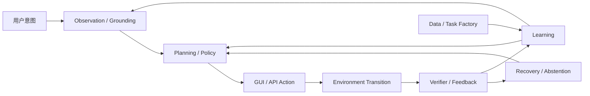

# GUI / Computer-Use Agent 统一研究综述

## 1. Overview

GUI Agent 的核心问题，是让模型在持续变化、部分可观测并包含不可逆操作的数字环境中完成可验证的长程任务。

研究对象覆盖 Web、Mobile、Desktop 与 GUI+API/CLI 混合操作；能力层级从 element grounding、single-step action 延伸到 app workflow、cross-app long-horizon task、主动澄清与受约束的 proactive assistance。只有直接研究 UI observation、GUI action、computer-use environment、GUI verifier 或部署期 safety/HCI 的工作进入本综述。纯 Deep Research、通用 Agentic RL、通用 VLM/World Model 与 Embodied Agent 仅作为邻接证据，不因使用相似模型或术语而并入。

现有研究应按一个闭环而不是按论文热词组织：

| 层 | 核心问题 | 当前最强证据 | 主要瓶颈 |
|:--|:--|:--|:--|
| 模型 | 屏幕如何表示、元素如何定位、动作如何编码 | 高分辨率视觉、专用 grounding head、hybrid observation 已显著提升局部能力 | grounding 提升不会自动转化为长程成功 |
| Agent 架构 | 如何规划、记忆、调用工具并管理历史状态 | Native end-to-end 与 compositional framework 各有优势 | 长程状态、模块误差级联、成本 |
| 学习算法 | 如何用 SFT、RL、self-improvement 与 test-time search 提升 policy | RLVR 在有 headroom 和可靠 reward 时有效 | reward variance、credit assignment、训练稳定性 |
| 数据 | 如何得到可执行任务、初始状态、轨迹与 validator | task/state/verifier co-generation 正在替代单纯轨迹采集 | judge 噪声、只读偏置、环境绑定 |
| 环境 | 如何 reset、并行、fork、verify、隔离并复现状态 | self-hosted software、functional simulator、snapshot engine 已形成供给谱系 | realism–controllability–scalability 不可同时最大化 |
| 评测与部署 | 如何确认真实成功、发现错误、恢复并控制风险 | programmatic verifier 与 interactive verifier 明显优于纯 LLM judge | hidden state、false completion、不可逆副作用 |

平台差异决定了同一算法的证据强度：

| 平台 | 可利用的结构 | 主要难点 | 代表 setting |
|:--|:--|:--|:--|
| Web | DOM / AXTree / screenshot / network state | live drift、bot detection、transactional state、prompt injection | WebArena、VisualWebArena、Online-Mind2Web |
| Mobile | screenshot / accessibility / emulator state / real device | 小目标、系统弹窗、账号与权限状态、真机漂移 | AndroidWorld、AndroidLab、RealMobile |
| Desktop | screenshot / OS API / files / shell / app state | 跨应用、长程专业 workflow、隐私与不可逆操作 | OSWorld、WindowsWorld、SaaSBench |
| Hybrid | GUI + API / CLI / SDK | 工具路由、语义对齐、权限边界 | [[Papers/2508-ComputerRL]]、[[Papers/2606-WeaveBench]] |

## 2. 模型与 Agent 架构

### 2.1 Observation 与 Grounding

GUI observation 有三种基本形态：

- **结构化输入**：DOM / AXTree / element ID token-efficient 且便于精确操作，但对 canvas、远程桌面和跨平台迁移脆弱。
- **Screenshot-only**：与人类可见状态一致，跨平台性最强，但小目标、密集布局和动态页面使 grounding 成为显式瓶颈。
- **Hybrid observation**：screenshot + DOM/AXTree + bbox/SoM 兼顾语义和视觉，是工程上的主流折中；它也增加了输入冲突与信息泄露风险。

[[Papers/2312-CogAgent]] 用 dual-resolution 视觉架构证明高分辨率 screenshot-only 输入可以超过 HTML-based 大模型；[[Papers/2408-OmniParser]] 代表把 detector、OCR 与 icon caption 组合成可插拔 perception layer 的路线。[[Papers/2602-ToolTok]] 进一步把绝对坐标改成离散 tool token 与 coarse-to-fine pathfinding，4B 模型用约 5K synthetic + 2K real samples 达到 ScreenSpot-Pro 61.1%，但尚未证明这种局部 grounding 优势能稳定传递到 long-horizon execution。

### 2.2 Action Representation

| 表示 | 优点 | 主要失败模式 | 代表工作 |
|:--|:--|:--|:--|
| Coordinate action | 平台无关、与 screenshot 对齐 | 分辨率变化、细小目标、坐标文本生成错位 | [[Papers/2400-SeeclickHarnessingGuiGrounding]] |
| Region / action head | 直接在 visual patch 上预测可交互区域，避免文本坐标生成 | patch 粒度限制；需要额外 head / verifier | [[Papers/2500-GuiActorCoordinateFree]] |
| Relative tool token | 离散相对移动可跨分辨率并形成 coarse-to-fine path | 多步定位增加 latency，online 长程收益未验证 | [[Papers/2602-ToolTok]] |
| Element-ID action | 精确、token-efficient、易验证 | 依赖 DOM/AXTree 与 stable ID | [[Papers/2307-WebArena]]、[[Papers/2412-BrowserGymAgentLab]] |
| Structured GUI action | click/type/scroll/drag 语义清晰 | 长尾交互 modality 覆盖不足 | [[Papers/2605-CUActSpot]] |
| GUI + API/CLI | 减少重复低效操作、可直接查询状态 | 工具选择、权限和副作用更复杂 | [[Papers/2508-ComputerRL]] |

统一 Agent 不等于统一动作 token。跨平台模型必须保留平台 convention 或显式路由，否则 mixed-SFT 会让 desktop/mobile 的交互规则相互污染；[[Papers/2607-UIMOPD]] 的 platform-conditioned distillation 就是在解决这一冲突。

### 2.3 Model-level 与 Agent-system-level 架构

| 架构 | 机制 | 强项 | 边界 |
|:--|:--|:--|:--|
| Native end-to-end | 单一 VLM 直接输出 reasoning 与 action | 数据闭环简单、跨平台迁移自然 | grounding、planning、memory 错误难隔离 |
| Compositional | manager–worker、专用 grounder、parser、critic、tool router | 组件可替换、失败可诊断 | latency 与 cascading error |
| Hybrid native + tools | 主模型保留 end-to-end policy，必要时调用 API/CLI/search/verifier | 性能、效率与可验证性折中 | 路由策略与权限控制成为新瓶颈 |

[[Papers/2504-AgentS2]] 的 Manager/Worker + Mixture of Grounding 说明专用小模块可以胜过让同一大模型兼任所有角色。[[Papers/2509-ScaleCUA]] 则给出反向证据：6 平台、17.1M grounding 数据可得到很强的局部能力，但 OSWorld 只有 17.7%，所以“更强 grounder”不是完整 agent 架构。

### 2.4 Planning、Memory 与 Search

- **显式任务状态**：program counter、变量与 belief state 比无限拼接 screenshot history 更适合长程 workflow。
- **Workflow / skill memory**：[[Papers/2409-AgentWorkflowMemory]] 把成功轨迹抽象成自然语言 workflow；[[Papers/2504-SkillWeaver]] 把复用模式进一步变成可执行 skill。
- **Test-time search**：[[Papers/2407-TreeSearchLMAgents]] 证明 search budget 可以稳定换取性能，但其回溯依赖 reset+replay；[[Papers/2512-WebOperator]] 表明 naive tree search 可能负收益，只有可逆性感知和重放校验后才可靠。
- **Runtime adaptation**：[[Papers/2606-LearningFromFailure]] 用失败轨迹生成 inference-time harness patch，说明 self-improvement 不一定要更新权重。

架构层的关键分界不是“单模型还是多模块”，而是谁拥有状态、谁能验证动作后果、谁能触发恢复。只增加 planner 或 critic 而不改善环境状态访问，常把同一不可观测问题转移到另一个模块。

## 3. 训练、RL 与持续适应

### 3.1 从 SFT 到可验证策略优化

SFT 负责注入动作语法、界面知识与基本轨迹模式；RL 只有在 policy 能采到成功、reward 能区分行为、环境能提供足够 rollout 时，才可能重塑成功行为的概率。[[Papers/2500-UiR1EnhancingEfficient]] 用 136 个任务的 rule-based GRPO 获得 ScreenSpot +22.1、ScreenSpot-Pro +6.0、AndroidControl +12.7，是小数据 RL 的代表结果；它证明的是可验证局部行为上的数据效率，不是任意长程任务都能靠同一配方解决。

[[Papers/2411-WebRL]] 用失败驱动 curriculum、ORM、KL 与 replay 把 WebArena-Lite 从 4.8% 提升到 42.4%，代表 online curriculum RL。[[Papers/2602-GUILibra]] 则说明 GUI reward 往往只有 partial verifiability，此时 KL trust region 反而是稳定 offline–online 迁移所必需，通用“去 KL”经验不能直接照搬。

### 3.2 RL 决策条件

| 前置变量 | 诊断 | 失败时优先选择 | 证据 |
|:--|:--|:--|:--|
| Sampling headroom | base policy 的 pass@k 是否明显高于 pass@1 | 无 headroom 时补 SFT / mid-training / expert data | [[Papers/2607-GRPONullWebAgent]] |
| Group reward variance | rollout group 是否全失败或全成功 | 全失败时注入 expert trajectory 或做 curriculum | [[Papers/2607-MAG]] |
| Reward coverage | validator 是否覆盖关键中间态与副作用 | 先改 verifier，不把噪声直接放进梯度 | [[Papers/2504-AgentRewardBench]] |
| Environment throughput | reset、并行与失败恢复是否可承受 | 先改环境、用 simulator，或转 offline/distillation | [[Papers/2509-AgentGymRL]]、[[Papers/2511-DreamGym]] |
| Policy-relative data | 数据对当前 policy 是否仍有学习信号 | 动态筛选/重生任务，不复用静态“高质量集” | [[Papers/2607-EvoCUA15]] |

[[Papers/2607-GRPONullWebAgent]] 的受控阴性结果应成为 RL 报告的最低方法学标准：SFT 已掌握任务上 GRPO 无可信提升，而有 sampling headroom 时同一 pipeline 才增加 22 个百分点。RL 更像已有行为分布的重塑器，而不是从零注入新技能的机制。

### 3.3 Credit Assignment 与 Reward Design

长程 GUI task 的核心矛盾是：outcome reward 可信但稀疏，process reward 密集但容易被 judge 偏差与 reward hacking 污染。现有解法可归为四类：

1. first-failure / fork-point 定位，把成功与失败轨迹的最早分叉作为监督；
2. milestone / progress reward，把成功轨迹中的可验证状态转成中间信用；
3. tree rollout，用兄弟子树回报差免费得到 step-level signal；
4. interactive verifier，让评估器主动取证而不是仅看文本或最后截图。

[[Papers/2601-EvoCUA]] 与 [[Papers/2607-EvoCUA15]] 把任务、初始状态和 executable validator 共生成，并给出两个重要负结果：训练数据价值是 policy-relative；PRM 分数可以上升而真实 outcome 停滞。[[Papers/2602-VAGEN]] 代表主动取证路线，但其验证成本与 actor–verifier 共享动作空间下的新 reward-hacking 面仍未在大规模 RL 闭环中验证。

### 3.4 Self-improvement：参数化与非参数化

| 路线 | 改进对象 | 代表机制 | 主要风险 |
|:--|:--|:--|:--|
| Parameter update | model weights | RFT、online RL、self-distillation | verifier bias 被固化进权重 |
| Context / memory | retrieved experience | workflow、failure pattern、state memory | 错误抽象与检索漂移 |
| Tool / skill | executable asset | API skill、runtime patch | 权限扩大、跨版本失效 |
| Workflow / harness | control flow | planner、retry、visual search、terminal assist | benchmark overfitting 与安全偏航 |

Self-improvement 的共同前提不是“能生成更多经验”，而是每次演化都有独立、可追溯、不能被当前 policy 轻易操纵的验证。GUI 领域的 verifier-first 原则同时适用于权重、memory、skill 与 harness；否则系统会把偏差当成成功模式复用。

## 4. 数据、任务与经验生成

GUI 数据不应只按“轨迹数量”统计。高价值训练单元至少包含 task、initial state、observation、action、transition evidence 与 validator；缺其中任一项，数据就很难支持 counterfactual learning、可靠 reward 或失败恢复。

| 生成层级 | 机制 | 代表工作 | 证据与边界 |
|:--|:--|:--|:--|
| Grounding pair | screenshot–element / instruction–region 对齐 | [[Papers/2509-ScaleCUA]]、ScreenSpot 系列 | 容易规模化，但不能代表 end-to-end competence |
| Tutorial replay | 从教程或演示重放得到轨迹 | [[Papers/2412-AgentTrek]]、[[Papers/2500-TonguiInternetScaleTrajectories]] | 成本低，受教程覆盖和 replay 成功率限制 |
| Interaction-first | 先探索，再 hindsight 标注任务 | [[Papers/2410-NNetNav]] | 消除不可行任务；沙盒到 live 仅 9.5% |
| Live task proposal | proposer–agent–judge 在真实网站采集 | [[Papers/2502-InSTA]] | 150K sites、2.2M trajectories、$521；judge 82.6%，任务偏只读 |
| Structured exploration | 网站/界面建图，从中间态采样 | [[Papers/2506-GoBrowse]] | reset 频率直接影响 coverage，环境能力进入数据质量 |
| Task/state/verifier co-generation | 同时生成可执行任务、状态与 validator | [[Papers/2601-EvoCUA]]、[[Papers/2603-AgentSynth]] | hard-task generation 由 11% 提到 52%；validator 质量是上限 |
| Simulator experience | world model / experience model 合成 transition 与 reward | [[Papers/2507-WebSynthesis]]、[[Papers/2511-DreamGym]] | 可控且便宜；fidelity、reward hacking 与 sim-to-real 需单独审计 |

三个跨论文结论已经稳定：

- 任务多样性比同一站点的轨迹深度更能支撑 OOD 泛化。
- 失败轨迹只有被定位、解释并绑定可验证恢复结果时才是高价值数据；直接堆失败日志没有监督意义。
- 数据质量不是静态属性，而是相对于当前 policy、environment version 与 verifier coverage 的关系。

## 5. 环境、基础设施与 Runtime

### 5.1 环境设计的三角约束

GUI 环境同时追求 realism、controllability 与 scalability，但三者存在结构性冲突：

- **Live / real-device** 最真实，却难以 reset、并行、复现和安全探索。
- **Self-hosted real software** 可控且有真实功能，但站点/应用覆盖有限、维护成本高。
- **Functional simulator / synthetic environment** 易 scale、易 fork，却可能丢失真实后端、异常态和视觉分布。

因此环境工作应按能力规格比较，而不是只按“真实/合成”二分。

### 5.2 六轴规格

| 轴 | 最低能力 | 训练价值 | 评测价值 | 典型失败 |
|:--|:--|:--|:--|:--|
| Init / Reset | 可编程初始状态、episode 级清理 | 课程生成、重复采样 | 可复现与难度控制 | 状态污染、手工 reset |
| Verify / Reward | 可查询的 outcome / progress / side effect | RL reward、数据过滤 | functional correctness | LLM judge 假阳性、rule 漏判 |
| Parallelism | 独立实例、资源隔离、异步调度 | 提升 rollout throughput | 多配置可比 | browser 泄漏、慢样本拖全组 |
| Fork / Rollback | checkpoint、clone、branch、replay | tree rollout、counterfactual data | 重试与失败定位 | 只能 URL 回退，后端状态丢失 |
| Task Supply | task + state + validator 同步生成 | policy-aware curriculum | 覆盖与难度审计 | 不可执行任务、只读偏置 |
| Determinism / Isolation | 固定版本、时间、网络与账号边界 | 稳定训练信号 | 可复现与防污染 | live drift、跨 episode 泄露 |

### 5.3 环境供给谱系

| 环境/系统 | 类型 | 关键能力 | 已知边界 |
|:--|:--|:--|:--|
| [[Papers/2307-WebArena]] | self-hosted real software | functional correctness、可复现任务 | 站点少，RL reset/并行成本高 |
| [[Papers/2412-BrowserGymAgentLab]] | unified web gym | screenshot/DOM/AXTree/SoM 与统一 action API | 统一接口不等于 agent-friendly state access |
| [[Papers/2510-WebServ]] | snapshot engine | 1.78s clone、28 MiB/instance、200+ 并发、运行中 fork | 尚无端到端 GUI RL 因果实验 |
| [[Papers/2605-MobileGym]] | functional mobile simulator | JSON state fork、deterministic judge、95.1% sim-to-real gain retention | agent-facing 仍以 screenshot + primitive action 为主 |
| [[Papers/2605-OpenComputer]] | cross-platform environment | programmatic verifier 与人类对齐 94.1% | 高质量 verifier 依赖可观测内部状态 |
| [[Papers/2509-AgentGymRL]] | multi-environment RL stack | full reset、并行 Chromium、horizon curriculum | 环境改造成本转移到框架维护 |
| [[Papers/2606-OpenWebRL]] | live RL stack | K8s isolation、retry、failure taxonomy、80–100 并发 | 51% 失败仍来自 bot detection/封锁/网络 |
| [[Papers/2604-Crab]] | sandbox runtime | agent-facing rollback；步数 −29%，branch token −40–64% | 仅 shell/FS/process，不是 GUI 全栈先例 |

### 5.4 Trainer-facing 与 Agent-facing

环境内部有 state、snapshot 和 verifier，不代表 agent 能利用它们。两者应明确区分：

- **Trainer-facing**：rollout scheduler、reset、parallel、ground-truth reward、hidden validator。
- **Agent-facing**：task-agnostic 的 `observe()`、`act()`、`feedback()`、`checkpoint()`、`rollback()` 等能力；它不能泄露 gold action 或直接给出 task success。

当前最有价值的空白不是再造一个 benchmark，而是检验 agent-visible runtime contract 的独立因果收益：同一 frozen policy 下，真实 state-grounded feedback/rollback 是否显著优于只把说明写进 prompt。[[Papers/2604-Crab]] 已给出 sandbox 先例，但 browser/mobile/desktop 全栈状态、success 增益和 prompt-only 对照仍未闭合。

## 6. 评测与 Verifier

### 6.1 Capability ladder 与 evidence setting

评测应同时报告能力层级和环境设置：

1. grounding accuracy；
2. step/action correctness；
3. task outcome；
4. long-horizon / cross-app completion；
5. error awareness 与 recovery；
6. clarification、abstention 与 proactive restraint；
7. privacy、safety 与 side effect。

同一数字还必须绑定 environment version、step budget、verifier、是否 live/real-device、是否同 backbone 对照。否则 leaderboard 差异可能来自环境、预算或 judge，而不是方法本身。

### 6.2 Verifier 谱系

| Verifier | 证据访问 | 优点 | 上限/风险 | 代表证据 |
|:--|:--|:--|:--|:--|
| Programmatic state verifier | 内部数据库、文件、app state | 便宜、确定、适合 RL | 覆盖不足会产生 false negative | [[Papers/2605-OpenComputer]] 94.1% human alignment |
| Interactive verifier agent | screenshot、shell、Python、GUI 主动取证 | 可补 hidden/ambiguous evidence | 成本高、与在线实例耦合 | [[Papers/2602-VAGEN]] 92.9% accuracy |
| Visual / rubric judge | 最后截图、轨迹、rubric | 易部署到闭源环境 | 受模型偏差、信息选择与幻觉影响 | [[Papers/2510-CUARewardBench]] |
| Human review | 完整语境 | 最终仲裁能力强 | 慢、贵、难 scale | 只适合 audit 与 benchmark calibration |

[[Papers/2504-AgentRewardBench]] 给出当前评测设置下的经验 ceiling：12 个 LLM judge 的 precision 无一超过 70%，rule-based evaluator 的 recall 只有 55.9%。[[Papers/2510-CUARewardBench]] 在 desktop 域得到最佳单模型 ORM precision 82.9%；UPE ensemble 提高到 89.8%，但 recall 降到 56.8%。弃权可以换 precision，主动取证才有机会同时保住 precision 与 recall。

### 6.3 “进步幻觉”与真实评测

[[Papers/2504-OnlineMind2Web]] 证明 shortcut task、缓存页面与不可靠 judge 可以让旧 benchmark 系统性高估能力；迁到 live 站点后多数 agent 退回早期水位。[[Papers/2604-Odysseys]] 的 200 个 live long-horizon 任务中，Opus 4.6 的 perfect success 最高（44.5%），GPT-5.4 的 Trajectory Efficiency 最高（1.15%）；两个最优值来自不同模型，且都说明真实交互的主要缺口不是单步 grounding，而是持续状态跟踪、恢复与成本控制。

## 7. 真实部署可靠性、Safety 与 HCI

### 7.1 Verify / Recover 是独立能力

[[Papers/2604-VeriGUI]] 发现 72.3% 失败来自重复无效动作导致的 timeout；[[Papers/2604-VLAA-GUI]] 报告失败任务中超过 86% 是 false completion。两者共同说明大量 GUI 失败不是“不会点”，而是“动作没生效却继续相信自己成功”。

| 能力 | 代表工作 | 关键结果 | 解释边界 |
|:--|:--|:--|:--|
| Action-effect verification | [[Papers/2604-VeriGUI]] | 预测动作效果并在下一步核验 | idempotent failure 假设不覆盖支付/导航等 partial transition |
| Error awareness / recovery | [[Papers/2605-GUIRobustEval]] | awareness 58.8%，depth-5 recovery 33.2% | “发现错了”本身仍未解决 |
| Safe backtracking | [[Papers/2512-WebOperator]] | naive search 负收益；可逆性感知后恢复增益 | URL/checkpoint 不能恢复全部后端状态 |
| Timely abstention | [[Papers/2606-AgenticAbstention]] | 最强 baseline timely recall 26.7% | 最终拒绝与及时停止是不同能力 |
| Real-distribution learning | [[Papers/2606-XiaomiGUI0]] | 真机异常态与 teacher takeover 生成 recovery supervision | 工业 technical report；环境昂贵、漂移且难复现 |

### 7.2 Safety 与 Privacy

安全不能只看 user prompt。风险来自第三方内容、跨应用上下文、动作后果和 self-improvement 资产：

- **Environmental injection**：[[Papers/2504-WASP]] 在现实威胁模型下的部分攻击成功率可达 86%；[[Papers/2409-EIA]] 的环境注入窃取特定 PII 成功率为 70%。
- **Contextual disclosure**：[[Papers/2606-AgentCIBench]] 在无 adversary 的正常使用中测得平均 contextual leakage 67.9%，说明 task success 不能代理 privacy safety。
- **Least disclosure**：[[Papers/2601-GUIGuardBench]] 的 binary privacy detection 尚可，但 strict full match 在 Android/PC 只有 8.8%/0.6%。
- **Action-level guard**：[[Papers/2607-SeerGuard]] 指出 91% high-risk case 来自“良性指令 + 上下文危险动作”，所以 guard 必须在执行前预测后果，而不是只筛 instruction。

“Security by incompetence”是这里最重要的边界：当前攻击没有完整成功，可能只是 agent 能力不足；随着执行能力提升，部分劫持更容易变成完整副作用。安全机制必须在能力到位前建立，而不是等 benchmark 成功率提高后补丁式追加。

### 7.3 Clarification、Confirmation 与 Proactive Restraint

[[Papers/2602-AmbiBench]] 中非交互 agent 在 Ambiguous instruction 上 TSR 为 0；[[Papers/2501-UITARS]] 的 dialogue completion rate 达 87.2%，但 information-gain rate 只有 12%，表现为“会回应但不会问对问题”。[[Papers/2503-OS-Kairos- Adaptive Interaction for MLLM-Powered GUI Agents]] 用 action confidence 触发 human intervention，代表 adaptive autonomy。[[Papers/2603-PIRABench]] 则表明 proactive intent recommendation 的主要差距来自 false positive，因此 recommendation recall 必须与 restraint 一起评估。

## 8. Datasets & Benchmarks

| Benchmark | 能力/平台 | 规模 | 指标与关键数字 | Verifier / Setting |
|:--|:--|:--|:--|:--|
| ScreenSpot-Pro ([[Papers/2504-ScreenSpotPro]]) | high-resolution grounding / multi | 专业 GUI | 专业 icon 识别仍是极弱项 | offline annotation |
| CUActSpot ([[Papers/2605-CUActSpot]]) | long-tail action grounding / multi | 206 eval + 50M synthetic | Phi-Ground-Any-4B 44.4% | offline action match |
| MMBench-GUI ([[Papers/2507-MMBench-GUI- Hierarchical Multi-Platform Evaluation Framework for GUI Agents]]) | content / grounding / automation / collaboration | Windows、macOS、Linux、iOS、Android、Web 四层级 | EQA 同时衡量执行质量与效率 | hierarchical offline + online evaluation |
| AutoGUI-v2 ([[Papers/2604-AutoGUIv2]]) | functional GUI understanding / 6 OS | 2,753 tasks | region function grounding/caption + state prediction | offline functional evaluation |
| WebArena ([[Papers/2307-WebArena]]) | end-to-end web | 812 tasks | functional success | self-hosted state verifier |
| VisualWebArena ([[Papers/2401-VisualWebArena]]) | multimodal web | 910 tasks | task success | self-hosted + visual |
| WorkArena ([[Papers/2403-WorkArena]]) | enterprise web | 33 / 682 compositional | open << closed；长程组合更低 | ServiceNow sandbox |
| REAL ([[Papers/2504-REAL]]) | deterministic web replica | 112 tasks / 11 sites | Claude 3.7 Thinking 41.07% | localStorage state diff + rubric |
| Online-Mind2Web ([[Papers/2504-OnlineMind2Web]]) | live web | real sites | Operator 约 61%；多数旧 agent 崩塌 | WebJudge，约 85% human agreement |
| Odysseys ([[Papers/2604-Odysseys]]) | live long-horizon web | 200 tasks | Opus 4.6 perfect 44.5%；GPT-5.4 TE 1.15% | rubric + live execution audit |
| AndroidWorld | mobile long-horizon | 116 tasks / 20 apps | [[Papers/2500-MobileRL- Online Agentic Reinforcement Learning for Mobile GUI Agents|MobileRL-9B]] 80.2% | emulator state evaluator |
| AmbiBench ([[Papers/2602-AmbiBench]]) | ambiguous instruction / mobile | 240 tasks × 4 clarity levels | non-interactive TSR 0%；IGR 12% | real-device dialogue evaluation |
| AndroidDaily ([[Papers/2605-AndroidDaily]]) | closed-source commercial mobile apps | 350 tasks / 94 apps | Gemini 3 Flash 62.0%；GRADE–human agreement 87.37% | visual trajectory evidence + guideline judge |
| MemGUIBench ([[Papers/2602-MemGUIBench]]) | memory-intensive mobile | 128 tasks / 26 apps | strongest 32.8% | pass@1 |
| OSWorld 2.0 ([[Papers/2606-OSWorld2]]) | long-horizon desktop | 108 tasks / 31 sites | binary 20.6% / partial 54.8% | checkpoints + scripts |
| WindowsWorld ([[Papers/2604-WindowsWorld]]) | desktop / cross-app | 181 tasks / 16 personas | single-app 46% vs cross-app 14% | execution evidence |
| SaaSBench ([[Papers/2605-SaaSBench]]) | professional cross-app | 106 tasks / 23 systems | resolved 3.8% / checkpoint 43.9% | partial checkpoint scoring |
| MyPCBench ([[Papers/2606-MyPCBench]]) | personalized desktop | Linux + 17 simulated web apps | Claude Opus 4.6 fully-solved 55.4% | logged-in personal context |
| GUI-RobustEval ([[Papers/2605-GUIRobustEval]]) | recovery / desktop | 1,216 cases | awareness 58.8%；recovery@depth5 33.2% | controlled error injection |
| AgentRewardBench ([[Papers/2504-AgentRewardBench]]) | verifier / web | 1,302 trajectories / 351 tasks | LLM precision ≤70%；rule recall 55.9% | expert labels |
| CUARewardBench ([[Papers/2510-CUARewardBench]]) | ORM/PRM / desktop | 272 ORM + 346 PRM | best single ORM precision 82.9% | expert labels |

## 9. 综合判断

### Key Takeaways

1. **GUI Agent 的优化单元已经从模型扩展为“model–environment–verifier”闭环。** 强 grounder、强 planner 或更多 RL steps 都不能单独解释真实成功；环境是否可 reset/fork、verifier 是否能访问真实状态，直接决定训练信号和搜索上限。研究比较应同时固定 backbone、环境版本和 verifier，才有因果意义。

2. **RL 不是默认有效，而是有明确前置条件的分布重塑工具。** 有 sampling headroom、group reward variance、可信 reward coverage 和足够 rollout throughput 时，RL 可以显著提高成功行为概率；缺任一条件，最优动作往往是补 SFT/mid-training、蒸馏 expert、改环境或改 verifier。所有 RL 正结果都应报告 headroom control 与 paired statistics。

3. **在当前 long-horizon 与 frontier deployment 证据中，瓶颈正从“点不准”扩展到“知不知道自己错了”。** false completion、无效循环、迟到的 abstention 和 non-idempotent side effect 构成独立能力层，不能被 grounding accuracy 或 task success 平均数掩盖。可靠系统需要 action-effect verification、error awareness、recovery 与及时 human handoff 的联合评测。

4. **高价值数据的单位是 verified transition，而不是 trajectory。** 只有绑定 initial state、动作后果证据与 validator 的经验，才能稳定支持 RL、counterfactual branch 和失败恢复。任务/数据/verifier 共生成比单纯扩大轨迹数量更可扩展，但其收益始终受 simulator fidelity 与 validator coverage 约束。

5. **跨平台统一更可能来自共同 runtime contract，而不是一个消除所有差异的单体模型。** Web、Mobile、Desktop 的输入、动作、权限和恢复语义不同；强行混合容易造成 convention conflict。共享 observation/action/feedback/checkpoint contract，同时保留 platform-conditioned perception、action adapter 与 safety policy，是更可检验的统一路径。

### Open Problems

1. **Browser/Mobile/Desktop 全栈状态 fork**：现有 engine-level fork 或限于 container/shell，或没有端到端 agent/RL 实验；需要同时覆盖前端、后端、账号、文件和网络状态。
2. **Partial observability 下的可信 verifier**：programmatic verifier coverage 不全，visual judge 易 hallucinate；需要能主动取证、报告不确定性并抵抗 actor 操纵的混合 verifier。
3. **Non-idempotent action 的验证与恢复**：支付、发送、提交、删除等动作可能部分成功且不可安全重放，单屏 before/after 对比与 URL rollback 都不够。
4. **Policy-relative data / reward co-evolution**：task、skill、milestone 和 validator 会随 policy 提升失去学习信号；需要在线测量资产有效性并动态重生，而不是长期复用静态“高质量集”。
5. **Live realism 与可复现性的共同基准**：时间漂移、CAPTCHA、账号风控和第三方服务使 live 分数不可直接复现；需要 versioned mirror、真实小样本 audit 与持续校准的组合协议。
6. **Safety-capability 同步 scaling**：当前表观安全可能来自能力不足；需要把 privacy、contextual integrity、irreversible action 和 clarification gate 纳入训练与发布门槛。
7. **Agent-facing runtime 的因果验证**：应在 frozen policy、相同 prompt 和相同环境下，比较真实 state-grounded affordance 与 prompt-only guidance，确认收益是否来自接口本身。

## 调研日志

### 2026-07-21 统一整合

- **范围**：合并原 GUIAgent、Web GUI operation、AgentEnvironment、AgentRuntimePrimitives、RealWorldGUIAgent-Reliability，并选择性吸收 AgenticRL 中直接面向 GUI/Web/CUA 的证据。
- **计数**：五份原 survey 各自去重后合计 329 个论文归属位，原始 `Papers/` wikilink 出现 805 次，跨 survey 全局去重后为 193 篇。193 是整合前混合候选池，至少包含随后迁出的 11 篇 Deep Research 论文，不代表 GUI core；统一主文按当前边界选取并显式引用论文，`papers_analyzed` 按主文可解析唯一链接计数。
- **结构**：按模型与 Agent 架构、训练与适应、数据、环境与 runtime、评测/verifier、可靠性/safety/HCI 组织；主文显式引用的 71 篇代表论文各设一个 primary home，其他位置只 cross-link。
- **边界**：Deep Research、通用 Agentic RL、通用 Self-Evolving Agent、通用 VLM/World Model 保留为邻接方向，不因共享 backbone 或算法而计入 GUI core。
- **检索**：本轮为 vault-first consolidation，没有外部搜索或新增 paper digest；证据来自现有 Papers 笔记及已完成的 survey 调研。
