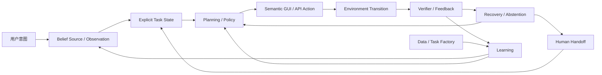

# GUI / Computer-Use Agent 统一研究综述

> [!info] 已升级为 [[Topics/CUA-Survey]]（2026-07-23）
> 本综述已按 12 节完整 Computer-Use Agents 目录重排并补全，canonical 版本为 [[Topics/CUA-Survey]]。以下为并入前的内容，仅作历史留存，不再单独更新（digest→survey 流水线已改指向 CUA-Survey）。

## 1. Overview

GUI / Computer-Use Agent 的通行组织坐标是**平台（Web / Mobile / Desktop / 跨平台）× agent 组件（observation、grounding、planning、memory、action、verifier）**——已发表 survey（Microsoft LLM-Brained、[[Papers/2508-OSAgentsSurvey|OS Agents]]、Nguyen ACL Findings 等）多沿这两轴编目。

本综述在这套坐标之上叠一个**作者综合论断**（非领域既成共识）：优化单元正从“识别屏幕并生成动作”的模型输出，收束为可追溯来源、可核验、可恢复的**状态转移**，并通过 environment、runtime、verifier 与人类监督实现受约束的长程执行。该论断的证据到 2026 年中仍以新近、未经独立复现的 preprint 为主，应与已确立阶段区别对待；下文五阶段的第五阶段即属此类前瞻押注，读者宜先在上述通行坐标里站稳，再接受本文的重排。

研究对象覆盖 Web、Mobile、Desktop 与 GUI+API/CLI 混合操作；能力层级从 element grounding、single-step action 延伸到 app workflow、cross-app long-horizon task、主动澄清与受约束的 proactive assistance。只有直接研究 UI observation、GUI action、computer-use environment、GUI verifier 或部署期 safety/HCI 的工作进入本综述。纯 Deep Research、通用 Agentic RL、通用 VLM/World Model 与 Embodied Agent 仅作为邻接证据，不因使用相似模型或术语而并入。

前沿的绝对水位可用桌面主基准 OSWorld(-Verified) 标定：最强系统从 2024-04 的 12.24% 抬到 Claude Sonnet 4.5 的 61.4%（2025-09）、Sonnet 4.6 的 72.5%（2026-02），后者首次触及 human baseline 72.36%；2026 年中 tracker 头部已报 80–85%，但均为 self-reported 且对 harness、step budget、judge 高度敏感，不可横向裸比。开源可复现前沿由 [[Papers/2509-UITARS2|UI-TARS-2]]（OSWorld 47.5 / AndroidWorld 73.3 / Online-Mind2Web 88.2）与 [[Papers/2602-Mobile-Agent-v3.5- Multi-platform Fundamental GUI Agents|GUI-Owl-1.5 / Mobile-Agent-v3.5]]（ScreenSpot-Pro 80.3）两条线撑起。这条曲线本身即说明局部能力已非主要瓶颈：AndroidWorld 与 ScreenSpot-V2 均已饱和（顶级系统 >90%），战场分别移向 MobileWorld（best framework 51.7）与 ScreenSpot-Pro（当前 SOTA 80.3），而长程可靠、真实分布与可核验成功成为新上限。

这一问题经历了五次可辨认的抽象升级，每次跃迁都由上一阶段的结构性瓶颈驱动。结构化接口路线用 DOM/AXTree 与 element action 把自然语言目标转成可执行 navigation，但对网页结构的依赖阻断了向 canvas、mobile 与 desktop 的迁移，screenshot-native 遂以高分辨率视觉与 coordinate grounding 换取跨平台观察；跨平台之后，局部 grounding 与长程成功的脱节转而成为主要矛盾，agent-system 化把 grounding、planning、memory 与 tool use 分给专用模块，却引入模块误差级联与状态所有权不清。

静态分工无法自我修正，闭环学习于是以 task/state/verifier 共生成与 online RL 让真实交互产生可学习 reward，而 task validity、rollout 吞吐与 verifier 偏差随即构成新上限——其共同根源是“成功”本身不可检查。刚进入萌芽期的可问责系统因此把 belief provenance、explicit task state、semantic action 与 oversight 提为一等对象，将端到端成功拆成可检查的状态转移，但跨层因果证据、安全边界与人类注意力尚未闭合。各阶段的抽象、动因与代表证据见下表：

| 阶段 | 主导抽象 | 解决的旧问题 | 新暴露的瓶颈 | 代表证据 |
|:--|:--|:--|:--|:--|
| 2017–2023：结构化接口 | DOM/AXTree + element action + self-hosted web | 把自然语言目标转成可执行 navigation | 依赖网页结构，难迁移到 canvas、mobile 与 desktop | [[Papers/2307-WebArena]] |
| 2023–2024：Screenshot-native | 高分辨率视觉 + coordinate grounding + OS/mobile benchmark | 跨平台观察与通用 computer use | 局部 grounding 与长程成功脱节 | [[Papers/2312-CogAgent]]、[[Papers/2408-OmniParser]] |
| 2024–2025：Agent-system 化 | grounder、planner、memory、critic、tool router | 将 perception、planning 与 execution 分工 | 模块误差级联，状态所有权不清 | [[Papers/2504-AgentS2]] |
| 2025–2026 上半年：闭环学习 | task/state/verifier 共生成 + online RL + environment factory | 让真实交互产生可学习 reward | task validity、rollout 吞吐与 verifier 偏差成为上限 | [[Papers/2601-EvoCUA]]、[[Papers/2511-DreamGym]] |
| 2026 年 7 月：可问责系统（萌芽） | belief provenance + explicit task state + semantic action + oversight | 把成功拆成可检查的状态转移 | 跨层因果证据、安全边界与人类注意力尚未闭合 | [[Papers/2607-GUIStateBelief]]、[[Papers/2607-Tactile]] |

其中第五阶段是本文的**前瞻押注而非已完成的转折**：它由 2026 年 7 月（距本文 0–3 周）的 preprint 支撑、尚无独立复现，读者应把它当作"值得下注的方向"而非"已确立的终点"；前四阶段则有多组工作与时间沉淀支撑。

五阶段时间轴解释研究抽象如何变化；下面的闭环则解释当前系统由哪些相互制约的层组成。第 2–7 章沿着模型/状态、学习、数据、环境/runtime、评测/verifier 与可靠部署六层，分别追踪它们在五阶段中的演进，而不是按论文热词分组。

| 层 | 核心问题 | 当前最强证据 | 主要瓶颈 |
|:--|:--|:--|:--|
| 模型 | 屏幕如何表示、元素如何定位、动作如何编码 | 高分辨率视觉、专用 grounding head、hybrid observation 已显著提升局部能力 | grounding 提升不会自动转化为长程成功 |
| Agent 架构 | 如何规划、记忆、调用工具并管理历史状态 | Native end-to-end 与 compositional framework 各有优势 | 长程状态、模块误差级联、成本 |
| 学习算法 | 如何用 SFT、RL、self-improvement 与 test-time search 提升 policy | RLVR 在有 headroom 和可靠 reward 时有效 | reward variance、credit assignment、训练稳定性 |
| 数据 | 如何得到可执行任务、初始状态、轨迹与 validator | task/state/verifier co-generation 正在替代单纯轨迹采集 | judge 噪声、只读偏置、环境绑定 |
| 环境 | 如何 reset、并行、fork、verify、隔离并复现状态 | self-hosted software、functional simulator、snapshot engine 已形成供给谱系 | realism–controllability–scalability 不可同时最大化 |
| 评测与部署 | 如何确认真实成功、发现错误、恢复并控制风险 | programmatic verifier 与 interactive verifier 明显优于纯 LLM judge | hidden state、false completion、不可逆副作用 |

平台差异决定了同一算法的证据强度：

| 平台 | 可利用的结构 | 主要难点 | 代表 setting |
|:--|:--|:--|:--|
| Web | DOM / AXTree / screenshot / network state | live drift、bot detection、transactional state、prompt injection | WebArena、VisualWebArena、Online-Mind2Web |
| Mobile | screenshot / accessibility / emulator state / real device | 小目标、系统弹窗、账号与权限状态、真机漂移 | AndroidWorld、AndroidLab、RealMobile |
| Desktop | screenshot / OS API / files / shell / app state | 跨应用、长程专业 workflow、隐私与不可逆操作 | OSWorld、WindowsWorld、SaaSBench |
| Hybrid | GUI + API / CLI / SDK | 工具路由、语义对齐、权限边界 | [[Papers/2508-ComputerRL]]、[[Papers/2606-WeaveBench]] |

## 2. 模型与 Agent 架构

### 本章发展进程与研究现状

模型侧最初把 GUI 理解为“从指令到坐标”的视觉定位问题，随后通过高分辨率输入、专用 grounding head 与 active zoom 改善小目标定位。需要说明的是，grounding 泛化本身仍是社区公认的第一瓶颈——ScreenSpot-Pro 头部虽已到 80.3，但专业软件、密集小图标与动态布局（spreadsheet、移动端一屏 200+ 元素）仍是最难 case；本章把重心移向 state belief，并不主张 grounding 已解决，而是主张即便局部定位可靠也不自动传递到长程正确——这两点须同时成立。Agent-system 路线再把 grounding、planning、memory 与 tool use 分给不同组件，但长程失败表明，仅有更强的局部模块仍不足以维持正确状态。

当前转折是把 **state belief** 提升为一等对象：不仅要知道模型读到了什么，还要记录证据来自 pixels、DOM/AXTree、memory 还是 prior，以及这些证据是否新鲜、冲突或已被动作改变。架构的比较单位也从“单模型或多模块”变成“谁拥有状态、谁能修改状态、谁负责验证状态”。

### 2.1 Observation 与 Grounding

screenshot-native grounding 常被视为 LLM 时代的产物，其范式实则更早：[[Papers/0910-Sikuli]]（UIST 2009）已用 GUI 元素截图同时做检索与鼠标键盘定位，确立"看像素、按图操作、不依赖 API/坐标"路线。但它是纯外观模板匹配（MSER+SIFT）、无语义泛化——只能匹配确切截图、无法解析"点击提交按钮"，本质是 visual macro 而非 agent；RPA 与 programming-by-demonstration 则是 LLM agent 在产业界取代的对象（规则脚本、脆弱、无泛化）。LLM/VLM 补上的正是语义与 planning，而 pixels-in / keyboard-mouse-out 的范式自 Sikuli 未变。补进这条 pre-LLM 谱系可校正"视觉操作 UI 是 LLM 发明"的时序错觉。

GUI observation 的三种基本形态对应一条清晰的发展线。最早的 web agent 依赖结构化输入——DOM / AXTree / element ID token-efficient 且便于精确操作，先解决了把自然语言目标转成可执行 navigation 的问题；但这一表示对 canvas、远程桌面和跨平台迁移脆弱，随着研究对象从 self-hosted web 扩展到 mobile 与 desktop，screenshot-only 取而代之成为通用路线：它与人类可见状态一致，跨平台性最强，代价是小目标、密集布局和动态页面使 grounding 成为显式瓶颈。

工程实践因此收敛到 hybrid observation：screenshot + DOM/AXTree + bbox/SoM 兼顾语义和视觉，是工程上的主流折中。但通道叠加暴露了新问题——若没有 provenance、freshness 与一致性检查，更多通道也会把 stale structure 变成更强的错误证据：当结构通道滞后于界面真实状态时，“信息更多”反而为模型跟随过期证据提供了更强的理由。

[[Papers/2312-CogAgent]] 用 dual-resolution 视觉架构证明高分辨率 screenshot-only 输入可以超过 HTML-based 大模型；[[Papers/2408-OmniParser]] 代表把 detector、OCR 与 icon caption 组合成可插拔 perception layer 的路线。[[Papers/2602-ToolTok]] 进一步把绝对坐标改成离散 tool token 与 coarse-to-fine pathfinding，4B 模型用约 5K synthetic + 2K real samples 达到 ScreenSpot-Pro 61.1%，但尚未证明这种局部 grounding 优势能稳定传递到 long-horizon execution。[[Papers/2605-A11yCompressor]] 走 structure 侧的同类 representation engineering：用 modal detection、redundancy reduction 与 semantic structuring 把线性 accessibility tree 重排成带空间分区的紧凑表示，OSWorld 上 input token 压到约 22% 的同时 success 从 0.156 提到 0.207（+5.1pp）。但每个孤立阶段单独用都 ≤baseline、增益只在三阶段组合时涌现，且集中在 Writer/Thunderbird/Chrome、Multi-Apps 近零——它是一个 structure-only 的单源 datapoint，仍触不到 pixel-only 才携带的证据（icon 形状/颜色）。同一 representation-engineering 思路也出现在注意力层：[[Papers/2511-GuiAima]] 加一个 learnable `<ANCHOR>` token、直接监督它对 visual patch 的注意力分布来做 grounding，复用 MLLM 内蕴多头注意力而非新增 grounding head，3B 模型达 ScreenSpot-Pro 61.5 / ScreenSpot-v2 92.1（仅 509k 样本）；但 61.5 依赖 training-free 两步 zoom（去掉降到 53.8），迁到 InternVL3.5-4B 仅 +1.8pp，说明增益高度依赖 backbone 自身的原生 grounding 质量。

[[Papers/2607-GUIStateBelief]] 改变了“hybrid observation 信息更多、因而更可靠”的默认判断。735 个跨 Web、Mobile、Desktop 的 paired probes 显示，模型在 image-only 读取接近饱和时，仍会在冲突下跟随 stale structure；真实网页中的结构跟随率最高达 0.88。在最多六步、首步冲突已导致 structure-following error、且 aligned twin 至少需要两步的 MiniWoB++ click-style episodes 中，self-recovery 不超过 0.03。prompt 级 pixel-priority cue 到 action 层失效，而 training-free consistency gate 才同时降低 hijack 与 task error，说明 fusion failure 不能只靠扩大视觉模型解决。

局部 grounding 之外还有一条正交的 context 工程线——**推理期效率**：当 observation 与历史轨迹撑大 context 时如何在不掉精度下压缩存储。[[Papers/2606-StarKV]] 针对 GUI VLM 的 KV cache，用 spatial mutual-information prior + cross-frame temporal-stability discount + entropy sharpening 替代通用方法的单一 saliency 加固定 top-B，在 40% 预算下与 full cache 持平（ScreenSpot-Pro 49.94 vs 49.75）、20% 预算峰值显存降约 38.5%；[[Papers/2601-CompressToFocus]] 则把压缩折进多轮 RL——跨 rollout 聚合 click 坐标定 ROI、裁历史截图并丢弃非坐标动作的截图，把 1AO→3AO 的 token 增幅从 semi-online RL 的 41% 压到约 4%，GUI-Odyssey 长程 SR +21.4pp。[[Papers/2603-STLiteKV]] 的更硬贡献其实是诊断而非方法：GUI 注意力在**所有层**都均匀高稀疏，导致 PyramidKV/VL-Cache 的分层预算先验错配、在低预算下崩溃（ScreenSpot-Pro @1% 预算 VL-Cache 1.1 / PyramidKV 4.8 vs ST-Lite 7.3），改用均匀预算 + 零超参空间显著性后 2.45× 解码加速、@20% 预算甚至微超 full cache——但其 intro 的“平均 7.3% 提升”经独立核查实为单个最大 cell、真实均值约 2.2–2.4%（该 note 标 partial）。这条线与 accountable-state thesis 正交：它按 attention/redundancy 启发式决定留哪些 token，而非按 belief source 或 freshness 决定；隐患也在此——裁剩的 ROI crop 或高 saliency token 不保证仍反映当前 UI state，压缩本身可能把 stale evidence 留在 context 内。

与视觉/结构侧的表示重构平行，web agent 有一条更早成型、如今已进入自我质疑期的 **observation reduction** 线——针对 raw DOM/HTML 常达 10k–100k token 的问题，喂给 agent 的不是原始 DOM 而是其优化版。四条路线已固化：程序化剪枝（[[Papers/2511-Prune4Web]]，LLM 只产出 keyword_weights 参数填入固定打分模板、并非真生成 Python，候选削减 25–50×、low-level grounding 46.8→88.28）、LLM 选行检索（[[Papers/2510-FocusAgent]]，轻量 retriever 按 goal 从 AxTree 选相关行、削减 >50%）、规则式结构重构（前述 [[Papers/2605-A11yCompressor]]），以及与"缩短"正交的表示对齐（[[Papers/2410-AgentOccam]]）。这条线最有价值的产出不是又一个压缩器，而是三个跨论文的校正性发现。其一，**优化 ≠ 省 token**：AgentOccam 把页面重构成 Markdown/降噪表示、WebArena 做到 43.1% 超一众带 search/多角色的复杂系统，但其每步观察 token 反而从 vanilla 的 2210 升到 2930——杠杆是"对齐 LLM 预训练分布 + 降噪"而非缩短长度，做压缩类工作时"对齐"与"缩短"必须分开评估。其二，**压缩并非普遍有益、且高度依赖底座**：[[Papers/2604-ReadMoreThinkMore]] 在 WorkArena L1 上系统对比 a11y 与完整 HTML，强模型（gpt-5.1、claude-sonnet-4-6）用完整 HTML 反而 +14.6~17.5pp、弱开源模型用 HTML 大幅退化（gpt-oss-20b −18.8pp），最优表示取决于 model capability × thinking budget（o3-mini −7.6pp 的反例说明决定因素是能力而非闭源）——这把"reduction 总是好"从默认假设降级为有边界条件的判断。其三，**收益随模型变强而蒸发**：Prune4Web 对 GPT-4o 零提升（42.1→42.1，增益集中在小模型）、FocusAgent 在 WebArena 反低于全观察（32.3 vs 36.5），三篇独立指向"DOM 优化正从能力问题退化为成本/延迟/安全问题"。这条线与本章的 belief-source 讨论互补：reduction 决定喂哪些证据，而 [[Papers/2607-GUIStateBelief]] 说明喂进来的证据一旦 stale/冲突就会主导错误——两者共同表明观察工程的正确单位不是"更短"，而是"为哪个模型、哪个下游目标、在什么 freshness 下最优"。该子领域已成熟到自建廉价评测代理（见 §6.3 [[Papers/2605-MFSCoverage]]），也从侧面印证方法层面接近饱和。

### 2.2 Action Representation

动作表示的发展线是从裸坐标走向携带更多语义与验证信息的动作对象：coordinate action 以平台无关、与 screenshot 对齐为起点，element-ID 与 structured GUI action 换取精确与易验证，semantic action object 进一步把 target、affordance、provenance 与 verification cue 一体化，GUI + API/CLI 混合则允许绕开重复低效的界面操作。贯穿这条线的核心分歧是平台无关性与可验证性的取舍——越依赖像素越可跨平台，越依赖结构越可核验、也越受 DOM/AXTree 可用性约束。

| 表示 | 优点 | 主要失败模式 | 代表工作 |
|:--|:--|:--|:--|
| Coordinate action | 平台无关、与 screenshot 对齐 | 分辨率变化、细小目标、坐标文本生成错位 | [[Papers/2400-SeeclickHarnessingGuiGrounding]] |
| Region / action head | 直接在 visual patch 上预测可交互区域，避免文本坐标生成 | patch 粒度限制；需要额外 head / verifier | [[Papers/2500-GuiActorCoordinateFree]] |
| Relative tool token | 离散相对移动可跨分辨率并形成 coarse-to-fine path | 多步定位增加 latency，online 长程收益未验证 | [[Papers/2602-ToolTok]] |
| Element-ID action | 精确、token-efficient、易验证 | 依赖 DOM/AXTree 与 stable ID | [[Papers/2307-WebArena]]、[[Papers/2412-BrowserGymAgentLab]] |
| Structured GUI action | click/type/scroll/drag 语义清晰 | 长尾交互 modality 覆盖不足 | [[Papers/2605-CUActSpot]] |
| Semantic action object | target、affordance、provenance、verification cue 一体化 | 依赖可用 AX/OCR；canvas 与 remote desktop 会退回视觉歧义 | [[Papers/2607-Tactile]] |
| GUI + API/CLI | 减少重复低效操作、可直接查询状态 | 工具选择、权限和副作用更复杂 | [[Papers/2508-ComputerRL]] |

统一 Agent 不等于统一动作 token。跨平台模型必须保留 platform convention 或显式路由，否则 mixed-SFT 会让 desktop/mobile 的交互规则相互污染；[[Papers/2607-UIMOPD]] 的 platform-conditioned distillation 就是在解决这一冲突。[[Papers/2607-Tactile]] 则把问题从“预测哪个动作 token”推进为“runtime 能否暴露可执行且可核验的动作对象”：Codex Success@100 从 41.1% 提到 50.0%，但 Limited-AX 场景只提升 5.55 个百分点，说明 semantic action 的上限仍受环境结构质量约束。

### 2.3 Model-level 与 Agent-system-level 架构

Native end-to-end 与 compositional 之争的现状不是一方取代另一方，而是失败可诊断性与数据闭环之间的取舍：前者数据闭环简单、跨平台迁移自然，但错误难隔离；后者组件可替换、失败可诊断，代价是 latency 与 cascading error。

| 架构 | 机制 | 强项 | 边界 |
|:--|:--|:--|:--|
| Native end-to-end | 单一 VLM 直接输出 reasoning 与 action | 数据闭环简单、跨平台迁移自然 | grounding、planning、memory 错误难隔离 |
| Compositional | manager–worker、专用 grounder、parser、critic、tool router | 组件可替换、失败可诊断 | latency 与 cascading error |
| Hybrid native + tools | 主模型保留 end-to-end policy，必要时调用 API/CLI/search/verifier | 性能、效率与可验证性折中 | 路由策略与权限控制成为新瓶颈 |

[[Papers/2504-AgentS2]] 的 Manager/Worker + Mixture of Grounding 说明专用小模块可以胜过让同一大模型兼任所有角色。[[Papers/2509-ScaleCUA]] 则给出反向证据：6 平台、17.1M grounding 数据可得到很强的局部能力，但 OSWorld 只有 17.7%，所以“更强 grounder”不是完整 agent 架构。

### 2.4 Planning、Memory 与 Search

Planning 的第一阶段是扩大 history 或引入 planner；第二阶段把成功轨迹压缩成 workflow/skill，[[Papers/2409-AgentWorkflowMemory]] 与 [[Papers/2504-SkillWeaver]] 分别代表自然语言和可执行资产，而 [[Papers/2606-SkillNb]] 用 selective formalization 把这条 NL–可执行光谱变成逐步可调的量：按执行证据决定每个步骤固化成代码还是保留为 NL，运行时 gate 校验不过就地回退（代码→NL→裸意图），并让 workflow 在 provisional/released/retired 间流转。它把评价单位从"单轮成功"移到"复用与漂移下的可靠性"——WebArena-Verified 单轮仅 53.7%（+3.9pp），但三次重跑保住 91.7% 初始成功任务（比次优高 15.5 分）、有限修复后回收 72.9% 失败且把修复后回归压到 4.2%（持续型 baseline 15–17%），且消融显示这条可靠性收益几乎全来自 gate（去 gate 回归从 3.3% 爆到 18.6%），而非把 skill 写成代码本身。第三阶段则把 task progress、belief 与 recovery condition 显式化。[[Papers/2607-TSR]] 的 explicit task state 在 MobileWorld 最多提升 12 个百分点，却让 Qwen 在 AndroidWorld 下降 3.45 个百分点，说明状态维护只有在 horizon 与状态密度足以抵消额外 context 时才有净收益。

Memory 也不是越多越好。[[Papers/2605-MementoGUI]] 的多模态 memory controller 提高 GUI-Odyssey 成功率，但绝对 trajectory success 仍只有 3.57%，随机 episodic memory 还会拉低表现；问题已从“能否存历史”转成“哪些证据值得保留、何时可跨任务迁移”。[[Papers/2606-NaiveVisualMemory]] 给出更硬的 GUI-specific 反例：把整屏历史截图当 memory context 会**分化**地影响失败——它降低 state-level 失败（cognitive、visual-state），却放大 action-level 失败（hidden-operation blindness 67.1→78.8、grounding error 27.5→36.1），因为整屏 retrieved image 用无关像素挤占视觉 context、干扰对小 affordance 的定位；其修复 AGMem 改存 action-relevant crop + recovery memory 后 OSWorld 从 18.3 提到 27.2。这与 [[Papers/2607-GUIStateBelief]] 是两条独立的 GUI 证据，共同支撑“hybrid observation 会放大 stale evidence”——问题因此从“能否存历史”推进到“存哪些证据、以何种表示、何时可迁移”。三种构造答案正在分化：[[Papers/2510-MGA]] 用 validation-gated append-only memory，只把双帧验证过的 state delta（Success 需真实视觉变化）写进 memory chain，planner 输入不随步数膨胀（去 memory 消融 OSWorld 从 56.3 跌到 39.0），是“可核验 state change”在 memory 侧的实例，但弱 memory 模型下 append-only 链仍会沉淀错误状态、靠 anomaly interceptor 事后补丁；[[Papers/2605-MemW]] 反向把 memory 变成 latent——用共享 Q-Former 把历史轨迹压成 soft token 直接拼进 observation embedding（MMInA-Shop +30.0、AndroidControl-High +13.77），却让 belief source 变成不可读表示，与 thesis 的 verifiability 要求形成张力（作者自认牺牲 interpretability）。Test-time search 同样依赖环境：[[Papers/2407-TreeSearchLMAgents]] 的回溯需要 reset+replay，[[Papers/2512-WebOperator]] 则证明不感知可逆性的 naive search 可能负收益，[[Papers/2510-RWoM]] 则把 prior 作 belief source——检索环境 tutorial 注入 world model 的 rollout/reward（而非 policy context）对候选动作排序，OSWorld 38.54 优于 WebDreamer 31.24，但增益只撑到 horizon~3、且 state change 是想象而非执行核验，stale tutorial 正是被放大的 prior。

最新的 [[Papers/2607-Plover]] 把 plan 变成 persistent、inspectable、editable artifact，使用户能在保留已完成进度的前提下做局部修复；但其 26 个失败案例由专家修复后仅 17 个完全成功，且属于 recoverability upper bound，不是普通用户性能。多 Agent 也只在可分解任务与显式 state transfer 下有条件成立：[[Papers/2606-MACU]] 提供 DAG-based 协作正证据，[[Papers/2512-ScalingAgentSystems]] 则显示无协调并行可把错误放大 17.2 倍。

本章尚未闭合的核心因果问题，是在相同 backbone、数据、环境和预算下，比较 end-to-end model、显式 state、外部 memory、editable plan 与 semantic runtime 的独立贡献。否则“更复杂架构更强”仍可能只是额外模型调用、更多状态访问或更宽执行预算的结果。

## 3. 训练、RL 与持续适应

### 本章发展进程与研究现状

GUI training 已从“用 SFT 学动作语法、用 RL 刷成功率”演进为 algorithm–data–system co-design。早期工作在静态 grounding 或短任务上使用规则 reward；随后 online RL 把 curriculum、真实环境与 outcome verifier 纳入闭环；当前前沿进一步联合优化 verifiable task supply、policy-relative sampling、visual context window、rollout throughput 与统计复现。

因此，算法名称已不是主要分界。决定 RL 是否有效的是：目标行为是否已进入 policy support、任务是否位于当前 learnable frontier、reward 是否覆盖真实后果、环境是否能稳定供给 rollout，以及报告的增益能否跨 data draw 与 seed 复现。

### 3.1 从 SFT 到可验证策略优化

SFT 负责注入动作语法、界面知识与基本轨迹模式；RL 只有在 policy 能采到成功、reward 能区分行为、环境能提供足够 rollout 时，才可能重塑成功行为的概率。[[Papers/2500-UiR1EnhancingEfficient]] 用 136 个任务的 rule-based GRPO 获得 ScreenSpot +22.1、ScreenSpot-Pro +6.0、AndroidControl +12.7，是小数据 RL 的代表结果；它证明的是可验证局部行为上的数据效率，不是任意长程任务都能靠同一配方解决。

[[Papers/2411-WebRL]] 用失败驱动 curriculum、ORM、KL 与 replay 把 WebArena-Lite 从 4.8% 提升到 42.4%，代表 online curriculum RL。[[Papers/2602-GUILibra]] 则说明 GUI reward 往往只有 partial verifiability，此时 KL trust region 反而是稳定 offline–online 迁移所必需，通用“去 KL”经验不能直接照搬。

### 3.2 RL 决策条件

下表是前置诊断清单而非算法对比：它回答 RL 是否值得做、失败时先修什么，而不是选哪种 policy-gradient 变体。任何一项前置变量不满足时，正确的响应通常是先补数据、修 verifier 或改环境，而不是继续调整算法。

| 前置变量 | 诊断 | 失败时优先选择 | 证据 |
|:--|:--|:--|:--|
| Sampling headroom | base policy 的 pass@k 是否明显高于 pass@1 | 无 headroom 时补 SFT / mid-training / expert data | [[Papers/2607-GRPONullWebAgent]] |
| Group reward variance | rollout group 是否全失败或全成功 | 全失败时注入 expert trajectory 或做 curriculum | [[Papers/2607-MAG]] |
| Reward coverage | validator 是否覆盖关键中间态与副作用 | 先改 verifier，不把噪声直接放进梯度 | [[Papers/2504-AgentRewardBench]] |
| Environment throughput | reset、并行与失败恢复是否可承受 | 先改环境、用 simulator，或转 offline/distillation | [[Papers/2509-AgentGymRL]]、[[Papers/2511-DreamGym]] |
| Policy-relative data | 数据对当前 policy 是否仍有学习信号 | 动态筛选/重生任务，不复用静态“高质量集” | [[Papers/2607-EvoCUA15]] |
| Verifiable task frontier | task 是否可执行、可判定且成功率接近学习边界 | 先做 task/validator audit，再按 capability 动态分配 rollout | [[Papers/2607-SCALECUA]] |
| Replication variance | 增益是否跨 data draw、run 与 seed 保持方向 | 报告 crossed data-draw × seed，而不是单次最好结果 | [[Papers/2607-TeachStop]] |

[[Papers/2607-GRPONullWebAgent]] 的受控阴性结果应成为 RL 报告的最低方法学标准：SFT 已掌握任务上 GRPO 无可信提升，而有 sampling headroom 时同一 pipeline 才增加 22 个百分点。RL 更像已有行为分布的重塑器，而不是从零注入新技能的机制。

[[Papers/2607-SCALECUA]] 展示了系统共设计的正面上限：VeriGen 生成 24K+ candidate tasks 和近 3K RL tasks，Frontier Sampling 把 rollout 分配给 success rate 接近 0.5 的任务，Visual Context Segmentation 同时改善训练信号与吞吐；Qwen3.5-9B 在 OSWorld 达 68.7%，训练加速 2.83 倍。消融掉 VeriGen 后降至 43.9%，说明 headline gain 的主要来源不是换一个 policy-gradient 公式，而是 verified task supply；但对 160 条跨 domain 生成轨迹的抽样人工审计中，task validity 在 OSWorld/ScienceBoard 仅 82.0%/58.3%，也说明“judge 可执行”不是“任务有效”。

[[Papers/2607-TeachStop]] 在单一 35B policy 和 5 个 deterministic、snapshot-resettable web mirrors 上给出统计层面的反证：最难 cell 中 data draw 解释 48% 方差，单 run 约有 30% 概率落入 failure mode；在论文测得的可比高方差 regime 中，同量级 improvement 约三分之一概率会报错方向。固定 `done()` token 可稳定写入 policy（0.97±0.06），coordinate grounding 只有 0.53±0.35，generative fill 更只有 0.14±0.04；局部修复也只有在它是任务唯一剩余 blocker 时才传递到 end-to-end success。GUI RL 的研究现状由此从“有没有增益”推进到“增益来自哪个可学习动作、哪个数据抽样与哪个系统条件”。

### 3.3 Credit Assignment 与 Reward Design

长程 GUI task 的核心矛盾是：outcome reward 可信但稀疏，process reward 密集但容易被 judge 偏差与 reward hacking 污染。现有解法可以按对 outcome-only reward 的改造深度排成四条路线。改动最小的是 first-failure / fork-point 定位：不引入新的 reward 形式，只把成功与失败轨迹的最早分叉作为监督，代价是依赖可对比的成对轨迹。milestone / progress reward 更进一步，把成功轨迹中的可验证状态转成中间信用，信号密度提高的代价是中间信用可能与真实 outcome 脱钩。tree rollout 转而利用轨迹的树结构，用兄弟子树回报差免费得到 step-level signal，把成本从 reward 设计转移到环境的 fork 与 reset 能力上。最后一条路线改造评估器本身：interactive verifier 让评估器主动取证而不是仅看文本或最后截图，以更高的评估成本换取对 hidden evidence 的访问。四条路线的共同规律是：信用越密集，对轨迹结构、环境能力与评估预算的额外要求就越高。

[[Papers/2601-EvoCUA]] 与 [[Papers/2607-EvoCUA15]] 把任务、初始状态和 executable validator 共生成，并给出两个重要负结果：训练数据价值是 policy-relative；PRM 分数可以上升而真实 outcome 停滞。[[Papers/2602-VAGEN]] 代表主动取证路线，但其验证成本与 actor–verifier 共享动作空间下的新 reward-hacking 面仍未在大规模 RL 闭环中验证。

### 3.4 Self-improvement：参数化与非参数化

Self-improvement 不是单一技术，而是按改进对象分化的四条路线：更新 model weights、积累 retrieved experience、沉淀可执行的 tool/skill asset、调整 workflow/harness 的 control flow。四条路线共享同一约束——verifier 独立性：无论演化发生在哪一层，验证信号都不能来自被改进的对象自身。

| 路线 | 改进对象 | 代表机制 | 主要风险 |
|:--|:--|:--|:--|
| Parameter update | model weights | RFT、online RL、self-distillation | verifier bias 被固化进权重 |
| Context / memory | retrieved experience | workflow、failure pattern、state memory | 错误抽象与检索漂移 |
| Tool / skill | executable asset | API skill、runtime patch | 权限扩大、跨版本失效 |
| Workflow / harness | control flow | planner、retry、visual search、terminal assist | benchmark overfitting 与安全偏航 |

Self-improvement 的共同前提不是“能生成更多经验”，而是每次演化都有独立、可追溯、不能被当前 policy 轻易操纵的验证。GUI 领域的 verifier-first 原则同时适用于权重、memory、skill 与 harness；否则系统会把偏差当成成功模式复用。[[Papers/2606-SkillNb]] 是这条原则在 skill/workflow 路线的具体 GUI 实例：workflow 每步的形式化与仓库更新只有在 environment-observable gate（不接触 hidden evaluator 标签）通过时才被接受，并按 repair 负担自动 demote/retire，直接缓解上表 tool/skill 路线的“跨版本失效”风险——GitLab 15.7→18.9 真实 DOM 漂移下 frozen-vs-fresh 差距仅 −1.7/+0.6pp；其消融证明可靠性收益几乎全来自 gate 而非“会写 skill”。

本章仍缺少统一的 failure triage：同一个 0 reward 可能来自 policy support 缺失、credit assignment、validator 漏判、环境故障或 context staleness。下一步应先诊断失败来源，再决定使用 SFT、distillation、RL、runtime patch 还是环境改造，并把 multi-seed、multi-data-draw 与 held-out trajectory 设为最低报告标准。

## 4. 数据、任务与经验生成

### 本章发展进程与研究现状

GUI 数据供给经历了四个阶段：human demonstration 保证 fidelity；tutorial replay 与 interaction-first exploration 降低采集成本；task/state/verifier co-generation 解决可执行性；最新路线开始把昂贵的 state-space exploration 与廉价的 trajectory composition 分开，并依据当前 policy 动态生成任务。

这使数据单位从“截图对”扩展为“可验证状态转移”，再进一步扩展为可复用的 transition graph 与 task factory。GUI 数据不应只按轨迹数量统计：高价值训练单元至少包含 task、initial state、observation、action、transition evidence 与 validator；缺其中任一项，就很难支持 counterfactual learning、可靠 reward 或失败恢复。

| 生成层级 | 机制 | 代表工作 | 证据与边界 |
|:--|:--|:--|:--|
| Grounding pair | screenshot–element / instruction–region 对齐 | [[Papers/2509-ScaleCUA]]、ScreenSpot 系列 | 容易规模化，但不能代表 end-to-end competence |
| Tutorial replay | 从教程或演示重放得到轨迹 | [[Papers/2412-AgentTrek]]、[[Papers/2500-TonguiInternetScaleTrajectories]] | 成本低，受教程覆盖和 replay 成功率限制 |
| Interaction-first | 先探索，再 hindsight 标注任务 | [[Papers/2410-NNetNav]] | 消除不可行任务；沙盒到 live 仅 9.5% |
| Live task proposal | proposer–agent–judge 在真实网站采集 | [[Papers/2502-InSTA]] | 150K sites、2.2M trajectories、\$521；judge 82.6%，任务偏只读 |
| Structured exploration | 网站/界面建图，从中间态采样 | [[Papers/2506-GoBrowse]] | reset 频率直接影响 coverage，环境能力进入数据质量 |
| Transition-graph composition | 先构建 screen/element transition graph，再组合多 subgoal path | [[Papers/2607-SEE]] | 47K steps、平均 14.8 步；可解释并抑制 spurious cycles / redundant oscillations，但 composition 不等于真实失败/恢复 |
| Task/state/verifier co-generation | 同时生成可执行任务、状态与 validator | [[Papers/2601-EvoCUA]]、[[Papers/2603-AgentSynth]] | hard-task generation 由 11% 提到 52%；validator 质量是上限 |
| Policy-frontier task factory | 生成 executable judge，并按当前成功率动态供给任务 | [[Papers/2607-SCALECUA]] | 24K+ candidates、近 3K RL tasks；抽样审计 human-valid 仅 58.3–82.0% |
| Data–environment co-scaling | mock app、sandbox 与 real device 联合供给 | [[Papers/2607-HyMobileAgent]] | 2,000+ 实例、34,242 mock tasks；组件捆绑且真机 benchmark 私有 |
| Simulator experience | world model / experience model 合成 transition 与 reward | [[Papers/2507-WebSynthesis]]、[[Papers/2511-DreamGym]] | 可控且便宜；fidelity、reward hacking 与 sim-to-real 需单独审计 |

[[Papers/2607-SEE]] 把 exploration 得到的 transition graph 当成可复用资产，再从图上组合长路径；Qwen3-VL-4B 在 disjoint-app SEE-Test 上的 step success 从 62.61% 提到 77.29%，说明 graph-composed supervision 能提升跨 app 的 step-level generalization。其另一个探索实验才支持 transition coverage 的改善；两者都没有证明 graph-composed long horizon 等价于真实长程任务，且跨到 AndroidControl 时部分 grounding 还会下降。

当前共识是，task/application diversity 通常比同站点轨迹深度更能支撑 OOD 泛化，失败轨迹也只有在定位 first failure、解释原因并绑定可验证 recovery 后才有监督价值。更重要的是，数据质量不是静态属性，而是相对于当前 policy、environment version 与 verifier coverage 的关系；[[Papers/2607-SCALECUA]] 的 frontier sampling 与 [[Papers/2607-EvoCUA15]] 的 policy-relative data 都指向这一点。

尚未解决的是 **compositional long horizon** 与 **causal long horizon** 的区别。前者只需把可行 edge 接成长路径；后者必须包含状态依赖、不可逆副作用、失败分支与恢复，并由独立 verifier 判断最终后果。未来数据报告应同时给出 state/transition coverage、task feasibility、validator validity、recovery coverage、benchmark overlap 与 cross-domain transfer，而不是只报轨迹数和平均步数。

## 5. 环境、基础设施与 Runtime

### 本章发展进程与研究现状

环境的角色先后经历了三步变化。第一代环境是 benchmark container，负责初始化、执行动作与终态评分；第二代环境成为 trainer-facing infrastructure，把 reset、parallel rollout、snapshot/fork 和 programmatic reward 纳入 RL 系统；当前第三步是向 agent 暴露 semantic target、action affordance、verification cue 与 provenance，形成 agent-facing runtime。

Trainer-facing 的并行、reset 和 deterministic judge 已相对成熟，Mobile 也形成 mock app、emulator、real device 的混合供给。真正早期的是 agent-facing runtime：它是否能在不泄漏 gold answer 的前提下，把软件状态变成模型可利用、可核验、可回滚的执行接口，仍缺 frozen-policy 因果实验。

### 5.1 环境设计的三角约束

GUI 环境同时追求 realism、controllability 与 scalability，但三者存在结构性冲突，现有三类供给形态实际上是同一三角约束下的三种取舍。Live / real-device 把 realism 推到最高，代价是难以 reset、并行、复现和安全探索，等于让渡了 controllability 与 scalability 的大部分；self-hosted real software 居中，可控且有真实功能，但站点/应用覆盖有限、维护成本高，scalability 成为它让渡的轴；functional simulator / synthetic environment 走向另一端，易 scale、易 fork，却可能丢失真实后端、异常态和视觉分布，把损失集中在 realism 一侧。三者没有绝对优劣，只是把冲突转移到不同的轴上；因此环境工作应按能力规格比较，而不是只按“真实/合成”二分。

### 5.2 六轴规格

六轴构成环境的能力规格语言：任何环境都应沿这六条轴声明自己提供什么、缺什么，而不是笼统自称“真实”或“可控”。训练与评测对每轴的需求并不相同——训练侧优先 rollout throughput 与稳定 reward 信号，评测侧优先可复现与防污染——同一环境因此可能胜任训练供给而不胜任评测，反之亦然。

| 轴 | 最低能力 | 训练价值 | 评测价值 | 典型失败 |
|:--|:--|:--|:--|:--|
| Init / Reset | 可编程初始状态、episode 级清理 | 课程生成、重复采样 | 可复现与难度控制 | 状态污染、手工 reset |
| Verify / Reward | 可查询的 outcome / progress / side effect | RL reward、数据过滤 | functional correctness | LLM judge 假阳性、rule 漏判 |
| Parallelism | 独立实例、资源隔离、异步调度 | 提升 rollout throughput | 多配置可比 | browser 泄漏、慢样本拖全组 |
| Fork / Rollback | checkpoint、clone、branch、replay | tree rollout、counterfactual data | 重试与失败定位 | 只能 URL 回退，后端状态丢失 |
| Task Supply | task + state + validator 同步生成 | policy-aware curriculum | 覆盖与难度审计 | 不可执行任务、只读偏置 |
| Determinism / Isolation | 固定版本、时间、网络与账号边界 | 稳定训练信号 | 可复现与防污染 | live drift、跨 episode 泄露 |

### 5.3 环境供给谱系

| 环境/系统 | 类型 | 关键能力 | 已知边界 |
|:--|:--|:--|:--|
| [[Papers/2307-WebArena]] | self-hosted real software | functional correctness、可复现任务 | 站点少，RL reset/并行成本高 |
| [[Papers/2412-BrowserGymAgentLab]] | unified web gym | screenshot/DOM/AXTree/SoM 与统一 action API | 统一接口不等于 agent-friendly state access |
| [[Papers/2510-WebServ]] | snapshot engine | 1.78s clone、28 MiB/instance、200+ 并发、运行中 fork | 尚无端到端 GUI RL 因果实验 |
| [[Papers/2605-MobileGym]] | functional mobile simulator | JSON state fork、deterministic judge、95.1% sim-to-real gain retention | agent-facing 仍以 screenshot + primitive action 为主 |
| [[Papers/2605-OpenComputer]] | cross-platform environment | programmatic verifier 与人类对齐 94.1% | 高质量 verifier 依赖可观测内部状态 |
| [[Papers/2509-AgentGymRL]] | multi-environment RL stack | full reset、并行 Chromium、horizon curriculum | 环境改造成本转移到框架维护 |
| [[Papers/2606-OpenWebRL]] | live RL stack | K8s isolation、retry、failure taxonomy、80–100 并发 | 51% 失败仍来自 bot detection/封锁/网络 |
| [[Papers/2607-SCALECUA]] | desktop RL/task factory | 100+ task workers、600 并发 VM、capability-frontier rollout | 50-turn cap、Ubuntu-only；抽样 task validity 仍需人工 audit |
| [[Papers/2607-HyMobileAgent]] | mock + sandbox + real-device mixture | 2,000+ 实例；PhoneWorld 34 apps / 34,242 tasks | AndroidWorld 82.6% 到私有真机 42.0%；高风险状态被过滤 |
| [[Papers/2604-Crab]] | sandbox runtime | agent-facing rollback；步数 −29%，branch token −40–64% | 仅 shell/FS/process，不是 GUI 全栈先例 |

环境供给谱系呈现出清晰的成熟度梯度。Trainer-facing 能力已相对成熟：[[Papers/2510-WebServ]] 把 fork 成本压到 1.78s clone、28 MiB/instance 并支撑 200+ 并发，[[Papers/2607-SCALECUA]] 已能调度 600 并发 VM，[[Papers/2605-MobileGym]] 与 [[Papers/2605-OpenComputer]] 的 deterministic judge / programmatic verifier 分别做到 95.1% sim-to-real gain retention 与 94.1% 人类对齐——reset、并行与可判定 reward 已不再是主要瓶颈。相比之下 agent-facing runtime 刚起步：[[Papers/2604-Crab]] 的 agent-facing rollback 仅覆盖 shell/FS/process，[[Papers/2605-MobileGym]] 面向 agent 的接口仍以 screenshot + primitive action 为主，环境内部的 state 与 snapshot 尚未变成 agent 可利用的执行接口。Live 供给的主要损耗则依旧发生在环境本体之外：[[Papers/2606-OpenWebRL]] 的 51% 失败仍来自 bot detection/封锁/网络，[[Papers/2607-HyMobileAgent]] 从 AndroidWorld 82.6% 跌到私有真机 42.0%，说明 realism 一侧的缺口主要是漂移与对抗，而非接口设计。

### 5.4 Trainer-facing 与 Agent-facing

环境内部有 state、snapshot 和 verifier，不代表 agent 能利用它们。两者应明确区分：

- **Trainer-facing**：rollout scheduler、reset、parallel、ground-truth reward、hidden validator。
- **Agent-facing**：task-agnostic 的 `observe()`、`ground()`、`act()`、`feedback()`、`checkpoint()`、`rollback()` 等能力；它不能泄露 gold action 或直接给出 task success。

[[Papers/2607-Tactile]] 把 accessibility semantics、OCR text 与 visual fallback 编译成带 source label、geometry、affordance 和 verification cue 的 action object，使 runtime 从“鼠标驱动”变成 `observe–ground–act–verify` contract。它在 macOSWorld-style tasks 上把 Codex Success@100 从 41.1% 提到 50.0%；对 Claude Code、OpenCode、Goose 的结果则是按任务在 no-skill、tactile-implicit、tactile-explicit 三种条件中择优的 skill-optional upper bound，不能写成固定 policy 的稳定增益。AX-adapted 提升 10.04 个百分点，Limited-AX 只有 5.55 个百分点，canvas、remote desktop 与 stale metadata 仍会退回坐标歧义。

当前最有价值的空白不是再造一个 benchmark，而是检验 agent-visible runtime contract 的独立因果收益：同一 frozen policy、相同 prompt 与相同环境下，semantic action、state-grounded feedback/rollback 是否显著优于 screenshot-only 或 prompt-only guidance。[[Papers/2604-Crab]] 已给出 sandbox 先例，[[Papers/2607-Tactile]] 给出 desktop semantic action 的系统证据，但 browser/mobile/desktop 全栈 checkpoint、non-idempotent action 和 learned runtime routing 尚未闭合。

## 6. 评测与 Verifier

### 本章发展进程与研究现状

GUI 评测最初依赖 agent 自报、最后截图或 element match；self-hosted benchmark 随后用数据库、文件与 app state 把“看起来成功”升级为 functional correctness。当前方向继续分成两条互补路线：一条改进 outcome/process verifier 的证据访问，另一条把 end-to-end success 解耦为 belief attribution、state-transition understanding、recovery 与 side effect 等 diagnostic capability。

不存在真正的 universal verifier。Programmatic checker 可靠但覆盖窄，visual/rubric judge 通用却随机且看不到 hidden backend，interactive verifier 能主动取证但昂贵并绑定运行实例。现实目标应是带 evidence provenance、coverage、uncertainty 与 abstention 的混合 verifier stack，而不是用一个 judge number 代替真值。

### 6.1 Capability ladder 与 evidence setting

评测应同时报告能力层级和环境设置：

1. grounding accuracy；
2. step/action correctness；
3. task outcome；
4. long-horizon / cross-app completion；
5. error awareness 与 recovery；
6. clarification、abstention 与 proactive restraint；
7. privacy、safety 与 side effect。

同一数字还必须绑定 environment version、step budget、verifier、是否 live/real-device、是否同 backbone 对照。否则 leaderboard 差异可能来自环境、预算或 judge，而不是方法本身。

[[Papers/2607-EvoGUI]] 代表 diagnostic evaluation 的最新推进：它从 normalized Mind2Web/WebLINX trajectories 构造 3,000 个 diagnostic VQA instances，任务包括 temporal ordering、inverse action/value prediction 与 one-step successor discrimination，覆盖 120 domains 和 28 个 model configurations；最强模型 EvoGain 仅 60.4，model scale 与 GUI specialization 都不能稳定预测 transition understanding。它揭示了 end-to-end 分数隐藏的 state-dynamics 缺口，但仍是 browser-centered offline probe，logged successor 与 sampled distractor 也不能替代 executable counterfactual。

### 6.2 Verifier 谱系

四类 verifier 的分界不在判定算法而在证据访问能力——能读内部状态、能主动取证，还是只能依赖外部观察；证据访问越受限，判定越依赖 judge 自身的偏差与幻觉，而访问越深则以成本、实例耦合或覆盖为代价。

| Verifier | 证据访问 | 优点 | 上限/风险 | 代表证据 |
|:--|:--|:--|:--|:--|
| Programmatic state verifier | 内部数据库、文件、app state | 便宜、确定、适合 RL | 覆盖不足会产生 false negative | [[Papers/2605-OpenComputer]] 94.1% human alignment |
| Interactive verifier agent | screenshot、shell、Python、GUI 主动取证 | 可补 hidden/ambiguous evidence | 成本高、与在线实例耦合 | [[Papers/2602-VAGEN]] 92.9% accuracy |
| Visual / rubric judge | 最后截图、轨迹、rubric | 易部署到闭源环境 | 受模型偏差、信息选择与幻觉影响 | [[Papers/2510-CUARewardBench]] |
| Human review | 完整语境 | 最终仲裁能力强 | 慢、贵、难 scale | 只适合 audit 与 benchmark calibration |

[[Papers/2504-AgentRewardBench]] 给出当前评测设置下的经验 ceiling：12 个 LLM judge 的 precision 无一超过 70%，rule-based evaluator 的 recall 只有 55.9%。[[Papers/2510-CUARewardBench]] 在 desktop 域得到最佳单模型 ORM precision 82.9%；UPE ensemble 提高到 89.8%，但 recall 降到 56.8%。弃权可以换 precision，主动取证才有机会同时保住 precision 与 recall。

### 6.3 “进步幻觉”与真实评测

[[Papers/2504-OnlineMind2Web]] 证明 shortcut task、缓存页面与不可靠 judge 可以让旧 benchmark 系统性高估能力；迁到 live 站点后多数 agent 退回早期水位。[[Papers/2604-Odysseys]] 的 200 个 live long-horizon 任务中，Opus 4.6 的 perfect success 最高（44.5%），GPT-5.4 的 Trajectory Efficiency 最高（1.15%）；两个最优值来自不同模型，且都说明真实交互的主要缺口不是单步 grounding，而是持续状态跟踪、恢复与成本控制。

评测不可信有比“缓存页面”更硬的证据。审计显示 WebArena、OSWorld 等多个 benchmark 可被刷到近满分而不真正解题：两者都允许 agent 可控字符串触发 `eval()` 式代码执行，并把 gold reference 泄漏进 task config / metadata；WebArena 的 strict string-match + naive LLM-judge 造成约 1.6–5.2% 绝对误估，OSWorld 因过时网站被指约 28% 低估。判据与 scaffold 本身即可制造约 50 个点的落差（Online-Mind2Web 上受控 scaffold 约 40% vs tracker 报到 97%），static 到 live 更可掉多达 59%。这直接催生了 verified 重发（OSWorld-Verified；WebArena Verified 审计全部 812 任务、把 substring 换成 type/normalization-aware 比较并验证后端状态，false-negative 降 11.3pp）——引用旧 benchmark 分数时须注明是原版还是 verified 口径。

另一条被 reviewer 反复 push、却在多数 GUI survey 缺席的维度是**成本**。[[Papers/2407-AgentsThatMatter|AI Agents That Matter]]（TMLR 2025）与 [[Papers/2510-HAL|Holistic Agent Leaderboard]]指出 accuracy 可被"多试几次"这类无科学意义手段刷高，要求把 agent 画在 cost–accuracy Pareto frontier 上；HAL 一次 21,730 rollout 的复现里，9 个 benchmark 只有 1 个（CORE-Bench Hard）的最贵模型落在美元 Pareto 前沿，提高 reasoning effort 在 36 个 model×agent×benchmark 组合里 21 个只得到持平或更低 accuracy，同一 benchmark 换 scaffold 可差 9 倍成本。任何报 SOTA 的章节都应同时给 cost 与 Pareto 位置，而非裸报最高分。

评测成本高到会阻塞子领域进展本身，也催生了针对性的廉价代理。[[Papers/2605-MFSCoverage]] 针对 observation-reduction 方法族，用 Minimal Failure Set（删掉哪些元素会导致任务失败的最小集合）的 coverage 作端到端 success rate 的 proxy——由于覆盖判定无需 web access 与 policy 推理、可完全并行，把 WorkArena L1（33 任务横评 11 方法 × 32 配置本需 232 小时）的累计评测提速 >100×，且 coverage 与真实 SR 强相关（回归掉 reduction ratio 后仍强）。它是"评测太贵反噬进展"的一个具体解法，也顺带给出压缩方法的成本–覆盖地图（extractive 压缩要么算力昂贵、要么依赖 domain-specific 优化）；但代价是 MFS 假设"失败=缺关键元素"、对 reasoning/planning 类失败无解释力，样本偏小（59/42 实例）且每换一个 benchmark 需重建 MFS，coverage 因此只能补充而非替代端到端。

评测不诚实还来自训练复现。[[Papers/2607-TeachStop]] 的 variance decomposition 显示 evaluation noise 近零、training-seed effect 不超过 10%，但 data draw 与 run-to-run nondeterminism 主导结果，最难 cell 甚至呈 bimodal distribution。GUI/CUA 论文因此应报告 verifier precision/recall/coverage/cost，也应报告 data-draw × seed、paired task statistics 与 environment failure；单次 run 的 headline gain 已不足以支持方法结论。

本章最关键的决定性实验，是固定 trajectory、evidence budget 与 actor，直接比较 programmatic、visual/rubric 与 interactive verifier 的 precision、recall、coverage、cost、abstention 和抗操纵能力。只有这种等证据对照，才能判断主动取证是否真的突破 verifier trade-off，而不只是花更多调用预算。

## 7. 真实部署可靠性、Safety 与 HCI

### 本章发展进程与研究现状

可靠性研究已从“动作是否正确”推进到“agent 是否知道动作没生效、能否及时停止、恢复或求助”。Safety 也从 instruction-level maliciousness detection，推进到 action-consequence prediction，再到 architecture-level trust isolation；HCI 则开始把笼统的 human-in-the-loop 拆成 monitoring、intervention timing、context resumption 与 attention management。

这些拆分大多是对 HCI 既有框架的**再发现**而非新问题——这是本 survey 之前缺失的邻域根基。[[Papers/9905-MixedInitiative]]（Horvitz, CHI 1999）早已把 agent 的 act / ask / wait 归为不确定性下的期望效用决策（置信度与 context 相关阈值 p* 的比较），[[Papers/9706-AutomationMisuse]]（Parasuraman & Riley, 1997，数千引用）则用 use / misuse / disuse / abuse 命名了 over-reliance、告警弃用与设计者过度自动化。当前 GUI oversight 工作把 SVM 换成 LLM 置信度、把邮件日程换成 GUI 操作，核心问题（何时自动、何时求助、如何校准信任）与根基一致；真正的新增量在长程、多 agent 与视觉界面上，而非重新命名这些现象。

这三条路线共享一个条件：风险不能只在最终输出上判断。系统必须在执行前预测后果、执行后核验状态，在证据不足时 abstain 或请求人类介入，并把介入所需的信息控制在可理解的认知预算内。

### 7.1 Verify / Recover 是独立能力

[[Papers/2604-VeriGUI]] 发现 72.3% 失败来自重复无效动作导致的 timeout；[[Papers/2604-VLAA-GUI]] 报告失败任务中超过 86% 是 false completion。两者共同说明大量 GUI 失败不是“不会点”，而是“动作没生效却继续相信自己成功”。

| 能力 | 代表工作 | 关键结果 | 解释边界 |
|:--|:--|:--|:--|
| Action-effect verification | [[Papers/2604-VeriGUI]] | 预测动作效果并在下一步核验 | idempotent failure 假设不覆盖支付/导航等 partial transition |
| Error awareness / recovery | [[Papers/2605-GUIRobustEval]] | awareness 58.8%，depth-5 recovery 33.2% | “发现错了”本身仍未解决 |
| Safe backtracking | [[Papers/2512-WebOperator]] | naive search 负收益；可逆性感知后恢复增益 | URL/checkpoint 不能恢复全部后端状态 |
| Timely abstention | [[Papers/2606-AgenticAbstention]] | 最强 baseline timely recall 26.7% | 最终拒绝与及时停止是不同能力 |
| Repair reproducibility | [[Papers/2607-TeachStop]] | fixed stop 0.97±0.06；grounding 0.53±0.35 | 局部修复仅在 sole-blocker 时传递到 task success |
| Real-distribution learning | [[Papers/2606-XiaomiGUI0]] | 真机异常态与 teacher takeover 生成 recovery supervision | 工业 technical report；环境昂贵、漂移且难复现 |

### 7.2 Safety 与 Privacy

安全不能只看 user prompt；对威胁面的认识沿一条不断扩展的路径推进，风险被先后定位到第三方内容、跨应用上下文、动作后果和 self-improvement 资产。最早确立的威胁是 environmental injection：[[Papers/2504-WASP]] 在现实威胁模型下的部分攻击成功率可达 86%，[[Papers/2409-EIA]] 的环境注入窃取特定 PII 成功率为 70%，第三方内容由此被证明是与 user prompt 同级的攻击入口。下一步认识是风险并不依赖 adversary：[[Papers/2606-AgentCIBench]] 在无 adversary 的正常使用中测得平均 contextual leakage 67.9%，说明 task success 不能代理 privacy safety，日常跨应用上下文本身就是泄露源。而即使把披露控制作为显式目标，细粒度的 least disclosure 仍然失败：[[Papers/2601-GUIGuardBench]] 的 binary privacy detection 尚可，但 strict full match 在 Android/PC 只有 8.8%/0.6%——模型能判断存在隐私风险，却无法精确指出哪些信息不该披露。这条认识路径的当前落点是把判定单位从 instruction 移到动作后果：[[Papers/2607-SeerGuard]] 指出 91% high-risk case 来自“良性指令 + 上下文危险动作”，所以 guard 必须在执行前预测后果，而不是只筛 instruction。

在 detection 与下述 architectural isolation 之间还有一条更廉价的观察侧防线：[[Papers/2510-FocusAgent]] 的选行 reduction 因为只保留与 task goal 相关的 AxTree 行，天然把与任务无关的注入内容（banner/popup）过滤掉，一句 defense prompt 就把 WebArena-Reddit 的注入 ASR 从 32.4%/90.4% 压到约 1% 且不损 benign utility——这印证了"观察压缩与 injection 防御同源"。但它成立的前提正是"注入与 goal 无关"，一旦攻击伪装成 task-relevant（goal-aligned injection）即可绕过选行过滤，这也正是下面 typed quarantine 要正面处理的边界。

最新分界是从“检测恶意内容”转向“恢复 trust boundary”。[[Papers/2607-UCM]] 在 privileged planner 看到页面前遮蔽 untrusted DOM region，只允许 quarantined model 通过 typed query 返回数据；强化版 WASP 上 ASR 为 0%，benign utility 保持不变，成本增加 1.05–1.84 倍。其保证只覆盖 control-flow injection：trust label 错误、typed value corruption、selection hijacking 与必须读取 free-form untrusted text 的任务仍在边界外。

“Security by incompetence”仍是这里最重要的警告：当前攻击没有完整成功，可能只是 agent 能力不足；随着执行能力提升，部分劫持更容易变成完整副作用。可扩展防线需要 instruction screening、consequence prediction、least-privilege runtime 与 architectural isolation 分层组合，并明确每层不能保证什么。

### 7.3 Clarification、Confirmation 与 Proactive Restraint

[[Papers/2602-AmbiBench]] 中非交互 agent 在 Ambiguous instruction 上 TSR 为 0；[[Papers/2501-UITARS]] 的 dialogue completion rate 达 87.2%，但 information-gain rate 只有 12%，表现为“会回应但不会问对问题”。[[Papers/2503-OS-Kairos- Adaptive Interaction for MLLM-Powered GUI Agents]] 用 action confidence 触发 human intervention，代表 adaptive autonomy。[[Papers/2603-PIRABench]] 则表明 proactive intent recommendation 的主要差距来自 false positive，因此 recommendation recall 必须与 restraint 一起评估。

[[Papers/2607-Plover]] 把 intervention 从“接管 agent”细化为修改 persistent plan：用户可以局部修订后继续执行，而不是丢弃全部进度。它说明可恢复性依赖 plan 的可见性和可编辑性，但专家修复 26 个失败案例后仍只有 17 个完全成功，不能把 recoverability upper bound 写成普通用户收益。

### 7.4 Monitoring、Intervention 与 Context Resumption

后台运行的 CUA 带来一种不同于单步 confirmation 的监督问题：用户不能持续盯着 trajectory，却需要知道 agent 是否前进、何时出错，以及返回工作时发生了什么。[[Papers/2607-Sidekick]] 将交互拆成 background ambient cue、resume-time multimodal summary 与 foreground reasoning visualization；30 人实验中 spreadsheet errors 从 chat/peripheral text 的 2.51/2.32 降到 1.31，并提高总体任务表现。

这一结果并不意味着“展示更多信息”总是更好。Sidekick 没有显著降低 task switch 或 monitoring time，也没有显著改变 trust/confidence；相对普通 chat 的总分优势仅边缘显著，实验还局限于单 CUA 与受控 spreadsheet workflow。开放问题由此变成：何时打断、展示哪些 execution evidence、如何在多 agent/多 workspace 中支持快速 context resumption，同时避免 alarm fatigue 与 automation bias。这里的 automation bias 与 alarm fatigue 并非新现象：[[Papers/9706-AutomationMisuse]] 早已区分 misuse 的 omission（agent 漏、人没接住）与 commission（人执行 agent 的不当建议）两类监控失败，并用告警的 base-rate 问题（cry wolf）解释用户为何关掉 guardrail——提示 GUI agent 的告警应走 likelihood 分级而非二元弹窗，且两类错误须分开度量。

## 8. Datasets & Benchmarks

GUI benchmark 的发展与能力抽象同步：static grounding 先隔离“看见并定位”，self-hosted sandbox 再验证 functional state，live benchmark 暴露站点漂移与真实长程成本，最新 diagnostic 则单独测 belief attribution、transition understanding、error awareness 与 recovery。研究现状不是某一类已经取代另一类，而是必须把 local capability、end-to-end outcome 和 failure mechanism 组合报告；只看其中一层都会误判系统上限。

跨 benchmark 数字尤其不能横向裸比。模型版本、step budget、environment snapshot、是否 real device、verifier evidence access 与 live failure policy 都会改变分数；下一步需要 versioned setting card、paired rerun、verifier audit 和 environment-failure breakdown，使进步能被归因到模型、runtime 或环境，而不是隐含的评测条件。

**Baseline 与训练数据的标准配置**也应显式声明，否则读者无法判断一篇新工作是否比对了正确对象。Grounding baseline 已换代三层：SeeClick、CogAgent 是历史锚点（ScreenSpot-Pro 仅个位数），UGround、Aguvis、OS-Atlas 是中坚，UI-TARS、GTA1、GUI-Owl 是当前头部；端到端 agent 侧的常见对照是 UI-TARS 系列、Agent-S（S2/S3）、OpenAI Operator/CUA、Claude computer use，web 记忆线仍以 AWM 为标准对照。训练侧的事实标配是 **AGUVIS collection**（聚合 MM-Mind2Web、GUIAct、MiniWoB++、AndroidControl、GUI-Odyssey、AMEX、AITW 等）加 OS-Atlas（13M elements）/ UGround（10M elements）两套 grounding 预训练数据；离线 step-wise 评测三件套是 AITW、AndroidControl、GUI-Odyssey。survey 章节若不锚定这套 canon，"比过 SOTA"就无法被校验。

| Benchmark | 能力/平台 | 规模 | 指标与关键数字 | Verifier / Setting |
|:--|:--|:--|:--|:--|
| ScreenSpot-Pro ([[Papers/2504-ScreenSpotPro]]) | high-resolution grounding / multi（当前 grounding 主战场） | 1,581 tasks / 23 apps | SOTA GUI-Owl-1.5-32B 80.3；老 baseline 惨（SeeClick 1.1 / OS-Atlas-7B 18.9 / UGround-7B 16.5 / UI-TARS-72B 38.1） | offline annotation |
| CUActSpot ([[Papers/2605-CUActSpot]]) | long-tail action grounding / multi | 206 eval + 50M synthetic | Phi-Ground-Any-4B 44.4% | offline action match |
| MMBench-GUI ([[Papers/2507-MMBench-GUI- Hierarchical Multi-Platform Evaluation Framework for GUI Agents]]) | content / grounding / automation / collaboration | Windows、macOS、Linux、iOS、Android、Web 四层级 | EQA 同时衡量执行质量与效率 | hierarchical offline + online evaluation |
| AutoGUI-v2 ([[Papers/2604-AutoGUIv2]]) | functional GUI understanding / 6 OS | 2,753 tasks | region function grounding/caption + state prediction | offline functional evaluation |
| State-Belief Conflict Probes ([[Papers/2607-GUIStateBelief]]) | evidence attribution / Web、Mobile、Desktop | 735 paired probes | stale structure follow rate 最高 0.88；首步注错的 MiniWoB++ episode 中 self-recovery ≤0.03 | pixel/structure 单变量干预 + live episode |
| EvoGUI ([[Papers/2607-EvoGUI]]) | state-transition diagnostic / Web | 3,000 instances / 120 domains | best EvoGain 60.4；scale 与 GUI specialization 均非稳定预测因子 | trajectory-derived offline probe；T3 非 executable counterfactual |
| WebArena ([[Papers/2307-WebArena]]) | end-to-end web | 812 tasks | functional success | self-hosted state verifier |
| VisualWebArena ([[Papers/2401-VisualWebArena]]) | multimodal web | 910 tasks | task success | self-hosted + visual |
| WorkArena ([[Papers/2403-WorkArena]]) | enterprise web | 33 / 682 compositional | open << closed；长程组合更低 | ServiceNow sandbox |
| REAL ([[Papers/2504-REAL]]) | deterministic web replica | 112 tasks / 11 sites | Claude 3.7 Thinking 41.07% | localStorage state diff + rubric |
| Online-Mind2Web ([[Papers/2504-OnlineMind2Web]]) | live web | real sites | Operator 约 61%；多数旧 agent 崩塌 | WebJudge，约 85% human agreement |
| Odysseys ([[Papers/2604-Odysseys]]) | live long-horizon web | 200 tasks | Opus 4.6 perfect 44.5%；GPT-5.4 TE 1.15% | rubric + live execution audit |
| AndroidWorld | mobile long-horizon（已饱和） | 116 tasks / 20 apps | 顶级 framework >90%；UI-TARS-2 73.3、GUI-Owl-1.5 71.6、[[Papers/2500-MobileRL- Online Agentic Reinforcement Learning for Mobile GUI Agents|MobileRL-9B]] 80.2 | emulator state evaluator |
| MobileWorld ([[Papers/2512-MobileWorld]]) | mobile long-horizon（AndroidWorld 后继） | 201 tasks / 20 apps / 27.8 步 | best framework 51.7；端到端模型 20.9 | agent-user interaction + MCP-augmented |
| AmbiBench ([[Papers/2602-AmbiBench]]) | ambiguous instruction / mobile | 240 tasks × 4 clarity levels | non-interactive TSR 0%；IGR 12% | real-device dialogue evaluation |
| AndroidDaily ([[Papers/2605-AndroidDaily]]) | closed-source commercial mobile apps | 350 tasks / 94 apps | Gemini 3 Flash 62.0%；GRADE–human agreement 87.37% | visual trajectory evidence + guideline judge |
| MemGUIBench ([[Papers/2602-MemGUIBench]]) | memory-intensive mobile | 128 tasks / 26 apps | strongest 32.8% | pass@1 |
| OSWorld 2.0 ([[Papers/2606-OSWorld2]]) | long-horizon desktop | 108 tasks / 31 sites | binary 20.6% / partial 54.8% | checkpoints + scripts |
| WindowsWorld ([[Papers/2604-WindowsWorld]]) | desktop / cross-app | 181 tasks / 16 personas | single-app 46% vs cross-app 14% | execution evidence |
| SaaSBench ([[Papers/2605-SaaSBench]]) | professional cross-app | 106 tasks / 23 systems | resolved 3.8% / checkpoint 43.9% | partial checkpoint scoring |
| MyPCBench ([[Papers/2606-MyPCBench]]) | personalized desktop | Linux + 17 simulated web apps | Claude Opus 4.6 fully-solved 55.4% | logged-in personal context |
| GUI-RobustEval ([[Papers/2605-GUIRobustEval]]) | recovery / desktop | 1,216 cases | awareness 58.8%；recovery@depth5 33.2% | controlled error injection |
| AgentRewardBench ([[Papers/2504-AgentRewardBench]]) | verifier / web | 1,302 trajectories / 351 tasks | LLM precision ≤70%；rule recall 55.9% | expert labels |
| CUARewardBench ([[Papers/2510-CUARewardBench]]) | ORM/PRM / desktop | 272 ORM + 346 PRM | best single ORM precision 82.9% | expert labels |

## 9. 综合判断

### Key Takeaways

1. **GUI Agent 的优化单元正收束为“可问责的状态转移”，而不再只是模型输出。** 一个动作必须能追溯到 pixels、structure、memory 或 prior 中的具体 belief source，并在执行后留下可核验的 state change；否则更强的 hybrid observation 反而可能放大 stale evidence。架构比较应固定 backbone、预算与环境，分别测 belief formation、state ownership、action semantics 和 recovery，而不是把所有增益归给主模型。

2. **GUI RL 是受 policy support、task frontier、verifier coverage 与系统吞吐共同约束的分布重塑。** SCALECUA 的主要增量来自 verified task supply、frontier sampling 与 context system 的共同设计；TeachStop 又表明 data draw 和 run nondeterminism 足以翻转单次结论。可信的 RL 论文至少需要 headroom control、held-out trajectory、multi-data-draw × multi-seed 以及端到端 transfer，而不是只报一个最好 run。

3. **高价值数据的单位正在从 trajectory 推进到 verified causal transition。** Transition graph 能便宜地组合更长路径，mock environment 能大量供给可重置任务，但“图上可达”不等于“真实长程成功”：状态依赖、不可逆副作用、失败分支与恢复必须进入数据和验证协议。数据规模因此应与 task feasibility、transition validity、recovery coverage 和 cross-domain transfer 一起报告。

4. **跨平台统一更可能来自共同 runtime contract，而不是消除平台差异的单体模型。** Web、Mobile、Desktop 可以共享 `observe–ground–act–verify–checkpoint` 生命周期，却仍需 platform-conditioned perception、action adapter、权限和恢复策略。Semantic action object 已显示独立价值，但只有 frozen-policy、等预算对照才能区分接口收益与额外结构/调用收益。

5. **部署可靠性正在从错误检测扩展为 architecture-level isolation 与 attention-aware oversight。** Prompt-level 提醒不能替代 trust boundary、least privilege、consequence verification 与 typed information flow；同样，human-in-the-loop 也不能等同于持续盯屏。系统应联合优化何时停止、何时求助、展示什么证据、如何局部修复并恢复上下文，同时把 alarm fatigue、automation bias 和干预成本作为正式指标。

### Open Problems

#### Agenda A：Accountable State 与 Runtime

1. **Provenance-aware belief fusion**：当 pixels、DOM/AXTree、memory 与 prior 冲突时，模型需要显式估计 freshness、source reliability 与不确定性，并把 consistency gate 从额外推理调用推进到可学习、可校准的 action policy。通用 agent 侧已给出这一问题的系统化度量与框架（作邻接证据，非 GUI core）：[[Papers/2605-EnvTrustBench]] 把它拆成 context admission→evidence provenance→freshness checking→verification policy→action gating 的可测链，coding/CLI agent 在对抗压测下 misground rate 高达 83.3%，且现有 scaffold 只对“执行权限”设 enforceable gate、对 evidence provenance/freshness 均无；[[Papers/2606-AgentTracesToTrust]] 把 agent run 形式化为带时效元数据（创建时间、支撑证据、是否被 supersede）的 typed provenance graph，[[Papers/2606-AlwaysOnAgents]] 则载有最锋利的失败实例——丢掉 source 的 stale conclusion 会“confidently uncorrectable、比空 memory 更糟”，可由 source-first write policy 修复。GUI 侧仍缺把这套 gating 落到 pixel/structure 冲突上的 frozen-policy 因果实验。
2. **全栈 fork 与 non-idempotent recovery**：Browser/Mobile/Desktop 的前端、后端、账号、文件和网络状态尚不能统一 checkpoint；支付、发送、提交、删除等部分成功动作又不能安全 replay，需要 transaction-aware rollback 与 compensating action。

最小决定性实验：固定 policy、prompt、任务和调用预算，对照 screenshot-only、semantic action、state-grounded feedback 与 full-stack checkpoint，测真实 success、错误传播、恢复率和副作用，而不是只测 agent 是否调用了新接口。

#### Agenda B：Verifiable Learning 与 Evaluation

3. **Hybrid verifier 的可测边界**：programmatic checker 覆盖窄，visual/rubric judge 易 hallucinate，interactive verifier 成本高且可被 actor 操纵。未来应统一报告 precision、recall、coverage、cost、uncertainty、abstention 和 evidence provenance，而不只报告 judge agreement。
4. **Policy-relative task/reward 共演化与统计标准**：task、milestone、skill 和 validator 会随 policy 提升失去学习信号；需要在线重生并用 crossed data-draw × seed、paired task 与 held-out trajectory 区分方法增益和抽样偶然性。
5. **Compositional 与 causal long horizon 的统一基准**：图上拼接或 simulator rollout 容易扩大步数，却可能跳过真实依赖、异常态和恢复。需要同时具备 versioned mirror、真实小样本 audit、counterfactual branch 与跨 domain/app transfer 的评测协议。

最小决定性实验：在同一批 versioned tasks 上，交叉比较三类 verifier 与三种 data draw，报告 held-out end-to-end success、validator error、environment failure 和 wrong-sign probability，并用真实小样本校准 simulator/mirror。

#### Agenda C：Safe Human-Supervised Deployment

6. **Architecture-level safety 与 data-flow integrity**：typed quarantine 能约束 control-flow injection，但 trust-label error、typed value corruption、selection hijacking 和 free-form untrusted content 仍会绕过边界；需要从信息流到 action consequence 的端到端 guarantee，并随 agent capability 同步扩展。
7. **Attention-aware human oversight**：当前证据主要来自单 agent、受控 workflow 与专家修复上界。多 agent、多 workspace 的部署需要研究 interruption policy、context resumption、plan-level intervention 和 escalation calibration，并显式测量 alarm fatigue、automation bias 与用户认知负担。

最小决定性实验：在能力匹配的强 agent 上联合操纵 trust boundary、interruption policy 与 plan edit channel，测攻击成功、任务成功、干预时延、误报和恢复后的 context loss，避免把安全性建立在 agent 尚不会执行之上。

下一阶段的决定性进展，不是再把单项 benchmark 提高几个点，而是在 frozen-policy、等预算条件下证明 state provenance、runtime、verifier 与 oversight 各自改变了真实状态转移。只有当收益能跨平台和 environment version 复现，并计入副作用与 human cost，GUI Agent 才能从可用 demo 进入可问责基础设施。

## 调研日志

### 2026-07-21 统一整合

- **范围**：合并原 GUIAgent、Web GUI operation、AgentEnvironment、AgentRuntimePrimitives、RealWorldGUIAgent-Reliability，并选择性吸收 AgenticRL 中直接面向 GUI/Web/CUA 的证据。
- **计数**：五份原 survey 各自去重后合计 329 个论文归属位，原始 `Papers/` wikilink 出现 805 次，跨 survey 全局去重后为 193 篇。193 是整合前混合候选池，至少包含随后迁出的 11 篇 Deep Research 论文，不代表 GUI core；统一主文按当前边界选取并显式引用论文，`papers_analyzed` 按主文可解析唯一链接计数。
- **结构**：按模型与 Agent 架构、训练与适应、数据、环境与 runtime、评测/verifier、可靠性/safety/HCI 组织；主文显式引用的 71 篇代表论文各设一个 primary home，其他位置只 cross-link。
- **边界**：Deep Research、通用 Agentic RL、通用 Self-Evolving Agent、通用 VLM/World Model 保留为邻接方向，不因共享 backbone 或算法而计入 GUI core。
- **检索**：本轮为 vault-first consolidation，没有外部搜索或新增 paper digest；证据来自现有 Papers 笔记及已完成的 survey 调研。

### 2026-07-21 叙事化改写

- **触发**：Supervisor 要求各章以完整段落叙述发展进程/研究现状/待解决问题，不做方法罗列。
- **修改**：共 12 处。§1 五阶段引导句扩为因果链叙事段；§2.1 observation 三形态、§3.3 credit assignment 四类、§5.1 环境三角约束、§7.2 威胁面四类由 bullet/编号列表改写为发展叙事段；§2.2、§2.3、§3.2、§3.4、§5.2、§6.2 表格前补框架段；§5.3 谱系表后补成熟度综合段。
- **不变**：全部表格、84 篇去重 wikilink 与所有数字未改动；§5.4 接口定义与 §6.1 capability ladder 因属枚举性内容保留列表形态。

### 2026-07-21 最新论文分章节扩展

- **检索**：围绕模型/状态、RL、数据、环境/runtime、评测、Safety/HCI 执行 4 组 arXiv API、5 组 OpenAlex 与 4 组 WebSearch 查询，检索截止 2026-07-20；由主体脉络、模型/算法、环境/评测三个 agent 分工检索与交叉审校。
- **新增 digest**：纳入 10 篇 2026-07-05 至 2026-07-20 的论文：[[Papers/2607-GUIStateBelief]]、[[Papers/2607-SCALECUA]]、[[Papers/2607-TeachStop]]、[[Papers/2607-SEE]]、[[Papers/2607-Tactile]]、[[Papers/2607-EvoGUI]]、[[Papers/2607-UCM]]、[[Papers/2607-Sidekick]]、[[Papers/2607-HyMobileAgent]]、[[Papers/2607-Plover]]。
- **结构更新**：以“结构化接口 → screenshot-native → agent-system → 闭环学习 → 可问责系统”五阶段重写总脉络；各章统一补入发展进程、当前分化、反证/边界与待解决的因果问题，避免按论文逐条罗列。
- **边界**：排除同批结果中的 UAV、机器人/VLA 与只借用 GUI 场景但不研究 computer-use loop 的论文；其证据留在 Embodied AI / VLA 方向，不并入 GUI core。
- **计数**：统一主文当前可解析且去重的 `Papers/` wikilink 为 84 篇；新增论文均进入对应章节与 benchmark/结论交叉引用。

### 2026-07-22 taste 校准（对照已发表 survey）

- **触发**：Supervisor 指出 survey 内容丰富但 taste（覆盖面 / 场域形状 / 重要性判断）偏弱，要求检索已发表 GUI survey 做校准；确认幅度为"校准式改写"（保留五阶段/可问责状态脊柱，不重构）。
- **外部检索**（三路后台调研，2026-07-22）：①11 篇发表 survey 清单 + 4 篇深读的 taxonomy/canonical/open-problem——Microsoft LLM-Brained（2411.18279）、OS Agents ACL Oral（2508.04482）、Nguyen ACL Findings（2412.13501）、RL survey（2604.27955）；②SOTA 与 baseline canon（OSWorld/AndroidWorld/ScreenSpot-Pro/Online-Mind2Web leaderboard、frontier 系统、数据集 canon）；③社区 debate 与 reviewer 关注点（OpenReview 被 challenge 墙挡，reviewer 关注点以已发表方法学批评论文为间接证据）。
- **校准 diff 与改动**：①§1 补 frontier SOTA 水位曲线（OSWorld 12.24→61.4→72.5 越线）与基准换代（AndroidWorld/ScreenSpot-V2 饱和 → MobileWorld/ScreenSpot-Pro）；开篇先给社区平台×组件坐标系，"可问责状态转移"明标为作者综合押注、第五阶段标为未复现前瞻。②§2 章首承认 grounding 泛化仍是社区第一瓶颈，化解与 thesis 的张力。③§6.3 补更硬的评测不可信证据（可刷分 / gold 泄漏 / 50 点 scaffold 摆动 / 59% live gap / verified 重发）与 cost-Pareto 维度。④§8 benchmark 表更新 ScreenSpot-Pro SOTA 80.3、AndroidWorld 标饱和、新增 MobileWorld 行；补 baseline/数据 canon 段（三代 grounding baseline + AGUVIS collection + OS-Atlas/UGround 数据）。
- **未改**：五阶段叙事脊柱、既有 84 篇 wikilink、各章原有数字。校准以增补 + 重新框定为主，不删既有内容。
- **建议加入 DomainMaps**：GUI-Agent DomainMap 可增记"评测可信度危机（可刷分/gold 泄漏/cost-Pareto 缺席）"与"grounding 泛化仍是 #1 bottleneck 与 accountable-state thesis 的张力"两条。
- **引用 grounding（同日补做）**：先前作为裸名字引用的工作已接成 wikilink——UI-TARS-2（[[Papers/2509-UITARS2]]）、GUI-Owl-1.5/Mobile-Agent-v3.5（[[Papers/2602-Mobile-Agent-v3.5- Multi-platform Fundamental GUI Agents]]）、OS Agents survey（[[Papers/2508-OSAgentsSurvey]]）三篇 vault 已有笔记；新 digest 三篇并接入正文：[[Papers/2512-MobileWorld]]（§8 benchmark 表）、[[Papers/2407-AgentsThatMatter]] 与 [[Papers/2510-HAL]]（§6.3 cost-Pareto）。仍未 digest：WebArena Verified、AGUVIS collection（作为 canon 名词引用，暂未建笔记）。

### 2026-07-22 literature-survey（覆盖度审计驱动，补 pre-LLM + HCI 根基）

- **触发**：dogfood 新优化的 literature-survey skill（覆盖度审计 + 矛盾/负结果/邻域/术语漂移检索）。
- **覆盖度审计**：确认 survey 盲点不在 frontier（已饱和）而在结构性根基——(1) pre-LLM 自动化谱系（RPA/PbD/Sikuli）零覆盖；(2) HCI oversight 只由 GUI 论文自身支撑、未接 human-factors 根基；(3) accountable-state thesis 主要靠 16 篇 2607 preprint 单来源。
- **gap-driven 检索（4 类）**：术语漂移→Sikuli/RPA/PbD 谱系；邻域→Horvitz mixed-initiative、Parasuraman automation bias；矛盾/负结果→2604.17849(reliability)、2604.17817(screentext)、2605.05716/2604.27891(通用 agent scaffold 干扰)。
- **triage（verify-before-new）**：子代理找的 frontier 反证中 2607.04334=[[Papers/2607-GUIStateBelief]]、OSWorld 2.0=[[Papers/2606-OSWorld2]]、LearningFromFailure（2606.31270，vault 已有）均已在库，跳过不重复 digest。
- **新 digest 并入 3 篇 foundational（全文）**：[[Papers/0910-Sikuli]]（§2.1 pre-LLM pixel-grounding 谱系）、[[Papers/9905-MixedInitiative]]（§7 章首 oversight 根基）、[[Papers/9706-AutomationMisuse]]（§7 章首 + §7.4 automation bias 根基）。papers_analyzed 90→93，year_range 起点 2017→1997。
- **consensus 纪律**：三篇为独立、数千引用的 HCI/自动化 canon，作 established 根基呈现，框定当前 GUI oversight 多为再发现（新增量在长程/多 agent/视觉界面）。
- **未 digest 的 coverage 候选**（留待后续）：2604.17849 CUA reliability variance、2604.17817 smartphone screentext failures（GUI-specific frontier 负结果）；2605.05716/2604.27891（通用 agent scaffold 干扰，非 GUI core，可留 AgenticRL 方向）。
- **建议加入 DomainMaps**：GUI-Agent DomainMap 可记"pre-LLM 谱系（Sikuli/RPA/PbD）"与"oversight 的 HCI 根基（Horvitz/Parasuraman）"两条历史锚点。

### 2026-07-23 survey-refresh（web observation reduction 专题增量）

- **触发**：Supervisor 检索"浏览器 context 优化——不给 raw DOM 而给优化版"→ 本轮 digest 5 篇锚点后 survey-refresh 并入（pending 5 篇全部处理）。
- **并入 5 篇**：[[Papers/2410-AgentOccam]]、[[Papers/2511-Prune4Web]]、[[Papers/2510-FocusAgent]]（primary → §2.1 Observation，新增"web observation reduction"叙事段）；[[Papers/2604-ReadMoreThinkMore]]（§2.1，作 reduction 有边界条件的反主流证据）；[[Papers/2605-MFSCoverage]]（primary → §6.3 评测成本，作廉价评测代理）。cross-link：FocusAgent 的 DefenseFocusAgent 接入 §7.2（观察压缩=injection 防御的廉价端，接 UCM typed quarantine 的边界）。
- **结构性变化**：§2.1 此前只有 A11yCompressor（desktop 结构压缩）与 KV-cache 效率线，缺 web DOM reduction 主线；本轮补上并把该子领域"方法饱和、转入自我质疑"框定清楚。三条跨论文校正性发现（优化≠省 token / 压缩非普遍有益且依赖底座 / 收益随模型变强蒸发）为新增 pattern。未改 Key Takeaways / Open Problems（属 §2.1 subsection 级 enrichment，非顶层判断反转）。
- **papers_analyzed**：106 → 111（5 篇新唯一 wikilink，A11yCompressor 已在库不重复计）。
- **domain_map**：GUI-Agent 追加 1 条近期格局变化（web observation reduction 子领域进入祛魅期）。
