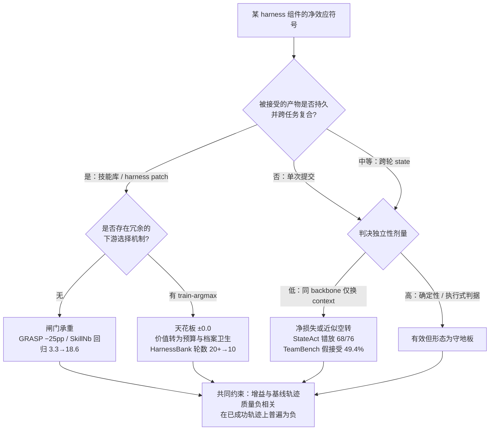

## 核心结论

在受控证据范围内，"哪个组件在起作用"这个问题问错了：外置 state、fresh-context 执行与独立验证三者的净效应都与**基线轨迹质量负相关**，收益集中在原本会失败的轨迹上，在原本已成功的轨迹上普遍为负——因此组件不是可加的能力增量，而是条件性的失败修复，其净效应符号取决于评测集的失败率构成，而非组件本身。

## 1. 归因缺口的形状

[[Papers/2608-LongHorizonHarness]] 把 long-horizon 执行重构为 task-state management 问题，用 Manage-Execute-Audit 循环同时引入三项变更：task state 外置在执行之外、executor 每轮 fresh context 且为唯一可改环境的角色、read-only auditor 独立取证判定完成。WeaveBench PassRate 从 51.8% 升至 80.7%，Terminal-Bench 2.1 从 69.7% 升至 77.2% 且少用 24% token。但全文不出现 "ablation" 一词，三项变更的净贡献无法分离；OSWorld 2.0 的 2.8%→8.3% 还叠加了从官方 GUI-only baseline 到作者自建 hybrid GUI+CLI 工具池的工具面变更。

这不是孤例，而是该文献族的结构性特征。[[Papers/2606-RecursiveAgentHarness]] 明确声明不做消融（"We do not ablate individual design choices such as recursion depth, the number of entries per subagent, or the code-execution versus tool-call spawning path"），且未测量 token 开销，其 71.75%→81.36% 同时变动了递归扇出、per-entry fresh context、regex 到 LLM 推理的替换、工具面（增加 web search）与总算力。[[Papers/2512-ASGSI]] 给出完整的审计式自我改进架构与威胁模型，但无任何 benchmark 实证。

共同模式是：**harness 论文报告 bundle 级增益，把归因留给读者**。这使得"独立验证是关键机制"这类主张缺少直接证据，也使跨论文的组件级比较无法进行。

## 2. 证据矩阵

只收录做了组件级隔离或提供了匹配对照的工作。"净效应"一列均为论文自报的消融差值。

| 工作 | 被隔离的组件 | 对照口径 | 净效应 | 证据强度 |
|:--|:--|:--|:--|:--|
| [[Papers/2607-StateAct]] | act-on-state / finish gate / context management 三项分别移除 | 同 backbone 同 benchmark，OSWorld 2.0 108 任务 | mean partial 61.6% → 51.3%（去 act-on-state）/ 57.5%（去 gate）/ 58.7%（去 context mgmt）；bash-only 45.9% 低于 reference 54.8% | 强：三项独立可比，且 bash-only 排除"只是给了 shell" |
| [[Papers/2605-TeamBench]] | Verifier 角色整体移除 | 155 任务 reference ablation，Gemini-3 Flash 固定 | 移除 Verifier 使 mean partial **上升** 5.5 分；per-task 验证价值均值 −5.8 | 中：单模型、无 CI/显著性检验；Table 12 显示符号随模型翻转 |
| [[Papers/2607-HarnessBank]] | 2σ 验收 gate | TB2，evolver 与 task agent 异族 | Test Pass@1 变化 **±0.0**；但 false elites 2→0、收敛轮数 >20→10 | 强（消融本身）；无算力匹配对照 |
| [[Papers/2605-GRASP]] | 验收闸门 + 算力配平对照 | MedAgentBench，同探针预算但丢弃验证结论 | 去闸门 88.8% → 63.5%（K=4）/ 40.1%（K=1）；**算力配平对照塌回 67–71%** | 强：唯一提供 compute-matched control 的工作；但该笔记无 Evidence Ledger，状态为 legacy-unverified |
| [[Papers/2606-SkillNb]] | gate 移除 | 258 任务 hard subset | SR 38.4% → 32.6%（−5.8）；**回归率 3.3% → 18.6%** | 强 |
| [[Papers/2607-ProgressiveDisclosure]] | 渐进披露（routing 深度 + 索引位置） | 3 harness × 3 模型 × 3 方法，指令/分块/verifier 固定 | Codex/gpt-5.4-mini 三子集全部落在误差内；Claude-Code/haiku En.MC 0.7448 → 0.8667 | 中：无 token 预算匹配；harness 与模型部分混淆 |
| [[Papers/2607-HarnessEvolution]] | harness 版本（模型 pin 死） | Qwen Code 35 个连续 release，单一自建 Qwen3-Next-80B 端点，50 任务 × 2 run | resolve rate 23.0%–39.0%，ρ=0.208 p=0.231 **无显著趋势**；token ρ=0.743 p<0.0001，391K → 668K | 中：效率信号强；效果信号可能落在 50 任务二项噪声内 |
| [[Papers/2607-MANTA]] | Topology Planner / mutation / playbook | 组件逐项移除 | 71.7 → 57.5（去 initial planner，−14.2）/ 60.8（去 mutation）/ 66.7（去 playbook） | 中 |
| [[Papers/2605-MetaTeam]] | 组织结构与层级 | 逐级消融 | 40.8 → 44.5 → 49.8 → 53.9；去 L1 降幅最大 | 中 |
| [[Papers/2606-GUIvsCLI]] | 交互模态 | 440 任务，同目标、同初态、同 executable verifier | 最强 screen-only GUI 59.1% **高于**最强 original-skill CLI 48.2% | 强：文献中唯一 matched 的模态对照 |
| [[Papers/2608-ScreenshotsOrTools]] | MCP 工具注入 | 同 8B backbone，harness/retriever/prompt/toolset 固定 | Thinking +4.0pp / Instruct −5.9pp，均超 2 SE | 强 |
| [[Papers/2606-SkillMemoryBudget]] | memory/skill 库 | token-matched vanilla（同预算换 15 步） | 3 模型 × 3 WebArena 域聚合 SR 被 vanilla 追平或反超 | 强 |
| [[Papers/2510-ContextFolding]] | FoldGRPO 过程奖励 | 与 plain GRPO 对照 | plain GRPO 训出相反行为 | 中 |

## 3. 四条轴上的发现

### 3.1 验证角色的净效应符号不稳定，且不稳定是可解释的

同一个"独立验证"组件在不同工作中给出方向相反的消融结果：[[Papers/2605-GRASP]] 去掉闸门损失 25 个百分点，[[Papers/2607-HarnessBank]] 去掉 gate 后测试指标纹丝不动，[[Papers/2605-TeamBench]] 去掉 Verifier 分数反而上升 5.5 分。把这三者当作互相矛盾是误读——它们门控的对象不同。

决定符号的是两个变量：**被接受产物的持久性**，以及**判决的独立性**。GRASP 与 SkillNb 门控的是要写进技能库、会在所有后续任务上复用的产物，一次误收的代价被无限次摊放，因此闸门承重；TeamBench 门控的是单次提交，签或不签之后运行即结束，误拒的代价立刻兑现而误收的代价不复合，因此一个与生产者同能力层的验证者是净损失。HarnessBank 的 gate 产物同样持久，但它的部署选择由 train-argmax 独立完成，gate 的边际贡献因此被挤到零——它实际充当预算分配器与档案守门员，把收敛轮数从 20 以上压到 10、把假精英从 2 个压到 0。

这解释也预测了 [[Papers/2608-LongHorizonHarness]] 的位置：它的 auditor 门控的是跨轮持久 task state，持久性中等（误收可在后续 25 轮内被推翻），独立性低（auditor 与 executor 是同一个 Qwen 3.7-Plus，只是 context 不同）。

### 3.2 独立验证的"独立性"是有剂量的，低剂量已被证明失效

[[Papers/2606-CodeSelfReviewCollapse]] 给出了理论边界：当门控信号来自模型自身时，被门控的分布退化为未门控分布（Theorem 2.3，"filtering becomes mathematically identical to no filtering"），通过率上升而正确率下降；Theorem 2.6 给出正向条件，要求校准误差有界。

实证侧的剂量阶梯已经成形：

| 独立性剂量 | 实现方式 | 实测判决质量 |
|:--|:--|:--|
| 低 | 同 backbone、仅 context 不同 | [[Papers/2607-StateAct]] finish gate 在 76 个 non-perfect 任务上正确拒绝 8 个、错误放过 68 个（≈90% 错误率）；[[Papers/2605-TeamBench]] 池化 false-accept 49.4%（Wilson CI [45.9, 52.9]）对 false-reject 6.6% |
| 中 | 异族模型 | [[Papers/2607-HarnessBank]] evolver 用 Claude Opus 4.8、task agent 用 Qwen3.6-27B；未报告 false-accept/reject 率 |
| 高 | 确定性检查 / 执行结果 / 统计判据 | [[Papers/2605-GRASP]] 留出探针集上的净修复计数；[[Papers/2606-SkillNb]] 执行式 gate；[[Papers/2607-HarnessBank]] 配对 t 统计量 z ≥ 1.96 |

低剂量一栏里，[[Papers/2607-StateAct]] 是唯一测了判决准确率的：它的 finish gate 与 LongHorizon-Harness 的 auditor 是同一设计原则——fresh context、看不到 trajectory 与 rationale、禁止 mutation、重新读取真实 deliverable——并且跑在同一个 benchmark（OSWorld 2.0）上。StateAct 直接测了这个验证者的判决准确率，结果是错误放过 68/76。它能抓 missing file、wrong path、format mismatch 这类结构缺陷，抓不到 value correctness。LongHorizon-Harness 从未报告其 auditor 的 verdict 准确率。

TeamBench 还量化了一个被忽略的失效：其 Verifier 的假接受率随模型从 36.3%（GPT-5.4 Mini）到 77.0%（Gemini-3 Flash）跨越一倍以上，意味着"用独立 auditor"这一设计规则的有效性本身是模型相关的，不能作为无条件的 harness 设计结论。

### 3.3 Context 管理的净效应与 harness 基线强度呈交互，不是可加项

[[Papers/2607-ProgressiveDisclosure]] 是这条轴上唯一的受控研究：固定任务指令、分块集合、确定性 verifier 与 agent 版本，只改变文件系统侧的 routing 深度与索引位置。结论是渐进披露在 Codex 上三个子集全部落在误差内，在 Claude-Code/haiku 上 En.MC 从 0.7448 升到 0.8667。论文给出的机制解释是关键：裸 Codex 在 raw 条件下自己 grep 实体名并只读命中段落，运行时重建了 locate-then-read，预建的披露包因此冗余。作者自己的措辞是，对这类 agent 披露买到的是"检索路径的可控性，不是准确率"。

规模会翻转结论：多书 K=20 时 Codex En.QA raw 0.257 对 flat 0.462，Zh.QA raw 塌到 0.043。反向失效同样存在——分层结构在单书上从不优于扁平，并把 Pi En.MC 从 0.9126 压到 0.6398。

该研究的方法学缺口与本主题高度相关：**没有 token 预算匹配对照**。K=20 时 raw 每问题 68.3M token、flat 32.5M，更准且更省被作为两个共同观察到的事实报告，而非受控结果。[[Papers/2606-SkillMemoryBudget]] 在相邻问题上做了这个对照并得到否定结论——补上 token-matched vanilla 后，memory/skill 库的增益被追平或反超。

### 3.4 工具面是最常见的未受控变量

[[Papers/2608-LongHorizonHarness]] 的 OSWorld 增益叠加了 GUI-only 到 GUI+CLI 的变更，这在文献中属于常态而非疏漏。[[Papers/2606-GUIvsCLI]] 提供了目前唯一 matched 的模态对照——440 任务、18 应用、同目标同初态同 executable verifier——结论与直觉相反：最强 screen-only GUI 达 59.1%，高于最强 original-skill CLI 的 48.2%。这否定了"加 CLI 必然更强"的无条件版本，也意味着在 OSWorld 上把 baseline 换成同样的 hybrid 工具池后，MEA 的净贡献既可能缩小也可能扩大，方向不能先验断定。

[[Papers/2608-ScreenshotsOrTools]] 在固定 8B backbone 与固定 harness 下测得 MCP 注入对 Thinking 模型 +4.0pp、对 Instruct 模型 −5.9pp，两者均超 2 SE——工具面变更的效应符号同样是模型相关的。

## 4. 跨论文的收敛与冲突

**收敛（三条独立证据链指向同一形状）**：组件收益集中在失败轨迹上，在已成功轨迹上为负。

- [[Papers/2605-TeamBench]] 按 Solo 分数五分位分层：Q1（Solo 0.00–0.22）团队 +15.7（95% CI [5.8, 25.7]），Q2 +8.8，Q3–Q5 团队**落后** Solo 6.8 到 10.1；全局平均提升仅 +0.5（p=0.20）。
- [[Papers/2608-LongHorizonHarness]] 自身数据同形：Qwen 基线 ≤0.04 的 6 个任务全部回到 0.30–0.92（抬失败地板），而基线已达 83.3 的 Desktop 域只 +5.6 pt 且 **mean score 反降**（0.8671→0.8465）。
- [[Papers/2607-ProgressiveDisclosure]]：增益在 agent 自身导航能力弱时大，在 harness 已能自行分而检索时趋近零。

三者分别来自多智能体协调、long-horizon harness 与长上下文管理，机制不同而形状一致。这也重新解释了 [[Papers/2606-SkillNb]] 的结果——去掉 gate 对成功率只掉 5.8 分而回归率从 3.3% 爆到 18.6%，即 gate 的价值本就在守地板。

据此可以提出一条可证伪的论断：**目前没有任何受控证据显示独立验证提升了能力上限；所有被测出的验证收益都是"避免回归 / 抬失败地板"形态。** 这是对文献计量规律的归纳而非受控复现，不能用于反驳任何单篇工作，但足以要求后续 harness 论文按基线质量分层报告增益。

**冲突（尚未解决）**：固定 backbone 是否足以支撑"增益归于 harness"。[[Papers/2606-RecursiveAgentHarness]] 与 [[Papers/2607-HarnessEvolution]] 采用同一设计——pin 死模型、只变 harness——却得到相反结论：前者报告 +9.61 分并归因于 harness，后者在 35 个连续 release 上测得 resolve rate 无显著趋势（ρ=0.208, p=0.231）而 token 单调增长 70% 以上。差别在于前者无消融、无算力测量、baseline 直接引用他文报告值（置信区间只 bootstrap 自己那 199 个分数，baseline 侧抽样误差为零），且其"全部 bucket 一致增益"的表述与 Table 3 中 4/13 个 bucket 低于 baseline 相矛盾。结论是**固定 backbone 是必要但很弱的控制，不能在 harness 内部完成归因**。

## 5. 归因结构

## 6. 空白分层

**L1——只需重跑现有 setup 即可关闭，无需新方法**

1. LongHorizon-Harness 的 auditor 移除消融：固定 manager 与 fresh-context executor，只删掉 auditor（或让 auditor 看得到 executor 轨迹），测 WeaveBench PassRate 降幅。这是该文核心机制主张的唯一直接检验。
2. 同一 setup 下报告 auditor 的 verdict 准确率（对照 ground-truth 完成判定）。StateAct 在同 benchmark 上测得同类验证者约 90% 错放率，LongHorizon-Harness 未测。
3. OSWorld 的 tool-matched 重跑：把 baseline 也换成 hybrid GUI+CLI 单轨迹跑一遍。这是当前从该文最容易提取的可发表增量。
4. ProgressiveDisclosure 的 token 预算匹配 raw 臂；RecursiveAgentHarness 的 depth-1 对 depth-3，以及预算匹配的单 agent 分块基线。

**L2——需要新设计的对照，但方法学清晰**

1. **验证独立性的剂量-响应曲线**：在同一任务、同一总预算下，把验证者依次设为「同 backbone 同 context」「同 backbone 不同 context」「异族模型」「确定性检查」，测判决准确率与端到端成功率。目前四个剂量点散落在四篇不同论文的不同 benchmark 上，无法比较。
2. **算力配平对照的普及**：GRASP 的做法（花掉同样的验证预算但丢弃验证结论）是分离"验证行为"与"验证结论"的决定性设计，目前只有一篇工作做了。
3. **按基线质量分层报告**：把 Solo/baseline 分数分位作为一等自变量。TeamBench 已示范，但其分层用了与差值同一个观测，存在未讨论的均值回归；需要用独立观测分层。

**L3——open problem，无现成方法**

1. 当 acceptance criteria 本身可能被误解时，独立审计只会把错误固化得更自信。LongHorizon-Harness 自己写出了这一点（"a misinterpreted contract can still lead to a confidently verified wrong answer"），StateAct 的失败审计给出了同构证据（79 个 non-perfect 任务中 38 个是 wrong value 或 misread instruction 类推理错误，独立 context 会复现同一错值）。如何检测 contract 误解，目前无人给出机制。
2. 验证在已成功轨迹上的负效应机制未知：是额外修改破坏了正确产物，还是验证轮次挤占了执行预算？两者的干预方式完全不同，现有工作都只报告了现象。
3. 判定基准本身的效度。TeamBench 的三个 LLM judge 在看得到确定性判决时 Fleiss κ=0.74、看不到时降到 0.07，作者据此声明"neither variant as independent grader validation"——"是 Verifier 错还是 grader 错"这一问题在该文中并未解决。

## 7. 对 LongHorizon-Harness 的具体含义

该文的核心机制主张——"executor 的完成声明不进 state，只有 auditor 从环境取到的证据才进"——目前没有直接证据支持，且有三项间接证据指向它被高估：同 benchmark 同设计原则的 StateAct 验证者错放 68/76；TeamBench 中同能力层验证者假接受 49.4% 而假拒绝仅 6.6%；理论侧 CodeSelfReviewCollapse 证明同源信号门控退化为不门控。而该文的 auditor 与 executor 恰是同一个 Qwen 3.7-Plus，只是 context 不同——即上述低剂量配置。

同时，该文最干净的证据并不在其主张的机制上：Terminal-Bench 2.1 是纯 CLI、无视觉、无 GUI/CLI 路由，收益仍在（69.7%→77.2%）且 token 少 24%。这条结果不受工具面混淆影响，但也同样无法区分是外置 state、fresh-context 执行还是独立审计带来的。

**最小决定性实验**：在 Terminal-Bench 2.1 上跑四臂——(a) 原生 Claude Code baseline；(b) 只加外置 task state，无 fresh context 重置、无 auditor；(c) 加 fresh-context executor 与结构化交接，无 auditor；(d) 完整 MEA。四臂总 token 预算配平。(c) 对 (b) 的差值给出 context 重置的净贡献，(d) 对 (c) 的差值给出独立审计的净贡献。该文已报告 auditor 占 token 的 38.1%（Terminal-Bench），因此预算配平会把这部分算力还给 (c)，这正是 GRASP 式配平对照的要义。

## 调研日志

**检索范围与覆盖限制**

- 外部检索通过 arXiv API 完成。WebSearch 在本次执行环境中持续返回 API 错误（`output_config.effort 'xhigh' is not supported when thinking is disabled`），三次重试均失败，属环境级故障而非查询问题；Semantic Scholar API 全程 429；Lexmount `dump` 对 arxiv.org、export.arxiv.org 与 huggingface.co/papers 稳定返回 502，`extract` 可用但对 arXiv 搜索页只暴露 top-1 结果（以 `query=GUI+agent` 复核确认），不具备发现广度。
- OpenAlex 四次查询返回 AEC 行业综述、心理治疗 LLM、教育评论等离题结果，原因是该主题主要以 2026 年 arXiv 预印本形式存在而非期刊索引；据此放弃该通道并保留日额度。
- 上述限制意味着本报告的覆盖以 arXiv 为主。所有"未发现"表述均应读作**在当前检索范围内未发现**，不构成"无人研究"的断言。

**本次新增的 5 篇**：[[Papers/2605-TeamBench]]、[[Papers/2607-HarnessEvolution]]、[[Papers/2607-ProgressiveDisclosure]]、[[Papers/2606-RecursiveAgentHarness]]、[[Papers/2607-HarnessBank]]。均为 full-text、source-checked，claim 合计 115/115 source-verified。每篇的 claim 由独立于起草者的 verifier 核查。

**证据强度的两处保留**

- [[Papers/2605-GRASP]] 无 Evidence Ledger 与 `verification_status` 字段，按协议应视为 legacy-unverified；它同时是全表唯一提供算力配平对照的工作，因此其结论在本报告中承重较大，建议补做 source check。
- [[Papers/2607-HarnessEvolution]] 存在至少四处内部数字冲突（同一版本的 token 增幅在 §5.4 与 §8.2 分别为 52%/131% 与 139%/182%，v0.5.0 的 token 与 resolve rate 各有两个值），且复现包尚未公开；其效率结论（ρ=0.743）可用，单版本数字不宜下游引用。另需注意其 50 任务上的 per-release resolve rate 抽样标准差约 4.6–6.5 个百分点，观测到的 16 个百分点跨度与纯二项噪声同量级——"各版本效果差异显著"的表述不成立，但这一测算来自本报告而非原文。

**后置 gap 检索**（3 query，1 轮，符合上限）发现两篇未收录的相关工作，留作后续：`2608.00017` Memory Reward Inflation in Self-Improving LLM Agents（直接对应 rubber-stamp 轴）、`2606.06741` OpenSkill。`2512.23760` 已收录为 [[Papers/2512-ASGSI]]。

**建议加入 DomainMaps**：[[DomainMaps/GUI-Agent]] 的 `Pattern 4`（预算匹配对照是方法可信度的首要筛选条件）已覆盖预算维度，建议增补一条平行 Pattern——**组件收益与基线轨迹质量负相关**，证据为 TeamBench 五分位分层、LongHorizon-Harness 的 Desktop 域 mean score 反降、ProgressiveDisclosure 的 harness 交互三项，操作含义是本 domain 的自有实验须按基线分数分层报告增益，且分层观测须独立于差值观测以避免均值回归。另建议在 `Pattern 3`（Self-improving 验证偏差）下补记验证独立性的剂量阶梯与 StateAct 的 68/76 错放率。
