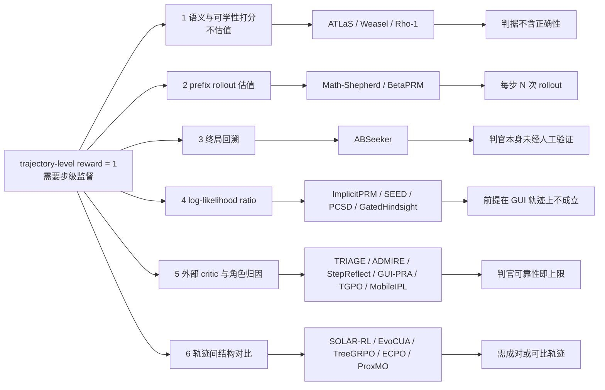

## Overview

从 trajectory-level 的 0/1 reward 反推步级监督，实质上是在两个不同的问题之间做选择——哪一步重要，和哪一步对。

区分这一族方法的三条轴：

- **打分信号从哪来**：语义判据 / prefix rollout 估值 / 终局回溯 / log-likelihood ratio / 外部 critic / 轨迹间结构对比。信号来源决定标注成本，也决定失效模式。
- **信号衡量的是什么**：与目标的相关性、前缀的价值、该步的正确性、模型对该步的可学性。四者常被混用为同一个"step score"。
- **信号如何被消费**：SFT 阶段的 loss mask 与 token 加权，还是 RL 阶段的 reward shaping 与 advantage 重分配。

这三条轴不是正交的分类练习，而是决定一个方法能否回答"轨迹整体 reward=1、但其中若干步是错的，怎么办"这个具体问题。**SFT 侧的两条代表性选步工作并不回答它**：[[Papers/2503-ATLaS]] 用 GPT-4o 按 Plan Creation / Critical Observation / Critical Action / Self Correction 四类语义标准挑步，[[Papers/2605-Weasel]] 用 goal-state 语义相关度加两两差异度做固定预算的子集选择——两者的判据里都没有"这一步对不对"这一维，且都明确假设输入是专家轨迹。一个错误但与目标相关、且与其他步骤不重复的步骤，会被这两类选择器选中并加权。

真正把正确性纳入判据的信号来自另外几族：prefix rollout 估的是价值而非正确性，只在"错步会显著降低成功概率"时与正确性重合；终局回溯与外部 critic 直接判对错，代价是引入一个本身会错的判官；log-likelihood ratio 提供免费的分解，但它的推导前提在 GUI 轨迹上并不成立。

评测层面存在一个结构性偏斜：数学推理域因为答案可自动校验，成了这条线的发源地与主要实验场，而 GUI / Web agent 恰恰是缺少可自动校验终局信号的场景。把数学域的结论平移到长轨迹 GUI 训练，中间隔着至少三个未被检验的假设（step 边界的定义、outcome label 的噪声、observation token 是否计入分解）。

## 技术路线

这条线的起点是 process reward model 的标注成本。PRM 相比 outcome reward model 能定位错误位置，但训练它需要逐步人工标注；[[Papers/2312-MathShepherd]] 在 2023 年底把这一步自动化——从中间步的前缀出发采样 N 条后续路径，按是否命中 golden answer 给该步打分，从此不再需要人标。一年后 [[Papers/2412-ImplicitPRM]] 把成本进一步压到零：只要把 outcome reward 参数化成 policy 与 reference model 的 log-likelihood ratio，逐 token 的 log-ratio 累加就恰好是该前缀的 Q value，process reward 成为 ORM 前向计算的副产品。两篇工作合起来定义了"outcome-only 反推 step-level"这个问题的上下界——一端是每步 N 次完整 rollout，另一端是零额外开销。

但两篇都在单轮数学解题上验证，而把它们搬到 agent 轨迹上时，最先断裂的不是算法而是前提。数学题有唯一可自动校验的答案，agent 任务的成败判定往往来自一个学出来的 verifier；数学解题的 step 是自然的文本片段，agent 的一个 step 是一次 action 且与前后强耦合；数学解答整条由 policy 生成，agent 轨迹里穿插着截图和工具返回这类非 policy 生成的 token。2025 年之后 GUI / Web 侧涌现的方法，多数是在绕开这三处断裂中长出来的，而不是在改进 Math-Shepherd 的估值精度。

### 语义与可学性打分：不做估值的直接选择

这一族不估任何价值，直接用一个外部判据给步骤打分，因而成本最低、也最不触及正确性。

ATLaS 的判据是四类语义角色，硬约束是每条轨迹最多选 30% 的步骤，SFT 时保留完整轨迹作为输入、只在选中步骤的 token 上算 loss。在 AgentGym 上 held-in 均分从 60.52 提到 65.91。它最有力的证据是同预算对照：同样只训 30% 的步骤，改选 selector 排除掉的那批，held-in 掉到 56.17、held-out 掉到 29.88，都低于全轨迹训练——被排除的步骤确实带进了负向偏置，而不只是"训得少所以少过拟合"。

Weasel 把同一件事写成显式的优化问题：目标函数是每步与 goal 的 BERTScore 加上步骤之间两两差异度（状态侧与动作侧取 max），用贪心求解，并在 1,877 条轨迹上穷举验证贪心在 96% 以上的轨迹里等于精确最优。在 AgentTrek 上只留 10K/52K 的步骤就在 WebArena / MiniWob / WorkArena 上全面超过全量 SFT，训练时间从 136 小时降到 12 小时。它的 diversity 消融给出一个可直接复用的结论：只看状态差异是 9.7、只看 reasoning/action 差异是 13.9、取 max 是 14.5——在 web 轨迹里"做了不同的事"比"看到了不同的页面"更能刻画有效覆盖。

[[Papers/2404-Rho1]] 是同一逻辑在 token 粒度上的版本，也是这一族里唯一给出打分函数动态化设计的工作。它先在高质量语料上训一个 reference model，再用 excess loss——当前训练模型的 token loss 减去 reference loss——排序，每个 batch 内只对 top-k% 的 token 算 loss。分数依赖训练模型的当前状态，因此是一个 curriculum 而非静态过滤器。但它度量的是"相对参考分布还有多少可学空间"，全程不使用任何结果信号；把它搬到轨迹上等价于假设 likelihood 差可以代理对成败的贡献，这个假设该工作既未提出也未检验。

三者共同的边界是同一条：判据里没有正确性。ATLaS 的四类语义角色、Weasel 的目标相关度与非冗余、Rho-1 的可学性，都不区分一个步骤是"关键且正确"还是"关键且错误"。

### Monte-Carlo prefix rollout：把 outcome 信号摊到前缀

Math-Shepherd 把 step quality 定义为"该步推出正确答案的潜力"，用 hard estimation（任一 completion 命中即标 1）或 soft estimation（命中频率）给标签，实际发布的模型用的是 HE，因为它可以用两个 special token 走标准 language modeling pipeline。在 best-of-256 重排上，DeepSeek-67B 达 GSM8K 93.3 / MATH500 47.0，配 self-consistency 后 48.1。

这个定义是价值定义而非正确性定义，作者本人在正文里就承认它引入噪声。一个错误但可被后续步骤纠正的步骤，只要有一条 completion 命中就被标为 good；一个正确但 completer 能力不足的步骤会被标为 bad。唯一连接标签与正确性的证据是 160 个人工标注 step 上的 86%——而这个数字用的是 LLaMA2-70B completer + N=4，实际建数据集用的是 LLemma-7B + N=8，后者的标注准确率正文没有给出。更麻烦的是 N 增大后准确率反而下降（作者归因于 false positive），意味着"多花 rollout 买更准的标签"这条直觉不成立。

成本方面，该方法需要每步 N 次完整 completion，作者把它列为第一条 limitation，却没有给出任何 wall-clock、GPU-hours、FLOPs 或总 rollout 数。这给后续以"降低标注成本"为动机的工作留下一个结构性麻烦：基线成本必须由引用方自行重建。ATLaS 给出了长轨迹侧唯一可引用的量级——2000 条平均 25 步的轨迹按 IPR 的做法估值至少需要 6.5×10⁵ 次推理，它据此判定这条路线在 agent 轨迹上不可行。

[[Papers/2605-BetaPRM]] 针对的是这一族的统计缺陷：k/N 只是有限样本估计，把它当点目标回归会过拟合采样噪声，因此改用 Beta 分布同时建模 process reward 的均值与可靠性，并据此做自适应终止。这条改进方向与 Math-Shepherd 自己的观察吻合——SE 随 N 增大越来越贴近人工分布，但用 SE 或 HE 训出的 verifier 性能没有实质差别，说明点估计的精度不是瓶颈。

### 终局回溯：从答案反查哪一步提供了证据

[[Papers/2608-ABSeeker]] 走的是另一条路：先从最终答案回溯出解题所需的线索，再按线索是否被某一步提供来给该步打分。评分是一套显式 rubric（+0.8 / +0.4 / −0.8 / +1.0 / −1.0，基准 1.0，裁剪到 [0, 2.0]），因而是这批工作里少数直接给出"这一步是错的"这一判定的。

它的 Figure 4 是全域最直接的问题量化：**成功轨迹里约 4% 的步骤得分低于 1.0，失败轨迹里约 10% 的步骤得分高于 1.0**。这两个数字同时说明了 outcome-only 监督为什么是错配的——成功不蕴含每步都对，失败也不蕴含每步都错——以及错配的规模并不巨大。需要注意的是这两个比例本身由同一套自动 rubric 产生，没有人工验证。

### 隐式 credit：log-likelihood ratio 自带的分解

ImplicitPRM 的结论是 credit 的分解可以是免费的：只要 reward 的参数化本身逐 token 可分解，前缀 log-ratio 累加就是该前缀的 Q value，无需第二次训练也无需 step 标注。在 MATH-500 的 best-of-N 上 DPO 变体均分 50.4，超过作者自己复现的 Math-Shepherd（47.8），而开发 FLOPs 约为后者的 1/38.8。它最有信息量的是负结果——把复现的 Math-Shepherd step label 喂回去做第二阶段训练，九个 cell 无一致提升——这反过来支撑了"outcome-only 训练已经把步级信息学到了"这一主张。

同一个量在 agent 侧被赋予了完全不同的含义。[[Papers/2607-SEED]] 用 skill 模型与 policy 的 token loss 差经 sigmoid 门控出置信度，Qwen2.5-3B 在 ALFWorld 达 91.8%（GRPO 75.0），且用 60% 数据就超过 GRPO 用满数据的结果。[[Papers/2608-PCSD]] 把单点的 log-prob 差换成该差值在前向窗口上的**持续性**，与 SEED 共享全部超参、只差这一处，构成这一族里最干净的对照：ALFWorld 90.6 对 84.4。PCSD 还给出了一个诊断量——教师质量与权重的对齐相关性，PCSD 是 +0.174 / +0.052，而单点版本是 **−0.489 / −0.208**，即教师越差、单点方法给的权重反而越高。

[[Papers/2608-GatedHindsight]] 属于同族但换了信息源：把训练时可见、推理时不可见的下一帧截图交给一个参数共享的 teacher，让它对 student 的 rollout 重新打分，只有当 student 失败且 teacher 的 top-1 恢复了示范动作时才放行该步的监督。AndroidLab 从 31.93 提到 43.10（7B）、37.43 提到 54.11（8B）。

三者与 ImplicitPRM 的关系值得单独指出：同一个"policy 对参考模型的 log-prob 差"，在 ImplicitPRM 里被当作 Q value 读，在 Rho-1 里被当作可学性读，在 SEED / PCSD 里被当作 token 权重读。三种读法各自都有实验支撑，但没有工作比较过它们在同一批数据上给出的步骤排序是否一致。

### 外部 critic 与角色化归因

这一族训练或调用一个独立判官给步骤打分，是 GUI 侧数量最多的一支。

[[Papers/2606-TRIAGE]] 的设计最锋利：让一个 thinking 模型把轨迹片段归到 decisive / exploration / no-progress / regression 四类角色，再按固定常数（1, 0.5, −0.1, −0.5）乘系数加到 outcome advantage 上，判官只看前后各 5 组 action-observation、看不到最终结果。ALFWorld 7B 从 79.6 提到 87.5、WebShop 从 70.1 提到 77.2。它的消融把贡献定位得很清楚：去掉 regression 系数代价是 ALFWorld −6.1 / WebShop −4.1，去掉 exploration credit 只有 −1.7——主要贡献是**压制成功轨迹里的回退步骤**，而不是奖励探索。

[[Papers/2602-ADMIRE]] 用 GPT-4o 从环境验证过的成功 rollout 里蒸馏有序 milestone，再按命中情况做非对称 credit：成功轨迹只奖励命中 milestone 的步骤（去噪），失败轨迹给进度分加 milestone 分（脚手架）。AndroidWorld 7B 从 base 32.8 → outcome-only 39.7 → ADMIRE 44.0；在 MobileMiniWob++ 上 outcome-only 反而把 57.6 打到 51.1，而 ADMIRE 是 61.1。但它判定 milestone 命中的方式是把 **agent 自己写的动作描述**与 milestone 文本做 SBERT 余弦并卡 0.75 阈值——这是一个自报进度的通道，论文没有测试它是否可被 hack。

[[Papers/2608-StepReflect]] 把 per-step reflection 重构成条件于显式 transition specification 的结构化预测，8B 模型在 AndroidWorld 的 1,082 条人工核验 transition 上达 82.16%，超 zero-shot 前沿模型 11.83 个百分点。它测的正是其他方法默认成立的东西——判官在自己的设置下有多准。[[Papers/2607-OSReward]] 把这件事做成横向测量：27 个 judge 在整体上最好 89.7%，但在 Hard 子集上最好只有 69.7%、均值约 52%，并且存在共同的宽松偏置——判官更愿意采信 agent 的自述而不是去核对截图。

[[Papers/2500-GuiPraProcessReward]]、[[Papers/2509-TGPO]]、[[Papers/2505-MobileIPL]] 属于同族的 GUI 实例：分别在 process reward 里加入动态记忆与自适应 UI 感知、把语义等价的状态在树上合并以消除偏好标签冲突、以及把叶节点规则奖励沿 CoaT 树回传后做 T-DPO。这三条的定位可靠，但其报告数字尚未见独立验证。

### 结构对比：fork point、树与失败定位

最后一族不给单步打绝对分，而是通过轨迹之间的结构差异推出相对信号。

[[Papers/2604-SOLAR-RL]] 在离线设定下对每步采 N 个候选、与 ground-truth 动作标签逐一比对，在首个失败点做回溯截断，再经三段式归一化给出奖励；代价是需要 ground-truth 动作标签，这在有标注数据集（AndroidControl、GUI-Odyssey）上成立、在自采轨迹上不成立。[[Papers/2601-EvoCUA]] 在 SFT→RFT 之后于首个分歧点做 step-level DPO，OSWorld-Verified 达 56.7%；其后续 [[Papers/2607-EvoCUA15]] 用 STEPO 把轨迹级 advantage 按步数均分回每一步以恢复 group 内零和，达 63.2%。[[Papers/2509-TreeGRPO]] 用先初始化再扩展的树采样，在同预算下拿到约 1.5× 的样本，用兄弟子树的回报差当步级信号，1/4 预算即超过 chain GRPO。[[Papers/2602-ProxMO]] 用极化信号控制器加基于邻近度的软聚合，在 +1.09% 开销下相对 GRPO 有明显提升。

[[Papers/2606-ECPO]] 是这一族的统计学批评：在有限 rollout 下"更密不等于更好"——同一 anchor 处罕见的幸运动作会按观测 return 拿到过大 advantage，这类 divergent anchor 在训练过程中从 9% 涨到 28%，造成后期振荡。它的修正是把低计数的动作分组向 anchor 均值收缩，并压低 within-action 噪声占优的 anchor 的权重，Qwen2.5-1.5B 上相对 GiGPO 拿到 ALFWorld +5.2pp / WebShop +7.3pp，advantage 计算开销只增加 0.10%。

### 消费端：SFT loss 加权与 RL advantage 塑形

同一个步级分数可以被两种方式消费，而它们的收益并不对称。

[[Papers/2608-ABSeeker]] 是唯一在同一套 rubric 下跑完两端的工作：ABC-SFT 把分数映射成 [0.24, 1.76] 的 token 权重，均分从 28.5 提到 30.8，但在 xbench-2505 上从 73.0 掉到 72.0；ABC-GRPO 把分数以 γ=0.25 折进 advantage，均分从 33.5 提到 37.3。同样的信号在 RL 侧净增益更大。一个合理但未经检验的解释是：SFT 侧的权重只能重新分配对已有示范的模仿强度，样本分布不变；RL 侧的 advantage 改变的是采样分布本身。这个对照只有单一来源，尚未见独立验证，且两个 GRPO 行都从同一个 ABC-SFT checkpoint 出发，缺 Standard-SFT × ABC-GRPO 这一格。

数学域给出的是相反方向的读数。Math-Shepherd 的 step-by-step PPO 把 Mistral-7B 的 GSM8K 从 77.9 提到 84.1，但 ORM-PPO 已经拿到 81.8——步级粒度的净增量只有 +2.3（GSM8K）与 +1.7（MATH）。ImplicitPRM 补上了另一半：额外的 step label 对已经用 outcome-only 训好的模型没有增益。两条合起来说明在短链条推理上 outcome reward 已经接近够用，作者自己也把 GSM8K 上 PRM 与 ORM 的小差距归因于步数少。

### 方法对照

| 方法 | 打分信号来源 | 是否判断对错 | 标注/算力成本 | 消费方式 | 验证域 | 关键证据 |
|:--|:--|:--|:--|:--|:--|:--|
| [[Papers/2503-ATLaS]] | LLM selector 四类语义角色 | 否（假设专家轨迹已正确） | 1 次 GPT-4o 调用/轨迹 | SFT loss mask（30% 步骤） | AgentGym 文本环境 | held-in 60.52→65.91；held-out 与 Random 30% 仅差 0.32 |
| [[Papers/2605-Weasel]] | goal-state BERTScore + 两两 diversity | 否 | embedding 前向，无 LLM 调用 | SFT 子集选择（19% 数据） | WebArena / MiniWob / WorkArena | 10K/52K 全面超全量；单独 pruning 把 MiniWob 59.4→40.3 |
| [[Papers/2404-Rho1]] | excess loss（训练模型 − reference model） | 否（衡量可学性） | 一个 reference model 的训练 | pretraining token loss mask | 数学语料 | 1.1B 均分 21.6→38.1；去掉外部语料只剩 +2.4~+3.3 |
| [[Papers/2312-MathShepherd]] | MC prefix rollout（HE / SE） | 部分（价值而非正确性） | 每步 N=8 次完整 completion | PRM → best-of-N + step PPO | GSM8K / MATH500 | 93.3 / 48.1；step 粒度相对 ORM-PPO 净增 +2.3 / +1.7 |
| [[Papers/2605-BetaPRM]] | MC 估计 + Beta 分布可靠性 | 部分 | 同上 + 分布拟合 | PRM 打分 + 自适应终止 | 数学 | 自适应终止省 33.57% token（尚未见独立验证） |
| [[Papers/2608-ABSeeker]] | 终局线索回溯 + 显式 rubric | 是 | 1 次 LLM judge/步 | ABC-SFT 权重 + ABC-GRPO advantage | deep research / xbench | 成功轨迹 ~4% 步骤 <1.0，失败轨迹 ~10% 步骤 >1.0 |
| [[Papers/2412-ImplicitPRM]] | policy/reference log-likelihood ratio | 部分（Q value） | 零额外开销（ORM 前向副产品） | best-of-N 重排 | MATH-500 | 50.4 vs 复现 Math-Shepherd 47.8；额外 step label 无增益 |
| [[Papers/2607-SEED]] | skill 与 policy 的 token loss 差 + 门控 | 否（衡量策略差距） | 需先建 skill library | 蒸馏权重 | ALFWorld / WebShop / search-QA | 91.8 vs GRPO 75.0；60% 数据即超 GRPO 全量 |
| [[Papers/2608-PCSD]] | log-prob 差在前向窗口上的持续性 | 否 | 同 SEED | token 权重 | ALFWorld | 90.6 vs 单点版 84.4；教师质量对齐 ρ +0.174 对 −0.489 |
| [[Papers/2608-GatedHindsight]] | teacher 见下一帧截图后重打分 | 是（要求 teacher top-1 复现示范动作） | 一次 teacher forcing | SFT 门控 | AndroidWorld / AndroidLab | AL 31.93→43.10；只给动作 −0.43，只给截图 +7.42 |
| [[Papers/2606-TRIAGE]] | LLM judge 给片段分四类角色 | 是（含 regression 判定） | 1 次 judge/片段 | GRPO advantage 加常数 | ALFWorld / WebShop / Search-QA | 去掉 regression 项 −6.1 / −4.1；no-thinking judge 跌破 GRPO |
| [[Papers/2602-ADMIRE]] | GPT-4o 蒸馏 milestone + SBERT 命中 | 部分（agent 自报进度） | milestone 蒸馏 + 每步 SBERT | 成功/失败非对称 credit | AndroidWorld / MobileMiniWob++ | 44.0 vs outcome-only 39.7；MMW 上 outcome-only 反降 57.6→51.1 |
| [[Papers/2608-StepReflect]] | 结构化 transition consistency 预测 | 是 | 四阶段训练一个 8B 判官 | 在线 reflection | AndroidWorld | 1,082 条人工核验 transition 上 82.16% |
| [[Papers/2604-SOLAR-RL]] | 与 ground-truth 动作标签逐步比对 + 首失败点截断 | 是（依赖标签） | 离线，每步 N 个候选 | 三段式 reward | AndroidControl / GUI-Odyssey | 零在线交互；需要 ground-truth 动作标签 |
| [[Papers/2601-EvoCUA]] / [[Papers/2607-EvoCUA15]] | 首个分歧点 / STEPO 均分回传 | 部分 | 需成对轨迹 | step-level DPO / GRPO | OSWorld-Verified | 56.7% → 63.2% |
| [[Papers/2509-TreeGRPO]] | 树采样中兄弟子树的回报差 | 部分 | 同预算下约 1.5× 样本 | GRPO advantage | 多跳 QA | 1/4 预算即超过 chain GRPO |
| [[Papers/2606-ECPO]] | 对 anchor 内 advantage 做收缩与方差门控 | 不适用（校准既有信号） | +0.10% advantage 计算开销 | GRPO advantage 校准 | ALFWorld / WebShop | divergent anchor 占比 9%→28%；相对 GiGPO +5.2 / +7.3pp |

## Datasets & Benchmarks

数学域与 agent 域的分工不是偶然：前者提供可自动校验的终局信号，使 prefix rollout 与 log-ratio 分解得以定义；后者提供真正的长轨迹，但终局判定本身需要一个 verifier。跨这两类环境比较方法时，"步级信号的净增益"这个量的含义并不相同。

| Dataset | 规模 | 评估指标 | 本表内最高 | 特点 |
|:--|:--|:--|:--|:--|
| MATH-500 | 500 题 | best-of-N 准确率 | Math-Shepherd + SC 48.1（DeepSeek-67B, N=256） | 答案可自动校验，PRM 方法的发源地；短链条使 ORM 已接近够用 |
| GSM8K | — | best-of-N / greedy 准确率 | Math-Shepherd 93.3（N=256） | 步数少，PRM 相对 ORM 的差距最小 |
| AgentGym / AgentTraj-L | 10 held-in + 4 held-out 任务 | 任务成功率均分 | ATLaS 65.91 / 38.36（Llama-3.1-8B） | 多为短程文本环境；held-out 是唯一能测选步泛化的一列 |
| ALFWorld | 128 episode 评测集 | 成功率 | PCSD 90.6（Qwen2.5-3B） | 步级方法的主力测试床；1 分 ≈ 1.3 episode，小差距需谨慎解读 |
| WebShop | — | 成功率 | SEED 88.5（Qwen2.5-3B） | 文本 web，与 ALFWorld 常成对报告 |
| WebArena-Lite / WebArena | — | 成功率 | Weasel 21.2 / 19.2（Qwen3-8B） | 强 backbone 上离线 SFT 本身几乎无净增益 |
| MiniWob | — | 成功率 | Weasel 48.0（Qwen2.5-7B, AgentTrek） | 短程，对数据预处理极敏感 |
| WorkArena L1 / L2 | — | 成功率 | Weasel 12.4 / 4.7（Qwen2.5-7B, AgentTrek） | L2 长程，绝对分极低，差异难以归因 |
| AndroidWorld | — | 成功率 | GatedHindsight 52.73（7B） | 移动端长程；ADMIRE 与 GatedHindsight 均在此报告主结果 |
| AndroidLab | — | 成功率 | GatedHindsight 54.11（8B） | GRPO 在此可低于 SFT（37.43 对 39.13） |
| OSWorld-Verified | — | 成功率 | EvoCUA1.5 63.2% | 桌面长程，步数最长的一类 |
| xbench-2505 | — | 成功率 | ABSeeker（ABC-GRPO） | ABC-SFT 在此掉点 73.0→72.0，是选步方法少见的反向读数 |
| OSReward-Hard | — | judge 准确率 | 最好 69.7%，均值约 52% | 直接测量步级判官本身，而非用它的下游收益倒推 |

## 失败模式与负证据

这一节比正面结果更有信息量：把"选择"这个动作单独隔离出来的对照，多数指向增益并不主要来自选对了哪些步。

**选择器的增益常常不来自"选对了"。** ATLaS 自己的 Random 对照最能说明问题：held-out 上 Random 30% 是 38.04、Critical 30% 是 38.36，只差 0.32；而 held-in 上是 59.90 对 65.91，差 6.01。selector 的语义判断主要在训练分布内兑现，分布外那点增益里绝大部分来自"只训 30% 步骤"这件事本身。Rho-1 给出同向的读数：去掉外部高质量语料、改用语料自身训 reference model 之后，增益从 +16.5 掉到 +2.4~+3.3，暗示大部分收益来自 reference model 携带的目标分布信息而非选择动作——但该消融同时换了打分函数，这一归因不能定量拆分。Weasel 的表里则藏着两处未被作者讨论的现象：单独做 pruning 在 Qwen3-8B 上把 MiniWob 从 59.4 打到 40.3、WorkArena L1 从 33.3 打到 15.5，是全表最差的一行，而加上 selection 之后又恢复到 61.9 / 38.8，一个破坏性的预处理为何在与选择组合后不再破坏，没有机制解释；同一 backbone 上 Pruning+LLM-Judge 的 WebArena-Lite 是 19.4、Weasel 是 21.2，而 Weasel 去掉 reasoning synthesis 后只有 17.0——把这个正交组件扣掉，"选择算法优于 LLM-judge 选择"这个结论在 Qwen3-8B 上不成立。

**判官本身会失效，而多数方法没有测过自己的判官。** TRIAGE 的消融是这条最硬的证据：把判官的 thinking 去掉，regression-in-success 的 F1 从 86.1% 塌到 29.2%，整体表现随之跌到 GRPO 之下（76.8 对 79.6）——依赖 judge 的步级方法，其上限就是 judge 的上限。OSReward 把这件事横向测出来：27 个 judge 在 Hard 子集上最好只有 69.7%、均值约 52%，且共享一个宽松偏置，倾向采信 agent 的自述而非核对截图。ADMIRE 恰好落在这个偏置的射程内——它判定 milestone 命中的依据正是 agent 自己写的动作描述与 milestone 文本的 SBERT 余弦，构成一个未被测试的 reward hacking 通道。StepReflect 是少数正面报告判官准确率的工作（1,082 条人工核验 transition 上 82.16%）；ATLaS、TRIAGE、ADMIRE、ABSeeker 都没有在各自设置下报告这个数。

**更密的 credit 未必更稳。** ECPO 指出在有限 rollout 下，同一 anchor 处罕见的幸运动作会按观测 return 拿到过大 advantage，这类 divergent anchor 在训练中从 9% 涨到 28%，是后期振荡的来源——"denser 即 better"在统计上不成立。PCSD 的表里则出现了 backbone 翻转：GRPO+OPSD 在 3B 上是 +6.2、在 1.7B 上是 −14.1；同时它的主结果是单次运行、128 episode 评测，PCSD 相对单点版本的差距折合 8 个 episode（3B）与 7 个（1.7B），约 1.5σ 与 0.9σ。Math-Shepherd 给出的是另一种不稳：PPO 之后单用它的 PRM 做 verifier，MATH500 上 41.1 反而不如纯 self-consistency 的 42.3 与 SC+ORM 的 43.1——为更弱模型训的 reward model 监督不了被它训强之后的模型。

**增益高度依赖 headroom，而非方法本身。** [[Papers/2607-GRPONullWebAgent]] 用 18 组受控实验给出条件命题：当 SFT 已经掌握任务时 RL 没有增益，存在 headroom 时增益可达 22 分；中等学习率造成局部损伤，高学习率造成全局崩塌。Weasel 的最强 backbone 一列印证了同一件事——Qwen3-8B 未训练时 WebArena 18.0 / MiniWob 61.1 / WorkArena L1 35.2，全量 SFT 后是 18.2 / 59.4 / 33.3，训练把两项拉低了；Weasel 在这一列的主要成就是让 SFT 不再有害，而不是让 SFT 带来大幅提升。ABSeeker 的 ABC-SFT 在 xbench-2505 上从 73.0 掉到 72.0，属于同一类读数：高分基线上，重加权 SFT 的收益可能是负的。

**训练信号质量的直接测量给出偏冷的结论。** [[Papers/2606-QVal]] 跨 4 个环境、7 个方法族、21 个方法、6 个 backbone 做了 1200 组以上实验，用 Q-alignment 相关性衡量各类步级信号的质量，结论是简单基线（直接 prompting、ranking）在多数格子里已具竞争力。但这一结论是环境条件的而非普遍的：FrozenLake 的 Q-value 文本设定下 codegen-avg 达 ρ=+0.939（直接 batched 只有 +0.430），OpenApps 的 Q-value 上 ΔBelief 在全部 6 个 backbone 上优于 ranking，而 TerminalBench 上 code 族强烈为负（codegen-avg −0.328）。它同时把 self-distillation 族测为中游、且发现特权信息对该族没有帮助——这与 SEED / PCSD / GatedHindsight 报告的大幅下游增益直接抵触，而 QVal 自陈没有做闭环实验。

## Key Evidence Matrix

| Survey claim | State | Evidence objects | Claim IDs / locators | Contradictions / boundary |
|:--|:--|:--|:--|:--|
| SFT 侧主流选步方法的判据不含正确性，假设输入为专家轨迹 | consensus | [[Papers/2503-ATLaS]]、[[Papers/2605-Weasel]] | ATLaS C1（Sec 3.1–3.2 四类判据）；Weasel C1（§2.2 Eq.1–4） | 两者均在专家/自动采集轨迹上验证；对 policy 自采的含错轨迹未测 |
| 成功轨迹含错步、失败轨迹含对步，规模约 4% 与 10% | single-source | [[Papers/2608-ABSeeker]] | ABSeeker Fig. 4 | 比例由同一套自动 rubric 产出，无人工验证；仅 deep-research 域 |
| outcome-only 数据可零成本得到步级 Q value | source-verified，域受限 | [[Papers/2412-ImplicitPRM]] | ImplicitPRM C1、C2（Prop 3.1）、C24 | 仅 MATH-500 单轮、inference-time BoN，无 RL 实验；推导假设整条序列由 policy 生成，且 outcome label 无噪 |
| MC prefix rollout 标签衡量价值而非正确性 | source-verified | [[Papers/2312-MathShepherd]] | MathShepherd C24（§3.3.1）、C13（§5.2 86%@N=4）、C25 | 唯一人工对照用 N=4 + LLaMA2-70B，与实际建库配置（N=8 + LLemma-7B）不同，后者标注质量未测 |
| 步级粒度在短链条数学上的净增益很小 | consensus | [[Papers/2312-MathShepherd]]、[[Papers/2412-ImplicitPRM]] | MathShepherd C9/C10（Table 2 step-PPO 对 ORM-PPO）；ImplicitPRM C13（Table 2 加 step label 无增益） | 仅数学域；未在长轨迹上做同一对照 |
| 选步方法的分布外增益主要不来自 selector | disputed（作者读法与数据不一致） | [[Papers/2503-ATLaS]] | ATLaS C4（Table 3：held-out 38.04 对 38.36） | 作者正文称 random 在所有比例上均不如 critical，held-out 列不支持该强度；held-in 差距 6.01 成立 |
| 依赖 LLM judge 的步级方法上限即 judge 上限 | consensus | [[Papers/2606-TRIAGE]]、[[Papers/2607-OSReward]] | TRIAGE no-thinking 消融（F1 86.1%→29.2%，76.8 < GRPO 79.6）；OSReward C（Hard 最好 69.7% / 均值约 52%） | TRIAGE 笔记无 Evidence Ledger，按 legacy-unverified 处理，此处只用其方向性结论；OSReward 为 source-checked |
| 特权信息的价值在证据而非答案 | single-source | [[Papers/2608-GatedHindsight]] | GatedHindsight Table 4（+Action −0.43；screenshot-only +7.42；Full +5.62） | 单篇、Android 两个 benchmark；尚未见独立验证 |
| 同一 rubric 在 RL 侧比在 SFT 侧净增益更大 | single-source | [[Papers/2608-ABSeeker]] | ABSeeker Table 3（SFT 28.5→30.8，xbench 73.0→72.0；GRPO 33.5→37.3） | 两个 GRPO 行同起于 ABC-SFT checkpoint，缺 Standard-SFT × ABC-GRPO 格；机制解释为推测 |
| 更密的 step credit 在有限 rollout 下会引入系统性偏置 | source-verified | [[Papers/2606-ECPO]] | ECPO（divergent anchor 占比 9%→28%；相对 GiGPO +5.2 / +7.3pp） | 1.5B backbone、两个文本环境；未在 GUI 上复测 |
| 简单基线的步级信号质量已具竞争力 | disputed（环境条件成立） | [[Papers/2606-QVal]] | QVal Appendix E（FrozenLake codegen-avg ρ=+0.939 对 direct-batched +0.430；OpenApps ΔBelief 6/6 优于 ranking；TerminalBench codegen-avg −0.328） | 笔记为 legacy-unverified；论文未做显著性检验，"简单基线获胜"不可读作跨环境普遍结论 |
| self-distillation 族的信号质量与其下游增益不一致 | disputed | [[Papers/2606-QVal]] 对 [[Papers/2607-SEED]] / [[Papers/2608-PCSD]] / [[Papers/2608-GatedHindsight]] | QVal 将该族测为中游且特权信息无助；SEED 91.8 对 GRPO 75.0；PCSD 90.6 对 84.4 | QVal 自陈未做闭环实验；PCSD 为 partial 验证、单次运行、128 episode 评测 |
| RL 增益条件于 SFT 未饱和 | source-verified | [[Papers/2607-GRPONullWebAgent]]、[[Papers/2605-Weasel]] | GRPONullWebAgent（18 组受控实验；饱和时无增益，有 headroom 时 +22）；Weasel Table 1 Qwen3-8B 列 | 前者为 MiniWob + Qwen3-VL 4B/8B；跨环境外推未验证 |

## Key Takeaways

1. **"挑关键步"和"判对错"是两个不同的问题，SFT 侧的代表性选择器只解决前者。** ATLaS 的四类语义角色与 Weasel 的目标相关度加非冗余，都不区分一个关键步骤是对是错，两者也都显式假设输入轨迹已经正确。数据若来自自采 rollout、只有整条轨迹的 0/1 信号，直接套用这两类选择器不解决原问题——一个"错但相关且不重复"的步骤会被选中并加权。要判对错，信号必须来自终局回溯、外部 critic、或轨迹间结构对比。

2. **零成本的步级分解存在，但它的前提在 GUI 轨迹上不成立。** ImplicitPRM 证明只要 reward 参数化成 log-likelihood ratio，前缀 log-ratio 累加就是 Q value，不需要额外 rollout。它的两个隐含前提是 outcome label 近乎无噪、整条序列由 policy 自回归生成。GUI 轨迹两条都不满足：成败判定来自一个本身会错的 verifier，轨迹里穿插着截图与工具返回这类非 policy 生成的 token，而 log-ratio 在这些 token 上是否应计入 Q，原推导没有覆盖。

3. **把"选择"这个动作单独隔离出来的对照，三处都显示大部分增益来自选择之外。** ATLaS 的 Random 30% 在 held-out 上只落后 0.32，Rho-1 去掉外部参考语料后增益从 +16.5 塌到 +2.4~+3.3，Weasel 的 pruning 单独用会把 MiniWob 从 59.4 打到 40.3、加上 selection 又恢复。三者机制不同，但共同的含义是：报告"选步带来 X 分提升"时，同预算随机对照和拆解消融应当是标配而不是附录。

4. **特权信息的价值在于提供证据，而不是提供答案。** GatedHindsight 的消融把这一点分离得很干净：把正确动作直接给 teacher 是 −0.43，只把下一帧截图给 teacher 是 +7.42，两者兼给是 +5.62。这意味着"用后见之明修正步级监督"的收益来源不是让教师知道该做什么，而是让教师能看到该步的后果——对任何试图注入 privileged information 的设计，可观测的后果比正确的标签更值得优先接。这条只有单一来源，尚未见独立验证。

5. **依赖 LLM judge 的方法应当先报告 judge 的准确率，因为它就是方法的上限。** TRIAGE 把判官的 thinking 去掉后，判定 F1 从 86.1% 塌到 29.2%，整体表现随之跌破普通 GRPO；OSReward 测出 27 个判官在困难子集上均值约 52%，且共享"更信 agent 自述、不核对截图"的宽松偏置。目前 ATLaS、TRIAGE、ADMIRE、ABSeeker 都没有在自己的设置下给出这个数，而 ADMIRE 的 milestone 命中判据恰好建立在 agent 的自述之上。

## Open Problems

1. **步级信号与步骤正确性的一致性从未被直接测量。**（Validated Gap）Math-Shepherd 的 86% 是唯一的人工对照，但它用的是 N=4 + LLaMA2-70B completer，而真正用来建数据集的是 N=8 + LLemma-7B，后者的标注质量正文没有给出；ABSeeker 的 4% / 10% 量化了问题规模，但这两个比例本身由同一套自动 rubric 产出、无人工验证。一个直接的实验是在同一批 agent 轨迹上人工标注若干步的正确性，再看各族信号（rollout 估值、log-ratio、judge 分数、语义相关度）与它的排序相关性——这将同时回答"哪一族真的在判对错"和"几族之间是否只是同一个量的不同读法"。

2. **self-distillation 族的信号质量与下游增益互相矛盾。**（Observed Tension）QVal 把该族的 Q-alignment 测为中游，并发现给它特权信息没有帮助；而 SEED（ALFWorld 91.8 对 GRPO 75.0）、PCSD（90.6 对单点版 84.4）、GatedHindsight（AndroidLab 31.93→43.10）都报告大幅下游增益。QVal 自陈没有做闭环实验，两侧至今没有对账。可能的解释包括：Q-alignment 不是下游收益的正确代理；或者这几篇的增益来自权重分布的形状而非排序的准确性。两种解释指向完全不同的改进方向。

3. **步级粒度的净增益在数学域很小、在 agent 域被报告为大，但没有工作在同一环境内改变 horizon 来验证。**（Observed Tension）Math-Shepherd 的 step-PPO 相对 ORM-PPO 只有 +2.3 / +1.7，ImplicitPRM 加 step label 完全无增益；而 TRIAGE 相对 GRPO 是 +7.9 / +7.1、ADMIRE 相对 outcome-only 约 +4.3。Math-Shepherd 自己把 GSM8K 上 PRM 与 ORM 的小差距归因于步数少，这提示 horizon 长度决定 outcome 信号被稀释的程度。但这两组数字来自不同环境、不同 backbone、不同算法，把差异归给 horizon 目前只是一个未经检验的猜测。

4. **判官的可靠性没有被纳入方法设计。**（Validated Gap）现有做法是把 judge 当作固定的信号源，用下游收益倒推它够不够好。OSReward 显示困难子集上判官均值约 52%，TRIAGE 显示判官退化会让整个方法跌破基线，BetaPRM 是少数显式给 process reward 建可靠性模型的工作，但它建的是采样噪声的可靠性、不是判官本身的可靠性。缺的是把 judge 置信度作为一等公民接入 credit 分配的设计——例如按判官在该类步骤上的历史准确率对其分数做收缩。

5. **backbone 规模与 SFT 饱和度会翻转结论，而多数工作只报告单一规模。**（Observed Tension）PCSD 的 GRPO+OPSD 在 3B 上是 +6.2、在 1.7B 上是 −14.1；GRPONullWebAgent 的 18 组受控实验显示 SFT 已掌握的任务上 RL 没有增益、有 headroom 时可达 +22；Weasel 在最强 backbone 上的成就实际是"让 SFT 不再有害"。这意味着任何"方法 A 优于方法 B"的表述都需要附带 backbone 与饱和度条件，而目前这类条件极少被报告。

6. **长轨迹上的步级监督缺少可比的成本口径。**（Validated Gap）Math-Shepherd 把 completion 算力列为第一条 limitation，却没有给出任何 wall-clock、GPU-hours、FLOPs 或总 rollout 数；ImplicitPRM 摘要中的 "1/38 训练数据" 实为含数据采集的 FLOPs 比、且随规模在 21.3×–146.5× 间摆动；ATLaS 的 6.5×10⁵ 次推理是长轨迹侧唯一可引用的估算，且是它为否定该路线而算的。结果是每篇声称"降低 X 倍标注成本"的工作都在用自建口径，横向不可比。

## 调研日志

**调研日期**：2026-08-20

**论文统计**：纳入分析 24 篇，覆盖 2023-12 至 2026-08。其中 2026-08 新增 digest 3 篇（[[Papers/2312-MathShepherd]]、[[Papers/2412-ImplicitPRM]]、[[Papers/2404-Rho1]]，均为并行 prepare-only + 独立 verifier 核查后串行落库），另 3 篇（[[Papers/2608-ABSeeker]]、[[Papers/2503-ATLaS]]、[[Papers/2605-Weasel]]）在同一轮先行完成。

**验证状态分布**：source-checked 11 篇（ATLaS、Weasel、ABSeeker、GatedHindsight、ECPO、OSReward、StepReflect、SEED、MathShepherd、ImplicitPRM、Rho1）；partial 1 篇（PCSD）；legacy-unverified 12 篇（QVal、TRIAGE、ADMIRE、SOLAR-RL、BetaPRM、GUI-PRA、TGPO、MobileIPL、TreeGRPO、EvoCUA、EvoCUA15、ProxMO），其结论仅用于分类与方向性判断，未用于升级关键数字或宣告共识。

**核查中被修正的结论**：
- QVal 的"text observation 显著优于 visual"未通过独立核查——按 Appendix E 的 Tables 7/8、10/11、13/14 逐格配对统计，88 个匹配的 (method, model) 格子里 image 更优的有 29 个（ALFWorld 文本 31/31 全胜，但 OpenApps image 胜 15/33、FrozenLake image 胜 12/24），论文既未使用 "significantly"/"consistently" 也未做显著性检验。该结论未进入本文。`Papers/2606-QVal.md` 正文仍含此表述，需另起一轮修正。
- QVal 的"简单基线获胜"经核查为环境条件成立而非普遍成立，已在正文与 Key Evidence Matrix 中按条件命题表述。
- Math-Shepherd 关于 RL 规格缺失的判断经嵌套核查后收窄：KL 系数 0.04 确有报告，缺的是它如何进入目标（reward penalty 还是独立损失项）。

**未能获取**：无。所有纳入论文均取得全文或已有全文笔记。

**建议加入 DomainMaps**：[[DomainMaps/AgenticRL]] 第 136 行"监督资产是 policy 相对的"可扩展为一条更强的表述——同一个 policy-reference log-prob 差在 ImplicitPRM / Rho-1 / SEED / PCSD 四篇里分别被读作 Q value、可学性、策略差距与 token 权重，四种读法各有实验支撑但从未在同一批数据上比较过排序一致性。另建议记录"判官可靠性即方法上限"这一条（TRIAGE + OSReward）。

**待办**：`Papers/2606-QVal.md` 第 33 行的模态比较结论需按核查结果修正；`Papers/2600-Adaptive Milestone Reward for GUI Agents.md` 与 [[Papers/2602-ADMIRE]] 疑为同一篇的重复笔记，需去重。
