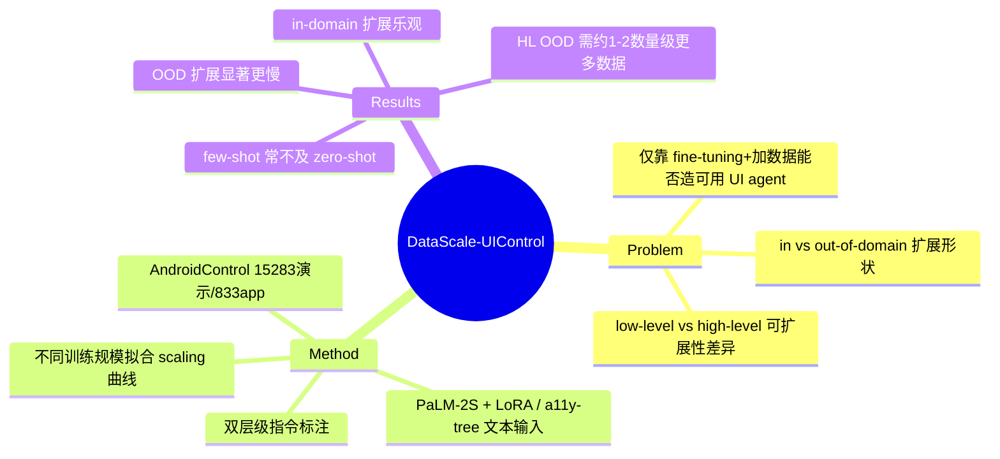

## Summary
该文用新采集的 AndroidControl 数据集（15,283 条演示、14,548 个任务、833 个 Android app）系统研究"仅靠 fine-tuning + 加数据"能否造出可用的 UI control agent：结论是 in-domain 数据规模扩展表现良好、有望靠堆数据达到 robust，但 out-of-domain（尤其 high-level 任务）扩展显著更慢，需多出约 1–2 个数量级的数据，暗示单纯 fine-tuning 不足以获得稳健的跨域能力。

## Problem & Motivation
LLM-based computer/UI control agent 在不经 fine-tuning 时性能偏低；一个自然但未被系统检验的假设是"只要收集足够多的人类演示做 fine-tuning，性能就能扩展到可部署水平"。作者要回答的核心问题不是"能不能再刷高一点 benchmark"，而是**数据规模扩展的形状**：性能随训练数据量如何增长、in-domain 与 out-of-domain 是否服从同一条曲线、low-level（步骤级指令）与 high-level（目标级指令）任务的可扩展性是否不同。这决定了"data-centric 路线"的天花板，是 §5.10 关心的 data-centric scaling 的原型问题。为支撑该分析，现有数据集在**多样性**（app 覆盖）与**指令层级标注**上不足，因此作者先补齐数据集这一前提。

## Method
- **数据集 AndroidControl**：15,283 条日常任务人类演示，覆盖 833 个 Android app、14,548 个 unique task，每条演示同时提供 high-level（整体目标）与 low-level（单步）人写指令，从而可分别评估两种任务复杂度。作者称其为当时**多样性最高**的 computer control 数据集（app 数约为 Mind2Web 的 6×、AitW 的 2×，per full-text 提取）。
- **训练设置**：主力被 fine-tune 的基座是 **PaLM-2S + LoRA**，输入为文本化的 **Android accessibility tree**（fine-tuning 不使用截图，属 text-based 而非纯视觉 grounding）；另评估 PaLM-2L、Gemini 1.5 Pro、GPT-4/GPT-4-Turbo 作为 zero-/few-shot 基线。（模型与模态细节来自全文自动提取，见诚实性说明。）
- **扩展实验设计**：以不同训练规模（如 1k / 10k / all 的 LoRA 变体）拟合 step-accuracy 随数据量的曲线，并在 in-domain（IDD）与多种 OOD split（unseen app / unseen task / unseen category）上分别测量，从而把"加数据"的边际收益按 in/out-of-domain × low/high-level 四象限拆开。
- **对比**：fine-tuned 模型 vs zero-shot（M3A / SeeAct / AitW 等 prompting pipeline）与 few-shot，考察 fine-tuning 相对 prompting 的优势区间及其随数据的变化。

## Key Results
> 注：除 abstract 中逐字核对的数据集规模与定性结论外，以下 table/figure 数字经自动全文提取转述，未逐格独立复核（见 Evidence Ledger）。

- **数据集规模（abstract 逐字）**：15,283 条演示、14,548 个 unique task、833 个 app；平均任务长度约 4.8 步（后者来自全文提取）。
- **In-domain 扩展乐观**：fine-tuned 模型在 IDD 上优于 zero-/few-shot 基线，且 step-accuracy 随数据量稳步上升，作者判断"仅靠继续收集数据即可能获得 robust 性能"。全文提取给出的 in-domain 最优 step-accuracy 约为 high-level 71.5% / low-level 86.6%（Table 4 转述）。
- **Out-of-domain 扩展显著更慢**：OOD 上曲线明显更平；contributions 提到 high-level 任务达到稳健性能需多出约 **1–2 个数量级**的数据。全文提取的 Figure 5 外推给出量级示意：in-domain 达高 step-accuracy 约需 10^5–10^6 级 episode，而 OOD 需 10^7 级（LL）到 ~6×10^7 级（HL）——这些具体外推数字风险高、仅供量级参考。
- **Few-shot 未必优于 zero-shot**：few-shot（Gemini 1.5 Pro）在多数设置下不及 zero-shot prompting，提示单纯加 in-context 示例并非可靠的扩展杠杆。
- **核心 takeaway**：数据规模扩展对"已知 app/任务"性价比高，对"陌生场景"性价比骤降；data-centric fine-tuning 单独不足以解决 OOD high-level 泛化，需要结合其他手段（更强基座 / RL / 环境交互）。

## Evidence Ledger
| Claim ID | Claim | Type | Source locator | Evidence excerpt | Status |
|:--|:--|:--|:--|:--|:--|
| C1 | AndroidControl 含 15,283 条演示、14,548 unique task、833 个 Android app | 数字 | Abstract | "15,283 demonstrations ... 14,548 unique tasks over 833 Android apps" | source-verified |
| C2 | In-domain fine-tuning 扩展良好、有望靠加数据达 robust；OOD 扩展显著更慢，HL 任务仅加数据可能不够 | 机制/趋势 | Abstract | "fine-tuned models ... scale in such a way that robust performance might feasibly be obtained ... Out of domain, performance scales significantly more slowly" | source-verified |
| C3 | OOD（尤其 high-level）达到稳健性能约需多 1–2 个数量级数据 | 数字/趋势 | Intro/Contributions（WebSearch 转述） | "out of domain, it requires one or two orders of magnitude more data" | not-checkable |
| C4 | In-domain 最优 step-accuracy ≈ HL 71.5% / LL 86.6% | 数字 | Table 4（全文自动提取） | "LoRA-tuned best: 71.5% (high-level), 86.6% (low-level)" | not-checkable |
| C5 | Figure 5 外推：in-domain 约 10^5–10^6 episode、OOD 达 10^7（LL）–~6×10^7（HL） | 数字 | Figure 5（全文自动提取） | "~500k (LL) ... ~10M (LL); ~60M (HL)" | not-checkable |
| C6 | 主力被 fine-tune 基座为 PaLM-2S + LoRA，输入为文本 accessibility tree（不用截图） | 方法 | Section 4.2（全文自动提取） | "PaLM-2S with LoRA ... Input: Textual Android accessibility trees" | not-checkable |
| C7 | Few-shot 多数情形不及 zero-shot | 趋势 | Table 4（全文自动提取） | "few-shot performance is for the most part inferior to that of zero-shot methods" | not-checkable |

## Strengths & Weaknesses
**Strengths**
- 问对了问题：把"data-centric 路线能走多远"formalize 成可测量的 scaling 曲线，而非再刷一个 SOTA，符合"重要 > publishable"的品味。
- 四象限拆解（in/out-of-domain × low/high-level）提供了可迁移的分析框架；"in-domain 便宜、OOD 昂贵"是被后续大量 GUI 数据/RL 工作反复引用的基础判断，作为 §5.10 的锚点很合适。
- 数据集设计有意增加 app 多样性并双层级标注指令，使 OOD 分析（unseen app/task/category）成为可能，方法与数据互为支撑。

**Weaknesses / 适用边界**
- **模态受限**：fine-tuning 走 accessibility-tree 文本输入而非截图视觉 grounding，其 scaling 曲线未必外推到当下主流的 pixel-based / screenshot VLM agent（vault 中 UI-TARS、ScaleCUA、OpenCUA 等多为视觉路线），跨模态可比性存疑。
- **基座偏旧**：PaLM-2S 时代的结论，是否在更强 VLM 基座上依然"OOD 需 1–2 个数量级更多数据"未知——更强 prior 可能压平 OOD 惩罚。
- **具体外推数字脆弱**：10^7–10^8 级 episode 是曲线外推而非实测，量级结论稳健但具体数值不应被当作精确门槛。
- 仅 Android 单平台；desktop/web 的 data-scaling 形状是否一致未验证。

**对领域的影响**：确立了"fine-tuning 对 OOD high-level 泛化边际收益递减"的经验判断，成为后续 synthetic data 扩产（OS-Genesis/AgentTrek/ScaleCUA）、环境交互与 RL（弥补 OOD gap）路线的动机基石；在 CUA survey 的 data-centric scaling 子节中可作为"为什么单靠堆数据不够"的原型证据。

## Mind Map

## Notes
- 诚实性说明：本轮无独立 verifier，`verification_status: unverified`。仅 abstract 中的数据集规模与定性 scaling 结论经逐字核对（C1/C2 = source-verified）；C3–C7 的 table/figure 具体数字经 arxiv html 全文自动提取转述，未逐格独立复核，标 not-checkable，引用前请回原文 Table 4 / Figure 5 / Section 4.2 核实。
- 标题历经修订：早期版本作 "On the Effects of Data Scale on **Computer** Control Agents"，最新版（v6）作 "... on **UI** Control Agents"；本笔记采用最新标题。
- 去重：vault 已有 ScaleCUA / OpenCUA / UIPro / ScaleTrack / GuiRewalk / Tongui / AgentTrek / OS-Genesis 等 data-generation/scaling 管线；本篇不同——它把 data scale 本身当作研究对象做受控 scaling 分析，填补 §5.10 的分析型锚点空缺。
- 待办：若入库后作为 survey 证据被引用，建议补拉 PaLM-2L / Gemini 1.5 Pro 具体行的 Table 4/5 数字并升级 verification_status。
