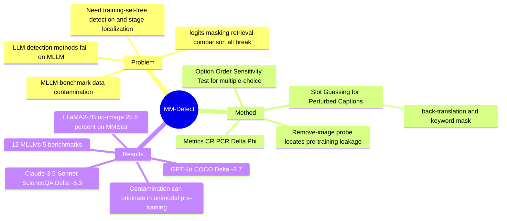

## Summary
MM-Detect 提出首个面向 multimodal LLM 的 data contamination 分析框架，用 Option Order Sensitivity（多选题）与 Slot Guessing for Perturbed Captions（caption 任务）两种 perturbation 探针，把污染拆成 unimodal 与 cross-modal 两类并量化，且无需访问私有训练集。作者在 12 个 MLLM × 5 个 benchmark 上发现污染普遍存在（proprietary 模型与老 benchmark 尤重），并进一步指出污染可能源自底层 LLM 的 unimodal pre-training 而非仅 multimodal fine-tuning。

## Problem & Motivation
已知：data contamination（benchmark 数据在训练阶段被无意记忆）会让评测失真、破坏公平比较。已有为 LLM 设计的检测方法迁移到 MLLM 时全线失效（§2.2）：retrieval-based 难以检索多模态信息；logits-based 在 instruction-tuned MLLM 上 token 概率分布差异不明显（附录 A：LLaVA-1.5-13b 在 ScienceQA 上 perplexity 仅 1.45，信号被抹平）；masking-based 因图像本身提供线索而高估污染；comparison-based 在 caption 任务上输出相似度低而失效。核心问题：如何在无法访问训练集的前提下，检测并量化 MLLM 的图文双模态污染，并定位污染发生在训练的哪个阶段。

推测（对 CUA / GUI-agent survey 的相关性）：GUI/CUA agent 普遍以这些被污染的 MLLM 为 backbone，且其能力评测同样依赖多选 / VQA 形式的 held-out benchmark。MM-Detect 的 perturbation 方法学，以及"污染可源自 LLM pre-training"这一结论，直接威胁 GUI benchmark 分数的可信度，可作为 data-leakage audit 子节的方法学锚点。此迁移属推测——论文本身未评测任何 GUI/computer-use benchmark（ScreenSpot / WebArena / Mind2Web 等均不在范围内）。

## Method
两个 perturbation 探针（针对 VQA，§3）：
1. **Option Order Sensitivity Test**（多选）：打乱答案选项顺序；被污染模型对选项顺序高度敏感（记住的是"位置"而非语义）。核心指标 Δ = PCR − CR（perturbed correct rate 减 original correct rate），Δ 越负越指示污染。
2. **Slot Guessing for Perturbed Captions**（caption）：把 caption 回译（English→Chinese→English）以打散原表述，用 POS tagging 提取 noun/adj/verb 关键词，mask 掉一个关键词；若模型在原句上能补出被 mask 的原词、却在 perturbed 版本上失败，则判为记忆。

检测指标（§3.3）：CR（原始正确率）、PCR（扰动后正确率）、dataset 级 Δ = PCR − CR、instance 级 Φ（扰动前答对、扰动后答错的样本比例）。污染分级阈值见附录 C（多选：severe Δ ≤ −2.9；caption：severe Δ ≤ −5.0）。

污染来源定位（§6.1）：对 vision-dependent 的 MMStar 题目**去掉图像**，并附加指令"若不知道就输出 I don't know"；若纯文本仍显著高于随机，说明 benchmark 文本泄漏进了底层 LLM 的 unimodal pre-training，而非仅在 multimodal fine-tune 引入。

## Key Results
**Setup**：12 个 MLLM（9 开源：LLaVA-1.5-7B、VILA1.5-3B、Qwen-VL-Chat、idefics2-8b、InternVL2-8B 等；3 闭源：GPT-4o、Gemini-1.5-Pro、Claude-3.5-Sonnet）× 5 benchmark（ScienceQA、MMStar、COCO-Caption2017、NoCaps、Vintage）。

**多选题（Table 3）**：Claude-3.5-Sonnet 在 ScienceQA training set 上 Δ = −5.3、Φ = 15.3%（严重泄漏），test set Δ = −2.4；老 ScienceQA test 比新 MMStar 污染更重，符合"新 benchmark 相对干净"的预期。

**Caption（Table 4）**：GPT-4o 在 COCO 上 Δ = −3.7、Φ = 23.1%（partial→严重）；idefics2-8b 在 NoCaps 上 Δ = −5.1（severe）；Phi-3-vision 在 Vintage 上 Δ = −5.7（severe）。

**污染源自 unimodal pre-training（§6.1, Table 5）**：去掉图像后，LLaMA2-7B（LLaVA/VILA base）在 MMStar 上仍答对 25.6%，Qwen-7B 13.2%，Internlm2-7B 11.0%，均远高于随机猜测；附录 D.2 进一步显示 LLaMA2-7B 加入"I don't know"选项后正确率从 44.8% 降到 25.6%（即约 238/1000 是蒙对），但剩余部分仍指示 benchmark 文本在 LLM pre-training 阶段泄漏。

**总体结论**：proprietary 模型与老 benchmark 污染更严重；污染可部分来自 LLM 的 pre-training 而非只在 multimodal fine-tuning——意味着仅更换多模态训练数据无法消除污染。

## Evidence Ledger
| Claim ID | Claim | Type | Source locator | Evidence excerpt | Status |
|:--|:--|:--|:--|:--|:--|
| C1 | 评测覆盖 12 个 MLLM × 5 个 benchmark（含 3 闭源） | benchmark scope | §Experiments / abstract | "evaluation of twelve MLLMs across five benchmarks" | source-verified |
| C2 | Claude-3.5-Sonnet 在 ScienceQA train 上 Δ = −5.3、Φ = 15.3% | number | Table 3 | Claude-3.5-Sonnet ScienceQA Train Δ=-5.3, Φ=15.3% | source-verified |
| C3 | GPT-4o 在 COCO 上 Δ = −3.7、Φ = 23.1% | number | Table 4 | GPT-4o COCO Δ=-3.7, Φ=23.1% | source-verified |
| C4 | 去图后 LLaMA2-7B 在 MMStar 仍答对 25.6%（Qwen-7B 13.2%、Internlm2-7B 11.0%） | number / mechanism | §6.1 Table 5 | LLaMA2-7B 25.6%, Qwen-7B 13.2%, Internlm2-7B 11.0% no-image accuracy | source-verified |
| C5 | 加"I don't know"后 LLaMA2-7B 正确率 44.8%→25.6%，约 238/1000 为蒙对 | number | Appendix D.2 | "dropped from 44.8% to 25.6%...238 of 1000 correct answers were lucky guesses" | source-verified |
| C6 | logits-based 检测在 MLLM 失效（LLaVA-1.5-13b 在 ScienceQA perplexity 1.45） | mechanism / number | 附录 A Table 7 | perplexity of 1.45 on ScienceQA | source-verified |
| C7 | 污染可源自 LLM unimodal pre-training 而非仅 multimodal fine-tuning | causal / novelty | §6.1 / abstract | "originates during unimodal pre-training rather than solely from multimodal fine-tuning" | source-verified |
| C8 | 污染分级阈值：多选 severe Δ ≤ −2.9；caption severe Δ ≤ −5.0 | threshold | Appendix C | multi-choice severe Δ ≤ -2.9; caption severe Δ ≤ -5.0 | source-verified |

（说明：以上数字均从 arXiv v3 HTML 全文抽取并附 locator；本轮无独立 verifier，frontmatter verification_status = unverified，Status 的 source-verified 仅表示 primary source 含该信息，不代表已独立复现。）

## Strengths & Weaknesses
**已知 Strengths.** 论文最有价值处是把"为什么 LLM 检测方法在 MLLM 上失效"逐条给出机制 + 经验证据（如附录 A 的 perplexity 1.45），framing 清晰。方法组合——perturbation-based（无需训练集访问）+ 双模态拆分（unimodal / cross-modal）+ 训练阶段定位（fine-tune vs pre-train）——构成这个 niche 的可复用模板。

**已知 Strengths.** "污染源自底层 LLM pre-training"是有跨论文价值的 pattern：它说明多模态阶段的数据清洗无法消除污染，也解释了为何纯文本探针（去图后仍高于随机）能作为泄漏证据。这对任何"用 MLLM benchmark 分数下结论"的工作都是必要 sanity check。

**已知 Weaknesses / Boundaries.** Δ/Φ 是 correctness-based 代理指标，依赖"perturbation 不改变语义"的假设；option shuffling 与回译-mask 都可能引入与记忆无关的难度变化（例如回译降低 caption 质量、打乱选项改变干扰项排布），Δ 变负未必纯来自污染。这与 vault 内 `2601-OpenLVLMMIA` 的核心警告一致：correctness/score gap 可能混入 distribution / difficulty artifact。推测：论文未见 blind-baseline 或 visual-only distribution audit 类的对照，无法完全排除该混淆。

**已知 Weaknesses / Boundaries.** benchmark 与模型均不含 GUI / computer-use 场景，污染阈值（severe/partial/minor）为经验切分、跨 benchmark 不一定可比；迁移到 CUA/GUI benchmark 的污染审计仍是 open gap。

**对领域的影响（推测）.** 对 GUI/CUA survey 的 data-leakage audit 子节，这是 contamination（评测有效性）一侧的 canonical 方法引用，与 MIA（隐私）一侧的 OpenLVLM-MIA 形成互补；但把结论落到具体 GUI benchmark 之前，需要有人实际在 ScreenSpot/WebArena/Mind2Web 上跑同类探针。

## Mind Map

## Notes
Cross-link：与 `Papers/2601-OpenLVLMMIA.md` 互补——MM-Detect 处理 contamination / eval-validity（benchmark 泄漏进训练致分数虚高），OpenLVLM-MIA 处理 membership inference / privacy 并警告 correctness gap 可能是 distribution artifact。两篇合起来支撑 CUA-Survey 的 data-leakage audit 子节（§5.11/§8.13）的两条腿：评测可信度 + 训练数据隐私。

Open gap（值得作为 survey 的 future-work 或 idea 种子）：目前没有专门审计 GUI/computer-use benchmark（ScreenSpot、WebArena、Mind2Web、AndroidWorld）污染或记忆的工作；MM-Detect 的 remove-image / perturbation 探针原则上可迁移，但 GUI benchmark 的 action-selection / trajectory-replay 形式与 VQA 不同，直接套用需重新设计 perturbation（如打乱 element 顺序、扰动 DOM/坐标）。这是把 contamination 方法学落到 CUA 的一个具体可行 follow-up。