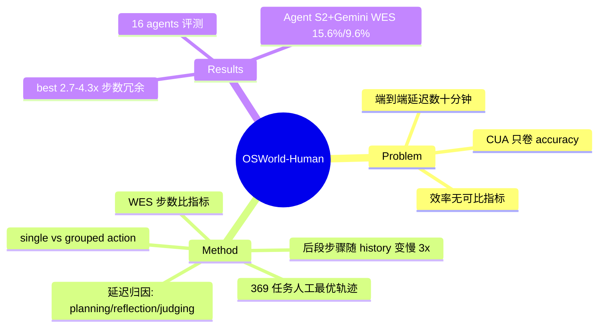

## Summary
针对 computer-use agent「只卷 accuracy、端到端延迟高达数十分钟」的现状，本文首次系统研究 OSWorld 上 agent 的时间性能，定位延迟主因（planning/reflection/judging 大模型调用、后续步骤逐步变慢），并构造带人工标注最优轨迹的 OSWorld-Human benchmark，用 Weighted Efficiency Score（WES）衡量步数效率，发现即便最好的 agent 也比人类多花 2.7–4.3× 步数。

## Problem & Motivation
computer-use agent 的评测长期只看 OSWorld 等 benchmark 上的 success rate，但作者指出这类系统「practically unusable」——一个人类 30 秒内能完成的任务（如把两段文字改成双倍行距），agent 要花约 12 分钟（§1）。这类高延迟在生产落地中是首要障碍，却几乎没有被量化研究。本文的问题 formulation 是把「效率/延迟」提升为与 accuracy 并列的一等评测维度：延迟从何而来？如何用可比指标衡量 agent 相对人类的步数冗余？这正好填补 CUA 综述中「效率/成本」子节（cost-accuracy）长期缺代表作的空白。

## Method
两部分工作：

**（1）延迟归因分析。** 在 OSWorld 官方约 10% 子集（约 39 个任务）上以 Agent S2（v2 增加 GTA1）为对象，逐步拆解端到端延迟。发现 large model calls 用于 planning、reflection、judging 占了整体延迟的大头（Table 1 报告 planning+reflection 对 S2 约 87%、对 GTA1 约 97%）；且随任务变长，后续每一步因 prompt 累积了完整 trajectory history 而变长，作者给出「each successive step can take 3x longer than steps at the beginning」（Abstract / §3.2）。

**（2）OSWorld-Human benchmark + WES 指标。** 对全部 369 个 OSWorld 任务人工标注一条「人类最优轨迹」（两名研究生交叉校验 + 手动执行验证）。为消解「一张截图上可连续执行多个动作」的歧义，同时给出 single-action 与 grouped-action 两种轨迹长度（Table 4，例如 LibreOffice Calc 平均步数从 13.2 降到 4.5）。核心指标 Weighted Efficiency Score（WES）：对成功任务按 `WES+ = (1/n) Σ r_t · (t_human / t_agent)` 用人类/agent 步数比加权，再乘以对失败步数的惩罚项 `(1 − t_fail_avg / S)`（§5.1）。WES 本质上把「agent 相对人类的步数冗余」量化为一个可跨 agent 比较的标量。

## Key Results
- 在 16 个 SOTA computer-use agent 上评测（Abstract / Table 5）。
- 表现最好的 Agent S2 w/ Gemini 2.5 取得最高 single-action WES 15.6% 与 grouped-action WES 9.6%，对应相对人类轨迹的 2.7× 与 4.3× 步数冗余（§5.2 / Table 5）。
- 结论：即便最好的 agent 也比必要步数多花 2.7–4.3×（Abstract）；~10% 的 grouped WES 对照 ~41% 的 success rate，凸显 efficiency 远落后于 accuracy 的落差。

## Evidence Ledger
| Claim ID | Claim | Type | Source locator | Evidence excerpt | Status |
|:--|:--|:--|:--|:--|:--|
| C1 | 最好的 agent 比必要步数多花 2.7–4.3× | 数字/headline | Abstract | "even the best agents take 2.7-4.3x more steps than necessary" | source-verified |
| C2 | 共评测 16 个 agent | 数字 | Abstract | "We evaluate 16 agents on their efficiency using OSWorld Human" | source-verified |
| C3 | planning/reflection/judging 大模型调用占延迟大头 | 机制断言 | Abstract | "large model calls for planning, reflection, and judging account for most of the overall latency" | source-verified |
| C4 | 后续步骤可比开头慢 3× | 数字/机制 | Abstract | "each successive step can take 3x longer than steps at the beginning of a task" | source-verified |
| C5 | 12 分钟 vs 人类 <30 秒的行距任务示例 | 数字 | §1（HTML fetch） | "changing the line spacing ... takes 12 minutes ... should take under 30 seconds" | source-verified |
| C6 | Agent S2 w/ Gemini 2.5 达 single/grouped WES 15.6%/9.6% | 数字/benchmark | §5.2 / Table 5（HTML fetch） | "highest score on single-action WES (15.6%) and grouped-action WES (9.6%)" | source-verified |
| C7 | 延迟分析子集约 39 个任务（OSWorld ~10%） | 数字 | §3（HTML fetch；v1 搜索片段作 37） | "39 tasks (10% of 369-task benchmark)" | source-verified |
| C8 | OSWorld-Human 覆盖全部 369 个任务、人工标注最优轨迹 | benchmark 构造 | §4（HTML fetch） | "manually annotated human-determined trajectory for each task" | source-verified |

（注：verification_status=unverified —— 本轮无独立 verifier，上述 source-verified 仅表示原文/HTML 全文含该信息，未做独立复现；C5–C8 经 WebFetch 小模型抽取，数字以原文 locator 为准。）

## Strengths & Weaknesses
**Strengths.** 问题 formulation 好——把 latency/步数效率从「顺带一提」提升为一等评测维度，切中 CUA 生产落地的真实痛点；延迟归因（大模型 planning/reflection 调用 + prompt 随 history 膨胀导致后段变慢）是可操作的 first-principles insight，直接指向减少 reflection 调用、压缩 history、grouped-action 等优化方向；WES 用「人类最优轨迹步数比」做归一化，比裸测秒数更抗硬件/API 波动，可跨 agent 比较。人工标注 369 条参考轨迹本身是可复用的公共资产。

**Weaknesses.** WES 以「步数比」为核心，但步数并不等于 wall-clock latency（一步 grouped-action 可能内含多次昂贵模型调用），效率≠步数效率，二者在含义上有张力；single/grouped 两套轨迹说明「一步」的定义本身有主观性，人类最优轨迹也可能非唯一最优，引入标注者偏差；延迟归因仅在约 39 任务子集、少数 agent（Agent S2 / GTA1）上做，结论外推到全部 16 agent 需谨慎；WES 未计入 token 成本/美元成本，与真正的 cost-accuracy（$/task）仍隔一层。对综述价值：作为 §8.10 的锚点，它提供了「效率是首要障碍」这一论断的最直接证据，可与 per-task $ 成本类工作（如 WebVoyager 上的延迟/成本 profiling、MobiBench 的 cost-latency 分析）互补。

## Mind Map

## Notes
- 与 CUA-Survey §8.10 已有引用一致：综述正文断言「效率而非准确率才是 computer-use agent 生产落地的首要障碍」即出自本文；本笔记为该引用补齐 primary-source 支撑。
- 待核实：affiliation（作者 Yiying Zhang 组，推断为 UC San Diego / WukLab，fetch 未明示）；code 仓库 URL；延迟子集任务数 v1(37?)/v2(39) 差异；Table 1 延迟占比与 Table 5 完整逐 agent 数字建议对照 PDF 复核后再作为定量证据引用。
