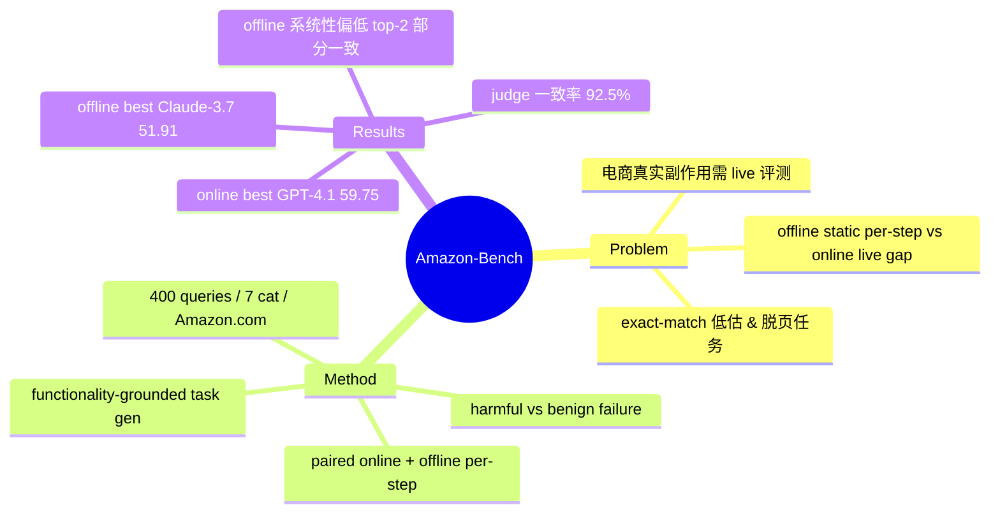

## Summary
Amazon-Bench 用 functionality-grounded 方式在 live Amazon.com 上自动生成 400 个 web agent 任务，并对同一批模型同时跑 online end-to-end 与 offline per-step 两种评测。结果显示 offline per-step exact-match accuracy（best Claude-3.7 51.91%）系统性低于 online task success rate（best GPT-4.1 59.75%），二者只在 top-2 模型排序上部分吻合，说明 static/per-step 代理指标无法可靠预测 live 端到端表现。

## Problem & Motivation
Web agent 评测在 offline（cached trajectory / per-step action matching，静态、便宜、可复现）与 online（live 网站 end-to-end，真实但漂移、不可复现）之间存在方法学落差。offline exact-match 会惩罚等价的合法动作而系统性低估能力，也无法反映动态内容与真实副作用；电商这类会产生真实状态变更（下单、改地址、用礼品卡）的高价值场景尤其需要 live 评测，但既有 benchmark 要么脱离页面内容臆造任务，要么不提供与 offline 对照的同模型数据。本文针对 §8.3 关心的"static-to-live gap"给出一份 paired same-model live-vs-offline 的电商 benchmark。

## Method
- **Functionality-grounded task generation**：把真实网页内容与 interactive elements 喂给 LLM，让其"基于页面内容与可交互元素"生成 user query，避免与页面脱节的通用知识型任务。共 400 queries / 7 categories（Account Management、Product Interaction、Product Search、Deal Search、Store Interaction、Review Checking、Media Interaction），单一域 Amazon.com；另手工采集 47 条 trajectory 作参考。
- **Online evaluation（live）**：agent 直接与 live Amazon.com 交互，报 end-to-end task success rate（Table 2）。
- **Offline evaluation（static per-step）**：给定 user query + 当前页 AXTree + history actions，比较 agent 下一步动作与人类下一步动作的 exact-match accuracy（Sec 4.2, Table 3）。同一批模型两种设置都跑 → 构成 paired same-model live-vs-offline。
- **Safety taxonomy**：区分 benign failure（失败但不影响账户）与 harmful failure（加错商品 / 改地址 / 误购买等对用户账户有负面影响的动作）；LLM judge 与人工评判一致率 92.5%。

## Key Results
- **Online end-to-end SR（Table 2）**：GPT-4.1 59.75、Claude-3.7 56.50、GPT-o4-mini 51.00、Nova-Act 46.30、WebVoyager 44.00、Deepseek-R1 42.25。
- **Offline per-step exact-match acc（Table 3）**：Claude-3.7 51.91、GPT-4.1 50.64、GPT-o4-mini 48.81、GPT-4o 41.70、Deepseek-R1 39.15。
- offline per-step 系统性低于 online（作者称二者 "capture different dimensions"）；top-2（Claude-3.7 / GPT-4.1）在两种设置都居前，但绝对值差距明显、中段排序不完全对应。
- LLM-based judging 与人工一致率 92.5%。

## Evidence Ledger
| Claim ID | Claim | Type | Source locator | Evidence excerpt | Status |
|:--|:--|:--|:--|:--|:--|
| C1 | Online best 任务成功率 GPT-4.1 59.75% | number | Table 2 | "GPT-4.1 ... 59.75" | source-verified |
| C2 | Offline best per-step exact-match Claude-3.7 51.91% | number | Table 3 | "Claude-3.7 ... 51.91" | source-verified |
| C3 | offline per-step 系统性低于 online，二者"capture different dimensions" | mechanism | Sec 4.2 | "per-step matching rates are substantially lower ... capture different dimensions" | source-verified |
| C4 | 400 queries / 7 categories / 仅 Amazon.com | benchmark scope | benchmark 章节 | "400 user queries ... Amazon.com" | source-verified |
| C5 | online 评测在 live Amazon.com 上进行 | setup | Sec 4 | "agents directly interact with the live Amazon.com website" | source-verified |
| C6 | 手工采集 47 条 trajectory | number | data 章节 | "47 trajectories were manually collected" | source-verified |
| C7 | LLM judge 与人工一致率 92.5% | number | eval 章节 | "92.5% agreement" | source-verified |

（注：数据经 arXiv HTML 全文抓取核对 locator，但本轮无独立 verifier，未做数字复算 / 复现；frontmatter verification_status = unverified。）

## Strengths & Weaknesses
**亮点**：(1) 直接提供 §8.3 需要的 paired same-model live-vs-offline 数据点，且 online 跑在真实 Amazon.com、有真实状态变更后果；(2) functionality-grounded 生成缓解"任务与页面脱节"，让自动生成任务更可执行；(3) 显式 harmful-failure safety taxonomy 契合 CUA 部署风险评估。

**局限（critical read）**：
1. **offline 轴不是 cached full-task rollout，而是 per-step exact-match（static AXTree）**。per-step exact-match 是已知的 lower bound（惩罚等价合法动作），因此 online > offline 的差距**部分是 metric artifact**，不能直接读成"live 比 static 难 X%"；这与 SeeAct/WebCanvas 报告的"online 反而高于 offline"是同源现象。真正的"static content vs live content"同任务对照本文并未做。
2. **单一域 Amazon.com**，跨站 / 跨域泛化未知；live 评测随时间漂移、不可复现的问题本文未解决（与 Online-Mind2Web / REAL 路线互补而非替代）。
3. online/offline 对照是 component 而非中心论点，**未报相关系数**，"排序部分一致"只能定性；对领域的价值在于补充"per-step 静态代理即便保留 top-model 身份，也会重排中段并低估绝对能力"这一证据。

## Mind Map

## Notes
- §8.3 定位：flagship 是 Online-Mind2Web（"进步幻觉"，live vs static 差距可达 ~59%，已入库 [[Papers/2504-OnlineMind2Web]]）；本文作为**同模型 paired online/offline 的补充证据**，与 [[Papers/2401-SeeAct]]（online > offline、排序翻转）、[[Papers/2400-WebcanvasBenchmarkingWebAgents]]（keynode 在线评测）构成"static per-step 代理指标不可靠"证据链。
- 独特贡献：即便把 offline 收窄到 per-step exact-match，也仅能保住 top-model 身份，中段重排且绝对值系统性偏低 → offline 至多是**粗筛**，不能替代 live 评测；引用时须注明"差距含 metric artifact"这一 caveat，避免 overclaim 成纯 static-to-live content gap。
