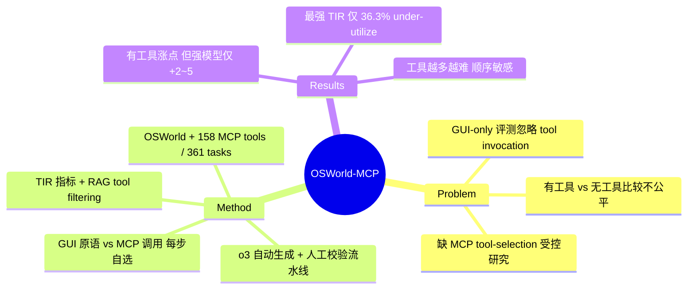

## Summary

OSWorld-MCP 在 OSWorld 真实桌面环境上挂载 158 个人工校验的 MCP tool（覆盖 VS Code/Chrome/LibreOffice/VLC/OS 等 7 类应用），让 computer-use agent 每一步在 GUI 原语与 MCP tool 调用之间自主选择，用以补齐"过去只评 GUI 交互、忽略 tool invocation"的评测空白。核心发现是：给了工具能显著提升成功率，但即便最强模型的 Tool Invocation Rate 也仅 36.3%——模型"有工具却不用/用不对"，而非工具无效。

## Problem & Motivation

MCP 作为把 LLM/agent 连到外部工具的标准协议正快速普及，但主流 computer-use benchmark（如 OSWorld）只暴露 screenshot + GUI 原语，把 tool invocation 能力排除在评测之外。作者指出这带来两个问题：(1) 把"带 tool invocation 的 agent"与"只测 GUI 的 agent"直接比较本身不公平；(2) GUI 路径低效——例如在 VS Code 安装 autoDocstring 扩展，纯 GUI 至少 4 步，一个 MCP tool 一步即可完成，且更鲁棒。因此需要一个同时评 tool invocation、GUI operation 与"何时该用工具"这一 decision-making 能力的统一基准。这正对应本 vault CUA 综述 §4.7 标注的空白：GUI/computer-use 场景下缺少针对 MCP tool-selection policy 的受控研究。

## Method

**环境与规模。** 基于 OSWorld（Xie et al., 2024），在原 369 个任务中评测 361 个（剔除 8 个 Google Drive 任务），挂载 158 个高质量 MCP tool，覆盖 7 类常见应用。任务标注了 tool-beneficial 子集（250 个，约 69%）与需要 multi-round tool invocation 的子集（153 个，约 42%），并注入 25 个 distractor tool 考察抗干扰的工具选择。

**自动化工具生成流水线（三模块）。** Code Generation Module 用 OpenAI o3 为 OSWorld 任务生成可运行代码解；Code Filter Module 用 o3 归纳可复用代码，得到 72 个 verified tool；Tool Wrap Module 用 o3 自动把 verified code 打包成 MCP tool。生成工具（72）与已有精选工具（192）合计 264 个，经 ≥2 名 reviewer 人工校验（功能正确性、实用性、通用性）后保留合格项，最终得 158 个。

**决策与评测。** Agent 每步在 11 个 GUI basic action（key/type/mouse_move/click/drag 等）与 MCP tool 调用间自主选择；任务成功用 OSWorld 的 execution-based 自动评估判定。为应对大工具空间，还引入 RAG 式 tool filtering 只把相关工具喂给模型。

**指标 Tool Invocation Rate (TIR)。** 衡量 agent 在 tool-beneficial 与 non-tool-beneficial 任务上是否"正确决定要不要用工具"的比例，用于把"能力不足"与"工具决策不足"分离开。

## Key Results

- **有工具即涨点，但幅度分模型。** 15 steps 下：Gemini-2.5-Pro 7.4%→20.5%、OpenAI o3 8.3%→20.4%、Claude 4 Sonnet（最强 LMM）30.2%→35.3%。50 steps 下：Claude 4 Sonnet 40.1%→43.3%、Agent-S2.5（multi-agent）47.1%→49.5%。
- **工具被严重 under-utilize。** 即便最强模型 Claude 4 Sonnet 的 TIR 也仅 36.3%（LMM 中最高），Qwen2.5-VL 仅 10.9%（最低）；且 TIR 与 accuracy 正相关——不是工具没用，而是模型不会/不愿调用。
- **工具空间越大越难。** RAG tool filtering 消融（Gemini-2.5-Pro, 15 steps）：带 RAG 20.5% acc / 16.8% TIR，不带 RAG（158 个工具全暴露）掉到 15.5% acc / 11.6% TIR；随每任务可见工具数增加，accuracy 与 TIR 同步下降，作者归纳"组合多个工具比组合 GUI 操作更难"。
- **对 prompt 中工具顺序敏感。** 随机 shuffle 工具顺序把 accuracy 从 20.5% 抬到 22.7%，说明工具选择行为受排列顺序显著影响（脆弱性信号）。

## Evidence Ledger

| Claim ID | Claim | Type | Source locator | Evidence excerpt | Status |
|:--|:--|:--|:--|:--|:--|
| C1 | 基准规模：158 个 MCP tool、361 个评测任务（源自 OSWorld 369，剔除 8 个 Google Drive）、7 类应用 | 数字/可比性 | arXiv:2510.24563 html v2, Sec 3 / Abstract | "158 high-quality MCP tools ... 7 common applications" | source-verified |
| C2 | 250 任务（69%）为 tool-beneficial，153（42%）需 multi-round tool invocation，含 25 个 distractor tool | 数字 | arXiv:2510.24563 html v2, Sec 3 | "250 tasks (69%) ... 153 tasks (42%) ... 25 non-target tools" | source-verified |
| C3 | 提供工具后成功率提升：Gemini-2.5-Pro 7.4→20.5、o3 8.3→20.4、Claude 4 Sonnet 30.2→35.3（15 steps） | 数字/因果 | arXiv:2510.24563 html v2, Table 1 | "Gemini-2.5-Pro: 7.4% → 20.5%" | source-verified |
| C4 | 最强模型 TIR 仅 36.3%（Claude 4 Sonnet），最低 Qwen2.5-VL 10.9%，工具被 under-utilize | 数字/机制断言 | arXiv:2510.24563 html v2, Finding 2 / Sec 4 | "Only 36.3%, indicating room for improvement" | source-verified |
| C5 | RAG tool filtering 消融：带 RAG 20.5% acc/16.8% TIR，去掉后 15.5%/11.6%（Gemini, 15 steps） | 数字/ablation | arXiv:2510.24563 html v2, Sec 4.3 | "With RAG: 20.5% ... Without RAG: 15.5%" | source-verified |
| C6 | 工具顺序敏感：shuffle 后 accuracy 20.5→22.7 | 数字/脆弱性 | arXiv:2510.24563 html v2, Sec 4.3 | "Random shuffling improved accuracy from 20.5% to 22.7%" | source-verified |
| C7 | 论文被 ICLR 2026 接收 | venue 声明 | 二手：HuggingFace/arXiv listing 检索（2026-07-23） | "accepted to ICLR 2026" | not-checkable |

> 诚实标注：本轮无独立 verifier，`verification_status: unverified`。上表 Status=source-verified 仅表示 primary arXiv html（经 WebFetch 摘取）含该数字，不代表已独立复现。C3 相关的 "+18.6 for Gemini-2.5-Pro" 表述与 Table 1 的 7.4→20.5（+13.1）不一致，可能对应不同 step 预算或摘取误差，未采纳该增量数，正文只保留 Table 1 原值。institute 为据作者与 X-PLUG（Alibaba）/OSWorld 作者背景推断，未逐一核对署名脚注。

## Strengths & Weaknesses

**Strengths.**
- 直击一个真实且被忽略的评测不公平：把 tool invocation 显式并入 computer-use 评测，并用 TIR 把"能力不足"与"工具决策不足"分开——这正是 §4.7 缺的受控视角。
- Tool 供给做得扎实：o3 自动生成 + ≥2 reviewer 人工校验的双阶段流水线，distractor tool 与 multi-round 子集让"工具选择"而非"工具可用性"成为被测变量。
- 消融有信息量：工具越多越难、对工具顺序敏感，都指向 tool-selection policy 本身是瓶颈，而非 backbone 能力。

**Weaknesses.**
- 增量收益偏小且不稳定（多数模型 +2~+13，强模型 50 steps 仅 +2.4/+3.2），"工具是否真的改变 CUA 上限"仍未定论；难说是策略进步还是工程注入。
- 工具很大程度上是"OSWorld 任务的代码解封装"，与任务分布高度耦合，可能高估工具收益、并弱化对未见任务的泛化解读。
- 只测 success + TIR，未审计 MCP 通道的权限边界、副作用可逆性与 MCP-specific reward hacking——§4.7/§8.6 关心的 UI-visible side effect 与 permission escalation 仍在评测之外。
- 评测仍是单接口"用不用工具"的二选一，未做等预算下 GUI-only / MCP-only / adaptive-hybrid 的因果对照（vault 标注的 adaptive hybrid routing gap 未被填满）。

## Mind Map

## Notes

- 入库定位：作为 CUA-Survey §4.7（CLI/Code/API/MCP Actions）与 §8.6（Hybrid GUI/API/MCP）的关键新证据——此前 vault 只有 [[Papers/2512-MobileWorld]] 的 context-overflow 观察与 [[Papers/2604-ClaudeCode]] 的生产 harness 案例，OSWorld-MCP 是首个在 GUI/computer-use 场景对 MCP tool-selection 做受控测量的 benchmark，可直接替换 §4.7 结尾"MCP 证据稀薄"的论断为"已有受控评测，但仍缺权限/副作用审计与等预算 hybrid 对照"。
- 与 [[Papers/2602-Mobile-Agent-v3.5- Multi-platform Fundamental GUI Agents]] 交叉：GUI-Owl-1.5 报告在 OSWorld-MCP 上得 47.6（tool-calling），可作为该 benchmark 的一个外部模型数据点。
- 与 [[Papers/2607-ToolVerse]] 区分：ToolVerse 是 mock MCP 环境 + RL 训练（无 GUI handoff），OSWorld-MCP 是真实桌面 + GUI/MCP 同框评测——两者互补，前者训练侧、后者评测侧。
- 待核实（下一轮 verifier）：C3 的 Gemini "+18.6" 与 Table 1 "+13.1" 不一致来源；ICLR 2026 接收状态（C7 为二手）；50 steps 完整排名表。
