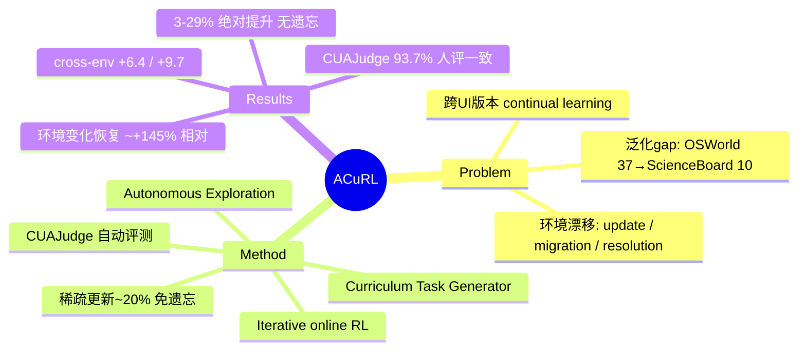

## Summary
针对 computer-use agent 部署后遇到的环境漂移（software update、platform migration、resolution 变化、新应用域），提出 ACuRL——一个无需人工标注、由 agent 自主探索 + curriculum 任务生成器驱动的 online RL 持续学习框架，配套自动评测器 CUAJudge；在六个目标环境上取得 3–29% 绝对提升且不发生 catastrophic forgetting，机制上归因于 RL 只稀疏更新约 20% 参数。

## Problem & Motivation
真实数字环境高度多样且动态：agent 会遇到未见环境与分布漂移。论文用两类证据点出痛点——(1) 泛化 gap：Claude-3.7 在 OSWorld 上 37% 的成功率迁到较新发布的 ScienceBoard 环境骤降到 10%（§1）；(2) 环境自身随时间变化：software update、platform migration、resolution 变化会带来最高约 51% 的相对性能下降（Fig. 1）。因此作者主张"在特定目标环境中持续学习"是 computer-use agent 真正落地的核心要求。这正对应 §7.12 的 niche——跨 UI 版本/平台的 continual learning 与 catastrophic forgetting 问题，且是少见地把它放在 OS 级 computer-use（而非仅 GUI grounding）语境下研究。

## Method
ACuRL 分三部分，全程无需人工标注数据：

- **Autonomous Exploration（§3.1）**：agent 先无约束地与目标环境交互，记录 exploration trajectory `τ^exp`；同时从 web 抓取真实上下文得到 context trajectory `τ^ctx`，作为后续任务合成的素材。
- **Curriculum Task Generator（§3.2）**：以上一轮各技能的评测成功率 `s_k^(n)` 为条件生成下一轮任务 `T^(n+1) ~ G(·| τ^ctx, τ^exp, T^(n), {s_k^(n)})`。按难度自适应：Easy（成功率 > δ_high）→ 加技能/延长 horizon 提难度；Medium → 保持可学性、增加场景多样性；Hard（成功率 < δ_low）→ 层次化分解为子任务。人评显示生成任务 94% 有效（144 条抽样）。
- **Iterative RL Training（§3.3）**：N 轮迭代、每轮 x 步优化；每轮用 m 次 rollout 的平均成功率评估能力（Eq. 1）后再喂给生成器闭环。
- **Catastrophic forgetting 的处理**：不使用显式正则（无 EWC/PackNet/replay），而是依赖 RL 训练本身的**稀疏参数更新**天然保留旧知识——训练后 LLM backbone 与 vision encoder 约 80% 参数几乎不变、仅约 20% 被实质更新（§4.7, Fig. 5）。这是本文对"为什么不遗忘"的机制假设。
- **CUAJudge（评测器）**：在 WebJudge 基础上加两项改造——(1) State Difference Analysis：显式比较初始/终止环境状态而非仅看 trajectory；(2) Evidence-Grounded Key Point Verification：逐个 key point 判定并要求截图/动作作为证据，降低 reward hacking。
- **基建**：统一环境管理协议 + 异步评测 + 环境预加载，使训练提速 3–5 倍（§4.2）。

## Key Results
- Base agents：UI-TARS-1.5-7B、Qwen3-VL-8B-Instruct；六个环境：LibreOffice Impress/Writer/Calc、Thunderbird、Celestia、KAlgebra。
- **Intra-environment**：各目标环境 3–29% 绝对提升且无 catastrophic forgetting（Abstract；Fig. 3 例：Impress 31.1%→40.7%）。
- **Cross-environment（Table 1）**：UI-TARS-1.5-7B 顺序学习后 overall 19.5%→25.9%（+6.4）；Qwen3-VL-8B 22.0%→31.7%（+9.7）。
- **环境动态鲁棒性（§4.5, Fig. 4，LibreOffice Calc）**：platform migration(Ubuntu→Windows)、software update、resolution shift 造成掉点后，经 ACuRL 三轮迭代可大幅恢复（论文报告相对提升最高约 +145%）。
- **CUAJudge（Table 2/4）**：与人评 288 条轨迹总体一致率 93.7%（逐轮 96.6%/89.1%/95.6%）；与 rule-based evaluator 在 1,444 条 OSWorld 轨迹上一致率 87.5%，precision 较 WebJudge +4.1%。
- **Ablation（Table 3, Impress）**：去掉 iterative training 或 curriculum，第 3 轮分别掉到 32.6%/36.4%，弱于完整 curriculum RL 的 40.7%；换开源 Qwen3-VL-8B 作生成器仍有显著提升（Appendix E.5），说明增益不靠更强外部模型。

## Evidence Ledger
| Claim ID | Claim | Type | Source locator | Evidence excerpt | Status |
|:--|:--|:--|:--|:--|:--|
| C1 | 各目标环境取得 3–29% 绝对提升且不 catastrophic forgetting | 数字/主结果 | Abstract; §4.2 | "3–29% absolute performance gains on the target environments" | source-verified |
| C2 | CUAJudge 与人评总体一致率 93.7%（288 条轨迹） | 数字/评测可信度 | Table 4, §3.3 | "93.7% overall agreement" | source-verified |
| C3 | 不遗忘的机制：RL 仅实质更新约 20% 参数、约 80% 不变 | 机制断言 | Abstract; §4.7, Fig. 5 | "around 80% of parameters unchanged … only about 20% … substantially updated" | source-verified |
| C4 | 环境变化致相对掉点最高约 51%；ACuRL 后相对恢复最高约 +145% | 数字/动机+恢复 | §1 Fig. 1; §4.5 Fig. 4 | "relative drops of up to 51%"; "+145% (relative)" | source-verified |
| C5 | 泛化 gap：Claude-3.7 OSWorld 37% → ScienceBoard 10% | 数字/动机 | §1 | "from 37% on OSWorld to 10% on the later released ScienceBoard" | source-verified |
| C6 | Cross-env：UI-TARS 19.5%→25.9%(+6.4)，Qwen3-VL 22.0%→31.7%(+9.7) | 数字/主结果 | Table 1, §4.3 | "19.5% … 25.9%"; "22.0% … 31.7%" | source-verified |
| C7 | Base：UI-TARS-1.5-7B、Qwen3-VL-8B-Instruct；六环境 | 实验设置 | §4.1 | "UI-TARS-1.5-7B and Qwen3-VL-8B-Instruct" | source-verified |
| C8 | 基建优化使训练提速 3–5 倍 | 数字/工程 | §4.2 | "accelerate training speed by 3–5 times" | source-verified |

## Strengths & Weaknesses
**Strengths**
- 直击 §7.12 的核心缺口：把 continual learning 放在 OS 级 computer-use 且**显式**测试 version update / platform migration / resolution shift 三类真实漂移，而非只做 grounding 分布漂移——比 vault 已有的 Continual GUI Agents(GUI-AiF)、CGL、UI-Mem 更贴"跨 UI 版本"这一 framing。
- Label-free：自主探索 + curriculum 生成闭环，回避了持续学习最贵的人工标注瓶颈，scalable。
- 对"为何不遗忘"给出可检验的机制假设（sparse update ~20%），而非只给一个 forgetting 指标，符合 first-principles 取向；且与近期 RL-forgets-less 观察相互印证。
- 配套 CUAJudge 缓解无 ground-truth 环境下的评测/reward-hacking 问题，是持续学习工程上的实用组件。

**Weaknesses / 存疑**
- forgetting 缓解归因于 sparse update 属**相关性观察**，论文未做对照实验证明"稀疏更新"是免遗忘的因（而非 RL 目标、KL 约束等混杂因素）；机制断言强度有限。
- "不 forgetting" 主要在自选六个环境内衡量，缺少对**通用/开箱能力**（如原始 OSWorld、general instruction following）在持续训练后是否退化的系统评估，backward transfer 证据不足。
- curriculum 生成默认用 GPT-5，虽有开源替换的 ablation，但主结果仍依赖强外部模型，成本与可复现性存疑。
- 相对提升（+145%、-51%）以相对百分比表述，基数低时易放大观感，需对照绝对成功率解读。

## Mind Map

## Notes
- **诚实标注**：本轮无独立 verifier，`verification_status: unverified`。正文与 Evidence Ledger 所有数字系经 WebFetch 从 arXiv abstract 页 + html 全文页（https://arxiv.org/html/2602.10356）抽取，`source-verified` 仅表示"primary source 页面包含该信息"，未逐行独立复核、更未复现实验；`+145%`/`51%` 等相对数尤需后续核对精确值与基数。
- **affiliation 为推断**：抓取页面未显式列出机构。作者归属按已知身份推断——Yu Su / Huan Sun / Kai Zhang / Zeyi Liao / Tianci Xue 为 OSU NLP，Dawn Song 等为 UC Berkeley；未从 fetched 页面确认，入库前建议核对 PDF 首页。
- **去重**：与 vault 已有 `Papers/2600-ContinualGuiAgents.md`(GUI-AiF, 2601.20732)、`Papers/2606-CGL.md`(2603.02951)、`Papers/2600-UiMemSelfEvolving.md`(2602.05832)、`Papers/2601-MAGNET.md` 均不同——那几篇聚焦 GUI grounding 的域/分辨率持续学习或 mobile 经验记忆；ACuRL 是 OS 级 computer-use + 显式 version/platform 漂移，互补而非重叠，适合并列进 §7.12。
- 版本：v1 2026-02-10，v2 2026-05-11（本笔记据当前 arXiv 页面）。
