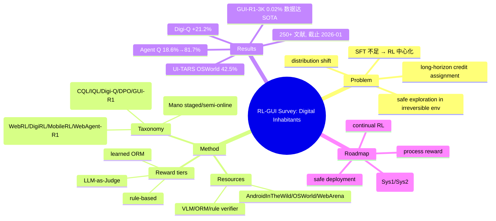

## Summary
首篇（作者自述）系统梳理 RL × GUI agent 交叉的综述，提出 Offline RL / Online RL / Hybrid Strategies 三分类学，并沿 reward engineering、data efficiency、technical innovation 三个维度展开。核心论点：reliability 与 scalability 的张力推动 composite multi-tier reward 架构，GUI I/O latency 瓶颈推动 world-model-based training，且在 reward 信号足够丰富时 System-2 式 deliberation 会自发涌现、显式 reasoning 监督未必必要。终点愿景是从 GUI automation 走向 "digital inhabitants"，并给出 process reward / continual RL / cognitive architecture / safe deployment 的 roadmap。

## Problem & Motivation
GUI agent 以视觉方式感知并操作图形界面，但纯 SFT 无法应对三类结构性困难：long-horizon credit assignment（稀疏奖励下的长程信用分配）、distribution shift（界面演化带来的分布漂移）、以及 irreversible environment 中的 safe exploration。作者论证 RL 因此成为推动 GUI automation 的中心方法论。对本 vault 的价值：它是一份 RL-first 视角的对照综述，可用于 CUA survey 的 §1.4（相关综述定位）与 §7（RL 训练章）——提供一个外部 taxonomy 参照系与一组待检验的趋势断言。

## Method
综述本身的"方法"即其 taxonomy 与分析维度（§4–§7）：

**RL 方法三分类学（§4）**
- **Offline RL**：value-based（CQL / IQL / Digi-Q）；preference-based optimization（DPO / ARPO）；policy-gradient with verifiable rewards（GRPO 系的 GUI-R1 / UI-R1）。
- **Online RL**：curriculum-based（WebRL / Curriculum-RLAIF）；difficulty-adaptive（MobileRL 的 AdaGRPO）；offline-to-online transition（DigiRL）；multi-turn optimization（WebAgent-R1 / M-GRPO）；grounding-specialized（InfiGUI-G1 / UI-AGILE）；exploration-driven synthesis（Explorer）。
- **Hybrid Strategies**：staged pipeline（Mano 的 SFT → Offline RL → Online RL）；semi-online + trajectory patching。

**Reward engineering 三层架构（§5）**：rule-based reward（binary → continuous shaping，缓解 exploration collapse）；LLM-as-Judge reward（从被动检查到主动 verification，抑制 false positive 与 reward hacking）；learned reward（WebRL 的 Outcome-Supervised Reward Model / ORM，缓解稀疏奖励）。作者把 "reliability vs scalability" 张力作为 composite reward 的驱动力。

**Training resources（§6）**：datasets（如 AndroidInTheWild 715K 轨迹）；environments（WebArena、MiniWoB++、OSWorld、OS-Atlas）；infrastructure；verifier 形态含 VLM-based evaluator（DigiRL）、ORM（WebRL）、rule-based verifiable reward（GRPO 系）。

**Roadmap（§7）**：process reward、continual RL、cognitive architecture（System-1/System-2 分层）、safe deployment；并提出 standardized reward interface API、world-model 加速的 I/O-constrained learning、hierarchical control。

## Key Results
作为 survey，"结果"为其汇编的代表性数据点（数值经 arxiv html 单次 fetch 抽取，非逐行人读，见 Evidence Ledger）：
- **数据效率**：GUI-R1-3K 用 3K 样本在 ScreenSpot-Pro 及另外 7 个 benchmark 上取得 SOTA，仅为 OS-Atlas 13M 训练样本的 0.02%。
- **Online RL 增益**：Agent Q 将 Llama-3-70B 在 OpenTable 预订任务的 zero-shot 成功率从 18.6% 提到 81.7%（相对 +340%）。
- **两阶段范式**：UI-TARS 经 two-stage SFT + RL 在 OSWorld 达 42.5%。
- **Offline RL**：Digi-Q 在 AndroidInTheWild 上较此前 offline 方法提升 21.2%。
- **规模**：综述覆盖 250+ 文献，截止约 2026 年 1 月；含 OpenAI CUA、Claude Computer Use、UI-TARS-2、Mano、InfiGUI-G1 等 frontier 系统。
- "world-model-based training 带来 substantial performance gains" 为定性断言，抽取文本中未给出具体量化数字。

## Evidence Ledger
| Claim ID | Claim | Type | Source locator | Evidence excerpt | Status |
|:--|:--|:--|:--|:--|:--|
| C1 | 自称"首个"RL×GUI agent 综合综述 | novelty | Abstract | "we present the first comprehensive overview of the intersection between RL and GUI agents" | contradicted（arXiv:2504.20464, 2025-04 已是 RL-enhanced GUI agent survey） |
| C2 | GUI-R1-3K 用 3K 样本达 SOTA，= OS-Atlas 13M 的 0.02% | number | §5 Data efficiency | "using only 3K samples (GUI-R1-3K)—merely 0.02% of OS-Atlas's 13M training examples" | source-verified（fetch 摘录，未独立复核） |
| C3 | Agent Q 使 Llama-3-70B OpenTable 18.6%→81.7%（+340%） | number | §4/§5 | "improved Llama-3-70B's zero-shot success from 18.6% to 81.7%—a 340% relative gain" | source-verified（fetch 摘录，未独立复核） |
| C4 | UI-TARS 经 two-stage SFT+RL 在 OSWorld 达 42.5% | number | §3/§4 | "42.5% on OSWorld through two-stage SFT + RL paradigm" | source-verified（fetch 摘录，未独立复核） |
| C5 | Digi-Q 在 AndroidInTheWild 较 prior offline 提升 21.2% | number | §4 Offline RL | "21.2% improvement over prior offline methods on AndroidInTheWild" | source-verified（fetch 摘录，未独立复核） |
| C6 | world-model-based training 带来 substantial gains | mechanism | Abstract/§7 | "shift toward world-model-based training, which can yield substantial performance gains" | not-checkable（定性断言，抽取文本无量化数字） |
| C7 | 覆盖 250+ 文献，截止约 2026-01 | scope | §1–§2 | "references 250+ works ... through January 2026" | source-verified（fetch 摘录，未独立复核） |

## Strengths & Weaknesses
**亮点**
- 三轴 taxonomy（方法 × reward × 数据效率）组织清晰，配套 curated repo（Awesome-RL-GUI-Agents），作为文献入口有实用价值。
- 一个非平凡的机制观察：当 reward 信号足够丰富时 System-2 deliberation 会自发涌现，暗示显式 reasoning supervision 未必必要——这类 "什么条件下 X 会 break/emerge" 的判断比纯罗列更有信息量，值得作为假设进一步检验。
- Reward 分层（rule-based / LLM-judge / learned）把 reliability-vs-scalability 的工程张力显式化，对 §7 RL 章的叙事有借鉴。

**局限 / 批判**
- **"first comprehensive overview" 是 overclaim**：arXiv:2504.20464（2025-04）"A Survey on GUI Agents with Foundation Models Enhanced by Reinforcement Learning" 已先行做同一交叉的结构化综述（见 C1）。引用本文时不应转述其"首个"措辞。
- **核心机制断言缺量化**：world-model-based training "substantial gains" 未给出具体 benchmark 数字（C6），属定性 trend claim，不能当证据用。
- **taxonomy 本身 novelty 有限**：Offline / Online / Hybrid 是通用 RL 的标准切分，非 GUI-specific insight；真正 GUI 特有的维度（如 GUI I/O latency 与 world-model 的耦合、verifier 与 irreversible action 的关系）更值得深挖，但在本轮抽取中着墨不足。
- **诚实标注**：本笔记全部数字来自单次 arxiv html WebFetch（summarizer 中介），未逐行人读、未独立复现；locator 精确到 section 级，frontmatter verification_status=unverified。若要引用 C2–C5 具体数字，需回原文 table 核对。

## Mind Map

## Notes
- 与本 vault 的对照关系：`Workbench/cua-survey-build/gaps.json` 明确把本文（2604.27955）列为缺口——CUA survey 原稿引用了这份 2026 RL-focused GUI survey 但 Papers/ 无对应笔记，无法比较其 RL taxonomy / 文献截止 / verifier·environment 覆盖；本笔记即为补齐。`Topics/GUIAgent-Survey.md` 的外部检索记录亦提及本文。
- 竞争综述：arXiv:2504.20464（2025-04，RL-enhanced GUI agents survey）、以及 vault 已有的 `Papers/2411-GUIAgentSurvey.md`、`Papers/2508-OSAgentsSurvey.md`、`Papers/2503-SurveyLlmBasedGui.md`。定位本文时应说明它是 RL-first 视角，与上述 general GUI/OS agent survey 互补。
- institute 字段（Shandong University / HKUST / SJTU / Tencent）来自 web search 摘要，未在 arxiv abstract 页直接确认，置信度中等。
- 待办（若后续 verify）：回 arxiv html 原文 table 核对 C2–C5 的具体数字与所属 table/figure 编号，并确认 world-model gains（C6）是否在正文某处有量化。
