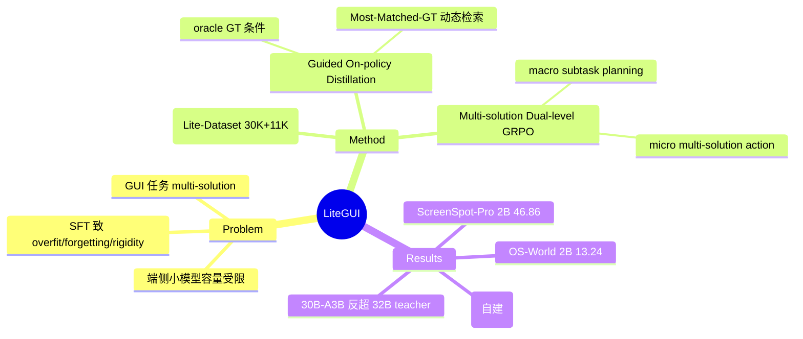

## Summary
LiteGUI 针对端侧小容量 GUI agent 用 SFT 训练易 overfit / catastrophic forgetting / policy rigidity 的问题，提出一套 SFT-free 训练范式：Guided On-policy Distillation（GOD）+ Multi-solution Dual-level GRPO + 自动多解轨迹数据合成。论文自称"据我们所知首次把 distillation 引入 GUI agent 领域"，在 ScreenSpot-Pro / OS-World / 自建 Lite-Bench 上把 Qwen3-VL-2B 蒸馏出的 Lite-GUI-2B 显著抬过同尺寸 baseline，并逼近 32B teacher。

## Problem & Motivation
端侧 vision-language GUI agent 受限于模型容量（论文面向 2B 与 30B-A3B MoE 两档），而常规 supervised fine-tuning 在小模型上会导致 overfitting、catastrophic forgetting 和 policy rigidity——学到的是死记轨迹而非可泛化策略。作者主张：GUI 任务天然是 multi-solution（同一目标有多条正确操作路径），单纯模仿单条 GT 轨迹会诱发 supervision–state mismatch（teacher 指向的状态与 student 实际探索到的状态错位），从而 hallucination。已有 distillation 在 summarization / translation / 算术推理上成熟，但在 GUI agent 域几乎空白，主因是任务复杂度高且可用 teacher 本身也不够强。这正对应本 survey §5.3/§7.13/§9.4 里"知识蒸馏/压缩得到端侧小 GUI agent"这一薄弱子节。

## Method
整体是一套 **SFT-free** 训练 pipeline，三大组件：

1. **Guided On-policy Distillation（GOD / Guided-OPD）**：核心是在 on-policy distillation 中注入 prior knowledge——用 oracle reference（ground-truth）轨迹作为条件来约束 teacher 对 student 当前 rollout 的指导，降低 hallucination。为处理 multi-solution 特性，设计了动态检索：根据 student 的 exploration intent 从一个 diverse solution pool 里检索"最匹配"的参考轨迹再做蒸馏。论文给出三种变体 Single-GT / Multi-GT / Most-Matched-GT（§3.2），主结果与 ablation 用的是 Most-Matched-GT。

2. **Multi-solution Dual-level GRPO**：把 RL 奖励拆成宏观与微观两层——macro level 用强模型（VLM judge）评 subtask/long-horizon planning reward，micro level 做 multi-solution action reward（对多条合法动作做动态匹配，而非只对齐单条 GT）。两层对齐意在解决长程探索里"子任务规划对了但底层执行漂移"的问题（§2.2、§3.3，multi-solution action reward 见 Eq.15）。

3. **Automated Data Generation Pipeline**：半自动生成带 multi-solution 标注的 GUI 轨迹（两阶段：自动轨迹生成 + 标注，附录 A.7），产出 Lite-Dataset——30K GUI 轨迹 + 11K 多解标注样本（§1）。同时构建评测集 Lite-Bench（160 样本，覆盖 File system / Web / Terminal）。

Teacher = Qwen3-VL-32B；student/base 为两档：Qwen3-VL-2B（dense）与 Qwen3-VL-30B-A3B（MoE，约 3B 激活参数）——后者解释了 abstract 里"2B/3B scale"的说法（3B 指 MoE 激活规模）。

## Key Results
- **ScreenSpot-Pro（Table 1，grounding avg acc）**：Lite-GUI-2B 46.86%，相对 baseline Qwen3-VL-2B 40.16% 提升约 +6.7pt；Lite-GUI-30B-A3B 58.95%，已略超 teacher Qwen3-VL-32B 的 58.57%。
- **OS-World（Table 2，desktop task success rate）**：Lite-GUI-2B 13.24%（baseline 6.04%，约翻倍）；Lite-GUI-30B-A3B 22.7%。这是相对更硬的长程 computer-use benchmark，绝对值仍低。
- **Lite-Bench（Table 3，自建 160 样本 SR）**：Lite-GUI-2B 61.76%（baseline 32.35%）；Lite-GUI-30B-A3B 89.26%。注意此为论文自建 benchmark，headline 增益的可比性弱于公开集。
- **Ablation（Table 4）**：Baseline 2B = 40.16 / 6.04 / 33.35（ScreenSpot-Pro / OS-World / Lite-Bench）；+GOD(Most-Matched-GT) 单独 = 42.50 / 11.56 / 55.88；再叠加 dual-level GRPO = 43.13 / 13.24 / 61.76。表明 GOD 贡献主体、GRPO 再补一层，长程/自建集上的相对增益最大。

## Evidence Ledger
| Claim ID | Claim | Type | Source locator | Evidence excerpt | Status |
|:--|:--|:--|:--|:--|:--|
| C1 | 自称首次将 distillation 引入 GUI agent 域 | novelty | §1 | "to the best of our knowledge, represents the first attempt to apply distillation to the GUI agent domain" | source-verified（为论文自我主张，未经独立核查） |
| C2 | ScreenSpot-Pro：Lite-GUI-2B 46.86% vs baseline Qwen3-VL-2B 40.16%，teacher Qwen3-VL-32B 58.57% | number | Table 1 | "Lite-GUI-2B 46.86% … Qwen3-VL-2B 40.16% … Qwen3-VL-32B 58.57%" | source-verified |
| C3 | OS-World：Lite-GUI-2B 13.24% SR vs baseline 6.04% | number | Table 2 | "Lite-GUI-2B: 13.24% … Qwen3-VL-2B: 6.04%" | source-verified |
| C4 | Lite-Bench（自建 160 样本）：Lite-GUI-2B 61.76% vs baseline 32.35% | number/comparability | Table 3 | "Lite-GUI-2B: 61.76% … 32.35%"；Lite-Bench 为论文自建 160 样本集 | source-verified（可比性受限：非公开 benchmark） |
| C5 | Lite-GUI-30B-A3B：58.95% / 22.7% / 89.26%（ScreenSpot-Pro / OS-World / Lite-Bench） | number | Tables 1–3 | "Lite-GUI-30B-A3B: 58.95% … 22.7% … 89.26%" | source-verified |
| C6 | Teacher Qwen3-VL-32B；students Qwen3-VL-2B 与 Qwen3-VL-30B-A3B | setup | §4.1, Appendix A.6 | "Teacher … Qwen3-VL-32B"；students "Qwen3-VL-2B", "Qwen3-VL-30B-A3B" | source-verified |
| C7 | Lite-Dataset = 30K 轨迹 + 11K 多解标注样本 | number | §1 | "30K GUI trajectory data and 11K annotated multi-solution samples" | source-verified |
| C8 | Ablation：GOD 单独 42.50/11.56/55.88，+GRPO 43.13/13.24/61.76 | number | Table 4 | baseline 40.16/6.04/33.35 → +GOD → +GRPO | source-verified（注：ablation 中 Lite-Bench baseline 33.35% 与 Table 3 的 32.35% 存在 1pt 不一致，疑排版） |
| C9 | code/dataset 声明将公开，但正文/arXiv 页均无 URL | license/code | §1, arXiv 页 | "will be publicly released"；未见 github 链接 | source-verified（截至抓取无可用链接） |

## Strengths & Weaknesses
**Strengths**
- 问题 formulation 抓得准：把 GUI 任务的 multi-solution 本质与小模型 SFT 的 policy rigidity 直接对上，用 on-policy distillation + dynamic GT 检索去缓解 supervision–state mismatch，这是比"堆更多模仿数据"更有机制感的路线。
- 端侧动机与本 survey 该子节直接契合：teacher(32B)→student(2B) 蒸馏，且 Lite-GUI-30B-A3B 在 ScreenSpot-Pro 上反超 teacher，说明蒸馏+RL 组合不只是压缩、也有 refine 效果。
- Ablation 层次清晰，能区分 GOD 与 GRPO 各自边际贡献。

**Weaknesses**
- headline 增益很大程度来自自建 Lite-Bench（160 样本），公开集上的绝对提升较温和（ScreenSpot-Pro +6.7pt、OS-World 绝对值仍 13.24%）；缺 AndroidWorld / AndroidControl 等主流 mobile agent benchmark 的对照，"mobile 端侧"这一定位的证据其实偏 desktop（OS-World）。
- 没有报告端侧真机部署指标——latency / memory footprint / energy / 量化后精度，因此"compact/on-device"更多是参数规模层面的主张，而非部署验证（与 vault 里 Ferret-UI Lite 同类缺口）。
- "首次把 distillation 引入 GUI agent"是较强 novelty 主张，但 Mobile-Agent-v3 等已用 trajectory distillation 做数据构造；该 claim 的边界需谨慎对待。
- teacher/student 同属 Qwen3-VL 家族，跨家族蒸馏是否成立未知。

**对领域的意义**：为"端侧小 GUI agent"提供了一条 distillation+RL 的具体配方，可作为该子节的代表数据点与 lightweight baseline；但要支撑"可部署"结论仍缺真机 latency/energy 与主流 mobile benchmark 证据。可与 vault 内 [[Papers/2500-FerretUiLiteLessons|Ferret-UI Lite]]（3B 端侧、混合数据+RL+inference-time tools）、[[Papers/2601-ZonUI3B|ZonUI-3B]]（3B grounding 数据配方）、[[Papers/2604-GoClick|GoClick]]（230M grounding + device-cloud 分工）互为对照，共同构成"grounding 可小模型化、long-horizon 仍是端侧短板"这一 pattern 的证据链。

## Mind Map

## Notes
- 抓取自 arXiv abstract + html 全文（full-text），但两处对模型规模表述略有出入：abstract 说 "2B/3B scale"，html 明确 students 为 Qwen3-VL-2B 与 Qwen3-VL-30B-A3B（MoE ~3B 激活）——已在 Method 里对齐。
- 高风险数字全部照抄原文并标 Table locator，本轮无独立 verifier，verification_status=unverified；Lite-Bench 为论文自建集，引用其数字时须标注可比性限制。
- 待补：若后续拿到 code/checkpoint 或作者补充 latency/内存实测，应升级 rating 并回填 C9。
