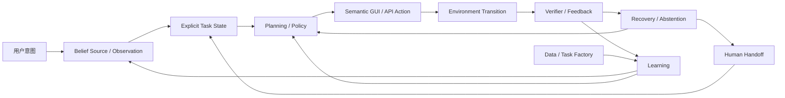

### 3.1 Sequential Decision Formulation

Computer-use agent 的执行过程可以形式化为一个部分可观察序贯决策问题（POMDP）：agent 不能直接读取数字系统的真实状态，只能反复观察、决策、执行并核验，直到任务终止或被判定失败。这不是本文独创的记号——[[Papers/2501-ACUSurvey]]（JAIR 2026，87 篇 ACU agent 的系统综述）与 [[Papers/2412-BrowserGymAgentLab]]（ServiceNow/Mila 的 web agent 研究基础设施）分别从"文献综述"和"系统实现"两条独立路径显式采用了 POMDP 形式化，可视为领域内事实上的通用记号。

标准 POMDP 六元组 $(S, A, O, T, \Omega, R)$ 在 computer-use 场景中的实例化如下：隐藏状态 $s_t \in S$ 是数字环境的真实状态（数据库记录、后端 session、文件系统、通知队列、权限设置），大多不会完整渲染到屏幕上；观测 $o_t$ 是 screenshot、DOM/AXTree、accessibility tree 或 network trace 的组合（[[Papers/2412-BrowserGymAgentLab]] 的 observation space 即包含 task goal、tab 状态、raw screenshot、DOM/AXTree object、唯一 element id、bbox/可见度信息与上一步 action 的 error feedback）；动作 $a_t$ 是 click/tap/type/scroll 等 GUI 动作与 shell/API 调用的组合；指令 $i$ 在整个 episode 内固定，是策略的外生条件变量而非标准元组的一部分——[[Papers/2501-ACUSurvey]] 把这一点显式写成 $a_t \sim \pi(\cdot \mid o_t, i)$；环境转移 $T$ 由浏览器引擎、模拟器或真机执行，往往不可逆；reward/verifier 只在终止步或间歇性地被观察到，构成稀疏反馈。[[Papers/2501-ACUSurvey]] 进一步指出该 taxonomy 刻意做成 technology-agnostic，使 RL-era 的 specialized agent 与当前 foundation-agent-era 的 prompt-based agent 能被放进同一坐标系比较，这也是本节沿用该形式化而非另起炉灶的原因。

这一形式化直接预测了两个后续章节反复出现的结构性难题，而不依赖任何具体架构：其一，部分可观察意味着 belief 维护本身是一个非平凡且易错的子问题——多数实现把 belief 简化为对原始 history $h_t$ 的隐式拼接（screenshot + 文本 token 直接塞进 context），而非显式维护、可核验的状态对象；其二，稀疏且延迟的终止奖励使跨长程步骤的 credit assignment 天然困难，这正是第 7 章反复讨论的训练稳定性瓶颈的形式化根源。[[Papers/2501-ACUSurvey]] 报告的 offline/online 评测差距（同一 agent 在 Mind2Web 上 offline success 12% vs online success 36%）是第一个难题的一个侧面：静态轨迹匹配无法捕捉 belief 与真实环境状态的分歧，只有让 policy 真正与环境交互才能暴露差距。

第一个难题近期得到了一项更直接的诊断证据：[[Papers/2607-GUIStateBelief]] 用成对单通道干预把"看见了什么"与"最终相信什么"分开测量，发现即使模型 image-only accuracy 高达 0.85–0.93，融合 DOM/AXTree 与 screenshot 时仍有 0.30–0.75 的样本会转向陈旧的结构化文本而非正确的像素证据；在零编辑的真实 stale-web 快照上，不同模型服从过期 structure 的比例达 0.38–0.88；更关键的是，在需要至少两步的 episode 中，仅在第一步注入一次错误的结构化证据，最终失败率就升到 0.97–1.00，自恢复率最高只有 0.03。这是单篇诊断研究的发现，不构成领域共识，但它说明"belief 是 history 的一个可靠函数"这一 POMDP 教科书式假设，在当前系统的朴素实现（无 provenance 的 token 拼接）下并不成立——belief 更新本身就是一个尚未解决的可靠性瓶颈，而非工程细节。这为后续架构章节中"显式 task state / belief provenance"路线提供了第一性原理层面的动机。

上述四元组只刻画了单步的输入—输出关系；真实 computer-use 系统在 $o_t$ 与 $a_t$ 之间插入了更多显式阶段，也包含教材式 POMDP 未直接涵盖的恢复与人类介入路径——这是下一节执行闭环的内容。

### 3.2 The Computer-Use Execution Loop

若把 3.1 的抽象元组展开成一个可追踪的运行时闭环，会得到贯穿本综述模型、学习、数据、环境与评测各章的统一执行图：

前向路径（$I \to O \to S \to P \to A \to E$）把 3.1 中的每个符号具体化为一次工程决策：$I$ 是固定不变的指令 $i$；$O$ 对应观测 $o_t$ 及其简化 $o_t \to o_t^*$（如降采样 screenshot、裁剪 DOM）；$S$ 是本应从 $O$ 与历史中提炼出的显式 belief/task state，而非 3.1 讨论过的隐式 token 拼接；$P$ 是策略 $\pi$ 在给定 $S$ 与 $i$ 下产生的规划；$A$ 是动作 grounding $a_t^* \to a_t$ 之后的可执行 GUI/API 动作；$E$ 是环境转移 $T$。这条链上的每一次翻译都在解决上一步暴露的问题，也都会引入新的误差来源——这正是第 4、5、6 章分别沿 interface、data、architecture 三条轴追踪的具体内容。

返回路径（$V \to R \to P/H$，$H \to S$）说明闭环不是单向的："核验—恢复—人类介入"不是边缘情形，而是与前向路径同级的第一等环节。[[Papers/2604-VeriGUI]] 发现 72.3% 的失败来自重复无效动作导致的 timeout，[[Papers/2604-VLAA-GUI]] 报告失败任务中超过 86% 是 false completion——两者共同说明大量失败不是"不会点"，而是"动作没生效却继续相信自己成功"，即 $V$ 未能正确核验、$R$ 未能触发。当 $R$ 判定当前策略无法自行恢复时，闭环提供 $H$（人类介入）作为退出通道，介入后的信息重新写回 $S$（而非重新走一遍 $O$），使执行可以从被修正过的状态继续，而不是从头重新观察。

外层学习路径（$V \to L$，$D \to L$，$L \to O/P$）把单个 episode 的核验信号与任务工厂产出的数据汇总为可学习信号，再反哺观测与策略——这把"闭环学习正在成为新阶段"的论断（详见第 1 章五阶段叙事）落到图上：verifier 与 data 不再只是评测或训练的旁路输入，而是与执行闭环共享同一组状态与反馈。第 5 章（数据）与第 7 章（学习）分别追踪 $D \to L$ 与 $V/L \to O,P$ 这两条边的具体实现；第 8 章（评测）追踪 $E \to V$ 这条边上 verifier 本身的可靠性。

### 3.3 Core Agent Capabilities

评测一个 computer-use agent 时，"成功"本身是一个复合判断，需要按能力层级拆开，同一分数才不会把低层短板（如 grounding 错误）与高层短板（如不知道该停）混为一谈。本文采用如下能力阶梯组织后续各章对能力的讨论，由低到高依次是：

1. grounding accuracy——能否在给定观测中定位正确元素或坐标；
2. step/action correctness——单步动作是否符合任务语义；
3. task outcome——完整任务是否达成真实的功能性成功；
4. long-horizon / cross-app completion——跨多步、多应用的复合任务是否能持续推进；
5. error awareness 与 recovery——能否发现动作未生效并自行纠正；
6. clarification、abstention 与 proactive restraint——能否在指令不明确或证据不足时主动澄清或停止，而不是盲目执行；
7. privacy、safety 与 side effect——能否避免不可逆或有害的副作用。

这一阶梯并非人为堆叠：每一级都在解决前一级留下的问题，也都暴露出新的失效模式。第 1、2 级大致对应 [[Papers/2501-ACUSurvey]] 独立提出的评测层级划分（step-level 的 step success rate / action F1 / element accuracy，task-level 的 task success rate / progress / avg reward），两者从不同角度收敛到同一个"先看单步、再看整体"的结构，可以视为跨来源的交叉验证。第 3 级向第 4 级的跃迁揭示了一个此前被 end-to-end 分数掩盖的缺口：[[Papers/2607-EvoGUI]] 从 Mind2Web/WebLINX 轨迹构造 3,000 个 diagnostic VQA instance，专测 temporal ordering、inverse action/value prediction 与 successor discrimination，最强模型 EvoGain 也仅 60.4，且 model scale 与 GUI specialization 均不能稳定预测这种 state-dynamics 理解能力——这是单篇诊断研究的发现，说明"任务能做到"与"状态转移能被正确建模"是两件事，任务级高分不能反推 agent 真的理解了长程动态。第 5 级同样有具体证据支持其独立性：现有工作报告 error awareness 与 depth-5 recovery 之间存在明显落差（见后续架构章 verification/recovery 小节），"发现错了"本身并不等于"能改回来"。第 6 级的证据来自两组独立研究：[[Papers/2602-AmbiBench]] 显示非交互 mobile agent 在指令降为 Ambiguous 级时 task success rate 直接归零（AutoGLM 从 Detailed 65.2% 降到 Ambiguous 0%），[[Papers/2606-AgenticAbstention]] 在 WebShop、terminal 与 QA 三类 setting 上测 13 个 agent 系统，发现最强 baseline 的 timely abstention recall 也只有 26.7%，且同一 base model 换 scaffold（Codex CLI 约 0.38 vs Terminus 2 约 0.18）abstention 能力差异巨大——两者共同说明"知道何时不做"是一项独立于任务执行能力、且当前普遍薄弱的能力，而非执行能力足够强后的自然副产品。第 7 级（隐私、安全、副作用）在现有证据中呈现出与第 6 级相近但不完全重合的失效模式（判断风险 vs 精确定位敏感信息 vs 预测动作后果），具体证据与机制留待架构与部署相关章节展开。

评测报告能力层级时必须同时绑定 evidence setting：environment version、step budget、verifier 类型、是否 live/real-device、是否同 backbone 对照。否则 leaderboard 差异可能来自环境、预算或 judge 本身，而非方法真实差距——[[Papers/2501-ACUSurvey]] 的 online/offline 差距（36% vs 12%，见 3.1）就是同一能力层级（task outcome）因 evidence setting 不同而产生数倍级差异的直接例证。这条纪律贯穿第 6、8、10 章对具体能力层级的深入讨论。

### 3.4 Environment, Interface, Architecture, Learning, and Evaluation Axes

第 4–8 章分别沿 environment、interface、architecture、data 与 learning、evaluation 六条轴追踪各自的历史演进与开放问题，而非按论文发表时间或方法热词分组。Interface 与 Environment 两轴常被混为一谈，但二者回答的问题不同：Interface 定义观测与动作空间本身（屏幕如何表示、动作如何编码），Environment 定义这些空间背后的运行时能否被 reset、并行、fork、核验与复现——模型与 agent 系统（Architecture 轴）是在给定的 Interface 内工作的使用者，而不是 Interface 的设计者。下表把每条轴的核心问题、当前最强证据与主要瓶颈并列，供读者在进入具体章节前建立坐标：

| 轴 | 对应章节 | 核心问题 | 当前最强证据 | 主要瓶颈 |
|:--|:--|:--|:--|:--|
| Interface | 第 4 章 | 屏幕/状态如何表示为观测，动作如何编码，跨平台观测—动作空间如何统一 | 高分辨率视觉、a11y/DOM hybrid observation 与统一 action schema（如 [[Papers/2412-BrowserGymAgentLab]] 的两层 action space：raw code + high-level action mapping）已支撑起跨 benchmark 的可比 harness | 同一 grounding 精度换平台、换分辨率会显著漂移，接口层的"统一"尚未消灭 out-of-distribution 脆弱性 |
| Environment | 第 4 章 | 如何 reset、并行、fork、verify、隔离并复现状态 | self-hosted software、functional simulator、snapshot engine 已形成供给谱系 | realism–controllability–scalability 三者不可同时最大化 |
| Architecture | 第 6 章 | 模型如何在给定接口内定位元素、编码动作；agent 系统如何规划、记忆、调用工具并管理历史状态；native end-to-end 与 compositional framework 如何取舍 | 高分辨率视觉、专用 grounding head 已显著提升局部能力；native end-to-end 与 compositional framework 各有优势场景 | grounding 提升不会自动转化为长程成功；模块化系统有误差级联、状态所有权不清 |
| Data | 第 5 章 | 如何得到可执行任务、初始状态、轨迹与 validator | task/state/verifier co-generation 正在替代单纯轨迹采集 | judge 噪声、只读偏置、环境绑定 |
| Learning | 第 7 章 | 如何用 SFT、RL、self-improvement 与 test-time search 提升 policy | RLVR 在有 headroom 和可靠 reward 时有效 | reward variance、credit assignment、训练稳定性（3.1 已指出其形式化根源） |
| Evaluation | 第 8 章 | 如何确认真实成功、发现错误、恢复并控制风险 | programmatic verifier 与 interactive verifier 明显优于纯 LLM judge | hidden state、false completion、不可逆副作用 |

这六条轴不是彼此独立的六个话题，而是 3.2 执行闭环在不同截面上的投影：Data 轴的产出（$D$）与 Evaluation 轴的产出（$V$）共同喂给 Learning 轴（$L$），Learning 轴的结果又反过来改写 Interface 轴的观测处理与 Architecture 轴的策略——这正是 3.2 图中 $D \to L$、$V \to L$、$L \to O, P$ 三条边的含义，也是本文判断"闭环学习"是当前主导阶段的形式化基础。

平台（Web / Mobile / Desktop / Hybrid）是 Environment 与 Interface 两轴的联合实例化：同一套算法在不同平台上因可用结构与主要难点不同而获得不同强度的证据支持：

| 平台 | 可利用的结构 | 主要难点 | 代表 setting |
|:--|:--|:--|:--|
| Web | DOM / AXTree / screenshot / network state | live drift、bot detection、transactional state、prompt injection | WebArena、VisualWebArena、Online-Mind2Web |
| Mobile | screenshot / accessibility / emulator state / real device | 小目标、系统弹窗、账号与权限状态、真机漂移 | AndroidWorld、AndroidLab、RealMobile |
| Desktop | screenshot / OS API / files / shell / app state | 跨应用、长程专业 workflow、隐私与不可逆操作 | OSWorld、WindowsWorld、SaaSBench |
| Hybrid | GUI + API / CLI / SDK | 工具路由、语义对齐、权限边界 | [[Papers/2508-ComputerRL]]、[[Papers/2606-WeaveBench]] |

第 9 章（产业与部署）与第 10 章（开放问题）不构成第七、八条独立技术轴，而是把上述六轴的结论分别投射到真实产品化约束（成本、延迟、凭证与权限管理）与尚未解决的研究问题上，避免与本节 taxonomy 重复建轴。
